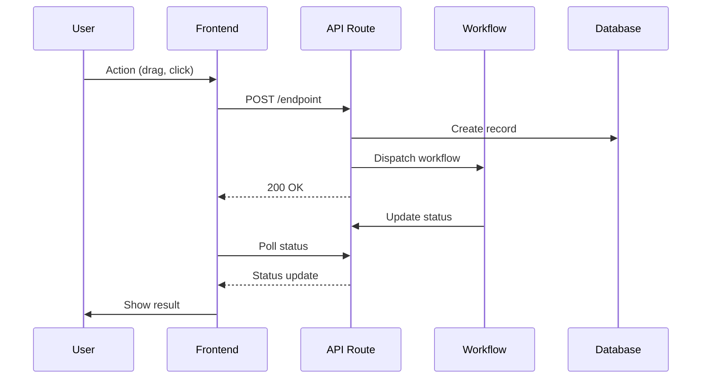
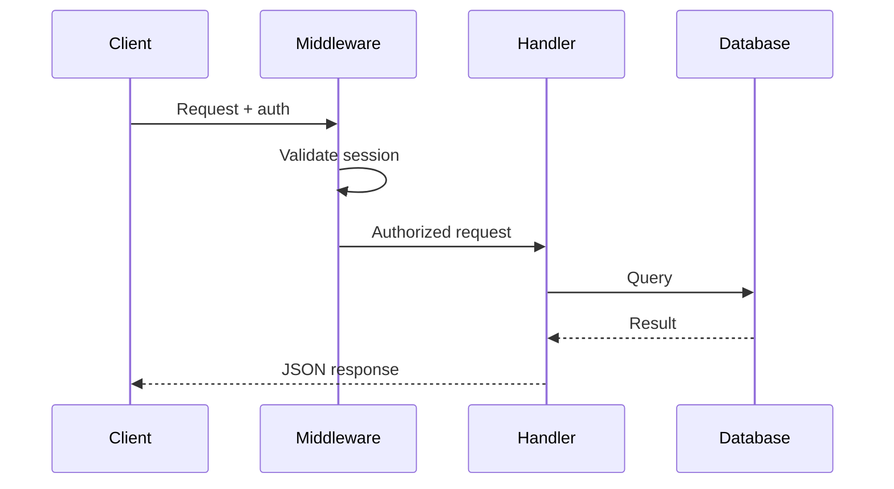

## Context

- Current branch: !`git branch --show-current`
- Changed files: !`git diff main --name-only`
- Feature spec directory: !`ls specs/$(git branch --show-current)/ 2>/dev/null || echo "No feature specs found"`
- Global specs structure: !`find specs/specifications -type f -name "*.md" | head -20`

## Your task

Synchronize the feature branch specifications to global project documentation.

### Rules

1. **Current state only**: Documentation reflects how the system works NOW
2. **No historical markers**: Never use "Added in ticket #X" or "Updated in version Y"
3. **Replace outdated content**: Update existing sections, don't append history
4. **Project-agnostic**: Adapt to whatever spec structure exists in `specs/specifications/`

### Process

1. **Read feature specs** from `specs/{branch}/` (spec.md, plan.md, tasks.md if they exist)

2. **Identify what changed** - new behaviors, APIs, patterns, workflows

3. **Update global functional docs** (`specs/specifications/functional/` or similar):
   - Focus on WHAT the feature does
   - Write from user perspective
   - Use present tense

4. **Update global technical docs** (`specs/specifications/technical/` or similar):
   - Focus on HOW it's implemented
   - Include code examples where relevant
   - Document APIs, data models, integrations

5. **Update CLAUDE.md** only if:
   - New technologies or dependencies added
   - New architectural patterns introduced
   - New commands or conventions

6. **Add/update mermaid sequence diagrams** when the feature involves:
   - Multi-step workflows or state transitions
   - API call sequences
   - Multi-actor interactions (user, system, external services)

   Place diagrams in the most relevant technical doc.

### Mermaid Sequence Diagrams

Generate sequence diagrams for complex flows. Examples:

**Workflow sequence** (user action → system response):


**API sequence** (request → response):


**When to add diagrams**:
- New workflow stages or transitions
- New API endpoints with multiple steps
- Features involving external services (GitHub, Vercel, etc.)
- Complex state machines

**When to update existing diagrams**:
- New steps added to existing workflows
- Changed interactions between components

### Output

Do not commit. Report what was updated:

```
📚 Specifications synchronized

Updated:
- [file]: [what changed]
- [file]: [what changed]
```
