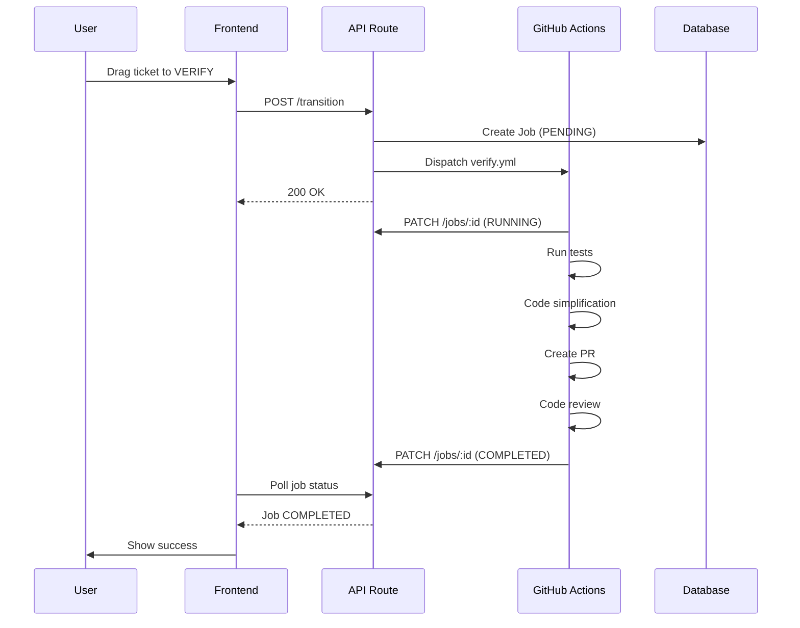
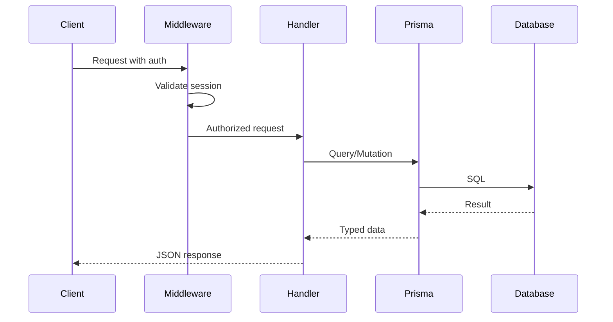

# Sync-Specifications Command

Synchronizes changes from a feature branch's specifications to the global project documentation in `specs/specifications/`.

## Purpose

This command ensures that after implementation or iteration:
1. Global functional specifications reflect current user-facing behaviors
2. Global technical documentation includes implementation details
3. CLAUDE.md is updated with any new patterns or conventions
4. Sequence diagrams visualize complex workflows
5. All documentation reflects CURRENT STATE only

## Process

### Step 1: Identify Feature Context

Determine the feature branch and locate source files:
- `specs/{branch}/spec.md` - Feature specification
- `specs/{branch}/plan.md` - Implementation plan
- `specs/{branch}/tasks.md` - Task breakdown

### Step 2: Update Functional Documentation

Update `/specs/specifications/functional/` files:

| Source | Target | Content |
|--------|--------|---------|
| User scenarios | `01-kanban-board.md` | Board interactions |
| Ticket behaviors | `02-ticket-management.md` | Ticket operations |
| Team features | `03-collaboration.md` | Comments, mentions |
| Workflow changes | `04-automation.md` | AI/job workflows |
| Project features | `05-projects.md` | Multi-project |
| UI/UX patterns | `06-user-interface.md` | Interface behaviors |

**Guidelines**:
- Focus on WHAT the feature does, not HOW
- Write from user perspective
- Use present tense (feature is now live)
- Replace outdated descriptions with current behavior

### Step 3: Update Technical Documentation

Update `/specs/specifications/technical/` files:

| Source | Target | Content |
|--------|--------|---------|
| Architecture decisions | `architecture/` | System design |
| API changes | `api/` | Endpoints, contracts |
| Code patterns | `implementation/` | Integrations, state |
| Testing approach | `quality/` | Testing, deployment |

**Guidelines**:
- Focus on HOW it's implemented
- Include code examples where relevant
- Document API endpoints, data models, schemas
- Replace outdated technical details

### Step 4: Update CLAUDE.md

Update CLAUDE.md ONLY if:
- New technologies or dependencies were added
- New architectural patterns were introduced
- New conventions need to be documented
- New testing patterns were established
- New commands were added

### Step 5: Generate/Update Sequence Diagrams

For features involving workflows, API calls, or multi-step processes, generate or update mermaid sequence diagrams.

**When to create diagrams**:
- New workflow stages or transitions
- API call sequences (frontend → backend → database)
- Multi-actor interactions (user, system, external services)
- Event-driven processes (webhooks, polling, notifications)

**Diagram location**:
- Place in the most relevant technical file
- Or create dedicated `diagrams/` section in complex docs

**Example - Workflow Sequence**:


**Example - API Sequence**:


### Step 6: Validate Consistency

Ensure:
- No contradictions between documents
- Terminology is consistent across all files
- Cross-references are accurate
- Diagrams match described behavior

## Rules

1. **Current state only**: Documentation reflects how the system works NOW, not history
2. **Replace outdated content**: Update existing sections rather than appending history
3. **No historical markers**: Don't use "Updated in ticket #X" or "Added in version Y"
4. **Preserve structure**: Maintain existing document organization
5. **Diagrams for complexity**: Add sequence diagrams when words aren't enough

## Output

Do not commit changes. Report what was updated:

```
📚 Specifications synchronized

Updated files:
- functional/04-automation.md: Updated verify workflow phases
- technical/implementation/integrations.md: Added new commands
- technical/architecture/workflows.md: Added sequence diagram

Documentation reflects current state of branch: {branch}
```
