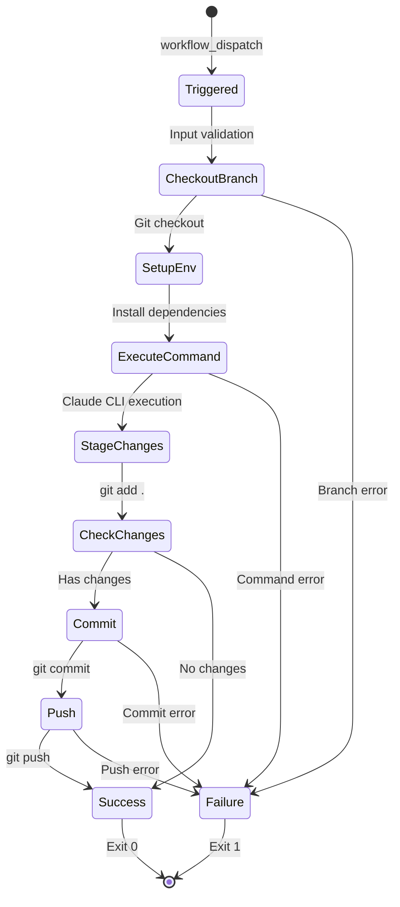

# Data Model: GitHub Actions Spec-Kit Workflow

**Feature**: 016-create-github-actions
**Date**: 2025-10-09
**Status**: Complete

## Overview

This feature does not introduce application-level data models (database tables, Prisma schemas, etc.). Instead, it defines the structure of workflow inputs, outputs, and file artifacts that the GitHub Actions workflow operates on.

## Workflow Input Schema

### workflow_dispatch Inputs

**Schema Definition** (YAML):
```yaml
inputs:
  ticket_id:
    description: 'Ticket identifier (e.g., 016, PROJ-123)'
    required: true
    type: string

  ticketTitle:
    description: 'Ticket title for context'
    required: true
    type: string

  ticketDescription:
    description: 'Detailed ticket description'
    required: true
    type: string

  branch:
    description: 'Target branch (optional for specify, required for others)'
    required: false
    type: string
    default: ''

  command:
    description: 'Spec-kit command to execute'
    required: true
    type: choice
    options:
      - specify
      - plan
      - task
      - implement
      - clarify

  answers_json:
    description: 'JSON answers for clarify command (optional)'
    required: false
    type: string
    default: '{}'
```

**Field Specifications**:

| Field | Type | Required | Constraints | Purpose |
|-------|------|----------|-------------|---------|
| `ticket_id` | string | Yes | Non-empty | Ticket identifier for commit messages and tracking |
| `ticketTitle` | string | Yes | Non-empty | Human-readable title for commit context |
| `ticketDescription` | string | Yes | Non-empty | Full description passed to `/specify` command |
| `branch` | string | No | Valid git branch name | Target branch (created for specify, checked out for others) |
| `command` | choice | Yes | One of 5 values | Spec-kit command to execute |
| `answers_json` | string | No | Valid JSON object | Clarification answers (used only with clarify command) |

**Validation Rules**:
- `ticket_id`: No whitespace, alphanumeric with optional hyphens
- `ticketTitle`: 1-200 characters
- `ticketDescription`: 1-5000 characters (reasonable limit for commit messages)
- `branch`: Must match git branch naming rules (no spaces, special chars)
- `command`: GitHub Actions enforces choice type (compile-time validation)
- `answers_json`: Must be valid JSON when provided (validated by file write)

---

## Workflow Output Schema

### Git Commit Output

**Commit Message Format**:
```
feat(ticket-<id>): <command> - automated spec-kit execution

Generated by GitHub Actions workflow
Ticket: <ticket_id>
Command: <command>
Branch: <branch>
```

**Example**:
```
feat(ticket-016): specify - automated spec-kit execution

Generated by GitHub Actions workflow
Ticket: 016
Command: specify
Branch: 016-create-github-actions
```

**Commit Metadata**:
| Field | Value | Source |
|-------|-------|--------|
| Author Name | `ai-board[bot]` | Git config |
| Author Email | `bot@ai-board.app` | Git config |
| Commit Message | Conventional format | Workflow script |
| Branch | Feature branch | Input or script output |
| Files Changed | Spec-kit outputs | Command execution |

---

### Log Output Schema

**Success Output**:
```
✅ Spec-kit command '<command>' completed successfully
📍 Branch: <branch>
🎫 Ticket: <ticket_id>
```

**Failure Output**:
```
❌ Spec-kit command '<command>' failed
📋 Check logs above for error details
Exit Code: 1
```

**Log Structure**:
- Emoji prefix for visual parsing (✅, ❌, 📍, 🎫, 📋)
- Single-line status messages
- Exit codes (0 = success, 1 = failure)
- GitHub Actions captures all stdout/stderr

---

## File Artifact Schema

### Spec-Kit Generated Files

**specify Command Outputs**:
```
specs/<branch-name>/
└── spec.md              # Feature specification
```

**plan Command Outputs**:
```
specs/<branch-name>/
├── spec.md              # Existing specification
├── plan.md              # Implementation plan
├── research.md          # Research findings
├── data-model.md        # Data model design
├── quickstart.md        # Testing guide
└── contracts/           # API contracts
    └── *.yml            # Contract files
```

**task Command Outputs**:
```
specs/<branch-name>/
└── tasks.md             # Task breakdown
```

**implement Command Outputs**:
```
<various source files>   # Implementation code
                         # Location depends on project structure
```

**clarify Command Outputs**:
```
specs/<branch-name>/
├── spec.md              # Updated with clarifications
└── clarifications.json  # Answers file (committed)
```

### File Metadata

| File Type | Format | Encoding | Line Endings | Generated By |
|-----------|--------|----------|--------------|--------------|
| *.md | Markdown | UTF-8 | LF | Claude CLI |
| *.yml | YAML | UTF-8 | LF | Claude CLI |
| *.json | JSON | UTF-8 | LF | Workflow script |
| Source files | Language-specific | UTF-8 | LF | Claude CLI |

---

## State Transitions

### Workflow Execution States



**State Descriptions**:
- **Triggered**: Workflow started via manual dispatch
- **CheckoutBranch**: Repository checked out to target branch
- **SetupEnv**: Node.js, Python, Claude CLI installed
- **ExecuteCommand**: Spec-kit command executed
- **StageChanges**: All changes staged with `git add .`
- **CheckChanges**: Verify staged changes exist
- **Commit**: Create commit with conventional message
- **Push**: Push to remote branch
- **Success**: Workflow completed successfully
- **Failure**: Error occurred, workflow failed

---

## Command-Specific Data Flow

### specify Command
**Input**: `ticket_id`, `ticketTitle`, `ticketDescription`
**Process**:
1. Run `.specify/scripts/bash/create-new-feature.sh --json "<description>"`
2. Parse JSON output for `BRANCH_NAME`, `SPEC_FILE`
3. Checkout new branch
4. Run `claude /specify "Ticket <id>: <title>\n\n<description>"`
5. Commit `specs/<branch>/spec.md`

**Output**: New branch, spec.md file

---

### plan Command
**Input**: `ticket_id`, `branch` (existing feature branch)
**Process**:
1. Checkout feature branch
2. Run `claude /plan`
3. Claude generates: plan.md, research.md, data-model.md, quickstart.md, contracts/
4. Commit all generated files

**Output**: Planning artifacts in `specs/<branch>/`

---

### task Command
**Input**: `ticket_id`, `branch` (existing feature branch with plan)
**Process**:
1. Checkout feature branch
2. Run `claude /task`
3. Claude generates tasks.md from plan artifacts
4. Commit tasks.md

**Output**: `specs/<branch>/tasks.md`

---

### implement Command
**Input**: `ticket_id`, `branch` (existing feature branch with tasks)
**Process**:
1. Checkout feature branch
2. Run `claude /implement`
3. Claude implements tasks from tasks.md
4. Commit source code changes

**Output**: Implementation files (location varies by project structure)

---

### clarify Command
**Input**: `ticket_id`, `branch`, `answers_json`
**Process**:
1. Checkout feature branch
2. Write `answers_json` to `clarifications.json`
3. Run `claude /clarify --answers clarifications.json`
4. Claude updates spec.md with clarifications
5. Commit updated spec.md and clarifications.json

**Output**: Updated spec.md, clarifications.json

---

## Relationships and Dependencies

### Input Dependencies
```
ticket_id ────┐
ticketTitle ──┼──> specify command ──> branch creation
ticketDescription┘

branch ────> plan/task/implement/clarify commands
           (requires existing branch)

answers_json ──> clarify command only
              (optional for others, ignored if provided)
```

### File Dependencies
```
spec.md ──────> plan.md
plan.md ──────> tasks.md
tasks.md ─────> implementation files
spec.md ──────> clarifications.json (via clarify)
```

### Execution Order Dependencies
```
1. specify ──> creates branch + spec.md
2. plan ─────> requires spec.md, creates plan artifacts
3. task ─────> requires plan artifacts, creates tasks.md
4. implement ─> requires tasks.md, creates source files
5. clarify ──> updates spec.md with clarifications
   (can run after specify, before or after plan)
```

---

## Validation Rules

### Input Validation (GitHub Actions Level)
- Type checking: string, choice types enforced
- Required field validation: GitHub UI prevents submission without required fields
- Choice validation: Only 5 allowed command values

### Runtime Validation (Workflow Level)
- Branch existence: `git checkout` fails if branch doesn't exist (except specify)
- Git conflicts: `git push` fails if branch diverged
- File changes: `git diff --staged --quiet` detects no-change scenarios

### Claude CLI Validation
- Command syntax: Invalid commands exit with non-zero status
- File permissions: Write failures captured via exit codes
- API authentication: Missing ANTHROPIC_API_KEY fails CLI execution

---

## Error Cases and Handling

| Error Condition | Detection | Handling | User Impact |
|-----------------|-----------|----------|-------------|
| Missing branch (non-specify) | `git checkout` fails | Exit 1, show error | Workflow fails, clear message |
| Invalid command | Case statement default | Exit 1, "Unknown command" | Workflow fails with guidance |
| No changes to commit | `git diff --staged --quiet` | Skip commit, success message | Workflow succeeds, no commit |
| Git push conflict | `git push` fails | Exit 1, show conflict | Workflow fails, user resolves |
| Missing API key | Claude CLI fails | Exit 1, auth error | Workflow fails, secret check |
| Timeout (120 min) | GitHub Actions | Cancel job | Workflow cancelled, partial work |

---

## Schema Versioning

**Current Version**: 1.0.0
**Compatibility**:
- Workflow schema changes require workflow file update (`.github/workflows/speckit.yml`)
- Input schema backward compatible (new optional fields only)
- Output schema stable (conventional commits, emoji indicators)

**Future Extensions** (not in current scope):
- Additional command types (test, deploy, etc.)
- Webhook notifications on completion
- Parallel command execution
- Custom commit message templates

---

**Status**: Data model complete, ready for contract generation
