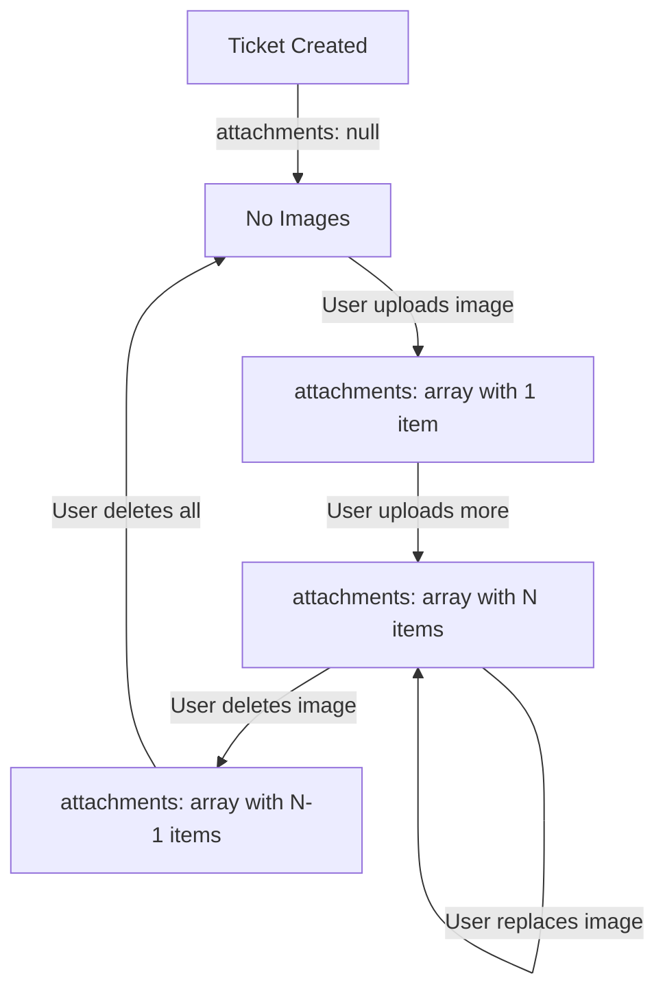
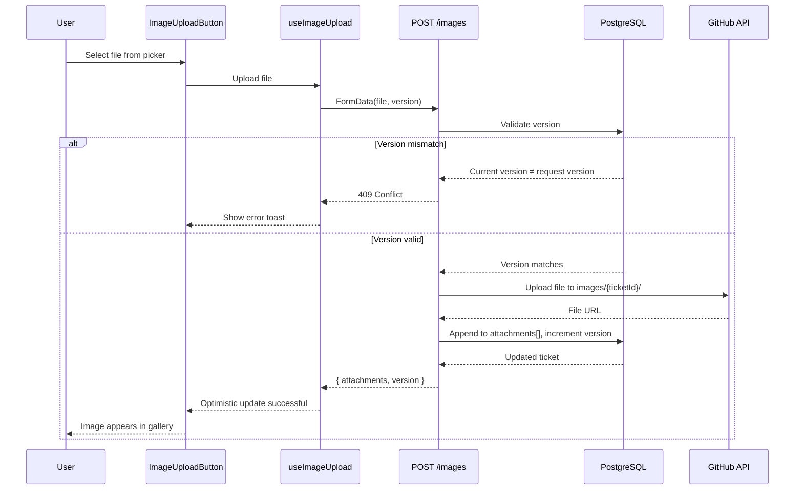

# Data Model: Image Management in Ticket Details

**Feature**: Image Management in Ticket Details
**Branch**: `039-consult-update-images`
**Date**: 2025-01-21

## Overview

This feature extends the existing ticket data model to support image gallery viewing and editing. **No database schema changes are required** - all functionality uses the existing `Ticket.attachments` JSON field and `ticket.version` concurrency control field.

## Database Entities

### Ticket (Existing - No Changes)

**Table**: `tickets`
**Schema Location**: `prisma/schema.prisma`

**Relevant Fields**:
```prisma
model Ticket {
  id          Int       @id @default(autoincrement())
  title       String    @db.VarChar(100)
  description String?   @db.VarChar(1000)
  stage       Stage     @default(INBOX)
  version     Int       @default(1)        // Optimistic concurrency control
  attachments Json?     @db.JsonB          // Array of TicketAttachment objects
  projectId   Int

  // ... other fields (createdAt, updatedAt, etc.)
}
```

**Attachment Field Structure**:
- Type: `Prisma.JsonValue` (mapped to `TicketAttachment[]` in TypeScript)
- Storage: PostgreSQL JSONB column
- Default: `null` (no attachments)
- Example value:
```json
[
  {
    "type": "uploaded",
    "url": "https://github.com/owner/repo/blob/main/images/123/screenshot.png",
    "filename": "screenshot.png",
    "mimeType": "image/png",
    "sizeBytes": 245678,
    "uploadedAt": "2025-01-21T14:30:00.000Z"
  },
  {
    "type": "external",
    "url": "https://example.com/mockup.jpg",
    "filename": "mockup.jpg",
    "mimeType": "image/jpeg",
    "sizeBytes": 0,
    "uploadedAt": "2025-01-21T15:45:00.000Z"
  }
]
```

**Operations**:
- **Read**: Fetch attachments array when loading ticket
- **Add**: Append new `TicketAttachment` object to array, increment version
- **Remove**: Filter out attachment at index, increment version
- **Replace**: Update attachment at index, increment version

**Concurrency Control**:
- `version` field incremented on every attachment modification
- API validates version in request matches current version before update
- Returns 409 Conflict if mismatch detected

---

## TypeScript Interfaces

### TicketAttachment (Existing)

**Location**: `app/lib/types/ticket.ts`
**Status**: Already implemented - no changes needed

```typescript
export interface TicketAttachment {
  /** Attachment source type */
  type: 'uploaded' | 'external';

  /** GitHub path (for uploaded) or external URL (for external) */
  url: string;

  /** Original filename or alt text from markdown */
  filename: string;

  /** MIME type of the image (e.g., "image/png") */
  mimeType: string;

  /** File size in bytes (0 for external URLs) */
  sizeBytes: number;

  /** ISO 8601 timestamp when attachment was created */
  uploadedAt: string;
}
```

**Validation Rules**:
- `type`: Must be 'uploaded' or 'external'
- `url`: Non-empty string, valid URL format
- `filename`: Non-empty string, max 255 characters, sanitized (no path traversal)
- `mimeType`: Must match allowed formats: `image/jpeg`, `image/png`, `image/gif`, `image/webp`
- `sizeBytes`: Non-negative integer, max 10MB (10,485,760 bytes) for uploaded images
- `uploadedAt`: ISO 8601 date string

---

## React Component State Models

### ImageGalleryState (New)

**Location**: `components/ticket/image-gallery.tsx` (component local state)
**Purpose**: Manages image gallery UI state

```typescript
interface ImageGalleryState {
  /** Whether gallery is expanded (images loaded) */
  isExpanded: boolean;

  /** Index of currently selected image for lightbox */
  selectedImageIndex: number | null;

  /** Whether lightbox is open */
  isLightboxOpen: boolean;

  /** Loading state for image fetching */
  isLoadingImages: boolean;
}
```

**State Transitions**:
- Initial: `{ isExpanded: false, selectedImageIndex: null, isLightboxOpen: false, isLoadingImages: false }`
- User clicks "View Images" → `isExpanded: true, isLoadingImages: true`
- Images loaded → `isLoadingImages: false`
- User clicks image thumbnail → `selectedImageIndex: <index>, isLightboxOpen: true`
- User closes lightbox → `isLightboxOpen: false, selectedImageIndex: null`

---

### ImageUploadMutationState (New)

**Location**: `lib/hooks/use-image-upload.ts` (TanStack Query mutation state)
**Purpose**: Manages image upload operation state

```typescript
interface ImageUploadMutationVariables {
  /** File object from input[type="file"] */
  file: File;

  /** Project ID for API route */
  projectId: number;

  /** Ticket ID for API route */
  ticketId: number;

  /** Current ticket version for concurrency control */
  version: number;
}

interface ImageUploadMutationData {
  /** Updated attachments array after upload */
  attachments: TicketAttachment[];

  /** New ticket version */
  version: number;
}
```

**TanStack Query States**:
- `isIdle`: No upload in progress
- `isLoading`: Upload in progress (file being sent to server)
- `isSuccess`: Upload completed successfully
- `isError`: Upload failed (network error, validation error, conflict)

**Error Types**:
- Validation error (400): Invalid file type, size too large
- Permission error (403): Cannot edit images in current stage
- Conflict error (409): Ticket version mismatch (another user edited)
- Network error (500): Server error or connection failure

---

## API Request/Response Models

### GET /api/projects/:projectId/tickets/:id/images

**Request**: No body (GET request)

**Response (200)**:
```typescript
interface GetImagesResponse {
  images: Array<TicketAttachment & { index: number }>;
}
```

**Example**:
```json
{
  "images": [
    {
      "index": 0,
      "type": "uploaded",
      "url": "https://github.com/owner/repo/blob/main/images/123/screenshot.png",
      "filename": "screenshot.png",
      "mimeType": "image/png",
      "sizeBytes": 245678,
      "uploadedAt": "2025-01-21T14:30:00.000Z"
    }
  ]
}
```

---

### POST /api/projects/:projectId/tickets/:id/images

**Request** (multipart/form-data):
```typescript
interface UploadImageRequest {
  file: File;           // FormData field: 'file'
  version: number;      // FormData field: 'version'
}
```

**Response (200)**:
```typescript
interface UploadImageResponse {
  attachments: TicketAttachment[];
  version: number;
}
```

---

### DELETE /api/projects/:projectId/tickets/:id/images/:attachmentIndex

**Request** (JSON):
```typescript
interface DeleteImageRequest {
  version: number;      // Ticket version for concurrency control
}
```

**Response (200)**:
```typescript
interface DeleteImageResponse {
  attachments: TicketAttachment[];
  version: number;
}
```

---

### PUT /api/projects/:projectId/tickets/:id/images/:attachmentIndex

**Request** (multipart/form-data):
```typescript
interface ReplaceImageRequest {
  file: File;           // FormData field: 'file'
  version: number;      // FormData field: 'version'
}
```

**Response (200)**:
```typescript
interface ReplaceImageResponse {
  attachments: TicketAttachment[];
  version: number;
}
```

---

## Validation Schemas (Zod)

### File Upload Validation

**Location**: `lib/schemas/ticket-image.ts` (new file)

```typescript
import { z } from 'zod';

/**
 * Allowed image MIME types
 */
const ALLOWED_MIME_TYPES = [
  'image/jpeg',
  'image/png',
  'image/gif',
  'image/webp',
] as const;

/**
 * Maximum file size: 10MB
 */
const MAX_FILE_SIZE_BYTES = 10 * 1024 * 1024; // 10MB

/**
 * Schema for validating uploaded image files
 */
export const imageFileSchema = z.object({
  file: z.instanceof(File)
    .refine((file) => file.size > 0, 'File cannot be empty')
    .refine((file) => file.size <= MAX_FILE_SIZE_BYTES, `File size must be less than 10MB`)
    .refine(
      (file) => ALLOWED_MIME_TYPES.includes(file.type as any),
      `File type must be one of: ${ALLOWED_MIME_TYPES.join(', ')}`
    ),
  version: z.number().int().positive(),
});

/**
 * Schema for validating attachment index parameter
 */
export const attachmentIndexSchema = z.number()
  .int()
  .nonnegative()
  .refine((index) => index < 100, 'Attachment index out of range'); // Reasonable upper bound

/**
 * Schema for delete/replace request body
 */
export const imageOperationSchema = z.object({
  version: z.number().int().positive(),
});
```

---

## State Transitions

### Ticket Attachments Array Lifecycle



### Image Upload Operation



---

## Performance Considerations

### Data Fetching Strategy

**Lazy Loading**:
- Ticket query includes `attachments` field (metadata only, ~500 bytes per image)
- Actual image files NOT fetched until user clicks "View Images"
- TanStack Query caching prevents redundant fetches

**Cache Configuration**:
```typescript
// TanStack Query hook configuration
{
  queryKey: ['ticket', projectId, ticketId, 'images'],
  queryFn: fetchTicketImages,
  staleTime: 5 * 60 * 1000,        // 5 minutes
  cacheTime: 30 * 60 * 1000,       // 30 minutes
  enabled: isGalleryExpanded,      // Only fetch when gallery expanded
}
```

**Optimistic Updates**:
- Mutations update UI immediately before API call
- Rollback on error
- Refetch on success to ensure consistency

---

## Relationships

```
User (via session)
  └── has access to → Project
                        └── contains → Ticket
                                       └── has → Ticket.attachments (TicketAttachment[])
                                                 └── references → GitHub file (images/{ticketId}/*)
```

**No foreign key constraints** - attachments stored as denormalized JSON array for simplicity.

---

## Migration Strategy

**Database Changes**: None required ✅

**Data Migration**: None required ✅

**Backwards Compatibility**:
- Existing tickets with `attachments: null` → treated as empty array
- Existing tickets with attachments → continue working as-is
- New gallery UI layers on top of existing data model

---

## Summary

This feature requires **zero database changes**. All functionality implemented using:
- Existing `Ticket.attachments` JSON field (PostgreSQL JSONB)
- Existing `Ticket.version` field (optimistic concurrency control)
- Client-side state management (React + TanStack Query)
- GitHub repository for file storage (existing pattern)

Clean separation of concerns:
- **Database**: Stores metadata only (TicketAttachment objects)
- **GitHub**: Stores actual image files
- **Client**: Manages UI state, lazy loading, caching
