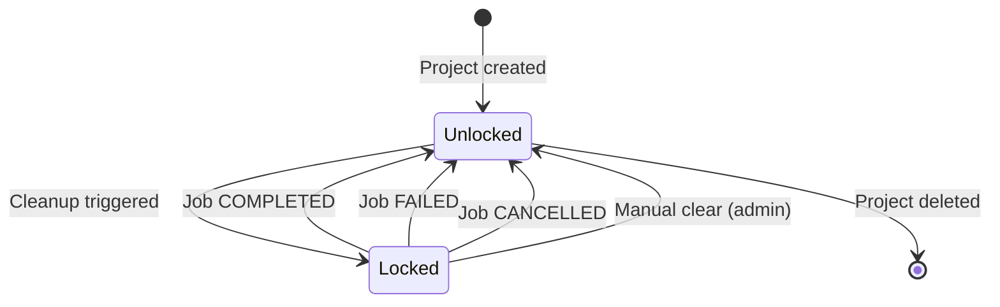

# Data Model: Clean Workflow

**Feature**: Clean Workflow
**Branch**: 090-1492-clean-workflow
**Date**: 2025-11-21

## Overview

This document defines the data model changes required to support the Clean Workflow feature, including schema modifications, new entities, and relationships.

---

## Schema Changes

### Modified Entities

#### 1. Project (Modified)

**Purpose**: Track active cleanup operations at project level

**New Field**:
```prisma
model Project {
  id                  Int                 @id @default(autoincrement())
  name                String              @db.VarChar(100)
  description         String              @db.VarChar(1000)
  githubOwner         String              @db.VarChar(100)
  githubRepo          String              @db.VarChar(100)
  userId              String
  deploymentUrl       String?             @db.VarChar(500)
  key                 String              @unique @db.VarChar(6)
  createdAt           DateTime            @default(now())
  updatedAt           DateTime
  clarificationPolicy ClarificationPolicy @default(AUTO)

  // NEW FIELD
  activeCleanupJobId  Int?                // Nullable FK to Job (cleanup in progress)

  user                User                @relation(fields: [userId], references: [id], onDelete: Cascade)
  tickets             Ticket[]
  members             ProjectMember[]

  @@unique([githubOwner, githubRepo])
  @@index([githubOwner, githubRepo])
  @@index([userId])
  @@index([key])
  @@index([activeCleanupJobId]) // NEW INDEX for lock checks
}
```

**Changes**:
- Added `activeCleanupJobId Int?` - nullable foreign key to Job table
- Added index on `activeCleanupJobId` for efficient lock check queries

**Validation Rules**:
- `activeCleanupJobId` can be NULL (no cleanup in progress)
- When NOT NULL, must reference valid Job record with command='clean'
- Only one cleanup job can be active per project at a time (enforced by business logic, not DB constraint)

**State Transitions**:
- `NULL` → `Job.id` when cleanup triggered
- `Job.id` → `NULL` when cleanup completes/fails/cancels

**Relationships**:
- One-to-one (optional) with Job table
- No cascade delete (cleanup jobs can outlive cleanup state)

---

#### 2. WorkflowType Enum (Modified)

**Purpose**: Add new workflow type for cleanup tickets

**Modification**:
```prisma
enum WorkflowType {
  FULL    // Normal workflow: INBOX → SPECIFY → PLAN → BUILD → VERIFY → SHIP
  QUICK   // Quick workflow: INBOX → BUILD → VERIFY → SHIP
  CLEAN   // NEW: Cleanup workflow: (triggered) → BUILD → VERIFY → SHIP
}
```

**Usage**:
- Set to `CLEAN` when cleanup ticket is created
- Used to filter cleanup tickets in queries (find last cleanup date)
- Used to identify cleanup jobs vs. feature implementation jobs

**Validation**:
- Must be one of: FULL, QUICK, CLEAN
- Immutable once set (workflow type doesn't change during ticket lifecycle)

---

### No New Tables Required

The feature reuses existing entities:
- **Ticket**: Cleanup tickets are regular tickets with `workflowType=CLEAN`
- **Job**: Cleanup jobs are regular jobs with `command='clean'`
- **Project**: Extended with `activeCleanupJobId` field

This minimizes schema complexity and leverages existing infrastructure for:
- Job status tracking and polling
- Ticket lifecycle management
- Workflow dispatching
- Authorization and access control

---

## Entity Relationships

### Relationship Diagram

```
Project (1) ──────┐
    │             │
    │ owns        │ optional lock
    │             │
    ↓             ↓
Ticket (*)    Job (0..1)
    │             ↑
    │ tracks      │
    └─────────────┘
```

**Relationships**:

1. **Project → Ticket** (One-to-Many, existing)
   - One project has many tickets
   - Cleanup tickets are regular tickets with special properties

2. **Project → Job** (One-to-One optional, NEW)
   - One project can have zero or one active cleanup job
   - Via `activeCleanupJobId` field
   - Represents current cleanup lock state

3. **Ticket → Job** (One-to-Many, existing)
   - One ticket can have multiple jobs (retries, re-runs)
   - Cleanup tickets create cleanup jobs

---

## Field Specifications

### Project.activeCleanupJobId

| Attribute | Value |
|-----------|-------|
| **Type** | `Int?` (nullable integer) |
| **Purpose** | Track active cleanup job for transition locking |
| **Default** | `NULL` (no cleanup in progress) |
| **Nullable** | Yes |
| **Index** | Yes (for efficient lock checks) |
| **Validation** | Must reference valid Job.id when NOT NULL |
| **Lifecycle** | Set on cleanup start, cleared on cleanup end |

**Business Rules**:
- Only cleanup jobs (command='clean') can be referenced
- Must be cleared when job reaches terminal state (COMPLETED/FAILED/CANCELLED)
- Multiple projects can have active cleanups simultaneously (per-project lock, not global)
- Frontend queries this field to show cleanup in progress banner

**Example Values**:
- `NULL` - No cleanup in progress, transitions allowed
- `1234` - Cleanup job #1234 is active, transitions blocked

---

### WorkflowType.CLEAN

| Attribute | Value |
|-----------|-------|
| **Type** | Enum value |
| **Purpose** | Identify cleanup tickets and workflows |
| **Usage** | Set on ticket creation for cleanup operations |
| **Immutable** | Yes (doesn't change after ticket creation) |

**Business Rules**:
- Cleanup tickets always start in BUILD stage (skip INBOX, SPECIFY, PLAN)
- Cleanup ticket title follows pattern: "Clean [YYYY-MM-DD]"
- Description contains list of shipped branches being analyzed
- Only one cleanup ticket should be in progress per project (enforced by activeCleanupJobId)

**Example Usage**:
```typescript
// Create cleanup ticket
const cleanupTicket = await prisma.ticket.create({
  data: {
    title: `Clean ${new Date().toISOString().split('T')[0]}`,
    description: 'Analyzing branches: 090-feature-a, 091-feature-b',
    stage: 'BUILD',
    workflowType: 'CLEAN', // Sets type
    projectId: 1,
    ticketNumber: getNextTicketNumber(),
    ticketKey: `${projectKey}-${ticketNumber}`
  }
});
```

---

## Migration Plan

### Migration File

**File**: `prisma/migrations/[timestamp]_add_cleanup_workflow/migration.sql`

**Up Migration**:
```sql
-- Add CLEAN to WorkflowType enum
ALTER TYPE "WorkflowType" ADD VALUE 'CLEAN';

-- Add activeCleanupJobId to Project
ALTER TABLE "Project" ADD COLUMN "activeCleanupJobId" INTEGER;

-- Create index for efficient lock checks
CREATE INDEX "Project_activeCleanupJobId_idx" ON "Project"("activeCleanupJobId");

-- Optional: Add foreign key constraint
-- (Not strictly required, business logic ensures validity)
-- ALTER TABLE "Project" ADD CONSTRAINT "Project_activeCleanupJobId_fkey"
--   FOREIGN KEY ("activeCleanupJobId") REFERENCES "Job"("id") ON DELETE SET NULL;
```

**Down Migration**:
```sql
-- Remove index
DROP INDEX IF EXISTS "Project_activeCleanupJobId_idx";

-- Remove column
ALTER TABLE "Project" DROP COLUMN IF EXISTS "activeCleanupJobId";

-- Note: Cannot remove enum value in PostgreSQL without recreating entire enum
-- Manual intervention required for full rollback
```

### Migration Command

```bash
# Generate migration
npx prisma migrate dev --name add_cleanup_workflow

# Apply to production
npx prisma migrate deploy
```

### Backward Compatibility

- ✅ Existing projects: `activeCleanupJobId` defaults to NULL (no change in behavior)
- ✅ Existing tickets: No changes (FULL/QUICK workflows unaffected)
- ✅ Existing jobs: No changes (cleanup jobs are new, don't conflict)
- ✅ API responses: New field is optional, existing clients ignore it
- ✅ Database queries: Existing queries unaffected (don't reference new field)

### Rollback Strategy

**If rollback needed after deployment**:

1. **Stop all cleanup workflows**: Prevent new cleanup jobs from starting
2. **Clear active locks**: `UPDATE "Project" SET "activeCleanupJobId" = NULL;`
3. **Remove column**: Apply down migration (SQL above)
4. **Note**: CLEAN enum value cannot be removed without recreating enum (low risk, can remain)

**Risk Level**: Low
- New field is nullable and optional
- No breaking changes to existing functionality
- Cleanup feature is additive (doesn't modify existing workflows)

---

## Data Validation Rules

### Ticket Validation (CLEAN type)

```typescript
import { z } from 'zod';

const CleanupTicketSchema = z.object({
  title: z.string().regex(/^Clean \d{4}-\d{2}-\d{2}$/), // "Clean YYYY-MM-DD"
  description: z.string().min(1).max(2500),
  stage: z.literal('BUILD'), // Always starts in BUILD
  workflowType: z.literal('CLEAN'),
  projectId: z.number().int().positive(),
  ticketNumber: z.number().int().positive(),
  ticketKey: z.string().regex(/^[A-Z0-9]{3,6}-\d+$/),
});
```

### Project Lock Validation

```typescript
const ProjectWithLockSchema = z.object({
  id: z.number().int().positive(),
  activeCleanupJobId: z.number().int().positive().nullable(),
  // ... other fields
});

// Business logic validation
async function validateCleanupLock(projectId: number): Promise<boolean> {
  const project = await prisma.project.findUnique({
    where: { id: projectId },
    include: {
      jobs: {
        where: { id: project.activeCleanupJobId ?? 0 },
        select: { status: true, command: true }
      }
    }
  });

  if (!project?.activeCleanupJobId) return false; // No lock

  const cleanupJob = project.jobs[0];
  if (!cleanupJob) return false; // Orphaned lock (self-heal)

  // Lock is valid if job is PENDING or RUNNING
  return ['PENDING', 'RUNNING'].includes(cleanupJob.status);
}
```

---

## Query Patterns

### Find Last Cleanup Date

```typescript
async function getLastCleanupDate(projectId: number): Promise<Date> {
  const lastCleanup = await prisma.ticket.findFirst({
    where: {
      projectId,
      workflowType: 'CLEAN',
      stage: { in: ['BUILD', 'VERIFY', 'SHIP'] } // Exclude failed (INBOX)
    },
    orderBy: { createdAt: 'desc' },
    select: { createdAt: true }
  });

  return lastCleanup?.createdAt || new Date(0); // Epoch if first cleanup
}
```

### Check if Project is Locked

```typescript
async function isProjectLocked(projectId: number): Promise<boolean> {
  const project = await prisma.project.findUnique({
    where: { id: projectId },
    select: { activeCleanupJobId: true }
  });

  if (!project?.activeCleanupJobId) return false;

  const job = await prisma.job.findUnique({
    where: { id: project.activeCleanupJobId },
    select: { status: true }
  });

  return job ? ['PENDING', 'RUNNING'].includes(job.status) : false;
}
```

### Find Shipped Branches Since Last Clean

```typescript
async function getShippedBranches(
  projectId: number,
  sinceDate: Date
): Promise<string[]> {
  const tickets = await prisma.ticket.findMany({
    where: {
      projectId,
      stage: 'SHIP',
      updatedAt: { gt: sinceDate },
      branch: { not: null }
    },
    select: { branch: true },
    orderBy: { updatedAt: 'desc' }
  });

  return tickets
    .filter(t => t.branch !== null)
    .map(t => t.branch as string);
}
```

---

## Index Strategy

### Existing Indexes (Used by Feature)

```prisma
// Ticket indexes (already exist)
@@index([projectId])           // For finding project tickets
@@index([stage])               // For filtering by SHIP stage
@@index([updatedAt])           // For date range queries
@@index([projectId, workflowType]) // For finding CLEAN tickets

// Job indexes (already exist)
@@index([ticketId])            // For finding ticket jobs
@@index([status])              // For filtering RUNNING jobs
@@index([projectId])           // For finding project jobs
```

### New Index (Required)

```prisma
// Project index (NEW)
@@index([activeCleanupJobId])  // For lock check queries
```

**Rationale**:
- Lock checks happen on every transition attempt
- Index ensures O(1) lookup performance
- Small overhead (nullable integer field)

---

## State Machine

### Project Lock State Transitions



**States**:
- **Unlocked**: `activeCleanupJobId = NULL`, transitions allowed
- **Locked**: `activeCleanupJobId = <job_id>`, transitions blocked

**Transitions**:
- Unlocked → Locked: Cleanup API called, ticket + job created atomically
- Locked → Unlocked: Job status updated to terminal state, lock cleared

---

## Summary

### Schema Impact

| Entity | Change | Migration Risk |
|--------|--------|---------------|
| Project | Add nullable field | Low (backward compatible) |
| WorkflowType | Add enum value | Low (additive only) |
| Ticket | No changes | None |
| Job | No changes | None |

### Performance Impact

| Operation | Before | After | Delta |
|-----------|--------|-------|-------|
| Transition check | 1 query | 2-3 queries | +10-20ms |
| Project list | 1 query | 1 query | 0ms |
| Ticket creation | 1 query | 1 query | 0ms |
| Cleanup trigger | N/A | 1 transaction | +50-100ms |

**Overall**: Minimal performance impact (<50ms per transition for lock checks)

---

**Data Model Complete**: Ready for API contract generation (Phase 1 continuation).
