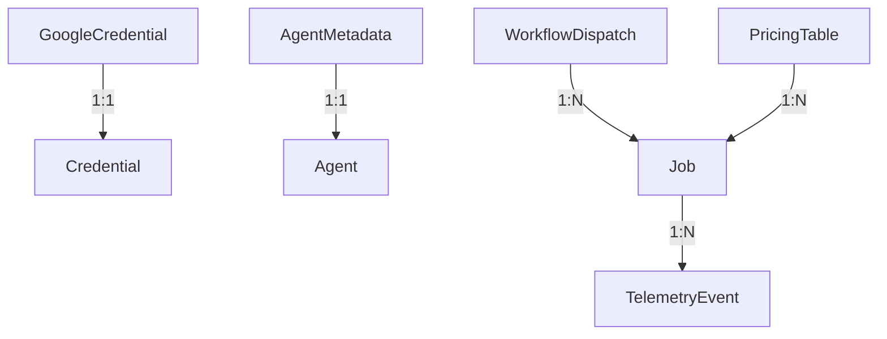
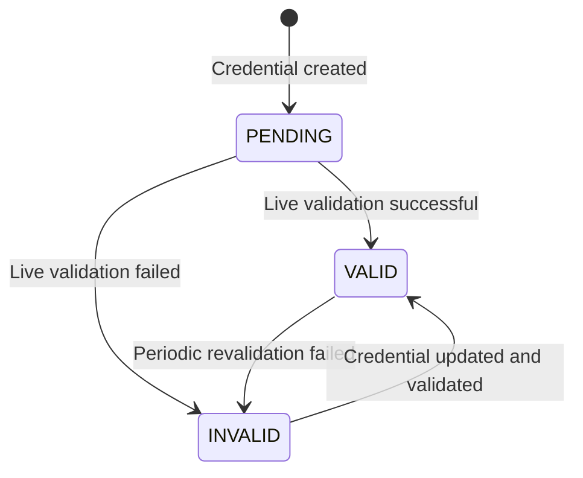
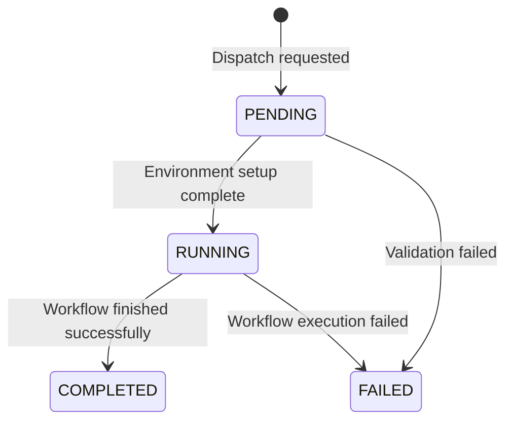
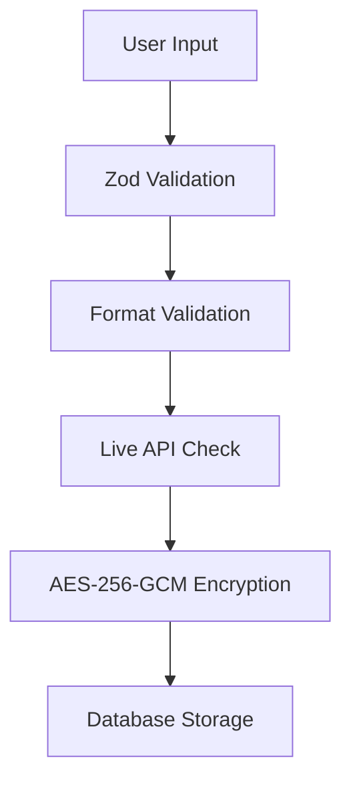
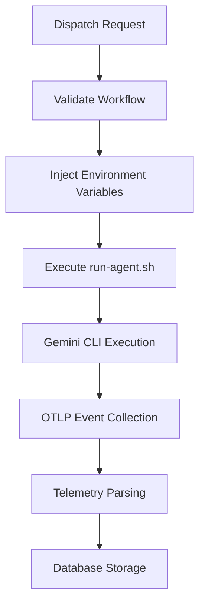
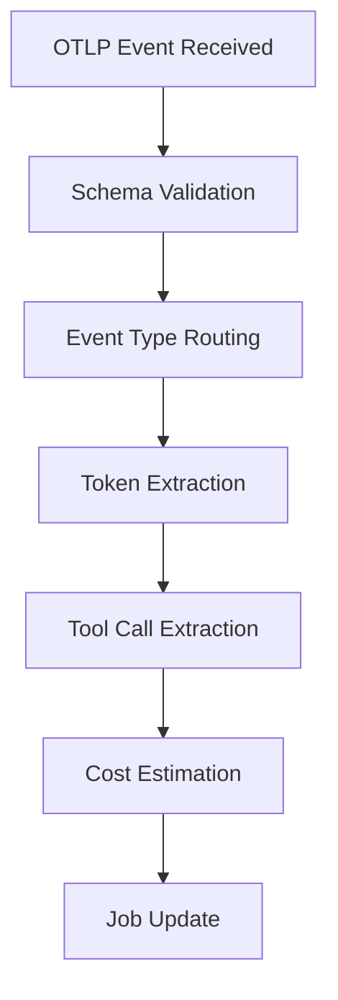

# Data Model: Add Gemini CLI as AI Agent

## Entity Relationship Diagram



## Core Entities

### 1. GoogleCredential

**Purpose**: Store and manage Google AI Studio credentials

**Fields**:
```typescript
interface GoogleCredential {
  id: string; // UUID
  provider: 'GOOGLE'; // Enum
  apiKey?: string; // Optional API key
  oauthToken?: string; // Optional OAuth token
  validationStatus: 'PENDING' | 'VALID' | 'INVALID'; // Enum
  encryptedData: string; // AES-256-GCM encrypted blob
  createdAt: Date;
  updatedAt: Date;
  deletedAt?: Date; // Soft delete
  userId: string; // Foreign key
}
```

**Validation Rules**:
- `apiKey`: Must match pattern `AIza[\w-]{35}` if provided
- `oauthToken`: Must be valid JWT if provided
- At least one of `apiKey` or `oauthToken` must be provided
- `encryptedData`: Must be valid AES-256-GCM encrypted string

**Relationships**:
- Belongs to User (1:1)
- Extends base Credential entity

**State Transitions**:


### 2. AgentMetadata

**Purpose**: Define display and behavioral properties for Gemini agent

**Fields**:
```typescript
interface AgentMetadata {
  agent: 'GEMINI'; // Enum value
  label: 'Gemini'; // Display name
  iconPath: '/agents/gemini.svg'; // Icon asset path
  description: 'Google AI Studio agent for code generation and analysis';
  isAvailable: boolean; // Availability flag
  supportedWorkflows: Array<'speckit.yml' | 'quick-impl.yml' | 'iterate.yml'>;
  defaultModel: 'gemini-1.5-pro';
}
```

**Validation Rules**:
- `agent`: Must be unique across all agents
- `iconPath`: Must point to existing SVG asset
- `supportedWorkflows`: Must be non-empty array

**Relationships**:
- Extends base Agent entity

### 3. WorkflowDispatch

**Purpose**: Track workflow execution with Gemini agent

**Fields**:
```typescript
interface WorkflowDispatch {
  id: string; // UUID
  workflowName: 'speckit.yml' | 'quick-impl.yml' | 'iterate.yml'; // Enum
  agent: 'GEMINI'; // Enum
  ticketId: string; // Foreign key
  projectId: string; // Foreign key
  status: 'PENDING' | 'RUNNING' | 'COMPLETED' | 'FAILED'; // Enum
  errorMessage?: string; // Error details
  startedAt?: Date;
  completedAt?: Date;
  environment: Record<string, string>; // Environment variables
}
```

**Validation Rules**:
- `workflowName`: Must be in `supportedWorkflows` for Gemini
- `agent`: Must be 'GEMINI'
- `status`: Follows defined state machine
- `environment`: Must include GEMINI_API_KEY or GEMINI_OAUTH_TOKEN

**Relationships**:
- Belongs to Ticket (N:1)
- Belongs to Project (N:1)
- Creates Job (1:N)

**State Transitions**:


### 4. TelemetryEvent

**Purpose**: Store telemetry data from Gemini CLI execution

**Fields**:
```typescript
interface TelemetryEvent {
  id: string; // UUID
  jobId: string; // Foreign key
  agent: 'GEMINI'; // Enum
  eventType: 'gemini_cli.api_response' | 'gemini_cli.tool_call'; // Enum
  timestamp: Date;
  payload: {
    // For api_response events
    input_token_count?: number;
    output_token_count?: number;
    model?: string;
    request_id?: string;
    
    // For tool_call events
    tool_name?: string;
    duration_ms?: number;
    success?: boolean;
    error?: string;
  };
  rawData: string; // Raw OTLP event
}
```

**Validation Rules**:
- `eventType`: Must match payload structure
- `timestamp`: Must be valid ISO date
- `payload`: Must conform to event type schema

**Relationships**:
- Belongs to Job (N:1)

### 5. PricingTable

**Purpose**: Cost estimation for Gemini API usage

**Fields**:
```typescript
interface PricingTable {
  agent: 'GEMINI'; // Enum
  model: string; // Model identifier
  inputCostPerToken: number; // USD per token
  outputCostPerToken: number; // USD per token
  currency: 'USD'; // Currency
  effectiveDate: Date; // When pricing took effect
  source: string; // Pricing source URL
}
```

**Validation Rules**:
- `inputCostPerToken`: Must be >= 0
- `outputCostPerToken`: Must be >= 0
- `effectiveDate`: Must be <= current date

**Relationships**:
- Used by Job for cost calculation (M:N)

## Database Schema Changes

### Prisma Schema Extensions

```prisma
// Extend Credential model
model Credential {
  // ... existing fields
  provider CredentialProvider
  googleApiKey String?
  googleOauthToken String?
  googleValidationStatus GoogleValidationStatus
  
  @@map("credentials")
}

// Add enums
enum CredentialProvider {
  CLAUDE
  CODEX
  MISTRAL
  GOOGLE // NEW
}

enum GoogleValidationStatus {
  PENDING
  VALID
  INVALID
}

// Extend Agent enum
enum Agent {
  CLAUDE
  CODEX
  MISTRAL
  GEMINI // NEW
}

// Extend Job model
model Job {
  // ... existing fields
  agent Agent
  geminiInputTokens Int?
  geminiOutputTokens Int?
  geminiModel String?
  
  @@map("jobs")
}

// Add TelemetryEvent model
model TelemetryEvent {
  id        String   @id @default(uuid())
  jobId     String
  job       Job     @relation(fields: [jobId], references: [id], onDelete: Cascade)
  agent     Agent
  eventType String
  timestamp DateTime
  payload   Json
  rawData   String
  createdAt DateTime @default(now())
  
  @@map("telemetry_events")
}

// Add PricingTable model
model PricingTable {
  agent              Agent
  model              String
  inputCostPerToken  Float
  outputCostPerToken Float
  currency           String
  effectiveDate      DateTime
  source             String
  
  @@id([agent, model, effectiveDate])
  @@map("pricing_table")
}
```

## Data Flow

### Credential Storage Flow


### Workflow Execution Flow


### Telemetry Processing Flow


## Validation Rules Summary

### GoogleCredential Validation
- API key format: `AIza[\w-]{35}`
- OAuth token: Valid JWT format
- At least one credential type required
- Encryption: Valid AES-256-GCM format

### WorkflowDispatch Validation
- Workflow must be in Gemini's supported list
- Environment must include Gemini credentials
- Status transitions must follow state machine

### TelemetryEvent Validation
- Event type must match payload structure
- Timestamp must be valid and recent
- Payload must conform to schema

## Indexing Strategy

### Recommended Indexes
```sql
-- For credential lookup
CREATE INDEX idx_credentials_user_provider ON credentials(user_id, provider);

-- For workflow dispatch
CREATE INDEX idx_workflow_dispatch_project_status ON workflow_dispatch(project_id, status);

-- For telemetry analysis
CREATE INDEX idx_telemetry_agent_timestamp ON telemetry_events(agent, timestamp);
CREATE INDEX idx_telemetry_job_id ON telemetry_events(job_id);

-- For pricing lookups
CREATE INDEX idx_pricing_agent_model ON pricing_table(agent, model);
```

## Migration Plan

### Step 1: Schema Migration
```bash
npx prisma migrate dev --name add_gemini_support
```

### Step 2: Data Seeding
```typescript
// Seed initial pricing data
await prisma.pricingTable.createMany({
  data: [
    {
      agent: 'GEMINI',
      model: 'gemini-1.5-pro',
      inputCostPerToken: 0.00000025,
      outputCostPerToken: 0.0000005,
      currency: 'USD',
      effectiveDate: new Date('2024-01-01'),
      source: 'https://ai.google.dev/pricing'
    }
  ]
});
```

### Step 3: Agent Metadata
```typescript
// Add Gemini to agent metadata
await prisma.agentMetadata.create({
  data: {
    agent: 'GEMINI',
    label: 'Gemini',
    iconPath: '/agents/gemini.svg',
    description: 'Google AI Studio agent for code generation and analysis',
    isAvailable: true,
    supportedWorkflows: ['speckit.yml', 'quick-impl.yml', 'iterate.yml']
  }
});
```

## Data Retention Policy

### Telemetry Events
- **Retention**: 90 days
- **Purpose**: Short-term analysis and debugging
- **Implementation**: Prisma middleware or scheduled cleanup

### Job Records
- **Retention**: 1 year
- **Purpose**: Long-term cost analysis and auditing
- **Implementation**: Soft delete with periodic archive

### Credentials
- **Retention**: Until user deletion
- **Purpose**: User convenience and workflow continuity
- **Implementation**: Soft delete with immediate encryption key rotation

## Performance Considerations

### Query Optimization
- **Telemetry Analysis**: Use materialized views for common aggregations
- **Workflow Dispatch**: Cache supported workflows per agent
- **Credential Validation**: Cache validation results with TTL

### Batch Operations
- **Telemetry Ingestion**: Batch insert events (100 at a time)
- **Cost Calculation**: Batch update jobs nightly
- **Validation**: Batch validate credentials daily

## Monitoring and Alerts

### Critical Metrics
- **Credential Validation Failure Rate**: Alert if > 5% in 5 minutes
- **Workflow Dispatch Latency**: Alert if > 30s for 95th percentile
- **Telemetry Event Loss**: Alert if gap > 5 minutes in expected events
- **Gemini API Error Rate**: Alert if 4XX/5XX > 1% in 5 minutes

### Health Checks
```typescript
// Credential health check
async function checkCredentialHealth() {
  const invalidCount = await prisma.credential.count({
    where: {
      provider: 'GOOGLE',
      validationStatus: 'INVALID'
    }
  });
  
  if (invalidCount > 10) {
    alert('High Google credential failure rate');
  }
}
```

## Implementation Checklist

- [ ] Extend Prisma schema with GoogleCredential fields
- [ ] Add AgentMetadata for Gemini
- [ ] Extend WorkflowDispatch with Gemini support
- [ ] Add TelemetryEvent model
- [ ] Create PricingTable model
- [ ] Implement validation rules
- [ ] Create database indexes
- [ ] Plan data migration
- [ ] Set up monitoring alerts

## References

- **Prisma Documentation**: https://www.prisma.io/docs
- **Gemini API Pricing**: https://ai.google.dev/pricing
- **OTLP Specification**: https://opentelemetry.io/docs/specs/otlp