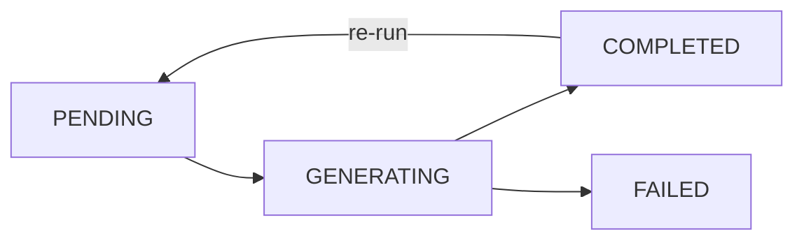
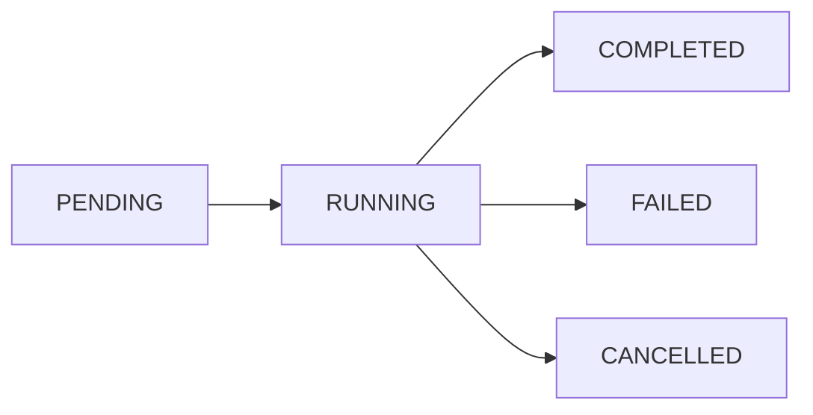

# Data Model: Admin Insights Report

## Entities

### 1. InsightsReport (New Entity)

**Purpose**: Stores metadata about generated insights reports

**Fields**:
- `id`: `String` @id @default(cuid())
- `generatedAt`: `DateTime` @default(now()) - When report was generated
- `periodStart`: `DateTime` - Start of analysis period
- `periodEnd`: `DateTime` - End of analysis period
- `sessionCount`: `Int` - Number of sessions analyzed
- `ticketCount`: `Int` - Number of tickets covered
- `reportKey`: `String` - Blob storage key for HTML report
- `reportSize`: `Int` - Size in bytes
- `status`: `ReportStatus` @default(PENDING) - Generation status
- `jobId`: `Int`? - Related analysis job ID
- `createdBy`: `String` - User ID who triggered analysis
- `projectId`: `Int` - Project ID (if project-specific)

**Relationships**:
- `job`: `Job`? @relation(fields: [jobId], references: [id])
- `project`: `Project` @relation(fields: [projectId], references: [id])
- `creator`: `User` @relation(fields: [createdBy], references: [id])

**Enums**:
```prisma
enum ReportStatus {
  PENDING
  GENERATING
  COMPLETED
  FAILED
}
```

### 2. Job (Extended Entity)

**Purpose**: Track insights analysis jobs

**New Fields**:
- `insightsReportId`: `String`? - Link to generated report
- `analysisType`: `AnalysisType`? - Type of analysis performed

**Extended Enum**:
```prisma
enum AnalysisType {
  CLAUDE_CODE_INSIGHTS
  // Future types...
}
```

### 3. AdminConfiguration (New Entity)

**Purpose**: Store admin user allowlist and settings

**Fields**:
- `id`: `String` @id @default("admin-config")
- `allowedUserIds`: `String[]` @default([]) - Authorized user IDs
- `allowedEmails`: `String[]` @default([]) - Authorized email patterns
- `createdAt`: `DateTime` @default(now())
- `updatedAt`: `DateTime` @updatedAt

## Validation Rules

### InsightsReport Validation
- `periodStart` ≤ `periodEnd`
- `periodStart` ≤ `generatedAt`
- `sessionCount` ≥ 0
- `ticketCount` ≥ 0
- `reportKey` must be unique
- `reportSize` > 0 when status = COMPLETED

### AdminConfiguration Validation
- `allowedUserIds` and `allowedEmails` cannot both be empty
- Email patterns must be valid regex or exact matches
- No duplicate user IDs or emails

## State Transitions

### InsightsReport Lifecycle


### Job Lifecycle (Insights Analysis)


## Database Constraints

### Indexes
- `InsightsReport`: Index on `(projectId, generatedAt)`
- `InsightsReport`: Index on `(status, generatedAt)`
- `InsightsReport`: Unique constraint on `reportKey`

### Foreign Keys
- `InsightsReport.jobId` → `Job.id` (CASCADE on delete)
- `InsightsReport.projectId` → `Project.id` (CASCADE on delete)
- `InsightsReport.createdBy` → `User.id` (CASCADE on delete)

## API Contracts

### GET /api/admin/insights
**Response**:
```typescript
interface AdminInsightsResponse {
  reports: InsightsReportMetadata[];
  currentReport: InsightsReportWithContent | null;
  canRunAnalysis: boolean;
  isGenerating: boolean;
}

interface InsightsReportMetadata {
  id: string;
  generatedAt: string;
  periodStart: string;
  periodEnd: string;
  sessionCount: number;
  ticketCount: number;
  status: ReportStatus;
}

interface InsightsReportWithContent {
  metadata: InsightsReportMetadata;
  htmlContent: string; // HTML report content
}
```

### POST /api/admin/insights/analyze
**Request**:
```typescript
interface RunAnalysisRequest {
  // Empty body for now, may add filters later
}
```

**Response**:
```typescript
interface RunAnalysisResponse {
  jobId: number;
  status: 'queued' | 'running';
  message: string;
}
```

### GET /api/admin/insights/:reportId
**Response**:
```typescript
interface GetReportResponse {
  report: InsightsReportWithContent;
}
```

## Workflow Contracts

### Insights Analysis Job Workflow
**Input**:
- Raw Claude session artifacts since last successful run
- Analysis period parameters

**Phases**:
1. **Pre-flight check**: Verify new tickets exist since last run
2. **Session download**: Fetch session artifacts from storage
3. **Analysis execution**: Call Claude Code `/insights` endpoint
4. **Report persistence**: Store HTML to blob storage
5. **Metadata storage**: Save report metadata to database

**Output**:
- HTML report artifact in blob storage
- Report metadata record in database
- Job completion status

**Error Handling**:
- Pre-flight failures: Return user-friendly message, no job created
- Analysis failures: Mark job as FAILED, preserve partial logs
- Storage failures: Mark job as FAILED, attempt cleanup
