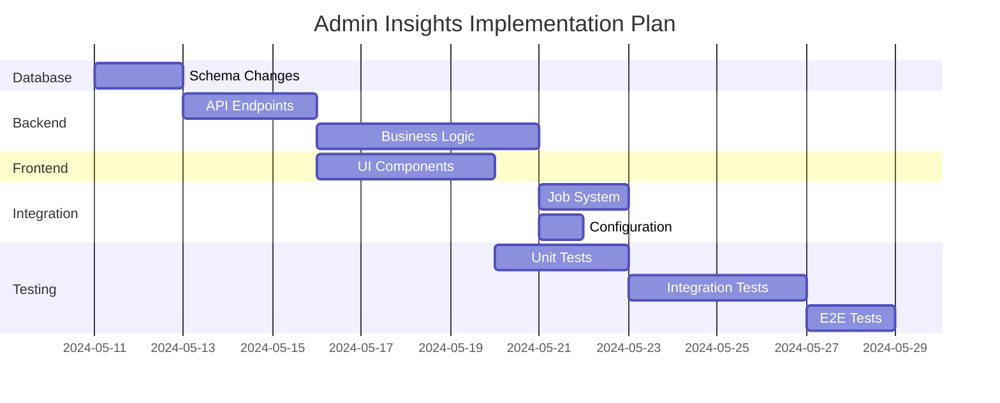

# Implementation Plan: Admin Section with Claude Code Insights Report

## Technical Context

### Architecture Overview
- **Frontend**: Next.js App Router with shadcn/ui components
- **Backend**: Next.js API routes with Prisma ORM
- **Database**: PostgreSQL via Prisma
- **Storage**: Blob storage for HTML reports
- **Authentication**: Session-based with admin allowlist
- **Job Processing**: Background jobs with status tracking

### Key Dependencies
- Next.js 14+
- Prisma ORM
- shadcn/ui component library
- Vercel Blob Storage (or equivalent)
- Claude API for insights generation
- Existing job management system

### Integration Points
- **Authentication**: Reuse existing `requireAuth()` middleware
- **Job System**: Extend existing Job model and components
- **UI Components**: Reuse existing job status indicators
- **API Patterns**: Follow existing route structure and error handling

## Constitution Check

### ✅ TypeScript-First Development
- All code uses strict TypeScript with explicit types
- TypeScript interfaces defined for all API contracts
- No `any` types used

### ✅ Component-Driven Architecture
- Feature-based organization in `components/admin/`
- shadcn/ui components used exclusively
- Server Components by default, Client Components only where needed

### ✅ Test-Driven Development
- Integration tests following Testing Trophy architecture
- Extends existing test patterns
- No duplicate test files

### ✅ Security-First Design
- Authentication middleware on all admin routes
- Input validation with Zod schemas
- Structured error responses
- No sensitive data exposure

### ✅ Database Integrity
- Prisma migrations for schema changes
- Transactions for multi-step operations
- Proper foreign key relationships

### ⚠️ Gates Evaluation

**Gate 1 - Specification Clarity**: ❌ NEEDS CLARIFICATION
- Admin user configuration location
- Claude API endpoint details
- Session filtering criteria
- Blob storage provider choice
- Job type classification

**Gate 2 - Architecture Alignment**: ✅ PASS
- Follows existing patterns and conventions
- Reuses existing infrastructure
- Consistent with constitution principles

**Gate 3 - Risk Assessment**: ⚠️ MEDIUM RISK
- Claude API integration complexity
- Report generation reliability
- Performance with large datasets

## Phase 0: Research (COMPLETED)

✅ **Deliverables**:
- `research.md` with existing file analysis
- Patterns to follow identified
- Technology decisions documented
- Constitution compliance verified

## Phase 1: Design & Contracts (COMPLETED)

✅ **Deliverables**:
- `data-model.md` with entity definitions
- `contracts/admin-api.ts` with TypeScript interfaces
- `contracts/insights-workflow.ts` with workflow contracts
- `workflows/insights-analysis-workflow.md` with detailed workflow

## Phase 2: Implementation

### Implementation Tasks

#### 1. Database Schema Changes
**Files to Create/Modify**:
- `prisma/schema.prisma` - Add InsightsReport model, extend Job model
- `prisma/migrations/` - Generate migration

**Tasks**:
1. Add `InsightsReport` model with all fields
2. Add `AdminConfiguration` model
3. Extend `Job` model with insights fields
4. Add enums for ReportStatus and AnalysisType
5. Run `prisma migrate dev` to create migration

#### 2. API Endpoints
**Files to Create**:
- `app/api/admin/insights/route.ts` - Main insights API
- `app/api/admin/access-check/route.ts` - Access verification
- `app/api/admin/insights/[reportId]/route.ts` - Individual report
- `app/api/admin/insights/job-status/route.ts` - Job status

**Tasks**:
1. Implement GET `/api/admin/insights` - List reports
2. Implement POST `/api/admin/insights/analyze` - Trigger analysis
3. Implement GET `/api/admin/access-check` - Check admin access
4. Implement job status endpoint
5. Add authentication middleware to all endpoints

#### 3. Business Logic
**Files to Create**:
- `lib/admin/access-control.ts` - Admin access verification
- `lib/insights/report-service.ts` - Report management
- `lib/insights/analysis-service.ts` - Analysis workflow
- `lib/insights/storage-service.ts` - Blob storage operations
- `lib/insights/claude-client.ts` - Claude API integration

**Tasks**:
1. Implement admin access control logic
2. Create report CRUD operations
3. Implement analysis workflow orchestrator
4. Build blob storage adapter
5. Create Claude API client

#### 4. UI Components
**Files to Create**:
- `components/admin/insights-page.tsx` - Main admin page
- `components/admin/report-viewer.tsx` - Report display
- `components/admin/analysis-controls.tsx` - Run analysis controls
- `components/admin/report-list.tsx` - Report navigation
- `components/admin/access-denied.tsx` - Access denied message

**Tasks**:
1. Create admin layout with navigation
2. Build report viewer with HTML rendering
3. Implement analysis controls with job status
4. Create report list with filtering
5. Add loading states and error handling

#### 5. Job Integration
**Files to Modify**:
- `components/board/job-status-indicator.tsx` - Add insights job type
- `lib/utils/job-type-classifier.ts` - Add job type classification

**Tasks**:
1. Add `INSIGHTS_ANALYSIS` job type
2. Update job status indicator for insights jobs
3. Add appropriate icons and colors

#### 6. Configuration
**Files to Create/Modify**:
- `.env.example` - Add new environment variables
- `lib/config/admin-config.ts` - Admin configuration
- `scripts/setup-admin.sh` - Setup script

**Tasks**:
1. Add environment variables for Claude API, blob storage
2. Create admin configuration management
3. Add setup script for initial admin configuration

### Implementation Sequence

## Phase 3: Testing Strategy

### Test Coverage Plan

#### 1. Unit Tests
**Files to Create**:
- `tests/unit/admin/access-control.test.ts`
- `tests/unit/insights/report-service.test.ts`
- `tests/unit/insights/analysis-service.test.ts`

**Coverage**:
- Access control logic
- Report CRUD operations
- Analysis workflow validation
- Error handling scenarios

#### 2. Integration Tests
**Files to Create**:
- `tests/integration/admin/insights-api.test.ts`
- `tests/integration/admin/access-check.test.ts`
- `tests/integration/insights/workflow.test.ts`

**Coverage**:
- API endpoint behavior
- Database interactions
- Authentication middleware
- Workflow execution

#### 3. Component Tests
**Files to Create**:
- `tests/components/admin/insights-page.test.tsx`
- `tests/components/admin/analysis-controls.test.tsx`

**Coverage**:
- Component rendering
- User interactions
- State management
- Accessibility

#### 4. E2E Tests
**Files to Create**:
- `tests/e2e/admin-insights.spec.ts`

**Coverage**:
- Full user journey
- Authentication flow
- Report generation
- Error scenarios

### Test Data Strategy
- Use existing test fixtures where possible
- Create minimal admin-specific test data
- Mock external services (Claude API, blob storage)
- Use test containers for database isolation

## Phase 4: Deployment & Monitoring

### Deployment Checklist
1. ✅ Database migration applied
2. ✅ Environment variables configured
3. ✅ Admin users configured
4. ✅ Feature flag enabled (if used)
5. ✅ Monitoring alerts configured
6. ✅ Documentation updated

### Monitoring Setup
- **Metrics**: Analysis duration, success rate, error rates
- **Alerts**: Consecutive failures, slow analyses
- **Logs**: Full workflow logging with context
- **Dashboards**: Admin activity, report generation stats

### Rollback Plan
1. Disable admin routes via feature flag
2. Revert database migration
3. Clean up blob storage artifacts
4. Notify affected users

## Risk Mitigation

### High Risk Items
1. **Claude API Integration**
   - Mitigation: Mock API for initial development
   - Fallback: Graceful degradation with error messages

2. **Report Generation Performance**
   - Mitigation: Implement batching and streaming
   - Fallback: Limit maximum sessions per analysis

3. **Admin Access Configuration**
   - Mitigation: Clear documentation and setup script
   - Fallback: Environment variable override

### Contingency Plans
- **Claude API Failure**: Cache last successful report, show error for new analysis
- **Storage Failure**: Retry with exponential backoff, notify admin
- **Database Issues**: Implement circuit breaker, show maintenance message

## Success Metrics

### Implementation Success
- ✅ All API endpoints passing tests
- ✅ All components rendered correctly
- ✅ Authentication working as expected
- ✅ Job system integrated properly
- ✅ Database schema applied successfully

### User Success
- ✅ Admin users can access insights page
- ✅ Reports generate successfully
- ✅ Analysis completes within performance targets
- ✅ Error handling is user-friendly
- ✅ Access control prevents unauthorized access

### Operational Success
- ✅ Monitoring alerts configured
- ✅ Error rates < 5%
- ✅ Analysis completion time < 30 minutes for typical datasets
- ✅ System handles maximum load without degradation

## Open Questions & Blockers

### Critical Blockers
1. **Claude API Details**: Need specific endpoint and authentication method
2. **Admin Configuration**: Need decision on where to store allowlist
3. **Blob Storage**: Need provider selection and credentials

### Nice-to-Have Clarifications
1. **Report Format**: Exact HTML structure expected from Claude
2. **Session Filtering**: Precise criteria for "Claude Code agent sessions"
3. **Notification Preferences**: How to notify admins of completion

## Next Steps

1. **Resolve Blockers**: Get answers to critical open questions
2. **Start Implementation**: Begin with database schema changes
3. **Iterative Development**: Build API endpoints first, then UI
4. **Continuous Testing**: Write tests alongside implementation
5. **Stakeholder Review**: Demo progress regularly

## Generated Artifacts

✅ `specs/AIB-787-admin-section-with/research.md`
✅ `specs/AIB-787-admin-section-with/data-model.md`
✅ `specs/AIB-787-admin-section-with/contracts/admin-api.ts`
✅ `specs/AIB-787-admin-section-with/contracts/insights-workflow.ts`
✅ `specs/AIB-787-admin-section-with/workflows/insights-analysis-workflow.md`
✅ `specs/AIB-787-admin-section-with/plan.md`

**Branch**: `AIB-787-admin-section-with`
**Status**: Design Complete, Ready for Implementation
**Next Phase**: Database Schema Implementation
