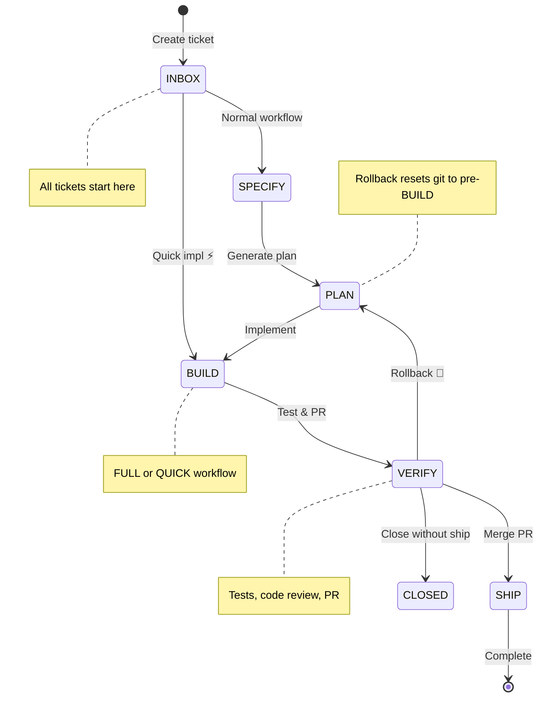

# Ticket Management - Functional Specification

## Purpose

Tickets represent individual work items that flow through the Kanban workflow. Users can create, view, and move tickets between stages to track progress on features, bugs, and tasks.

## Stage Flow Overview

**Workflow Types**:
- **FULL**: INBOX → SPECIFY → PLAN → BUILD → VERIFY → SHIP (complete documentation)
- **QUICK**: INBOX → BUILD → VERIFY → SHIP (fast track, minimal docs)

## Ticket Creation

### Creation Interface

- A "+ New Ticket" button appears at the top of the INBOX column
- Clicking the button opens a modal dialog with a creation form

### Required Information

All tickets must include:

- **Title**: Brief description (maximum 100 characters)
  - Required field - cannot be empty or whitespace-only
  - Restricted to alphanumeric characters and basic punctuation
  - No special characters or emojis allowed

- **Description**: Detailed context (maximum 2000 characters)
  - Required field - cannot be empty or whitespace-only
  - Restricted to alphanumeric characters and basic punctuation
  - No special characters or emojis allowed

### Validation Behavior

- The Create button is disabled when fields are invalid
- Real-time validation errors appear as users type
- Character limits are enforced with visible counters
- Invalid characters trigger immediate error messages

### Creation Process

1. User clicks "+ New Ticket" button
2. Modal dialog opens with empty form
3. User enters title and description
4. User clicks Create or presses Cmd/Ctrl+Enter
5. System creates ticket with unique sequential ID
6. Ticket appears immediately in INBOX column
7. Modal closes and form is cleared

### Error Handling

- Creation requests timeout after 15 seconds
- Network failures show error message with retry option
- Validation errors prevent form submission
- Loading state displays during creation

### Form Cancellation

Users can cancel creation by:
- Clicking the Cancel button
- Clicking outside the modal area
- Pressing the Escape key

When cancelled, the modal closes without creating a ticket.

## Ticket Movement

### Drag-and-Drop Operations

Users move tickets between stages using drag-and-drop:

1. Click and hold on a ticket card
2. Drag to a target column
3. Release to drop the ticket

### Visual Feedback During Drag

**Valid Drop Zones**:
- Highlight with colored border and background
- Show stage-specific icons
- Change cursor to indicate drop is allowed

**Invalid Drop Zones**:
- Reduced opacity (50%)
- Prohibited icon (🚫)
- Cursor changes to "not-allowed"

**Special Behaviors**:
- INBOX tickets can drop on SPECIFY (normal workflow, blue highlighting) or BUILD (quick implementation, green highlighting)
- VERIFY tickets (workflowType=FULL, job COMPLETED/FAILED/CANCELLED) can drop on PLAN (rollback, amber/red dashed highlighting)
- All other transitions show next sequential stage as valid drop zone

### Stage Transition Behavior

**Normal Transitions**:
- Ticket moves immediately with optimistic update
- Stage persists to database
- Visual feedback confirms success
- Errors cause ticket to revert to original position

**Quick Implementation**:
- When dropping INBOX ticket on BUILD column
- Confirmation modal appears before transition
- Modal explains trade-offs (speed vs. documentation)
- User must confirm or cancel the operation

**VERIFY to PLAN Rollback**:
- When dropping VERIFY ticket on PLAN column (FULL workflows only)
- Confirmation modal appears explaining consequences:
  - Implementation commits will be removed (git reset to pre-BUILD state)
  - Spec files in `specs/{branch}/` folder are preserved automatically
  - Preview URL will be cleared
  - Original implement job record will be deleted
  - Auto-mode (if enabled) is turned off to prevent the PLAN → BUILD → VERIFY → PLAN loop
- Triggers rollback-reset workflow that:
  - Identifies the last commit before BUILD phase began
  - Backs up spec files using git stash
  - Performs hard reset to pre-BUILD commit
  - Restores spec files and commits them
  - Force-pushes the reset branch
- Available when latest workflow job is COMPLETED, FAILED, or CANCELLED
- Not available for QUICK workflow type
- Not available when job is RUNNING or PENDING
- Creates a `rollback-reset` job to track the git reset operation

**Auto-Transition Mode**:
- FULL-workflow tickets in INBOX/SPECIFY/PLAN display a double-chevron toggle icon on the card (animated mauve glyph when on, hover-reveal when off)
- Enabling it chains SPECIFY → PLAN → BUILD automatically as each workflow job succeeds
- Disabling it is a single click with no confirmation; running jobs are not affected
- Auto-mode turns itself off on any FAILED/CANCELLED job and on VERIFY → PLAN rollback
- State is per-ticket, persisted server-side, and shared across all viewers
- Full behavior documented in the Kanban Board specification

**Close Ticket (VERIFY to CLOSED)**:
- When dropping VERIFY ticket on Close zone in SHIP column
- SHIP column displays dual drop zones when dragging VERIFY tickets:
  - Ship zone (top ~60%, purple solid border): Normal ship behavior
  - Close zone (bottom ~40%, red dashed border with archive icon): Close without shipping
- Confirmation modal appears explaining consequences:
  - Ticket will be removed from board but remains searchable
  - Associated GitHub PRs will be closed with explanatory comment
  - Git branch will be preserved for future reference
  - Ticket enters terminal CLOSED state (no further transitions)
- Available when ticket in VERIFY stage with no PENDING or RUNNING jobs
- Not available for other stages (dual drop zone only appears for VERIFY)
- Sets closedAt timestamp on ticket

### Performance

- Drag-and-drop operations complete with <100ms latency
- Response feels instantaneous for professional-grade UX
- Performance maintained regardless of ticket count

### Concurrent Updates

When two users modify the same ticket simultaneously:
- First write wins in the database
- Second user sees error message
- Ticket reverts to the current database position
- User can retry the operation

## Ticket Details

### Viewing Details

Clicking any ticket card opens a detail modal displaying:

- **Title**: Full ticket title (large, prominent)
- **Description**: Complete description text with GitHub Flavored Markdown (GFM) formatting
  - Renders markdown syntax as formatted content
  - Supports bold (`**text**`), italic (`*text*`), inline code (`` `code` ``)
  - Supports links (`[text](url)`) with `target="_blank"` and `rel="noopener noreferrer"`
  - Supports unordered lists (`- item`) and ordered lists (`1. item`)
  - Supports blockquotes (`> text`)
  - Supports headings (`# H1`, `## H2`, etc.)
  - Supports GFM tables with aligned columns
  - Supports strikethrough (`~~text~~`)
  - Supports task lists (`- [ ]` and `- [x]`)
  - Plain text without markdown renders normally
  - Uses prose styling optimized for dark theme
- **Stage Badge**: Current workflow stage with visual indicator
- **Metadata**:
  - Creation date
  - Last updated date
  - Branch name (when available)
  - Workflow type indicator (⚡ for quick implementation)

### Documentation Buttons

The ticket detail modal provides quick access to workflow documentation files:

**Spec Button**:
- Displays for tickets with completed specify job
- Opens modal showing spec.md content
- Read-only and editable modes available
- Icon: FileText

**Plan Button**:
- Displays for tickets with completed plan job
- Opens modal showing plan.md content
- Read-only and editable modes available
- Icon: FileText

**Tasks Button**:
- Displays for tickets with completed plan job (tasks generated after planning)
- Opens modal showing tasks.md content
- Read-only and editable modes available
- Icon: ListTodo

**Summary Button**:
- Displays for FULL workflow tickets with completed implement job
- Opens modal showing summary.md content (implementation details, changes made, key decisions, files modified)
- Read-only mode only (no edit functionality)
- Icon: FileOutput
- Fetches content from feature branch for BUILD/VERIFY stages
- Fetches content from the repository's default branch for SHIP stage
- Not available for QUICK workflow type (summary files only created during full workflow implementation)

**Common Behaviors**:
- All documentation modals support commit history viewing
- Content displayed in formatted markdown
- Loading states shown during fetch operations
- Error messages displayed if file cannot be fetched
- Modal can be closed via close button, Escape key, or clicking outside

### Modal Behavior

The detail modal:
- Opens on ticket card click
- Displays in full-screen mode on mobile
- Centers with appropriate sizing on desktop
- Uses dark theme styling
- Provides clear typography and visual hierarchy
- Content organized in tabs (Details, Comments, Files, Stats)
- Each tab has unified scrolling with no nested scrollbars
- Description content flows naturally within tab scroll area

**Real-Time Data Synchronization**:
- Modal automatically reflects ticket updates when jobs reach terminal states (COMPLETED, FAILED, CANCELLED)
- Branch name appears immediately after workflow creates it (no page refresh required)
- Documentation buttons (Spec, Plan, Tasks) become visible as soon as corresponding jobs complete
- Stats tab updates in real-time with latest job telemetry data
- Changes occur automatically via job status polling system (2-second interval)
- Modal content stays synchronized whether opened before or after job completion

**Focus Management**:
- Modal maintains proper focus for keyboard accessibility
- Actions overflow menu (···) does not receive automatic focus on modal open
- Focus management follows accessibility best practices
- Prevents unintended actions from keyboard input immediately after modal opens
- Users can navigate to interactive elements using Tab key

### Stats Tab

The Stats tab displays aggregated telemetry metrics from all workflow jobs associated with the ticket. This tab provides visibility into resource consumption, costs, and workflow efficiency.

**Visibility**:
- Stats tab only appears when the ticket has at least one associated job
- Automatically shown/hidden based on job presence
- No empty state shown when tab is absent

**Quality Score Section**:

For tickets with a COMPLETED verify job that has a quality score, a quality score section appears at the top of the Stats tab:

- **Overall Score Card**: Integer 0-100 displayed prominently inside a clickable summary card
- **Threshold Label**: Human-readable classification with color coding:
  - **Excellent** (90-100): green
  - **Good** (70-89): blue
  - **Fair** (50-69): amber
  - **Poor** (0-49): red
- **Collapsed By Default**: The section initially shows only the summary card with the overall score and threshold label
- **Expandable Details**: When dimension details are available, selecting the score card expands or collapses the detailed breakdown
- **Detail Cue**: The card shows a directional icon and a "View details" or "Hide details" label when the breakdown can be toggled
- **Dimension Breakdown**: The expanded state shows all five dimensions with individual scores, weights, and a colored progress bar indicating the score relative to 100:
  - Compliance (30%)
  - Bug Detection (30%)
  - Product Contract Sync (20%)
  - Edge Cases & Failure Modes (15%)
  - Historical Context (5%)
- **No Empty Breakdown**: If the verify job does not include dimension details, the score card remains non-expandable and only the summary is shown
- **Score Source**: Taken from the latest COMPLETED verify job when multiple exist (rollback-reset scenarios)
- **Absence**: No quality score section appears for QUICK workflow tickets, or if the verify job failed or was cancelled

**Summary Metrics**:
- **Total Cost**: Aggregated cost in USD from all jobs (formatted as $X.XX)
- **Total Duration**: Combined execution time across all jobs (formatted as Xm Xs)
- **Total Tokens**: Sum of input and output tokens used
- **Cache Efficiency**: Percentage of cache hits (cacheReadTokens / (inputTokens + cacheReadTokens))

**Jobs Timeline**:
- Chronological list of all jobs (oldest first)
- Each job displays:
  - Command/stage name (e.g., "specify", "implement", "verify")
  - Status icon (success checkmark, error icon, pending spinner)
  - Duration (formatted time)
  - Cost (formatted USD)
  - Model used (e.g., "claude-sonnet-4-5")
  - Peak context pill — compact badge showing the maximum per-turn context size observed during the run (formatted as an abbreviated token count). Hover reveals the absolute token count and the percentage of the model's context window. The pill uses neutral styling below 60% of the model's context window, warning styling between 60% and 80%, and danger styling at or above 80%. The pill is hidden entirely (no placeholder, no zero) for jobs run with agents that expose no per-turn telemetry (Mistral), for jobs whose model has no registered context window, and for jobs that predate per-turn ingestion
- Jobs are expandable to reveal detailed token breakdown:
  - Input tokens
  - Output tokens
  - Cache read tokens
  - Cache creation tokens
  - Average per-turn context size — shown only when the job recorded per-turn telemetry; row is hidden entirely (not "—" or "0") otherwise
  - Turn count — shown only when the job recorded per-turn telemetry; row is hidden entirely otherwise
  - Plugin version — the AI-Board plugin version active when the job ran, rendered in compact monospace styling. A discreet `—` placeholder is shown when the value is absent (jobs predating capture or runs where capture failed). The row is always present whenever the details panel is expanded
  - Agent CLI version — the underlying agent CLI version (claude, codex, vibe, gemini) active when the job ran, with the same styling and placeholder rules as the plugin version
- The presence of either runtime version is enough to make the details panel expandable, even when no token telemetry was captured

**Tools Usage**:
- Aggregated count of all tools used across jobs
- Sorted by frequency (most-used first)
- Displayed as badges with counts (e.g., "Edit (5)", "Read (3)")
- Empty state message when no tools recorded

**Real-Time Updates**:
- Stats automatically update as jobs complete via existing 2-second job polling
- No manual refresh required
- Metrics recalculate automatically when job data changes
- Modal content (including Stats tab) updates automatically when jobs transition to terminal states
- Real-time synchronization ensures branch name, documentation buttons, and job telemetry are always current

### Inbox Analysis Panel

INBOX tickets show an on-demand analysis panel that surfaces a friction-risk rating, expected quality-gate range, QUICK-vs-FULL recommendation with confidence, decomposed cost range, scope warnings, and clickable anchor citations grounded on past delivery outcomes.

The panel is presented as a single-line strip by default in every state, so the optional analysis never dominates the Details tab. All data remains accessible — users expand the row to reveal the full content when they need it.

**Visibility**:
- Analysis trigger button appears only on tickets in INBOX stage
- Persisted analysis results remain readable from any stage; only the trigger is hidden after the ticket leaves INBOX
- Panel renders inside the Details tab of the ticket detail modal
- A ticket that has never been analyzed and is not currently triggerable (e.g., post-INBOX without a prior run) renders nothing at all — no placeholder text, no header

**Collapsed Row by State**:

| State | Single-line content |
|---|---|
| Empty + triggerable | Right-aligned `Run analysis` action button only — no "INBOX ANALYSIS" label, no inline cost on the label |
| Empty + not triggerable | Nothing rendered |
| Running | Spinner + `Analyzing…` on one line, `aria-busy="true"`; no expand toggle, no card underneath |
| Failed + triggerable | Warning icon + `Analysis failed` + `Retry` button on one line; the error message is exposed via tooltip on the warning icon |
| Failed + not triggerable | Warning icon + `Analysis failed` on one line; tooltip carries the error message |
| Cold start | Snowflake icon + `Cold start — not enough comparable tickets` + expand toggle |
| Success | Three colour-coded chips (recommendation, friction risk, confidence) + `analyzed N ago` meta + expand toggle |
| Success + stale | Same as Success plus an amber warning indicator and an inline `Re-analyze` action on the same row |

**Trigger Button**:
- Compact `Run analysis` button with a sparkles icon — the visible label never includes the cost
- Estimated USD cost range is exposed only on hover/focus (tooltip) and via the button's accessible label so screen readers can announce it
- Cost estimate derived before the click from token estimates × per-million pricing of the analysis model. The analysis always runs on Claude Sonnet 4.6, regardless of the project's declared agent — same pattern as code review (a different agent reviewing the implementation, lower cost than Opus, adequate reasoning for this task)
- Disabled with an explanatory tooltip when the user has reached the hourly rate limit (tooltip includes the next reset time)

**Tooltips for Clarity**:

Every chip and meta element on the collapsed row carries a plain-language tooltip so users can learn the meaning without leaving the modal:

- **Recommendation chip** (`QUICK` / `FULL`): explains what each workflow does and when each is preferred
- **Friction risk chip** (`low` / `medium` / `high`): explains that the score estimates implementation difficulty derived from anchor outcomes
- **Confidence chip** (`low` / `medium` / `high`): explains that confidence reflects how many comparable anchors were found
- **`analyzed N ago` meta**: shows the absolute completion timestamp and the actual measured cost paid for the run
- **Stale indicator** (warning icon): explains that the description has changed since the analysis ran
- **Failed icon**: shows the full error message
- **Run analysis button**: shows the estimated cost range — the only place the cost surfaces visually

**Run Behavior**:
- Triggering returns immediately; the panel collapses to the single-line "running" row until results arrive
- The browser is not blocked during the run
- Reloading the page mid-run re-attaches to the running analysis; on completion the panel updates without further user action
- Failures collapse to a single-line "Analysis failed" row with an inline retry; failed runs do not consume the user's hourly budget

**Expanded View**:

Clicking the expand toggle on a Success or Cold-start row reveals the full content underneath. All data shown in the previous full-card layout remains accessible — only its default visibility changes. Running, failed, and empty states are not expandable.

**Successful Analysis — Expanded Content**:

When the user expands a successful row, the panel reveals the following fields:

- **Recommendation**: `QUICK` or `FULL` with confidence level and short justification text (≤ 1000 characters) referencing stack-relevant signals. The chip on the collapsed row matches the choice; confidence is its own chip.
- **Friction Risk**: `low`, `medium`, or `high` with a colour-coded label (text label always present alongside colour). Shown as a chip on the collapsed row and described in plain language via tooltip.
- **Expected Quality-Gate Range**: Lower–upper bounds (0–100) derived from anchor outcomes
- **Expected Cost Range**: Decomposed into:
  - Baseline pipeline cost (lower–upper USD)
  - Marginal friction cost (lower–upper USD)
- **Scope Warnings**: Up to 5 single-sentence warnings, prioritised in this order:
  1. Ambiguity in core requirement
  2. Multi-feature bundling
  3. Missing acceptance criteria
  4. Missing scope boundary
  5. Other
- **Anchor Citations**: Up to 5 clickable past tickets, each displaying:
  - Ticket key
  - Friction status indicator with text label (frictionFree yes/no)
  - Quality score (0–100) or an explicit "no score" placeholder for QUICK tickets that shipped without a score
  - Click navigates to the past ticket page within the current project
  - Anchors pointing to tickets the requesting user no longer has access to are filtered out before render
  - Anchors whose source ticket has been hard-deleted render in a degraded "ticket no longer available" state without breaking the panel

**Cold-Start Path**:

When fewer than 3 comparable past outcomes are available for the analyzed ticket's predicted domain, the panel renders a qualitative-only view that follows the same single-line collapsed pattern:

- The collapsed row shows `Cold start — not enough comparable tickets` with an expand toggle
- Expanding the row reveals the cause text (e.g., "Not enough comparable shipped tickets in the same domain yet") and the scope warnings derived from the ticket text alone (capped at 5)
- No numeric quality-gate or cost ranges
- No friction-risk chip, recommendation, or anchor list — those chips only appear in the Success state
- "Not enough data" classification activates whenever the project has 0, 1, or 2 comparable outcomes; "early data" may be noted in the expanded text when 1 or 2 anchors exist

**Comparable History**:

A past ticket qualifies as "comparable" when all of these hold:
- Same project as the analyzed ticket
- Has a non-`partial` outcome record
- Shares at least one structural domain (top-level path segment) with the analyzed ticket's predicted domain set
- Tie-breakers (in order): semantic-tag overlap (`touched_db_schema`, `touched_tests`, `touched_ci`), then recency
- Cross-project anchoring is never used; only same-project history is considered

**Persistence and Re-display**:

- Each run persists exactly one row to an append-only analysis store
- Older rows are retained indefinitely for audit; the most recent row drives the panel
- Reopening an already-analyzed ticket renders the panel instantly without invoking any LLM call
- No background recomputation runs — neither on description changes, nor on stage transitions, nor on a schedule

**Stale Indicator**:

After an analysis has been persisted, the panel marks the row as stale whenever the ticket's `title + description` (whitespace-tolerant comparison) differs from the snapshot stored on the latest analysis row. The staleness signal lives on the collapsed row itself.

- An amber warning icon appears at the start of the success row; its tooltip explains that the description has changed since the analysis ran
- An inline `Re-analyze` action appears on the same row whenever the ticket is triggerable
- Until the user clicks, the prior analysis remains visible and is still the current displayed result
- Reverting the edits to match the stored snapshot dismisses the indicator and the inline action automatically
- Clicking `Re-analyze` runs the full pipeline and creates a new row; the previous row is preserved for audit
- Comments on the ticket do not count as description changes — the indicator only reacts to title or description edits
- The indicator is suppressed while a re-analysis is in progress and re-evaluates against the new snapshot afterwards

**Re-analysis Behavior**:

- Always user-triggered (the trigger button or the inline re-analyze action on a stale success row)
- Each run produces a new row; existing rows are never overwritten
- Concurrent runs from two browser tabs are both allowed to complete; each is its own row, the latest completion wins for display, and both count against the user's hourly budget
- A re-analysis after the project's outcome dataset has grown above the cold-start threshold produces a non-cold-start panel on next run

**Rate Limit**:

- 10 successful analyses per user per rolling hour, project-agnostic
- The 11th attempt within the window is rejected with a clear message stating when capacity returns (e.g., "Hourly analysis budget exhausted. Capacity returns at 12:11 UTC.")
- Failed runs (LLM error, timeout, dispatch failure, missing credential) do not count against the budget — the user can retry immediately
- Rate-limit state visible to the panel as a remaining-runs counter and a next-reset timestamp

**Cost Recording**:

- The trigger button surfaces the pre-click estimated USD range only on hover/focus (tooltip) and via its accessible label, never in the visible button text
- Each successful run records the actual measured USD cost on the persisted row, captured from the LLM provider's response, alongside duration and token telemetry. The measured cost is exposed on the collapsed success row's `analyzed N ago` tooltip
- Older rows retain their original stack snapshot for audit; a project's later stack changes do not retroactively rewrite past analyses

**Stack Awareness**:

The same code path produces an analysis regardless of the project's language, framework, or services. The grounded estimation prompt receives, alongside the ticket text:

- Language (e.g., `typescript`, `python`)
- Framework (e.g., `nextjs`, `fastapi`)
- Services list (e.g., `postgres`, `redis`) — capped at 10
- Testing framework (e.g., `vitest`, `pytest`)
- E2E flag and e2e framework (e.g., `playwright`)
- Resolved agent and model

Missing optional fields are gracefully omitted without error; the bounded extract keeps prompt size predictable and stable across projects.

**Accessibility**:

- All colour-coded signals (recommendation, friction risk, recommendation confidence) are accompanied by accessible text labels and tooltips that describe what each value means in plain language
- The running row carries `aria-busy="true"`; the failed row uses `role="alert"` so screen readers announce it
- Every collapsed-row chip is focusable via keyboard so its tooltip is reachable; the expand toggle exposes `aria-expanded` and a descriptive `aria-label`
- Analysis button, retry, inline re-analyze action, expand toggle, and every anchor link are reachable and operable via keyboard
- The trigger button's accessible label always includes the estimated cost range, so the cost is discoverable to assistive tech even though it is not in the visible label
- WCAG AA contrast (4.5:1) maintained across all states

### Closing the Modal

Users can close the detail modal by:
- Clicking the close button
- Pressing the Escape key
- Clicking outside the modal content area

## Ticket Comparison Dashboard

### Purpose

The comparison dashboard provides a visual view of `/compare` results, replacing the raw markdown experience with a structured, interactive UI. It displays ranking, code metrics, implementation choices, and constitution compliance across competing ticket implementations.

### Access Points

- A "Compare" button appears in the ticket detail modal when the ticket has participated in at least one comparison (as source or participant)
- Clicking the button opens the comparison viewer dialog
- The check endpoint determines button visibility (cached with 30s stale time)

### Comparison Viewer

The viewer is a modal dialog with two sections:

**History Sidebar** (left, 280px):
- Lists saved comparisons ordered by most recent first
- Each entry shows the winner, participant tickets, timestamp, and summary
- Clicking an entry loads the full comparison detail
- Toggled via a "History (N)" button in the dialog header
- Hidden on small screens

**Main Content** (right):
- Scrollable area displaying five sections for the selected comparison:

**Ranking and Recommendation**:
- Overall recommendation text and executive summary
- Key differentiators shown as badges
- Participant cards ordered by rank showing:
  - Rank number, ticket key, title
  - Score percentage badge
  - "Winner" badge on rank 1
  - Rank rationale text
  - Workflow type badge (FULL / QUICK)
  - Agent badge when agent information is available
  - Quality score badge with threshold label (e.g., "87 Good") when a score exists

**Implementation Metrics**:
- Table comparing code metrics across participants
- Metrics: lines changed, files changed, test files changed
- "Best value" badge highlights the leading participant per metric
- "Unavailable" shown when metrics are missing

**Operational Metrics**:
- Grid with metric labels as rows and participants as columns
- Metrics: total tokens, input tokens, output tokens, duration, cost, job count, quality score
- Values aggregated across all completed jobs per participant (sum for tokens/duration/cost, count for job count)
- Primary AI model determined by the job with the highest total token consumption
- "Best value" badge per row (lowest wins for tokens/duration/cost/job count; highest wins for quality)
- Column headers show ticket key, workflow type, and agent
- Metric label column stays fixed (sticky) during horizontal scroll; supports up to 6 compared tickets
- Pending state shown when a job is in progress but telemetry is not yet available; "N/A" when no data will ever be available
- Clicking a quality score opens a breakdown popover (available for FULL workflow tickets that have completed VERIFY with quality score details)

**Quality Score Breakdown Popover**:
- Triggered by clicking an eligible quality score cell in the Operational Metrics grid
- Shows 5 evaluated dimensions: Compliance, Bug Detection, Product Contract Sync, Edge Cases & Failure Modes, Historical Context
- Each dimension shows name, score, weight, and a visual progress bar
- Overall score with threshold label shown at the bottom

**Decision Points**:
- Collapsible sections for each architectural decision
- Each shows title, verdict summary, rationale, and per-participant approaches
- First decision point expanded by default

**Constitution Compliance**:
- Table grid with principles as rows, participants as columns
- Status badges: pass (green), mixed (outline), fail (red)
- Assessment notes shown below each status

### Data Enrichment

The comparison detail view enriches stored comparison data with live data:
- **Quality scores**: Derived from completed verify jobs (`available` if score exists, `pending` if job running, `unavailable` if no verify job). Breakdown details (5 dimensions with scores and weights) available for FULL workflow tickets that completed VERIFY.
- **Telemetry**: Total/input/output tokens, duration, cost, job count, and primary model — aggregated across all COMPLETED jobs per participant. Excludes failed and cancelled jobs.

### Selection Logic

When the viewer opens, the selected comparison is resolved in priority order:
1. User-selected comparison from history list
2. `initialComparisonId` prop (deep link)
3. `latestComparisonId` from the check endpoint

### Data Fetching

Three TanStack Query hooks manage data:
- `useComparisonCheck`: Quick existence check (30s stale time)
- `useComparisonList`: Paginated history (30s stale time)
- `useComparisonDetail`: Full detail for selected comparison (5min stale time)

## Ticket Duplication

### Duplicate Dropdown Menu

Users can create a copy of existing tickets using two duplication modes:

**Button Location**:
- Appears in the ticket detail modal header overflow menu (··· button)
- Located alongside Edit Policy and Edit Agent actions
- Visible for tickets in all stages (INBOX through SHIP)

**Duplication Modes**:

**Simple Copy** (available for all stages):
- Creates fresh copy in INBOX stage
- Title prefixed with "Copy of "
- No jobs or branch copied
- Resets to clean state for new work
- Use case: Reusing ticket template or description for unrelated work

**Full Clone** (available for SPECIFY, PLAN, BUILD, VERIFY stages only):
- Preserves source ticket's stage
- Copies all jobs with complete telemetry data
- Creates new Git branch from source branch
- Title prefixed with "Clone of "
- Use case: A/B testing alternative implementations, exploring different approaches

**Dropdown Menu Behavior**:
- Single button with chevron-down icon
- Opens dropdown menu on click
- Menu items:
  - "Simple copy" (Copy icon) - always visible
  - "Full clone" (GitBranch icon) - only for SPECIFY/PLAN/BUILD/VERIFY stages
- Keyboard accessible

**Simple Copy Process**:
1. User opens ticket detail modal
2. User clicks Duplicate dropdown
3. User selects "Simple copy"
4. System creates new ticket in INBOX with:
   - Title: "Copy of [original title]" (truncated if needed to stay within 100 chars)
   - Description: Exact copy of original description
   - Clarification Policy: Same as original (or null if using project default)
   - Image Attachments: References to same images (uploaded and external URLs)
   - No branch, no jobs
5. Success toast displays: "Copied to {NEW_TICKET_KEY}"
6. Modal closes automatically
7. New ticket appears immediately at the bottom of INBOX column

**Full Clone Process**:
1. User opens ticket in SPECIFY, PLAN, BUILD, or VERIFY stage
2. User clicks Duplicate dropdown
3. User selects "Full clone"
4. System performs full clone:
   - Creates new ticket with same stage as source
   - Title: "Clone of [original title]"
   - Description: Exact copy of original description
   - Copies all jobs with complete telemetry (tokens, cost, duration, model, tools)
   - Creates new Git branch from source branch commit (format: {TICKET_NUMBER}-{slug})
   - Copies clarification policy and attachments
5. Success toast displays: "Cloned to {NEW_TICKET_KEY}"
6. Modal closes automatically
7. New ticket appears in same column as source ticket

**Visual Feedback**:
- Loading state (Loader2 spinner) on dropdown trigger during duplication
- Success toast notification with new ticket key
- Error toast for failures (branch not found, GitHub API errors)
- Dropdown remains open on error to allow retry

**Title Handling**:
- Simple copy: "Copy of " prefix
- Full clone: "Clone of " prefix
- If prefix would exceed 100 character limit, original title is truncated first
- Truncation preserves prefix and includes as much of original title as fits

**Attachment Handling**:
- All image attachments (up to 5) are copied by reference
- Uploaded images (Cloudinary URLs) safely reference same URL
- External image URLs are copied as-is
- No re-uploading or duplication of image files

**Branch Creation**:
- Full clone creates new branch via GitHub API
- Branch name follows project convention: {TICKET_NUMBER}-{slug}
- Slug derived from title: first 3 words, lowercase, hyphenated
- New branch points to same commit as source branch
- Preserves complete Git history from source

**Job Duplication**:
- All jobs copied with complete data:
  - Command, status, branch, commit SHA
  - Timestamps (startedAt, completedAt)
  - Telemetry (inputTokens, outputTokens, cacheReadTokens, cacheCreationTokens)
  - Cost and performance metrics (costUsd, durationMs)
  - Model identifier and tools used
- Jobs reference new ticket ID
- Job history provides point-in-time snapshot for comparison

**Error Handling**:
- **Simple copy errors**: Network failures, validation errors
- **Full clone errors**:
  - Source ticket has no branch → 400 error with actionable message
  - Source branch not found on GitHub → 400 error, user can still use simple copy
  - Branch creation fails → 500 error with retry guidance
  - GitHub API rate limit exceeded → 500 error with actionable message
- Modal remains open on error to allow retry
- User can click dropdown menu again to retry after error

**Performance**:
- Simple copy: New ticket appears immediately via optimistic update (0ms perceived latency)
- Full clone: <5 seconds total (GitHub API + database transaction)
- Database operation is atomic (all-or-nothing)
- Branch creation synchronous (provides immediate feedback on errors)

**Optimistic UI Behavior**:
- Temporary ticket appears in target column immediately
- Placeholder uses temporary ID and ticket key until server response
- On success: Temporary ticket replaced with actual server data
- On error: Temporary ticket removed from UI, original tickets list restored
- User sees immediate feedback without waiting for server response

## Ticket Search

### Search Interface

Users can quickly find tickets using a search input in the header:

**Location**:
- Search input appears centered in the header when viewing a project board
- Hidden when no project is selected (homepage, settings pages)
- Visible on desktop and tablet viewports (hidden on mobile due to space constraints)

**Search Scope**:
- Searches within the currently selected project only
- Includes tickets in all stages (INBOX through SHIP) and CLOSED tickets
- No cross-project search (keeps results focused and relevant)
- Closed tickets appear alongside active tickets in search results

**Search Fields**:
- **Ticket Key**: Matches partial or complete ticket keys (e.g., "AIB-42", "42")
- **Title**: Searches for keywords in ticket titles (case-insensitive)
- **Description**: Searches for keywords in ticket descriptions (case-insensitive)

### Search Behavior

**Trigger**:
- Search activates after typing 2 or more characters
- Debounced by 300ms to reduce API calls during fast typing
- Results update automatically as user types

**Results Display**:
- Dropdown appears below search input when results are available
- Shows up to 10 matching tickets
- Each result displays:
  - Ticket key (monospace font for easy identification)
  - Ticket title (truncated if too long)
  - "Closed" badge with muted styling for closed tickets (reduced opacity, gray text)
- Closed tickets styled with muted appearance for visual distinction
- All text remains readable with WCAG AA contrast requirements (4.5:1 minimum) in all states:
  - Default state: Standard muted styling (gray text, reduced opacity)
  - Hover state: Maintains readability with appropriate contrast
  - Selected state (keyboard navigation): Uses `bg-muted` instead of `bg-primary` to preserve text contrast
- Results ordered by relevance:
  1. Exact key matches first
  2. Partial key matches second
  3. Title matches third
  4. Description matches last
  - Within same match type, sorted by most recently updated

**Empty States**:
- "No tickets found" when query has no matches
- "Search unavailable" when API returns error
- "Searching..." loading indicator during API call
- Placeholder text guides users: "Search tickets..."

### Keyboard Navigation

Users can navigate search results using keyboard for efficient workflow:

**Navigation Keys**:
- **Down Arrow**: Move to next result in list
- **Up Arrow**: Move to previous result in list
- **Enter**: Open the currently highlighted ticket modal
- **Escape**: Close dropdown (if open) or clear search input (if closed)

**Focus Management**:
- Search input remains focused during keyboard navigation
- Highlighted result scrolls into view automatically
- Selected result visually distinct (highlighted background)

### Result Selection

**Opening Tickets**:
- Clicking a result opens the ticket detail modal
- Pressing Enter on highlighted result opens the ticket modal
- Search input clears automatically after ticket opens
- Dropdown closes after selection
- Works for both active and closed tickets
- System automatically fetches ticket from backend if not present in kanban state

**Modal Integration**:
- Ticket modal opens with Details tab active by default
- All ticket information accessible (comments, files, stats, documentation)
- Active tickets open with full editing capabilities
- Closed tickets open in read-only mode:
  - All edit controls disabled (title, description, policy)
  - Comments section disabled (no new comments or replies)
  - Documentation buttons accessible (spec, plan, tasks, summary)
  - Ticket details fully readable
  - Consistent with existing CLOSED stage behavior (AIB-148)
- Search state resets for next search

**Backend Fetch Behavior**:
- When opening a ticket not present in the kanban board (closed tickets, direct URL access)
- System fetches full ticket details from `/api/projects/:projectId/tickets/:id` using ticket key lookup
- Ticket data cached by TanStack Query for subsequent access
- Modal displays immediately once data is fetched (typically <500ms)
- Supports both search-based navigation and direct URL navigation with ticket key parameter

## Direct Ticket URL Navigation

### URL Format

Users can navigate directly to specific tickets using shareable URLs:

**Format**: `/ticket/{TICKET_KEY}`
- Example: `/ticket/ABC-123`
- Works from any context (browser bookmark, email link, Slack message, notification)
- Requires authentication (unauthenticated users redirected to sign in)
- Test-only headers do not bypass this requirement outside explicit automated test runs

### Navigation Behavior

When a user navigates to a direct ticket URL:

1. System validates the ticket key format
2. Fetches ticket data from database
3. Redirects to project board: `/projects/{projectId}/board?ticket={key}&modal=open`
4. Board page opens with ticket modal automatically displayed
5. Modal shows full ticket details (same experience as clicking a ticket card)

**Access Control**:
- User must have access to the ticket's parent project
- Access denied error shown for unauthorized projects
- Ticket not found error shown for invalid or non-existent ticket keys

**Ticket Availability**:
- Works for tickets in all stages (INBOX through SHIP)
- Works for CLOSED tickets (fetched from backend, not present on board)
- Consistent behavior regardless of ticket stage or visibility on board

**URL Parameter Handling**:
- Redirect includes both `ticket={key}` and `modal=open` parameters
- Board component detects `modal=open` parameter and automatically opens modal
- URL parameters cleaned up after modal opens to prevent re-opening on refresh
- Modal state managed independently after initial URL-triggered open

### Performance

**Response Time**:
- Search results appear within 500ms of user stopping typing
- Debounce (300ms) provides smooth UX without lag
- API optimized with database indexes on projectId

**Accessibility**:
- Keyboard-only navigation fully supported
- Screen reader compatible (ARIA labels and roles)
- Focus indicators clearly visible

## Ticket Deletion

### Drag-to-Trash Feature

Users can delete tickets by dragging them to a trash zone that appears during drag operations:

**Trash Zone Visibility**:
- Appears at the bottom of the board only during active drag operations
- Available for tickets in INBOX, SPECIFY, PLAN, BUILD, and VERIFY stages
- Not available for SHIP stage tickets (completed work cannot be deleted)
- Hidden when no drag operation is active

**Deletion Eligibility**:
- Tickets with pending or running jobs cannot be deleted
- Trash zone appears but shows disabled state (reduced opacity, strikethrough)
- Tooltip explains: "Cannot delete ticket while job is in progress"
- Only tickets with completed, failed, or cancelled jobs can be deleted

**Deletion Process**:
1. User drags ticket card to trash zone at bottom of board
2. Confirmation modal appears before any deletion occurs
3. Modal displays stage-specific information about what will be deleted:
   - **INBOX**: "This ticket has no workflow artifacts and will be permanently deleted"
   - **SPECIFY**: Lists branch name and spec.md file
   - **PLAN**: Lists branch name, spec.md, plan.md, and tasks.md files
   - **BUILD**: Lists branch name, implementation artifacts, and any open pull requests
   - **VERIFY**: Lists branch name, preview deployment (if active), pull requests, and all workflow artifacts
4. User confirms or cancels the deletion
5. If confirmed, ticket is permanently deleted along with:
   - Database record (ticket, jobs, comments)
   - Git branch from repository
   - All open pull requests where head branch matches ticket branch
   - Workflow artifact files (spec.md, plan.md, tasks.md)

**Multiple Consecutive Deletions**:
- Users can delete multiple tickets in sequence without errors
- Each deletion is processed independently with optimistic UI updates
- The system handles cache invalidation properly between consecutive deletions
- No need to refresh the page between deletions

**Visual Feedback**:
- Trash zone highlights when valid ticket is dragged over it:
  - Border turns red (dashed)
  - Background changes to light red (red-50)
  - Trash icon turns red
  - "Delete Ticket" text turns red
- Disabled state shown for tickets with active jobs (grayed out with reduced opacity)
- Immediate removal from board upon successful deletion
- Error message displayed if deletion fails (ticket remains unchanged)

**Deletion Behavior**:
- Deletion is transactional: all GitHub artifacts must be deleted successfully before database deletion
- If GitHub API fails, ticket remains in database (no partial deletion)
- Orphaned branches or pull requests are prevented through this transactional approach
- Preview deployments become orphaned after deletion (Vercel cleanup is manual)

**Branch Already Deleted Handling**:
- If the Git branch has already been deleted from GitHub (manual cleanup, another process)
- System treats this as successful deletion (idempotent operation)
- Ticket deletion proceeds normally without error
- GitHub API returns 404 (not found) or 422 (reference does not exist)
- Both responses indicate branch is already deleted and are handled gracefully

## Bulk Operations on INBOX Tickets

Tickets in INBOX support four bulk operations — delete, merge, change agent, change model — driven by the multi-select interaction described in the Kanban Board specification. The operations apply only to INBOX tickets, are scoped to a single project, and accept at most 50 tickets per call.

**Bulk delete**:

- Hard-deletes every selected ticket, mirroring the single-ticket INBOX delete behavior
- INBOX tickets have no branch, so no GitHub cleanup (PR close, branch delete) runs as part of the bulk delete
- Cascade-removes associated comments, jobs, analyses, and outcomes; surviving notifications that referenced a deleted ticket have their `ticketId` set to null while the captured `ticketKeySnapshot` keeps them readable in the recipient's feed
- The actor must be the project owner or a member; non-actor creators of any deleted ticket receive a notification naming the actor and the affected ticket key

**Bulk merge**:

- Squashes the content of 2–50 selected INBOX tickets into a single surviving "base" ticket — defined as the selected ticket with the smallest internal id
- The base ticket's id, ticketKey, agent, all five per-stage model overrides, workflowType, autoMode, clarificationPolicy, branch, previewUrl, and stage are preserved
- The base ticket's title and description are overwritten with the user-edited values from the merge preview; the description is capped at 10,000 characters
- Every attachment from every source ticket is concatenated onto the base ticket's `attachments` array in `[base, ...sortedSources]` order with no deduplication
- Every source ticket is hard-deleted in the same transaction; non-actor creators receive a `TICKET_MERGED` notification linking to the surviving base ticket via `mergedIntoTicketId`
- Merging tickets that disagree on agent or model overrides is allowed — the base's settings win; the merge is content-level only

**Bulk change agent**:

- Updates only the `agent` field on every selected ticket to a single chosen value (or null to inherit the project default)
- No notifications are emitted; no other ticket fields change

**Bulk change model**:

- Writes a single chosen model value to all five per-stage override fields (`specifyModel`, `planModel`, `implementModel`, `quickImplModel`, `verifyModel`) on every selected ticket — or null to clear all five. Accepts any Claude or Codex whitelisted model ID; values that don't match a ticket's effective agent remain stored but dormant
- No notifications are emitted; no other ticket fields change

**Atomicity, conflicts, and authorization**:

- Every bulk operation is transactional — partial completion is impossible
- A bulk operation is rejected when any selected ticket has moved out of INBOX, been deleted, or (for delete/merge) seen its `version` advance since the user's last fetch; the response identifies the conflicting tickets and no mutation occurs
- Cross-project selection is forbidden — every ticket id in the request must belong to the project in the URL path
- All bulk operations require project ownership or membership

**Activity logging**:

- Every bulk operation (delete, merge, change-agent, change-model) is recorded in the activity stream with actor, project, operation type, and the list of affected ticket keys

## Data Persistence

### Automatic Saving

All ticket data persists automatically:
- New tickets save on creation
- Stage changes save on drag-and-drop
- Data persists across page refreshes
- No manual save action required

### Unique Identification

**Ticket Keys**:
- Each ticket receives a unique human-readable key in format "{PROJECT_KEY}-{TICKET_NUMBER}"
- Example: ABC-1, ABC-2, DEF-123
- Project key: 3-character uppercase identifier (e.g., "ABC", "DEF")
- Ticket number: Sequential integer starting from 1 within each project
- Ticket numbers increment independently per project

**Internal ID**:
- Each ticket has an internal numeric ID for database relationships
- Internal IDs not exposed in user-facing contexts
- Used only for foreign keys and backward compatibility

### Timestamps

The system tracks two timestamps for each ticket:
- **Created**: When the ticket was first created (never changes)
- **Last Updated**: When the ticket was last modified (automatically updates on any change, including stage transitions)

Timestamps display in user-friendly formats:
- Relative time for recent updates (e.g., "2 hours ago")
- Absolute timestamp for older updates (e.g., "2025-09-30 14:30")

## Ticket Attributes

### Core Fields

- **Ticket Key**: Human-readable unique identifier (e.g., "ABC-123")
  - Format: {PROJECT_KEY}-{TICKET_NUMBER}
  - Used in URLs, UI displays, and references
  - Stable across ticket lifecycle
- **Ticket Number**: Project-scoped sequential number (1, 2, 3, ...)
  - Increments independently per project
  - Combined with project key to form ticket key
- **Internal ID**: System-generated numeric identifier (not user-facing)
- **Title**: User-provided short description
- **Description**: User-provided detailed context
- **Stage**: Current workflow position (one of six stages)
- **Creator**: User who created the ticket (nullable for legacy rows with no recorded creator; preserved on bulk merge from the base ticket). Used to address bulk-action notifications to the original author when someone else acts on their ticket

### Workflow Fields

- **Branch**: Git branch associated with the ticket
  - Empty for new tickets in INBOX
  - Set automatically when workflow creates feature branch
  - Maximum 200 characters

- **Workflow Type**: Indicates which workflow path was used
  - FULL: Normal workflow (INBOX → SPECIFY → PLAN → BUILD)
  - QUICK: Quick implementation (INBOX → BUILD)
  - CLEAN: Historical only -- creation path removed; retained for existing tickets
  - Set once during first BUILD transition
  - Immutable after being set
  - Visual badges distinguish workflow types on ticket cards:
    - QUICK: ⚡ Quick label in mauve (compact `attribute-tc` variant — text + lightning icon, no background)

### Optional Configuration

- **Clarification Policy**: How ambiguities are resolved during specification
  - Can inherit from project default
  - Can be overridden for specific tickets
  - Values: AUTO, CONSERVATIVE, PRAGMATIC, INTERACTIVE

- **Agent**: Which AI agent executes workflow automation for this ticket
  - Nullable field — `null` means inherit from the project's `defaultAgent`
  - Can be overridden per ticket during creation or while in INBOX stage
  - Values: `CLAUDE` (Anthropic), `CODEX` (OpenAI)
  - Effective agent resolved at workflow dispatch time
  - Follows the same inheritance and editability rules as `clarificationPolicy`

- **Per-Stage Models**: Optional per-ticket model overrides for each of the 5 configurable job types
  - 5 nullable fields (`specifyModel`, `planModel`, `implementModel`, `quickImplModel`, `verifyModel`)
  - `null` means inherit from the project's per-stage model default (which itself falls back to the effective agent's global fallback: `claude-opus-4-7` for Claude, `gpt-5.4` for Codex)
  - Editable via the per-stage model override dialog accessible from the ticket detail modal
  - Stored overrides are preserved when the ticket's agent is switched; values from a different agent's whitelist are dormant and become active again when the matching agent is selected

### Per-Stage Model Override Dialog

Users can open a per-stage model override dialog from the ticket detail modal to set or clear model overrides for each of the 5 workflow stages independently. Available for tickets whose effective agent is Claude or Codex.

**Access**:
- Available to project owners and members
- Opens from an edit action in the ticket detail view (modeled on the agent edit dialog)

**UI States**:

**Claude or Codex agent (active)**:
- Displays 5 rows (SPECIFY, PLAN, IMPLEMENT, QUICK-IMPL, VERIFY)
- Each row has a selector with "Inherit from project default" as the first option, followed by the whitelisted models for the effective agent (5 Claude models or 6 Codex models)
- "Reset all to project defaults" button clears all 5 overrides atomically
- Save button disabled when no changes have been made
- On save failure, the dialog stays open and surfaces an error (no silent swallow)

**Other agents (Mistral, Gemini, …)**:
- Shows an informational message indicating per-stage selection is only available for Claude and Codex today
- No selectors rendered; any stored values are preserved but dormant until the agent is switched to a supported one

### Custom Models Indicator

When any of the 5 stage fields on a ticket has a non-`null` value, the ticket card (in all board and list views) decorates the agent badge with a halo ring to signal that custom models are configured.

**Indicator behavior**:
- **Visible** when at least one stage has a stored model override, regardless of the effective agent
- **Visual treatment**: an indigo ring with a soft glow wraps the agent icon — no separate badge element, the icon itself becomes the indicator
- **Tooltip** (on hover of the agent icon) shows the agent label and a secondary line enumerating the overridden stages by human-readable name (e.g., "Custom models: VERIFY, IMPLEMENT")
- **Dormant state**: when the stored override values don't belong to the effective agent's whitelist (e.g. Claude IDs on a Codex ticket, or any override on a Mistral/Gemini ticket), the ring switches to a muted gray (no glow) and the tooltip notes that overrides are currently dormant — so users are not misled into thinking the overrides will be applied

- **Preview URL**: Vercel deployment URL for testing
  - Set when manual deployment is triggered from VERIFY stage
  - Accessible via clickable icon on ticket card
  - Opens preview application in new browser tab
  - Only one active preview allowed per project at a time

- **Closed At**: Timestamp when ticket was closed
  - Set automatically when ticket transitions to CLOSED
  - Indicates ticket was closed without shipping
  - Null for all tickets except CLOSED tickets
