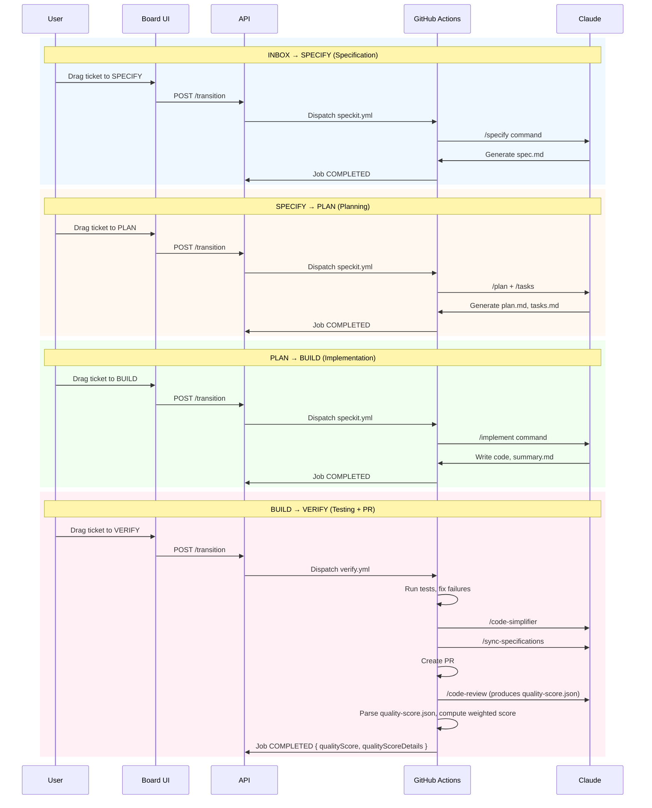
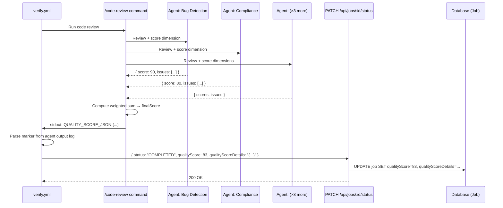
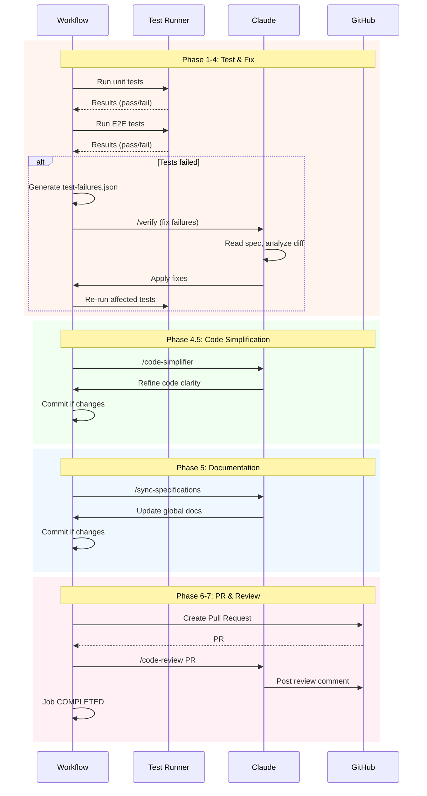
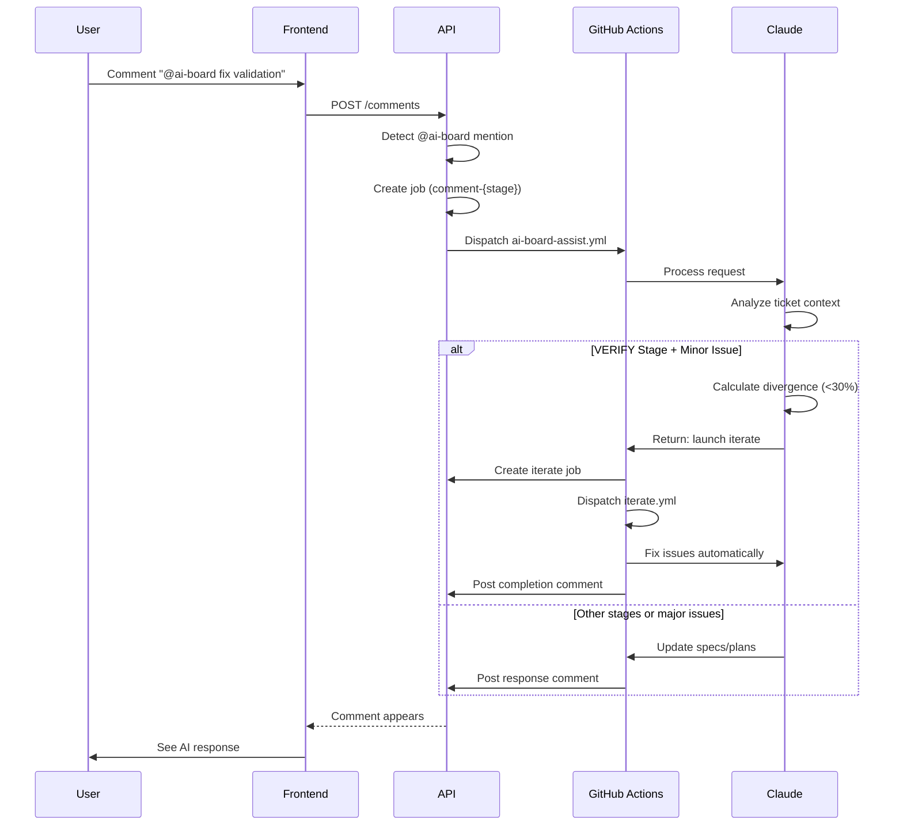
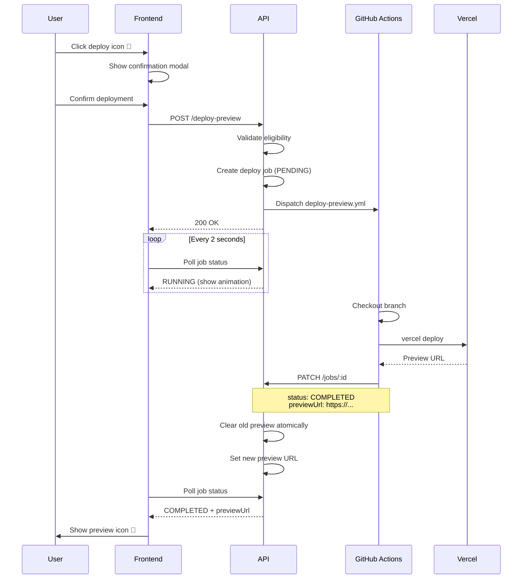

# Automation - Functional Specification

## Purpose

The automation system enables AI-powered workflows that automatically generate specifications, plans, and implementations when tickets move through workflow stages.

## Workflow Overview



## Workflow Jobs

### Automated Test Authentication

Automated test runs can impersonate a seeded test user only in explicit test context.

- Test runs must execute with `TEST_MODE=true` or `NODE_ENV=test`
- Requests must include both `x-test-user-id` and `x-ai-board-test-auth-override: true`
- The override is limited to seeded test users used by automated validation
- Preview, development, and production traffic do not gain access from `x-test-user-id` alone
- If the override request is incomplete or references an unknown test user, the request fails instead of falling back to another identity

### Job Creation

A job is created each time a ticket transitions between stages:

- **INBOX → SPECIFY**: Creates specification generation job
- **SPECIFY → PLAN**: Creates planning job
- **PLAN → BUILD**: Creates implementation job
- **BUILD → VERIFY**: Creates test verification job
- **INBOX → BUILD**: Creates quick implementation job (bypasses specification and planning)
- **(triggered) → BUILD**: Creates cleanup job via project menu (diff-based technical debt cleanup)

### Job Status Lifecycle

Jobs progress through status states:

1. **PENDING**: Job created, waiting to start
2. **RUNNING**: GitHub Actions workflow executing
3. **COMPLETED**: Workflow finished successfully
4. **FAILED**: Workflow encountered error
5. **CANCELLED**: Workflow manually stopped

### Job Tracking

Users can monitor job progress:

- Job status displays in ticket detail view
- Status updates automatically every 2 seconds via polling
- Visual indicators show current state (pending, running, completed, failed)
- Contextual labels transform based on job type:
  - Specification/Planning jobs: "WRITING" when running
  - Implementation jobs: "CODING" when running
  - Verification jobs: "TESTING" when running
  - Iteration jobs: "FIXING" when running
  - AI-BOARD jobs: "ASSISTING" when running
  - Cleanup jobs: "CLEANING" when running
- Polling stops automatically when job reaches terminal state
- Board automatically refreshes when job completes and ticket stage changes

### Job Telemetry Metrics

Each workflow job captures agent usage metrics via OTLP telemetry. Both Claude Code and Codex agents send telemetry to the same endpoint using their respective event name prefixes (`claude_code.*` and `codex.*`).

**Key Format Normalization**:
- The OTLP endpoint accepts both camelCase (Claude/JS) and snake_case (Codex/Rust) key formats
- Automatic normalization converts all incoming keys to a canonical format before storage
- Example: `inputTokens` and `input_tokens` are treated as the same metric

**Event Name Resolution**:
- Claude sends event names in `body.stringValue` (e.g., `claude_code.result`)
- Codex sends event names in `attributes[event.name]` (e.g., `codex.result`)
- The OTLP handler checks both locations to resolve the event name for any incoming log record

**Token Usage**:
- Input tokens consumed by API calls
- Output tokens generated by the agent
- Cache read tokens (from prompt caching, Claude only)
- Cache creation tokens (for new cached content, Claude only)

**Cost Tracking**:
- Total cost in USD for all API calls in the job
- Aggregated across all command executions (e.g., plan + tasks)
- Claude reports cost directly in telemetry events
- Codex does not report cost directly; cost is estimated from OpenAI API pricing based on token counts:

| Model | Input (per 1M tokens) | Output (per 1M tokens) | Cached Input (per 1M tokens) |
|-------|----------------------|------------------------|------------------------------|
| gpt-5-codex | $1.25 | $10.00 | $0.625 |
| gpt-5.3-codex | $1.75 | $14.00 | $0.875 |

**Performance**:
- Total duration in milliseconds
  - Claude reports `duration_ms` per API request; values are summed across all telemetry batches
  - Codex does not report duration; when the job reaches a terminal state (COMPLETED/FAILED/CANCELLED), duration is backfilled from the job wall clock (`completedAt - startedAt`)
- Primary model used (e.g., claude-sonnet-4-5, claude-opus-4-6, gpt-5-codex)

**Tool Usage**:
- List of tools used during execution (Edit, Write, Read, Bash, Glob, Grep, etc.)
- Enables analysis of tool patterns across workflows

**Codex Export Configuration**:
- Only log export is enabled for Codex agents (traces and metrics export are disabled)
- Codex telemetry needs are fully served by structured log records containing token counts and event data

**Aggregation Behavior**:
- Metrics are aggregated across all agent commands in a single job
- For example, a job running `plan` then `tasks` sums metrics from both
- Multiple OTLP batches from the same job accumulate correctly
- Provides total resource usage for the complete workflow execution

### Quality Score Computation (All Workflow Types)

For all verify jobs that complete successfully, the code review step produces a quality score alongside its findings. The score reflects code quality (bugs, compliance, comments) independently of the workflow type — it does not depend on spec/plan artifacts.

**How it works**:
1. The `/code-review` command runs 5 parallel review agents, each covering a scoring dimension:
   - Bug Detection (weight: 30%)
   - Compliance (weight: 40%)
   - Code Comments (weight: 20%)
   - Historical Context (weight: 10%)
   - Spec Sync (weight: 0%)
2. Each agent returns a dimension score (0-100) alongside its issue list
3. The command prints the quality score JSON to stdout with a `QUALITY_SCORE_JSON:` prefix marker (the command does not have file write permissions)
4. The verify workflow captures the agent's stdout and parses the marker to extract the score (with `quality-score.json` file as fallback)
5. The final score and dimension details are sent via `PATCH /api/jobs/:id/status` when marking the job COMPLETED
6. The score is stored on the Job record (`qualityScore`, `qualityScoreDetails`) and displayed in the UI

**Score thresholds**:
| Range | Label | Color |
|-------|-------|-------|
| 90-100 | Excellent | Green |
| 70-89 | Good | Blue |
| 50-69 | Fair | Amber |
| 0-49 | Poor | Red |

**Conditions where no score is produced**:
- Verify job that fails or is cancelled
- Code review command fails to print `QUALITY_SCORE_JSON:` marker to stdout



### Job Restrictions

**Concurrent Job Prevention**:
- Only one job can run per ticket at a time
- New stage transitions blocked while job is PENDING or RUNNING
- Clear error message explains job must complete first
- AI-BOARD mentions disabled during active jobs

**Validation**:
- System checks for active jobs before creating new job
- Race condition protection prevents concurrent job creation
- Optimistic concurrency control ensures data consistency

## Specification Generation

### Automatic Trigger

When ticket moves from INBOX to SPECIFY stage:

1. System creates job record (PENDING status)
2. GitHub Actions workflow dispatches
3. Workflow creates Git feature branch
4. AI generates specification based on ticket title and description
5. Specification written to specs/{branch-name}/spec.md (e.g., specs/AIB-42-add-feature/spec.md)
6. Changes committed and pushed to branch
7. Ticket branch field updated with branch name
8. Job status updates to COMPLETED

### Specification Content

Generated specifications include:

- **User Scenarios**: Primary user story and acceptance scenarios
- **Functional Requirements**: Detailed, testable requirements
- **Key Entities**: Data models and relationships
- **Auto-Resolved Decisions**: Clarifications made by AI with rationale

### Clarification Policies

Specifications can be generated using different resolution strategies:

**AUTO (Context-Aware)**:
- Analyzes ticket description for keywords
- Applies CONSERVATIVE for sensitive features (payment, auth, security)
- Applies PRAGMATIC for internal tools (admin, debug)
- Falls back to CONSERVATIVE when confidence is low
- Documents context detection in specification

**CONSERVATIVE (Security-First)**:
- Prioritizes security and quality
- Short data retention periods
- Strict field validation
- Detailed error handling
- Conservative limits and timeouts

**PRAGMATIC (Speed-First)**:
- Prioritizes simplicity and speed
- Permissive validation
- Simple error messages
- No artificial limits
- Fast time-to-market

**INTERACTIVE (Manual)**:
- Generates specification with [NEEDS CLARIFICATION] markers
- Preserves existing behavior for manual clarification
- Future feature: Interactive question-answer workflow

### Policy Configuration

**Project Default**:
- Each project has a default clarification policy
- Defaults to AUTO if not configured
- Applies to all new tickets in the project

**Ticket Override**:
- Individual tickets can override project default
- Enables fine-grained control for exceptional cases
- Setting to null reverts to project default

**Hierarchical Resolution**:
- Effective policy = ticket policy ?? project policy ?? AUTO
- Ticket-level override takes precedence
- Project-level default applies when ticket has no override
- System default (AUTO) applies if neither is set

## Planning Generation

### Automatic Trigger

When ticket moves from SPECIFY to PLAN stage:

1. System validates specification exists
2. Creates planning job
3. GitHub Actions workflow executes
4. AI reads spec.md and generates plan.md
5. AI generates tasks.md with implementation steps
6. Changes committed to feature branch
7. Job status updates to COMPLETED

### Planning Content

Generated plans include:

- **Implementation Approach**: Technical strategy and architecture
- **Component Design**: Detailed component specifications
- **Task Breakdown**: Step-by-step implementation tasks
- **Testing Strategy**: Unit, integration, and E2E test requirements

### Consistency Enforcement

When planning is generated:
- Plan must align with specification requirements
- Tasks must implement all functional requirements
- No requirements can be dropped or modified
- AI ensures consistency across all three documents (spec.md, plan.md, tasks.md)

## Implementation Execution

### Normal Implementation (PLAN → BUILD)

When ticket moves from PLAN to BUILD stage:

1. System validates plan and tasks exist
2. Creates implementation job
3. Workflow executes /implement command
4. AI reads spec.md, plan.md, and tasks.md
5. AI implements features according to plan
6. Code changes committed to feature branch
7. AI generates implementation summary (summary.md)
8. Job status updates to COMPLETED

### Implementation Summary

After implementation completes (or fails partway), the system automatically generates a summary document:

**Summary Content**:
- **Changes Summary**: Brief description of what was implemented (max 500 chars)
- **Key Decisions**: Important technical decisions made during implementation (max 500 chars)
- **Files Modified**: List of key files created/modified (max 500 chars)
- **Manual Requirements**: Any steps requiring human action, or "None" if fully automated (max 300 chars)

**Summary Location**:
- Written to `specs/{branch-name}/summary.md` (e.g., `specs/AIB-42-add-feature/summary.md`)
- Template-based formatting ensures consistency across all features
- Maximum 2300 characters total

**Partial Implementation**:
- Summary generated even if implementation fails partway through
- Includes progress made and failure point
- Manual Requirements section indicates which task to resume from

### Quick Implementation (INBOX → BUILD)

When ticket moves directly from INBOX to BUILD:

**Confirmation Required**:
- Warning modal appears before transition
- Modal explains trade-offs: speed vs. documentation
- User must explicitly confirm or cancel
- On confirmation, success toast displays: "Workflow dispatched for ticket {ticketKey}" (e.g., "AIB-73")

**Workflow Differences**:
- Bypasses specification and planning stages
- Creates minimal spec.md with only title and description
- Executes /ai-board.quick-impl command instead of /ai-board.implement
- AI implements based solely on title and description context
- No formal requirements or planning documents
- **Sets ticket.workflowType to QUICK** (atomically with job creation)

**WorkflowType Impact**:
- **QUICK**: Set automatically when using quick-impl
- Persists through all subsequent stage transitions
- Controls verification behavior (BUILD → VERIFY skips tests)
- Visual indicator: ⚡ Quick badge shown on ticket card
- Immutable after first BUILD transition (application-level enforcement)

**Use Cases**:
- Bug fixes (typos, small corrections)
- UI tweaks (styling, spacing)
- Simple refactoring (renaming, organization)
- Documentation updates

**Quick-Impl Flexibility**:
- Originally designed for simple tasks (bug fixes, UI tweaks, refactoring)
- Now capable of handling complex features without artificial limitations
- Timeout: 120 minutes (same as full workflow)
- No automatic blocking based on task complexity

## Test Verification (BUILD → VERIFY)

### Automatic Trigger

When ticket moves from BUILD to VERIFY stage:

1. System creates verification job
2. Workflow checks out feature branch
3. **Workflow behavior depends on workflowType**:
   - **FULL workflow**: Complete test suite execution and verification
   - **QUICK workflow**: Skip tests, proceed directly to PR creation
4. Job status updates to COMPLETED

### Workflow Type Behavior

**FULL Workflow (Normal Implementation)**:
- Executes complete test verification process (see Test Execution Strategy below)
- Runs all tests (unit + E2E)
- Generates failure reports if tests fail
- AI analyzes failures and applies systematic fixes
- Creates PR only after all tests pass
- **Time**: ~10-45 minutes (depends on test results)

**QUICK Workflow (Quick Implementation)**:
- Skips all test execution steps
- Skips database setup and Playwright installation
- Skips failure analysis and verification
- Proceeds directly to PR creation
- **Time**: ~2-5 minutes (minimal overhead)
- **Use**: Simple changes where tests are unnecessary (typos, styling, docs)
- **Risk**: No automated validation before PR
- **Success Feedback**: Toast notification displays ticket key (e.g., "AIB-73"), not internal ID

### Test Execution Strategy (FULL Workflow Only)



**Phase 1: Test Execution**
- Unit tests run first (fast feedback)
- E2E tests run after unit tests pass
- Results captured in JSON format
- Continue workflow even if tests fail initially

**Phase 2: Failure Analysis**
- Parse JSON test results from both test suites
- Categorize failures: assertions, timeouts, errors, setup issues
- Identify root causes by grouping similar error patterns
- Calculate impact priority (number of affected tests)
- Generate structured report: `test-failures.json`

**Phase 3: Systematic Fixes**
- AI executes `/verify` command with failure report
- **Critical Context**: All tests were passing on main branch (100% baseline)
- **Key Insight**: Test failures are expected when implementing new features
- AI reads specification first to understand intended behavior
- AI compares with main branch: `git diff main...HEAD` to identify changes
- **Decision Framework**:
  - If implementation violates specification → Fix implementation (bugs)
  - If test expects old behavior, spec requires new → Update test (intentional changes)
  - If unclear → Specification is source of truth
- Fixes applied by root cause (highest impact first)
- Incremental validation: re-run only affected tests after each fix
- Quality gates: lint and typecheck after each fix
- Maximum 3 fix attempts per root cause

**Phase 4: Final Validation**
- Run final validation only for test suites that had failures
- If unit tests failed: Re-run unit test suite
- If E2E tests failed: Re-run E2E test suite
- If all tests passed initially: Skip final validation (already validated)
- Commit all test fixes to feature branch
- Push changes to remote

**Phase 4.5: Code Simplification**
- Executes `/code-simplifier` command on branch changes
- Refines code for clarity, consistency, and maintainability
- Preserves all functionality - only improves code structure
- Applies project coding standards from CLAUDE.md
- Commits simplification changes if any improvements made

**Phase 5: Documentation Synchronization**
- Updates global documentation based on finalized specification
- Updates functional specs (`/specs/specifications/functional/`)
- Updates technical docs (`/specs/specifications/technical/`)
- Updates CLAUDE.md if new patterns introduced
- Commits documentation changes before PR creation

**Phase 6: Pull Request Creation**
- Create PR only if all tests pass successfully
- PR body includes test results and implementation details
- Comment posted to ticket with PR link
- Ticket remains in VERIFY stage (no additional transition)

**Phase 7: Automated Code Review**
- Executes `/code-review` command on the created PR
- Reviews for CLAUDE.md compliance
- Reviews for constitution compliance (`.ai-board/memory/constitution.md`)
- Scans for obvious bugs in changed code
- Checks historical git context and code comments
- Posts review findings as PR comment (issues scored 80+ confidence only)

### Test Failure Categories

**Assertion Failures**:
- Test expects value A, but got value B
- Usually indicates implementation logic issues
- AI verifies against specification requirements

**Timeout Failures**:
- Test execution exceeds time limit
- May indicate infinite loops or missing await keywords
- AI analyzes async operation handling

**Runtime Errors**:
- Crashes, exceptions, null pointer errors
- Indicates missing error handling or type safety issues
- AI reviews error boundaries and validation

**Setup Failures**:
- Test environment or database initialization issues
- Problems with test data fixtures
- AI validates test isolation and global setup

### Verification Success

When all tests pass:

**Workflow Actions**:
- Commits any test fixes to branch
- Creates pull request for code review
- Posts AI-BOARD comment with PR link
- Updates job status to COMPLETED

**User Feedback**:
- Visual indicator shows "TESTING" while running
- Status updates every 2 seconds via polling
- Success notification when PR created
- Clear message that code review can begin

### Verification Failure

When tests cannot be fixed automatically:

**Workflow Behavior**:
- Does NOT create pull request
- Job status updates to FAILED
- Detailed error log available in GitHub Actions

**User Actions**:
- Review failure details in workflow logs
- Manually fix remaining test failures
- Can re-transition ticket to trigger verification again
- Or manually create PR after fixing issues

### Resource Optimization

**Incremental Testing**:
- Only re-run affected tests after each fix
- Avoids redundant full test suite execution
- Provides faster feedback during fix iteration

**Smart Final Validation**:
- Only re-run test suites that had failures
- If unit tests failed: Final unit validation only
- If E2E tests failed: Final E2E validation only
- If all passed initially: Skip final validation entirely
- Saves 2-10 minutes per workflow when tests pass on first run

**Test Categorization**:
- Fast tests (unit): < 10 seconds total
- Medium tests (API): < 2 minutes total
- Slow tests (E2E): < 10 minutes total

**Failure Prevention**:
- Clear error messages guide AI to correct fixes
- Structured failure reports enable systematic analysis
- Quality gates prevent introducing new issues

## Branch Management

### Branch Creation

Workflows automatically create Git feature branches:

**Branch Naming**:
- Format: `{ticketKey}-{description}` (ai-board workflows)
- Example: `AIB-42-ticket-comments-context`
- ticketKey: Project-specific ticket identifier (e.g., AIB-42)
- Description: Kebab-case slug from ticket title (first 3 words)
- CLI fallback: `{num}-{description}` when not invoked via ai-board

**Branch Lifecycle**:
1. Workflow checks out main branch
2. Script creates new feature branch
3. All changes committed to feature branch
4. Branch name stored in ticket.branch field
5. Subsequent workflows use existing branch

### Branch Updates

Each workflow stage adds to the same branch:
- SPECIFY: Creates specs/{branch-name}/spec.md
- PLAN: Adds plan.md and tasks.md to specs directory
- BUILD: Adds implementation code to project
- AI-BOARD comments: Modifies existing spec/plan files

**Atomic Commits**:
- Each workflow stage creates one commit
- All file changes in stage committed together
- No partial commits or incomplete states
- Clear commit messages describe changes

## Workflow Execution

### GitHub Actions Integration

Workflows execute on GitHub Actions infrastructure:

**Workflow Files**:
- `.github/workflows/speckit.yml`: Normal workflow (SPECIFY → PLAN → BUILD)
- `.github/workflows/quick-impl.yml`: Quick implementation (INBOX → BUILD)
- `.github/workflows/cleanup.yml`: Cleanup workflow (diff-based technical debt cleanup)
- `.github/workflows/verify.yml`: Test verification and PR creation (BUILD → VERIFY)
- `.github/workflows/ai-board-assist.yml`: AI-BOARD comment responses

**Inputs**:
- Ticket ID, title, description
- Project ID for context
- Job ID for status tracking
- Branch name (empty for new branches)
- WorkflowType (FULL or QUICK) - controls verify.yml test execution
- Agent selection - resolved from ticket override or project default (see Agent Selection below)
- User information (for AI-BOARD mentions)
- Comment content (for AI-BOARD requests)

**Authentication**:
- GitHub token for repository access
- API token for status updates
- `CLAUDE_CODE_OAUTH_TOKEN` for Claude CLI access, or `OPENAI_API_KEY` for Codex CLI access (resolved by agent type)

### Workflow Timeouts

**Default Limits**:
- Specification/Planning/Implementation: 120 minutes maximum
- Quick implementation: 120 minutes maximum
- Verification workflow: 45 minutes maximum
- Typical execution: 2-5 minutes for specification
- Typical execution: 5-15 minutes for verification (with test fixes)
- Network timeout: 15 seconds for API calls

**Timeout Behavior**:
- Workflow fails if execution exceeds limit
- Job status updates to FAILED
- User receives no response (GitHub Actions timeout)
- User can retry by creating new stage transition

## Error Handling

### Workflow Failures

When workflows encounter errors:

**Job Status**:
- Status updates to FAILED
- Timestamp records failure time
- User sees error indicator in UI

**Error Messages**:
- User-friendly error descriptions
- Link to GitHub Actions logs for details
- Suggestion to use alternative workflow if applicable

**Recovery**:
- User can view error details
- User can retry by creating new transition
- Failed jobs don't block future operations

### Network Failures

**API Timeouts**:
- 15-second timeout for ticket creation
- Network error displays retry option
- Clear messaging explains failure

**Optimistic Updates**:
- UI updates immediately (optimistic)
- Rollback occurs if API call fails
- User sees current database state after rollback

## Test Environment Behavior

### Test Ticket Detection

Tickets with "[e2e]" prefix in title:
- Workflows execute but skip expensive Claude CLI steps
- Post skip message comment
- Update job status to COMPLETED
- No Claude API calls logged
- Enables fast test execution without API costs

### Test Data Isolation

Test workflows maintain separation:
- Test tickets identified by [e2e] prefix
- Production workflows unaffected by test execution
- API credits not consumed for test tickets

## AI-BOARD Assistant



### Purpose

AI-BOARD Assistant provides collaborative help through ticket comments. Users mention `@ai-board` to request assistance with specifications, planning, and verification issues.

### Stage Support

AI-BOARD Assistant is available in specific stages:

**SPECIFY Stage**:
- Update feature specifications based on user feedback
- Add or remove requirements
- Clarify acceptance criteria
- Modify spec.md based on requests

**PLAN Stage**:
- Holistically update all feature documentation
- Modify plan.md, tasks.md, spec.md together
- Ensure consistency across all artifacts
- Add or remove tasks from implementation plan

**BUILD Stage**:
- Currently not implemented
- Returns "feature not available" message
- Future: Will provide implementation guidance

**VERIFY Stage**:
- Quantify issues discovered during testing
- Automatically fix minor problems (<30% divergence)
- Inform user of options for moderate changes
- Recommend requalification for major issues

### Triggering AI-BOARD Assistant

**How to Request Help**:
1. Add comment mentioning `@ai-board` with request
2. System creates AI-BOARD job (command: `comment-{stage}`)
3. Workflow dispatches to process request
4. AI-BOARD responds with comment after processing

**Request Examples**:
- `@ai-board please add error handling for network timeouts`
- `@ai-board remove phase 5 from the plan`
- `@ai-board the validation isn't working correctly`

### VERIFY Stage Intelligence

When mentioned in VERIFY stage, AI-BOARD quantifies the issue:

**Issue Quantification**:
```
divergence = (
  files_to_change * 0.3 +
  spec_changes_needed * 0.4 +
  architecture_impact * 0.3
) / total_scope
```

**Response Categories**:

**Minor Issues (<30% divergence)**:
- Automatically launches `iterate` job
- Fixes issues without user intervention
- Updates code and specifications
- Ticket remains in VERIFY stage
- Job shows "FIXING" status while running

**Moderate Issues (30-60% divergence)**:
- Informs user of required changes
- Provides effort estimate (hours)
- Suggests options:
  - Move to PLAN to adjust specifications
  - Move to INBOX for full requalification
  - Ship current and create new ticket for enhancements
- User makes decision manually

**Major Issues (>60% divergence)**:
- Indicates fundamental misalignment
- Recommends moving to INBOX for requalification
- Or shipping MVP and creating new feature ticket
- Automatic fixes not possible

### Iterate Workflow

For minor issues in VERIFY, AI-BOARD triggers the iterate workflow:

**Iterate Job Creation**:
1. AI-BOARD detects minor issues (<30% divergence)
2. Creates job with command='iterate'
3. Dispatches iterate.yml workflow
4. Workflow fixes code issues
5. Updates branch specifications
6. Synchronizes global documentation
7. Commits and pushes changes

**Iterate Behavior**:
- Ticket stays in VERIFY stage throughout
- Job status shows "FIXING" while running
- Preserves all existing work
- Makes minimal targeted changes
- Updates both code and documentation

### Job Restrictions

**During AI-BOARD Processing**:
- Only one AI-BOARD job per ticket at a time
- Stage transitions blocked while job active
- New mentions disabled until job completes
- Clear messaging explains job must finish first

**Job Types Created**:
- `comment-specify`: SPECIFY stage assistance
- `comment-plan`: PLAN stage assistance
- `comment-build`: BUILD stage assistance (not implemented)
- `comment-verify`: VERIFY stage assistance
- `iterate`: Automatic fixes during VERIFY

### Response Format

AI-BOARD posts formatted Markdown comments:

**Success Response**:
```
@[username] ✅ **Specifications Updated Successfully**

I've updated the specifications as requested.

### Changes Made:
- spec.md: Added error handling requirements
- plan.md: Updated implementation approach
- tasks.md: Added 2 new tasks

All artifacts remain consistent.
```

**Iterate Launch Response**:
```
@[username] ✅ **Minor adjustments detected - Auto-fixing**

Issues identified (estimated: 1-2h):
- Missing email validation
- Button alignment issues
- Error message formatting

Action: Launching iteration job #123 to fix automatically.
The ticket will remain in VERIFY while fixes are applied.
```

## Deploy Preview (VERIFY Stage)



### Manual Deployment Trigger

Users can manually deploy ticket branches to Vercel preview environment from VERIFY stage:

**Deployment Eligibility**:
- Ticket must be in VERIFY stage
- Must have an associated branch
- Latest job must have COMPLETED status
- No other deployment currently in progress (PENDING/RUNNING state)

**Trigger Method**:
- Deploy icon (rocket) appears on ticket cards meeting eligibility criteria
- Hovering over icon shows tooltip: "Deploy preview to Vercel"
- Clicking icon opens confirmation modal
- User confirms deployment or cancels operation

**Concurrency Control**:
- During active deployment (PENDING/RUNNING), deploy icons on all other tickets are disabled
- Disabled icons show tooltip: "Another deployment is in progress"
- Disabled icons have reduced opacity (50%) and are non-clickable
- Icons re-enable automatically when deployment completes (COMPLETED/FAILED/CANCELLED)

### Single-Preview Enforcement

Only one preview deployment can be active across all project tickets:

**Enforcement Mechanism**:
- Previous preview URL remains visible until new deployment succeeds
- Database transaction atomically clears old preview and sets new preview when workflow completes
- Confirmation modal warns when existing preview will be replaced
- User must explicitly confirm replacement

**Business Rule**:
- New deployment always replaces existing preview
- Old preview remains accessible during new deployment (seamless transition)
- Previous preview URL cleared only when new preview URL is set
- Only most recent deployment remains active

**User Experience**:
- Old preview icon remains visible while new deployment is in progress
- When new deployment completes, old preview disappears and new preview appears atomically
- No gap period where no preview is available

### Deployment Progress

Users monitor deployment status through visual indicators:

**Deploy Job Status Indicator**:
- Rocket icon with bounce animation during PENDING/RUNNING states only
- Icon color indicates status:
  - PENDING/RUNNING: Blue (text-blue-500)
- Updated automatically via job polling (2-second intervals)
- Disappears when deployment reaches terminal state (COMPLETED/FAILED/CANCELLED)
- Replaced by deploy icon (for retry) or preview icon (for successful deployments)

**Preview Icon Display**:
- External link icon (green) appears ONLY on tickets with active preview deployment
- Visible when ticket has non-null `previewUrl` field
- Only one ticket can show preview icon at a time (single-preview enforcement)
- Hovering over icon shows tooltip: "Open preview deployment"
- Clicking icon opens preview URL in new browser tab
- Icon positioned in status bar with other job indicators
- Remains visible until new preview deployment replaces it (seamless transition)

**Deploy Icon Availability**:
- Deploy icon (rocket) appears ONLY on tickets in VERIFY stage meeting eligibility criteria
- Shows during PENDING/RUNNING states with loading animation
- After deployment completes/fails, deploy icon remains visible for re-deployment (in VERIFY stage only)
- Allows users to trigger new deployments even after successful previews
- Deploy icon disabled only while deployment job is PENDING/RUNNING
- **Stage Restriction**: Deploy icon is never shown on tickets outside VERIFY stage (including SHIP)

### Re-Deployment

Users can trigger new deployments at any time after a deployment completes:

**Re-Deployment Scenarios**:
- After successful deployment (COMPLETED) - deploy new version with changes
- After failed deployment (FAILED) - retry after fixing issues
- After cancelled deployment (CANCELLED) - retry deployment

**Re-Deployment Behavior**:
- Deploy icon remains visible after any terminal state (VERIFY stage only)
- Clicking deploy icon opens confirmation modal
- Confirmation modal warns existing preview will be replaced
- New job created, previous job remains in history
- No limit on deployment attempts (while ticket remains in VERIFY stage)
- Previous preview URL cleared when new deployment succeeds (not at start)
- During deployment, previous preview remains accessible (seamless transition)
- **Stage Change**: If ticket moves from VERIFY to SHIP, deploy icon is hidden (preview icon may remain if deployment exists)

### Deployment Workflow

Automated GitHub Actions workflow handles deployment:

**Workflow Steps**:
1. Checkout feature branch
2. Deploy to Vercel using Vercel CLI
3. Capture preview URL from deployment
4. Update ticket with preview URL via API
5. Update job status to COMPLETED or FAILED
6. Log deployment details for debugging

**Authentication**:
- Workflow uses VERCEL_TOKEN for Vercel API
- Workflow uses WORKFLOW_API_TOKEN for updating ticket
- All credentials stored securely in GitHub secrets

## Agent Selection

### Per-Workflow Agent Routing

Every workflow dispatch includes the resolved agent value so each workflow invokes the correct AI CLI tool.

**Agent Resolution**:

The effective agent is determined by a priority chain:
1. **Ticket override** — `ticket.agent` (optional, per-ticket setting)
2. **Project default** — `project.defaultAgent` (required, defaults to CLAUDE)
3. **System fallback** — `CLAUDE` (defensive, only if project default is somehow unset)

**Supported Agents**:
- `CLAUDE` — Anthropic Claude CLI (default)
- `CODEX` — OpenAI Codex CLI

**Scope**:
- All workflow types receive the resolved agent: SPECIFY, PLAN, BUILD, VERIFY, QUICK, CLEAN, AI-BOARD assist, iterate
- Agent selection is read-only during dispatch — it flows from the database into workflow inputs without changing ticket state

## Cleanup Workflow

### Purpose

The cleanup workflow provides automated technical debt cleanup by analyzing all code changes since the last cleanup operation. It performs holistic diff-based analysis to detect dead code, assess project-wide impact, and synchronize specifications.

### Triggering Cleanup

**Menu Trigger**:
- Project menu contains "Clean Project" option (Sparkles icon)
- Available to project owners and members
- Clicking opens confirmation dialog

**Confirmation Dialog**:
- Modal explains cleanup analysis scope
- Lists what will be analyzed: code quality, test coverage, documentation
- User must confirm or cancel operation
- On confirmation, success toast displays: "Cleanup started - Analyzing N shipped ticket(s) for technical debt..."
- N is the count of tickets shipped since last cleanup

**Prerequisites**:
- At least one ticket must have been shipped since last cleanup
- No cleanup workflow currently in progress
- System validates using `shouldRunCleanup` analysis

**Blocked States**:
- If cleanup already running: 409 Conflict error
- If no changes to clean: 400 Bad Request with explanation
- Shows last cleanup date and reason when blocked

### Cleanup Ticket Creation

When cleanup is triggered, the system creates a specialized ticket:

**Ticket Properties**:
- **Title**: "Clean YYYY-MM-DD" (current date)
- **Stage**: BUILD (bypasses INBOX, SPECIFY, PLAN)
- **WorkflowType**: CLEAN (distinct from FULL and QUICK)
- **Description**: Auto-generated summary of shipped tickets since last cleanup

**Atomic Creation**:
- Ticket, job, and transition lock created in single transaction
- No partial states possible
- Rollback on any failure

### Transition Locking

During cleanup execution, the system prevents ticket stage transitions:

**Lock Mechanism**:
- Project stores `activeCleanupJobId` pointing to running cleanup job
- All transition requests check for active cleanup lock
- Lock applies to ALL tickets in the project (not just cleanup ticket)

**Blocked Operations**:
- Drag-and-drop stage transitions
- API-based stage transitions
- Returns HTTP 423 Locked with informative message

**Allowed Operations**:
- Updating ticket descriptions
- Updating ticket documents
- Triggering preview deployments
- Adding comments to tickets
- Viewing ticket details

**Lock Release**:
- Automatically released when cleanup job completes (COMPLETED, FAILED, CANCELLED)
- Released within 5 seconds of workflow completion
- Self-healing: orphaned locks cleared if job is in terminal state

### User Feedback During Cleanup

**Banner Display**:
- Warning banner appears at top of project board
- Shows cleanup ticket key and link
- Indicates transitions are temporarily disabled
- Explains when lock will be released

**Transition Attempts**:
- Blocked transitions show toast notification
- Message explains cleanup is in progress
- Provides link to cleanup ticket for status

### Cleanup Analysis

The cleanup workflow performs diff-based analysis:

**Merge Point Discovery**:
- Finds last cleanup merge commit via `git log --merges --grep="cleanup-"`
- Falls back to project creation date if first cleanup
- Uses merge point as starting point for diff analysis

**Analysis Scope**:
- All code changes since last cleanup merge
- Dead code detection from recent changes
- Project-wide impact assessment
- Specification synchronization check

**Cleanup Targets**:
- **Code**: Remove obsolete code, fix inconsistencies
- **Tests**: Update tests affected by changes
- **Documentation**: Synchronize spec.md, plan.md, CLAUDE.md

### Cleanup Execution

**Workflow Steps**:
1. Find last cleanup merge point from git history
2. Execute `/cleanup` Claude command (creates branch `{ticketKey}-cleanup`)
3. Analyze diff since last cleanup merge
4. Apply fixes without breaking changes
5. Run impacted tests only (not full suite)
6. Create pull request with validated fixes
7. Transition ticket to VERIFY stage

**Success Behavior**:
- Ticket moves to VERIFY stage
- Pull request created for review
- Comment posted with PR link
- Transition lock released

**Failure Behavior**:
- Ticket remains in BUILD stage
- Job status set to FAILED
- Error details in workflow logs
- Transition lock released (allows retry)

### Cleanup Workflow Type Behavior

**BUILD → VERIFY for CLEAN Workflow**:
- Same verification process as FULL workflow
- Runs tests and creates PR
- No special treatment based on workflowType

**Branch Pattern**:
- Cleanup branches named `{ticketKey}-cleanup` (e.g., `AIB-42-cleanup`)
- Follows project branch naming conventions (harmonized with other workflows)
- Branch stored in ticket.branch field
