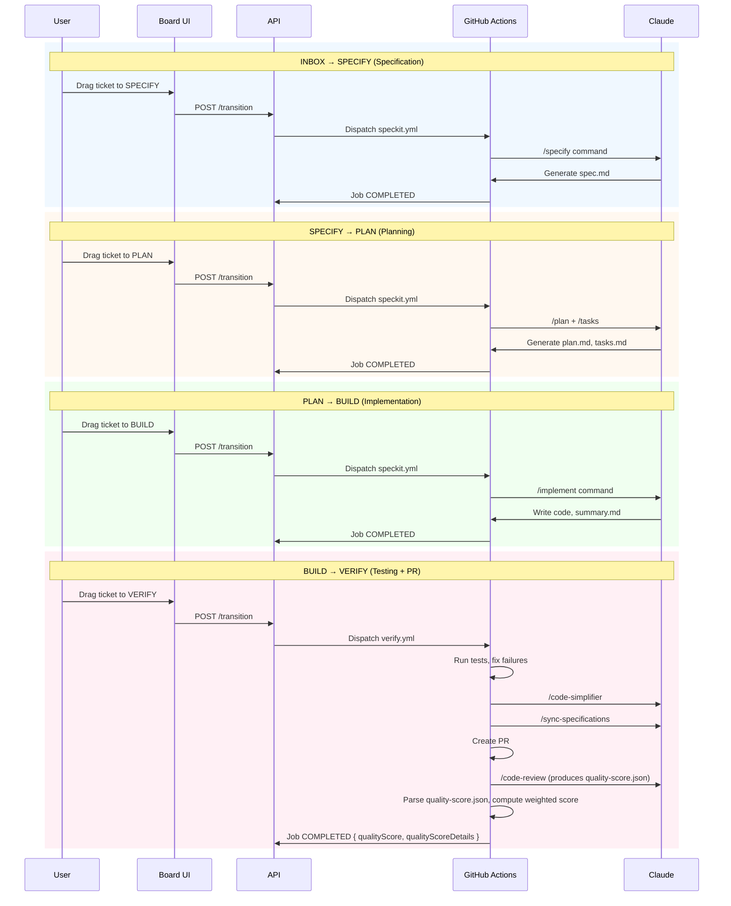
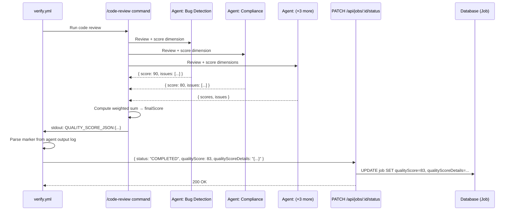

# Automation - Functional Specification

## Documents in This Section

- [Stage Transitions](./stage-transitions.md) — Auto-mode, SPECIFY / PLAN / BUILD / VERIFY generation flows
- [Project Onboarding](./onboarding.md) — First-time project setup (stack detection + LLM content)
- [AI-BOARD Assistant](./assistant.md) — `@ai-board` mentions, slash commands, iterate workflow
- [Deploy Preview](./deploy-preview.md) — Vercel preview deployments from VERIFY stage
- [Agent Selection](./agents.md) — Agent routing (Claude, Codex, Mistral, Gemini) and model selection

## Purpose

The automation system enables AI-powered workflows that automatically generate specifications, plans, and implementations when tickets move through workflow stages.

## Workflow Overview

## Workflow Jobs

### Automated Test Authentication

Automated test runs can impersonate a seeded test user only in explicit test context.

- Test runs must execute with `TEST_MODE=true` or `NODE_ENV=test`
- Requests must include both `x-test-user-id` and `x-ai-board-test-auth-override: true`
- The override is limited to seeded test users used by automated validation
- Preview, development, and production traffic do not gain access from `x-test-user-id` alone
- If the override request is incomplete or references an unknown test user, the request fails instead of falling back to another identity

### Job Creation

A job is created each time a ticket transitions between stages:

- **INBOX → SPECIFY**: Creates specification generation job
- **SPECIFY → PLAN**: Creates planning job
- **PLAN → BUILD**: Creates implementation job
- **BUILD → VERIFY**: Creates test verification job
- **INBOX → BUILD**: Creates quick implementation job (bypasses specification and planning)

### Job Status Lifecycle

Jobs progress through status states:

1. **PENDING**: Job created, waiting to start
2. **RUNNING**: GitHub Actions workflow executing
3. **COMPLETED**: Workflow finished successfully
4. **FAILED**: Workflow encountered error
5. **CANCELLED**: Workflow manually stopped

### Job Tracking

Users can monitor job progress:

- Job status displays in ticket detail view
- Status updates automatically every 2 seconds via polling
- Visual indicators show current state (pending, running, completed, failed)
- Contextual labels transform based on job type:
  - Specification/Planning jobs: "WRITING" when running
  - Implementation jobs: "CODING" when running
  - Verification jobs: "TESTING" when running
  - Iteration jobs: "FIXING" when running
  - AI-BOARD jobs: "ASSISTING" when running
- Polling stops automatically when job reaches terminal state
- Board automatically refreshes when job completes and ticket stage changes

### Job Telemetry Metrics

Each workflow job captures agent usage metrics through the shared telemetry pipeline. Claude Code, Codex, and Gemini send OTLP log records to the same endpoint using their respective event name prefixes (`claude_code.*`, `codex.*`, and `gemini_cli.*`). Mistral sends a post-execution batch payload to that endpoint after the command finishes.

**Key Format Normalization**:
- The OTLP endpoint accepts both camelCase (Claude/JS) and snake_case (Codex/Rust) key formats
- Automatic normalization converts all incoming keys to a canonical format before storage
- Example: `inputTokens` and `input_tokens` are treated as the same metric

**Event Name Resolution**:
- Claude sends event names in `body.stringValue` (e.g., `claude_code.result`)
- Codex sends event names in `attributes[event.name]` (e.g., `codex.result`)
- Gemini sends event names in `body.stringValue` (e.g., `gemini_cli.api_response`)
- The OTLP handler checks both locations to resolve the event name for any incoming log record

**Token Usage**:
- Input tokens consumed by API calls
- Output tokens generated by the agent
- Cache read tokens (from prompt caching, Claude only)
- Cache creation tokens (for new cached content, Claude only)

**Cost Tracking**:
- Total cost in USD for all API calls in the job
- Aggregated across all command executions (e.g., plan + tasks)
- Claude reports cost directly in telemetry events
- Codex does not report cost directly; cost is estimated from OpenAI API pricing based on token counts:

| Model | Input (per 1M tokens) | Output (per 1M tokens) | Cached Input (per 1M tokens) |
|-------|----------------------|------------------------|------------------------------|
| gpt-5-codex | $1.25 | $10.00 | $0.625 |
| gpt-5.3-codex | $1.75 | $14.00 | $0.875 |

- Gemini cumulative OTLP events may include cost directly; when they do not, cost is estimated from supported Gemini pricing tables based on merged token counts. Unsupported Gemini model identifiers preserve usage metrics while leaving cost unavailable.
- Mistral batch telemetry is costed server-side from Mistral pricing data unless the batch explicitly marks cost as unavailable.

**Performance**:
- Total duration in milliseconds
  - Claude reports `duration_ms` per API request; values are summed across all telemetry batches
  - Codex does not report duration; when the job reaches a terminal state (COMPLETED/FAILED/CANCELLED), duration is backfilled from the job wall clock (`completedAt - startedAt`)
  - Gemini reports cumulative `duration_ms` values in native `gemini_cli.api_response` events when available
  - Failed or cancelled jobs keep their terminal status even when Gemini telemetry is partial, delayed, or absent; the status endpoint remains authoritative and can backfill wall-clock duration when telemetry did not persist one
- Primary model used (e.g., claude-sonnet-4-5, claude-opus-4-6, gpt-5-codex)

**Tool Usage**:
- List of tools used during execution (Edit, Write, Read, Bash, Glob, Grep, etc.)
- Enables analysis of tool patterns across workflows

**Codex Export Configuration**:
- Only log export is enabled for Codex agents (traces and metrics export are disabled)
- Codex telemetry needs are fully served by structured log records containing token counts and event data

**Aggregation Behavior**:
- Metrics are aggregated across all agent commands in a single job
- For example, a job running `plan` then `tasks` sums metrics from both
- Multiple OTLP batches from the same job accumulate correctly
- Gemini telemetry is treated as cumulative snapshots, so each persisted field keeps the highest known value from native Gemini events instead of summing duplicate totals
- Batch JSON telemetry remains reserved for Mistral; Gemini batch payloads are rejected
- Provides total resource usage for the complete workflow execution

**Context Metrics** (per-turn analysis):

For agents that report per-turn telemetry (Claude and Codex), the system computes three context-size metrics from individual API request events:

- **Peak context tokens**: Maximum input tokens observed in any single turn (proxy for context window pressure)
- **Average context tokens**: Mean input tokens across all turns
- **Turn count**: Total number of model calls in the job

These metrics are derived from `input_tokens` on each `claude_code.api_request` event (Claude) or `totalInputTokens` on each `codex.sse_event` with `response.completed` (Codex). Metrics merge correctly across multiple OTLP batches: peak via `Math.max`, average recomputed from running sums, turn count via addition.

Agents without per-turn telemetry (Gemini, Mistral) leave all three fields null — the system never writes zero as a substitute for missing data. Partial data from failed jobs is preserved.

**Context Health Indicator** (job timeline):

Each job in the timeline displays a color-coded context-health pill when context metrics are available:

| Tier | Peak Context Range | Color |
|------|-------------------|-------|
| Healthy | < 50,000 tokens | Green |
| Warning | 50,000 – 99,999 tokens | Yellow |
| Danger | ≥ 100,000 tokens | Red |

The pill shows the abbreviated peak value and turn count (e.g., "82.0K ctx · 12 turns"). It is hidden entirely for jobs without context metrics (incompatible agents, historical jobs, or pre-feature data).

Expanding a job row reveals the full context metrics (peak, average, turn count) alongside existing telemetry fields (tokens, cost, duration). The context metrics section is hidden when all three values are null.

### Quality Score Computation (All Workflow Types)

For all verify jobs that complete successfully, the code review step produces a quality score alongside its findings. The score reflects code quality (bugs, compliance, comments) independently of the workflow type — it does not depend on spec/plan artifacts.

**How it works**:
1. The `/code-review` command runs 5 parallel review agents, each covering a scoring dimension:
   - Compliance (weight: 30%)
   - Bug Detection (weight: 30%)
   - Product Contract Sync (weight: 20%)
   - Edge Cases & Failure Modes (weight: 15%)
   - Historical Context (weight: 5%)
2. Each agent returns a dimension score (0-100) alongside its issue list
3. The command prints the quality score JSON to stdout with a `QUALITY_SCORE_JSON:` prefix marker (the command does not have file write permissions)
4. The verify workflow captures the agent's stdout and parses the marker to extract the score (with `quality-score.json` file as fallback)
5. The final score and dimension details are sent via `PATCH /api/jobs/:id/status` when marking the job COMPLETED
6. The score is stored on the Job record (`qualityScore`, `qualityScoreDetails`) and displayed in the UI

**Score thresholds**:
| Range | Label | Color |
|-------|-------|-------|
| 90-100 | Excellent | Green |
| 70-89 | Good | Blue |
| 50-69 | Fair | Amber |
| 0-49 | Poor | Red |

**Conditions where no score is produced**:
- Verify job that fails or is cancelled
- Code review command fails to print `QUALITY_SCORE_JSON:` marker to stdout

### Job Cancellation

Users can cancel a RUNNING or PENDING job from two surfaces:
- **Board card** (hover): a cancel button (X icon) appears next to the status indicator when hovering a card with an active job
- **Ticket detail modal**: a cancel button is always visible on each active job row in the job timeline

Both surfaces require confirmation before proceeding ("Annuler le workflow {command} en cours ?").

**Cancellation mechanics**:
- RUNNING job: the system calls the GitHub Actions API to cancel the workflow run using the stored `workflowRunId`, then marks the job CANCELLED
- PENDING job (no `workflowRunId`): the job is marked CANCELLED directly; if the workflow run starts after this, its first RUNNING status callback is rejected with 409 so the workflow self-aborts
- Already-terminal job: returns the current status without error (idempotent)
- GitHub API failure: the job status is not changed and an error is returned

The cancel button is disabled after the first click to prevent duplicate requests.

### Job Restrictions

**Concurrent Job Prevention**:
- Only one job can run per ticket at a time
- New stage transitions blocked while job is PENDING or RUNNING
- Clear error message explains job must complete first
- AI-BOARD mentions disabled during active jobs

**Validation**:
- System checks for active jobs before creating new job
- Race condition protection prevents concurrent job creation
- Optimistic concurrency control ensures data consistency

## Branch Management

### Branch Creation

Workflows automatically create Git feature branches:

**Branch Naming**:
- Format: `{ticketKey}-{description}` (ai-board workflows)
- Example: `AIB-42-ticket-comments-context`
- ticketKey: Project-specific ticket identifier (e.g., AIB-42)
- Description: Kebab-case slug from ticket title (first 3 words)
- CLI fallback: `{num}-{description}` when not invoked via ai-board

**Branch Lifecycle**:
1. Workflow checks out main branch
2. Script creates new feature branch
3. All changes committed to feature branch
4. Branch name stored in ticket.branch field
5. Subsequent workflows use existing branch

### Branch Updates

Each workflow stage adds to the same branch:
- SPECIFY: Creates specs/{branch-name}/spec.md
- PLAN: Adds plan.md and tasks.md to specs directory
- BUILD: Adds implementation code to project
- AI-BOARD comments: Modifies existing spec/plan files

**Atomic Commits**:
- Each workflow stage creates one commit
- All file changes in stage committed together
- No partial commits or incomplete states
- Clear commit messages describe changes

## Workflow Execution

### GitHub Actions Integration

Workflows execute on GitHub Actions infrastructure:

**Workflow Files**:
- `.github/workflows/speckit.yml`: Normal workflow (SPECIFY → PLAN → BUILD)
- `.github/workflows/quick-impl.yml`: Quick implementation (INBOX → BUILD)
- `.github/workflows/verify.yml`: Test verification and PR creation (BUILD → VERIFY)
- `.github/workflows/ai-board-assist.yml`: AI-BOARD comment responses
- `.github/workflows/onboard.yml`: Project onboarding (stack detection + LLM content generation)

**Inputs**:
- Ticket ID, title, description
- Project ID for context
- Job ID for status tracking
- Branch name (empty for new branches)
- WorkflowType (FULL or QUICK) - controls verify.yml test execution
- Agent selection - resolved from ticket override or project default (see Agent Selection below)
- Claude model ID - resolved from ticket/project per-stage config or global fallback (see Claude Model Selection above); omitted for non-Claude agents
- User information (for AI-BOARD mentions)
- Comment content (for AI-BOARD requests)

**Authentication**:
- GitHub token for repository access
- API token for status updates
- AI provider credential for agent access — resolved from the project owner's `UserCredential` at dispatch time (see AI Credential Guard below)

### AI Credential Guard

All AI workflow dispatches (speckit, quick-impl, ai-board-assist, rollback-reset, health scan, stage transitions) are blocked if the project owner has no AI credential configured.

**Pre-dispatch check** (`lib/ai-credentials/workflow.ts`):
- Before calling `octokit.actions.createWorkflowDispatch()`, each dispatch function resolves the project owner's credential via `getOwnerCredential(projectId)`
- If no credential exists, dispatch is rejected immediately with a user-facing error: _"No AI credential configured. Please add your Anthropic key in Settings → AI Credentials."_
- Stage transition failures return `errorCode: 'MISSING_CREDENTIAL'` in the `TransitionResponse`; other dispatch functions throw
- This provides immediate feedback instead of a delayed workflow failure
- The check is bypassed in test mode (`isWorkflowTestMode` returns `true`)

**Runtime credential retrieval** (within GitHub Actions):
- Workflows call `GET /api/internal/credentials?projectId={id}` (authenticated by `WORKFLOW_API_TOKEN`)
- The endpoint returns the env var name and decrypted value
- The value is masked in CI logs via `::add-mask::` before being exported to `$GITHUB_ENV`
- The credential is never passed as a workflow dispatch input

**Runtime credential update** (within GitHub Actions):
- Workflows call `PUT /api/internal/credentials` (authenticated by `WORKFLOW_API_TOKEN`) to re-encrypt an existing credential for a project's owner
- The request body includes `projectId`, `provider`, `value`, and an optional `encoding` field (`base64` or `plain`, defaults to `base64`)
- The endpoint re-encrypts the provided value with AES-256-GCM and updates the stored `UserCredential` record
- Returns `400` if required fields are missing or invalid, `404` if no matching credential exists

**Env var mapping**:
- `API_KEY` credential type → `ANTHROPIC_API_KEY`
- `OAUTH_TOKEN` credential type → `CLAUDE_CODE_OAUTH_TOKEN`

### Workflow Timeouts

**Default Limits**:
- Specification/Planning/Implementation: 120 minutes maximum
- Quick implementation: 120 minutes maximum
- Verification workflow: 45 minutes maximum
- Typical execution: 2-5 minutes for specification
- Typical execution: 5-15 minutes for verification (with test fixes)
- Network timeout: 15 seconds for API calls

**Timeout Behavior**:
- Workflow fails if execution exceeds limit
- Job status updates to FAILED
- User receives no response (GitHub Actions timeout)
- User can retry by creating new stage transition

## Error Handling

### Workflow Failures

When workflows encounter errors:

**Job Status**:
- Status updates to FAILED
- Timestamp records failure time
- User sees error indicator in UI

**Error Messages**:
- User-friendly error descriptions
- Link to GitHub Actions logs for details
- Suggestion to use alternative workflow if applicable

**Recovery**:
- User can view error details
- User can retry by creating new transition
- Failed jobs don't block future operations

### Network Failures

**API Timeouts**:
- 15-second timeout for ticket creation
- Network error displays retry option
- Clear messaging explains failure

**Optimistic Updates**:
- UI updates immediately (optimistic)
- Rollback occurs if API call fails
- User sees current database state after rollback

## Test Environment Behavior

### Test Ticket Detection

Tickets with "[e2e]" prefix in title:
- Workflows execute but skip expensive Claude CLI steps
- Post skip message comment
- Update job status to COMPLETED
- No Claude API calls logged
- Enables fast test execution without API costs

### Test Data Isolation

Test workflows maintain separation:
- Test tickets identified by [e2e] prefix
- Production workflows unaffected by test execution
- API credits not consumed for test tickets

