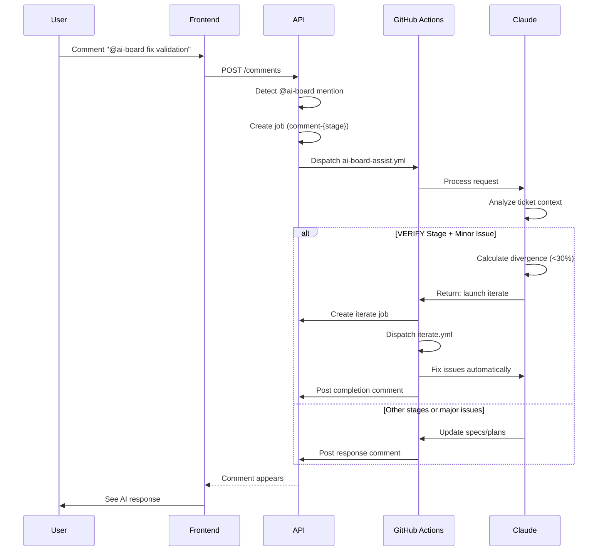

# AI-BOARD Assistant



### Purpose

AI-BOARD Assistant provides collaborative help through ticket comments. Users mention `@ai-board` to request assistance with specifications, planning, and verification issues.

### Stage Support

AI-BOARD Assistant is available in specific stages:

**SPECIFY Stage**:
- Update feature specifications based on user feedback
- Add or remove requirements
- Clarify acceptance criteria
- Modify spec.md based on requests

**PLAN Stage**:
- Holistically update all feature documentation
- Modify plan.md, tasks.md, spec.md together
- Ensure consistency across all artifacts
- Add or remove tasks from implementation plan

**BUILD Stage**:
- Currently not implemented
- Returns "feature not available" message
- Future: Will provide implementation guidance

**VERIFY Stage**:
- Quantify issues discovered during testing
- Automatically fix minor problems (<30% divergence)
- Inform user of options for moderate changes
- Recommend requalification for major issues

### Triggering AI-BOARD Assistant

**How to Request Help**:
1. Add comment mentioning `@ai-board` with request
2. System creates AI-BOARD job (command: `comment-{stage}`)
3. Workflow dispatches to process request
4. AI-BOARD responds with comment after processing

**Request Examples**:
- `@ai-board please add error handling for network timeouts`
- `@ai-board remove phase 5 from the plan`
- `@ai-board the validation isn't working correctly`

### Slash Commands

Some `@ai-board` comments use structured slash commands for specific automated actions. These are routed by `ai-board-assist.yml` before the general-purpose assistant runs.

| Command | Stage | Description |
|---------|-------|-------------|
| `@ai-board /review` | VERIFY only | Re-runs the automated code review on the open PR |
| `@ai-board /compare` | Any | Compares two tickets by telemetry and spec data |
| `@ai-board /fix [numbers\|all]` | VERIFY only | Applies fixes for PR review findings from all sources |

**`/review` Command**:

`/review` re-runs the same `ai-board.code-review` orchestration used by the VERIFY workflow against the ticket's open PR. The review markdown is always (re-)posted as a PR comment.

The quality score produced by the rerun is backfilled onto the ticket's latest verify job **only when that job has no quality score yet** — typically because the original VERIFY workflow's code-review step hit a token limit before emitting its `QUALITY_SCORE_JSON` marker. When a score is already recorded, the rerun does not overwrite it, so repeated `/review` invocations remain non-persistent and only the original verify job's score appears in dashboards and analytics.

**`/fix` Command**:

The `/fix` command automatically addresses PR review findings from three sources: ai-board custom reviews (`### Code review` format), Codex bot inline comments (`chatgpt-codex-connector[bot]`), and GitHub Copilot inline comments.

Invocation forms:
- `@ai-board /fix` — fix all pertinent findings from all sources
- `@ai-board /fix all` — identical to no arguments
- `@ai-board /fix 1 3` — fix only ai-board findings #1 and #3

**Behavior**:
1. Parses review comments from all three sources
2. Deduplicates across sources using priority order: ai-board custom > Codex > Copilot
3. Filters Codex and Copilot findings for pertinence using project context (constitution + CLAUDE.md), rejecting documentation nitpicks, TypeScript/ESLint-caught issues, overengineering suggestions, and false positives
4. Applies targeted code fixes for each pertinent finding
5. Updates `specs/specifications/` files when a fix directly contradicts a documented contract (field names, error codes, response shapes)
6. Runs type-check and lint after all fixes; resolves any introduced errors
7. Pushes a single grouped commit: `fix(review): address N review findings`
8. Posts a summary comment with counts: N findings fixed, M specs updated, K findings rejected (with individual reasons)

**Error cases**:
- No open PR → posts error comment indicating no PR was found
- PR with no review comments → posts error suggesting the user run `/review` first
- All findings rejected as non-actionable → no commit is made; summary reports all rejection reasons

Only one `/fix` job runs per ticket at a time. Stage transitions are blocked while a fix job is active.

### VERIFY Stage Intelligence

When mentioned in VERIFY stage, AI-BOARD quantifies the issue:

**Issue Quantification**:
```
divergence = (
  files_to_change * 0.3 +
  spec_changes_needed * 0.4 +
  architecture_impact * 0.3
) / total_scope
```

**Response Categories**:

**Minor Issues (<30% divergence)**:
- Automatically launches `iterate` job
- Fixes issues without user intervention
- Updates code and specifications
- Ticket remains in VERIFY stage
- Job shows "FIXING" status while running

**Moderate Issues (30-60% divergence)**:
- Informs user of required changes
- Provides effort estimate (hours)
- Suggests options:
  - Move to PLAN to adjust specifications
  - Move to INBOX for full requalification
  - Ship current and create new ticket for enhancements
- User makes decision manually

**Major Issues (>60% divergence)**:
- Indicates fundamental misalignment
- Recommends moving to INBOX for requalification
- Or shipping MVP and creating new feature ticket
- Automatic fixes not possible

### Iterate Workflow

For minor issues in VERIFY, AI-BOARD triggers the iterate workflow:

**Iterate Job Creation**:
1. AI-BOARD detects minor issues (<30% divergence)
2. Creates job with command='iterate'
3. Dispatches iterate.yml workflow
4. Workflow fixes code issues
5. Updates branch specifications
6. Synchronizes global documentation
7. Commits and pushes changes

**Iterate Behavior**:
- Ticket stays in VERIFY stage throughout
- Job status shows "FIXING" while running
- Preserves all existing work
- Makes minimal targeted changes
- Updates both code and documentation

### Job Restrictions

**During AI-BOARD Processing**:
- Only one AI-BOARD job per ticket at a time
- Stage transitions blocked while job active
- New mentions disabled until job completes
- Clear messaging explains job must finish first

**Job Types Created**:
- `comment-specify`: SPECIFY stage assistance
- `comment-plan`: PLAN stage assistance
- `comment-build`: BUILD stage assistance (not implemented)
- `comment-verify`: VERIFY stage assistance
- `comment-ship`: SHIP stage assistance (not implemented)
- `iterate`: Automatic fixes during VERIFY
- `fix`: PR review remediation via `/fix` command

### Response Format

AI-BOARD posts formatted Markdown comments:

**Success Response**:
```
@[username] ✅ **Specifications Updated Successfully**

I've updated the specifications as requested.

### Changes Made:
- spec.md: Added error handling requirements
- plan.md: Updated implementation approach
- tasks.md: Added 2 new tasks

All artifacts remain consistent.
```

**Iterate Launch Response**:
```
@[username] ✅ **Minor adjustments detected - Auto-fixing**

Issues identified (estimated: 1-2h):
- Missing email validation
- Button alignment issues
- Error message formatting

Action: Launching iteration job #123 to fix automatically.
The ticket will remain in VERIFY while fixes are applied.
```

