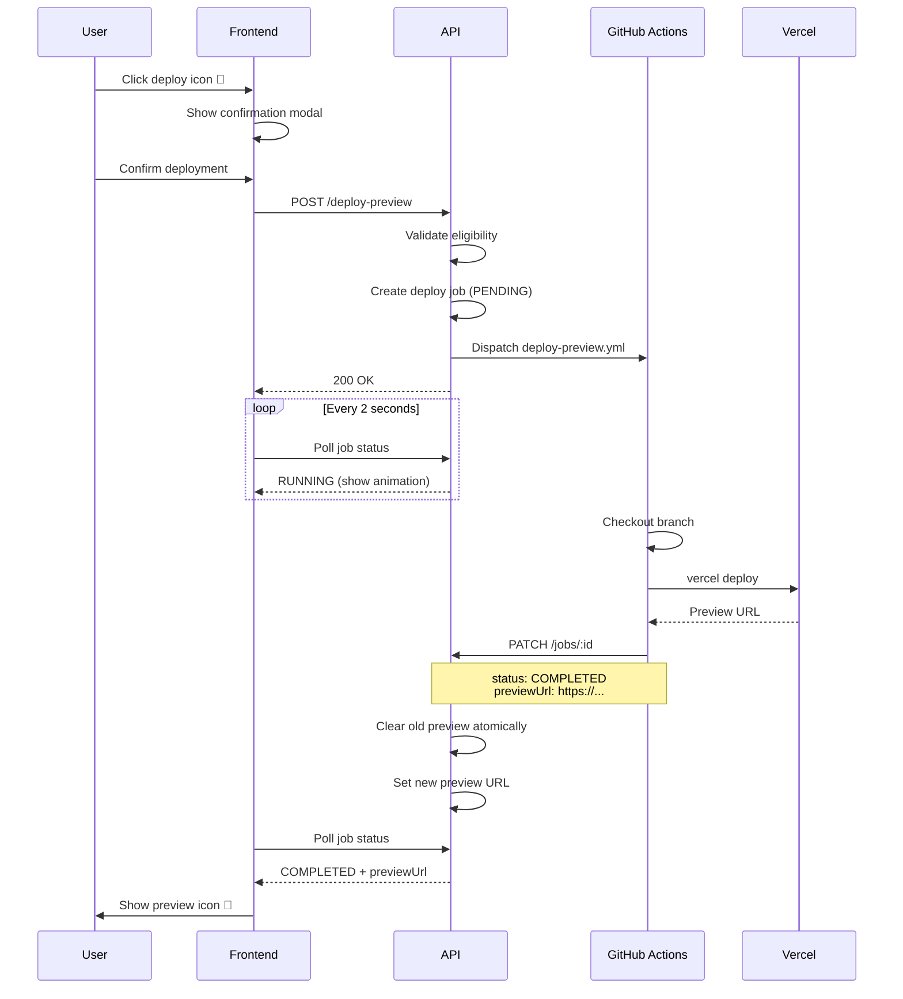

# Deploy Preview

### Manual Deployment Trigger

Users can manually deploy ticket branches to Vercel preview environment from VERIFY stage:

**Deployment Eligibility**:
- Ticket must be in VERIFY stage
- Must have an associated branch
- Latest job must have COMPLETED status
- No other deployment currently in progress (PENDING/RUNNING state)

**Trigger Method**:
- Deploy icon (rocket) appears on ticket cards meeting eligibility criteria
- Hovering over icon shows tooltip: "Deploy preview to Vercel"
- Clicking icon opens confirmation modal
- User confirms deployment or cancels operation

**Concurrency Control**:
- During active deployment (PENDING/RUNNING), deploy icons on all other tickets are disabled
- Disabled icons show tooltip: "Another deployment is in progress"
- Disabled icons have reduced opacity (50%) and are non-clickable
- Icons re-enable automatically when deployment completes (COMPLETED/FAILED/CANCELLED)

### Single-Preview Enforcement

Only one preview deployment can be active across all project tickets:

**Enforcement Mechanism**:
- Previous preview URL remains visible until new deployment succeeds
- Database transaction atomically clears old preview and sets new preview when workflow completes
- Confirmation modal warns when existing preview will be replaced
- User must explicitly confirm replacement

**Business Rule**:
- New deployment always replaces existing preview
- Old preview remains accessible during new deployment (seamless transition)
- Previous preview URL cleared only when new preview URL is set
- Only most recent deployment remains active

**User Experience**:
- Old preview icon remains visible while new deployment is in progress
- When new deployment completes, old preview disappears and new preview appears atomically
- No gap period where no preview is available

### Deployment Progress

Users monitor deployment status through visual indicators:

**Deploy Job Status Indicator**:
- Rocket icon with bounce animation during PENDING/RUNNING states only
- Icon color indicates status:
  - PENDING/RUNNING: Blue (text-blue-500)
- Updated automatically via job polling (2-second intervals)
- Disappears when deployment reaches terminal state (COMPLETED/FAILED/CANCELLED)
- Replaced by deploy icon (for retry) or preview icon (for successful deployments)

**Preview Icon Display**:
- External link icon (green) appears ONLY on tickets with active preview deployment
- Visible when ticket has non-null `previewUrl` field
- Only one ticket can show preview icon at a time (single-preview enforcement)
- Hovering over icon shows tooltip: "Open preview deployment"
- Clicking icon opens preview URL in new browser tab
- Icon positioned in status bar with other job indicators
- Remains visible until new preview deployment replaces it (seamless transition)

**Deploy Icon Availability**:
- Deploy icon (rocket) appears ONLY on tickets in VERIFY stage meeting eligibility criteria
- Shows during PENDING/RUNNING states with loading animation
- After deployment completes/fails, deploy icon remains visible for re-deployment (in VERIFY stage only)
- Allows users to trigger new deployments even after successful previews
- Deploy icon disabled only while deployment job is PENDING/RUNNING
- **Stage Restriction**: Deploy icon is never shown on tickets outside VERIFY stage (including SHIP)

### Re-Deployment

Users can trigger new deployments at any time after a deployment completes:

**Re-Deployment Scenarios**:
- After successful deployment (COMPLETED) - deploy new version with changes
- After failed deployment (FAILED) - retry after fixing issues
- After cancelled deployment (CANCELLED) - retry deployment

**Re-Deployment Behavior**:
- Deploy icon remains visible after any terminal state (VERIFY stage only)
- Clicking deploy icon opens confirmation modal
- Confirmation modal warns existing preview will be replaced
- New job created, previous job remains in history
- No limit on deployment attempts (while ticket remains in VERIFY stage)
- Previous preview URL cleared when new deployment succeeds (not at start)
- During deployment, previous preview remains accessible (seamless transition)
- **Stage Change**: If ticket moves from VERIFY to SHIP, deploy icon is hidden (preview icon may remain if deployment exists)

### Deployment Workflow

Automated GitHub Actions workflow handles deployment:

**Workflow Steps**:
1. Checkout feature branch
2. Deploy to Vercel using Vercel CLI
3. Capture preview URL from deployment
4. Update ticket with preview URL via API
5. Update job status to COMPLETED or FAILED
6. Log deployment details for debugging

**Authentication**:
- Workflow uses VERCEL_TOKEN for Vercel API
- Workflow uses WORKFLOW_API_TOKEN for updating ticket
- All credentials stored securely in GitHub secrets

