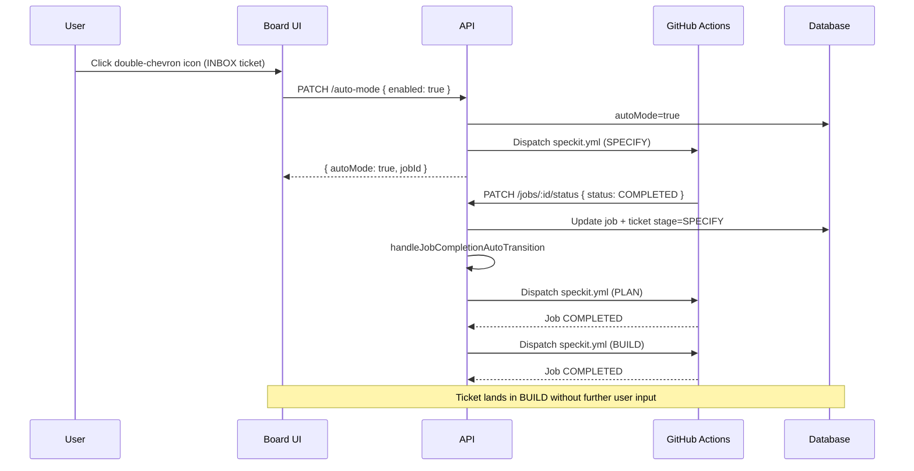
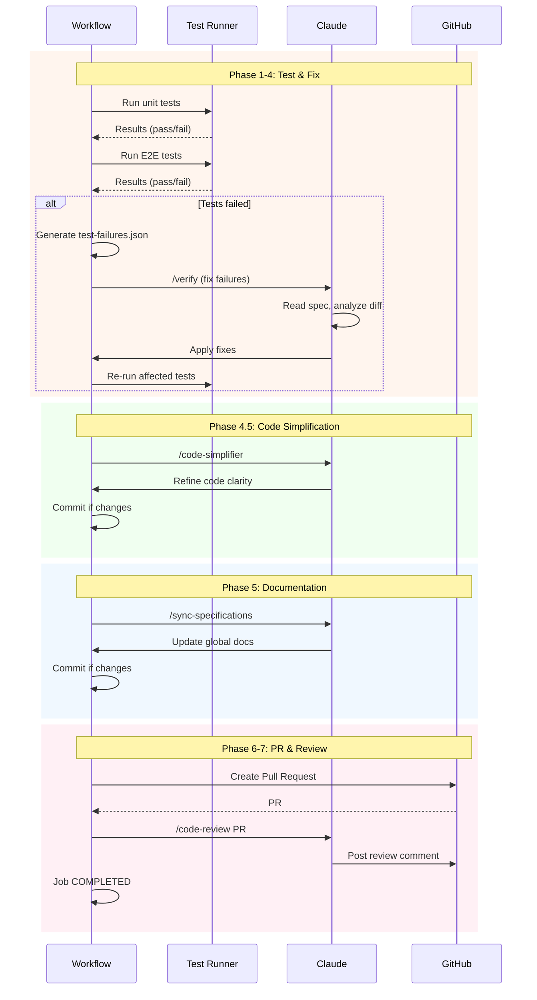

# Stage Transitions

## Auto-Transition Mode

FULL-workflow tickets can opt into automatic stage chaining so that SPECIFY → PLAN → BUILD run back-to-back without requiring a manual drag after each successful job. The toggle is scoped per ticket and persists server-side.

### Eligibility

- Only FULL-workflow tickets in stage INBOX, SPECIFY, or PLAN can enable auto-mode
- QUICK-workflow tickets are never eligible
- Tickets in BUILD, VERIFY, SHIP, or CLOSED are never eligible (BUILD → VERIFY is handled by the existing post-BUILD auto-transition)
- Authorization matches manual stage advance: project owner or member

### Activation

1. User clicks the double-chevron icon on an eligible ticket card
2. Confirmation modal lists the stages that will run automatically (e.g., from SPECIFY: "PLAN → BUILD will run automatically")
3. On confirm:
   - `autoMode` is persisted as `true` for the ticket
   - If no workflow job is currently running, the next-stage transition is dispatched immediately via the same path as a manual advance
   - If a workflow job is currently running, no new dispatch happens — the chain starts after that job's successful completion

### Automatic chain driver

After every terminal job status update (`COMPLETED`, `FAILED`, or `CANCELLED`), a server-side hook inspects the ticket's `autoMode` flag:

- `COMPLETED` + `autoMode=true` + ticket stage ∈ {SPECIFY, PLAN} + ticket is FULL: dispatch the transition to the next stage using the same function used for manual advance (inherits optimistic concurrency, orphaned-job cleanup, and workflow dispatch)
- `FAILED` or `CANCELLED` + `autoMode=true`: flip `autoMode` to `false`; do not dispatch anything; ticket stays on its current stage
- `comment-*`, `deploy-preview`, and `rollback-reset` job completions are ignored — they do not drive the stage chain
- The hook never advances past BUILD
- The hook is fire-and-log: any error during the hook is caught and logged, never failing the outer job-status update

### Deactivation

- Clicking the icon while auto-mode is on turns it off instantly without a confirmation modal
- Disabling never interrupts, cancels, or otherwise affects a running job
- After disable, the icon reverts to hover-only visibility

### Self-disengage conditions

Auto-mode automatically flips to `false` in any of:
- A workflow job on the ticket reaches `FAILED` or `CANCELLED`
- An activation-time immediate dispatch fails (missing credential, quota exhausted, dispatch-layer error)
- The ticket is rolled back from VERIFY to PLAN (done inside the rollback transaction)

After a self-disengage, re-enabling requires the explicit activation flow again. The user is notified of failures through the existing job-failure notification path.

### Persistence and scope

- State is stored on the ticket row (`Ticket.autoMode`) and persists across page reloads and sessions
- All users viewing the ticket see the same on/off state (not a per-user preference)
- Auto-mode on one ticket does not affect any other ticket

### Sequence — SPECIFY → PLAN auto-advance

## Specification Generation

### Automatic Trigger

When ticket moves from INBOX to SPECIFY stage:

1. System creates job record (PENDING status)
2. GitHub Actions workflow dispatches
3. Workflow creates Git feature branch
4. AI generates specification based on ticket title and description
5. Specification written to specs/{branch-name}/spec.md (e.g., specs/AIB-42-add-feature/spec.md)
6. Changes committed and pushed to branch
7. Ticket branch field updated with branch name
8. Job status updates to COMPLETED

### Specification Content

Generated specifications include:

- **User Scenarios**: Primary user story and acceptance scenarios
- **Functional Requirements**: Detailed, testable requirements
- **Key Entities**: Data models and relationships
- **Auto-Resolved Decisions**: Clarifications made by AI with rationale

### Clarification Policies

Specifications can be generated using different resolution strategies:

**AUTO (Context-Aware)**:
- Analyzes ticket description for keywords
- Applies CONSERVATIVE for sensitive features (payment, auth, security)
- Applies PRAGMATIC for internal tools (admin, debug)
- Falls back to CONSERVATIVE when confidence is low
- Documents context detection in specification

**CONSERVATIVE (Security-First)**:
- Prioritizes security and quality
- Short data retention periods
- Strict field validation
- Detailed error handling
- Conservative limits and timeouts

**PRAGMATIC (Speed-First)**:
- Prioritizes simplicity and speed
- Permissive validation
- Simple error messages
- No artificial limits
- Fast time-to-market

**INTERACTIVE (Manual)**:
- Generates specification with [NEEDS CLARIFICATION] markers
- Preserves existing behavior for manual clarification
- Future feature: Interactive question-answer workflow

### Policy Configuration

**Project Default**:
- Each project has a default clarification policy
- Defaults to AUTO if not configured
- Applies to all new tickets in the project

**Ticket Override**:
- Individual tickets can override project default
- Enables fine-grained control for exceptional cases
- Setting to null reverts to project default

**Hierarchical Resolution**:
- Effective policy = ticket policy ?? project policy ?? AUTO
- Ticket-level override takes precedence
- Project-level default applies when ticket has no override
- System default (AUTO) applies if neither is set

## Planning Generation

### Automatic Trigger

When ticket moves from SPECIFY to PLAN stage:

1. System validates specification exists
2. Creates planning job
3. GitHub Actions workflow executes
4. AI reads spec.md and generates plan.md
5. AI generates tasks.md with implementation steps
6. Changes committed to feature branch
7. Job status updates to COMPLETED

### Planning Content

Generated plans include:

- **Implementation Approach**: Technical strategy and architecture
- **Component Design**: Detailed component specifications
- **Task Breakdown**: Step-by-step implementation tasks
- **Testing Strategy**: Unit, integration, and E2E test requirements

### Consistency Enforcement

When planning is generated:
- Plan must align with specification requirements
- Tasks must implement all functional requirements
- No requirements can be dropped or modified
- AI ensures consistency across all three documents (spec.md, plan.md, tasks.md)

## Implementation Execution

### Normal Implementation (PLAN → BUILD)

When ticket moves from PLAN to BUILD stage:

1. System validates plan and tasks exist
2. Creates implementation job
3. Workflow executes /implement command
4. AI reads spec.md, plan.md, and tasks.md
5. AI implements features according to plan
6. Code changes committed to feature branch
7. AI generates implementation summary (summary.md)
8. Job status updates to COMPLETED

### Implementation Summary

After implementation completes (or fails partway), the system automatically generates a summary document:

**Summary Content**:
- **Changes Summary**: Brief description of what was implemented (max 500 chars)
- **Key Decisions**: Important technical decisions made during implementation (max 500 chars)
- **Files Modified**: List of key files created/modified (max 500 chars)
- **Manual Requirements**: Any steps requiring human action, or "None" if fully automated (max 300 chars)

**Summary Location**:
- Written to `specs/{branch-name}/summary.md` (e.g., `specs/AIB-42-add-feature/summary.md`)
- Template-based formatting ensures consistency across all features
- Maximum 2300 characters total

**Partial Implementation**:
- Summary generated even if implementation fails partway through
- Includes progress made and failure point
- Manual Requirements section indicates which task to resume from

### Quick Implementation (INBOX → BUILD)

When ticket moves directly from INBOX to BUILD:

**Confirmation Required**:
- Warning modal appears before transition
- Modal explains trade-offs: speed vs. documentation
- User must explicitly confirm or cancel
- On confirmation, success toast displays: "Workflow dispatched for ticket {ticketKey}" (e.g., "AIB-73")

**Workflow Differences**:
- Bypasses specification and planning stages
- Creates minimal spec.md with only title and description
- Executes /ai-board.quick-impl command instead of /ai-board.implement
- AI implements based solely on title and description context
- No formal requirements or planning documents
- **Sets ticket.workflowType to QUICK** (atomically with job creation)

**WorkflowType Impact**:
- **QUICK**: Set automatically when using quick-impl
- Persists through all subsequent stage transitions
- Controls verification behavior (BUILD → VERIFY skips tests)
- Visual indicator: ⚡ Quick badge shown on ticket card
- Immutable after first BUILD transition (application-level enforcement)

**Use Cases**:
- Bug fixes (typos, small corrections)
- UI tweaks (styling, spacing)
- Simple refactoring (renaming, organization)
- Documentation updates

**Quick-Impl Flexibility**:
- Originally designed for simple tasks (bug fixes, UI tweaks, refactoring)
- Now capable of handling complex features without artificial limitations
- Timeout: 120 minutes (same as full workflow)
- No automatic blocking based on task complexity

## Test Verification (BUILD → VERIFY)

### Automatic Trigger

When ticket moves from BUILD to VERIFY stage:

1. System creates verification job
2. Workflow checks out feature branch
3. **Workflow behavior depends on workflowType**:
   - **FULL workflow**: Complete test suite execution and verification
   - **QUICK workflow**: Skip tests, proceed directly to PR creation
4. Job status updates to COMPLETED

### Workflow Type Behavior

**FULL Workflow (Normal Implementation)**:
- Executes complete test verification process (see Test Execution Strategy below)
- Runs all tests (unit + E2E)
- Generates failure reports if tests fail
- AI analyzes failures and applies systematic fixes
- Creates PR only after all tests pass
- **Time**: ~10-45 minutes (depends on test results)

**QUICK Workflow (Quick Implementation)**:
- Skips all test execution steps
- Skips database setup and Playwright installation
- Skips failure analysis and verification
- Proceeds directly to PR creation
- **Time**: ~2-5 minutes (minimal overhead)
- **Use**: Simple changes where tests are unnecessary (typos, styling, docs)
- **Risk**: No automated validation before PR
- **Success Feedback**: Toast notification displays ticket key (e.g., "AIB-73"), not internal ID

### Test Execution Strategy (FULL Workflow Only)

**Phase 1: Test Execution**
- Unit tests run first (fast feedback)
- E2E tests run after unit tests pass
- Results captured in JSON format
- Continue workflow even if tests fail initially

**Phase 2: Failure Analysis**
- Parse JSON test results from both test suites
- Categorize failures: assertions, timeouts, errors, setup issues
- Identify root causes by grouping similar error patterns
- Calculate impact priority (number of affected tests)
- Generate structured report: `test-failures.json`

**Phase 3: Systematic Fixes**
- AI executes `/verify` command with failure report
- **Critical Context**: All tests were passing on main branch (100% baseline)
- **Key Insight**: Test failures are expected when implementing new features
- AI reads specification first to understand intended behavior
- AI compares with main branch: `git diff main...HEAD` to identify changes
- **Decision Framework**:
  - If implementation violates specification → Fix implementation (bugs)
  - If test expects old behavior, spec requires new → Update test (intentional changes)
  - If unclear → Specification is source of truth
- Fixes applied by root cause (highest impact first)
- Incremental validation: re-run only affected tests after each fix
- Quality gates: lint and typecheck after each fix
- Maximum 3 fix attempts per root cause

**Phase 4: Final Validation**
- Run final validation only for test suites that had failures
- If unit tests failed: Re-run unit test suite
- If E2E tests failed: Re-run E2E test suite
- If all tests passed initially: Skip final validation (already validated)
- Commit all test fixes to feature branch
- Push changes to remote

**Phase 4.5: Code Simplification**
- Executes `/code-simplifier` command on branch changes
- Refines code for clarity, consistency, and maintainability
- Preserves all functionality - only improves code structure
- Applies project coding standards from CLAUDE.md
- Commits simplification changes if any improvements made

**Phase 5: Documentation Synchronization**
- Updates global documentation based on finalized specification
- Updates functional specs (`/specs/specifications/functional/`)
- Updates technical docs (`/specs/specifications/technical/`)
- Updates CLAUDE.md if new patterns introduced
- Commits documentation changes before PR creation

**Phase 6: Pull Request Creation**
- Create PR only if all tests pass successfully
- PR body includes test results and implementation details
- Comment posted to ticket with PR link
- Ticket remains in VERIFY stage (no additional transition)

**Phase 7: Automated Code Review**
- Executes `/code-review` command on the created PR
- Reviews for CLAUDE.md compliance
- Reviews for constitution compliance (`.ai-board/memory/constitution.md`)
- Scans for obvious bugs in changed code
- Checks historical git context and code comments
- Posts review findings as PR comment (issues scored 80+ confidence only)

### Test Failure Categories

**Assertion Failures**:
- Test expects value A, but got value B
- Usually indicates implementation logic issues
- AI verifies against specification requirements

**Timeout Failures**:
- Test execution exceeds time limit
- May indicate infinite loops or missing await keywords
- AI analyzes async operation handling

**Runtime Errors**:
- Crashes, exceptions, null pointer errors
- Indicates missing error handling or type safety issues
- AI reviews error boundaries and validation

**Setup Failures**:
- Test environment or database initialization issues
- Problems with test data fixtures
- AI validates test isolation and global setup

### Verification Success

When all tests pass:

**Workflow Actions**:
- Commits any test fixes to branch
- Creates pull request for code review
- Posts AI-BOARD comment with PR link
- Updates job status to COMPLETED

**User Feedback**:
- Visual indicator shows "TESTING" while running
- Status updates every 2 seconds via polling
- Success notification when PR created
- Clear message that code review can begin

### Verification Failure

When tests cannot be fixed automatically:

**Workflow Behavior**:
- Does NOT create pull request
- Job status updates to FAILED
- Detailed error log available in GitHub Actions

**User Actions**:
- Review failure details in workflow logs
- Manually fix remaining test failures
- Can re-transition ticket to trigger verification again
- Or manually create PR after fixing issues

### Resource Optimization

**Incremental Testing**:
- Only re-run affected tests after each fix
- Avoids redundant full test suite execution
- Provides faster feedback during fix iteration

**Smart Final Validation**:
- Only re-run test suites that had failures
- If unit tests failed: Final unit validation only
- If E2E tests failed: Final E2E validation only
- If all passed initially: Skip final validation entirely
- Saves 2-10 minutes per workflow when tests pass on first run

**Test Categorization**:
- Fast tests (unit): < 10 seconds total
- Medium tests (API): < 2 minutes total
- Slow tests (E2E): < 10 minutes total

**Failure Prevention**:
- Clear error messages guide AI to correct fixes
- Structured failure reports enable systematic analysis
- Quality gates prevent introducing new issues

## Outcome Capture (VERIFY → SHIP)

When a ticket transitions to SHIP, the system records a single delivery snapshot — the `TicketOutcome` row — that captures, for that ticket, what actually happened across its full lifecycle. This is pure instrumentation: the SHIP transition itself is unaffected by capture success or failure, and capture has no user-facing UI.

### What gets captured

For each shipped ticket the outcome stores:

- **Resource consumption**: total cost (USD) and total duration (ms) summed across every job on the ticket — pipeline, friction, and infrastructure jobs all contribute
- **Pipeline vs friction split**: count of standard delivery jobs vs friction jobs (any `iterate` run, any `comment-*` re-run at any stage)
- **Final quality score**: the score from the most recent COMPLETED `verify` or `iterate` job; null when the ticket has no scored verify (e.g., quick-impl)
- **Change shape**: number of files touched, lines added/removed, and the test-vs-code split, derived from comparing the ticket's branch against the project's default branch
- **Structural domains**: sorted unique top-level path segments touched (e.g., `app`, `lib`, `tests`); files at repo root collapse to `(root)`
- **Semantic tags**: any of `touched_db_schema`, `touched_tests`, `touched_ci`, derived from the project's declared language, testing framework, and services
- **Friction-free flag**: a single boolean — true when the ticket ran zero friction jobs AND (its quality score is missing OR ≥ 80)
- **Commit-data flag**: false when the diff couldn't be fetched (missing branch, missing token, GitHub 404/422, rate limit); diff-derived fields are null in that case so consumers can detect partial rows

### Capture trigger

- Capture runs synchronously inside the SHIP stage transition, immediately after the ticket's stage is persisted
- Exactly one outcome per ticket — re-entering the transition (idempotent path) does not recompute the existing snapshot
- Failures inside capture (network errors, GitHub rate limits, missing credentials) are caught and logged so they cannot roll back the SHIP transition
- A diff fetch failure produces a partial row with `hasCommitData: false` rather than no row at all — analytics consumers detect partial cases instead of seeing a missing entry

### Domain inference

Domain extraction is fully generic — it works on every project regardless of stack and never reads per-project hardcoded paths.

- Structural domains are derived purely from the diff: each touched file contributes its top-level path segment
- Semantic tags are derived from the project's declared `.ai-board/config.yml` (language, testing framework / e2e framework, services) against a built-in fragment lookup that covers TypeScript/JavaScript, Python, Go, Rust, Java, Kotlin, Ruby, PHP, Zig, plus common testing frameworks (Vitest, Jest, Mocha, Pytest, Go test, Cargo, RSpec, PHPUnit, Playwright, Cypress) and database services (Postgres, MySQL, Mongo)
- Generic `migrations/` paths always count as `touched_db_schema`; generic CI paths (`.github/workflows/`, `.gitlab-ci`, `.circleci/`, `Jenkinsfile`, etc.) always count as `touched_ci`

### Backfill

Outcomes can be populated for historical shipped tickets so the dataset starts already grounded:

- A backfill pass processes every SHIP-stage ticket in the project that doesn't yet have an outcome
- Idempotent and resumable: re-running after a partial failure picks up only the missing rows
- Rate-limited: a small inter-ticket delay (default 200 ms, only between GitHub-touching captures) keeps the run well under the GitHub authenticated quota
- Owner-only: backfill consumes shared rate-limit budget, so non-owner members cannot trigger it
- Configurable per-pass: `limit` to chunk the run, `delayMs` to tune the inter-ticket sleep

### Querying outcomes

Outcomes are read-only after capture and queryable per project, filtered by friction status (`frictionFree=true|false`) or by structural domain (`domain=app`, etc.). Results are paginated and ordered most-recently-captured first.

