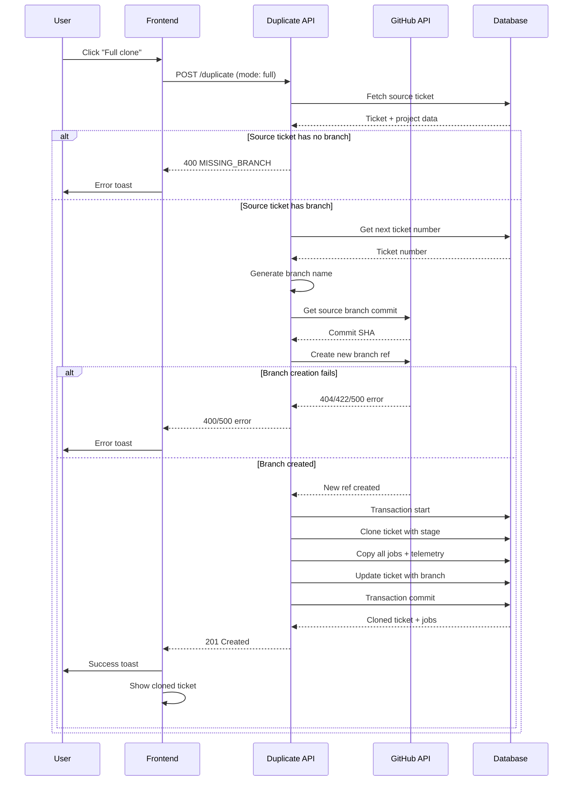
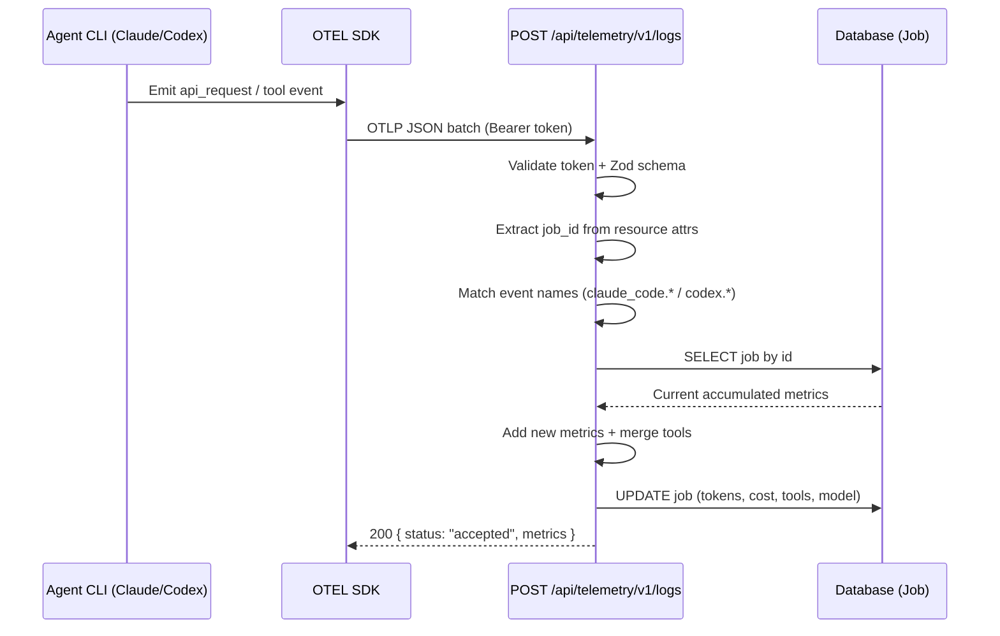
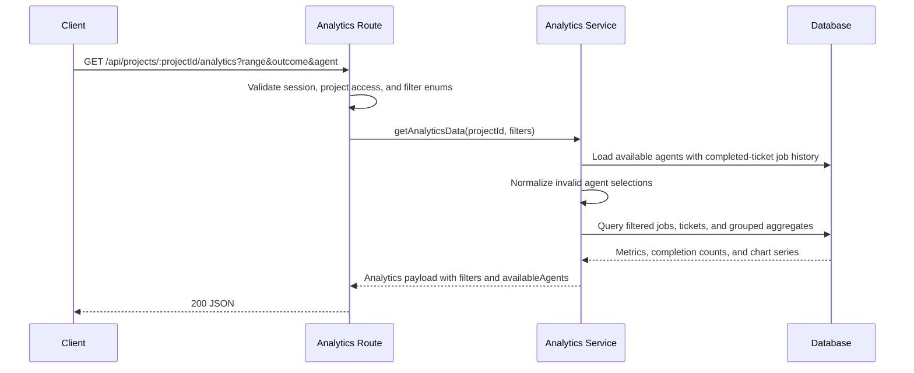

# API Endpoints Reference

Complete REST API documentation with authentication, request/response formats, and error handling.

## Authentication

All API endpoints require authentication via NextAuth.js session cookies except where noted.

**Primary Authentication**: Session cookie (set automatically by NextAuth.js)
**Optional API Authentication**: Bearer PAT on request-aware endpoints that call `requireAuth(request)` or equivalent helpers
**Unauthenticated**: 401 Unauthorized
**Unauthorized Access**: 403 Forbidden (user is neither project owner nor member)

**Preview Credentials Login**:
- Preview deployments can expose the built-in NextAuth credentials callback at `POST /api/auth/callback/credentials`
- This flow is internal to sign-in and is available only when preview-login environment gating is enabled
- Failed credentials submissions redirect to `/auth/signin?error=dev-login`

**Test Override**:
- `x-test-user-id` is a test-only override header for automated tests
- Test support lives in server-side request handling, not in the public sign-in UI

**Authorization Pattern**:
- All project-scoped endpoints validate "owner OR member" access
- Owner check performed first for performance (no database join needed)
- Member check performed via ProjectMember table join if not owner
- Non-members receive 403 Forbidden (API) or 404 Not Found (pages)

**Workflow Endpoints**: Require Bearer token authentication
```
Authorization: Bearer <WORKFLOW_API_TOKEN>
```

## Base URL

**Development**: `http://localhost:3000`
**Production**: `https://ai-board.vercel.app` (example)

## Project Endpoints

### GET /api/projects

Fetch all projects for the authenticated user with shipping status.

**Authentication**: Required (session)
**Authorization**: Returns projects owned by or accessible to the user (owner OR member)

**Response** (200 OK):
```json
{
  "projects": [
    {
      "id": 1,
      "name": "AI Board Development",
      "key": "ABC",
      "description": "Project management tool",
      "deploymentUrl": "https://ai-board.vercel.app",
      "githubOwner": "bfernandez31",
      "githubRepo": "ai-board",
      "userId": "user-abc123",
      "clarificationPolicy": "AUTO",
      "createdAt": "2025-01-01T00:00:00.000Z",
      "updatedAt": "2025-01-15T10:30:00.000Z",
      "ticketCount": 12,
      "lastShippedTicket": {
        "id": 42,
        "ticketKey": "ABC-5",
        "title": "Add user authentication",
        "updatedAt": "2025-01-14T16:20:00.000Z"
      }
    },
    {
      "id": 2,
      "name": "Mobile App",
      "key": "MOB",
      "description": null,
      "deploymentUrl": null,
      "githubOwner": "company",
      "githubRepo": "mobile-app",
      "userId": "user-abc123",
      "clarificationPolicy": "CONSERVATIVE",
      "createdAt": "2025-01-05T00:00:00.000Z",
      "updatedAt": "2025-01-10T08:15:00.000Z",
      "ticketCount": 5,
      "lastShippedTicket": null
    }
  ]
}
```

**Fields**:
- `ticketCount`: Total number of tickets across all stages
- `lastShippedTicket`: Most recent ticket in SHIP stage (null if no shipped tickets)
  - `id`: Ticket ID
  - `ticketKey`: Unique ticket identifier (e.g., "ABC-5")
  - `title`: Ticket title
  - `updatedAt`: When ticket was moved to SHIP stage (used for relative time display)

**Frontend Display**:
- Project cards display ticketKey (bold) followed by title
- Full text "ticketKey + title" truncated with ellipsis if too long
- Tooltip on hover shows complete "ticketKey + title" text

**Errors**:
- `401`: Not authenticated
- `500`: Database error

### GET /api/projects/:projectId

Fetch project details including clarification policy.

**Authentication**: Required (session)
**Authorization**: Must be project owner or member

**Path Parameters**:
- `projectId` (number, required): Project ID

**Response** (200 OK):
```json
{
  "id": 1,
  "name": "AI Board Development",
  "key": "ABC",
  "description": "Project management tool",
  "deploymentUrl": "https://ai-board.vercel.app",
  "githubOwner": "bfernandez31",
  "githubRepo": "ai-board",
  "userId": "user-abc123",
  "clarificationPolicy": "AUTO",
  "activeCleanupJobId": null,
  "createdAt": "2025-01-01T00:00:00.000Z",
  "updatedAt": "2025-01-15T10:30:00.000Z"
}
```

**Fields**:
- `activeCleanupJobId`: ID of active cleanup job (null if no cleanup in progress)
  - Used by frontend to show cleanup lock banner
  - Lock automatically cleared when cleanup job reaches terminal state

**Errors**:
- `401`: Not authenticated
- `403`: User is neither project owner nor member
- `404`: Project not found

### PATCH /api/projects/:projectId

Update project details including clarification policy.

**Authentication**: Required (session)
**Authorization**: Must be project owner (owner-only action)

**Path Parameters**:
- `projectId` (number, required): Project ID

**Request Body**:
```json
{
  "name": "Updated Project Name",
  "key": "UPD",
  "description": "Updated description",
  "deploymentUrl": "https://my-app.vercel.app",
  "clarificationPolicy": "CONSERVATIVE"
}
```

**Validation**:
- `name`: Optional, string
- `key`: Optional, 3-character uppercase alphanumeric string (immutable after creation, validation only)
- `description`: Optional, string or null
- `deploymentUrl`: Optional, string or null (valid URL format)
- `clarificationPolicy`: Optional, enum (AUTO|CONSERVATIVE|PRAGMATIC|INTERACTIVE)

**Response** (200 OK):
```json
{
  "id": 1,
  "name": "Updated Project Name",
  "key": "ABC",
  "deploymentUrl": "https://my-app.vercel.app",
  "clarificationPolicy": "CONSERVATIVE",
  ...
}
```

**Note**: Project key is immutable after creation and cannot be changed via PATCH.

**Errors**:
- `400`: Invalid request body, URL format, or clarification policy enum
- `401`: Not authenticated
- `403`: User is not project owner (members cannot update project settings)
- `404`: Project not found

## Ticket Endpoints

### GET /api/projects/:projectId/tickets

Fetch all tickets for a project, grouped by stage.

**Authentication**: Required (session)
**Authorization**: Must be project owner or member

**Path Parameters**:
- `projectId` (number, required): Project ID

**Query Parameters**:
- `stage` (optional): Filter by stage (INBOX|SPECIFY|PLAN|BUILD|VERIFY|SHIP)

**Response** (200 OK):
```json
{
  "tickets": [
    {
      "id": 42,
      "ticketNumber": 5,
      "ticketKey": "ABC-5",
      "title": "Add login feature",
      "description": "Implement user authentication",
      "stage": "SPECIFY",
      "projectId": 1,
      "branch": "042-add-login-feature",
      "workflowType": "FULL",
      "clarificationPolicy": null,
      "attachments": [],
      "version": 3,
      "closedAt": null,
      "createdAt": "2025-01-10T14:00:00.000Z",
      "updatedAt": "2025-01-15T10:30:00.000Z"
    }
  ]
}
```

**Sorting Behavior**:
- **INBOX**: Tickets sorted by `ticketNumber` ascending (oldest first, newest last)
- **All Other Stages**: Tickets sorted by `updatedAt` descending (most recently updated first)
- Sorting applied per-stage after grouping

**Filtering**:
- By default, excludes CLOSED tickets (they don't appear on board)
- CLOSED tickets only accessible via search or direct URL

**Errors**:
- `401`: Not authenticated
- `403`: User is neither project owner nor member
- `404`: Project not found

### POST /api/projects/:projectId/tickets

Create a new ticket.

**Authentication**: Required (session)
**Authorization**: Must be project owner or member

**Path Parameters**:
- `projectId` (number, required): Project ID

**Request Body**:
```json
{
  "title": "Fix login bug",
  "description": "Login button doesn't work on mobile devices"
}
```

**Validation**:
- `title`: Required, 1-100 characters, alphanumeric + basic punctuation
- `description`: Required, 1-10000 characters, all UTF-8 characters allowed

**Response** (201 Created):
```json
{
  "id": 43,
  "ticketNumber": 6,
  "ticketKey": "ABC-6",
  "title": "Fix login bug",
  "description": "Login button doesn't work on mobile devices",
  "stage": "INBOX",
  "projectId": 1,
  "branch": null,
  "workflowType": "FULL",
  "clarificationPolicy": null,
  "attachments": [],
  "version": 1,
  "createdAt": "2025-01-20T09:00:00.000Z",
  "updatedAt": "2025-01-20T09:00:00.000Z"
}
```

**Errors**:
- `400`: Invalid request body (Zod validation errors)
- `401`: Not authenticated
- `403`: User is neither project owner nor member
- `404`: Project not found
- `500`: Database error

### GET /browse/:key

Fetch ticket by human-readable key (primary user-facing endpoint).

**Authentication**: Required (session)
**Authorization**: Must be project owner or member (resolved via ticket key)

**Path Parameters**:
- `key` (string, required): Ticket key in format "{PROJECT_KEY}-{TICKET_NUMBER}" (e.g., "ABC-123")

**Response** (200 OK):
```json
{
  "id": 42,
  "ticketNumber": 5,
  "ticketKey": "ABC-5",
  "title": "Add login feature",
  "description": "Implement user authentication",
  "stage": "SPECIFY",
  "projectId": 1,
  "branch": "042-add-login-feature",
  "workflowType": "FULL",
  "clarificationPolicy": null,
  "attachments": [],
  "version": 3,
  "project": {
    "id": 1,
    "name": "AI Board Development",
    "key": "ABC",
    "clarificationPolicy": "AUTO"
  },
  "createdAt": "2025-01-10T14:00:00.000Z",
  "updatedAt": "2025-01-15T10:30:00.000Z"
}
```

**Errors**:
- `401`: Not authenticated
- `403`: User is neither project owner nor member
- `404`: Ticket not found

**Notes**:
- This is the primary user-facing endpoint for ticket access
- URLs like `/browse/ABC-123` are shareable and stable
- Used for bookmarks, external links, and ticket references

### GET /api/projects/:projectId/tickets/:id

Fetch single ticket with nested project data.

**Authentication**: Required (session)
**Authorization**: Must be project owner or member

**Path Parameters**:
- `projectId` (number, required): Project ID
- `id` (number or string, required): Ticket ID (numeric) or Ticket Key (e.g., "ABC-123")

**Note**: This endpoint supports both internal numeric IDs (for backward compatibility) and human-readable ticket keys. The ticket key lookup enables fetching tickets not present in the kanban board (e.g., closed tickets accessed via search or direct URL). New code should use `/browse/:key` for user-facing navigation.

**Response** (200 OK):
```json
{
  "id": 42,
  "ticketNumber": 5,
  "ticketKey": "ABC-5",
  "title": "Add login feature",
  "description": "Implement user authentication",
  "stage": "SPECIFY",
  "projectId": 1,
  "branch": "042-add-login-feature",
  "workflowType": "FULL",
  "clarificationPolicy": null,
  "attachments": [
    {
      "type": "uploaded",
      "url": "https://res.cloudinary.com/.../screenshot.png",
      "filename": "screenshot.png",
      "mimeType": "image/png",
      "sizeBytes": 204800,
      "uploadedAt": "2025-01-15T10:00:00.000Z",
      "cloudinaryPublicId": "ai-board/tickets/42/screenshot"
    }
  ],
  "version": 3,
  "project": {
    "id": 1,
    "name": "AI Board Development",
    "key": "ABC",
    "clarificationPolicy": "AUTO"
  },
  "createdAt": "2025-01-10T14:00:00.000Z",
  "updatedAt": "2025-01-15T10:30:00.000Z"
}
```

**Errors**:
- `401`: Not authenticated
- `403`: User is neither project owner nor member
- `404`: Ticket or project not found

### PATCH /api/projects/:projectId/tickets/:id

Update ticket fields with optimistic concurrency control.

**Authentication**: Required (session)
**Authorization**: Must be project owner or member

**Path Parameters**:
- `projectId` (number, required): Project ID
- `id` (number, required): Ticket ID

**Request Body**:
```json
{
  "title": "Updated title",
  "description": "Updated description",
  "clarificationPolicy": "CONSERVATIVE",
  "version": 3
}
```

**Validation**:
- `title`: Optional, 1-100 characters, alphanumeric + basic punctuation
- `description`: Optional, 1-10000 characters (editable only in INBOX stage)
- `clarificationPolicy`: Optional, enum or null (editable only in INBOX stage)
- `version`: Required for concurrency control

**Response** (200 OK):
```json
{
  "id": 42,
  "ticketNumber": 5,
  "ticketKey": "ABC-5",
  "title": "Updated title",
  "description": "Updated description",
  "clarificationPolicy": "CONSERVATIVE",
  "version": 4,
  ...
}
```

**Errors**:
- `400`: Invalid request body, validation failure, or stage restriction violation
- `401`: Not authenticated
- `403`: User is neither project owner nor member
- `404`: Ticket or project not found
- `409`: Version conflict (concurrent update detected)

### POST /api/projects/:projectId/tickets/:id/duplicate

Create a duplicate of an existing ticket using simple copy or full clone mode.

**Full Clone Workflow Sequence**:



**Authentication**: Required (session)
**Authorization**: Must be project owner or member

**Path Parameters**:
- `projectId` (number, required): Project ID
- `id` (number, required): Source ticket ID to duplicate

**Request Body**:
```json
{
  "mode": "simple" | "full"
}
```

**Validation**:
- `mode` (optional): Duplication mode (default: "simple")
  - "simple": Create copy in INBOX with no jobs or branch
  - "full": Preserve stage, copy all jobs with telemetry, create new branch

**Response - Simple Copy** (201 Created):
```json
{
  "id": 107,
  "ticketNumber": 107,
  "ticketKey": "AIB-107",
  "title": "Copy of Add login button",
  "description": "User story: As a user, I want to log in...",
  "stage": "INBOX",
  "version": 1,
  "projectId": 3,
  "branch": null,
  "previewUrl": null,
  "autoMode": false,
  "workflowType": "FULL",
  "attachments": [
    {
      "type": "uploaded",
      "url": "https://res.cloudinary.com/xxx/image/upload/v1/ai-board/tickets/42/mockup.png",
      "filename": "mockup.png",
      "mimeType": "image/png",
      "sizeBytes": 245760,
      "uploadedAt": "2025-01-15T10:30:00.000Z",
      "cloudinaryPublicId": "ai-board/tickets/42/mockup"
    }
  ],
  "clarificationPolicy": "PRAGMATIC",
  "createdAt": "2025-01-20T14:22:00.000Z",
  "updatedAt": "2025-01-20T14:22:00.000Z"
}
```

**Response - Full Clone** (201 Created):
```json
{
  "id": 219,
  "ticketNumber": 219,
  "ticketKey": "AIB-219",
  "title": "Clone of Add login button",
  "description": "User story: As a user, I want to log in...",
  "stage": "PLAN",
  "version": 1,
  "projectId": 3,
  "branch": "219-add-login-button",
  "previewUrl": null,
  "autoMode": false,
  "workflowType": "FULL",
  "attachments": [
    {
      "type": "uploaded",
      "url": "https://res.cloudinary.com/xxx/image/upload/v1/ai-board/tickets/42/mockup.png",
      "filename": "mockup.png",
      "mimeType": "image/png",
      "sizeBytes": 245760,
      "uploadedAt": "2025-01-15T10:30:00.000Z",
      "cloudinaryPublicId": "ai-board/tickets/42/mockup"
    }
  ],
  "clarificationPolicy": "PRAGMATIC",
  "createdAt": "2025-01-20T14:22:00.000Z",
  "updatedAt": "2025-01-20T14:22:00.000Z",
  "jobs": [
    {
      "id": 456,
      "command": "specify",
      "status": "COMPLETED",
      "branch": "219-add-login-button",
      "commitSha": "abc123...",
      "startedAt": "2025-01-20T14:00:00.000Z",
      "completedAt": "2025-01-20T14:05:00.000Z",
      "inputTokens": 5000,
      "outputTokens": 1500,
      "cacheReadTokens": 2000,
      "cacheCreationTokens": 500,
      "costUsd": 0.025,
      "durationMs": 300000,
      "model": "claude-sonnet-4-5-20250929",
      "toolsUsed": ["Read", "Edit", "Write"]
    },
    {
      "id": 457,
      "command": "plan",
      "status": "COMPLETED",
      "branch": "219-add-login-button",
      "commitSha": "def456...",
      "startedAt": "2025-01-20T14:10:00.000Z",
      "completedAt": "2025-01-20T14:18:00.000Z",
      "inputTokens": 8000,
      "outputTokens": 2500,
      "cacheReadTokens": 3000,
      "cacheCreationTokens": 1000,
      "costUsd": 0.045,
      "durationMs": 480000,
      "model": "claude-sonnet-4-5-20250929",
      "toolsUsed": ["Read", "Glob", "Write"]
    }
  ]
}
```

**Simple Copy Behavior** (mode: "simple"):
- **New Ticket Created**: Always in INBOX stage with new ticket number and key
- **Title**: Prefixed with "Copy of " (truncated to 100 chars if needed)
- **Description**: Exact copy from source ticket
- **Clarification Policy**: Copied from source (or null if source uses project default)
- **Attachments**: All image attachments copied by reference (same URLs)
  - Uploaded images (Cloudinary) safely reference same URL
  - External URLs copied as-is
  - No image re-uploading or duplication
- **Branch**: Always null (new tickets have no branch)
- **Preview URL**: Always null (new tickets have no preview)
- **Workflow Type**: Always FULL (standard workflow path)
- **Version**: Always 1 (new ticket version)
- **Jobs**: None (clean slate)

**Full Clone Behavior** (mode: "full"):
- **New Ticket Created**: In same stage as source ticket with new ticket number and key
- **Title**: Prefixed with "Clone of " (truncated to 100 chars if needed)
- **Description**: Exact copy from source ticket
- **Stage**: Preserved from source ticket (SPECIFY, PLAN, BUILD, or VERIFY)
- **Clarification Policy**: Copied from source
- **Attachments**: Copied by reference (same as simple copy)
- **Branch**: New Git branch created from source branch
  - Format: `{TICKET_NUMBER}-{slug}` (e.g., "219-add-login-button")
  - Slug: First 3 words of title, lowercase, hyphenated
  - Points to same commit as source branch
- **Jobs**: All jobs copied with complete telemetry data:
  - Command, status, branch, commit SHA
  - Timestamps (startedAt, completedAt)
  - Token metrics (input, output, cache read, cache creation)
  - Cost and performance (costUsd, durationMs)
  - Model identifier and tools used
  - Jobs reference new ticket ID
- **Workflow Type**: Copied from source
- **Version**: Always 1 (new ticket version)

**Branch Creation**:
- Creates new Git branch via GitHub API
- Uses `git.createRef()` to create `refs/heads/{newBranchName}`
- New branch points to same commit SHA as source branch
- Preserves complete Git history for comparison

**Title Truncation**:
- If "Copy of [original title]" or "Clone of [original title]" exceeds 100 characters:
  - Original title is truncated first
  - Prefix ("Copy of " or "Clone of ") is preserved
  - Final title stays within 100 character limit

**Full Clone Eligibility**:
- Source ticket must have a branch (tickets in SPECIFY, PLAN, BUILD, VERIFY stages)
- Source branch must exist on GitHub
- Returns 400 error if ticket has no branch

**Errors**:
- `400`: Invalid mode parameter, projectId, ticketId format, or full clone precondition failure
  - Invalid mode: `{ "error": "Invalid mode parameter. Must be 'simple' or 'full'", "code": "VALIDATION_ERROR" }`
  - Missing branch: `{ "error": "Source ticket has no branch. Full clone requires a branch.", "code": "MISSING_BRANCH" }`
  - Branch not found: `{ "error": "Source branch '{branch}' not found on GitHub", "code": "BRANCH_NOT_FOUND" }`
- `401`: Not authenticated
- `403`: User is neither project owner nor member
- `404`: Project or source ticket not found
- `500`: Database error, GitHub API error, or branch creation failure
  - Branch exists: `{ "error": "Branch '{newBranchName}' already exists", "code": "BRANCH_CREATION_FAILED" }`
  - GitHub error: `{ "error": "Failed to create branch on GitHub", "code": "BRANCH_CREATION_FAILED" }`

**Performance**:
- Simple copy: <3 seconds from API call to new ticket visible in UI
- Full clone: <5 seconds (includes GitHub API branch creation + database transaction)

### PATCH /api/projects/:projectId/tickets/:id/branch

Update ticket branch name (workflow-only endpoint).

**Authentication**: Bearer token (WORKFLOW_API_TOKEN)
**Authorization**: Workflow token validation (no project membership check)

**Path Parameters**:
- `projectId` (number, required): Project ID
- `id` (number, required): Ticket ID

**Request Body**:
```json
{
  "branch": "042-add-login-feature"
}
```

**Validation**:
- `branch`: Required, max 200 characters or null

**Response** (200 OK):
```json
{
  "id": 42,
  "branch": "042-add-login-feature",
  "updatedAt": "2025-01-15T10:35:00.000Z"
}
```

**Errors**:
- `400`: Invalid branch name (exceeds 200 characters)
- `401`: Invalid or missing workflow token
- `404`: Ticket or project not found

**Note**: This endpoint does NOT use optimistic concurrency control (no version checking).

### POST /api/projects/:projectId/tickets/:id/deploy

Trigger manual Vercel preview deployment (user-initiated).

**Authentication**: Required (session)
**Authorization**: Must be project owner or member

**Path Parameters**:
- `projectId` (number, required): Project ID
- `id` (number, required): Ticket ID

**Request Body**: Empty

**Response** (201 Created):
```json
{
  "success": true,
  "jobId": 125,
  "message": "Deploy preview workflow dispatched"
}
```

**Eligibility Requirements**:
- Ticket must be in VERIFY stage
- Ticket must have a branch
- Latest job must have COMPLETED status

**Workflow Behavior**:
- Creates new Job record with command="deploy-preview", status=PENDING
- Clears any existing preview URL in project (single-preview enforcement)
- Dispatches GitHub Actions workflow (deploy-preview.yml)
- Workflow deploys branch to Vercel and updates ticket with preview URL

**Errors**:
- `400`: Ticket not eligible for deployment (wrong stage, no branch, job not completed)
- `401`: Not authenticated
- `403`: User is neither project owner nor member
- `404`: Ticket or project not found
- `500`: Workflow dispatch error

### PATCH /api/projects/:projectId/tickets/:id/preview-url

Update ticket preview URL (workflow-only endpoint).

**Authentication**: Bearer token (WORKFLOW_API_TOKEN)
**Authorization**: Workflow token validation (no project membership check)

**Path Parameters**:
- `projectId` (number, required): Project ID
- `id` (number, required): Ticket ID

**Request Body**:
```json
{
  "previewUrl": "https://ai-board-080-1490-deploy-preview.vercel.app"
}
```

**Validation**:
- `previewUrl`: Required, max 500 characters, HTTPS-only, Vercel domain pattern
- Pattern: `^https:\/\/[a-z0-9-]+\.vercel\.app$`

**Response** (200 OK):
```json
{
  "id": 42,
  "previewUrl": "https://ai-board-080-1490-deploy-preview.vercel.app",
  "updatedAt": "2025-01-15T10:40:00.000Z"
}
```

**Errors**:
- `400`: Invalid preview URL (non-HTTPS, invalid domain, exceeds 500 characters)
- `401`: Invalid or missing workflow token
- `404`: Ticket or project not found

**Note**: This endpoint does NOT use optimistic concurrency control (no version checking).

### GET /api/projects/:projectId/tickets/search

Search tickets within a project by key, title, or description.

**Authentication**: Required (session) OR Bearer token (workflow)
**Authorization**: Must be project owner or member (session), OR valid workflow token

**Path Parameters**:
- `projectId` (number, required): Project ID

**Query Parameters**:
- `q` (string, required): Search query (minimum 2 characters)
- `limit` (number, optional): Maximum results to return (default: 10, max: 50)

**Response** (200 OK):
```json
{
  "results": [
    {
      "id": 42,
      "ticketKey": "ABC-42",
      "title": "Add user authentication",
      "stage": "BUILD"
    },
    {
      "id": 38,
      "ticketKey": "ABC-38",
      "title": "Fix authentication bug",
      "stage": "VERIFY"
    }
  ],
  "totalCount": 2
}
```

**Search Behavior**:
- Searches across ticketKey, title, and description fields
- Case-insensitive matching (uses Prisma `mode: 'insensitive'`)
- Results ordered by relevance:
  1. Exact ticket key matches (score: 4)
  2. Partial ticket key matches (score: 3)
  3. Title contains query (score: 2)
  4. Description contains query (score: 1)
- Within same relevance score, ordered by most recently updated
- Limited to specified limit (default 10, max 50)

**Fields**:
- `id`: Ticket ID (for opening modal via URL parameter)
- `ticketKey`: Human-readable key (e.g., "ABC-42")
- `title`: Ticket title
- `stage`: Current workflow stage
- `totalCount`: Number of results returned (capped at limit)

**Errors**:
- `400`: Query too short (less than 2 characters) or invalid limit
  ```json
  {
    "error": "Query must be at least 2 characters"
  }
  ```
- `401`: Not authenticated
- `403`: User is neither project owner nor member
- `404`: Project not found
- `500`: Database error

**Performance**: <500ms for typical queries, indexed on projectId

### DELETE /api/projects/:projectId/tickets/:id

Delete ticket with GitHub cleanup (permanent deletion).

**Authentication**: Required (session)
**Authorization**: Must be project owner or member

**Path Parameters**:
- `projectId` (number, required): Project ID
- `id` (number, required): Ticket ID

**Request Body**: Empty

**Response** (204 No Content)

**Deletion Behavior**:
- **Transactional**: All GitHub artifacts must be deleted successfully before database deletion
- **GitHub Cleanup** (in order):
  1. Close all pull requests where head branch matches ticket branch
  2. Delete Git branch from repository
- **Database Cleanup** (cascade):
  1. Delete all associated jobs
  2. Delete all associated comments
  3. Delete ticket record
- **Failure Handling**: If any GitHub operation fails, ticket remains unchanged in database
- **Idempotent Branch Deletion**: If branch already deleted (404 or 422 "reference does not exist"), operation continues successfully

**Validation**:
- Ticket cannot be in SHIP stage (400 error)
- Ticket cannot have PENDING or RUNNING jobs (400 error)

**Errors**:
- `400`: Invalid deletion (SHIP stage or active job)
- `401`: Not authenticated
- `403`: User is neither project owner nor member
- `404`: Ticket or project not found
- `500`: GitHub API error or database error

**GitHub API Errors**:
- 404 errors (branch/PR not found) are ignored (idempotent operation)
- 422 errors with "reference does not exist" message are ignored (branch already deleted)
- Other GitHub API errors abort the deletion and preserve ticket

**Notes**:
- Pull requests are identified by matching head branch name
- All PRs with matching head branch are closed (handles multiple PRs scenario)
- Workflow artifacts (spec.md, plan.md, tasks.md) are deleted when branch is deleted
- Preview deployments become orphaned (Vercel cleanup is manual)
- TanStack Query optimistic update removes ticket immediately from UI

### POST /api/projects/:projectId/tickets/:id/close

Close ticket from VERIFY stage (transition to CLOSED).

**Authentication**: Required (session)
**Authorization**: Must be project owner or member

**Path Parameters**:
- `projectId` (number, required): Project ID
- `id` (number, required): Ticket ID

**Request Body**: Empty

**Response** (200 OK):
```json
{
  "id": 42,
  "stage": "CLOSED",
  "closedAt": "2025-01-15T10:45:00.000Z",
  "updatedAt": "2025-01-15T10:45:00.000Z"
}
```

**Close Behavior**:
1. Validates ticket is in VERIFY stage
2. Validates no PENDING or RUNNING jobs exist
3. Validates project cleanup is not in progress
4. Closes all open GitHub PRs for ticket branch with comment: "Closed by ai-board - ticket moved to CLOSED state"
5. Updates ticket stage to CLOSED and sets closedAt timestamp
6. Preserves Git branch (not deleted)

**GitHub PR Close**:
- Finds all open PRs where head branch matches ticket branch
- Closes each PR with explanatory comment
- Idempotent: succeeds if PRs already closed or no PRs exist
- GitHub API failures logged but don't block close operation

**Errors**:
- `400`: Invalid close (ticket not in VERIFY or has active jobs)
  ```json
  {
    "error": "Cannot close ticket",
    "code": "INVALID_CLOSE",
    "details": {
      "stage": "BUILD",
      "message": "Ticket must be in VERIFY stage"
    }
  }
  ```
- `401`: Not authenticated
- `403`: User is neither project owner nor member
- `404`: Ticket or project not found
- `423`: Cleanup in progress
  ```json
  {
    "error": "Project cleanup in progress",
    "code": "CLEANUP_IN_PROGRESS"
  }
  ```
- `500`: Database error

**Notes**:
- CLOSED tickets removed from board display
- CLOSED tickets remain searchable
- CLOSED is terminal state (no further transitions)
- Branch preserved for audit trail

### POST /api/projects/:projectId/tickets/:id/transition

Transition ticket to target stage with workflow dispatch.

**Authentication**: Required (session)
**Authorization**: Must be project owner or member

**Path Parameters**:
- `projectId` (number, required): Project ID
- `id` (number, required): Ticket ID

**Request Body**:
```json
{
  "targetStage": "SPECIFY"
}
```

**Validation**:
- `targetStage`: Required, enum (SPECIFY|PLAN|BUILD|VERIFY|SHIP)

**Response** (200 OK):
```json
{
  "success": true,
  "jobId": 123,
  "message": "Workflow dispatched successfully"
}
```

**Transition Logic**:
- **INBOX → SPECIFY**: Creates job, dispatches workflow (specify command)
- **INBOX → BUILD**: Quick-impl mode, creates job, dispatches quick-impl workflow, sets workflowType=QUICK
- **SPECIFY → PLAN**: Validates specify job completed, creates job, dispatches workflow (plan command)
- **PLAN → BUILD**: Validates plan job completed, creates job, dispatches workflow (implement command)
- **BUILD → VERIFY**: Creates job, dispatches verify workflow with workflowType (FULL runs tests, QUICK skips to PR)
- **BUILD → INBOX**: Rollback if job failed/cancelled, resets workflowType to FULL
- **VERIFY → PLAN**: Rollback for FULL workflows only:
  1. Validates latest job is COMPLETED, FAILED, or CANCELLED
  2. Clears previewUrl on ticket
  3. Deletes implement job record
  4. Updates ticket stage to PLAN
  5. Dispatches rollback-reset workflow (git reset to pre-BUILD state, preserves spec files)
  6. Creates rollback-reset job to track the git reset operation
- **VERIFY → SHIP**: Manual transition (no workflow)

**Errors**:
- `400`: Invalid transition (non-sequential, job not completed, rollback not allowed)
- `401`: Not authenticated
- `403`: User is neither project owner nor member
- `404`: Ticket or project not found
- `500`: Workflow dispatch error or database error

**Error Response** (Job Not Completed):
```json
{
  "error": "Cannot transition",
  "message": "Cannot transition: workflow is still running",
  "code": "JOB_NOT_COMPLETED",
  "details": {
    "currentStage": "SPECIFY",
    "targetStage": "PLAN",
    "jobStatus": "RUNNING",
    "jobCommand": "specify"
  }
}
```

## Comment Endpoints

### GET /api/projects/:projectId/tickets/:id/comments

Fetch all comments for a ticket.

**Authentication**: Required (session)
**Authorization**: Must be project owner or member

**Path Parameters**:
- `projectId` (number, required): Project ID
- `id` (number, required): Ticket ID

**Response** (200 OK):
```json
{
  "comments": [
    {
      "id": 1,
      "ticketId": 42,
      "userId": "user-abc123",
      "content": "This needs clarification on @[Alice Smith](user-alice) the authentication flow.",
      "createdAt": "2025-01-15T10:00:00.000Z",
      "updatedAt": "2025-01-15T10:00:00.000Z",
      "user": {
        "id": "user-abc123",
        "name": "Bob Johnson",
        "email": "bob@example.com"
      }
    }
  ]
}
```

**Errors**:
- `401`: Not authenticated
- `403`: User is neither project owner nor member
- `404`: Ticket or project not found

### POST /api/projects/:projectId/tickets/:id/comments

Create a new comment.

**Authentication**: Required (session)
**Authorization**: Must be project owner or member

**Path Parameters**:
- `projectId` (number, required): Project ID
- `id` (number, required): Ticket ID

**Request Body**:
```json
{
  "content": "Updated the spec based on feedback."
}
```

**Validation**:
- `content`: Required, 1-2000 characters

**Response** (201 Created):
```json
{
  "id": 2,
  "ticketId": 42,
  "userId": "user-abc123",
  "content": "Updated the spec based on feedback.",
  "createdAt": "2025-01-15T11:00:00.000Z",
  "updatedAt": "2025-01-15T11:00:00.000Z",
  "user": {
    "id": "user-abc123",
    "name": "Bob Johnson",
    "email": "bob@example.com"
  }
}
```

**Errors**:
- `400`: Invalid content (empty, too long)
- `401`: Not authenticated
- `403`: User is neither project owner nor member
- `404`: Ticket or project not found

### POST /api/projects/:projectId/tickets/:id/comments/ai-board

Create AI-BOARD comment (workflow-only endpoint).

**Authentication**: Bearer token (WORKFLOW_API_TOKEN)
**Authorization**: Workflow token validation (no project membership check)

**Path Parameters**:
- `projectId` (number, required): Project ID
- `id` (number, required): Ticket ID

**Request Body**:
```json
{
  "content": "I've updated the specification based on your request.",
  "userId": "ai-board-system-user"
}
```

**Validation**:
- `content`: Required, 1-2000 characters
- `userId`: Must be "ai-board-system-user"

**Response** (201 Created):
```json
{
  "id": 3,
  "ticketId": 42,
  "userId": "ai-board-system-user",
  "content": "I've updated the specification based on your request.",
  "createdAt": "2025-01-15T12:00:00.000Z",
  "updatedAt": "2025-01-15T12:00:00.000Z"
}
```

**Mention Notification Behavior**:
- Automatically extracts @mentions from comment content
- Creates notifications for mentioned project members (owner + members)
- Filters out AI-BOARD self-mentions (no notification created)
- Filters out non-project members (no notification created)
- Uses AI-BOARD user ID as `actorId` in notification records
- Notification creation is non-blocking (errors logged but don't fail comment creation)

**Errors**:
- `400`: Invalid content or userId
- `401`: Invalid or missing workflow token
- `404`: Ticket or project not found

**Note**: Comment creation always succeeds even if notification creation fails (non-blocking pattern)

### DELETE /api/projects/:projectId/tickets/:id/comments/:commentId

Delete a comment (author only).

**Authentication**: Required (session)
**Authorization**: Must be comment author AND (project owner or member)

**Path Parameters**:
- `projectId` (number, required): Project ID
- `id` (number, required): Ticket ID
- `commentId` (number, required): Comment ID

**Response** (204 No Content)

**Errors**:
- `401`: Not authenticated
- `403`: Not comment author
- `404`: Comment, ticket, or project not found

## Notification Endpoints

### GET /api/notifications

Fetch notifications for authenticated user with unread count.

**Authentication**: Required (session)
**Authorization**: User can only access their own notifications

**Auth Guard Behavior**:
- Requests without a valid session return `401`
- `x-test-user-id` does not create a notification identity outside explicit test runs
- If a valid session is present, any conflicting `x-test-user-id` is ignored

**Query Parameters**:
- `limit` (optional): Maximum notifications to return (default: 5, max: 50)

**Response** (200 OK):
```json
{
  "notifications": [
    {
      "id": 1,
      "actorName": "Alice Smith",
      "actorImage": "https://...",
      "ticketKey": "ABC-42",
      "commentPreview": "Can you review the authentication logic in the login handler...",
      "createdAt": "2025-01-20T14:30:00.000Z",
      "read": false,
      "commentId": 123,
      "projectId": 1
    },
    {
      "id": 2,
      "actorName": "Bob Johnson",
      "actorImage": null,
      "ticketKey": "ABC-38",
      "commentPreview": "Thanks for the feedback! I've updated the spec accordingly.",
      "createdAt": "2025-01-19T10:15:00.000Z",
      "read": true,
      "commentId": 118,
      "projectId": 1
    }
  ],
  "unreadCount": 3,
  "hasMore": false
}
```

**Fields**:
- `actorName`: Display name or email of user who created the mention
- `actorImage`: Avatar URL (null if not available)
- `ticketKey`: Human-readable ticket identifier for navigation
- `commentPreview`: First 80 characters of comment content (truncated with "...")
- `createdAt`: ISO 8601 timestamp of notification creation
- `read`: Boolean indicating if notification has been read
- `commentId`: ID for comment anchor navigation and scroll targeting
- `projectId`: Project ID for navigation URL construction and cross-project detection
- `unreadCount`: Total number of unread notifications for user
- `hasMore`: Boolean indicating if more notifications exist beyond limit

**Navigation Context**:
- `projectId` enables same-project vs cross-project detection
- Same-project: Current window navigation when notification.projectId matches board projectId
- Cross-project: New tab navigation when notification.projectId differs from board projectId
- `commentId` used to construct comment anchor (#comment-{id}) for scroll targeting
- `ticketKey` used to construct navigation URL (/projects/{projectId}?modal=open&ticketKey={ticketKey}&tab=comments#comment-{commentId})

**Errors**:
- `401`: Not authenticated
- `500`: Database error

### PATCH /api/notifications/:id/mark-read

Mark a single notification as read.

**Authentication**: Required (session)
**Authorization**: User can only mark their own notifications as read

**Path Parameters**:
- `id` (number, required): Notification ID

**Request Body**: Empty

**Response** (200 OK):
```json
{
  "success": true
}
```

**Errors**:
- `400`: Invalid notification ID (non-numeric)
- `401`: Not authenticated
- `403`: Notification belongs to another user
- `404`: Notification not found
- `500`: Database error

**Idempotency**: Marking an already-read notification returns 200 OK

**Usage Pattern**:
- Called by notification dropdown before navigation
- Updates `read` to true and sets `readAt` timestamp
- Triggers TanStack Query cache invalidation for notification list
- Supports optimistic updates (UI updates before server confirms)
- Navigation begins immediately after mutation call (non-blocking)

### POST /api/notifications/mark-all-read

Mark all notifications as read for authenticated user.

**Authentication**: Required (session)
**Authorization**: Only affects current user's notifications

**Request Body**: Empty

**Response** (200 OK):
```json
{
  "success": true,
  "count": 5
}
```

**Fields**:
- `count`: Number of notifications marked as read

**Errors**:
- `401`: Not authenticated
- `500`: Database error

**Behavior**:
- Only marks unread notifications (read=false)
- Sets read=true and readAt=current timestamp
- Updates all unread notifications in single transaction
- Returns count of affected notifications

## Push Notification Endpoints

### POST /api/push/subscribe

Create or update browser push notification subscription for authenticated user.

**Authentication**: Required (session)
**Authorization**: User can only manage their own subscriptions

**Request Body**:
```json
{
  "endpoint": "https://fcm.googleapis.com/fcm/send/...",
  "keys": {
    "p256dh": "BNcRd...",
    "auth": "tBHI..."
  },
  "expirationTime": null
}
```

**Fields**:
- `endpoint`: Web Push endpoint URL provided by browser's push service
- `keys.p256dh`: Public key for message encryption (required by Web Push spec)
- `keys.auth`: Authentication secret for message encryption (required by Web Push spec)
- `expirationTime`: Optional subscription expiration timestamp (nullable)

**Response** (200 OK):
```json
{
  "success": true
}
```

**Errors**:
- `400`: Invalid subscription data (validation errors include field paths)
- `401`: Not authenticated
- `500`: Database error

**Behavior**:
- Upserts subscription (endpoint is unique key)
- Updates existing subscription if endpoint already exists
- Creates new subscription if endpoint not found
- Stores User-Agent header for device identification
- Subscription data validated with Zod schema before storage

### POST /api/push/unsubscribe

Remove browser push notification subscription for authenticated user.

**Authentication**: Required (session)
**Authorization**: User can only unsubscribe their own subscriptions

**Request Body**:
```json
{
  "endpoint": "https://fcm.googleapis.com/fcm/send/..."
}
```

**Response** (200 OK):
```json
{
  "success": true
}
```

**Errors**:
- `400`: Invalid request (missing endpoint)
- `401`: Not authenticated
- `404`: Subscription not found
- `500`: Database error

**Behavior**:
- Deletes subscription matching endpoint for current user
- Idempotent: returns 404 if subscription doesn't exist
- Does not affect other subscriptions for the same user

### GET /api/push/status

Check browser push notification subscription status for authenticated user.

**Authentication**: Required (session)
**Authorization**: User can only check their own subscription status

**Response** (200 OK):
```json
{
  "enabled": true,
  "subscriptionCount": 2,
  "subscriptions": [
    {
      "id": 1,
      "userAgent": "Mozilla/5.0 (Macintosh...) Chrome/120.0.0.0",
      "createdAt": "2025-01-15T10:30:00.000Z"
    },
    {
      "id": 2,
      "userAgent": "Mozilla/5.0 (Windows NT...) Firefox/121.0",
      "createdAt": "2025-01-16T14:20:00.000Z"
    }
  ]
}
```

**Fields**:
- `enabled`: Boolean indicating if user has any active subscriptions
- `subscriptionCount`: Total number of active subscriptions
- `subscriptions`: Array of subscription summaries (excludes sensitive keys)
  - `id`: Subscription ID
  - `userAgent`: Browser/device identifier
  - `createdAt`: Subscription creation timestamp

**Errors**:
- `401`: Not authenticated
- `500`: Database error

**Usage**:
- Frontend checks status to display opt-in prompt or subscription UI
- Enables users to view which devices have push notifications enabled
- Does not expose encryption keys (p256dh, auth) for security

**Push Notification Delivery**:

Push notifications are sent server-side when:
1. **Job Completion**: Job status changes to COMPLETED, FAILED, or CANCELLED (sent to project owner)
2. **@Mentions**: User is mentioned in a comment (sent to mentioned user if they're a project owner)

Delivery handled by:
- `sendJobCompletionNotification()` in `app/lib/push/send-notification.ts` (called from job status update endpoint)
- `sendMentionNotification()` in `app/lib/push/send-notification.ts` (called from comment creation endpoint)
- Service worker at `/public/sw.js` handles push events and notification clicks in browser
- VAPID authentication configured via environment variables (VAPID_PUBLIC_KEY, VAPID_PRIVATE_KEY, VAPID_SUBJECT)

## Timeline Endpoints

### GET /api/projects/:projectId/tickets/:id/jobs

Fetch all jobs for a specific ticket with full telemetry data.

**Authentication**: Required (session) OR Bearer token (workflow)
**Authorization**: Must be project owner or member (session), OR valid workflow token

**Path Parameters**:
- `projectId` (number, required): Project ID
- `id` (number, required): Ticket ID

**Response** (200 OK):
```json
{
  "jobs": [
    {
      "id": 123,
      "ticketId": 42,
      "projectId": 1,
      "command": "specify",
      "status": "COMPLETED",
      "branch": "042-add-login-feature",
      "startedAt": "2025-01-15T10:05:00.000Z",
      "completedAt": "2025-01-15T10:10:00.000Z",
      "inputTokens": 5000,
      "outputTokens": 1500,
      "cacheReadTokens": 2000,
      "cacheCreationTokens": 500,
      "costUsd": 0.025,
      "durationMs": 300000,
      "model": "claude-sonnet-4-5-20250929",
      "toolsUsed": ["Read", "Edit", "Write"]
    },
    {
      "id": 124,
      "ticketId": 42,
      "projectId": 1,
      "command": "plan",
      "status": "RUNNING",
      "branch": "042-add-login-feature",
      "startedAt": "2025-01-15T10:15:00.000Z",
      "completedAt": null,
      "inputTokens": null,
      "outputTokens": null,
      "cacheReadTokens": null,
      "cacheCreationTokens": null,
      "costUsd": null,
      "durationMs": null,
      "model": null,
      "toolsUsed": null
    }
  ]
}
```

**Fields**:
- All standard Job fields (id, ticketId, projectId, command, status, branch)
- Full telemetry data (inputTokens, outputTokens, cacheReadTokens, cacheCreationTokens)
- Cost and duration metrics (costUsd, durationMs)
- Model identifier (model)
- Tools usage array (toolsUsed)
- Telemetry fields are null for PENDING/RUNNING jobs

**Usage**:
- Powers ticket detail modal with real-time job data
- Enables Stats tab to display telemetry metrics
- Provides branch name for documentation button visibility
- Invalidated automatically when jobs reach terminal states
- **Workflow Usage**: `/compare` command fetches telemetry for comparison analysis

**Errors**:
- `401`: Not authenticated (session or workflow token required)
- `403`: User is neither project owner nor member (session auth only)
- `404`: Ticket or project not found

**Performance**: <200ms p95 (indexed query on ticketId)

### GET /api/projects/:projectId/tickets/:id/timeline

Fetch unified conversation timeline (comments + job events).

**Authentication**: Required (session)
**Authorization**: Must be project owner or member

**Path Parameters**:
- `projectId` (number, required): Project ID
- `id` (number, required): Ticket ID

**Response** (200 OK):
```json
{
  "timeline": [
    {
      "type": "comment",
      "timestamp": "2025-01-15T10:00:00.000Z",
      "data": {
        "id": 1,
        "ticketId": 42,
        "userId": "user-abc123",
        "content": "Updated the specification",
        "createdAt": "2025-01-15T10:00:00.000Z",
        "updatedAt": "2025-01-15T10:00:00.000Z",
        "user": {
          "id": "user-abc123",
          "name": "Alice Smith",
          "email": "alice@example.com",
          "image": null
        }
      }
    },
    {
      "type": "job_start",
      "timestamp": "2025-01-15T10:05:00.000Z",
      "data": {
        "id": 123,
        "ticketId": 42,
        "projectId": 1,
        "command": "specify",
        "status": "RUNNING",
        "branch": "042-add-login-feature",
        "startedAt": "2025-01-15T10:05:00.000Z",
        "completedAt": null
      }
    },
    {
      "type": "job_complete",
      "timestamp": "2025-01-15T10:10:00.000Z",
      "data": {
        "id": 123,
        "ticketId": 42,
        "projectId": 1,
        "command": "specify",
        "status": "COMPLETED",
        "branch": "042-add-login-feature",
        "startedAt": "2025-01-15T10:05:00.000Z",
        "completedAt": "2025-01-15T10:10:00.000Z"
      }
    }
  ],
  "mentionedUsers": {
    "user-def456": {
      "id": "user-def456",
      "name": "Bob Johnson",
      "email": "bob@example.com"
    }
  },
  "currentUserId": "user-abc123"
}
```

**Timeline Event Types**:
- `comment`: User comment posted on ticket
- `job_start`: Job entered PENDING or RUNNING state
- `job_complete`: Job reached terminal state (COMPLETED, FAILED, CANCELLED)

**Job Filtering**:
- Includes jobs for stages: SPECIFY, PLAN, BUILD, VERIFY
- Excludes jobs for stage: SHIP (out of scope)
- Jobs ordered chronologically (oldest first)

**Mentioned Users**:
- Map of user ID → user info for @mentions in comments
- Only includes users still in system (deleted users omitted)
- Used by frontend to render mention links

**Errors**:
- `401`: Not authenticated
- `403`: User is neither project owner nor member
- `404`: Ticket or project not found

## Image Attachment Endpoints

### POST /api/projects/:projectId/tickets/:id/images

Upload image attachment.

**Authentication**: Required (session)
**Authorization**: Must be project owner or member

**Path Parameters**:
- `projectId` (number, required): Project ID
- `id` (number, required): Ticket ID

**Request**: `multipart/form-data`
- `file`: Image file (JPEG, PNG, GIF, WebP, max 10MB)

**Response** (201 Created):
```json
{
  "attachment": {
    "type": "uploaded",
    "url": "https://res.cloudinary.com/.../screenshot.png",
    "filename": "screenshot.png",
    "mimeType": "image/png",
    "sizeBytes": 204800,
    "uploadedAt": "2025-01-15T10:00:00.000Z",
    "cloudinaryPublicId": "ai-board/tickets/42/screenshot"
  }
}
```

**Errors**:
- `400`: Invalid file type, file too large, or max attachments (5) reached
- `401`: Not authenticated
- `403`: User is neither project owner nor member, or ticket in non-editable stage
- `404`: Ticket or project not found
- `413`: Payload too large (>10MB)
- `500`: Cloudinary upload error

### PUT /api/projects/:projectId/tickets/:id/images/:index

Replace image at specific index.

**Authentication**: Required (session)
**Authorization**: Must be project owner or member

**Path Parameters**:
- `projectId` (number, required): Project ID
- `id` (number, required): Ticket ID
- `index` (number, required): Attachment array index (0-4)

**Request**: `multipart/form-data`
- `file`: Image file (JPEG, PNG, GIF, WebP, max 10MB)

**Response** (200 OK):
```json
{
  "attachment": {
    "type": "uploaded",
    "url": "https://res.cloudinary.com/.../new-screenshot.png",
    ...
  }
}
```

**Errors**:
- `400`: Invalid index or file type
- `401`: Not authenticated
- `403`: User is neither project owner nor member, or ticket in non-editable stage
- `404`: Ticket, project, or attachment index not found
- `500`: Cloudinary error

### DELETE /api/projects/:projectId/tickets/:id/images/:index

Delete image at specific index.

**Authentication**: Required (session)
**Authorization**: Must be project owner or member

**Path Parameters**:
- `projectId` (number, required): Project ID
- `id` (number, required): Ticket ID
- `index` (number, required): Attachment array index (0-4)

**Response** (204 No Content)

**Errors**:
- `400`: Invalid index
- `401`: Not authenticated
- `403`: User is neither project owner nor member, or ticket in non-editable stage
- `404`: Ticket, project, or attachment index not found
- `500`: Cloudinary error (logged but doesn't block deletion)

## Documentation Endpoints

Documentation endpoints provide read and write access to workflow documentation files (spec.md, plan.md, tasks.md, summary.md) stored in the `specs/{branch}/` directory of the GitHub repository.

### GET /api/projects/:projectId/tickets/:id/spec

Fetch spec.md content for a ticket.

**Authentication**: Required (session)
**Authorization**: Must be project owner or member

**Path Parameters**:
- `projectId` (number, required): Project ID
- `id` (number, required): Ticket ID

**Response** (200 OK):
```json
{
  "content": "# Feature Specification\n\n...",
  "metadata": {
    "path": "specs/042-add-login-feature/spec.md",
    "branch": "042-add-login-feature",
    "sha": "a1b2c3d4e5f6",
    "size": 4567
  }
}
```

**Branch Resolution**:
- **SHIP stage**: Fetches from main branch
- **All other stages**: Fetches from ticket's feature branch

**Errors**:
- `400`: Invalid project or ticket ID
- `401`: Not authenticated
- `403`: User is neither project owner nor member, or ticket belongs to different project
- `404`: Project, ticket, or spec.md file not found
- `500`: GitHub API error

### GET /api/projects/:projectId/tickets/:id/plan

Fetch plan.md content for a ticket.

**Authentication**: Required (session)
**Authorization**: Must be project owner or member

**Path Parameters**:
- `projectId` (number, required): Project ID
- `id` (number, required): Ticket ID

**Response** (200 OK):
```json
{
  "content": "# Implementation Plan\n\n...",
  "metadata": {
    "path": "specs/042-add-login-feature/plan.md",
    "branch": "042-add-login-feature",
    "sha": "b2c3d4e5f6a1",
    "size": 8901
  }
}
```

**Branch Resolution**:
- **SHIP stage**: Fetches from main branch
- **All other stages**: Fetches from ticket's feature branch

**Errors**:
- `400`: Invalid project or ticket ID
- `401`: Not authenticated
- `403`: User is neither project owner nor member, or ticket belongs to different project
- `404`: Project, ticket, or plan.md file not found
- `500`: GitHub API error

### GET /api/projects/:projectId/tickets/:id/tasks

Fetch tasks.md content for a ticket.

**Authentication**: Required (session)
**Authorization**: Must be project owner or member

**Path Parameters**:
- `projectId` (number, required): Project ID
- `id` (number, required): Ticket ID

**Response** (200 OK):
```json
{
  "content": "# Tasks: Add Login Feature\n\n...",
  "metadata": {
    "path": "specs/042-add-login-feature/tasks.md",
    "branch": "042-add-login-feature",
    "sha": "c3d4e5f6a1b2",
    "size": 3456
  }
}
```

**Branch Resolution**:
- **SHIP stage**: Fetches from main branch
- **All other stages**: Fetches from ticket's feature branch

**Errors**:
- `400`: Invalid project or ticket ID
- `401`: Not authenticated
- `403`: User is neither project owner nor member, or ticket belongs to different project
- `404`: Project, ticket, or tasks.md file not found
- `500`: GitHub API error

### GET /api/projects/:projectId/tickets/:id/summary

Fetch summary.md content for a ticket (read-only).

**Authentication**: Required (session)
**Authorization**: Must be project owner or member

**Path Parameters**:
- `projectId` (number, required): Project ID
- `id` (number, required): Ticket ID

**Response** (200 OK):
```json
{
  "content": "# Implementation Summary\n\n## Changes Made\n...",
  "metadata": {
    "path": "specs/042-add-login-feature/summary.md",
    "branch": "042-add-login-feature",
    "sha": "d4e5f6a1b2c3",
    "size": 2345
  }
}
```

**Branch Resolution**:
- **SHIP stage**: Fetches from main branch
- **All other stages**: Fetches from ticket's feature branch

**Availability**:
- Only available for FULL workflow tickets with completed implement job
- Returns 404 for QUICK or CLEAN workflow types
- Returns 404 if implement job has not completed

**Summary Content**:
- Implementation details and changes made during BUILD stage
- Key architectural decisions
- Files modified or created
- Generated automatically by workflow during implement step

**Errors**:
- `400`: Invalid project or ticket ID
- `401`: Not authenticated
- `403`: User is neither project owner nor member, or ticket belongs to different project
- `404`: Project, ticket, or summary.md file not found (includes tickets without implement job or non-FULL workflows)
- `500`: GitHub API error

**Note**: Unlike spec.md, plan.md, and tasks.md, the summary.md file is read-only and cannot be edited through the UI or API.

## Comparison Endpoints

Comparison endpoints provide access to structured ticket comparison data stored in the database. Comparisons are generated by the `/compare` command, which analyzes code quality across competing ticket implementations.

A ticket discovers comparisons it participates in via two paths: as a `ComparisonParticipant` (compared ticket) or as the `sourceTicketId` on the `ComparisonRecord` (the ticket that triggered `/compare`).

### GET /api/projects/:projectId/tickets/:id/comparisons

Fetch paginated list of comparisons for a ticket.

**Authentication**: Required (session)
**Authorization**: Must be project owner or member (via `verifyTicketAccess`)

**Path Parameters**:
- `projectId` (number, required): Project ID
- `id` (number, required): Ticket ID

**Query Parameters**:
- `limit` (number, optional): Maximum results to return (default: 10, max: 50)

**Response** (200 OK):
```json
{
  "comparisons": [
    {
      "id": 1,
      "generatedAt": "2026-01-02T14:30:00.000Z",
      "sourceTicketKey": "AIB-123",
      "participantTicketKeys": ["AIB-124", "AIB-125"],
      "winnerTicketKey": "AIB-125",
      "summary": "AIB-125 has better code quality...",
      "overallRecommendation": "Ship AIB-125"
    }
  ],
  "total": 2,
  "limit": 10
}
```

**Errors**:
- `400`: Invalid project or ticket ID
- `404`: Ticket not found or user has no access

### GET /api/projects/:projectId/tickets/:id/comparisons/check

Quick check if a ticket has any comparisons (used for UI button visibility).

**Authentication**: Required (session)
**Authorization**: Must be project owner or member (via `verifyTicketAccess`)

**Path Parameters**:
- `projectId` (number, required): Project ID
- `id` (number, required): Ticket ID

**Response** (200 OK):
```json
{
  "hasComparisons": true,
  "count": 3,
  "latestComparisonId": 42
}
```

**Fields**:
- `hasComparisons`: Whether any comparisons exist for this ticket
- `count`: Total number of comparisons
- `latestComparisonId`: ID of most recent comparison (null if none)

**Performance**: <300ms (optimized for quick UI checks, cached by TanStack Query with 30s stale time)

### GET /api/projects/:projectId/tickets/:id/comparisons/:comparisonId

Fetch full comparison detail with enriched data.

**Authentication**: Required (session)
**Authorization**: Must be project owner or member (via `verifyTicketAccess`). Returns 404 if ticket is not a participant or source of the comparison.

**Path Parameters**:
- `projectId` (number, required): Project ID
- `id` (number, required): Ticket ID
- `comparisonId` (number, required): Comparison record ID

**Response** (200 OK):
```json
{
  "id": 1,
  "generatedAt": "2026-01-02T14:30:00.000Z",
  "sourceTicketKey": "AIB-123",
  "winnerTicketId": 5,
  "winnerTicketKey": "AIB-125",
  "summary": "AIB-125 demonstrates superior code quality...",
  "overallRecommendation": "Ship AIB-125, close AIB-124",
  "keyDifferentiators": ["Better test coverage", "Proper error handling"],
  "participants": [
    {
      "ticketId": 5,
      "ticketKey": "AIB-125",
      "title": "Feature implementation",
      "rank": 1,
      "score": 92,
      "rankRationale": "Best constitution compliance, highest test ratio",
      "workflowType": "FULL",
      "agent": "CLAUDE",
      "quality": { "state": "available", "value": 85 },
      "qualityDetails": { "state": "available", "value": { "overall": 85, "dimensions": { "codeQuality": 90, "testCoverage": 80 } } },
      "telemetry": {
        "inputTokens": { "state": "available", "value": 12000 },
        "outputTokens": { "state": "available", "value": 5000 },
        "totalTokens": { "state": "available", "value": 17000 },
        "durationMs": { "state": "available", "value": 45000 },
        "costUsd": { "state": "available", "value": 0.15 },
        "jobCount": { "state": "available", "value": 3 },
        "model": { "state": "available", "value": "claude-sonnet-4-6" }
      },
      "metrics": {
        "linesAdded": 150,
        "linesRemoved": 20,
        "linesChanged": 170,
        "filesChanged": 5,
        "testFilesChanged": 2,
        "changedFiles": ["src/api.ts", "tests/api.test.ts"],
        "bestValueFlags": { "linesChanged": false, "filesChanged": true, "testFilesChanged": true }
      }
    }
  ],
  "decisionPoints": [
    {
      "id": 1,
      "title": "State Management",
      "verdictTicketId": 5,
      "verdictSummary": "TanStack Query preferred over useState",
      "rationale": "Provides caching, refetching, and loading states out of the box",
      "participantApproaches": [
        { "ticketId": 5, "ticketKey": "AIB-125", "summary": "Uses TanStack Query with custom hooks" }
      ],
      "displayOrder": 0
    }
  ],
  "complianceRows": [
    {
      "principleKey": "typescript-first",
      "principleName": "TypeScript-First Development",
      "displayOrder": 0,
      "assessments": [
        { "participantTicketId": 5, "participantTicketKey": "AIB-125", "status": "pass", "notes": "Strict types throughout" }
      ]
    }
  ]
}
```

**Enrichment States**: Quality, `qualityDetails`, and all telemetry fields use a three-state pattern:
- `available`: Data exists with a `value`
- `pending`: Job exists but data not yet computed (e.g., verify job running)
- `unavailable`: No relevant job exists

**Telemetry aggregation**: All telemetry values are aggregated across all completed jobs per participant (not just the latest job). Each field is an independent enrichment value — `totalTokens` equals `inputTokens + outputTokens`. `jobCount` reflects how many completed jobs were aggregated.

**Errors**:
- `400`: Invalid project, ticket, or comparison ID
- `404`: Ticket not found, user has no access, or comparison not associated with this ticket

### POST /api/projects/:projectId/tickets/:id/comparisons

Persist a structured comparison record from a workflow-generated JSON artifact.

**Authentication**: Workflow token (Bearer)
**Authorization**: Workflow-only — same pattern as job status updates

**Path Parameters**:
- `projectId` (number, required): Project ID
- `id` (number, required): Source ticket ID (the ticket that triggered `/compare`)

**Request Body**:
```json
{
  "compareRunKey": "cmp_AIB-123_AIB-124-AIB-125_20260321T143000Z",
  "projectId": 3,
  "sourceTicketKey": "AIB-123",
  "participantTicketKeys": ["AIB-124", "AIB-125"],
  "markdownPath": "specs/AIB-123-feature/comparisons/20260321-143000-vs-AIB-124-AIB-125.md",
  "report": {
    "metadata": {
      "generatedAt": "2026-03-21T14:30:00.000Z",
      "sourceTicket": "AIB-123",
      "comparedTickets": ["AIB-124", "AIB-125"],
      "filePath": "20260321-143000-vs-AIB-124-AIB-125.md"
    },
    "summary": "AIB-125 demonstrates stronger implementation...",
    "recommendation": "Ship AIB-125",
    "alignment": { "overall": 88, "dimensions": {}, "isAligned": true },
    "implementation": { "AIB-124": { "..." : "..." }, "AIB-125": { "..." : "..." } },
    "compliance": { "AIB-124": { "..." : "..." }, "AIB-125": { "..." : "..." } },
    "warnings": []
  }
}
```

**Validation**:
- `projectId` must match route parameter
- `sourceTicketKey` is resolved to its database ID server-side
- `markdownPath` must end with `report.metadata.filePath` and start with `specs/{branch}/comparisons/`
- `participantTicketKeys` must be unique and resolve to tickets in the same project (source ticket may be included as a participant)
- `report.metadata.comparedTickets` order must match resolved participant ticket keys

**Response** (201 Created):
```json
{
  "comparisonId": 1,
  "compareRunKey": "cmp_AIB-123_AIB-124-AIB-125_20260321T143000Z",
  "status": "created"
}
```

**Response** (200 OK — duplicate):
```json
{
  "comparisonId": 1,
  "compareRunKey": "cmp_AIB-123_AIB-124-AIB-125_20260321T143000Z",
  "status": "duplicate"
}
```

Idempotency is handled inside a database transaction: if a record with the same `(projectId, sourceTicketKey, compareRunKey)` already exists, the existing record is returned with `status: "duplicate"`.

**Lenient Parsing**: The `report` sub-objects apply sensible defaults for missing fields (e.g., `changedFiles` defaults to `[]`, numeric metrics default to `0`, `hasData` defaults to `false`). This allows workflow-generated payloads to omit fields that have no data without triggering validation errors. The `telemetry` field is optional (defaults to `{}`) — telemetry data is already stored in the jobs table and enriched server-side at read time.

**Errors**:
- `400`: Validation failure (mismatched scope, invalid participants, malformed payload). Zod validation errors include field-level detail in the `error` field (e.g., `"report.telemetry.AIB-123.cacheReadTokens: Required"`)
- `401`: Missing or invalid workflow token
- `404`: Source ticket or participant not found in project
- `500`: Internal persistence error

## Job Status Endpoints

### GET /api/projects/:projectId/jobs/status

Fetch all job statuses for a project (polling endpoint).

**Authentication**: Required (session) or Bearer PAT
**Authorization**: Must be project owner or member

**Auth Guard Behavior**:
- Browser callers can authenticate with a session
- Programmatic callers can authenticate with a PAT
- In explicit test runs, seeded test users can be resolved through the guarded override headers
- In non-test contexts, `x-test-user-id` never bypasses authentication

**Path Parameters**:
- `projectId` (number, required): Project ID

**Response** (200 OK):
```json
{
  "jobs": [
    {
      "id": 123,
      "ticketId": 42,
      "status": "RUNNING",
      "updatedAt": "2025-01-15T10:30:00.000Z"
    },
    {
      "id": 124,
      "ticketId": 43,
      "status": "COMPLETED",
      "updatedAt": "2025-01-15T10:25:00.000Z"
    }
  ]
}
```

**Errors**:
- `401`: Not authenticated
- `403`: User is neither project owner nor member
- `404`: Project not found

**Performance**: <100ms p95 (indexed query on projectId)

### POST /api/projects/:projectId/jobs

Create a new job for a ticket (workflow-only endpoint).

**Authentication**: Bearer token (WORKFLOW_API_TOKEN)
**Authorization**: Workflow token validation (no user session check)

**Path Parameters**:
- `projectId` (number, required): Project ID

**Request Body**:
```json
{
  "ticketId": 42,
  "command": "iterate",
  "branch": "AIB-42-fix-validation"
}
```

**Validation**:
- `ticketId`: Required, positive integer, must belong to projectId
- `command`: Required, string (1-50 chars), e.g., "iterate", "comment-verify"
- `branch`: Optional, string (uses ticket branch if not provided)

**Response** (201 Created):
```json
{
  "id": 125,
  "ticketId": 42,
  "projectId": 3,
  "command": "iterate",
  "status": "PENDING",
  "branch": "AIB-42-fix-validation",
  "startedAt": "2025-01-15T10:40:00.000Z"
}
```

**Errors**:
- `400`: Validation failed or ticket doesn't belong to project
- `401`: Invalid or missing workflow token
- `404`: Ticket not found

**Use Cases**:
- AI-BOARD Assistant creates iterate jobs during VERIFY stage
- Workflow orchestration for multi-stage operations
- Internal job creation by GitHub Actions workflows

### PATCH /api/jobs/:id/status

Update job status (workflow-only endpoint).

**Authentication**: Bearer token (WORKFLOW_API_TOKEN)
**Authorization**: Workflow token validation (no project membership check)

**Path Parameters**:
- `id` (number, required): Job ID

**Request Body**:
```json
{
  "status": "COMPLETED",
  "qualityScore": 83,
  "qualityScoreDetails": "{\"dimensions\":{\"bugDetection\":{\"score\":90,\"weight\":0.30},\"compliance\":{\"score\":80,\"weight\":0.40},\"codeComments\":{\"score\":70,\"weight\":0.20},\"historicalContext\":{\"score\":85,\"weight\":0.10},\"specSync\":{\"score\":95,\"weight\":0.00}},\"finalScore\":83}"
}
```

**Validation**:
- `status`: Required, enum (RUNNING|COMPLETED|FAILED|CANCELLED)
- `qualityScore`: Optional, integer 0-100 inclusive; only accepted when `status = "COMPLETED"` for verify jobs; ignored otherwise
- `qualityScoreDetails`: Optional, JSON string with dimension sub-scores; stored alongside `qualityScore`
- State machine transitions enforced

**Response** (200 OK):
```json
{
  "id": 123,
  "status": "COMPLETED",
  "completedAt": "2025-01-15T10:35:00.000Z"
}
```

**Errors**:
- `400`: Invalid status or invalid state transition
- `401`: Invalid or missing workflow token
- `404`: Job not found

**State Machine**:
```
Valid transitions:
- PENDING → RUNNING
- RUNNING → COMPLETED | FAILED | CANCELLED
- Terminal states → same state (idempotent)

Invalid transitions return 400 error
```

## Telemetry Endpoints

### POST /api/telemetry/v1/logs

OTLP HTTP/JSON endpoint for receiving agent telemetry (Claude Code and Codex).

**Authentication**: Bearer token (WORKFLOW_API_TOKEN) via `OTEL_EXPORTER_OTLP_HEADERS`
**Authorization**: Workflow token validation

**Supported Agents**: Claude Code (`claude_code.*` events) and Codex (`codex.*` events). The endpoint detects the agent from the event name prefix and processes metrics identically for both.

**Request Body** (OTLP JSON format — Claude Code example):
```json
{
  "resourceLogs": [{
    "resource": {
      "attributes": [
        { "key": "job_id", "value": { "stringValue": "123" } },
        { "key": "service.name", "value": { "stringValue": "claude-code" } }
      ]
    },
    "scopeLogs": [{
      "logRecords": [{
        "body": { "stringValue": "claude_code.api_request" },
        "attributes": [
          { "key": "input_tokens", "value": { "stringValue": "1000" } },
          { "key": "output_tokens", "value": { "stringValue": "500" } },
          { "key": "cost_usd", "value": { "stringValue": "0.05" } },
          { "key": "model", "value": { "stringValue": "claude-sonnet-4-5-20250929" } }
        ]
      }]
    }]
  }]
}
```

**Request Body** (OTLP JSON format — Codex example):
```json
{
  "resourceLogs": [{
    "resource": {
      "attributes": [
        { "key": "job_id", "value": { "stringValue": "123" } },
        { "key": "service.name", "value": { "stringValue": "codex" } }
      ]
    },
    "scopeLogs": [{
      "logRecords": [{
        "body": { "stringValue": "codex.api_request" },
        "attributes": [
          { "key": "input_tokens", "value": { "stringValue": "800" } },
          { "key": "output_tokens", "value": { "stringValue": "400" } },
          { "key": "cost_usd", "value": { "stringValue": "0.03" } },
          { "key": "model", "value": { "stringValue": "codex-mini-latest" } }
        ]
      }]
    }]
  }]
}
```

**Supported Event Names**:

| Event Name | Agent | Processing |
|------------|-------|------------|
| `claude_code.api_request` | Claude | Token/cost/duration/model metrics |
| `claude_code.tool_result` | Claude | Tool usage tracking |
| `claude_code.tool_decision` | Claude | Tool usage tracking |
| `codex.api_request` | Codex | Token/cost/duration/model metrics |
| `codex.tool.call` | Codex | Tool usage tracking |
| All others | Any | Silently skipped |

**Workflow Configuration** (Claude Code):
```yaml
env:
  CLAUDE_CODE_ENABLE_TELEMETRY: "1"
  OTEL_LOGS_EXPORTER: "otlp"
  OTEL_EXPORTER_OTLP_PROTOCOL: "http/json"
  OTEL_EXPORTER_OTLP_ENDPOINT: ${{ vars.APP_URL }}/api/telemetry
  OTEL_EXPORTER_OTLP_HEADERS: "Authorization=Bearer ${{ secrets.WORKFLOW_API_TOKEN }}"
  OTEL_RESOURCE_ATTRIBUTES: "job_id=${{ inputs.job_id }}"
  # Batch log exports — every 60s instead of defaults (Claude Code: 5s, Codex/Rust: 1s)
  OTEL_LOGS_EXPORT_INTERVAL: "60000"
  OTEL_BLRP_SCHEDULE_DELAY: "60000"
```

**Workflow Configuration** (Codex):
```yaml
env:
  OTEL_LOGS_EXPORTER: "otlp"
  OTEL_EXPORTER_OTLP_PROTOCOL: "http/json"
  OTEL_EXPORTER_OTLP_ENDPOINT: ${{ vars.APP_URL }}/api/telemetry
  OTEL_EXPORTER_OTLP_HEADERS: "Authorization=Bearer ${{ secrets.WORKFLOW_API_TOKEN }}"
  OTEL_RESOURCE_ATTRIBUTES: "job_id=${{ inputs.job_id }}"
  # Batch log exports — Codex Rust SDK reads OTEL_BLRP_SCHEDULE_DELAY (default 1s)
  OTEL_BLRP_SCHEDULE_DELAY: "60000"
```

**Processing**:
- Extracts `job_id` from resource attributes
- Aggregates metrics from `claude_code.api_request` and `codex.api_request` events (tokens, cost, duration, model)
- Collects tool names from `claude_code.tool_result`, `claude_code.tool_decision`, and `codex.tool.call` events
- Updates corresponding Job record with aggregated metrics
- Missing or null metric attributes default to zero (no errors)

**Response** (200 OK):
```json
{
  "status": "accepted",
  "jobId": 123,
  "metrics": {
    "inputTokens": 15000,
    "outputTokens": 3500,
    "costUsd": 0.125
  }
}
```

**Errors**:
- `400`: Invalid OTLP format
- `401`: Invalid or missing workflow token
- `404`: Job not found (if job_id provided)

**Notes**:
- Telemetry is sent automatically by the agent CLI during execution
- Multiple batches may be received for a single job (metrics are aggregated across all batches)
- If no job_id in attributes, telemetry is accepted but not stored
- Agent type (Claude vs Codex) is not stored on the telemetry payload — it is determined via the Job's parent Ticket `agent` field
- Mixed-agent event names in a single payload are supported; all recognized events accumulate to the same Job



## Analytics Endpoints

### GET /api/projects/:projectId/analytics

Fetch aggregated analytics data for project visualization.

**Authentication**: Required (session)
**Authorization**: Must be project owner or member

**Path Parameters**:
- `projectId` (number, required): Project ID

**Query Parameters**:
- `range` (string, optional): Time range for analytics (7d|30d|90d|all, default: 30d)
- `outcome` (string, optional): Terminal ticket outcome scope (shipped|closed|all-completed, default: shipped)
- `agent` (string, optional): Effective agent scope (all|CLAUDE|CODEX, default: all)

**Behavior**:
- The endpoint returns one coherent analytics payload for the active `range`, `outcome`, and `agent` filters.
- Job-backed metrics use jobs whose tickets currently match the selected outcome set and effective agent.
- Effective agent resolution uses `ticket.agent` when present and falls back to `project.defaultAgent`.
- Ticket completion metrics stay visible even when no filtered jobs contain telemetry data.
- If a requested agent is not available in the current project, the analytics service falls back to `all`.

**Sequence**:


**Response** (200 OK):
```json
{
  "overview": {
    "totalCost": 45.67,
    "costTrend": 12.5,
    "successRate": 94.2,
    "avgDuration": 125000,
    "ticketsShipped": {
      "count": 8,
      "label": "Last 30 days"
    },
    "ticketsClosed": {
      "count": 3,
      "label": "Last 30 days"
    }
  },
  "costOverTime": [
    { "date": "2025-11-20", "cost": 5.23 },
    { "date": "2025-11-21", "cost": 8.45 }
  ],
  "costByStage": [
    { "stage": "BUILD", "cost": 28.45, "percentage": 62.3 },
    { "stage": "SPECIFY", "cost": 10.22, "percentage": 22.4 },
    { "stage": "PLAN", "cost": 4.50, "percentage": 9.8 },
    { "stage": "VERIFY", "cost": 2.50, "percentage": 5.5 }
  ],
  "tokenUsage": {
    "inputTokens": 1250000,
    "outputTokens": 450000,
    "cacheTokens": 380000
  },
  "cacheEfficiency": {
    "totalTokens": 2080000,
    "cacheTokens": 380000,
    "savingsPercentage": 18.3,
    "estimatedSavingsUsd": 3.42
  },
  "topTools": [
    { "tool": "Edit", "count": 245 },
    { "tool": "Read", "count": 189 },
    { "tool": "Bash", "count": 156 }
  ],
  "workflowDistribution": [
    { "type": "FULL", "count": 12, "percentage": 60.0 },
    { "type": "QUICK", "count": 6, "percentage": 30.0 },
    { "type": "CLEAN", "count": 2, "percentage": 10.0 }
  ],
  "velocity": [
    { "week": "2025-W46", "ticketsShipped": 3 },
    { "week": "2025-W47", "ticketsShipped": 5 },
    { "week": "2025-W48", "ticketsShipped": 2 }
  ],
  "filters": {
    "range": "30d",
    "outcome": "shipped",
    "agent": "all"
  },
  "availableAgents": [
    { "value": "all", "label": "All agents", "jobCount": 45, "isDefault": true },
    { "value": "CLAUDE", "label": "Claude", "jobCount": 30, "isDefault": false },
    { "value": "CODEX", "label": "Codex", "jobCount": 15, "isDefault": false }
  ],
  "qualityScore": {
    "averageScore": 78,
    "scoreOverTime": [
      { "date": "2025-11-20", "score": 72 },
      { "date": "2025-11-27", "score": 84 }
    ],
    "dimensionAverages": [
      { "dimension": "bugDetection", "label": "Bug Detection", "weight": 0.30, "averageScore": 82 },
      { "dimension": "compliance", "label": "Compliance", "weight": 0.40, "averageScore": 79 },
      { "dimension": "codeComments", "label": "Code Comments", "weight": 0.20, "averageScore": 71 },
      { "dimension": "historicalContext", "label": "Historical Context", "weight": 0.10, "averageScore": 75 },
      { "dimension": "specSync", "label": "Spec Sync", "weight": 0.00, "averageScore": 88 }
    ],
    "hasData": true
  },
  "generatedAt": "2025-11-28T10:30:00Z",
  "jobCount": 45,
  "hasData": true
}
```

**Fields**:
- `overview`: Summary metrics for the selected time period
  - `totalCost`: Total cost in USD
  - `costTrend`: Percentage change compared to previous equivalent period
  - `successRate`: Percentage of COMPLETED jobs (excludes PENDING/RUNNING)
  - `avgDuration`: Average job duration in milliseconds
  - `ticketsShipped`: Shipped ticket count and label for the active range and agent filter
  - `ticketsClosed`: Closed ticket count and label for the active range and agent filter
- `costOverTime`: Daily or weekly cost data points
  - `date`: ISO date (YYYY-MM-DD) or week (YYYY-Www)
  - `cost`: Cost in USD for period
- `costByStage`: Cost breakdown by workflow stage
  - `stage`: SPECIFY, PLAN, BUILD, or VERIFY
  - `cost`: Total cost for stage
  - `percentage`: Percentage of total cost
- `tokenUsage`: Token consumption breakdown
  - `inputTokens`: Total input tokens
  - `outputTokens`: Total output tokens
  - `cacheTokens`: Total cache tokens (read + creation)
- `cacheEfficiency`: Cache performance metrics
  - `totalTokens`: All tokens processed
  - `cacheTokens`: Tokens served from cache
  - `savingsPercentage`: Cache hit rate
  - `estimatedSavingsUsd`: Estimated savings from cache
- `topTools`: Most frequently used AI tools (max 10)
  - `tool`: Tool name (Edit, Read, Bash, Write, Glob, etc.)
  - `count`: Usage frequency
- `workflowDistribution`: Workflow type breakdown
  - `type`: FULL, QUICK, or CLEAN
  - `count`: Number of tickets using this type
  - `percentage`: Percentage of total tickets
- `velocity`: Weekly shipping velocity
  - `week`: ISO week identifier (YYYY-Www)
  - `ticketsShipped`: Tickets shipped that week
- `filters`: Applied filter set returned by the server
- `availableAgents`: Agent filter options derived from completed tickets with recorded job history in the project
- `qualityScore`: Code quality analytics (Team plan only; null for non-Team users)
  - `averageScore`: Average final quality score across all FULL workflow COMPLETED verify jobs in range
  - `scoreOverTime`: Weekly average quality scores (same granularity as `costOverTime`)
    - `date`: ISO date (YYYY-MM-DD) or week (YYYY-Www)
    - `score`: Average quality score for that period
  - `dimensionAverages`: Per-dimension average scores across all scored verify jobs
    - `dimension`: Internal dimension key (bugDetection, compliance, codeComments, historicalContext, specSync)
    - `label`: Human-readable dimension name
    - `weight`: Dimension weight in final score computation
    - `averageScore`: Average dimension score across all scored jobs in range
  - `hasData`: False if no COMPLETED verify jobs with quality scores exist in range
- `generatedAt`: Timestamp when analytics were generated
- `jobCount`: Total filtered jobs in range, including completed and failed jobs
- `hasData`: False if the filtered selection contains no completed jobs with telemetry data

**Data Aggregation**:
- Includes `COMPLETED` and `FAILED` jobs for success-rate and job-count calculations
- Includes only `COMPLETED` jobs for cost, token, cache, tool, and stage breakdown calculations
- Stage derived from job command (specify→SPECIFY, plan→PLAN, implement→BUILD, verify→VERIFY)
- Cost trend compares the current filtered period to the previous equivalent period
- Granularity auto-adjusts: daily for <30 days, weekly for ≥30 days
- Outcome filtering uses the ticket's current terminal stage: `SHIP`, `CLOSED`, or both
- Completion cards and workflow distribution use terminal ticket timestamps for the selected range
  - `SHIP` uses `ticket.updatedAt`
  - `CLOSED` uses `ticket.closedAt`
- Velocity groups filtered shipped and/or closed tickets into ISO weeks based on their terminal event date
- Top tools limited to 10 entries

**Empty State**:
- Returns zeroed or empty chart sections when the filtered selection has no completed telemetry-backed jobs
- Still returns shipped and closed completion metrics for the active range and agent filter
- `hasData` indicates whether job-backed analytics sections should render data or empty states

**Errors**:
- `400`: Invalid analytics filters
- `401`: Not authenticated
- `403`: User is neither project owner nor member
- `404`: Project not found
- `500`: Database error or aggregation failure

**Performance**: Optimized with database aggregation, <3s for projects with up to 1,000 jobs

## Project Member Endpoints

### GET /api/projects/:projectId/members

Fetch project members for mentions autocomplete.

**Authentication**: Required (session)
**Authorization**: Must be project owner or member

**Path Parameters**:
- `projectId` (number, required): Project ID

**Response** (200 OK):
```json
{
  "members": [
    {
      "userId": "user-abc123",
      "name": "Alice Smith",
      "email": "alice@example.com",
      "role": "owner"
    },
    {
      "userId": "user-def456",
      "name": "Bob Johnson",
      "email": "bob@example.com",
      "role": "member"
    },
    {
      "userId": "ai-board-system-user",
      "name": "AI-BOARD",
      "email": "ai-board@system.local",
      "role": "member"
    }
  ]
}
```

**Errors**:
- `401`: Not authenticated
- `403`: Not project owner or member
- `404`: Project not found

## Error Response Format

All error responses follow a consistent structure:

```json
{
  "error": "Short error message",
  "message": "Detailed explanation",
  "code": "ERROR_CODE",
  "details": {
    "field": "Additional context"
  }
}
```

### Common Error Codes

| Code | Description |
|------|-------------|
| `INVALID_TRANSITION` | Sequential stage transition violated |
| `JOB_NOT_COMPLETED` | Job status blocks transition |
| `MISSING_JOB` | Expected job not found (data integrity issue) |
| `ROLLBACK_NOT_ALLOWED` | Rollback conditions not met (wrong workflow type or job status) |
| `VERSION_CONFLICT` | Optimistic concurrency control conflict |
| `INVALID_TOKEN` | Workflow authentication failed |
| `VALIDATION_ERROR` | Zod schema validation failed |
| `CLEANUP_IN_PROGRESS` | Transitions blocked during cleanup (423) |
| `CLEANUP_ALREADY_RUNNING` | Cleanup workflow already in progress (409) |
| `NO_CHANGES` | No shipped tickets to clean up (400) |
| `PLAN_LIMIT` | Action blocked because user has reached their plan quota (403) |

### HTTP Status Codes

| Code | Usage |
|------|-------|
| `200` | Success (GET, PATCH) |
| `201` | Created (POST) |
| `204` | No Content (DELETE) |
| `400` | Bad Request (validation, invalid transition) |
| `401` | Unauthorized (authentication failed) |
| `403` | Forbidden (authorization failed) |
| `404` | Not Found (resource doesn't exist) |
| `409` | Conflict (version mismatch, cleanup already running) |
| `413` | Payload Too Large (file upload) |
| `423` | Locked (cleanup in progress, transitions blocked) |
| `500` | Internal Server Error |

## Constitution Endpoints

### GET /api/projects/:projectId/constitution

Fetch constitution content from project repository.

**Authentication**: Required (session)
**Authorization**: Must be project owner or member

**Path Parameters**:
- `projectId` (number, required): Project ID

**Response** (200 OK):
```json
{
  "content": "# Project Constitution\n\n## Development Principles...",
  "exists": true
}
```

**Test Environment Response**:
```json
{
  "content": "# Test Project Constitution\n\nThis is a mock constitution for testing...",
  "exists": true
}
```

**Errors**:
- `401`: Not authenticated
- `403`: User is neither project owner nor member
- `404`: Project not found or constitution file doesn't exist
- `500`: GitHub API error

### PUT /api/projects/:projectId/constitution

Update constitution content in project repository.

**Authentication**: Required (session)
**Authorization**: Must be project owner or member

**Path Parameters**:
- `projectId` (number, required): Project ID

**Request Body**:
```json
{
  "content": "# Updated Constitution\n\n## New Principles..."
}
```

**Validation**:
- `content`: Required, non-empty string, valid markdown syntax

**Response** (200 OK):
```json
{
  "success": true,
  "message": "Constitution updated successfully"
}
```

**Test Environment Response**:
```json
{
  "success": true,
  "message": "Constitution updated (test mode - changes not persisted)"
}
```

**Errors**:
- `400`: Invalid content (empty or invalid markdown)
- `401`: Not authenticated
- `403`: User is neither project owner nor member
- `404`: Project not found
- `500`: GitHub API error or commit failed

### GET /api/projects/:projectId/constitution/history

Fetch commit history for constitution file.

**Authentication**: Required (session)
**Authorization**: Must be project owner or member

**Path Parameters**:
- `projectId` (number, required): Project ID

**Response** (200 OK):
```json
{
  "commits": [
    {
      "sha": "abc123def456...",
      "message": "Update testing requirements",
      "author": "Alice Smith",
      "date": "2025-01-15T10:30:00.000Z",
      "url": "https://github.com/owner/repo/commit/abc123..."
    }
  ]
}
```

**Test Environment Response**:
```json
{
  "commits": [
    {
      "sha": "mock-sha-1",
      "message": "Initial constitution",
      "author": "Test User",
      "date": "2025-01-01T00:00:00.000Z",
      "url": "https://github.com/test/repo/commit/mock-sha-1"
    }
  ]
}
```

**Errors**:
- `401`: Not authenticated
- `403`: User is neither project owner nor member
- `404`: Project not found or constitution file has no history
- `500`: GitHub API error

### GET /api/projects/:projectId/constitution/diff

Fetch diff for a specific commit.

**Authentication**: Required (session)
**Authorization**: Must be project owner or member

**Path Parameters**:
- `projectId` (number, required): Project ID

**Query Parameters**:
- `sha` (string, required): Commit SHA to fetch diff for

**Response** (200 OK):
```json
{
  "diff": {
    "additions": [
      "## New Testing Requirements",
      "- All features must have E2E tests"
    ],
    "deletions": [
      "## Old Testing Section"
    ],
    "unchanged": [
      "# Project Constitution",
      "## Development Principles"
    ]
  }
}
```

**Test Environment Response**:
```json
{
  "diff": {
    "additions": ["+ Added line for testing"],
    "deletions": ["- Removed line for testing"],
    "unchanged": ["# Test Constitution"]
  }
}
```

**Errors**:
- `400`: Missing or invalid SHA parameter
- `401`: Not authenticated
- `403`: User is neither project owner nor member
- `404`: Project not found, commit not found, or no diff available
- `500`: GitHub API error

## Project Cleanup Endpoints

### POST /api/projects/:projectId/clean

Trigger cleanup workflow for a project.

**Authentication**: Required (session)
**Authorization**: Must be project owner or member

**Path Parameters**:
- `projectId` (number, required): Project ID

**Request Body**: Empty

**Response** (201 Created):
```json
{
  "ticket": {
    "id": 150,
    "ticketKey": "ABC-42",
    "title": "Clean 2025-01-15",
    "description": "Cleanup of shipped tickets since last cleanup...",
    "stage": "BUILD",
    "workflowType": "CLEAN",
    "branch": null,
    "projectId": 1,
    "createdAt": "2025-01-15T10:00:00.000Z"
  },
  "job": {
    "id": 300,
    "ticketId": 150,
    "command": "clean",
    "status": "PENDING",
    "branch": null,
    "startedAt": "2025-01-15T10:00:00.000Z",
    "projectId": 1
  },
  "analysis": {
    "lastCleanup": {
      "ticketKey": "ABC-30",
      "date": "2025-01-01T00:00:00.000Z"
    },
    "changes": {
      "ticketsShipped": 12,
      "ticketKeys": ["ABC-31", "ABC-32", "..."]
    }
  }
}
```

**Cleanup Process**:
1. Validates no cleanup already in progress
2. Checks if shipped tickets exist since last cleanup
3. Creates cleanup ticket in BUILD stage with workflowType=CLEAN
4. Creates cleanup job with command="clean"
5. Sets project.activeCleanupJobId (enables transition lock)
6. Dispatches cleanup.yml GitHub workflow
7. Returns ticket and job details

**Errors**:
- `400`: No changes to clean (no shipped tickets since last cleanup)
  ```json
  {
    "error": "No changes to clean up",
    "code": "NO_CHANGES",
    "details": {
      "lastCleanupDate": "2025-01-01T00:00:00.000Z",
      "lastCleanupTicket": "ABC-30",
      "message": "No tickets shipped since last cleanup"
    }
  }
  ```
- `401`: Not authenticated
- `403`: User is neither project owner nor member
- `404`: Project not found
- `409`: Cleanup already in progress
  ```json
  {
    "error": "Cleanup workflow already in progress",
    "code": "CLEANUP_ALREADY_RUNNING",
    "details": {
      "activeJobId": 299,
      "activeJobStatus": "RUNNING"
    }
  }
  ```
- `500`: Workflow dispatch error or database error

**Note**: Workflow dispatch errors are logged but don't fail the request (workflow can be manually triggered).

## Transition Lock Behavior

### HTTP 423 Locked Response

When a project has an active cleanup job, all ticket transition requests return 423:

**Request**: POST /api/projects/:projectId/tickets/:id/transition

**Response** (423 Locked):
```json
{
  "error": "Project cleanup in progress",
  "code": "CLEANUP_IN_PROGRESS",
  "details": {
    "cleanupTicketKey": "ABC-42",
    "jobStatus": "RUNNING",
    "message": "You can still update ticket descriptions, documents, and preview deployments. Transitions will be re-enabled when cleanup completes."
  }
}
```

**Affected Endpoints**:
- POST /api/projects/:projectId/tickets/:id/transition

**Unaffected Endpoints** (still work during cleanup):
- PATCH /api/projects/:projectId/tickets/:id (update title, description)
- POST /api/projects/:projectId/tickets/:id/deploy (trigger preview)
- POST /api/projects/:projectId/tickets/:id/comments (add comments)
- All GET endpoints

## Rate Limiting

Currently no rate limiting implemented. Future enhancement may add:
- Per-user request limits
- Per-IP request limits
- Workflow endpoint protection

## Billing Endpoints

### GET /api/billing/plans

Returns all available subscription plans with pricing and feature details.

**Authentication**: Required (session)

**Response** (200 OK):
```json
[
  {
    "name": "Free",
    "plan": "FREE",
    "priceMonthly": 0,
    "features": ["1 project", "5 tickets per month", "BYOK API key required"],
    "limits": { "maxProjects": 1, "maxTicketsPerMonth": 5, "membersEnabled": false, "maxMembersPerProject": 0, "advancedAnalytics": false },
    "trial": { "enabled": false, "days": 0 }
  },
  {
    "name": "Pro",
    "plan": "PRO",
    "priceMonthly": 1500,
    "features": ["Unlimited projects", "Unlimited tickets", "14-day free trial"],
    "limits": { "maxProjects": null, "maxTicketsPerMonth": null, "membersEnabled": false, "maxMembersPerProject": 0, "advancedAnalytics": false },
    "trial": { "enabled": true, "days": 14 }
  },
  {
    "name": "Team",
    "plan": "TEAM",
    "priceMonthly": 3000,
    "features": ["Everything in Pro", "Project members", "Advanced analytics", "14-day free trial"],
    "limits": { "maxProjects": null, "maxTicketsPerMonth": null, "membersEnabled": true, "maxMembersPerProject": 10, "advancedAnalytics": true },
    "trial": { "enabled": true, "days": 14 }
  }
]
```

**Notes**: `priceMonthly` is in cents (USD). `null` limits mean no limit enforced. `maxMembersPerProject: 0` means members are not allowed (membersEnabled is false).

---

### GET /api/billing/subscription

Returns the authenticated user's current subscription state and enforced limits.

**Authentication**: Required (session)

**Response** (200 OK):
```json
{
  "plan": "PRO",
  "status": "trialing",
  "currentPeriodEnd": "2026-04-10T00:00:00.000Z",
  "trialEnd": "2026-03-24T00:00:00.000Z",
  "cancelAt": null,
  "gracePeriodEndsAt": null,
  "limits": {
    "maxProjects": null,
    "maxTicketsPerMonth": null,
    "membersEnabled": false,
    "maxMembersPerProject": 0,
    "advancedAnalytics": false
  }
}
```

**Status values**: `active`, `trialing`, `past_due`, `canceled`, `none`

**Notes**: `limits` reflects the *effective* plan (Free limits apply during grace period expiry or after cancellation, regardless of `plan` field value). `maxMembersPerProject: 0` means members are not allowed.

---

### GET /api/billing/usage

Returns the authenticated user's current plan usage against their plan limits.

**Authentication**: Required (session)

**Response** (200 OK):
```json
{
  "plan": "FREE",
  "planName": "Free",
  "projects": {
    "current": 1,
    "max": 1
  },
  "ticketsThisMonth": {
    "current": 3,
    "max": 5,
    "resetDate": "2026-04-01T00:00:00.000Z"
  },
  "status": "none",
  "gracePeriodEndsAt": null
}
```

**Fields**:
- `plan`: Current effective plan (`FREE`, `PRO`, `TEAM`)
- `planName`: Human-readable plan name
- `projects.current`: Number of projects owned by the user
- `projects.max`: Maximum allowed projects (`null` = unlimited)
- `ticketsThisMonth.current`: Tickets created since the 1st of the current calendar month (UTC)
- `ticketsThisMonth.max`: Monthly ticket limit (`null` = unlimited)
- `ticketsThisMonth.resetDate`: ISO timestamp of next monthly counter reset (1st of next month, UTC)
- `status`: Subscription status (`active`, `trialing`, `past_due`, `canceled`, `none`)
- `gracePeriodEndsAt`: ISO timestamp of grace period end (nullable)

**Notes**: `max: null` means no limit enforced (Pro and Team plans). Used by `useUsage` hook to power dashboard usage banner and ticket creation form indicators.

**Errors**:
- `401`: Not authenticated
- `500`: Database error

---

### POST /api/billing/checkout

Creates a Stripe Checkout session for subscribing to a paid plan.

**Authentication**: Required (session)

**Request**:
```json
{ "plan": "PRO" }
```
`plan` must be `"PRO"` or `"TEAM"`.

**Response** (200 OK):
```json
{ "url": "https://checkout.stripe.com/pay/cs_..." }
```

**Behavior**:
- Creates a Stripe Customer for the user if one does not exist yet (persisted as `User.stripeCustomerId`).
- Includes 14-day trial via `subscription_data.trial_period_days`.
- Redirects on success to `/settings/billing?success=true`, on cancel to `/settings/billing?canceled=true`.

**Errors**:
- `400`: Invalid plan or already subscribed to same plan with active status
- `401`: Not authenticated
- `500`: Stripe API error

---

### POST /api/billing/portal

Creates a Stripe Customer Portal session for managing an existing subscription.

**Authentication**: Required (session)

**Request**: No body required.

**Response** (200 OK):
```json
{ "url": "https://billing.stripe.com/p/session/..." }
```

**Behavior**: Returns to `/settings/billing` after portal actions.

**Errors**:
- `400`: User has no Stripe Customer ID (never subscribed)
- `401`: Not authenticated
- `500`: Stripe API error

---

### POST /api/webhooks/stripe

Stripe webhook handler. Receives and processes subscription lifecycle events.

**Authentication**: Stripe signature verification (HMAC, `STRIPE_WEBHOOK_SECRET`). No session cookie required.

**Request**: Raw request body with `Stripe-Signature` header.

**Handled Events**:
- `checkout.session.completed` → Create/update Subscription
- `invoice.payment_succeeded` → Update billing period, set ACTIVE
- `invoice.payment_failed` → Set PAST_DUE, set `gracePeriodEndsAt` (+7 days)
- `customer.subscription.updated` → Sync plan, status, period dates
- `customer.subscription.deleted` → Set status CANCELED (record preserved for audit; user reverts to FREE limits)

**Response** (200 OK): `{ "received": true }`

**Idempotency**: Events already in the `StripeEvent` table are silently skipped.

**Errors**:
- `400`: Invalid signature or malformed event
- `500`: Database error during processing

---

## Pagination

Currently not implemented. All endpoints return complete result sets.

**Future Enhancement**:
- Cursor-based pagination for tickets
- Limit/offset for comments
- Page size configuration
