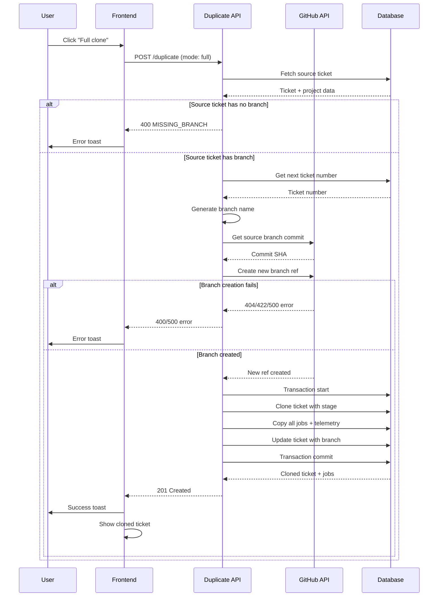
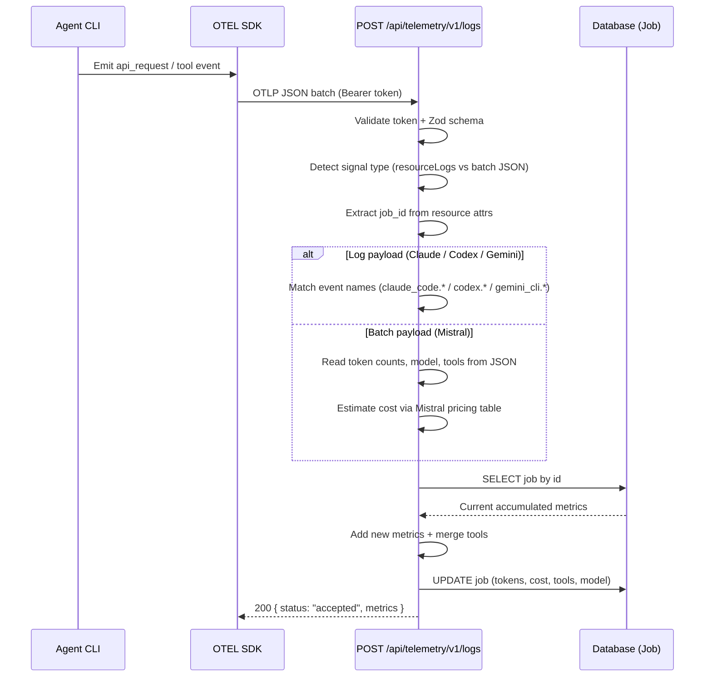
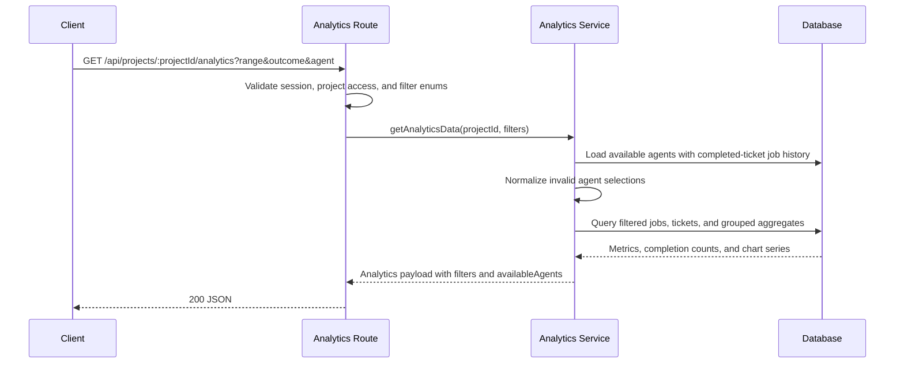

# API Endpoints Reference

Complete REST API documentation with authentication, request/response formats, and error handling.

## Authentication

All API endpoints require authentication via NextAuth.js session cookies except where noted.

**Primary Authentication**: Session cookie (set automatically by NextAuth.js)
**Optional API Authentication**: Bearer PAT on request-aware endpoints that call `requireAuth(request)` or equivalent helpers
**Unauthenticated**: 401 Unauthorized
**Unauthorized Access**: 403 Forbidden (user is neither project owner nor member)

**Preview Credentials Login**:
- Preview deployments can expose the built-in NextAuth credentials callback at `POST /api/auth/callback/credentials`
- This flow is internal to sign-in and is available only when preview-login environment gating is enabled
- Failed credentials submissions redirect to `/auth/signin?error=dev-login`

**Test Override**:
- `x-test-user-id` is a test-only override header for automated tests
- Test support lives in server-side request handling, not in the public sign-in UI

**Authorization Pattern**:
- All project-scoped endpoints validate "owner OR member" access
- Owner check performed first for performance (no database join needed)
- Member check performed via ProjectMember table join if not owner
- Non-members receive 403 Forbidden (API) or 404 Not Found (pages)

**Workflow Endpoints**: Require Bearer token authentication
```
Authorization: Bearer <WORKFLOW_API_TOKEN>
```

## Base URL

**Development**: `http://localhost:3000`
**Production**: `https://ai-board.vercel.app` (example)

## Project Endpoints

### GET /api/projects

Fetch all projects for the authenticated user with shipping status.

**Authentication**: Required (session)
**Authorization**: Returns projects owned by or accessible to the user (owner OR member)

**Response** (200 OK):
```json
{
  "projects": [
    {
      "id": 1,
      "name": "AI Board Development",
      "key": "ABC",
      "description": "Project management tool",
      "deploymentUrl": "https://ai-board.vercel.app",
      "githubOwner": "bfernandez31",
      "githubRepo": "ai-board",
      "userId": "user-abc123",
      "clarificationPolicy": "AUTO",
      "createdAt": "2025-01-01T00:00:00.000Z",
      "updatedAt": "2025-01-15T10:30:00.000Z",
      "ticketCount": 12,
      "lastShippedTicket": {
        "id": 42,
        "ticketKey": "ABC-5",
        "title": "Add user authentication",
        "updatedAt": "2025-01-14T16:20:00.000Z"
      },
      "healthScore": {
        "globalScore": 82,
        "securityScore": 90,
        "complianceScore": 78,
        "testsScore": null,
        "specSyncScore": 65,
        "qualityGate": 88,
        "reviewQualityScore": 75
      }
    },
    {
      "id": 2,
      "name": "Mobile App",
      "key": "MOB",
      "description": null,
      "deploymentUrl": null,
      "githubOwner": "company",
      "githubRepo": "mobile-app",
      "userId": "user-abc123",
      "clarificationPolicy": "CONSERVATIVE",
      "createdAt": "2025-01-05T00:00:00.000Z",
      "updatedAt": "2025-01-10T08:15:00.000Z",
      "ticketCount": 5,
      "lastShippedTicket": null,
      "healthScore": null
    }
  ]
}
```

**Fields**:
- `ticketCount`: Total number of tickets across all stages
- `lastShippedTicket`: Most recent ticket in SHIP stage (null if no shipped tickets)
  - `id`: Ticket ID
  - `ticketKey`: Unique ticket identifier (e.g., "ABC-5")
  - `title`: Ticket title
  - `updatedAt`: When ticket was moved to SHIP stage (used for relative time display)
- `healthScore`: Cached aggregate health score (null if no scan has ever completed)
  - `globalScore`: Overall score 0–100, or null if no modules have been scanned
  - `securityScore`, `complianceScore`, `testsScore`, `specSyncScore`, `qualityGate`, `reviewQualityScore`: Individual module scores 0–100, or null if that module has never been scanned

**Frontend Display**:
- Project cards display ticketKey (bold) followed by title
- Full text "ticketKey + title" truncated with ellipsis if too long
- Tooltip on hover shows complete "ticketKey + title" text

**Errors**:
- `401`: Not authenticated
- `500`: Database error

### GET /api/projects/:projectId

Fetch project details including clarification policy.

**Authentication**: Required (session)
**Authorization**: Must be project owner or member

**Path Parameters**:
- `projectId` (number, required): Project ID

**Response** (200 OK):
```json
{
  "id": 1,
  "name": "AI Board Development",
  "key": "ABC",
  "description": "Project management tool",
  "deploymentUrl": "https://ai-board.vercel.app",
  "githubOwner": "bfernandez31",
  "githubRepo": "ai-board",
  "userId": "user-abc123",
  "clarificationPolicy": "AUTO",
  "createdAt": "2025-01-01T00:00:00.000Z",
  "updatedAt": "2025-01-15T10:30:00.000Z",
  "config": {
    "version": 1,
    "project": { "name": "ai-board", "language": "typescript", "framework": "nextjs" },
    "runtime": { "manager": "bun" },
    "services": [{ "type": "postgres", "version": "16" }],
    "commands": { "install": "bun install" },
    "agent": { "cli": "claude-code" }
  },
  "configSyncedAt": "2026-04-02T12:00:00.000Z",
  "defaultBranch": "main",
  "specifyModel": "claude-opus-4-7",
  "planModel": "claude-opus-4-7",
  "implementModel": "claude-sonnet-4-6",
  "quickImplModel": "claude-sonnet-4-6",
  "verifyModel": "claude-sonnet-4-6"
}
```

`config` and `configSyncedAt` are `null` when no config has been synced. `defaultBranch` defaults to `"main"` and is auto-updated during config sync. Per-stage model fields are `null` for pre-existing projects without explicit configuration (resolves to `claude-opus-4-7` at dispatch time).

**Errors**:
- `401`: Not authenticated
- `403`: User is neither project owner nor member
- `404`: Project not found

### POST /api/projects/:projectId/config/sync

Fetch `.ai-board/config.yml` from the project's GitHub repository, validate it, and store the parsed result in the database.

**Authentication**: Required (session)
**Authorization**: Must be project owner or member

**Path Parameters**:
- `projectId` (number, required): Project ID

**Request Body**: None

**Response** (200 OK — synced successfully):
```json
{
  "config": {
    "version": 1,
    "project": { "name": "my-app", "language": "typescript", "framework": "nextjs" },
    "runtime": { "manager": "bun" },
    "services": [{ "type": "postgres", "version": "14" }],
    "commands": { "install": "bun install" },
    "agent": { "cli": "claude-code" }
  },
  "syncedAt": "2026-04-02T12:00:00.000Z",
  "warnings": []
}
```

Unknown fields cause a `400` validation error — the config is rejected and not stored. Warnings are reserved for other non-blocking notices; callers should surface any warning messages returned on success.

**Errors**:
- `400`: Invalid config YAML — body contains `{ "error": "Config validation failed", "code": "VALIDATION_ERROR", "details": [...] }`
- `401`: Not authenticated
- `404`: Project not found or no access; also returned when no `.ai-board/config.yml` exists in the repository (`"code": "CONFIG_NOT_FOUND"`)
- `502`: GitHub API error — body contains `{ "error": "Failed to fetch config from GitHub", "code": "GITHUB_ERROR" }`

### PATCH /api/projects/:projectId

Update project details including clarification policy.

**Authentication**: Required (session)
**Authorization**: Must be project owner (owner-only action)

**Path Parameters**:
- `projectId` (number, required): Project ID

**Request Body**:
```json
{
  "name": "Updated Project Name",
  "key": "UPD",
  "description": "Updated description",
  "deploymentUrl": "https://my-app.vercel.app",
  "clarificationPolicy": "CONSERVATIVE",
  "specifyModel": "claude-opus-4-7",
  "planModel": "claude-opus-4-7",
  "implementModel": "claude-sonnet-4-6",
  "quickImplModel": "claude-sonnet-4-6",
  "verifyModel": "claude-sonnet-4-6"
}
```

**Validation**:
- `name`: Optional, string
- `key`: Optional, 3-character uppercase alphanumeric string (immutable after creation, validation only)
- `description`: Optional, string or null
- `deploymentUrl`: Optional, string or null (valid URL format)
- `clarificationPolicy`: Optional, enum (AUTO|CONSERVATIVE|PRAGMATIC|INTERACTIVE)
- `specifyModel`, `planModel`, `implementModel`, `quickImplModel`, `verifyModel`: Optional, nullable — must be one of the whitelisted Claude model IDs (`claude-opus-4-7`, `claude-opus-4-6`, `claude-sonnet-4-6`, `claude-haiku-4-5-20251001`) or `null` to clear; rejected with `INVALID_MODEL_ID` otherwise

**Response** (200 OK):
```json
{
  "id": 1,
  "name": "Updated Project Name",
  "key": "ABC",
  "deploymentUrl": "https://my-app.vercel.app",
  "clarificationPolicy": "CONSERVATIVE",
  ...
}
```

**Note**: Project key is immutable after creation and cannot be changed via PATCH.

**Errors**:
- `400`: Invalid request body, URL format, clarification policy enum, or `INVALID_MODEL_ID` (unknown model ID supplied for a model field)
- `401`: Not authenticated
- `403`: User is not project owner (members cannot update project settings)
- `404`: Project not found

### POST /api/projects/:projectId/model-config/apply-smart-defaults

Apply the cost-conscious smart default model set to all 5 per-stage model fields atomically.

**Authentication**: Required (session)
**Authorization**: Must be project owner or member (`verifyProjectAccess`)

**Path Parameters**:
- `projectId` (number, required): Project ID

**Request Body**: None

**Smart defaults applied**:
| Stage | Model |
|-------|-------|
| SPECIFY | `claude-opus-4-7` |
| PLAN | `claude-opus-4-7` |
| IMPLEMENT | `claude-sonnet-4-6` |
| QUICK-IMPL | `claude-sonnet-4-6` |
| VERIFY | `claude-sonnet-4-6` |

**Response** (200 OK):
```json
{
  "specifyModel": "claude-opus-4-7",
  "planModel": "claude-opus-4-7",
  "implementModel": "claude-sonnet-4-6",
  "quickImplModel": "claude-sonnet-4-6",
  "verifyModel": "claude-sonnet-4-6"
}
```

Operation is idempotent — calling it twice produces the same result.

**Errors**:
- `401`: Not authenticated
- `404`: Project not found or no access

### POST /api/projects/import

Import a GitHub repository as a new ai-board project.

**Authentication**: Required (session)
**Authorization**: User must have `repo` scope on their GitHub token and admin access on the target repository

**Request Body**:
```json
{
  "githubOwner": "octocat",
  "githubRepo": "my-app",
  "name": "My App",
  "description": "My awesome app"
}
```

| Field | Required | Default |
|-------|----------|---------|
| `githubOwner` | Yes | — |
| `githubRepo` | Yes | — |
| `name` | No | Repository name |
| `description` | No | Repository description or `""` |

**Response** (201 Created — config present):
```json
{
  "project": {
    "id": 5,
    "name": "My App",
    "key": "MYA",
    "githubOwner": "octocat",
    "githubRepo": "my-app",
    "hasConfig": true
  },
  "redirectTo": "/projects/5"
}
```

**Response** (201 Created — no config):
```json
{
  "project": {
    "id": 5,
    "name": "My App",
    "key": "MYA",
    "githubOwner": "octocat",
    "githubRepo": "my-app",
    "hasConfig": false
  },
  "redirectTo": "/projects/5/setup"
}
```

**Errors**:
- `400`: `{ "error": "Validation error", "code": "VALIDATION_ERROR" }`
- `401`: Not authenticated
- `403` (quota): `{ "error": "Project limit reached...", "code": "PLAN_LIMIT" }`
- `403` (no admin): `{ "error": "You need admin access to this repository to import it.", "code": "INSUFFICIENT_PERMISSIONS" }`
- `403` (no scope): `{ "error": "GitHub token lacks repo scope", "code": "MISSING_SCOPE" }`
- `409` (duplicate repo): `{ "error": "This repository is already linked to project \"Existing Project\" (KEY-123).", "code": "DUPLICATE_REPO" }`
- `409` (other conflict): `{ "error": "A conflict occurred while creating the project. Please try again.", "code": "CONFLICT" }`
- `502`: GitHub API error

## Project Setup Endpoints

Endpoints for the project onboarding setup flow. All session-authenticated endpoints require project ownership (not just membership). The status callback endpoint uses workflow Bearer token authentication.

### POST /api/projects/:projectId/setup/jobs

Create a setup job and dispatch the onboarding workflow or the retro-spec workflow. The `command` field selects which workflow is dispatched.

**Authentication**: Session (owner-only)
**Authorization**: `verifyProjectOwnership`

**Request Body** (onboard):
```json
{ "agent": "CLAUDE" }
```

**Request Body** (retro-spec):
```json
{
  "agent": "CLAUDE",
  "command": "RETRO_SPEC",
  "depth": "STANDARD",
  "docUrl": "https://docs.example.com/api",
  "context": "Optional business context"
}
```

| Field | Type | Required |
|-------|------|----------|
| `agent` | `"CLAUDE"` \| `"CODEX"` | Yes |
| `command` | `"ONBOARD"` \| `"RETRO_SPEC"` | No (default: `"ONBOARD"`) |
| `depth` | `"QUICK"` \| `"STANDARD"` \| `"COMPREHENSIVE"` | Required when `command === "RETRO_SPEC"` |
| `docUrl` | string (HTTPS URL only, max 2000) | No |
| `context` | string | No |

When `docUrl` is provided, the workflow attempts to fetch that URL during retro-spec generation. Redirects are followed, and an unreachable URL does not block generation.

**Pre-flight checks by command**:
- `ONBOARD`: project ownership, `configSyncedAt` is null, no active ONBOARD job, credential exists
- `RETRO_SPEC`: project ownership, `configSyncedAt` is set, no active RETRO_SPEC job, credential exists

Active-job check is scoped by command type — ONBOARD and RETRO_SPEC jobs do not block each other.

**Response** (201 Created):
```json
{
  "id": 1,
  "projectId": 5,
  "agent": "CLAUDE",
  "command": "RETRO_SPEC",
  "status": "PENDING",
  "depth": "STANDARD",
  "createdAt": "2026-04-08T12:00:00.000Z"
}
```

**Errors**:
- `400`: `VALIDATION_ERROR` — invalid body, missing `depth` for RETRO_SPEC, or `docUrl` that is not a valid URL
- `401`: Not authenticated
- `403`: `FORBIDDEN` — not project owner
- `404`: `PROJECT_NOT_FOUND`
- `409`: `ALREADY_CONFIGURED` — `configSyncedAt` is set (ONBOARD only)
- `409`: `NOT_CONFIGURED` — `configSyncedAt` is null (RETRO_SPEC only)
- `409`: `JOB_ACTIVE` — a job of the same command type is PENDING or RUNNING
- `409`: `CREDENTIAL_MISSING` — owner lacks credential for the agent's provider
- `500`: `DISPATCH_FAILED` — workflow dispatch failed (job marked FAILED)

---

### GET /api/projects/:projectId/setup/jobs

Fetch the latest setup job for polling and page load. Supports optional filtering by command type.

**Authentication**: Session (owner-only)
**Authorization**: `verifyProjectOwnership`

**Query Parameters**:

| Parameter | Type | Description |
|-----------|------|-------------|
| `command` | `"ONBOARD"` \| `"RETRO_SPEC"` | Optional — filters by job type. When omitted, returns the latest job of any type. |

**Response** (200 OK):
```json
{
  "job": {
    "id": 1,
    "projectId": 5,
    "agent": "CLAUDE",
    "command": "RETRO_SPEC",
    "status": "RUNNING",
    "depth": "STANDARD",
    "docUrl": "https://docs.example.com/api",
    "workflowRunId": 12345678,
    "errorMessage": null,
    "artifactSummary": null,
    "startedAt": "2026-04-08T12:00:05.000Z",
    "completedAt": null,
    "createdAt": "2026-04-08T12:00:00.000Z"
  },
  "configSyncedAt": "2026-04-08T10:00:00.000Z"
}
```

When no job exists: `{ "job": null, "configSyncedAt": null }`.

**Errors**: `401`, `403` (not owner), `404` (project not found)

---

### PATCH /api/projects/:projectId/setup/jobs/:jobId/status

Update setup job status from the onboarding or retro-spec workflow.

**Authentication**: Workflow Bearer token (`Authorization: Bearer <WORKFLOW_API_TOKEN>`)

**Request Body**:
```json
{
  "status": "RUNNING",
  "workflowRunId": 12345678,
  "errorMessage": null,
  "artifactSummary": null
}
```

| Field | Type | Required |
|-------|------|----------|
| `status` | `"RUNNING"` \| `"COMPLETED"` \| `"FAILED"` | Yes |
| `workflowRunId` | integer | No |
| `errorMessage` | string (max 2000) | No |
| `artifactSummary` | object | No |

**State transitions**:

| From | Allowed To |
|------|-----------|
| PENDING | RUNNING |
| RUNNING | COMPLETED, FAILED |
| COMPLETED | COMPLETED (idempotent) |
| FAILED | FAILED (idempotent) |

**Side effects**:
- `RUNNING`: sets `startedAt` and `workflowRunId` (first-write-wins)
- `COMPLETED` (ONBOARD jobs): sets `completedAt`, awaits `syncProjectConfig()`; if sync fails (non-success outcome or thrown exception), returns 200 with `configSyncError` (and `configSyncErrorCode` for non-throwing failures)
- `COMPLETED` (RETRO_SPEC jobs): sets `completedAt` only — no config sync (specs are committed to the repo by the workflow)
- `FAILED`: sets `completedAt`, persists `errorMessage`

**Response** (200 OK):
```json
{ "id": 1, "status": "COMPLETED", "completedAt": "2026-04-08T12:01:30.000Z" }
```

**Response** (200 OK — config sync failed, ONBOARD only):
```json
{ "id": 1, "status": "COMPLETED", "completedAt": "2026-04-08T12:01:30.000Z", "configSyncError": "Token expired", "configSyncErrorCode": "GITHUB_ERROR" }
```

> `configSyncErrorCode` is present when `syncProjectConfig()` returns a non-success outcome (one of `VALIDATION_ERROR`, `CONFIG_NOT_FOUND`, `GITHUB_ERROR`, `YAML_PARSE_ERROR`). It is absent when the failure was an unexpected thrown exception.

**Errors**: `400` (`VALIDATION_ERROR` or `INVALID_TRANSITION`), `401` (invalid token), `404` (job/project not found)

---

### GET /api/projects/:projectId/setup/credential-check

Check whether the project owner has a valid credential for a given agent's provider.

**Authentication**: Session (owner-only)
**Authorization**: `verifyProjectOwnership`

**Query Parameters**:

| Param | Type | Required |
|-------|------|----------|
| `agent` | `"CLAUDE"` \| `"CODEX"` \| `"MISTRAL"` \| `"GEMINI"` | Yes |

**Agent-to-provider mapping**: `CLAUDE` → `ANTHROPIC`, `CODEX` → `OPENAI`, `MISTRAL` → `MISTRAL`, `GEMINI` → `GOOGLE`

**Response** (200 OK — credential present):
```json
{ "hasCredential": true, "provider": "ANTHROPIC" }
```

**Response** (200 OK — credential missing):
```json
{ "hasCredential": false, "provider": "ANTHROPIC", "settingsUrl": "/settings/credentials" }
```

**Errors**: `400` (`VALIDATION_ERROR` — missing/invalid `agent`), `401`, `403` (not owner)

---

## GitHub Endpoints

### GET /api/github/auth-status

Check whether the current user has a GitHub account with `repo` scope.

**Authentication**: Required (session)

**Response** (200 OK):
```json
{
  "hasGitHubAccount": true,
  "hasRepoScope": true
}
```

`hasRepoScope` is `false` when the token exists but was issued before `repo` scope was requested. `hasGitHubAccount` is `false` when the user has no linked GitHub account.

**Errors**:
- `401`: Not authenticated

### GET /api/github/repos

List GitHub repositories accessible to the authenticated user.

**Authentication**: Required (session)

**Query Parameters**:

| Param | Type | Default | Description |
|-------|------|---------|-------------|
| `page` | number | 1 | Page number |
| `per_page` | number | 30 | Items per page (max 100) |
| `sort` | string | `"pushed"` | Sort: `pushed`, `updated`, `full_name` |
| `type` | string | `"all"` | Filter: `all`, `owner`, `member` |
| `org` | string | — | Filter by organization login |
| `q` | string | — | Search query (uses GitHub Search API) |

**Response** (200 OK):
```json
{
  "repos": [
    {
      "id": 123456,
      "name": "my-app",
      "fullName": "octocat/my-app",
      "owner": "octocat",
      "ownerAvatar": "https://avatars.githubusercontent.com/u/1?v=4",
      "description": "My awesome app",
      "isPrivate": false,
      "pushedAt": "2026-03-28T12:00:00Z",
      "hasAdminAccess": true,
      "isAlreadyImported": false,
      "existingProjectId": null
    }
  ],
  "totalCount": 42,
  "page": 1,
  "perPage": 30,
  "hasNextPage": true
}
```

**Fields**:
- `hasAdminAccess`: `true` when the user has admin permission on the repository
- `isAlreadyImported`: `true` when the repository is already linked to an ai-board project
- `existingProjectId`: project ID when `isAlreadyImported` is `true`, otherwise `null`

**Errors**:
- `401`: Not authenticated
- `403`: `{ "error": "GitHub token lacks repo scope", "code": "MISSING_SCOPE" }`
- `429`: `{ "error": "GitHub rate limit exceeded. Resets at {time}.", "code": "RATE_LIMITED", "resetAt": "..." }`
- `502`: GitHub API error

### GET /api/github/orgs

List organizations the authenticated user belongs to.

**Authentication**: Required (session)

**Response** (200 OK):
```json
{
  "orgs": [
    {
      "login": "my-org",
      "avatarUrl": "https://avatars.githubusercontent.com/u/2?v=4"
    }
  ]
}
```

**Errors**:
- `401`: Not authenticated
- `403`: `{ "error": "GitHub token lacks repo scope", "code": "MISSING_SCOPE" }`

## Ticket Endpoints

### GET /api/projects/:projectId/tickets

Fetch tickets for a project, grouped by stage. SHIP stage is paginated (default 50 tickets). When `stage` or `workflowType` query params are provided, returns a flat filtered array instead.

**Authentication**: Required (session or workflow Bearer token)
**Authorization**: Must be project owner or member (workflow token bypasses)

**Path Parameters**:
- `projectId` (number, required): Project ID

**Query Parameters**:
- `stage` (string, optional): Filter by stage — `INBOX|SPECIFY|PLAN|BUILD|VERIFY|SHIP|CLOSED`
- `workflowType` (string, optional): Filter by workflow type — `FULL|QUICK|CLEAN`
- `limit` (number, optional): Maximum number of tickets to return (min: 1). Only applies when at least one filter is provided. Results are sorted by `updatedAt` desc.
- `offset` (number, optional): Skip N tickets (min: 0). Used for SHIP "Load More" pagination. When `stage=SHIP` and `offset` is provided, returns the next page of SHIP tickets.
- `updatedSince` (string, optional): ISO 8601 datetime. Only return tickets updated after this timestamp.

**Response — no filters** (200 OK): Stage-grouped object with SHIP pagination metadata

All non-SHIP stages return all tickets. SHIP stage returns only the first 50 tickets (sorted by `updatedAt` desc). `_shipTotal` indicates the total number of SHIP tickets for "Load More" pagination.

```json
{
  "INBOX": [...],
  "SPECIFY": [...],
  "PLAN": [...],
  "BUILD": [...],
  "VERIFY": [...],
  "SHIP": [
    {
      "id": 42,
      "ticketNumber": 5,
      "ticketKey": "ABC-5",
      "title": "Add login feature",
      "description": "Implement user authentication",
      "stage": "SHIP",
      "projectId": 1,
      "branch": "042-add-login-feature",
      "workflowType": "FULL",
      "clarificationPolicy": null,
      "attachments": [],
      "version": 3,
      "closedAt": null,
      "createdAt": "2025-01-10T14:00:00.000Z",
      "updatedAt": "2025-01-15T10:30:00.000Z"
    }
  ],
  "_shipTotal": 248
}
```

**Response — SHIP Load More** (`?stage=SHIP&offset=50&limit=50`) (200 OK):
```json
{
  "tickets": [
    {
      "id": 38,
      "ticketKey": "ABC-3",
      "title": "Older shipped ticket",
      "stage": "SHIP",
      ...
    }
  ]
}
```

**Response — with other filters** (200 OK): Flat array of matching tickets
```json
[
  {
    "id": 42,
    "ticketKey": "ABC-5",
    "title": "Add login feature",
    "stage": "SHIP",
    "workflowType": "FULL",
    ...
  }
]
```

**Sorting Behavior**:
- **INBOX**: Tickets sorted by `ticketNumber` ascending (oldest first, newest last)
- **All Other Stages**: Tickets sorted by `updatedAt` descending (most recently updated first)
- Sorting applied per-stage after grouping

**Filtering**:
- By default, excludes CLOSED tickets (they don't appear on board)
- CLOSED tickets only accessible via search or direct URL

**Errors**:
- `401`: Not authenticated
- `403`: User is neither project owner nor member
- `404`: Project not found

### POST /api/projects/:projectId/tickets

Create a new ticket.

**Authentication**: Required (session)
**Authorization**: Must be project owner or member

**Path Parameters**:
- `projectId` (number, required): Project ID

**Request Body**:
```json
{
  "title": "Fix login bug",
  "description": "Login button doesn't work on mobile devices"
}
```

**Validation**:
- `title`: Required, 1-100 characters, alphanumeric + basic punctuation
- `description`: Required, 1-10000 characters, all UTF-8 characters allowed

**Response** (201 Created):
```json
{
  "id": 43,
  "ticketNumber": 6,
  "ticketKey": "ABC-6",
  "title": "Fix login bug",
  "description": "Login button doesn't work on mobile devices",
  "stage": "INBOX",
  "projectId": 1,
  "branch": null,
  "workflowType": "FULL",
  "clarificationPolicy": null,
  "attachments": [],
  "version": 1,
  "createdAt": "2025-01-20T09:00:00.000Z",
  "updatedAt": "2025-01-20T09:00:00.000Z"
}
```

**Errors**:
- `400`: Invalid request body (Zod validation errors)
- `401`: Not authenticated
- `403`: User is neither project owner nor member
- `404`: Project not found
- `500`: Database error

### GET /browse/:key

Fetch ticket by human-readable key (primary user-facing endpoint).

**Authentication**: Required (session)
**Authorization**: Must be project owner or member (resolved via ticket key)

**Path Parameters**:
- `key` (string, required): Ticket key in format "{PROJECT_KEY}-{TICKET_NUMBER}" (e.g., "ABC-123")

**Response** (200 OK):
```json
{
  "id": 42,
  "ticketNumber": 5,
  "ticketKey": "ABC-5",
  "title": "Add login feature",
  "description": "Implement user authentication",
  "stage": "SPECIFY",
  "projectId": 1,
  "branch": "042-add-login-feature",
  "workflowType": "FULL",
  "clarificationPolicy": null,
  "attachments": [],
  "version": 3,
  "project": {
    "id": 1,
    "name": "AI Board Development",
    "key": "ABC",
    "clarificationPolicy": "AUTO"
  },
  "createdAt": "2025-01-10T14:00:00.000Z",
  "updatedAt": "2025-01-15T10:30:00.000Z"
}
```

**Errors**:
- `401`: Not authenticated
- `403`: User is neither project owner nor member
- `404`: Ticket not found

**Notes**:
- This is the primary user-facing endpoint for ticket access
- URLs like `/browse/ABC-123` are shareable and stable
- Used for bookmarks, external links, and ticket references

### GET /api/projects/:projectId/tickets/:id

Fetch single ticket with nested project data.

**Authentication**: Required (session)
**Authorization**: Must be project owner or member

**Path Parameters**:
- `projectId` (number, required): Project ID
- `id` (number or string, required): Ticket ID (numeric) or Ticket Key (e.g., "ABC-123")

**Note**: This endpoint supports both internal numeric IDs (for backward compatibility) and human-readable ticket keys. The ticket key lookup enables fetching tickets not present in the kanban board (e.g., closed tickets accessed via search or direct URL). New code should use `/browse/:key` for user-facing navigation.

**Response** (200 OK):
```json
{
  "id": 42,
  "ticketNumber": 5,
  "ticketKey": "ABC-5",
  "title": "Add login feature",
  "description": "Implement user authentication",
  "stage": "SPECIFY",
  "projectId": 1,
  "branch": "042-add-login-feature",
  "workflowType": "FULL",
  "clarificationPolicy": null,
  "attachments": [
    {
      "type": "uploaded",
      "url": "https://res.cloudinary.com/.../screenshot.png",
      "filename": "screenshot.png",
      "mimeType": "image/png",
      "sizeBytes": 204800,
      "uploadedAt": "2025-01-15T10:00:00.000Z",
      "cloudinaryPublicId": "ai-board/tickets/42/screenshot"
    }
  ],
  "version": 3,
  "project": {
    "id": 1,
    "name": "AI Board Development",
    "key": "ABC",
    "clarificationPolicy": "AUTO"
  },
  "createdAt": "2025-01-10T14:00:00.000Z",
  "updatedAt": "2025-01-15T10:30:00.000Z"
}
```

**Errors**:
- `401`: Not authenticated
- `403`: User is neither project owner nor member
- `404`: Ticket or project not found

### PATCH /api/projects/:projectId/tickets/:id

Update ticket fields with optimistic concurrency control.

**Authentication**: Required (session)
**Authorization**: Must be project owner or member

**Path Parameters**:
- `projectId` (number, required): Project ID
- `id` (number, required): Ticket ID

**Request Body**:
```json
{
  "title": "Updated title",
  "description": "Updated description",
  "clarificationPolicy": "CONSERVATIVE",
  "version": 3
}
```

**Validation**:
- `title`: Optional, 1-100 characters, alphanumeric + basic punctuation
- `description`: Optional, 1-10000 characters (editable only in INBOX stage)
- `clarificationPolicy`: Optional, enum or null (editable only in INBOX stage)
- `version`: Required for concurrency control

**Response** (200 OK):
```json
{
  "id": 42,
  "ticketNumber": 5,
  "ticketKey": "ABC-5",
  "title": "Updated title",
  "description": "Updated description",
  "clarificationPolicy": "CONSERVATIVE",
  "version": 4,
  ...
}
```

**Errors**:
- `400`: Invalid request body, validation failure, or stage restriction violation
- `401`: Not authenticated
- `403`: User is neither project owner nor member
- `404`: Ticket or project not found
- `409`: Version conflict (concurrent update detected)

### POST /api/projects/:projectId/tickets/:id/duplicate

Create a duplicate of an existing ticket using simple copy or full clone mode.

**Full Clone Workflow Sequence**:


```mermaid
sequenceDiagram
    participant U as User
    participant UI as Frontend
    participant API as Duplicate API
    participant GH as GitHub API
    participant DB as Database

    U->>UI: Click "Full clone"
    UI->>API: POST /duplicate (mode: full)
    API->>DB: Fetch source ticket
    DB-->>API: Ticket + project data

    alt Source ticket has no branch
        API-->>UI: 400 MISSING_BRANCH
        UI->>U: Error toast
    else Source ticket has branch
        API->>DB: Get next ticket number
        DB-->>API: Ticket number
        API->>API: Generate branch name

        API->>GH: Get source branch commit
        GH-->>API: Commit SHA

        API->>GH: Create new branch ref
        alt Branch creation fails
            GH-->>API: 404/422/500 error
            API-->>UI: 400/500 error
            UI->>U: Error toast
        else Branch created
            GH-->>API: New ref created

            API->>DB: Transaction start
            API->>DB: Clone ticket with stage
            API->>DB: Copy all jobs + telemetry
            API->>DB: Update ticket with branch
            API->>DB: Transaction commit
            DB-->>API: Cloned ticket + jobs

            API-->>UI: 201 Created
            UI->>U: Success toast
            UI->>UI: Show cloned ticket
        end
    end
```

**Authentication**: Required (session)
**Authorization**: Must be project owner or member

**Path Parameters**:
- `projectId` (number, required): Project ID
- `id` (number, required): Source ticket ID to duplicate

**Request Body**:
```json
{
  "mode": "simple" | "full"
}
```

**Validation**:
- `mode` (optional): Duplication mode (default: "simple")
  - "simple": Create copy in INBOX with no jobs or branch
  - "full": Preserve stage, copy all jobs with telemetry, create new branch

**Response - Simple Copy** (201 Created):
```json
{
  "id": 107,
  "ticketNumber": 107,
  "ticketKey": "AIB-107",
  "title": "Copy of Add login button",
  "description": "User story: As a user, I want to log in...",
  "stage": "INBOX",
  "version": 1,
  "projectId": 3,
  "branch": null,
  "previewUrl": null,
  "autoMode": false,
  "workflowType": "FULL",
  "attachments": [
    {
      "type": "uploaded",
      "url": "https://res.cloudinary.com/xxx/image/upload/v1/ai-board/tickets/42/mockup.png",
      "filename": "mockup.png",
      "mimeType": "image/png",
      "sizeBytes": 245760,
      "uploadedAt": "2025-01-15T10:30:00.000Z",
      "cloudinaryPublicId": "ai-board/tickets/42/mockup"
    }
  ],
  "clarificationPolicy": "PRAGMATIC",
  "createdAt": "2025-01-20T14:22:00.000Z",
  "updatedAt": "2025-01-20T14:22:00.000Z"
}
```

**Response - Full Clone** (201 Created):
```json
{
  "id": 219,
  "ticketNumber": 219,
  "ticketKey": "AIB-219",
  "title": "Clone of Add login button",
  "description": "User story: As a user, I want to log in...",
  "stage": "PLAN",
  "version": 1,
  "projectId": 3,
  "branch": "219-add-login-button",
  "previewUrl": null,
  "autoMode": false,
  "workflowType": "FULL",
  "attachments": [
    {
      "type": "uploaded",
      "url": "https://res.cloudinary.com/xxx/image/upload/v1/ai-board/tickets/42/mockup.png",
      "filename": "mockup.png",
      "mimeType": "image/png",
      "sizeBytes": 245760,
      "uploadedAt": "2025-01-15T10:30:00.000Z",
      "cloudinaryPublicId": "ai-board/tickets/42/mockup"
    }
  ],
  "clarificationPolicy": "PRAGMATIC",
  "createdAt": "2025-01-20T14:22:00.000Z",
  "updatedAt": "2025-01-20T14:22:00.000Z",
  "jobs": [
    {
      "id": 456,
      "command": "specify",
      "status": "COMPLETED",
      "branch": "219-add-login-button",
      "commitSha": "abc123...",
      "startedAt": "2025-01-20T14:00:00.000Z",
      "completedAt": "2025-01-20T14:05:00.000Z",
      "inputTokens": 5000,
      "outputTokens": 1500,
      "cacheReadTokens": 2000,
      "cacheCreationTokens": 500,
      "costUsd": 0.025,
      "durationMs": 300000,
      "model": "claude-sonnet-4-5-20250929",
      "toolsUsed": ["Read", "Edit", "Write"]
    },
    {
      "id": 457,
      "command": "plan",
      "status": "COMPLETED",
      "branch": "219-add-login-button",
      "commitSha": "def456...",
      "startedAt": "2025-01-20T14:10:00.000Z",
      "completedAt": "2025-01-20T14:18:00.000Z",
      "inputTokens": 8000,
      "outputTokens": 2500,
      "cacheReadTokens": 3000,
      "cacheCreationTokens": 1000,
      "costUsd": 0.045,
      "durationMs": 480000,
      "model": "claude-sonnet-4-5-20250929",
      "toolsUsed": ["Read", "Glob", "Write"]
    }
  ]
}
```

**Simple Copy Behavior** (mode: "simple"):
- **New Ticket Created**: Always in INBOX stage with new ticket number and key
- **Title**: Prefixed with "Copy of " (truncated to 100 chars if needed)
- **Description**: Exact copy from source ticket
- **Clarification Policy**: Copied from source (or null if source uses project default)
- **Attachments**: All image attachments copied by reference (same URLs)
  - Uploaded images (Cloudinary) safely reference same URL
  - External URLs copied as-is
  - No image re-uploading or duplication
- **Branch**: Always null (new tickets have no branch)
- **Preview URL**: Always null (new tickets have no preview)
- **Workflow Type**: Always FULL (standard workflow path)
- **Version**: Always 1 (new ticket version)
- **Jobs**: None (clean slate)

**Full Clone Behavior** (mode: "full"):
- **New Ticket Created**: In same stage as source ticket with new ticket number and key
- **Title**: Prefixed with "Clone of " (truncated to 100 chars if needed)
- **Description**: Exact copy from source ticket
- **Stage**: Preserved from source ticket (SPECIFY, PLAN, BUILD, or VERIFY)
- **Clarification Policy**: Copied from source
- **Attachments**: Copied by reference (same as simple copy)
- **Branch**: New Git branch created from source branch
  - Format: `{TICKET_NUMBER}-{slug}` (e.g., "219-add-login-button")
  - Slug: First 3 words of title, lowercase, hyphenated
  - Points to same commit as source branch
- **Jobs**: All jobs copied with complete telemetry data:
  - Command, status, branch, commit SHA
  - Timestamps (startedAt, completedAt)
  - Token metrics (input, output, cache read, cache creation)
  - Cost and performance (costUsd, durationMs)
  - Model identifier and tools used
  - Jobs reference new ticket ID
- **Workflow Type**: Copied from source
- **Version**: Always 1 (new ticket version)

**Branch Creation**:
- Creates new Git branch via GitHub API
- Uses `git.createRef()` to create `refs/heads/{newBranchName}`
- New branch points to same commit SHA as source branch
- Preserves complete Git history for comparison

**Title Truncation**:
- If "Copy of [original title]" or "Clone of [original title]" exceeds 100 characters:
  - Original title is truncated first
  - Prefix ("Copy of " or "Clone of ") is preserved
  - Final title stays within 100 character limit

**Full Clone Eligibility**:
- Source ticket must have a branch (tickets in SPECIFY, PLAN, BUILD, VERIFY stages)
- Source branch must exist on GitHub
- Returns 400 error if ticket has no branch

**Errors**:
- `400`: Invalid mode parameter, projectId, ticketId format, or full clone precondition failure
  - Invalid mode: `{ "error": "Invalid mode parameter. Must be 'simple' or 'full'", "code": "VALIDATION_ERROR" }`
  - Missing branch: `{ "error": "Source ticket has no branch. Full clone requires a branch.", "code": "MISSING_BRANCH" }`
  - Branch not found: `{ "error": "Source branch '{branch}' not found on GitHub", "code": "BRANCH_NOT_FOUND" }`
- `401`: Not authenticated
- `403`: User is neither project owner nor member
- `404`: Project or source ticket not found
- `500`: Database error, GitHub API error, or branch creation failure
  - Branch exists: `{ "error": "Branch '{newBranchName}' already exists", "code": "BRANCH_CREATION_FAILED" }`
  - GitHub error: `{ "error": "Failed to create branch on GitHub", "code": "BRANCH_CREATION_FAILED" }`

**Performance**:
- Simple copy: <3 seconds from API call to new ticket visible in UI
- Full clone: <5 seconds (includes GitHub API branch creation + database transaction)

### GET /api/projects/:projectId/tickets/:id/branch

Fetch ticket branch name.

**Authentication**: None (unauthenticated endpoint)

**Path Parameters**:
- `projectId` (number, required): Project ID
- `id` (number or string, required): Ticket ID or Ticket Key

**Response** (200 OK):
```json
{
  "id": 42,
  "branch": "042-add-login-feature",
  "updatedAt": "2025-01-15T10:35:00.000Z"
}
```

**Errors**:
- `400`: Invalid project ID or ticket ID
- `404`: Project or ticket not found

### PATCH /api/projects/:projectId/tickets/:id/branch

Update ticket branch name (workflow-only endpoint).

**Authentication**: Bearer token (WORKFLOW_API_TOKEN)
**Authorization**: Workflow token validation (no project membership check)

**Path Parameters**:
- `projectId` (number, required): Project ID
- `id` (number, required): Ticket ID

**Request Body**:
```json
{
  "branch": "042-add-login-feature"
}
```

**Validation**:
- `branch`: Required, max 200 characters or null

**Response** (200 OK):
```json
{
  "id": 42,
  "branch": "042-add-login-feature",
  "updatedAt": "2025-01-15T10:35:00.000Z"
}
```

**Errors**:
- `400`: Invalid branch name (exceeds 200 characters)
- `401`: Invalid or missing workflow token
- `404`: Ticket or project not found

**Note**: This endpoint does NOT use optimistic concurrency control (no version checking).

### POST /api/projects/:projectId/tickets/:id/deploy

Trigger manual Vercel preview deployment (user-initiated).

**Authentication**: Required (session)
**Authorization**: Must be project owner or member

**Path Parameters**:
- `projectId` (number, required): Project ID
- `id` (number, required): Ticket ID

**Request Body**: Empty

**Response** (201 Created):
```json
{
  "success": true,
  "jobId": 125,
  "message": "Deploy preview workflow dispatched"
}
```

**Eligibility Requirements**:
- Ticket must be in VERIFY stage
- Ticket must have a branch
- Latest job must have COMPLETED status

**Workflow Behavior**:
- Creates new Job record with command="deploy-preview", status=PENDING
- Clears any existing preview URL in project (single-preview enforcement)
- Dispatches GitHub Actions workflow (deploy-preview.yml)
- Workflow deploys branch to Vercel and updates ticket with preview URL

**Errors**:
- `400`: Ticket not eligible for deployment (wrong stage, no branch, job not completed)
- `401`: Not authenticated
- `403`: User is neither project owner nor member
- `404`: Ticket or project not found
- `500`: Workflow dispatch error

### PATCH /api/projects/:projectId/tickets/:id/preview-url

Update ticket preview URL (workflow-only endpoint).

**Authentication**: Bearer token (WORKFLOW_API_TOKEN)
**Authorization**: Workflow token validation (no project membership check)

**Path Parameters**:
- `projectId` (number, required): Project ID
- `id` (number, required): Ticket ID

**Request Body**:
```json
{
  "previewUrl": "https://ai-board-080-1490-deploy-preview.vercel.app"
}
```

**Validation**:
- `previewUrl`: Required, max 500 characters, HTTPS-only, Vercel domain pattern
- Pattern: `^https:\/\/[a-z0-9-]+\.vercel\.app$`

**Response** (200 OK):
```json
{
  "id": 42,
  "previewUrl": "https://ai-board-080-1490-deploy-preview.vercel.app",
  "updatedAt": "2025-01-15T10:40:00.000Z"
}
```

**Errors**:
- `400`: Invalid preview URL (non-HTTPS, invalid domain, exceeds 500 characters)
- `401`: Invalid or missing workflow token
- `404`: Ticket or project not found

**Note**: This endpoint does NOT use optimistic concurrency control (no version checking).

### PATCH /api/projects/:projectId/tickets/:id/model-config

Set or clear per-stage Claude model overrides on a ticket.

**Authentication**: Required (session)
**Authorization**: Must be project owner or member (`verifyTicketAccess`)

**Path Parameters**:
- `projectId` (number, required): Project ID
- `id` (number, required): Ticket ID

**Request Body** (set individual overrides):
```json
{
  "specifyModel": "claude-opus-4-7",
  "verifyModel": "claude-haiku-4-5-20251001"
}
```

**Request Body** (clear all overrides):
```json
{
  "resetAll": true
}
```

**Validation**:
- Each model field is optional, nullable — accepted values are the whitelisted Claude model IDs or `null` to clear that stage
- `resetAll: true` sets all 5 stage fields to `null` in a single atomic operation; cannot be combined with individual field values
- Empty body returns `400`
- Unknown model ID returns `400` with `INVALID_MODEL_ID` error code

**Response** (200 OK):
```json
{
  "specifyModel": "claude-opus-4-7",
  "planModel": null,
  "implementModel": null,
  "quickImplModel": null,
  "verifyModel": "claude-haiku-4-5-20251001"
}
```

All 5 fields are always returned; `null` means "inherit from project default" at dispatch time.

**Errors**:
- `400`: Empty body, `INVALID_MODEL_ID`, or `resetAll` combined with field values
- `401`: Not authenticated
- `404`: Ticket or project not found, or no access

### GET /api/projects/:projectId/tickets/search

Search tickets within a project by key, title, or description.

**Authentication**: Required (session) OR Bearer token (workflow)
**Authorization**: Must be project owner or member (session), OR valid workflow token

**Path Parameters**:
- `projectId` (number, required): Project ID

**Query Parameters**:
- `q` (string, required): Search query (minimum 2 characters)
- `limit` (number, optional): Maximum results to return (default: 20, max: 50)

**Response** (200 OK):
```json
{
  "results": [
    {
      "id": 42,
      "ticketKey": "ABC-42",
      "title": "Add user authentication",
      "stage": "BUILD"
    },
    {
      "id": 38,
      "ticketKey": "ABC-38",
      "title": "Fix authentication bug",
      "stage": "VERIFY"
    }
  ],
  "totalCount": 2
}
```

**Search Behavior**:
- Searches across ticketKey, title, and description fields
- Case-insensitive matching (uses Prisma `mode: 'insensitive'`)
- Results ordered by relevance:
  1. Exact ticket key matches (score: 4)
  2. Partial ticket key matches (score: 3)
  3. Title contains query (score: 2)
  4. Description contains query (score: 1)
- Within same relevance score, ordered by most recently updated
- Limited to specified limit (default 20, max 50)

**Fields**:
- `id`: Ticket ID (for opening modal via URL parameter)
- `ticketKey`: Human-readable key (e.g., "ABC-42")
- `title`: Ticket title
- `stage`: Current workflow stage
- `totalCount`: Number of results returned (capped at limit)

**Errors**:
- `400`: Query too short (less than 2 characters) or invalid limit
  ```json
  {
    "error": "Query must be at least 2 characters"
  }
  ```
- `401`: Not authenticated
- `403`: User is neither project owner nor member
- `404`: Project not found
- `500`: Database error

**Performance**: <500ms for typical queries, indexed on projectId

### DELETE /api/projects/:projectId/tickets/:id

Delete ticket with GitHub cleanup (permanent deletion).

**Authentication**: Required (session)
**Authorization**: Must be project owner or member

**Path Parameters**:
- `projectId` (number, required): Project ID
- `id` (number, required): Ticket ID

**Request Body**: Empty

**Response** (204 No Content)

**Deletion Behavior**:
- **Transactional**: All GitHub artifacts must be deleted successfully before database deletion
- **GitHub Cleanup** (in order):
  1. Close all pull requests where head branch matches ticket branch
  2. Delete Git branch from repository
- **Database Cleanup** (cascade):
  1. Delete all associated jobs
  2. Delete all associated comments
  3. Delete ticket record
- **Failure Handling**: If any GitHub operation fails, ticket remains unchanged in database
- **Idempotent Branch Deletion**: If branch already deleted (404 or 422 "reference does not exist"), operation continues successfully

**Validation**:
- Ticket cannot be in SHIP stage (400 error)
- Ticket cannot have PENDING or RUNNING jobs (400 error)

**Errors**:
- `400`: Invalid deletion (SHIP stage or active job)
- `401`: Not authenticated
- `403`: User is neither project owner nor member
- `404`: Ticket or project not found
- `500`: GitHub API error or database error

**GitHub API Errors**:
- 404 errors (branch/PR not found) are ignored (idempotent operation)
- 422 errors with "reference does not exist" message are ignored (branch already deleted)
- Other GitHub API errors abort the deletion and preserve ticket

**Notes**:
- Pull requests are identified by matching head branch name
- All PRs with matching head branch are closed (handles multiple PRs scenario)
- Workflow artifacts (spec.md, plan.md, tasks.md) are deleted when branch is deleted
- Preview deployments become orphaned (Vercel cleanup is manual)
- TanStack Query optimistic update removes ticket immediately from UI

### POST /api/projects/:projectId/tickets/:id/close

Close ticket from VERIFY stage (transition to CLOSED).

**Authentication**: Required (session)
**Authorization**: Must be project owner or member

**Path Parameters**:
- `projectId` (number, required): Project ID
- `id` (number, required): Ticket ID

**Request Body**: Empty

**Response** (200 OK):
```json
{
  "id": 42,
  "stage": "CLOSED",
  "closedAt": "2025-01-15T10:45:00.000Z",
  "updatedAt": "2025-01-15T10:45:00.000Z"
}
```

**Close Behavior**:
1. Validates ticket is in VERIFY stage
2. Validates no PENDING or RUNNING jobs exist
3. Closes all open GitHub PRs for ticket branch with comment: "Closed by ai-board - ticket moved to CLOSED state"
5. Updates ticket stage to CLOSED and sets closedAt timestamp
6. Preserves Git branch (not deleted)

**GitHub PR Close**:
- Finds all open PRs where head branch matches ticket branch
- Closes each PR with explanatory comment
- Idempotent: succeeds if PRs already closed or no PRs exist
- GitHub API failures logged but don't block close operation

**Errors**:
- `400`: Invalid close (ticket not in VERIFY or has active jobs)
  ```json
  {
    "error": "Cannot close ticket",
    "code": "INVALID_CLOSE",
    "details": {
      "stage": "BUILD",
      "message": "Ticket must be in VERIFY stage"
    }
  }
  ```
- `401`: Not authenticated
- `403`: User is neither project owner nor member
- `404`: Ticket or project not found
- `500`: Database error

**Notes**:
- CLOSED tickets removed from board display
- CLOSED tickets remain searchable
- CLOSED is terminal state (no further transitions)
- Branch preserved for audit trail

### POST /api/projects/:projectId/tickets/:id/transition

Transition ticket to target stage with workflow dispatch.

**Authentication**: Required (session)
**Authorization**: Must be project owner or member

**Path Parameters**:
- `projectId` (number, required): Project ID
- `id` (number, required): Ticket ID

**Request Body**:
```json
{
  "targetStage": "SPECIFY"
}
```

**Validation**:
- `targetStage`: Required, enum (SPECIFY|PLAN|BUILD|VERIFY|SHIP)

**Response** (200 OK):
```json
{
  "success": true,
  "jobId": 123,
  "message": "Workflow dispatched successfully"
}
```

**Transition Logic**:
- **INBOX → SPECIFY**: Creates job, dispatches workflow (specify command)
- **INBOX → BUILD**: Quick-impl mode, creates job, dispatches quick-impl workflow, sets workflowType=QUICK
- **SPECIFY → PLAN**: Validates specify job completed, creates job, dispatches workflow (plan command)
- **PLAN → BUILD**: Validates plan job completed, creates job, dispatches workflow (implement command)
- **BUILD → VERIFY**: Creates job, dispatches verify workflow with workflowType (FULL runs tests, QUICK skips to PR)
- **BUILD → INBOX**: Rollback if job failed/cancelled, resets workflowType to FULL
- **VERIFY → PLAN**: Rollback for FULL workflows only:
  1. Validates latest job is COMPLETED, FAILED, or CANCELLED
  2. Clears previewUrl on ticket
  3. Deletes most recent job record (ordered by startedAt desc)
  4. Updates ticket stage to PLAN
  5. Dispatches rollback-reset workflow (git reset to pre-BUILD state, preserves spec files)
  6. Creates rollback-reset job to track the git reset operation
- **VERIFY → SHIP**: Manual transition (no workflow)

**Errors**:
- `400`: Invalid transition (non-sequential, job not completed, rollback not allowed)
- `401`: Not authenticated
- `403`: User is neither project owner nor member
- `404`: Ticket or project not found
- `500`: Workflow dispatch error or database error

**Error Response** (Job Not Completed):
```json
{
  "error": "Cannot transition",
  "message": "Cannot transition: workflow is still running",
  "code": "JOB_NOT_COMPLETED",
  "details": {
    "currentStage": "SPECIFY",
    "targetStage": "PLAN",
    "jobStatus": "RUNNING",
    "jobCommand": "specify"
  }
}
```

**Error Response** (500 — Unexpected server error):
```json
{
  "error": "Internal server error"
}
```

## Comment Endpoints

### GET /api/projects/:projectId/tickets/:id/comments

Fetch all comments for a ticket.

**Authentication**: Required (session)
**Authorization**: Must be project owner or member

**Path Parameters**:
- `projectId` (number, required): Project ID
- `id` (number, required): Ticket ID

**Response** (200 OK):
```json
{
  "comments": [
    {
      "id": 1,
      "ticketId": 42,
      "userId": "user-abc123",
      "content": "This needs clarification on @[user-alice:Alice Smith] the authentication flow.",
      "createdAt": "2025-01-15T10:00:00.000Z",
      "updatedAt": "2025-01-15T10:00:00.000Z",
      "user": {
        "id": "user-abc123",
        "name": "Bob Johnson",
        "email": "bob@example.com"
      }
    }
  ]
}
```

**Errors**:
- `401`: Not authenticated
- `403`: User is neither project owner nor member
- `404`: Ticket or project not found

### POST /api/projects/:projectId/tickets/:id/comments

Create a new comment.

**Authentication**: Required (session)
**Authorization**: Must be project owner or member

**Path Parameters**:
- `projectId` (number, required): Project ID
- `id` (number, required): Ticket ID

**Request Body**:
```json
{
  "content": "Updated the spec based on feedback."
}
```

**Validation**:
- `content`: Required, 1-2000 characters

**Response** (201 Created):
```json
{
  "id": 2,
  "ticketId": 42,
  "userId": "user-abc123",
  "content": "Updated the spec based on feedback.",
  "createdAt": "2025-01-15T11:00:00.000Z",
  "updatedAt": "2025-01-15T11:00:00.000Z",
  "user": {
    "id": "user-abc123",
    "name": "Bob Johnson",
    "email": "bob@example.com"
  }
}
```

**Errors**:
- `400`: Invalid content (empty, too long)
- `401`: Not authenticated
- `403`: User is neither project owner nor member
- `404`: Ticket or project not found

### POST /api/projects/:projectId/tickets/:id/comments/ai-board

Create AI-BOARD comment (workflow-only endpoint).

**Authentication**: Bearer token (WORKFLOW_API_TOKEN)
**Authorization**: Workflow token validation (no project membership check)

**Path Parameters**:
- `projectId` (number, required): Project ID
- `id` (number, required): Ticket ID

**Request Body**:
```json
{
  "content": "I've updated the specification based on your request.",
  "userId": "ai-board-system-user"
}
```

**Validation**:
- `content`: Required, 1-2000 characters
- `userId`: Must be "ai-board-system-user"

**Response** (201 Created):
```json
{
  "id": 3,
  "ticketId": 42,
  "userId": "ai-board-system-user",
  "content": "I've updated the specification based on your request.",
  "createdAt": "2025-01-15T12:00:00.000Z",
  "updatedAt": "2025-01-15T12:00:00.000Z"
}
```

**Mention Notification Behavior**:
- Automatically extracts @mentions from comment content
- Creates notifications for mentioned project members (owner + members)
- Filters out AI-BOARD self-mentions (no notification created)
- Filters out non-project members (no notification created)
- Uses AI-BOARD user ID as `actorId` in notification records
- Notification creation is non-blocking (errors logged but don't fail comment creation)

**Errors**:
- `400`: Invalid content or userId
- `401`: Invalid or missing workflow token
- `404`: Ticket or project not found

**Note**: Comment creation always succeeds even if notification creation fails (non-blocking pattern)

### DELETE /api/projects/:projectId/tickets/:id/comments/:commentId

Delete a comment (author only).

**Authentication**: Required (session)
**Authorization**: Must be comment author AND (project owner or member)

**Path Parameters**:
- `projectId` (number, required): Project ID
- `id` (number, required): Ticket ID
- `commentId` (number, required): Comment ID

**Response** (204 No Content)

**Errors**:
- `401`: Not authenticated
- `403`: Not comment author
- `404`: Comment, ticket, or project not found

## Notification Endpoints

### GET /api/notifications

Fetch notifications for authenticated user with unread count.

**Authentication**: Required (session)
**Authorization**: User can only access their own notifications

**Auth Guard Behavior**:
- Requests without a valid session return `401`
- `x-test-user-id` does not create a notification identity outside explicit test runs
- If a valid session is present, any conflicting `x-test-user-id` is ignored

**Query Parameters**:
- `limit` (optional): Maximum notifications to return (default: 5, max: 50)

**Response** (200 OK):
```json
{
  "notifications": [
    {
      "id": 1,
      "actorName": "Alice Smith",
      "actorImage": "https://...",
      "ticketKey": "ABC-42",
      "commentPreview": "Can you review the authentication logic in the login handler...",
      "createdAt": "2025-01-20T14:30:00.000Z",
      "read": false,
      "commentId": 123,
      "projectId": 1
    },
    {
      "id": 2,
      "actorName": "Bob Johnson",
      "actorImage": null,
      "ticketKey": "ABC-38",
      "commentPreview": "Thanks for the feedback! I've updated the spec accordingly.",
      "createdAt": "2025-01-19T10:15:00.000Z",
      "read": true,
      "commentId": 118,
      "projectId": 1
    }
  ],
  "unreadCount": 3,
  "hasMore": false
}
```

**Fields**:
- `actorName`: Display name or email of user who created the mention
- `actorImage`: Avatar URL (null if not available)
- `ticketKey`: Human-readable ticket identifier for navigation
- `commentPreview`: First 80 characters of comment content (truncated with "...")
- `createdAt`: ISO 8601 timestamp of notification creation
- `read`: Boolean indicating if notification has been read
- `commentId`: ID for comment anchor navigation and scroll targeting
- `projectId`: Project ID for navigation URL construction and cross-project detection
- `unreadCount`: Total number of unread notifications for user
- `hasMore`: Boolean indicating if more notifications exist beyond limit

**Navigation Context**:
- `projectId` enables same-project vs cross-project detection
- Same-project: Current window navigation when notification.projectId matches board projectId
- Cross-project: New tab navigation when notification.projectId differs from board projectId
- `commentId` used to construct comment anchor (#comment-{id}) for scroll targeting
- `ticketKey` used to construct navigation URL (/projects/{projectId}?modal=open&ticketKey={ticketKey}&tab=comments#comment-{commentId})

**Errors**:
- `401`: Not authenticated
- `500`: Database error

### PATCH /api/notifications/:id/mark-read

Mark a single notification as read.

**Authentication**: Required (session)
**Authorization**: User can only mark their own notifications as read

**Path Parameters**:
- `id` (number, required): Notification ID

**Request Body**: Empty

**Response** (200 OK):
```json
{
  "success": true
}
```

**Errors**:
- `400`: Invalid notification ID (non-numeric)
- `401`: Not authenticated
- `403`: Notification belongs to another user
- `404`: Notification not found
- `500`: Database error

**Idempotency**: Marking an already-read notification returns 200 OK

**Usage Pattern**:
- Called by notification dropdown before navigation
- Updates `read` to true and sets `readAt` timestamp
- Triggers TanStack Query cache invalidation for notification list
- Supports optimistic updates (UI updates before server confirms)
- Navigation begins immediately after mutation call (non-blocking)

### POST /api/notifications/mark-all-read

Mark all notifications as read for authenticated user.

**Authentication**: Required (session)
**Authorization**: Only affects current user's notifications

**Request Body**: Empty

**Response** (200 OK):
```json
{
  "success": true,
  "count": 5
}
```

**Fields**:
- `count`: Number of notifications marked as read

**Errors**:
- `401`: Not authenticated
- `500`: Database error

**Behavior**:
- Only marks unread notifications (read=false)
- Sets read=true and readAt=current timestamp
- Updates all unread notifications in single transaction
- Returns count of affected notifications

## Push Notification Endpoints

### POST /api/push/subscribe

Create or update browser push notification subscription for authenticated user.

**Authentication**: Required (session)
**Authorization**: User can only manage their own subscriptions

**Request Body**:
```json
{
  "endpoint": "https://fcm.googleapis.com/fcm/send/...",
  "keys": {
    "p256dh": "BNcRd...",
    "auth": "tBHI..."
  },
  "expirationTime": null
}
```

**Fields**:
- `endpoint`: Web Push endpoint URL provided by browser's push service
- `keys.p256dh`: Public key for message encryption (required by Web Push spec)
- `keys.auth`: Authentication secret for message encryption (required by Web Push spec)
- `expirationTime`: Optional subscription expiration timestamp (nullable)

**Response** (200 OK):
```json
{
  "success": true
}
```

**Errors**:
- `400`: Invalid subscription data (validation errors include field paths)
- `401`: Not authenticated
- `500`: Database error

**Behavior**:
- Upserts subscription (endpoint is unique key)
- Updates existing subscription if endpoint already exists
- Creates new subscription if endpoint not found
- Stores User-Agent header for device identification
- Subscription data validated with Zod schema before storage

### POST /api/push/unsubscribe

Remove browser push notification subscription for authenticated user.

**Authentication**: Required (session)
**Authorization**: User can only unsubscribe their own subscriptions

**Request Body**:
```json
{
  "endpoint": "https://fcm.googleapis.com/fcm/send/..."
}
```

**Response** (200 OK):
```json
{
  "success": true
}
```

**Errors**:
- `400`: Invalid request (missing endpoint)
- `401`: Not authenticated
- `404`: Subscription not found
- `500`: Database error

**Behavior**:
- Deletes subscription matching endpoint for current user
- Idempotent: returns 404 if subscription doesn't exist
- Does not affect other subscriptions for the same user

### GET /api/push/status

Check browser push notification subscription status for authenticated user.

**Authentication**: Required (session)
**Authorization**: User can only check their own subscription status

**Response** (200 OK):
```json
{
  "enabled": true,
  "subscriptionCount": 2,
  "subscriptions": [
    {
      "id": 1,
      "userAgent": "Mozilla/5.0 (Macintosh...) Chrome/120.0.0.0",
      "createdAt": "2025-01-15T10:30:00.000Z"
    },
    {
      "id": 2,
      "userAgent": "Mozilla/5.0 (Windows NT...) Firefox/121.0",
      "createdAt": "2025-01-16T14:20:00.000Z"
    }
  ]
}
```

**Fields**:
- `enabled`: Boolean indicating if user has any active subscriptions
- `subscriptionCount`: Total number of active subscriptions
- `subscriptions`: Array of subscription summaries (excludes sensitive keys)
  - `id`: Subscription ID
  - `userAgent`: Browser/device identifier
  - `createdAt`: Subscription creation timestamp

**Errors**:
- `401`: Not authenticated
- `500`: Database error

**Usage**:
- Frontend checks status to display opt-in prompt or subscription UI
- Enables users to view which devices have push notifications enabled
- Does not expose encryption keys (p256dh, auth) for security

**Push Notification Delivery**:

Push notifications are sent server-side when:
1. **Job Completion**: Job status changes to COMPLETED, FAILED, or CANCELLED (sent to project owner)
2. **@Mentions**: User is mentioned in a comment (sent to mentioned user if they're a project owner)

Delivery handled by:
- `sendJobCompletionNotification()` in `app/lib/push/send-notification.ts` (called from job status update endpoint)
- `sendMentionNotification()` in `app/lib/push/send-notification.ts` (called from comment creation endpoint)
- Service worker at `/public/sw.js` handles push events and notification clicks in browser
- VAPID authentication configured via environment variables (VAPID_PUBLIC_KEY, VAPID_PRIVATE_KEY, VAPID_SUBJECT)

## Timeline Endpoints

### GET /api/projects/:projectId/tickets/:id/jobs

Fetch all jobs for a specific ticket with full telemetry data.

**Authentication**: Required (session) OR Bearer token (workflow)
**Authorization**: Must be project owner or member (session), OR valid workflow token

**Path Parameters**:
- `projectId` (number, required): Project ID
- `id` (number, required): Ticket ID

**Response** (200 OK):
```json
{
  "jobs": [
    {
      "id": 123,
      "ticketId": 42,
      "projectId": 1,
      "command": "specify",
      "status": "COMPLETED",
      "branch": "042-add-login-feature",
      "startedAt": "2025-01-15T10:05:00.000Z",
      "completedAt": "2025-01-15T10:10:00.000Z",
      "inputTokens": 5000,
      "outputTokens": 1500,
      "cacheReadTokens": 2000,
      "cacheCreationTokens": 500,
      "costUsd": 0.025,
      "durationMs": 300000,
      "model": "claude-sonnet-4-5-20250929",
      "toolsUsed": ["Read", "Edit", "Write"]
    },
    {
      "id": 124,
      "ticketId": 42,
      "projectId": 1,
      "command": "plan",
      "status": "RUNNING",
      "branch": "042-add-login-feature",
      "startedAt": "2025-01-15T10:15:00.000Z",
      "completedAt": null,
      "inputTokens": null,
      "outputTokens": null,
      "cacheReadTokens": null,
      "cacheCreationTokens": null,
      "costUsd": null,
      "durationMs": null,
      "model": null,
      "toolsUsed": null
    }
  ]
}
```

**Fields**:
- All standard Job fields (id, ticketId, projectId, command, status, branch)
- Full telemetry data (inputTokens, outputTokens, cacheReadTokens, cacheCreationTokens)
- Cost and duration metrics (costUsd, durationMs)
- Model identifier (model)
- Tools usage array (toolsUsed)
- Telemetry fields are null for PENDING/RUNNING jobs

**Usage**:
- Powers ticket detail modal with real-time job data
- Enables Stats tab to display telemetry metrics
- Provides branch name for documentation button visibility
- Invalidated automatically when jobs reach terminal states
- **Workflow Usage**: `/compare` command fetches telemetry for comparison analysis

**Errors**:
- `401`: Not authenticated (session or workflow token required)
- `403`: User is neither project owner nor member (session auth only)
- `404`: Ticket or project not found

**Performance**: <200ms p95 (indexed query on ticketId)

### GET /api/projects/:projectId/tickets/:id/timeline

Fetch unified conversation timeline (comments + job events).

**Authentication**: Required (session)
**Authorization**: Must be project owner or member

**Path Parameters**:
- `projectId` (number, required): Project ID
- `id` (number, required): Ticket ID

**Response** (200 OK):
```json
{
  "timeline": [
    {
      "type": "comment",
      "timestamp": "2025-01-15T10:00:00.000Z",
      "data": {
        "id": 1,
        "ticketId": 42,
        "userId": "user-abc123",
        "content": "Updated the specification",
        "createdAt": "2025-01-15T10:00:00.000Z",
        "updatedAt": "2025-01-15T10:00:00.000Z",
        "user": {
          "id": "user-abc123",
          "name": "Alice Smith",
          "email": "alice@example.com",
          "image": null
        }
      }
    },
    {
      "type": "job_start",
      "timestamp": "2025-01-15T10:05:00.000Z",
      "data": {
        "id": 123,
        "ticketId": 42,
        "projectId": 1,
        "command": "specify",
        "status": "RUNNING",
        "branch": "042-add-login-feature",
        "startedAt": "2025-01-15T10:05:00.000Z",
        "completedAt": null
      }
    },
    {
      "type": "job_complete",
      "timestamp": "2025-01-15T10:10:00.000Z",
      "data": {
        "id": 123,
        "ticketId": 42,
        "projectId": 1,
        "command": "specify",
        "status": "COMPLETED",
        "branch": "042-add-login-feature",
        "startedAt": "2025-01-15T10:05:00.000Z",
        "completedAt": "2025-01-15T10:10:00.000Z"
      }
    }
  ],
  "mentionedUsers": {
    "user-def456": {
      "id": "user-def456",
      "name": "Bob Johnson",
      "email": "bob@example.com"
    }
  },
  "currentUserId": "user-abc123"
}
```

**Timeline Event Types**:
- `comment`: User comment posted on ticket
- `job_start`: Job entered PENDING or RUNNING state
- `job_complete`: Job reached terminal state (COMPLETED, FAILED, CANCELLED)

**Job Filtering**:
- Includes jobs for stages: SPECIFY, PLAN, BUILD, VERIFY
- Excludes jobs for stage: SHIP (out of scope)
- Jobs ordered chronologically (oldest first)

**Mentioned Users**:
- Map of user ID → user info for @mentions in comments
- Only includes users still in system (deleted users omitted)
- Used by frontend to render mention links

**Errors**:
- `401`: Not authenticated
- `403`: User is neither project owner nor member
- `404`: Ticket or project not found

## Image Attachment Endpoints

### POST /api/projects/:projectId/tickets/:id/images

Upload image attachment.

**Authentication**: Required (session)
**Authorization**: Must be project owner or member

**Path Parameters**:
- `projectId` (number, required): Project ID
- `id` (number, required): Ticket ID

**Request**: `multipart/form-data`
- `file`: Image file (JPEG, PNG, GIF, WebP, max 10MB)

**Response** (201 Created):
```json
{
  "attachment": {
    "type": "uploaded",
    "url": "https://res.cloudinary.com/.../screenshot.png",
    "filename": "screenshot.png",
    "mimeType": "image/png",
    "sizeBytes": 204800,
    "uploadedAt": "2025-01-15T10:00:00.000Z",
    "cloudinaryPublicId": "ai-board/tickets/42/screenshot"
  }
}
```

**Errors**:
- `400`: Invalid file type, file too large, or max attachments (5) reached
- `401`: Not authenticated
- `403`: User is neither project owner nor member, or ticket in non-editable stage
- `404`: Ticket or project not found
- `413`: Payload too large (>10MB)
- `500`: Cloudinary upload error

### PUT /api/projects/:projectId/tickets/:id/images/:index

Replace image at specific index.

**Authentication**: Required (session)
**Authorization**: Must be project owner or member

**Path Parameters**:
- `projectId` (number, required): Project ID
- `id` (number, required): Ticket ID
- `index` (number, required): Attachment array index (0-4)

**Request**: `multipart/form-data`
- `file`: Image file (JPEG, PNG, GIF, WebP, max 10MB)

**Response** (200 OK):
```json
{
  "attachment": {
    "type": "uploaded",
    "url": "https://res.cloudinary.com/.../new-screenshot.png",
    ...
  }
}
```

**Errors**:
- `400`: Invalid index or file type
- `401`: Not authenticated
- `403`: User is neither project owner nor member, or ticket in non-editable stage
- `404`: Ticket, project, or attachment index not found
- `500`: Cloudinary error

### DELETE /api/projects/:projectId/tickets/:id/images/:index

Delete image at specific index.

**Authentication**: Required (session)
**Authorization**: Must be project owner or member

**Path Parameters**:
- `projectId` (number, required): Project ID
- `id` (number, required): Ticket ID
- `index` (number, required): Attachment array index (0-4)

**Response** (204 No Content)

**Errors**:
- `400`: Invalid index
- `401`: Not authenticated
- `403`: User is neither project owner nor member, or ticket in non-editable stage
- `404`: Ticket, project, or attachment index not found
- `500`: Cloudinary error (logged but doesn't block deletion)

## Documentation Endpoints

Documentation endpoints provide read and write access to workflow documentation files (spec.md, plan.md, tasks.md, summary.md) stored in the `specs/{branch}/` directory of the GitHub repository.

### GET /api/projects/:projectId/tickets/:id/spec

Fetch spec.md content for a ticket.

**Authentication**: Required (session)
**Authorization**: Must be project owner or member

**Path Parameters**:
- `projectId` (number, required): Project ID
- `id` (number, required): Ticket ID

**Response** (200 OK):
```json
{
  "content": "# Feature Specification\n\n...",
  "metadata": {
    "path": "specs/042-add-login-feature/spec.md",
    "branch": "042-add-login-feature",
    "sha": "a1b2c3d4e5f6",
    "size": 4567
  }
}
```

**Branch Resolution**:
- **SHIP stage**: Fetches from the repository's default branch
- **All other stages**: Fetches from ticket's feature branch

**Errors**:
- `400`: Invalid project or ticket ID
- `401`: Not authenticated
- `403`: User is neither project owner nor member, or ticket belongs to different project
- `404`: Project, ticket, or spec.md file not found
- `500`: GitHub API error

### GET /api/projects/:projectId/tickets/:id/plan

Fetch plan.md content for a ticket.

**Authentication**: Required (session)
**Authorization**: Must be project owner or member

**Path Parameters**:
- `projectId` (number, required): Project ID
- `id` (number, required): Ticket ID

**Response** (200 OK):
```json
{
  "content": "# Implementation Plan\n\n...",
  "metadata": {
    "path": "specs/042-add-login-feature/plan.md",
    "branch": "042-add-login-feature",
    "sha": "b2c3d4e5f6a1",
    "size": 8901
  }
}
```

**Branch Resolution**:
- **SHIP stage**: Fetches from the repository's default branch
- **All other stages**: Fetches from ticket's feature branch

**Errors**:
- `400`: Invalid project or ticket ID
- `401`: Not authenticated
- `403`: User is neither project owner nor member, or ticket belongs to different project
- `404`: Project, ticket, or plan.md file not found
- `500`: GitHub API error

### GET /api/projects/:projectId/tickets/:id/tasks

Fetch tasks.md content for a ticket.

**Authentication**: Required (session)
**Authorization**: Must be project owner or member

**Path Parameters**:
- `projectId` (number, required): Project ID
- `id` (number, required): Ticket ID

**Response** (200 OK):
```json
{
  "content": "# Tasks: Add Login Feature\n\n...",
  "metadata": {
    "path": "specs/042-add-login-feature/tasks.md",
    "branch": "042-add-login-feature",
    "sha": "c3d4e5f6a1b2",
    "size": 3456
  }
}
```

**Branch Resolution**:
- **SHIP stage**: Fetches from the repository's default branch
- **All other stages**: Fetches from ticket's feature branch

**Errors**:
- `400`: Invalid project or ticket ID
- `401`: Not authenticated
- `403`: User is neither project owner nor member, or ticket belongs to different project
- `404`: Project, ticket, or tasks.md file not found
- `500`: GitHub API error

### GET /api/projects/:projectId/tickets/:id/summary

Fetch summary.md content for a ticket (read-only).

**Authentication**: Required (session)
**Authorization**: Must be project owner or member

**Path Parameters**:
- `projectId` (number, required): Project ID
- `id` (number, required): Ticket ID

**Response** (200 OK):
```json
{
  "content": "# Implementation Summary\n\n## Changes Made\n...",
  "metadata": {
    "path": "specs/042-add-login-feature/summary.md",
    "branch": "042-add-login-feature",
    "sha": "d4e5f6a1b2c3",
    "size": 2345
  }
}
```

**Branch Resolution**:
- **SHIP stage**: Fetches from the repository's default branch
- **All other stages**: Fetches from ticket's feature branch

**Availability**:
- Only available for FULL workflow tickets with completed implement job
- Returns 404 for QUICK workflow type
- Returns 404 if implement job has not completed

**Summary Content**:
- Implementation details and changes made during BUILD stage
- Key architectural decisions
- Files modified or created
- Generated automatically by workflow during implement step

**Errors**:
- `400`: Invalid project or ticket ID
- `401`: Not authenticated
- `403`: User is neither project owner nor member, or ticket belongs to different project
- `404`: Project, ticket, or summary.md file not found (includes tickets without implement job or non-FULL workflows)
- `500`: GitHub API error

**Note**: Unlike spec.md, plan.md, and tasks.md, the summary.md file is read-only and cannot be edited through the UI or API.

### POST /api/projects/:projectId/docs

Commit and push edited documentation content to a ticket's feature branch.

**Authentication**: Required (session)
**Authorization**: Must be project owner or member (via `verifyProjectAccess`)

**Path Parameters**:
- `projectId` (number, required): Project ID

**Request Body** (`editDocumentationSchema`):
```json
{
  "ticketId": 42,
  "docType": "spec",
  "content": "# Updated Spec\n\nContent...",
  "commitMessage": "docs: clarify acceptance criteria"
}
```

**Fields**:
- `ticketId` (number, required): Positive integer identifying the ticket
- `docType` (string, required): One of `spec`, `plan`, `tasks` — `summary` is read-only
- `content` (string, required): Full markdown content, 1 byte to 1MB
- `commitMessage` (string, optional): Custom commit message, max 500 characters; defaults to `"docs: update {docType}.md for ticket #{ticketId}"`

**Stage-Based Edit Permissions**:
- `SPECIFY` stage: only `spec` is editable
- `PLAN` stage: only `plan` and `tasks` are editable
- All other stages (`INBOX`, `BUILD`, `VERIFY`, `SHIP`): editing is not allowed (403)

**Response** (200 OK):
```json
{
  "success": true,
  "commitSha": "abc123def456abc123def456abc123def456abcd",
  "updatedAt": "2026-01-02T14:30:00.000Z",
  "message": "spec.md updated successfully"
}
```

**File Path**: `specs/{ticketBranch}/{docType}.md`

**Errors**:
- `400`: Invalid project ID, validation error (body fails schema), or invalid markdown syntax
- `403`: User lacks project access, ticket belongs to a different project, or ticket stage does not allow editing the requested `docType`
- `404`: Ticket not found or ticket has no branch assigned
- `409`: Merge conflict — another user modified the same file concurrently
- `500`: GitHub API error or internal server error

### GET /api/projects/:projectId/docs/diff

Fetch the diff for a specific commit affecting a documentation file on a ticket's feature branch.

**Authentication**: Required (session)
**Authorization**: Must be project owner or member (via `verifyProjectAccess`)

**Path Parameters**:
- `projectId` (number, required): Project ID

**Query Parameters**:
- `ticketId` (number, required): Ticket ID
- `docType` (string, required): Document type — `spec`, `plan`, `tasks`, or `summary`
- `sha` (string, required): Full 40-character commit SHA

**Response** (200 OK):
```json
{
  "sha": "abc123def456abc123def456abc123def456abcd",
  "files": [
    {
      "filename": "specs/042-add-login-feature/spec.md",
      "status": "modified",
      "additions": 15,
      "deletions": 3,
      "patch": "@@ -1,3 +1,6 @@\n ..."
    }
  ]
}
```

**File Path**: `specs/{ticketBranch}/{docType}.md`

**Errors**:
- `400`: Invalid project ID, missing/invalid query parameters, or malformed SHA
- `401`: Not authenticated
- `403`: User is neither project owner nor member
- `404`: Ticket not found, ticket has no branch, or commit not found in repository
- `500`: GitHub integration not configured or GitHub API error

### GET /api/projects/:projectId/docs/history

Fetch commit history for a documentation file on a ticket's feature branch.

**Authentication**: Required (session)
**Authorization**: Must be project owner or member (via `verifyProjectAccess`)

**Path Parameters**:
- `projectId` (number, required): Project ID

**Query Parameters**:
- `ticketId` (number, required): Ticket ID
- `docType` (string, required): Document type — `spec`, `plan`, `tasks`, or `summary`

**Response** (200 OK):
```json
{
  "commits": [
    {
      "sha": "abc123def456abc123def456abc123def456abcd",
      "author": {
        "name": "Claude Agent",
        "email": "agent@example.com",
        "date": "2026-01-02T14:30:00.000Z"
      },
      "message": "docs: update spec.md",
      "url": "https://github.com/owner/repo/commit/abc123..."
    }
  ]
}
```

**Branch Resolution**:
- **SHIP stage**: Fetches history from the repository's default branch
- **All other stages**: Fetches history from the ticket's feature branch

**File Path**: `specs/{ticketBranch}/{docType}.md` (uses original branch name even for SHIP tickets)

**Errors**:
- `400`: Invalid project ID or missing/invalid query parameters
- `401`: Not authenticated
- `403`: User is neither project owner nor member
- `404`: Ticket not found, ticket has no branch, or branch/file not found in repository
- `500`: GitHub integration not configured or GitHub API error

## Comparison Endpoints

Comparison endpoints provide access to structured ticket comparison data stored in the database. Comparisons are generated by the `/compare` command, which analyzes code quality across competing ticket implementations.

A ticket discovers comparisons it participates in via two paths: as a `ComparisonParticipant` (compared ticket) or as the `sourceTicketId` on the `ComparisonRecord` (the ticket that triggered `/compare`).

### GET /api/projects/:projectId/tickets/:id/comparisons

Fetch paginated list of comparisons for a ticket.

**Authentication**: Required (session)
**Authorization**: Must be project owner or member (via `verifyTicketAccess`)

**Path Parameters**:
- `projectId` (number, required): Project ID
- `id` (number, required): Ticket ID

**Query Parameters**:
- `limit` (number, optional): Maximum results to return (default: 20, max: 50)

**Response** (200 OK):
```json
{
  "comparisons": [
    {
      "id": 1,
      "generatedAt": "2026-01-02T14:30:00.000Z",
      "sourceTicketKey": "AIB-123",
      "participantTicketKeys": ["AIB-124", "AIB-125"],
      "winnerTicketKey": "AIB-125",
      "summary": "AIB-125 has better code quality...",
      "overallRecommendation": "Ship AIB-125"
    }
  ],
  "total": 2,
  "limit": 10
}
```

**Errors**:
- `400`: Invalid project or ticket ID
- `404`: Ticket not found or user has no access

### GET /api/projects/:projectId/tickets/:id/comparisons/check

Quick check if a ticket has any comparisons (used for UI button visibility).

**Authentication**: Required (session)
**Authorization**: Must be project owner or member (via `verifyTicketAccess`)

**Path Parameters**:
- `projectId` (number, required): Project ID
- `id` (number, required): Ticket ID

**Response** (200 OK):
```json
{
  "hasComparisons": true,
  "count": 3,
  "latestComparisonId": 42
}
```

**Fields**:
- `hasComparisons`: Whether any comparisons exist for this ticket
- `count`: Total number of comparisons
- `latestComparisonId`: ID of most recent comparison (null if none)

**Performance**: <300ms (optimized for quick UI checks, cached by TanStack Query with 30s stale time)

### GET /api/projects/:projectId/tickets/:id/comparisons/:comparisonId

Fetch full comparison detail with enriched data.

**Authentication**: Required (session)
**Authorization**: Must be project owner or member (via `verifyTicketAccess`). Returns 404 if ticket is not a participant or source of the comparison.

**Path Parameters**:
- `projectId` (number, required): Project ID
- `id` (number, required): Ticket ID
- `comparisonId` (number, required): Comparison record ID

**Response** (200 OK):
```json
{
  "id": 1,
  "generatedAt": "2026-01-02T14:30:00.000Z",
  "sourceTicketKey": "AIB-123",
  "winnerTicketId": 5,
  "winnerTicketKey": "AIB-125",
  "summary": "AIB-125 demonstrates superior code quality...",
  "overallRecommendation": "Ship AIB-125, close AIB-124",
  "keyDifferentiators": ["Better test coverage", "Proper error handling"],
  "participants": [
    {
      "ticketId": 5,
      "ticketKey": "AIB-125",
      "title": "Feature implementation",
      "rank": 1,
      "score": 92,
      "rankRationale": "Best constitution compliance, highest test ratio",
      "workflowType": "FULL",
      "agent": "CLAUDE",
      "quality": {
        "state": "available",
        "value": 85
      },
      "qualityBreakdown": {
        "state": "available",
        "value": {
          "dimensions": [
            { "name": "Compliance", "agentId": "compliance", "score": 90, "weight": 0.30, "weightedScore": 27 },
            { "name": "Bug Detection", "agentId": "bug-detection", "score": 80, "weight": 0.30, "weightedScore": 24 },
            { "name": "Product Contract Sync", "agentId": "product-contract-sync", "score": 82, "weight": 0.20, "weightedScore": 16.4 },
            { "name": "Edge Cases & Failure Modes", "agentId": "edge-cases-failure-modes", "score": 85, "weight": 0.15, "weightedScore": 12.75 },
            { "name": "Historical Context", "agentId": "historical-context", "score": 88, "weight": 0.05, "weightedScore": 4.4 }
          ],
          "threshold": "Good",
          "computedAt": "2025-01-15T10:30:00.000Z"
        }
      },
      "telemetry": {
        "state": "available",
        "value": {
          "inputTokens": 12000,
          "outputTokens": 5000,
          "totalTokens": 17000,
          "durationMs": 45000,
          "costUsd": 0.15,
          "jobCount": 3,
          "primaryModel": "claude-sonnet-4-6"
        }
      },
      "metrics": {
        "linesAdded": 150,
        "linesRemoved": 20,
        "linesChanged": 170,
        "filesChanged": 5,
        "testFilesChanged": 2,
        "changedFiles": ["src/api.ts", "tests/api.test.ts"],
        "bestValueFlags": { "linesChanged": false, "filesChanged": true, "testFilesChanged": true }
      }
    }
  ],
  "decisionPoints": [
    {
      "id": 1,
      "title": "State Management",
      "verdictTicketId": 5,
      "verdictSummary": "TanStack Query preferred over useState",
      "rationale": "Provides caching, refetching, and loading states out of the box",
      "participantApproaches": [
        { "ticketId": 5, "ticketKey": "AIB-125", "summary": "Uses TanStack Query with custom hooks" }
      ],
      "displayOrder": 0
    }
  ],
  "complianceRows": [
    {
      "principleKey": "typescript-first",
      "principleName": "TypeScript-First Development",
      "displayOrder": 0,
      "assessments": [
        { "participantTicketId": 5, "participantTicketKey": "AIB-125", "status": "pass", "notes": "Strict types throughout" }
      ]
    }
  ]
}
```

**Enrichment States**: Quality, telemetry, and nested fields use a three-state pattern:
- `available`: Data exists with a `value`
- `pending`: Job exists but data not yet computed (e.g., verify job running)
- `unavailable`: No relevant job exists

**Telemetry aggregation**: Values are summed across all COMPLETED jobs per participant (`inputTokens`, `outputTokens`, `totalTokens`, `durationMs`, `costUsd`). `jobCount` is the count of completed jobs. `primaryModel` is the model from the job with the highest total token consumption. Failed and cancelled jobs are excluded.

**Quality breakdown**: Present only for FULL workflow tickets that have completed VERIFY and have populated `qualityScoreDetails`. The `breakdown` field itself follows the three-state pattern.

**Errors**:
- `400`: Invalid project, ticket, or comparison ID
- `404`: Ticket not found, user has no access, or comparison not associated with this ticket

### POST /api/projects/:projectId/tickets/:id/comparisons

Persist a structured comparison record from a workflow-generated JSON artifact.

**Authentication**: Workflow token (Bearer)
**Authorization**: Workflow-only — same pattern as job status updates

**Path Parameters**:
- `projectId` (number, required): Project ID
- `id` (number, required): Source ticket ID (the ticket that triggered `/compare`)

**Request Body**:
```json
{
  "compareRunKey": "cmp_AIB-123_AIB-124-AIB-125_20260321T143000Z",
  "projectId": 3,
  "sourceTicketKey": "AIB-123",
  "participantTicketKeys": ["AIB-124", "AIB-125"],
  "markdownPath": "specs/AIB-123-feature/comparisons/20260321-143000-vs-AIB-124-AIB-125.md",
  "report": {
    "metadata": {
      "generatedAt": "2026-03-21T14:30:00.000Z",
      "sourceTicket": "AIB-123",
      "comparedTickets": ["AIB-124", "AIB-125"],
      "filePath": "20260321-143000-vs-AIB-124-AIB-125.md"
    },
    "summary": "AIB-125 demonstrates stronger implementation...",
    "recommendation": "Ship AIB-125",
    "alignment": { "overall": 88, "dimensions": {}, "isAligned": true },
    "implementation": { "AIB-124": { "..." : "..." }, "AIB-125": { "..." : "..." } },
    "compliance": { "AIB-124": { "..." : "..." }, "AIB-125": { "..." : "..." } },
    "warnings": []
  }
}
```

**Validation**:
- `projectId` must match route parameter
- `sourceTicketKey` is resolved to its database ID server-side
- `markdownPath` must end with `report.metadata.filePath` and start with `specs/{branch}/comparisons/`
- `participantTicketKeys` must be unique and resolve to tickets in the same project (source ticket may be included as a participant)
- `report.metadata.comparedTickets` order must match resolved participant ticket keys

**Response** (201 Created):
```json
{
  "comparisonId": 1,
  "compareRunKey": "cmp_AIB-123_AIB-124-AIB-125_20260321T143000Z",
  "status": "created"
}
```

**Response** (200 OK — duplicate):
```json
{
  "comparisonId": 1,
  "compareRunKey": "cmp_AIB-123_AIB-124-AIB-125_20260321T143000Z",
  "status": "duplicate"
}
```

Idempotency is handled inside a database transaction: if a record with the same `(projectId, sourceTicketKey, compareRunKey)` already exists, the existing record is returned with `status: "duplicate"`.

**Lenient Parsing**: The `report` sub-objects apply sensible defaults for missing fields (e.g., `changedFiles` defaults to `[]`, numeric metrics default to `0`, `hasData` defaults to `false`). This allows workflow-generated payloads to omit fields that have no data without triggering validation errors. The `telemetry` field is optional (defaults to `{}`) — telemetry data is already stored in the jobs table and enriched server-side at read time.

**Errors**:
- `400`: Validation failure (mismatched scope, invalid participants, malformed payload). Zod validation errors include field-level detail in the `error` field (e.g., `"report.telemetry.AIB-123.cacheReadTokens: Required"`)
- `401`: Missing or invalid workflow token
- `404`: Source ticket or participant not found in project
- `500`: Internal persistence error

## Project-Level Comparison Endpoints

Project-level comparison endpoints serve the Comparisons Hub page, providing paginated history, detail views, candidate listing, and comparison launch capabilities at the project scope (as opposed to the ticket-scoped endpoints above).

### GET /api/projects/:projectId/comparisons

Fetch paginated list of all comparisons for a project.

**Authentication**: Required (session)
**Authorization**: Must be project owner or member (via `verifyProjectAccess`)

**Path Parameters**:
- `projectId` (number, required): Project ID

**Query Parameters**:
- `page` (number, optional): Page number, positive integer (default: 1)
- `pageSize` (number, optional): Items per page, positive integer (default: 10, max: 50)

**Response** (200 OK):
```json
{
  "comparisons": [
    {
      "id": 1,
      "generatedAt": "2026-03-27T14:30:00.000Z",
      "sourceTicketId": 10,
      "sourceTicketKey": "AIB-123",
      "winnerTicketId": 12,
      "winnerTicketKey": "AIB-125",
      "winnerTicketTitle": "Feature implementation",
      "winnerScore": 87.5,
      "participantTicketIds": [11, 12],
      "participantTicketKeys": ["AIB-124", "AIB-125"],
      "summary": "AIB-125 demonstrates superior code quality...",
      "overallRecommendation": "Ship AIB-125",
      "keyDifferentiators": ["Better test coverage", "Proper error handling"],
      "markdownPath": "specs/AIB-123-feature/comparisons/20260327-143000-vs-AIB-124-AIB-125.md"
    }
  ],
  "page": 1,
  "pageSize": 10,
  "total": 25,
  "totalPages": 3
}
```

**Pagination**: Offset-based. `skip = (page - 1) * pageSize`. Results ordered by `generatedAt DESC`, then `id DESC`.

**Errors**:
- `400`: Invalid project ID or pagination parameters
- `401`: Not authenticated
- `404`: Project not found or user has no access

### GET /api/projects/:projectId/comparisons/:comparisonId

Fetch full comparison detail at project scope.

**Authentication**: Required (session)
**Authorization**: Must be project owner or member (via `verifyProjectAccess`)

**Path Parameters**:
- `projectId` (number, required): Project ID
- `comparisonId` (number, required): Comparison record ID

**Response** (200 OK): Same shape as the ticket-scoped `GET /api/projects/:projectId/tickets/:id/comparisons/:comparisonId` endpoint — includes participants with enriched telemetry, quality, metrics, plus decision points and compliance rows.

**Errors**:
- `400`: Invalid project ID or comparison ID
- `401`: Not authenticated
- `404`: Project not found, user has no access, or comparison not found in this project

### GET /api/projects/:projectId/comparisons/candidates

List VERIFY-stage tickets eligible for comparison launch.

**Authentication**: Required (session)
**Authorization**: Must be project owner or member (via `verifyProjectAccess`)

**Path Parameters**:
- `projectId` (number, required): Project ID

**Response** (200 OK):
```json
{
  "candidates": [
    {
      "id": 5,
      "ticketKey": "AIB-125",
      "title": "Feature implementation",
      "branch": "AIB-125-feature-implementation",
      "stage": "VERIFY",
      "workflowType": "FULL",
      "agent": "CLAUDE",
      "qualityScore": 85,
      "updatedAt": "2026-03-27T10:00:00.000Z",
      "hasActiveJob": false
    }
  ]
}
```

**Fields**:
- `qualityScore`: Latest quality score if available, null otherwise
- `hasActiveJob`: Whether the ticket has an active (PENDING/RUNNING) AI-BOARD job

**Errors**:
- `400`: Invalid project ID
- `401`: Not authenticated
- `404`: Project not found or user has no access

### POST /api/projects/:projectId/comparisons/launch

Launch a new comparison workflow for selected VERIFY-stage tickets.

**Authentication**: Required (session)
**Authorization**: Must be project owner or member (via `verifyProjectAccess`). Also requires authenticated user identity (via `requireAuth`) for workflow dispatch.

**Path Parameters**:
- `projectId` (number, required): Project ID

**Request Body**:
```json
{
  "ticketIds": [5, 6, 7]
}
```

**Validation**:
- `ticketIds`: Array of positive integers, minimum 2, maximum 5, all unique
- All tickets must exist in the specified project
- All tickets must be in VERIFY stage
- No ticket can have an active (PENDING/RUNNING) AI-BOARD job

**Response** (202 Accepted):
```json
{
  "jobId": 42,
  "commentId": 123,
  "projectId": 3,
  "sourceTicketId": 5,
  "sourceTicketKey": "AIB-125",
  "selectedTicketIds": [5, 6, 7],
  "selectedTicketKeys": ["AIB-125", "AIB-126", "AIB-127"],
  "status": "PENDING",
  "commentContent": "...",
  "createdAt": "2026-03-27T14:30:00.000Z"
}
```

**Side Effects**:
- Creates a Job record with command `compare`
- Creates a Comment on the source ticket with the comparison request
- Dispatches a GitHub workflow (`speckit.yml`) with the comparison parameters

**Errors**:
- `400`: Invalid project ID, malformed body, fewer than 2 or more than 5 tickets, or duplicate ticket IDs
- `401`: Not authenticated
- `404`: Project not found, user has no access, or ticket not found in project
- `409`: Ticket not in VERIFY stage, or ticket already has an active AI-BOARD job
- `500`: Internal error or workflow dispatch failure

## Job Status Endpoints

### GET /api/projects/:projectId/jobs/status

Fetch active (PENDING/RUNNING) job statuses for a project (polling endpoint).

Only returns jobs with `status` of `PENDING` or `RUNNING`. Terminal jobs (COMPLETED, FAILED, CANCELLED) are excluded to minimize payload size. The frontend detects job completion when a previously-polled job disappears from the response.

**Authentication**: Required (session) or Bearer PAT
**Authorization**: Must be project owner or member

**Auth Guard Behavior**:
- Browser callers can authenticate with a session
- Programmatic callers can authenticate with a PAT
- In explicit test runs, seeded test users can be resolved through the guarded override headers
- In non-test contexts, `x-test-user-id` never bypasses authentication

**Path Parameters**:
- `projectId` (number, required): Project ID

**Response** (200 OK):
```json
{
  "jobs": [
    {
      "id": 123,
      "ticketId": 42,
      "status": "RUNNING",
      "command": "implement",
      "updatedAt": "2025-01-15T10:30:00.000Z"
    }
  ]
}
```

Returns an empty `jobs` array when no active jobs exist.

**Errors**:
- `401`: Not authenticated
- `403`: User is neither project owner nor member
- `404`: Project not found

**Performance**: <100ms p95 (indexed query on projectId + status filter)

### POST /api/projects/:projectId/jobs

Create a new job for a ticket (workflow-only endpoint).

**Authentication**: Bearer token (WORKFLOW_API_TOKEN)
**Authorization**: Workflow token validation (no user session check)

**Path Parameters**:
- `projectId` (number, required): Project ID

**Request Body**:
```json
{
  "ticketId": 42,
  "command": "iterate",
  "branch": "AIB-42-fix-validation"
}
```

**Validation**:
- `ticketId`: Required, positive integer, must belong to projectId
- `command`: Required, string (1-50 chars), e.g., "iterate", "comment-verify"
- `branch`: Optional, string (uses ticket branch if not provided)

**Response** (201 Created):
```json
{
  "id": 125,
  "ticketId": 42,
  "projectId": 3,
  "command": "iterate",
  "status": "PENDING",
  "branch": "AIB-42-fix-validation",
  "startedAt": "2025-01-15T10:40:00.000Z"
}
```

**Errors**:
- `400`: Validation failed or ticket doesn't belong to project
- `401`: Invalid or missing workflow token
- `404`: Ticket not found

**Use Cases**:
- AI-BOARD Assistant creates iterate jobs during VERIFY stage
- Workflow orchestration for multi-stage operations
- Internal job creation by GitHub Actions workflows

### POST /api/jobs/:id/cancel

Cancel a running or pending job, terminating the associated GitHub Actions workflow run.

**Authentication**: Required (session)
**Authorization**: Must be project owner or member (resolved via job → ticket → project)

**Path Parameters**:
- `id` (number, required): Job ID

**Request Body**: None

**Response** (200 OK — cancelled successfully):
```json
{
  "id": 123,
  "status": "CANCELLED",
  "completedAt": "2026-04-03T14:32:15.123Z"
}
```

**Response** (200 OK — job already terminal, no-op):
```json
{
  "id": 123,
  "status": "COMPLETED",
  "completedAt": "2026-04-03T14:30:00.000Z",
  "alreadyTerminal": true
}
```

**Errors**:
- `403`: User is neither project owner nor member
- `404`: Job not found
- `502`: GitHub Actions API call failed (job status unchanged)

**Behavior**:
- PENDING job (no `workflowRunId`): marks job CANCELLED directly without calling GitHub API
- RUNNING job (has `workflowRunId`): calls GitHub Actions cancel API, then marks job CANCELLED
- Already-terminal job: returns 200 with `alreadyTerminal: true` and current status (idempotent)
- GitHub API failure: returns 502, job status is not modified

### PATCH /api/jobs/:id/status

Update job status (workflow-only endpoint).

**Authentication**: Bearer token (WORKFLOW_API_TOKEN)
**Authorization**: Workflow token validation (no project membership check)

**Path Parameters**:
- `id` (number, required): Job ID

**Request Body**:
```json
{
  "status": "RUNNING",
  "workflowRunId": 12345678901,
  "qualityScore": 83,
  "qualityScoreDetails": "{\"dimensions\":{\"bugDetection\":{\"score\":90,\"weight\":0.30},\"compliance\":{\"score\":80,\"weight\":0.40},\"codeComments\":{\"score\":70,\"weight\":0.20},\"historicalContext\":{\"score\":85,\"weight\":0.10},\"specSync\":{\"score\":95,\"weight\":0.00}},\"finalScore\":83}"
}
```

**Validation**:
- `status`: Required, enum (RUNNING|COMPLETED|FAILED|CANCELLED)
- `workflowRunId`: Optional BigInt, positive integer; only accepted when `status = "RUNNING"`; written once (first-write-wins — ignored if `workflowRunId` already populated)
- `qualityScore`: Optional, integer 0-100 inclusive; only accepted when `status = "COMPLETED"` for verify jobs; ignored otherwise
- `qualityScoreDetails`: Optional, JSON string with dimension sub-scores; stored alongside `qualityScore`
- State machine transitions enforced

**Response** (200 OK):
```json
{
  "id": 123,
  "status": "COMPLETED",
  "completedAt": "2025-01-15T10:35:00.000Z"
}
```

**Errors**:
- `400`: Invalid status or invalid state transition
- `401`: Invalid or missing workflow token
- `404`: Job not found
- `409`: Job is already CANCELLED — workflow should abort

**State Machine**:
```
Valid transitions:
- PENDING → RUNNING
- RUNNING → COMPLETED | FAILED | CANCELLED
- Terminal states → same state (idempotent)

Invalid transitions return 400 error
```

**Workflow self-abort on cancel**: When a workflow sends a RUNNING status update for a job that has already been marked CANCELLED (e.g., user cancelled a PENDING job before it started), the endpoint returns 409. Workflows must check the response status and abort if they receive 409.

## Telemetry Endpoints

### POST /api/telemetry/v1/logs

Agent telemetry endpoint supporting OTLP HTTP/JSON (Claude Code, Codex, Gemini CLI) and batch JSON (Mistral vibe CLI).

**Authentication**: Bearer token (WORKFLOW_API_TOKEN) via `OTEL_EXPORTER_OTLP_HEADERS`
**Authorization**: Workflow token validation

**Supported Agents**: Claude Code (`claude_code.*` log events), Codex (`codex.*` log events), Gemini CLI (`gemini_cli.*` log events), and batch JSON payloads from Mistral vibe CLI. The endpoint detects the payload format: `resourceLogs` routes to OTLP log processing, a top-level `jobId` routes to batch processing.

**Request Body** (OTLP JSON format — Claude Code example):
```json
{
  "resourceLogs": [{
    "resource": {
      "attributes": [
        { "key": "job_id", "value": { "stringValue": "123" } },
        { "key": "service.name", "value": { "stringValue": "claude-code" } }
      ]
    },
    "scopeLogs": [{
      "logRecords": [{
        "body": { "stringValue": "claude_code.api_request" },
        "attributes": [
          { "key": "input_tokens", "value": { "stringValue": "1000" } },
          { "key": "output_tokens", "value": { "stringValue": "500" } },
          { "key": "cost_usd", "value": { "stringValue": "0.05" } },
          { "key": "model", "value": { "stringValue": "claude-sonnet-4-5-20250929" } }
        ]
      }]
    }]
  }]
}
```

**Request Body** (OTLP JSON format — Codex example):
```json
{
  "resourceLogs": [{
    "resource": {
      "attributes": [
        { "key": "job_id", "value": { "stringValue": "123" } },
        { "key": "service.name", "value": { "stringValue": "codex" } }
      ]
    },
    "scopeLogs": [{
      "logRecords": [{
        "body": { "stringValue": "codex.api_request" },
        "attributes": [
          { "key": "input_tokens", "value": { "stringValue": "800" } },
          { "key": "output_tokens", "value": { "stringValue": "400" } },
          { "key": "cost_usd", "value": { "stringValue": "0.03" } },
          { "key": "model", "value": { "stringValue": "codex-mini-latest" } }
        ]
      }]
    }]
  }]
}
```

**Request Body** (Batch JSON — Mistral example):
```json
{
  "jobId": 456,
  "agent": "MISTRAL",
  "inputTokens": 5000,
  "outputTokens": 2000,
  "cacheReadTokens": 300,
  "model": "devstral-medium-latest",
  "toolsUsed": ["bash", "write_file", "read_file"]
}
```

**Batch fields**:
- `jobId` (number, optional): Job to attribute metrics to. If missing, telemetry is accepted but not stored.
- `inputTokens` (number, optional): Total prompt tokens consumed in session.
- `outputTokens` (number, optional): Total completion tokens generated in session.
- `cacheReadTokens` (number, optional): Total cached input tokens.
- `cacheCreationTokens` (number, optional): Total cache creation tokens.
- `agent` (string, optional): Batch emitter identity. Batch ingestion currently accepts `MISTRAL` only.
- `model` (string, optional): Model used (e.g., `devstral-medium-latest`).
- `toolsUsed` (string[], optional): Unique tool names used during session.
- `costStatus` (string, optional): `ESTIMATED` or `UNAVAILABLE` for providers that cannot always resolve pricing.

Cost is estimated server-side from provider pricing lookups when available. When pricing metadata is unavailable, the batch may preserve usage metrics while reporting `costStatus: "UNAVAILABLE"`.

**Supported Event Names** (log-based — Claude Code, Codex, and Gemini):

| Event Name | Agent | Processing |
|------------|-------|------------|
| `claude_code.api_request` | Claude | Token/cost/duration/model metrics |
| `claude_code.tool_result` | Claude | Tool usage tracking |
| `claude_code.tool_decision` | Claude | Tool usage tracking |
| `codex.api_request` | Codex | Token/cost/duration/model metrics |
| `codex.tool.call` | Codex | Tool usage tracking |
| `codex.sse_event` with `event.kind=response.completed` | Codex | Token/model metrics plus cost estimation |
| `gemini_cli.api_response` | Gemini | Cumulative token/model/duration metrics plus cost estimation when supported |
| `gemini_cli.tool_call` | Gemini | Tool usage tracking |
| `gemini_cli.tool_result` | Gemini | Tool usage tracking |
| `gemini_cli.tool_decision` | Gemini | Tool usage tracking |
| All others | Any | Silently skipped |

**Workflow Configuration** (Claude Code):
```yaml
env:
  CLAUDE_CODE_ENABLE_TELEMETRY: "1"
  OTEL_LOGS_EXPORTER: "otlp"
  OTEL_EXPORTER_OTLP_PROTOCOL: "http/json"
  OTEL_EXPORTER_OTLP_ENDPOINT: ${{ vars.APP_URL }}/api/telemetry
  OTEL_EXPORTER_OTLP_HEADERS: "Authorization=Bearer ${{ secrets.WORKFLOW_API_TOKEN }}"
  OTEL_RESOURCE_ATTRIBUTES: "job_id=${{ inputs.job_id }}"
  # Batch log exports — every 60s instead of defaults (Claude Code: 5s, Codex/Rust: 1s)
  OTEL_LOGS_EXPORT_INTERVAL: "60000"
  OTEL_BLRP_SCHEDULE_DELAY: "60000"
```

**Workflow Configuration** (Codex):
```yaml
env:
  OTEL_LOGS_EXPORTER: "otlp"
  OTEL_EXPORTER_OTLP_PROTOCOL: "http/json"
  OTEL_EXPORTER_OTLP_ENDPOINT: ${{ vars.APP_URL }}/api/telemetry
  OTEL_EXPORTER_OTLP_HEADERS: "Authorization=Bearer ${{ secrets.WORKFLOW_API_TOKEN }}"
  OTEL_RESOURCE_ATTRIBUTES: "job_id=${{ inputs.job_id }}"
  # Batch log exports — Codex Rust SDK reads OTEL_BLRP_SCHEDULE_DELAY (default 1s)
  OTEL_BLRP_SCHEDULE_DELAY: "60000"
```

**Workflow Configuration** (Mistral vibe CLI):
```yaml
env:
  VIBE_TELEMETRY: "false"  # Disable Mistral datalake telemetry
  # Batch telemetry is collected post-execution by collect_mistral_telemetry()
  # in run-agent.sh — no OTEL env vars needed for vibe.
```

**Workflow Configuration** (Gemini CLI):
```yaml
env:
  GEMINI_API_KEY: ${{ secrets.GEMINI_API_KEY }}
  OTEL_LOGS_EXPORTER: "otlp"
  OTEL_EXPORTER_OTLP_PROTOCOL: "http/json"
  OTEL_EXPORTER_OTLP_ENDPOINT: ${{ vars.APP_URL }}/api/telemetry
  OTEL_EXPORTER_OTLP_HEADERS: "Authorization=Bearer ${{ secrets.WORKFLOW_API_TOKEN }}"
  OTEL_RESOURCE_ATTRIBUTES: "job_id=${{ inputs.job_id }}"
  OTEL_BLRP_SCHEDULE_DELAY: "60000"
```

**Processing**:
- Detects payload type: `resourceLogs` → log-based path (Claude/Codex/Gemini); top-level `jobId` → batch path (Mistral-only)
- Extracts `job_id` from resource attributes (OTLP) or top-level `jobId` (batch) for job association
- **Log path**: aggregates metrics from Claude delta events, Codex completion events, and Gemini cumulative `gemini_cli.*` events; collects tool names from tool events
- **Batch path**: reads token counts, model, agent, and tools directly from the JSON payload for Mistral only; Gemini batch payloads are rejected
- Updates corresponding Job record with aggregated metrics
- Missing or null metric attributes default to zero (no errors)

**Response** (200 OK):
```json
{
  "status": "accepted",
  "jobId": 123,
  "metrics": {
    "inputTokens": 15000,
    "outputTokens": 3500,
    "costUsd": 0.125
  }
}
```

**Errors**:
- `400`: Invalid OTLP format, invalid batch payload, or rejected Gemini batch payload
- `401`: Invalid or missing workflow token
- `404`: Job not found (if job_id provided)

**Notes**:
- Telemetry is sent automatically by the agent CLI during execution
- Multiple batches may be received for a single job (metrics are aggregated across all batches)
- If no job_id in attributes, telemetry is accepted but not stored
- Agent type (Claude vs Codex vs Mistral) is not stored on the telemetry payload — it is determined via the Job's parent Ticket `agent` field
- Mixed-agent event names in a single payload are supported; all recognized events accumulate to the same Job
- Payloads without a `job_id` resource attribute are accepted but not stored (logged as unassociated for debugging)


```mermaid
sequenceDiagram
    participant AG as Agent CLI
    participant OT as OTEL SDK
    participant EP as POST /api/telemetry/v1/logs
    participant DB as Database (Job)

    AG->>OT: Emit api_request / tool event
    OT->>EP: OTLP JSON batch (Bearer token)
    EP->>EP: Validate token + Zod schema
    EP->>EP: Detect signal type (resourceLogs vs batch JSON)
    EP->>EP: Extract job_id from resource attrs
    alt Log payload (Claude / Codex / Gemini)
        EP->>EP: Match event names (claude_code.* / codex.* / gemini_cli.*)
    else Batch payload (Mistral)
        EP->>EP: Read token counts, model, tools from JSON
        EP->>EP: Estimate cost via Mistral pricing table
    end
    EP->>DB: SELECT job by id
    DB-->>EP: Current accumulated metrics
    EP->>EP: Add new metrics + merge tools
    EP->>DB: UPDATE job (tokens, cost, tools, model)
    EP-->>OT: 200 { status: "accepted", metrics }
```

## Analytics Endpoints

### GET /api/projects/:projectId/analytics

Fetch aggregated analytics data for project visualization.

**Authentication**: Required (session)
**Authorization**: Must be project owner or member

**Path Parameters**:
- `projectId` (number, required): Project ID

**Query Parameters**:
- `range` (string, optional): Time range for analytics (7d|30d|90d|all, default: 30d)
- `outcome` (string, optional): Terminal ticket outcome scope (shipped|closed|all-completed, default: shipped)
- `agent` (string, optional): Effective agent scope (all|CLAUDE|CODEX|MISTRAL, default: all)

**Behavior**:
- The endpoint returns one coherent analytics payload for the active `range`, `outcome`, and `agent` filters.
- Job-backed metrics use jobs whose tickets currently match the selected outcome set and effective agent.
- Effective agent resolution uses `ticket.agent` when present and falls back to `project.defaultAgent`.
- Ticket completion metrics stay visible even when no filtered jobs contain telemetry data.
- If a requested agent is not available in the current project, the analytics service falls back to `all`.

**Sequence**:

```mermaid
sequenceDiagram
    participant C as Client
    participant R as Analytics Route
    participant A as Analytics Service
    participant DB as Database

    C->>R: GET /api/projects/:projectId/analytics?range&outcome&agent
    R->>R: Validate session, project access, and filter enums
    R->>A: getAnalyticsData(projectId, filters)
    A->>DB: Load available agents with completed-ticket job history
    A->>A: Normalize invalid agent selections
    A->>DB: Query filtered jobs, tickets, and grouped aggregates
    DB-->>A: Metrics, completion counts, and chart series
    A-->>R: Analytics payload with filters and availableAgents
    R-->>C: 200 JSON
```

**Response** (200 OK):
```json
{
  "overview": {
    "totalCost": 45.67,
    "costTrend": 12.5,
    "successRate": 94.2,
    "avgDuration": 125000,
    "ticketsShipped": {
      "count": 8,
      "label": "Last 30 days"
    },
    "ticketsClosed": {
      "count": 3,
      "label": "Last 30 days"
    }
  },
  "costOverTime": [
    { "date": "2025-11-20", "cost": 5.23 },
    { "date": "2025-11-21", "cost": 8.45 }
  ],
  "costByStage": [
    { "stage": "BUILD", "cost": 28.45, "percentage": 62.3 },
    { "stage": "SPECIFY", "cost": 10.22, "percentage": 22.4 },
    { "stage": "PLAN", "cost": 4.50, "percentage": 9.8 },
    { "stage": "VERIFY", "cost": 2.50, "percentage": 5.5 }
  ],
  "tokenUsage": {
    "inputTokens": 1250000,
    "outputTokens": 450000,
    "cacheTokens": 380000
  },
  "cacheEfficiency": {
    "totalTokens": 2080000,
    "cacheTokens": 380000,
    "savingsPercentage": 18.3,
    "estimatedSavingsUsd": 3.42
  },
  "topTools": [
    { "tool": "Edit", "count": 245 },
    { "tool": "Read", "count": 189 },
    { "tool": "Bash", "count": 156 }
  ],
  "workflowDistribution": [
    { "type": "FULL", "count": 12, "percentage": 60.0 },
    { "type": "QUICK", "count": 6, "percentage": 30.0 },
  ],
  "velocity": [
    { "week": "2025-W46", "ticketsShipped": 3 },
    { "week": "2025-W47", "ticketsShipped": 5 },
    { "week": "2025-W48", "ticketsShipped": 2 }
  ],
  "filters": {
    "range": "30d",
    "outcome": "shipped",
    "agent": "all"
  },
  "availableAgents": [
    { "value": "all", "label": "All agents", "jobCount": 45, "isDefault": true },
    { "value": "CLAUDE", "label": "Claude", "jobCount": 30, "isDefault": false },
    { "value": "CODEX", "label": "Codex", "jobCount": 15, "isDefault": false }
  ],
  "qualityScore": {
    "averageScore": 78,
    "scoreOverTime": [
      { "date": "2025-11-20", "score": 72 },
      { "date": "2025-11-27", "score": 84 }
    ],
    "dimensionAverages": [
      { "dimension": "bugDetection", "label": "Bug Detection", "weight": 0.30, "averageScore": 82 },
      { "dimension": "compliance", "label": "Compliance", "weight": 0.30, "averageScore": 79 },
      { "dimension": "productContractSync", "label": "Product Contract Sync", "weight": 0.20, "averageScore": 88 },
      { "dimension": "edgeCasesFailureModes", "label": "Edge Cases & Failure Modes", "weight": 0.15, "averageScore": 71 },
      { "dimension": "historicalContext", "label": "Historical Context", "weight": 0.05, "averageScore": 75 }
    ],
    "hasData": true
  },
  "generatedAt": "2025-11-28T10:30:00Z",
  "jobCount": 45,
  "hasData": true
}
```

**Fields**:
- `overview`: Summary metrics for the selected time period
  - `totalCost`: Total cost in USD
  - `costTrend`: Percentage change compared to previous equivalent period
  - `successRate`: Percentage of COMPLETED jobs (excludes PENDING/RUNNING)
  - `avgDuration`: Average job duration in milliseconds
  - `ticketsShipped`: Shipped ticket count and label for the active range and agent filter
  - `ticketsClosed`: Closed ticket count and label for the active range and agent filter
- `costOverTime`: Daily or weekly cost data points
  - `date`: ISO date (YYYY-MM-DD) or week (YYYY-Www)
  - `cost`: Cost in USD for period
- `costByStage`: Cost breakdown by workflow stage
  - `stage`: SPECIFY, PLAN, BUILD, or VERIFY
  - `cost`: Total cost for stage
  - `percentage`: Percentage of total cost
- `tokenUsage`: Token consumption breakdown
  - `inputTokens`: Total input tokens
  - `outputTokens`: Total output tokens
  - `cacheTokens`: Total cache tokens (read + creation)
- `cacheEfficiency`: Cache performance metrics
  - `totalTokens`: All tokens processed
  - `cacheTokens`: Tokens served from cache
  - `savingsPercentage`: Cache hit rate
  - `estimatedSavingsUsd`: Estimated savings from cache
- `topTools`: Most frequently used AI tools (max 10)
  - `tool`: Tool name (Edit, Read, Bash, Write, Glob, etc.)
  - `count`: Usage frequency
- `workflowDistribution`: Workflow type breakdown
  - `type`: FULL or QUICK
  - `count`: Number of tickets using this type
  - `percentage`: Percentage of total tickets
- `velocity`: Weekly shipping velocity
  - `week`: ISO week identifier (YYYY-Www)
  - `ticketsShipped`: Tickets shipped that week
- `filters`: Applied filter set returned by the server
- `availableAgents`: Agent filter options derived from completed tickets with recorded job history in the project
- `qualityScore`: Code quality analytics (Team plan only; null for non-Team users)
  - `averageScore`: Average final quality score across all FULL workflow COMPLETED verify jobs in range
  - `scoreOverTime`: Weekly average quality scores (same granularity as `costOverTime`)
    - `date`: ISO date (YYYY-MM-DD) or week (YYYY-Www)
    - `score`: Average quality score for that period
  - `dimensionAverages`: Per-dimension average scores across all scored verify jobs
    - `dimension`: Internal dimension key (bugDetection, compliance, codeComments, historicalContext, specSync)
    - `label`: Human-readable dimension name
    - `weight`: Dimension weight in final score computation
    - `averageScore`: Average dimension score across all scored jobs in range
  - `hasData`: False if no COMPLETED verify jobs with quality scores exist in range
- `generatedAt`: Timestamp when analytics were generated
- `jobCount`: Total filtered jobs in range, including completed and failed jobs
- `hasData`: False if the filtered selection contains no completed jobs with telemetry data

**Data Aggregation**:
- Includes `COMPLETED` and `FAILED` jobs for success-rate and job-count calculations
- Includes only `COMPLETED` jobs for cost, token, cache, tool, and stage breakdown calculations
- Stage derived from job command (specify→SPECIFY, plan→PLAN, implement→BUILD, verify→VERIFY)
- Cost trend compares the current filtered period to the previous equivalent period
- Granularity auto-adjusts: daily for <30 days, weekly for ≥30 days
- Outcome filtering uses the ticket's current terminal stage: `SHIP`, `CLOSED`, or both
- Completion cards and workflow distribution use terminal ticket timestamps for the selected range
  - `SHIP` uses `ticket.updatedAt`
  - `CLOSED` uses `ticket.closedAt`
- Velocity groups filtered shipped and/or closed tickets into ISO weeks based on their terminal event date
- Top tools limited to 10 entries

**Empty State**:
- Returns zeroed or empty chart sections when the filtered selection has no completed telemetry-backed jobs
- Still returns shipped and closed completion metrics for the active range and agent filter
- `hasData` indicates whether job-backed analytics sections should render data or empty states

**Errors**:
- `400`: Invalid analytics filters
- `401`: Not authenticated
- `403`: User is neither project owner nor member
- `404`: Project not found
- `500`: Database error or aggregation failure

**Performance**: Optimized with database aggregation, <3s for projects with up to 1,000 jobs

## Project Member Endpoints

### GET /api/projects/:projectId/members

Fetch project members for mentions autocomplete.

**Authentication**: Required (session)
**Authorization**: Must be project owner or member

**Path Parameters**:
- `projectId` (number, required): Project ID

**Response** (200 OK):
```json
{
  "members": [
    {
      "userId": "user-abc123",
      "name": "Alice Smith",
      "email": "alice@example.com",
      "role": "owner"
    },
    {
      "userId": "user-def456",
      "name": "Bob Johnson",
      "email": "bob@example.com",
      "role": "member"
    },
    {
      "userId": "ai-board-system-user",
      "name": "AI-BOARD",
      "email": "ai-board@system.local",
      "role": "member"
    }
  ]
}
```

**Errors**:
- `401`: Not authenticated
- `403`: Not project owner or member
- `404`: Project not found

## Error Response Format

All error responses follow a consistent structure:

```json
{
  "error": "Short error message",
  "message": "Detailed explanation",
  "code": "ERROR_CODE",
  "details": {
    "field": "Additional context"
  }
}
```

### Common Error Codes

| Code | Description |
|------|-------------|
| `INVALID_TRANSITION` | Sequential stage transition violated |
| `JOB_NOT_COMPLETED` | Job status blocks transition |
| `MISSING_JOB` | Expected job not found (data integrity issue) |
| `ROLLBACK_NOT_ALLOWED` | Rollback conditions not met (wrong workflow type or job status) |
| `DISPATCH_FAILED_AFTER_MUTATION` | Rollback-reset dispatch failed after DB stage transition succeeded (500) |
| `VERSION_CONFLICT` | Optimistic concurrency control conflict |
| `INVALID_TOKEN` | Workflow authentication failed |
| `VALIDATION_ERROR` | Zod schema validation failed |
| `PLAN_LIMIT` | Action blocked because user has reached their plan quota (403) |

### HTTP Status Codes

| Code | Usage |
|------|-------|
| `200` | Success (GET, PATCH) |
| `201` | Created (POST) |
| `204` | No Content (DELETE) |
| `400` | Bad Request (validation, invalid transition) |
| `401` | Unauthorized (authentication failed) |
| `403` | Forbidden (authorization failed) |
| `404` | Not Found (resource doesn't exist) |
| `409` | Conflict (version mismatch) |
| `413` | Payload Too Large (file upload) |
| `500` | Internal Server Error |

## Constitution Endpoints

### GET /api/projects/:projectId/constitution

Fetch constitution content from project repository.

**Authentication**: Required (session)
**Authorization**: Must be project owner or member

**Path Parameters**:
- `projectId` (number, required): Project ID

**Response** (200 OK):
```json
{
  "content": "# Project Constitution\n\n## Development Principles...",
  "exists": true
}
```

**Test Environment Response**:
```json
{
  "content": "# Test Project Constitution\n\nThis is a mock constitution for testing...",
  "exists": true
}
```

**Errors**:
- `401`: Not authenticated
- `403`: User is neither project owner nor member
- `404`: Project not found or constitution file doesn't exist
- `500`: GitHub API error

### PUT /api/projects/:projectId/constitution

Update constitution content in project repository.

**Authentication**: Required (session)
**Authorization**: Must be project owner or member

**Path Parameters**:
- `projectId` (number, required): Project ID

**Request Body**:
```json
{
  "content": "# Updated Constitution\n\n## New Principles..."
}
```

**Validation**:
- `content`: Required, non-empty string, valid markdown syntax

**Response** (200 OK):
```json
{
  "success": true,
  "message": "Constitution updated successfully"
}
```

**Test Environment Response**:
```json
{
  "success": true,
  "message": "Constitution updated (test mode - changes not persisted)"
}
```

**Errors**:
- `400`: Invalid content (empty or invalid markdown)
- `401`: Not authenticated
- `403`: User is neither project owner nor member
- `404`: Project not found
- `500`: GitHub API error or commit failed

### GET /api/projects/:projectId/constitution/history

Fetch commit history for constitution file.

**Authentication**: Required (session)
**Authorization**: Must be project owner or member

**Path Parameters**:
- `projectId` (number, required): Project ID

**Response** (200 OK):
```json
{
  "commits": [
    {
      "sha": "abc123def456...",
      "message": "Update testing requirements",
      "author": "Alice Smith",
      "date": "2025-01-15T10:30:00.000Z",
      "url": "https://github.com/owner/repo/commit/abc123..."
    }
  ]
}
```

**Test Environment Response**:
```json
{
  "commits": [
    {
      "sha": "mock-sha-1",
      "message": "Initial constitution",
      "author": "Test User",
      "date": "2025-01-01T00:00:00.000Z",
      "url": "https://github.com/test/repo/commit/mock-sha-1"
    }
  ]
}
```

**Errors**:
- `401`: Not authenticated
- `403`: User is neither project owner nor member
- `404`: Project not found or constitution file has no history
- `500`: GitHub API error

### GET /api/projects/:projectId/constitution/diff

Fetch diff for a specific commit.

**Authentication**: Required (session)
**Authorization**: Must be project owner or member

**Path Parameters**:
- `projectId` (number, required): Project ID

**Query Parameters**:
- `sha` (string, required): Commit SHA to fetch diff for

**Response** (200 OK):
```json
{
  "diff": {
    "additions": [
      "## New Testing Requirements",
      "- All features must have E2E tests"
    ],
    "deletions": [
      "## Old Testing Section"
    ],
    "unchanged": [
      "# Project Constitution",
      "## Development Principles"
    ]
  }
}
```

**Test Environment Response**:
```json
{
  "diff": {
    "additions": ["+ Added line for testing"],
    "deletions": ["- Removed line for testing"],
    "unchanged": ["# Test Constitution"]
  }
}
```

**Errors**:
- `400`: Missing or invalid SHA parameter
- `401`: Not authenticated
- `403`: User is neither project owner nor member
- `404`: Project not found, commit not found, or no diff available
- `500`: GitHub API error

## Rate Limiting

Currently no rate limiting implemented. Future enhancement may add:
- Per-user request limits
- Per-IP request limits
- Workflow endpoint protection

## Settings Endpoints

### GET /api/settings/profile

Fetches the authenticated user's profile data for the settings page.

**Authentication**: Required (session or Bearer PAT)

**Response** (200 OK):
```json
{
  "name": "John Doe",
  "email": "john@example.com",
  "image": "https://avatars.githubusercontent.com/u/12345?v=4",
  "githubUsername": "johndoe",
  "githubProfileUrl": "https://github.com/johndoe",
  "createdAt": "2026-01-15T10:30:00.000Z",
  "plan": "FREE"
}
```

**Field Descriptions**:

| Field | Type | Nullable | Description |
|-------|------|----------|-------------|
| `name` | string | No | Display name; falls back to GitHub username, then "Unknown" |
| `email` | string | No | User's email address; "Not available" if null |
| `image` | string | Yes | GitHub avatar URL; null if not set |
| `githubUsername` | string | Yes | GitHub login; null if GitHub API call fails |
| `githubProfileUrl` | string | Yes | Full GitHub profile URL; null if username unavailable |
| `createdAt` | string (ISO 8601) | No | Account creation timestamp |
| `plan` | string | No | Subscription plan: `"FREE"`, `"PRO"`, or `"TEAM"` |

**Notes**:
- GitHub username is resolved server-side via `GET https://api.github.com/user/{providerAccountId}` using the stored OAuth access token
- If the GitHub API is unreachable or the token is invalid, `githubUsername` and `githubProfileUrl` return `null` — the page displays a graceful fallback
- Missing subscription record defaults to `"FREE"`

**Error Responses**:

| Status | Body | Condition |
|--------|------|-----------|
| `401` | `{ "error": "Unauthorized" }` | No valid session or token |
| `500` | `{ "error": "Internal server error" }` | Server-side failure |

---

## Account Endpoints

### GET /api/account/summary

Fetches counts of the authenticated user's data for the delete-account confirmation modal.

**Authentication**: Required (session)

**Response** (200 OK):
```json
{
  "projectCount": 5,
  "credentialCount": 2,
  "tokenCount": 3,
  "hasActiveSubscription": true,
  "plan": "PRO"
}
```

**Field Descriptions**:

| Field | Type | Description |
|-------|------|-------------|
| `projectCount` | number | Number of projects owned by the user |
| `credentialCount` | number | Number of AI credentials stored for the user |
| `tokenCount` | number | Number of personal access tokens for the user |
| `hasActiveSubscription` | boolean | `true` when the user has an `active` or `trialing` subscription |
| `plan` | string | Current subscription plan: `"FREE"`, `"PRO"`, or `"TEAM"` |

**Error Responses**:

| Status | Body | Condition |
|--------|------|-----------|
| `401` | `{ "error": "Unauthorized" }` | No valid session |

---

### DELETE /api/account

Permanently deletes the authenticated user's account and all associated data.

**Authentication**: Required (session)

**Request Body**: None — user is identified by the active session.

**Processing Order**:
1. Authenticate the user via session.
2. Attempt to cancel any active Stripe subscription. If cancellation fails, the error is captured and held.
3. Delete the `User` record — Prisma cascade deletes all related records (projects, tickets, comments, credentials, tokens, notifications, push subscriptions, sessions, subscription). This step always runs to satisfy GDPR right-to-erasure, even when Stripe cancellation failed.
4. If Stripe cancellation failed (step 2), throw a `StripeCleanupError` (with the original error as `cause`). The API handler catches this and returns a `500` response.
5. Otherwise, return success — the client calls `signOut()` and redirects to the landing page.

**Response** (200 OK):
```json
{ "message": "Account deleted successfully" }
```

**Error Responses**:

| Status | Body | Condition |
|--------|------|-----------|
| `401` | `{ "error": "Unauthorized" }` | No valid session |
| `500` | `{ "error": "Failed to delete account" }` | Server-side failure during deletion |

---

## Billing Endpoints

### GET /api/billing/plans

Returns all available subscription plans with pricing and feature details.

**Authentication**: Required (session)

**Response** (200 OK):
```json
[
  {
    "name": "Free",
    "plan": "FREE",
    "priceMonthly": 0,
    "features": ["1 project", "5 tickets per month", "BYOK API key required"],
    "limits": { "maxProjects": 1, "maxTicketsPerMonth": 5, "membersEnabled": false, "maxMembersPerProject": 0, "advancedAnalytics": false },
    "trial": { "enabled": false, "days": 0 }
  },
  {
    "name": "Pro",
    "plan": "PRO",
    "priceMonthly": 1500,
    "features": ["Unlimited projects", "Unlimited tickets", "14-day free trial"],
    "limits": { "maxProjects": null, "maxTicketsPerMonth": null, "membersEnabled": false, "maxMembersPerProject": 0, "advancedAnalytics": false },
    "trial": { "enabled": true, "days": 14 }
  },
  {
    "name": "Team",
    "plan": "TEAM",
    "priceMonthly": 3000,
    "features": ["Everything in Pro", "Project members", "Advanced analytics", "14-day free trial"],
    "limits": { "maxProjects": null, "maxTicketsPerMonth": null, "membersEnabled": true, "maxMembersPerProject": 10, "advancedAnalytics": true },
    "trial": { "enabled": true, "days": 14 }
  }
]
```

**Notes**: `priceMonthly` is in cents (USD). `null` limits mean no limit enforced. `maxMembersPerProject: 0` means members are not allowed (membersEnabled is false).

---

### GET /api/billing/subscription

Returns the authenticated user's current subscription state and enforced limits.

**Authentication**: Required (session)

**Response** (200 OK):
```json
{
  "plan": "PRO",
  "status": "trialing",
  "currentPeriodEnd": "2026-04-10T00:00:00.000Z",
  "trialEnd": "2026-03-24T00:00:00.000Z",
  "cancelAt": null,
  "gracePeriodEndsAt": null,
  "limits": {
    "maxProjects": null,
    "maxTicketsPerMonth": null,
    "membersEnabled": false,
    "maxMembersPerProject": 0,
    "advancedAnalytics": false
  }
}
```

**Status values**: `active`, `trialing`, `past_due`, `canceled`, `none`

**Notes**: `limits` reflects the *effective* plan (Free limits apply during grace period expiry or after cancellation, regardless of `plan` field value). `maxMembersPerProject: 0` means members are not allowed.

---

### GET /api/billing/usage

Returns the authenticated user's current plan usage against their plan limits.

**Authentication**: Required (session)

**Response** (200 OK):
```json
{
  "plan": "FREE",
  "planName": "Free",
  "projects": {
    "current": 1,
    "max": 1
  },
  "ticketsThisMonth": {
    "current": 3,
    "max": 5,
    "resetDate": "2026-04-01T00:00:00.000Z"
  },
  "status": "none",
  "gracePeriodEndsAt": null
}
```

**Fields**:
- `plan`: Current effective plan (`FREE`, `PRO`, `TEAM`)
- `planName`: Human-readable plan name
- `projects.current`: Number of projects owned by the user
- `projects.max`: Maximum allowed projects (`null` = unlimited)
- `ticketsThisMonth.current`: Tickets created since the 1st of the current calendar month (UTC)
- `ticketsThisMonth.max`: Monthly ticket limit (`null` = unlimited)
- `ticketsThisMonth.resetDate`: ISO timestamp of next monthly counter reset (1st of next month, UTC)
- `status`: Subscription status (`active`, `trialing`, `past_due`, `canceled`, `none`)
- `gracePeriodEndsAt`: ISO timestamp of grace period end (nullable)

**Notes**: `max: null` means no limit enforced (Pro and Team plans). Used by `useUsage` hook to power dashboard usage banner and ticket creation form indicators.

**Errors**:
- `401`: Not authenticated
- `500`: Database error

---

### POST /api/billing/checkout

Creates a Stripe Checkout session for subscribing to a paid plan.

**Authentication**: Required (session)

**Request**:
```json
{ "plan": "PRO" }
```
`plan` must be `"PRO"` or `"TEAM"`.

**Response** (200 OK):
```json
{ "url": "https://checkout.stripe.com/pay/cs_..." }
```

**Behavior**:
- Creates a Stripe Customer for the user if one does not exist yet (persisted as `User.stripeCustomerId`).
- Includes 14-day trial via `subscription_data.trial_period_days`.
- Redirects on success to `/settings/billing?success=true`, on cancel to `/settings/billing?canceled=true`.

**Errors**:
- `400`: Invalid plan or already subscribed to same plan with active status
- `401`: Not authenticated
- `500`: Stripe API error

---

### POST /api/billing/portal

Creates a Stripe Customer Portal session for managing an existing subscription.

**Authentication**: Required (session)

**Request**: No body required.

**Response** (200 OK):
```json
{ "url": "https://billing.stripe.com/p/session/..." }
```

**Behavior**: Returns to `/settings/billing` after portal actions.

**Errors**:
- `400`: User has no Stripe Customer ID (never subscribed)
- `401`: Not authenticated
- `500`: Stripe API error

---

### POST /api/webhooks/stripe

Stripe webhook handler. Receives and processes subscription lifecycle events.

**Authentication**: Stripe signature verification (HMAC, `STRIPE_WEBHOOK_SECRET`). No session cookie required.

**Request**: Raw request body with `Stripe-Signature` header.

**Handled Events**:
- `checkout.session.completed` → Create/update Subscription
- `invoice.payment_succeeded` → Update billing period, set ACTIVE
- `invoice.payment_failed` → Set PAST_DUE, set `gracePeriodEndsAt` (+7 days)
- `customer.subscription.updated` → Sync plan, status, period dates
- `customer.subscription.deleted` → Set status CANCELED (record preserved for audit; user reverts to FREE limits)

**Response** (200 OK): `{ "received": true }`

**Idempotency**: Events already in the `StripeEvent` table are silently skipped.

**Errors**:
- `400`: Invalid signature or malformed event
- `500`: Database error during processing

---

## Health Endpoints

### GET /api/projects/[projectId]/health

Returns the aggregate health score and per-module status for a project.

**Authentication**: Session cookie OR Bearer PAT
**Authorization**: `verifyProjectAccess(projectId)` — owner or member

**Path params**: `projectId` (integer, required)

**Response** (200 OK):
```json
{
  "globalScore": 78,
  "label": "Good",
  "color": {
    "text": "text-ctp-blue",
    "bg": "bg-ctp-blue/10",
    "fill": "bg-ctp-blue"
  },
  "modules": {
    "security": {
      "score": 85,
      "label": "Good",
      "lastScanDate": "2026-03-27T14:30:00Z",
      "scanStatus": "COMPLETED",
      "issuesFound": 3,
      "summary": "3 issues found",
      "skipReason": null
    },
    "compliance": {
      "score": 92,
      "label": "Excellent",
      "lastScanDate": "2026-03-26T10:00:00Z",
      "scanStatus": "COMPLETED",
      "issuesFound": 0,
      "summary": "All clear"
    },
    "tests": {
      "score": null,
      "label": null,
      "lastScanDate": null,
      "scanStatus": null,
      "issuesFound": null,
      "summary": "No scan yet"
    },
    "specSync": {
      "score": 60,
      "label": "Fair",
      "lastScanDate": "2026-03-25T08:00:00Z",
      "scanStatus": "COMPLETED",
      "issuesFound": 5,
      "summary": "5 issues found"
    },
    "qualityGate": {
      "score": 82,
      "label": "Good",
      "lastScanDate": "2026-03-27T16:00:00Z",
      "passive": true,
      "summary": "5 tickets — Good",
      "ticketCount": 5,
      "trend": "up",
      "trendDelta": 4,
      "distribution": {
        "excellent": 1,
        "good": 3,
        "fair": 1,
        "poor": 0
      }
    },
    "reviewQuality": {
      "score": 74,
      "label": "Good",
      "lastScanDate": "2026-04-02T08:00:00Z",
      "scanStatus": "COMPLETED",
      "issuesFound": 3,
      "summary": "3 missed findings"
    }
  },
  "lastFullScanDate": "2026-03-27T14:30:00Z",
  "activeScans": [
    {
      "id": 42,
      "scanType": "SECURITY",
      "status": "RUNNING",
      "startedAt": "2026-03-28T09:00:00Z"
    }
  ]
}
```

**Score labels**: 90–100 → "Excellent", 70–89 → "Good", 50–69 → "Fair", 0–49 → "Poor", no data → "No data yet" with `globalScore: null`.

**SKIPPED module behavior**: When a module's most recent scan is SKIPPED, `scanStatus` is `"SKIPPED"`, `summary` is `"Skipped: {reason}"`, and `skipReason` is populated. The `score` field reflects the last COMPLETED score (preserved in the `HealthScore` aggregate) — SKIPPED scans do not overwrite it. SKIPPED modules are excluded from the global score calculation if they have no prior COMPLETED score.

**Errors**:
- `400`: Invalid project ID
- `401`: Unauthorized
- `403`: Forbidden
- `404`: Project not found

---

### POST /api/projects/[projectId]/health/scans

Triggers a new health scan for the specified active module type.

**Authentication**: Session cookie OR Bearer PAT
**Authorization**: `verifyProjectAccess(projectId)` — owner or member

**Request body**:
```json
{ "scanType": "SECURITY" }
```

**Validation** (Zod): `scanType` required, enum `["SECURITY", "COMPLIANCE", "TESTS", "SPEC_SYNC", "REVIEW_QUALITY"]`

**Behavior**:
1. Validate `scanType`
2. Check for existing PENDING/RUNNING scan of same type → 409 if found
3. Look up latest COMPLETED scan of this type for incremental `baseCommit`
4. Create `HealthScan` record in PENDING status
5. Dispatch scan workflow via GitHub Actions
6. Return the created scan record

**Response** (201 Created):
```json
{
  "scan": {
    "id": 42,
    "projectId": 1,
    "scanType": "SECURITY",
    "status": "PENDING",
    "baseCommit": "abc1234567890abcdef1234567890abcdef123456",
    "headCommit": null,
    "createdAt": "2026-03-28T10:00:00Z"
  }
}
```

**Errors**:
- `400`: Invalid project ID or invalid scan type (`VALIDATION_ERROR`)
- `401`: Unauthorized
- `403`: Forbidden
- `409`: Concurrent scan already running (`SCAN_IN_PROGRESS`)

---

### GET /api/projects/[projectId]/health/scans

Returns paginated scan history for a project.

**Authentication**: Session cookie OR Bearer PAT
**Authorization**: `verifyProjectAccess(projectId)` — owner or member

**Query params**:
- `type` (optional): `"SECURITY" | "COMPLIANCE" | "TESTS" | "SPEC_SYNC" | "REVIEW_QUALITY"` — filter by scan type
- `limit` (optional): integer 1–100, default 20
- `cursor` (optional): scan ID for cursor-based pagination
- `includeReport` (optional): `"true"` — include the `report` JSON string in each scan object (omitted by default for performance)

**Response** (200 OK):
```json
{
  "scans": [
    {
      "id": 42,
      "scanType": "SECURITY",
      "status": "COMPLETED",
      "score": 85,
      "issuesFound": 3,
      "issuesFixed": 1,
      "baseCommit": "abc1234567890abcdef1234567890abcdef123456",
      "headCommit": "def4567890abcdef1234567890abcdef456789ab",
      "durationMs": 45000,
      "tokensUsed": 12000,
      "costUsd": 0.15,
      "errorMessage": null,
      "startedAt": "2026-03-27T14:30:00Z",
      "completedAt": "2026-03-27T14:30:45Z",
      "createdAt": "2026-03-27T14:29:55Z",
      "report": "{ ... }"
    }
  ],
  "nextCursor": 35,
  "hasMore": true
}
```

When `includeReport=true` is omitted, the `report` field is not present on scan objects.

`tokensUsed` and `costUsd` are always returned; both are `null` for scans that predate telemetry collection.

Results ordered by `createdAt DESC`. `nextCursor` is the ID of the last scan returned; pass as `cursor` for the next page.

**Errors**:
- `400`: Invalid project ID or invalid query params (`VALIDATION_ERROR`)
- `401`: Unauthorized
- `403`: Forbidden

---

### PATCH /api/projects/[projectId]/health/scans/[scanId]/status

Workflow callback endpoint to update scan status and results. Uses the same Bearer token authentication pattern as `PATCH /api/jobs/:id/status`.

**Authentication**: `Authorization: Bearer <WORKFLOW_API_TOKEN>`

**Path params**: `projectId` (integer), `scanId` (integer)

**Request body**:
```json
{
  "status": "COMPLETED",
  "score": 85,
  "report": "{ ... }",
  "issuesFound": 3,
  "issuesFixed": 1,
  "headCommit": "def4567890abcdef1234567890abcdef456789ab",
  "durationMs": 45000,
  "tokensUsed": 12000,
  "costUsd": 0.15,
  "errorMessage": null,
  "skipReason": null
}
```

**Validation** (Zod):
- `status`: Required, enum `["RUNNING", "COMPLETED", "FAILED", "SKIPPED"]`
- `score`: Optional integer 0–100 (required when `status = COMPLETED`; must be absent/null when `status = SKIPPED`)
- `skipReason`: Optional string, max 500 chars (meaningful only when `status = SKIPPED`)
- `headCommit`: Optional string, 40 chars
- `issuesFound` / `issuesFixed`: Optional integers ≥ 0
- `durationMs` / `tokensUsed`: Optional integers ≥ 0
- `costUsd`: Optional float ≥ 0
- `errorMessage`: Optional string, max 2000 chars

**Valid status transitions**: PENDING→RUNNING, RUNNING→COMPLETED, RUNNING→FAILED, RUNNING→SKIPPED

**Response** (200 OK):
```json
{ "scan": { "id": 42, "status": "COMPLETED", "score": 85 } }
```

**Side effects on COMPLETED** (executed atomically in a single database transaction):
1. Update corresponding sub-score in `HealthScore` aggregate
2. Recalculate `globalScore` from all non-null sub-scores
3. Update the module's last scan timestamp

**Side effects on SKIPPED**: None — the `HealthScore` aggregate is NOT updated. The previous COMPLETED sub-score (if any) is preserved. `completedAt` is set (terminal state).

**Defensive guard**: If `status = SKIPPED` is sent for a `COMPLIANCE` or `TESTS` scan, the endpoint treats it as `COMPLETED` with the provided score (or rejects with 400 if score is absent). Agents for these types should never emit `skipped: true`, but the API enforces it defensively.

**Errors**:
- `400`: Invalid scan ID, score missing for COMPLETED, or score present for SKIPPED
- `401`: Invalid workflow token
- `404`: Scan not found or wrong project
- `409`: Invalid status transition (e.g., COMPLETED → RUNNING)

---

### GET /api/projects/[projectId]/health/trends

Returns score trend data for all active scan modules in a single response. Used to render sparklines on module cards and area charts in module drawers.

**Authentication**: Session cookie OR Bearer PAT
**Authorization**: `verifyProjectAccess(projectId)` — owner or member

**Query params**:
- `limit` (optional): integer 1–100, default 20 — max number of COMPLETED scans per module

**Response** (200 OK):
```json
{
  "trends": {
    "SECURITY": [
      { "date": "2026-03-30T14:22:00.000Z", "score": 85 },
      { "date": "2026-03-29T10:15:00.000Z", "score": 82 }
    ],
    "COMPLIANCE": [
      { "date": "2026-03-30T14:22:00.000Z", "score": 92 }
    ],
    "TESTS": [],
    "SPEC_SYNC": [
      { "date": "2026-03-30T14:22:00.000Z", "score": 78 },
      { "date": "2026-03-28T09:00:00.000Z", "score": 75 }
    ],
    "REVIEW_QUALITY": [
      { "date": "2026-04-02T08:00:00.000Z", "score": 74 }
    ]
  }
}
```

Each array is ordered newest first. Only scans with `status = COMPLETED` and a non-null score are included. Empty array when no qualifying scans exist for a module.

**Errors**:
- `400`: Invalid project ID or `limit` out of range (`VALIDATION_ERROR`)
- `401`: Unauthorized
- `403`: Forbidden

---

### GET /api/projects/[projectId]/health/quality-gate

Returns aggregated Quality Gate data for the Health Dashboard drawer.

**Authentication**: Session cookie OR Bearer PAT
**Authorization**: `verifyProjectAccess(projectId)` — owner or member

**Path params**: `projectId` (integer, required)

**Response** (200 OK):
```json
{
  "averageScore": 82,
  "ticketCount": 5,
  "trend": "up",
  "trendDelta": 4,
  "distribution": {
    "excellent": 1,
    "good": 3,
    "fair": 1,
    "poor": 0
  },
  "dimensions": [
    { "name": "Compliance", "averageScore": 88, "weight": 0.30 },
    { "name": "Bug Detection", "averageScore": 79, "weight": 0.30 },
    { "name": "Product Contract Sync", "averageScore": 65, "weight": 0.20 },
    { "name": "Edge Cases & Failure Modes", "averageScore": 75, "weight": 0.15 },
    { "name": "Historical Context", "averageScore": 70, "weight": 0.05 }
  ],
  "recentTickets": [
    {
      "ticketKey": "AIB-120",
      "title": "Add user preferences",
      "score": 85,
      "completedAt": "2026-03-25T14:30:00.000Z"
    }
  ],
  "trendData": [
    { "ticketKey": "AIB-120", "score": 85, "date": "2026-03-25T14:30:00.000Z" }
  ]
}
```

**Empty state** (no qualifying data): `averageScore: null`, `ticketCount: 0`, `trend: null`, `trendDelta: null`, all arrays empty.

**Query logic**:
- Current period: COMPLETED verify jobs, `workflowType=FULL`, `stage=SHIP`, `completedAt >= now - 30 days`
- Previous period: same filters with `completedAt` between 60 and 30 days ago (for trend calculation)
- Dimensions derived from `qualityScoreDetails` JSON on each qualifying Job record

**Errors**:
- `400`: Invalid project ID
- `401`: Unauthorized
- `403`: Forbidden
- `404`: Project not found

## Activity Endpoints

### GET /api/projects/:projectId/activity

Fetch unified activity feed for a project.

**Authentication**: Required (session)
**Authorization**: Must be project owner or member

**Path Parameters**:
- `projectId` (number, required): Project ID

**Query Parameters**:
- `limit` (number, optional): Maximum events to return (default: 50, max: 100)
- `cursor` (string, optional): Cursor for pagination (from previous response)

**Response** (200 OK):
```json
{
  "events": [
    {
      "type": "job_completed",
      "timestamp": "2025-01-15T10:10:00.000Z",
      "data": { ... }
    }
  ],
  "pagination": {
    "hasMore": true,
    "nextCursor": "abc123",
    "totalCount": 150,
    "cursorExpired": false
  },
  "metadata": {
    "projectId": 1,
    "rangeStart": "2024-12-16T10:10:00.000Z",
    "rangeEnd": "2025-01-15T10:10:00.000Z",
    "fetchedAt": "2025-01-15T10:10:00.000Z"
  }
}
```

**Event Types**: `ticket_created`, `job_started`, `job_completed`, `job_failed`, `stage_changed`, `comment_posted`, `pr_created`, `preview_deployed`

**Errors**:
- `400`: Invalid project ID or query parameters
- `401`: Not authenticated
- `403`: User is neither project owner nor member

## Activity Heatmap Endpoints

### GET /api/activity-heatmap

Fetch per-day AI activity aggregates across all projects accessible to the current user, driving the GitHub-style contribution heatmap on `/projects`.

**Authentication**: Required (session)
**Authorization**: None beyond a valid session — scope is "all projects the user owns or is a member of". No `projectId` is passed; `verifyProjectAccess` is NOT called.

**Query Parameters**:
- `period` (string, optional): `last-12-months` (default) or a 4-digit calendar year (`YYYY`). Years outside `[year(user.createdAt), currentYear]` silently coerce to `last-12-months`.
- `agent` (string, optional): `all` (default) | `CLAUDE` | `CODEX` | `MISTRAL` | `GEMINI`. Invalid values silently coerce to `all`.
- `tz` (string, optional): IANA timezone string (e.g., `America/New_York`). Defaults to `UTC`. Invalid values silently coerce to `UTC`.

Invalid query parameters never produce a `400` — they are coerced to defaults so shared URLs always render. The server logs each coercion.

**Behavior**:
- Resolves the set of accessible project IDs via the owner-OR-member `OR` clause used by `getUserProjects`.
- Resolves the period into a tz-local `[rangeStart, rangeEnd]` date range. For `calendar-year` of the current year, the range is clamped to today.
- Aggregates `Job` rows whose `ticket.projectId` is in scope and whose `completedAt` falls within the range into per-day buckets: job count and sum of non-null `costUsd`.
- Separately aggregates `ship`-command jobs with `status = COMPLETED` into per-day shipped-ticket lists (deduplicated by `ticketKey`).
- Computes the distinct set of effective agents across in-scope tickets with at least one job in range (without applying the agent filter) for filter visibility.
- Computes quartile-based intensity thresholds over non-zero per-day job counts and pre-assigns each day a `level` in `0..4`.
- Effective agent resolution: `ticket.agent` when present, else `project.defaultAgent`.
- Response `Cache-Control: private, no-store` (per-user data; never cached shared).

**Sequence**:
```mermaid
sequenceDiagram
    participant C as Client
    participant R as Heatmap Route
    participant Q as Heatmap Query
    participant DB as Database

    C->>R: GET /api/activity-heatmap?period&agent&tz
    R->>R: requireAuth; parse & coerce filters
    R->>Q: getActivityHeatmap(userId, filters, now)
    Q->>DB: Resolve accessible project IDs (owner OR member)
    Q->>DB: groupBy Job (count + cost) in range & scope
    Q->>DB: groupBy ship-command COMPLETED jobs per day
    DB-->>Q: Per-day aggregates + shipped ticket lists
    Q-->>R: HeatmapPayload (days, totals, thresholds, agents)
    R-->>C: 200 JSON (Cache-Control: private, no-store)
```

**Response** (200 OK):
```json
{
  "filters": {
    "period": { "kind": "last-12-months" },
    "agent": "all",
    "timezone": "America/New_York"
  },
  "meta": {
    "rangeStart": "2025-04-20",
    "rangeEnd": "2026-04-19",
    "label": "Last 12 months"
  },
  "days": [
    {
      "date": "2025-04-20",
      "jobCount": 0,
      "totalCost": null,
      "shippedTickets": [],
      "level": 0
    },
    {
      "date": "2025-04-21",
      "jobCount": 4,
      "totalCost": 0.38,
      "shippedTickets": [
        { "ticketKey": "AIB-123", "title": "Fix OAuth redirect" }
      ],
      "level": 2
    }
  ],
  "totals": { "jobs": 412, "shippedTickets": 18 },
  "thresholds": { "t1": 1, "t2": 3, "t3": 6, "t4": 12 },
  "distinctAgents": ["CLAUDE", "CODEX"],
  "availableYears": [2026, 2025, 2024]
}
```

**Fields**:
- `filters.period`: `{ kind: 'last-12-months' } | { kind: 'calendar-year', year: number }`. Echoes the resolved period after coercion.
- `filters.agent`: `'all' | 'CLAUDE' | 'CODEX' | 'MISTRAL' | 'GEMINI'`.
- `filters.timezone`: IANA string; always echoed back (even when coerced to `UTC`).
- `meta.rangeStart`, `meta.rangeEnd`, `days[].date`: `YYYY-MM-DD` in `filters.timezone`.
- `meta.label`: Human-readable period label (`"Last 12 months"` or `"2025"`).
- `days`: Contiguous, ascending by date, one entry per day in the range. Zero-count days are present with `jobCount: 0` and `totalCost: null`.
- `days[].totalCost`: `number | null`. **Null** when no job that day recorded a cost; never `0.0` as a placeholder.
- `days[].level`: Integer `0..4`, pre-bucketed server-side.
- `days[].shippedTickets`: Deduplicated by `ticketKey` per day, ordered by each `ship` job's `completedAt` ascending.
- `totals.jobs`: Sum of `days[].jobCount`.
- `totals.shippedTickets`: Count of DISTINCT `ticketKey` across the whole period.
- `thresholds.t1 <= t2 <= t3 <= t4`, all `>= 1`.
- `distinctAgents`: Subset of `['CLAUDE','CODEX','MISTRAL','GEMINI']`, alphabetical. Used by the client to hide the agent filter when length `< 2`.
- `availableYears`: Descending list from `currentYear` down to `year(user.createdAt)`. When `user.createdAt` is in the current year, contains only `[currentYear]`.

**Errors**:
- `401 Unauthorized`: No valid session.
- `500 Internal Server Error`: `{ "error": "Failed to load activity heatmap" }` — unexpected DB or runtime failure. Logged with context.

**No `400` is returned** — invalid query parameters silently coerce to defaults so shared URLs always render.

**Polling**: Clients use TanStack Query `refetchInterval: 15000` with `staleTime: 10000`.

**Performance**: Payload target `< 60 KB` uncompressed for a 12-month view (365-day array with short ticket lists per day). Aggregation uses two Prisma `groupBy` queries plus a distinct-agent query — no per-day fan-out.

## Token Endpoints

### GET /api/tokens

List all personal access tokens for the authenticated user.

**Authentication**: Required (session or PAT)

**Response** (200 OK):
```json
{
  "tokens": [
    {
      "id": 1,
      "name": "CI Pipeline",
      "preview": "ab12",
      "lastUsedAt": "2025-01-20T09:00:00.000Z",
      "createdAt": "2025-01-15T10:00:00.000Z"
    }
  ]
}
```

**Errors**:
- `401`: Not authenticated
- `500`: Database error

### POST /api/tokens

Create a new personal access token.

**Authentication**: Required (session or PAT)

**Request Body**:
```json
{
  "name": "CI Pipeline"
}
```

**Validation**:
- `name`: Required, 1-100 characters

**Response** (201 Created):
```json
{
  "id": 1,
  "name": "CI Pipeline",
  "token": "aib_xxxxxxxxxxxx",
  "preview": "ab12",
  "createdAt": "2025-01-20T09:00:00.000Z"
}
```

**Note**: The full `token` value is returned only once at creation. It cannot be retrieved again.

**Errors**:
- `400`: Invalid token name (Zod validation)
- `401`: Not authenticated
- `500`: Database error

### DELETE /api/tokens/:id

Delete (revoke) a personal access token.

**Authentication**: Required (session or PAT)

**Path Parameters**:
- `id` (number, required): Token ID

**Response** (200 OK):
```json
{
  "message": "Token deleted successfully"
}
```

**Errors**:
- `400`: Invalid token ID
- `401`: Not authenticated
- `404`: Token not found (or not owned by user)
- `500`: Database error

## Ticket Lookup Endpoints

### GET /api/ticket/:key

Fetch ticket by key without requiring project ID.

**Authentication**: Required (session)
**Authorization**: Must be owner or member of the ticket's project

**Path Parameters**:
- `key` (string, required): Ticket key in format `{PROJECT_KEY}-{NUMBER}` (e.g., "ABC-123")

**Response** (200 OK):
```json
{
  "id": 42,
  "ticketKey": "ABC-5",
  "title": "Add login feature",
  "stage": "SPECIFY",
  "projectId": 1,
  "project": {
    "id": 1,
    "name": "AI Board Development",
    "clarificationPolicy": "AUTO",
    "githubOwner": "bfernandez31",
    "githubRepo": "ai-board"
  }
}
```

**Errors**:
- `400`: Invalid ticket key format
- `401`: Not authenticated
- `403`: User is neither project owner nor member
- `404`: Ticket not found

### GET /api/tickets/:id/ai-board-availability

Check if AI-BOARD can be mentioned for a given ticket.

**Authentication**: Not required (public endpoint)

**Path Parameters**:
- `id` (number, required): Ticket ID

**Response** (200 OK):
```json
{
  "available": true,
  "reason": null
}
```

**Response (unavailable)**:
```json
{
  "available": false,
  "reason": "Job is currently running"
}
```

**Errors**:
- `400`: Invalid ticket ID
- `500`: Internal server error

### GET /api/projects/:projectId/tickets/verify

Fetch all VERIFY-stage tickets for a project (workflow-only endpoint).

**Authentication**: Bearer token (WORKFLOW_API_TOKEN)
**Authorization**: Workflow token validation

**Path Parameters**:
- `projectId` (number, required): Project ID

**Response** (200 OK):
```json
{
  "tickets": [
    {
      "id": 42,
      "title": "Add login feature",
      "branch": "042-add-login-feature",
      "stage": "VERIFY",
      "updatedAt": "2025-01-15T10:35:00.000Z"
    }
  ]
}
```

**Usage**: Used by `auto-ship.yml` workflow to find VERIFY tickets eligible for auto-ship after production deployment.

**Errors**:
- `400`: Invalid project ID
- `401`: Invalid or missing workflow token
- `404`: Project not found

---

## Credential Endpoints

### GET /api/credentials

List the authenticated user's AI provider credentials. Encrypted values are never returned.

**Authentication**: Required (session or PAT)

**Response** (200 OK):
```json
{
  "credentials": [
    {
      "id": 1,
      "provider": "ANTHROPIC",
      "credentialType": "API_KEY",
      "label": "My production key",
      "preview": "ab12",
      "readinessStatus": "READY",
      "lastVerifiedAt": "2026-03-31T10:00:00Z",
      "verificationCode": "VALID",
      "verificationMessage": null,
      "createdAt": "2026-03-31T09:00:00Z",
      "updatedAt": "2026-03-31T10:00:00Z"
    }
  ]
}
```

**Errors**:
- `401`: Not authenticated

### POST /api/credentials

Create or replace a credential for the given provider. If a credential already exists for that provider, it is replaced (upsert). The credential is validated against the provider API before storage.

**Authentication**: Required (session or PAT)

**Request Body**:
```json
{
  "provider": "ANTHROPIC",
  "credentialType": "API_KEY",
  "label": "My production key",
  "value": "sk-ant-api03-..."
}
```

**Validation**:
- `provider`: Required, valid `CredentialProvider` enum value
- `credentialType`: Required, valid `CredentialType` enum value
- `label`: Required, 1–100 characters
- `value`: Required, format validated per provider and type (e.g., `/^sk-ant-api\d{2}-[A-Za-z0-9_-]{80,}$/` for Anthropic API keys; `sk-` prefix + minimum 20 characters for OpenAI API keys)
- `credentialType`: Both `API_KEY` and `OAUTH_TOKEN` are supported for all providers. `OAUTH_TOKEN` credentials skip live provider verification (format-only validation)

**Server-side behavior**:
1. Validate input format (Zod)
2. Validate credential format (provider-specific regex)
3. Validate credential against provider API
4. Encrypt value with AES-256-GCM
5. Upsert into `UserCredential` with `readinessStatus: READY`
6. Return metadata (no encrypted value)

**Response** (201 Created / 200 OK on replace):
```json
{
  "id": 1,
  "provider": "ANTHROPIC",
  "credentialType": "API_KEY",
  "label": "My production key",
  "preview": "ab12",
  "readinessStatus": "READY",
  "lastVerifiedAt": "2026-03-31T10:00:00Z",
  "verificationCode": "VALID",
  "verificationMessage": null,
  "createdAt": "2026-03-31T09:00:00Z",
  "updatedAt": "2026-03-31T10:00:00Z"
}
```

**Errors**:
- `400`: Invalid credential format (`{ "error": "Invalid <Provider> API key format" }`)
- `401`: Not authenticated
- `422`: Provider validation failed — `{ "error": "...", "code": "INVALID_KEY" }` or `{ "error": "...", "code": "PROVIDER_UNREACHABLE" }`

### DELETE /api/credentials/:id

Delete a credential. Only the owning user can delete.

**Authentication**: Required (session or PAT)

**Path Parameters**:
- `id` (number, required): Credential ID

**Response** (204 No Content)

**Errors**:
- `401`: Not authenticated
- `404`: Credential not found or not owned by user

### POST /api/credentials/:id/test

Re-validate an existing credential against the provider API without modifying the credential value. Updates `readinessStatus`, `lastVerifiedAt`, `verificationCode`, and `verificationMessage`.

**Authentication**: Required (session or PAT)

**Path Parameters**:
- `id` (number, required): Credential ID

**Response** (200 OK):
```json
{
  "readinessStatus": "READY",
  "lastVerifiedAt": "2026-03-31T12:00:00Z",
  "verificationCode": "VALID",
  "verificationMessage": null
}
```

Possible `verificationCode` values: `VALID`, `INVALID_KEY`, `EXPIRED`, `UNREACHABLE`, `RATE_LIMITED`

**Errors**:
- `401`: Not authenticated
- `404`: Credential not found or not owned by user

### GET /api/internal/credentials

Internal endpoint called by GitHub Actions workflows to retrieve the decrypted credential for a project's owner. Not accessible to regular users.

**Authentication**: Workflow token only (`Authorization: Bearer ${WORKFLOW_API_TOKEN}`)

**Query Parameters**:
- `projectId` (positive integer, required): Project ID to resolve owner credential
- `provider` (string, optional): Credential provider to resolve — `ANTHROPIC` or `OPENAI` (defaults to `ANTHROPIC` for backward compatibility)

**Server-side behavior**:
1. Verify workflow token
2. Validate `projectId` (positive integer) and `provider` (enum: `ANTHROPIC` | `OPENAI`) via Zod schema; reject unknown providers with 400
3. Look up project → get owner `userId`
4. Find `UserCredential` for owner matching the requested `provider`
5. Decrypt credential with AES-256-GCM
6. Base64-encode the decrypted secret value
7. Return env var name and encoded value with no-cache headers

**Response** (200 OK):
```json
{
  "envVar": "ANTHROPIC_API_KEY",
  "value": "<base64-encoded-secret>",
  "encoding": "base64",
  "credentialType": "API_KEY"
}
```

The `envVar` field reflects the resolved provider and type: `ANTHROPIC_API_KEY`, `CLAUDE_CODE_OAUTH_TOKEN`, or `OPENAI_API_KEY`. The `value` field is always base64-encoded. Callers must decode it before use (e.g., `echo "$VALUE" | base64 -d`). The response includes `Cache-Control: no-store, no-cache, must-revalidate` and `Pragma: no-cache` headers to prevent credential caching.

**Errors**:
- `400`: `{ "error": "Invalid query parameters", "details": { ... } }` — invalid `projectId` or unrecognized `provider` value
- `401`: Missing or invalid workflow token
- `404`: `{ "error": "No <Provider> credential configured for project owner. Please add your <Provider> key in Settings → AI Credentials." }`

### PUT /api/internal/credentials

Internal endpoint called by GitHub Actions workflows to update (re-encrypt) an existing credential for a project's owner. Not accessible to regular users.

**Authentication**: Workflow token only (`Authorization: Bearer ${WORKFLOW_API_TOKEN}`)

**Request Body** (JSON):
- `projectId` (positive integer, required): Project ID to resolve owner credential
- `provider` (string, required): Credential provider — `ANTHROPIC` or `OPENAI`
- `value` (string, required): New credential value
- `encoding` (string, optional): Encoding of the `value` field — `base64` or `plain` (defaults to `base64`)

**Server-side behavior**:
1. Verify workflow token
2. Validate request body via Zod schema (`projectId`, `provider`, `value`, `encoding`)
3. Decode value if base64-encoded
4. Look up project → get owner `userId`
5. Find existing `UserCredential` for owner matching the requested `provider`
6. Re-encrypt plaintext with AES-256-GCM and update the credential record
7. Return success with no-cache headers

**Response** (200 OK):
```json
{
  "ok": true
}
```

The response includes `Cache-Control: no-store, no-cache, must-revalidate` and `Pragma: no-cache` headers.

**Errors**:
- `400`: `{ "error": "Invalid request body", "details": { ... } }` — missing or invalid fields
- `401`: Missing or invalid workflow token
- `404`: `{ "error": "No existing credential found to update" }` — no matching project or credential
- `500`: `{ "error": "Failed to update credential" }` — malformed JSON body or unexpected server error

### GET /api/internal/github-token

Internal endpoint called by GitHub Actions workflows to retrieve the project owner's GitHub OAuth access token. Used for clone/push operations on repos owned by the project owner (especially external repos). Not accessible to regular users.

**Authentication**: Workflow token only (`Authorization: Bearer ${WORKFLOW_API_TOKEN}`)

**Query Parameters**:
- `projectId` (positive integer, required): Project ID to resolve owner's GitHub token

**Server-side behavior**:
1. Verify workflow token
2. Validate `projectId` (positive integer) via Zod schema
3. Look up project → get owner `userId`
4. Find `Account` record for owner with `provider: 'github'`
5. Verify the account's OAuth scope includes `repo`
6. Base64-encode the access token
7. Return encoded token with no-cache headers

**Response** (200 OK):
```json
{
  "token": "<base64-encoded-github-token>",
  "encoding": "base64"
}
```

The `token` field is base64-encoded. Callers must decode before use (e.g., `echo "$TOKEN" | base64 -d`). The response includes `Cache-Control: no-store, no-cache, must-revalidate` and `Pragma: no-cache` headers.

**Security considerations**:
- The token is stored as a **step output** (not `GITHUB_ENV`) in workflows, so it is never exposed as an environment variable to LLM/agent steps
- After cloning, the authenticated remote URL is stripped from `.git/config` and only re-injected momentarily for push
- The `repo` scope check ensures only tokens with write access are returned (users must re-authorize with `repo` scope during project import)

**Errors**:
- `400`: `{ "error": "Invalid query parameters", "details": { ... } }` — invalid `projectId`
- `401`: Missing or invalid workflow token
- `403`: `{ "error": "Owner GitHub token lacks repo scope" }` — token exists but missing `repo` scope
- `404`: `{ "error": "Project not found" }` or `{ "error": "No GitHub access token found for project owner" }`

---

## Pagination

Scan history (`GET /api/projects/[projectId]/health/scans`) and activity feed (`GET /api/projects/:projectId/activity`) use cursor-based pagination. All other endpoints return complete result sets.
