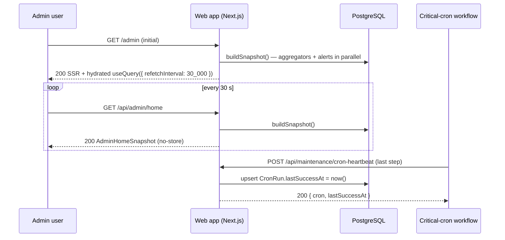

# Admin Home Endpoints

Endpoints backing the `/admin` home dashboard. The admin-facing route shares the same byte-equivalent 404 gate as every other `/admin/*` surface; the cron-heartbeat endpoint lives under `/api/maintenance/*` and uses workflow-token auth.

## Authentication

| Mode | Used by | Behavior on auth failure |
|------|---------|--------------------------|
| `A-ADMIN` | `GET /api/admin/home` | Returns byte-equivalent 404 via `requireAdminOrNotFound(request)`. Tested in `tests/integration/api/admin/home/parity-404.test.ts`. |
| `A-WORKFLOW` | `POST /api/maintenance/cron-heartbeat` | Bearer `WORKFLOW_API_TOKEN` via `validateWorkflowAuth`; returns `401 { "error": "Unauthorized" }`. Not user-discoverable; not subject to the 404-parity rule. |

## Endpoint Summary

| Path | Method | Auth | Purpose |
|------|--------|------|---------|
| `/api/admin/home` | GET | A-ADMIN | Returns the full dashboard snapshot in one round trip |
| `/api/maintenance/cron-heartbeat` | POST | A-WORKFLOW | Records a successful execution timestamp for a critical cron |

---

## GET /api/admin/home

Single-shot snapshot endpoint. Designed for a 30-second poll from the dashboard. The page renders its initial HTML against the same `buildSnapshot()` payload on the server, then TanStack Query takes over with `placeholderData: keepPreviousData` so the previous data stays mounted while the next request is in flight.

**Authentication**: A-ADMIN

**Query parameters**: none.

**Response** (200 OK):

```json
{
  "generatedAt": "2026-05-12T10:00:00.000Z",
  "alerts": [
    { "kind": "LOW_SUCCESS_RATE",        "message": "Job success rate 78% over last 7 days (28 of 36 jobs)", "href": "/admin/insights" },
    { "kind": "STRIPE_WEBHOOK_ERRORS",   "message": "2 Stripe webhook failures in the last 24h",             "href": "/admin/insights" },
    { "kind": "STALE_CRITICAL_CRON",     "message": "Cron NIGHTLY_LOG_PRUNE has not run for 41h",            "href": "/admin/insights" }
  ],
  "pulse": {
    "users":        { "value": 1342, "delta7d": 28, "delta30d": 102, "spark": [{ "d": "2026-04-13", "v": 1240 }] },
    "mau":          { "value": 612,  "deltaPrev30d": 47, "shareOfBase": 0.456, "spark": [{ "d": "2026-04-13", "v": 580 }] },
    "mrr":          { "valueUsd": 18450, "deltaUsdThisMonth": 450, "proCount": 110, "teamCount": 26, "proUsd": 165000, "teamUsd": 78000, "spark": [{ "d": "2026-04-13", "v": 17900 }] },
    "activePaying": { "value": 136, "delta30d": 9, "conversionRate": 0.1014, "spark": [{ "d": "2026-04-13", "v": 127 }] }
  },
  "business": {
    "planDistribution": [
      { "plan": "FREE", "count": 1206 },
      { "plan": "PRO",  "count": 110  },
      { "plan": "TEAM", "count": 26   }
    ],
    "activationFunnel": {
      "cohortSize": 102,
      "steps": [
        { "key": "SIGNUP",        "count": 102, "stepRate": null   },
        { "key": "FIRST_PROJECT", "count": 74,  "stepRate": 0.7255 },
        { "key": "FIRST_JOB",     "count": 58,  "stepRate": 0.7838 },
        { "key": "FIRST_PAID",    "count": 11,  "stepRate": 0.1897 }
      ]
    },
    "churn": { "cancellations": 3, "downgrades": 1, "mrrLostUsd": 6000, "netMrrDeltaUsd": -1500 }
  },
  "trends": {
    "signupsDaily": [{ "d": "2026-04-13", "v": 4 }],
    "jobsDaily":    [{ "d": "2026-04-13", "completed": 120, "failed": 7 }],
    "mrrMonthly":   [{ "m": "2025-06", "v": 12000 }]
  },
  "tables": {
    "newPaying":     [{ "email": "a@b.co", "plan": "PRO",  "accountAgeDays": 92,  "subscribedAt": "2026-04-30T00:00:00.000Z" }],
    "cancellations": [{ "email": "x@y.co", "lostPlan": "TEAM", "accountAgeDays": 410, "canceledAt": "2026-05-04T00:00:00.000Z" }],
    "topUsers":      [{ "email": "u@u.co", "plan": "PRO", "jobsThisMonth": 58 }],
    "topProjects":   [{ "projectKey": "AIB", "ownerEmail": "o@o.co", "jobsThisMonth": 204 }]
  }
}
```

### Field rules

- Currency fields are integer USD cents (suffixed `Usd`), matching `PLANS[].priceMonthly`.
- `deltaXX` fields are absolute differences in the same unit as `value`. Percentages are computed client-side.
- `conversionRate`, `shareOfBase`, and `stepRate` are floats in `[0, 1]`, or `null` when the denominator / prior step is zero.
- Spark arrays are length 30 (one point per day, oldest first). When the platform is younger than 30 days, missing days are emitted as `{ "d": "...", "v": 0 }` so the array length is constant.
- `mrrMonthly` is length **≤ 12** — the platform may be younger than a year; only existing months are emitted.
- `tables.newPaying` and `tables.cancellations` are capped server-side at 50 rows; `tables.topUsers` and `tables.topProjects` are capped at 5.
- Emails are returned verbatim — admin-only data; no redaction. Internal numeric ids are NOT included.
- Alert order is deterministic so a polling render does not jiggle.

### Alert detectors (canonical conditions)

| `kind` | Fires when |
|--------|-----------|
| `LOW_SUCCESS_RATE` | `count(Job where status ∈ {COMPLETED, FAILED} AND startedAt ≥ now()-7d) ≥ 20` **and** `count(Job where status = COMPLETED AND startedAt ≥ now()-7d) / denominator < 0.9` |
| `STRIPE_WEBHOOK_ERRORS` | `count(WebhookOutcome where status = FAILURE AND receivedAt ≥ now()-24h) ≥ 1` |
| `STALE_CRITICAL_CRON` | For each `CriticalCron` enum value: `CronRun.lastSuccessAt < now()-36h` **or** no `CronRun` row exists for that cron |

**Response** (404): empty body, `Content-Type: text/html; charset=utf-8`. Triggered by non-admin session, unauthenticated request, or blocked test override.

**Response** (500): `{ "error": "Internal server error" }`. The route wraps all aggregators in a single try/catch — partial failures never yield a partial response; the entire snapshot fails so the client keeps showing the last known good data.

**Caching**: `Cache-Control: no-store`. No CDN involvement.

**Polling contract**: client polls every 30 seconds; uses `placeholderData: keepPreviousData`; on 5xx, keeps the previous snapshot and lets TanStack Query retry on the next interval — a small `aria-live="polite"` indicator surfaces the failed-refresh state.

---

## POST /api/maintenance/cron-heartbeat

Records the timestamp of a successful execution for a registered critical cron. Called by the last step of each cron's GitHub Actions workflow after its functional work succeeds.

**Authentication**: A-WORKFLOW (`Authorization: Bearer ${WORKFLOW_API_TOKEN}` — same pattern as `/api/maintenance/prune-logs`)

**Request body** (Zod, `.strict()`):

```json
{ "cron": "NIGHTLY_LOG_PRUNE" }
```

`cron` must be a member of the `CriticalCron` enum (`NIGHTLY_LOG_PRUNE | NIGHTLY_HEALTH_SCANS | BILLING_RECONCILE`). Extra fields are rejected.

**Response** (200 OK):

```json
{ "cron": "NIGHTLY_LOG_PRUNE", "lastSuccessAt": "2026-05-12T01:17:33.421Z" }
```

The endpoint upserts the `CronRun` row keyed by `cron`. The server is the clock authority — the body never carries `lastSuccessAt`; repeated calls advance the timestamp in place.

**Errors**:

- `400 { "error": "Unknown cron", "code": "UNKNOWN_CRON" }` — body failed Zod validation
- `401 { "error": "Unauthorized" }` — missing / invalid token
- `500 { "error": "Internal server error" }` — database write failure (the workflow step treats non-2xx as a step failure so the cron is observably broken in GitHub Actions)

**Invariants**:

- Idempotent at the row level — repeated calls for the same `cron` overwrite `lastSuccessAt` with the request-time `now()`. No history is kept beyond what `CronRun.updatedAt` records.
- The endpoint never accepts `lastSuccessAt` from the client — eliminates drift between distributed runners.

---

## Page Route

`GET /admin` is a Server Component gated by `requireAdminPageOrNotFound` (the page-route variant that calls Next.js `notFound()` rather than returning a `Response`). It calls `buildSnapshot()` once for the initial render and hydrates `components/admin/home/admin-home-page.tsx`, whose `useQuery({ queryKey: ['admin','home'], refetchInterval: 30_000, staleTime: 25_000, placeholderData: keepPreviousData })` drives every subsequent refresh. Response carries `Cache-Control: private, no-store`; the admin shell layer sets `X-Frame-Options: DENY`.

Non-admin requests to `/admin` produce a Not Found response indistinguishable from a request to `/this-path-does-not-exist`.

---

## Critical-Cron Registry

The `CriticalCron` Prisma enum is mirrored in `lib/admin/cron/registry.ts` as a `CRITICAL_CRONS` array of `{ key, label, thresholdHours }`. The 36-hour threshold lives in the registry, not in workflow YAML, so the alert window is adjustable without a workflow edit.

| `CriticalCron` | Workflow file | Schedule (UTC) | Threshold |
|----------------|---------------|----------------|-----------|
| `NIGHTLY_LOG_PRUNE` | `.github/workflows/nightly-log-prune.yml` | `15 1 * * *` | 36 h |
| `NIGHTLY_HEALTH_SCANS` | `.github/workflows/nightly-health.yml` | `30 0 * * *` | 36 h |
| `BILLING_RECONCILE` | `.github/workflows/billing-reconcile.yml` (placeholder schedule; functional work owned by a follow-up ticket) | `0 2 * * *` | 36 h |

Each registered workflow appends a heartbeat step as its **last** step. If functional work fails, the heartbeat step is skipped → `lastSuccessAt` does not advance → the dashboard alert eventually fires. The workflow run itself appears red in GitHub Actions, giving a second signal.

```yaml
- name: Cron heartbeat
  env:
    APP_URL: ${{ vars.APP_URL }}
    WORKFLOW_API_TOKEN: ${{ secrets.WORKFLOW_API_TOKEN }}
  run: |
    set -euo pipefail
    curl -fsS -X POST "$APP_URL/api/maintenance/cron-heartbeat" \
      -H "Authorization: Bearer $WORKFLOW_API_TOKEN" \
      -H "Content-Type: application/json" \
      -d '{"cron":"NIGHTLY_LOG_PRUNE"}'
```

## Stripe Webhook Outcome Capture

The dashboard's `STRIPE_WEBHOOK_ERRORS` alert reads from `WebhookOutcome`, which is populated by the augmented `POST /api/webhooks/stripe` handler — one row per processed delivery after the `StripeEvent` idempotency claim succeeds. Duplicate redeliveries short-circuit at the claim and produce zero `WebhookOutcome` rows. See [Billing endpoints — `POST /api/webhooks/stripe`](./billing.md) for the unchanged Stripe contract.

## Configuration

| Env var | Default | Purpose |
|---------|---------|---------|
| `ADMIN_ALLOWLIST` | _(empty — no admins)_ | Shared with Insights LLM. Comma-separated admin emails. Re-parsed on every request. |
| `WORKFLOW_API_TOKEN` | _(required in prod)_ | Bearer token for the cron-heartbeat endpoint. Shared with the existing maintenance/prune-logs endpoint. |


