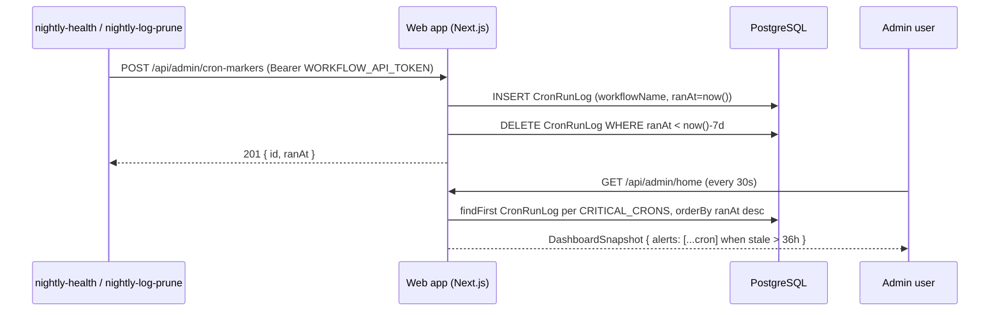

# Admin Home Endpoints

Endpoints backing the `/admin` landing page (the [Admin Home Dashboard](../../../functional/10-admin-home-dashboard.md)) and the cron-success callback that feeds its critical-cron alert. All admin (`A-ADMIN`) endpoints share the same authorization gate as the [Admin Insights endpoints](./admin-insights.md): requests from non-allowlisted callers return a Not Found response byte-equivalent to Next.js's default 404 (same status, body bytes, and headers).

## Authentication

| Mode | Used by | Behavior on auth failure |
|------|---------|--------------------------|
| `A-ADMIN` | `GET /api/admin/home` (and the `/admin` page route) | Returns byte-equivalent 404 via `requireAdminOrNotFound(request)`. |
| `A-WORKFLOW` | `POST /api/admin/cron-markers` (called by scheduled GitHub Actions workflows) | Bearer `WORKFLOW_API_TOKEN` via `verifyWorkflowToken`; returns `401 { "error": "Unauthorized" }` on failure. |

## Endpoint Summary

| Path | Method | Auth | Purpose |
|------|--------|------|---------|
| `/api/admin/home` | GET | A-ADMIN | Single consolidated dashboard snapshot (polled every 30s by the page) |
| `/api/admin/cron-markers` | POST | A-WORKFLOW | Record a "this scheduled workflow ran successfully" marker |

---

## GET /api/admin/home

Returns the full dashboard payload in a single response. The page polls this endpoint every 30 seconds; one poll cycle equals at most one HTTP request to this route.

**Authentication**: A-ADMIN

**Server flow**:

1. `requireAdminOrNotFound(request)` → admin email (or byte-equivalent 404).
2. `computeDashboardSnapshot()` — fans out per-section queries via `Promise.all`. Per-section errors are NOT swallowed; any sub-query throw surfaces as a 5xx so the page-level error banner can react. There is no partial 200 with missing sections.
3. `NextResponse.json(snapshot)` with `Cache-Control: no-store` (enforced by `export const dynamic = 'force-dynamic'`).

**Response** (200 OK):

```json
{
  "generatedAt": "2026-05-12T14:32:17.123Z",
  "alerts": [
    {
      "kind": "job-success",
      "id": "job-success",
      "payload": {
        "kind": "job-success",
        "successRatePct": 0.84,
        "failedCount": 18,
        "windowDays": 7
      },
      "actionLabel": "Voir les jobs failed",
      "actionHref": "/projects?jobStatus=FAILED&since=7d"
    }
  ],
  "pulse": {
    "users":  { "id": "users",  "label": "Utilisateurs",   "value": 1247,   "unit": "count",  "deltas": [/* 2 */], "sparkline": [/* 30 numbers */], "tooltip": "Total inscrits sur la plateforme." },
    "mau":    { "id": "mau",    "label": "MAU",            "value": 412,    "unit": "count",  "deltas": [/* 2 */], "sparkline": [/* 30 numbers */], "tooltip": "Users with ≥1 job this month." },
    "mrr":    { "id": "mrr",    "label": "MRR estimé",     "value": 184500, "unit": "cents",  "deltas": [/* 2 */], "sparkline": [/* 30 numbers */], "tooltip": "(PRO×price) + (TEAM×price)." },
    "paying": { "id": "paying", "label": "Active payants", "value": 147,    "unit": "count",  "deltas": [/* 2 */], "sparkline": [/* 30 numbers */], "tooltip": "Subscriptions with plan IN (PRO, TEAM) AND status = ACTIVE." }
  },
  "businessHealth": {
    "planDistribution": { "free": 1100, "pro": 120, "team": 27 },
    "activationFunnel": [
      { "id": "signups",       "label": "Inscriptions",        "count": 240, "conversionFromPrevious": null  },
      { "id": "first_project", "label": "1er projet",          "count": 168, "conversionFromPrevious": 0.70  },
      { "id": "first_job",     "label": "1er job",             "count": 132, "conversionFromPrevious": 0.79  },
      { "id": "paid",          "label": "Activation payante",  "count": 19,  "conversionFromPrevious": 0.144 }
    ],
    "churn": {
      "cancellationsCount": 4,
      "downgradesCount": 1,
      "mrrLostCents": 7500,
      "netMrrDeltaCents": 22500
    }
  },
  "trends": {
    "signupsPerDay": [{ "date": "2026-04-13", "value": 3 }, /* …29 more */ ],
    "jobsPerDay":    [{ "date": "2026-04-13", "completed": 12, "failed": 1 }, /* …29 more */ ],
    "mrrPerMonth":   [{ "month": "2025-06",   "mrrCents": 60000 }, /* …11 more */ ]
  },
  "actionable": {
    "newPayingUsers":      [/* up to 25 PaidUserRow */],
    "recentCancellations": [/* up to 25 CancellationRow */],
    "topActiveUsers":      [/* up to 5 TopUserRow */],
    "topProjects":         [/* up to 5 TopProjectRow */]
  },
  "meta": {
    "newPayingUsersTotal": 32,
    "recentCancellationsTotal": 5,
    "currencyMinorUnit": "cents"
  }
}
```

**TypeScript type**: `DashboardSnapshot` in `app/lib/admin/home/types.ts`.

### Field rules

- `generatedAt`: ISO 8601 UTC, server clock.
- `alerts`: empty array when no alert is triggered (never `null`). Order is fixed: `job-success` → `stripe-webhook` → `cron` cards. Within `cron`, sort by `workflowName` ascending so consecutive polls produce identical arrays.
- `pulse.*.sparkline`: exactly 30 elements, oldest-first.
- `pulse.mrr.value`: cents (integer); the formatter divides by 100. `meta.currencyMinorUnit` is the explicit contract — a future change is breaking and visible.
- `pulse.mrr.deltas[*].value`: cents delta when `unit === 'absolute'`; ratio (e.g. `0.12` for +12%) when `unit === 'percent'`.
- `pulse.paying.deltas`: one delta is `Δ30j` absolute; the other is the FREE→PAID conversion rate as a percent.
- `pulse.mau.deltas`: one delta is "vs. mois précédent" (signed integer); the other is `MAU / totalUsers` as percent.
- `businessHealth.activationFunnel`: exactly 4 elements in the order `signups`, `first_project`, `first_job`, `paid`; counts are monotone non-increasing.
- `businessHealth.activationFunnel[0].conversionFromPrevious === null`.
- `trends.signupsPerDay.length === 30`; `trends.jobsPerDay.length === 30`; `trends.mrrPerMonth.length === 12`; every day/month in the window is present (zero days are zero values, not omitted); dates are ascending (oldest first).
- `actionable.newPayingUsers.length ≤ 25`; `meta.newPayingUsersTotal` is the un-capped count.
- `actionable.recentCancellations.length ≤ 25`; `meta.recentCancellationsTotal` is the un-capped count.
- `actionable.topActiveUsers.length ≤ 5`; `actionable.topProjects.length ≤ 5`.
- Top-N tables and 30-day tables use deterministic tie-breaking (primary metric desc, then `lastJobAt` / activation date / cancellation date desc, then entity id asc) so consecutive polls produce byte-identical orderings.

### Determinism invariants

- `sum(trends.signupsPerDay[*].value) === businessHealth.activationFunnel[0].count`.
- `businessHealth.planDistribution.free + .pro + .team === prisma.subscription.count()`.
- `trends.mrrPerMonth[11].mrrCents === pulse.mrr.value`.

### Alert detection rules

| Alert kind | Trigger condition |
|------------|-------------------|
| `job-success` | `successRatePct = completed / (completed + failed + cancelled) < 0.90` over the last 7 days. |
| `stripe-webhook` | At least one PAID-subscription transition (creation, cancellation, plan change, or `canceledAt` update) in the last 24 hours AND no `StripeEvent` row with type matching `checkout.session.*`, `customer.subscription.*`, or `invoice.payment_*` in the same window. |
| `cron` | The latest `CronRunLog` row for any entry in the hard-coded `CRITICAL_CRONS = ['nightly-health', 'nightly-log-prune']` is older than 36 hours, or no marker exists yet. One alert card is emitted per missing cron. |

### 5xx response

```json
{ "error": "Failed to compute dashboard snapshot", "code": "SNAPSHOT_FAILED" }
```

- Status `500`.
- Triggered when any sub-query throws. The client renders a single page-level error banner with a retry button; the previous successful snapshot may remain visible underneath.

### Performance budget

| Metric | Target |
|--------|--------|
| First-paint of dashboard | ≤ 5 s on typical broadband |
| Aggregator p95 latency | ≤ 800 ms server-side |
| Network requests per poll | ≤ 2 |
| Response payload size | ≤ 50 KB gzipped |

The aggregator uses `Promise.all` across the section queries (no N+1 — top-tables join `User` / `Project` once per `take: 5`).

### Side effects

None. The endpoint is idempotent and read-only — it writes nothing.

**Non-admin response**: Byte-equivalent 404.

---

## POST /api/admin/cron-markers

Receive a "this cron just ran successfully" callback from a scheduled GitHub Actions workflow. Writes a `CronRunLog` row used by the `cron` alert in `GET /api/admin/home`.

**Authentication**: A-WORKFLOW (Bearer `WORKFLOW_API_TOKEN`).

**Request body** (Zod-validated):

```ts
{
  workflowName: 'nightly-health' | 'nightly-log-prune',
  durationMs?: number,   // integer, 0..86_400_000
  runUrl?: string,       // URL, max 500 chars
}
```

The accepted `workflowName` values are validated against the application's `CRITICAL_CRONS` constant — unknown names return 400 to prevent typos polluting the table.

**Server flow**:

1. `verifyWorkflowToken(request)` → 401 on failure.
2. Parse and validate the request body via Zod → 400 `VALIDATION_FAILED` on invalid input.
3. Insert one `CronRunLog` row with `ranAt = now()` (server-recorded, not client-supplied — keeps the contract simple and avoids clock skew).
4. Lazy `prisma.cronRunLog.deleteMany({ where: { ranAt: { lt: now() - 7d } } })` wrapped in a try/catch — a transient prune failure must not fail the marker write.

**Response** (201 Created):

```json
{ "id": 12345, "ranAt": "2026-05-12T00:31:04.123Z" }
```

**Error responses**:

- `400`: `{ "error": "Invalid request body", "code": "VALIDATION_FAILED", "details": [/* Zod issues */] }`
- `401`: `{ "error": "Unauthorized" }`
- `500`: `{ "error": "Failed to record cron marker", "code": "MARKER_WRITE_FAILED" }`

### Idempotency

The endpoint is **not** strictly idempotent — each call appends a row. That is intentional: multiple successful runs in a 36h window are valid, and the dashboard reads `findFirst({ orderBy: { ranAt: 'desc' } })` per workflow. The 7-day lazy prune keeps the table bounded.

### Callers

Both scheduled GitHub Actions workflows POST to this endpoint as their final step, gated by `if: success()` and `continue-on-error: true`:

- `.github/workflows/nightly-health.yml` → `workflowName: 'nightly-health'`
- `.github/workflows/nightly-log-prune.yml` → `workflowName: 'nightly-log-prune'`

Because `continue-on-error` is set on the marker step, a marker-write outage cannot fail the cron itself — the dashboard's `cron` alert will surface the marker outage as a false-positive "cron not run" until the next successful marker write.



## Page Routes

`GET /admin` is a Server Component gated by `requireAdminPageOrNotFound`. It calls `computeDashboardSnapshot()` once on the server and passes the payload as `initialData` to the client `<AdminHomeDashboard>` orchestrator. The response carries `Cache-Control: private, no-store` via `export const dynamic = 'force-dynamic'`. Non-admin requests produce a Not Found response indistinguishable from a request to a genuinely missing path.

The page no longer redirects to `/admin/insights`; the Insights page remains reachable from the admin shell sidebar's "Insights LLM" item.

## Configuration

| Env var | Default | Purpose |
|---------|---------|---------|
| `ADMIN_ALLOWLIST` | _(empty — no admins)_ | Comma-separated list of admin email addresses. Re-parsed on every request. |
| `WORKFLOW_API_TOKEN` | _(required in prod)_ | Bearer token used by the cron-marker callback (shared with other workflow-token endpoints). |
