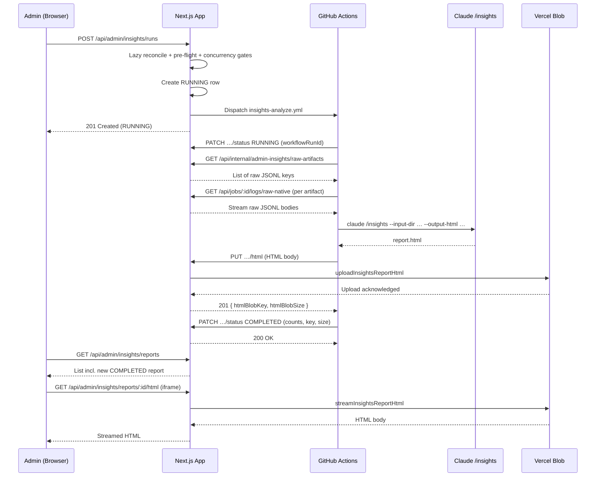

# Admin Insights Endpoints

REST endpoints serving the Admin Insights page (`/admin/insights`) and the workflow callbacks for the `insights-analyze.yml` GitHub Actions workflow.

## Authentication Classes

Routes are partitioned into exactly one of two authentication classes; there is no overlap and no fallback chain.

| Route group | Auth | Failure response |
|-------------|------|------------------|
| User-facing admin routes (list, run trigger, HTML proxy) | NextAuth session via `auth()`; `session.user.email` MUST be in `ADMIN_ALLOWLIST_EMAILS` (case-insensitive, trimmed) | **404 Not Found**, byte-equivalent to a genuinely missing route — no JSON body, no `WWW-Authenticate` header, no `Set-Cookie` differential |
| Workflow callback routes (status PATCH, HTML PUT, internal artifact enumeration) | `Authorization: Bearer ${WORKFLOW_API_TOKEN}` validated by `validateWorkflowAuth` | **401 Unauthorized** with `{ "error": "Unauthorized" }` (non-leaky because these routes are not advertised on the user surface) |

The 404 baseline is enforced via:
- `requireAdmin()` throwing a uniform "Not Found" exception that page handlers translate via `notFound()` from `next/navigation`
- API handlers returning `new NextResponse(null, { status: 404 })` (no JSON body) for non-admin callers

Tests in `tests/integration/admin/response-parity.test.ts` assert byte-equivalence between every admin route's non-admin response and the response Next.js returns for a randomly suffixed non-existent path, across status code, body, and headers (cookies set by NextAuth are excluded from the comparison).

## GET /api/admin/insights/reports

Lists past admin insights reports in reverse-chronological order.

**Authentication**: Admin allowlist
**Failure**: 404 baseline

**Query params**:
| Param | Type | Default | Bound |
|-------|------|---------|-------|
| `limit` | integer | 200 | min 1, max 200 |

**Response** (200 OK):
```json
{
  "reports": [
    {
      "id": 42,
      "status": "COMPLETED",
      "periodStart": "2026-04-12T08:13:55.000Z",
      "periodEnd":   "2026-05-09T11:00:21.000Z",
      "sessionsCount": 312,
      "ticketsCount": 47,
      "errorReason": null,
      "triggeredByEmail": "alice@example.com",
      "startedAt":   "2026-05-09T11:00:21.000Z",
      "completedAt": "2026-05-09T11:14:09.000Z",
      "createdAt":   "2026-05-09T11:00:21.000Z"
    }
  ],
  "runningReportId": null
}
```

**Notes**:
- `reports[]` ordered by `createdAt desc`, at most `limit` entries (ceiling 200)
- `runningReportId` is the id of the current RUNNING row (after lazy reconciliation), or `null`
- `triggeredByEmail` resolved via the `User` relation; `null` when `triggeredById` is null (deleted user)
- `htmlBlobKey` and `htmlBlobSize` are NEVER returned to the client
- Response headers: `Cache-Control: no-store, private`
- The handler lazily reconciles orphaned RUNNING rows before responding

**Side effects**:
- Calls `reconcileOrphanedInsightsReports()` which transitions any RUNNING row older than `INSIGHTS_RUN_TIMEOUT_MS` (default 3,600,000 ms) to FAILED with the canonical timeout reason

## POST /api/admin/insights/runs

Triggers a new insights analysis subject to pre-flight and concurrency gates.

**Authentication**: Admin allowlist
**Failure**: 404 baseline

**Request body**: empty object `{}` (validated with `z.object({}).passthrough()`; no inputs accepted — all parameters derived server-side)

**Response** (201 Created — accepted):
```json
{
  "id": 43,
  "status": "RUNNING",
  "periodStart": "2026-05-09T11:14:09.000Z",
  "periodEnd":   "2026-05-10T16:42:00.000Z",
  "startedAt":   "2026-05-10T16:42:00.000Z"
}
```

The row exists in the database and the `insights-analyze.yml` workflow has been dispatched.

**Response** (409 Conflict — pre-flight refusal):
```json
{
  "error": "No new shipped tickets since last run on 2026-05-09T11:14:09.000Z",
  "code": "NO_NEW_SHIPPED_TICKETS",
  "previousRunAt": "2026-05-09T11:14:09.000Z"
}
```
On a cold system with zero Claude jobs ever, the message is `"No shipped Claude tickets to analyze yet"` and `previousRunAt: null`.

**Response** (409 Conflict — concurrency refusal):
```json
{
  "error": "Already running since 2026-05-10T16:42:00.000Z",
  "code": "ALREADY_RUNNING",
  "runStartedAt": "2026-05-10T16:42:00.000Z"
}
```

**Response** (502 Bad Gateway — dispatch failed; row rolled back):
```json
{
  "error": "GitHub workflow dispatch failed",
  "code": "DISPATCH_FAILED"
}
```

**Algorithm**:
1. `requireAdmin()` → 404 baseline on failure
2. `reconcileOrphanedInsightsReports()` (lazy sweep)
3. Concurrency gate: `findFirst({ status: 'RUNNING' })` → 409 `ALREADY_RUNNING` if a row matches
4. Previous high-water mark: `findFirst({ status: 'COMPLETED' }, orderBy: { periodEnd: 'desc' })`
5. When no previous: earliest Claude job `startedAt` (effective agent = CLAUDE); if none → 409 cold-system refusal
6. Pre-flight count of newly shipped Claude tickets since `periodStart`; 0 → 409 `NO_NEW_SHIPPED_TICKETS`
7. Create RUNNING row with computed `periodStart` / `periodEnd` / `triggeredById`
8. Dispatch workflow via Octokit; on `RequestError` delete the row → 502 `DISPATCH_FAILED`

## GET /api/admin/insights/reports/:id/html

Streams the genuine HTML body of a COMPLETED report.

**Authentication**: Admin allowlist
**Failure**: 404 baseline

**Path params**: `id` (positive integer)

**Response** (200 OK):
- `Content-Type: text/html; charset=utf-8`
- `Cache-Control: private, no-store`
- `X-Content-Type-Options: nosniff`
- `Content-Security-Policy: default-src 'self' 'unsafe-inline' data:; frame-ancestors 'none'; base-uri 'none'; form-action 'none'`
- `X-Frame-Options: DENY` (defence in depth alongside `frame-ancestors 'none'`; the host page's iframe loads this body in an opaque-origin browsing context because the iframe is sandboxed without `allow-same-origin`)
- Body: the HTML produced by `claude /insights`, streamed unchanged from blob storage

**Response** (404 Not Found): Returned with the same baseline shape (empty body) for all of:
- Non-admin caller
- Unknown report id
- Report `status !== 'COMPLETED'` (RUNNING, FAILED)
- COMPLETED report whose blob is missing (storage incident)

The page-level rendering surfaces the "Running...", "Failed: …", or "Report content is no longer available" placeholder to admins; the endpoint itself never distinguishes the cases on the wire.

**Response** (502 Bad Gateway — transient blob backend failure):
```json
{ "error": "Blob backend unavailable", "code": "BLOB_READ_FAILED" }
```
Only reachable for admin callers; non-admins 404 before the blob lookup.

## PATCH /api/admin/insights/reports/:id/status

Workflow callback finalizing a report's lifecycle.

**Authentication**: Workflow Bearer token
**Failure**: 401

**Request body** (Zod discriminated union on `status`):

```ts
const adminInsightsReportStatusUpdateSchema = z.discriminatedUnion('status', [
  z.object({
    status: z.literal('RUNNING'),
    workflowRunId: z.coerce.bigint().positive().optional(),
  }),
  z.object({
    status: z.literal('COMPLETED'),
    sessionsCount: z.number().int().nonnegative(),
    ticketsCount: z.number().int().nonnegative(),
    htmlBlobKey: z.string().max(300).regex(/^insights\/reports\/\d+\.html$/),
    htmlBlobSize: z.number().int().positive().max(ARTIFACT_MAX_BYTES),
  }),
  z.object({
    status: z.literal('FAILED'),
    errorReason: z.string().min(1).max(2000),
  }),
]);
```

**Response** (200 OK):
```json
{ "id": 43, "status": "COMPLETED", "completedAt": "2026-05-10T16:55:32.000Z" }
```

**Semantics**:
- `RUNNING`: first-write-wins on `workflowRunId` via `updateMany({ where: { id, workflowRunId: null }, data })`. Acknowledges the workflow has started.
- `COMPLETED`: atomic conditional update `updateMany({ where: { id, status: 'RUNNING' }, data })`; on `count === 0` re-read and return current state with 200 (idempotent).
- `FAILED`: same atomic conditional update with `errorReason`. The workflow's failure-reason script truncates to 2000 chars before posting.
- Idempotent same-status PATCH returns 200 with no DB change.
- Allowed transitions: `RUNNING → COMPLETED`, `RUNNING → FAILED`. `COMPLETED → *` and `FAILED → *` are rejected; same-status (`RUNNING → RUNNING`) is accepted as a no-op.

**Response** (400 Bad Request): malformed JSON, Zod validation failure, or invalid state transition (`Invalid transition from FAILED to COMPLETED`).

**Response** (404 Not Found): unknown report id. Body `{ "error": "Insights report not found" }` (non-leaky because this route is Bearer-token gated).

**Response** (409 Conflict): row already terminal AND the requested transition is not idempotent (e.g., a delayed `RUNNING` callback after lazy reconciliation flipped the row to `FAILED`). Body `{ "error": "Run already finalized", "status": "FAILED" }` so the workflow can abort gracefully.

## PUT /api/admin/insights/reports/:id/html

Workflow uploads the HTML body produced by `claude /insights`.

**Authentication**: Workflow Bearer token
**Failure**: 401

**Request headers**:
- `Content-Type: text/html; charset=utf-8`
- `Authorization: Bearer ${WORKFLOW_API_TOKEN}`
- `Content-Length: <size in bytes>`

**Request body**: raw HTML bytes, max `ARTIFACT_MAX_BYTES` (25 MB, from `app/lib/logs/schema.ts`).

**Response** (201 Created):
```json
{ "htmlBlobKey": "insights/reports/43.html", "htmlBlobSize": 184321 }
```

**Algorithm**:
1. Validate Bearer token → 401 if invalid
2. Validate `Content-Type` starts with `text/html` → 415 `UNSUPPORTED_MEDIA_TYPE` otherwise
3. Pre-flight `Content-Length` against `ARTIFACT_MAX_BYTES` → 413 `PAYLOAD_TOO_LARGE` if over
4. Lookup report → 404 if missing
5. Refuse overwrite if the row is already `COMPLETED` or `FAILED` → 409 (a retried workflow that already finalized must not clobber the artifact). For `RUNNING`, idempotent re-upload is allowed.
6. Read body with empty-body and over-cap guards
7. Call `uploadInsightsReportHtml(buildInsightsReportArtifactKey(id), buffer, size)` (thin wrapper over `uploadJobLogArtifact` with `contentType: 'text/html; charset=utf-8'`)
8. The endpoint does NOT write `htmlBlobKey` to the row — the subsequent `PATCH …/status {COMPLETED, htmlBlobKey, htmlBlobSize}` performs the single authoritative state-write

**Response** (502 Bad Gateway):
```json
{ "error": "Blob upload failed", "code": "BLOB_UPLOAD_FAILED" }
```

## GET /api/internal/admin-insights/raw-artifacts

Workflow-internal endpoint that enumerates raw Claude session artifacts within an analysis window.

**Authentication**: Workflow Bearer token
**Failure**: 401

**Query params**: `periodStart`, `periodEnd` (ISO-8601 timestamps; `z.coerce.date()`; `periodEnd > periodStart`)

**Response** (200 OK):
```json
[
  {
    "jobId": 1234,
    "projectId": 7,
    "ticketId": 891,
    "rawArtifactKey": "raw-logs/7/891/1234.jsonl.gz",
    "capturedAt": "2026-05-04T13:22:09.000Z"
  }
]
```

**Selection criteria**:
- `Job.status = 'COMPLETED'`
- Effective agent is CLAUDE — computed as `ticket.agent ?? project.defaultAgent ?? 'CLAUDE'` (consistent with `app/api/jobs/[id]/logs/raw-artifact/route.ts`)
- `JobLog.rawArtifactKey IS NOT NULL`
- `JobLog.captureStatus = 'CAPTURED'`
- `Job.startedAt >= periodStart AND Job.startedAt < periodEnd`

Cap: 5000 rows per call (enough for years of activity; well above any plausible window). The same query backs the trigger endpoint's pre-flight count so "counted" and "analyzed" stay consistent (FR-025).

## Endpoints That Do Not Exist

By design, the admin insights surface does NOT expose:
- DELETE on any report — reports are read-only
- PATCH (other than the workflow callback) — no edit, rename, or annotation
- Any per-project, per-ticket, or per-user filtering — reports are application-wide
- Any cancel-run endpoint — the trigger flow is single-flight and orphan reconciliation handles stuck rows

These omissions are deliberate, matching the spec's read-only / never-delete posture.

## Analysis Sequence


