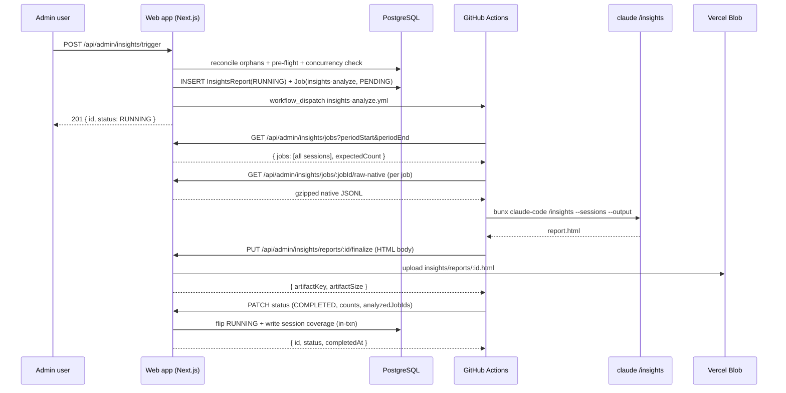

# Admin Insights Endpoints

Endpoints backing the `/admin/insights` page. All admin (`A-ADMIN`) endpoints share a single authorization gate: requests from non-allowlisted callers return a Not Found response byte-equivalent to Next.js's default 404 (same status, body bytes, and headers) — never a JSON error body, never `Forbidden`, never `Unauthorized`.

## Authentication

Two authentication modes are used:

| Mode | Used by | Behavior on auth failure |
|------|---------|--------------------------|
| `A-ADMIN` | All page and admin-facing API routes | Returns byte-equivalent 404 via `requireAdminOrNotFound(request)`. Tests in `tests/integration/api/admin/insights/parity-404.test.ts` assert byte equality against a control 404. |
| `A-WORKFLOW` | Endpoints called by `insights-analyze.yml` | Bearer `WORKFLOW_API_TOKEN` via `validateWorkflowAuth`; returns `401 { "error": "Unauthorized" }` on failure (these paths are not user-discoverable and are not subject to the 404-parity rule). |

`requireAdminOrNotFound` (`app/lib/auth/admin.ts`) resolves the current user via `getCurrentUserOrNull(request)`, normalizes the email (trim + lowercase), and checks membership in `getAdminAllowlist()` (which re-parses `ADMIN_ALLOWLIST` fresh on every call so operator rotations apply on the next request without restart).

## Endpoint Summary

| Path | Method | Auth | Purpose |
|------|--------|------|---------|
| `/api/admin/insights/preflight` | GET | A-ADMIN | UI pre-check before showing trigger button |
| `/api/admin/insights/trigger` | POST | A-ADMIN | Start a new analysis run |
| `/api/admin/insights/reports` | GET | A-ADMIN | List past reports (capped at 200) |
| `/api/admin/insights/reports/:id` | GET | A-ADMIN | Single report metadata |
| `/api/admin/insights/reports/:id/html` | GET | A-ADMIN | Stream HTML artifact into iframe |
| `/api/admin/insights/reports/:id/status` | PATCH | A-WORKFLOW | Terminal status transition (called by workflow) |
| `/api/admin/insights/reports/:id/finalize` | PUT | A-WORKFLOW | Artifact upload (called by workflow) |
| `/api/admin/insights/jobs` | GET | A-WORKFLOW | Window enumeration (called by workflow) |
| `/api/admin/insights/jobs/:jobId/raw-native` | GET | A-WORKFLOW | Cross-tenant raw native session stream (called by workflow) |

---

## GET /api/admin/insights/preflight

Mirror the trigger endpoint's pre-flight logic without mutating any state. Used by the page to decide whether to enable the "Run new analysis" button and which refusal message (if any) to display.

**Authentication**: A-ADMIN

**Response** (200 OK):
```json
{
  "canTrigger": true,
  "analyzableSessions": 14,
  "expectedSessions": 16,
  "previousRunEnd": "2026-05-04T09:00:00.000Z",
  "runningSince": null,
  "refusal": null
}
```

- `analyzableSessions`: uncovered Claude sessions whose transcript is fetchable. The trigger gate is keyed on `analyzableSessions > 0`.
- `expectedSessions`: in-scope sessions including those whose transcript is not yet available (`expectedSessions >= analyzableSessions`).

When `canTrigger` is `false`, `refusal` carries `{ refusalCode, message }` matching the trigger refusal body so the UI can render the message verbatim without firing a POST. Refusal codes: `NO_CLAUDE_SESSIONS` (no analyzable session exists at all), `NO_NEW_SESSIONS` (a prior run exists; every analyzable session is already covered), `ALREADY_RUNNING`. The snapshot is computed by `computePreflightSnapshot()`, shared with the SSR page render so both surfaces stay in lockstep.

**Non-admin response**: Byte-equivalent 404.

---

## POST /api/admin/insights/trigger

Start a new Insights analysis run. Subject to the pre-flight (analyzable Claude sessions) and concurrency (no RUNNING row) gates.

**Authentication**: A-ADMIN

**Request body** (`Content-Type: application/json`): Optional. When empty (or `{}`), the endpoint computes a fresh analysis window. To retry a failed report with the same period window, pass:

```json
{
  "periodStart": "2026-05-04T09:00:00.000Z",
  "periodEnd": "2026-05-11T12:34:56.789Z"
}
```

Validated with Zod: both fields must be present together or both absent; `periodStart` must be before `periodEnd`. Returns 400 on validation failure.

**Server flow** (in order):

1. `requireAdminOrNotFound(request)` → admin email.
2. `reconcileOrphanedRunningReports(new Date())` — lazy reconciliation auto-FAILs any RUNNING row older than `INSIGHTS_RUN_TIMEOUT_MINUTES`.
3. Parse and validate request body via `triggerBodySchema`.
4. **Fresh run** (no period params): Pre-flight: compute `count = countAnalyzableClaudeSessions()` (uncovered Claude sessions with a fetchable transcript, all stages, all projects). If `count === 0`:
   - When no COMPLETED report has ever existed → refuse with `NO_CLAUDE_SESSIONS`.
   - Otherwise → refuse with `NO_NEW_SESSIONS`.
   **Retry** (period params present): Skip the pre-flight session check (the original run proved eligibility for that window). Selection ignores the coverage marker for the explicit window, so already-covered sessions are re-analyzed (the one exception to analyze-at-most-once).
5. Concurrency gate (always enforced): if a RUNNING row exists, refuse with `ALREADY_RUNNING`.
6. Compute period bounds — **fresh run**: `periodStart = derivePeriodStart(now)` (latest completion among already-covered sessions ?? oldest available Claude session's completion ?? `now`); `periodEnd = now`. **Retry**: use the provided `periodStart` and `periodEnd` directly. The stored bounds are descriptive — selection correctness comes from the per-session coverage marker plus the half-open `periodEnd` upper bound, not from `periodStart`.
7. In a single transaction:
   - Insert `InsightsReport` with `status='RUNNING'`, `generatedAt=now`, `periodStart`, `periodEnd`.
   - Insert companion `Job` with `command='insights-analyze'`, `status='PENDING'`, `ticketId=null`, `projectId=<host project id>` (the ai-board host project — used so existing project-scoped log queries resolve).
   - Link the report to the job via `jobId`. A concurrent insert that collides on the partial-unique RUNNING index is mapped to an `ALREADY_RUNNING` refusal (atomic gate, no TOCTOU).
8. Dispatch `.github/workflows/insights-analyze.yml` on the ai-board repository with inputs `report_id`, `job_id`, `project_id`, `period_start`, `period_end`.
9. On Octokit `RequestError`, atomically transition the report to FAILED with `errorReason="Workflow dispatch failed: <status> <message>"`, delete the job row, and return 502 with `DISPATCH_FAILED`.

**Success response** (201):
```json
{
  "id": 42,
  "status": "RUNNING",
  "createdAt": "2026-05-11T12:34:56.789Z"
}
```

**Refusal responses** (409):
```json
{ "refusalCode": "NO_NEW_SESSIONS", "message": "No new Claude sessions since the last completed run" }
```
```json
{ "refusalCode": "NO_CLAUDE_SESSIONS", "message": "No analyzable Claude sessions to analyze yet" }
```
```json
{ "refusalCode": "ALREADY_RUNNING", "message": "Already running since 2026-05-11T12:30:00.000Z" }
```

**Dispatch failure response** (502):
```json
{ "refusalCode": "DISPATCH_FAILED", "message": "Workflow dispatch failed", "code": "GITHUB_ERROR" }
```

**Non-admin response**: Byte-equivalent 404.

---

## GET /api/admin/insights/reports

List past reports in reverse-chronological order, capped at 200.

**Authentication**: A-ADMIN

**Server flow**:
1. `requireAdminOrNotFound(request)`.
2. `reconcileOrphanedRunningReports(new Date())`.
3. `prisma.insightsReport.findMany({ orderBy: { generatedAt: 'desc' }, take: 200, include: { job: { select: { workflowRunId: true } } } })`.

The 200-row cap is enforced at the database query level, not only at response serialization. Each row is serialized via `toListEntry()`, which joins the linked Job's `workflowRunId` and constructs the `githubActionsUrl` server-side from `GITHUB_OWNER`/`GITHUB_REPO` environment variables.

**Response** (200 OK):
```json
{
  "reports": [
    {
      "id": 42,
      "status": "COMPLETED",
      "generatedAt": "2026-05-11T12:34:56.789Z",
      "periodStart": "2026-05-04T09:00:00.000Z",
      "periodEnd": "2026-05-11T12:34:56.789Z",
      "sessionsCount": 123,
      "expectedSessionsCount": 130,
      "coverageGapReason": "TRANSCRIPT_NOT_AVAILABLE",
      "ticketsCount": 17,
      "errorReason": null,
      "completedAt": "2026-05-11T12:39:12.345Z",
      "createdAt": "2026-05-11T12:34:56.789Z",
      "workflowRunId": "12345678",
      "githubActionsUrl": "https://github.com/owner/repo/actions/runs/12345678"
    }
  ]
}
```

`sessionsCount` is the count of sessions actually **analyzed** (transcript fetched); `expectedSessionsCount` is the count of in-scope sessions for the period including those whose transcript was not yet available; `coverageGapReason` is non-null (currently only `TRANSCRIPT_NOT_AVAILABLE`) exactly when `sessionsCount < expectedSessionsCount`, and powers the report-view "Coverage gap" badge. `ticketsCount` is the number of distinct tickets among the analyzed sessions. All three count fields are null on non-COMPLETED rows.

`workflowRunId` is the Job's BigInt workflow run ID serialized as a string, or `null` when the linked job has no run ID. `githubActionsUrl` is the full GitHub Actions URL constructed from the `workflowRunId` and the repository coordinates, or `null` when either the run ID or the repository environment variables are missing.

`artifactKey` is never returned. The client fetches the HTML body via `GET /api/admin/insights/reports/:id/html`.

**Non-admin response**: Byte-equivalent 404.

---

## GET /api/admin/insights/reports/:id

Fetch a single report's metadata.

**Authentication**: A-ADMIN

**Response** (200 OK): Same shape as one entry from the list endpoint (includes `workflowRunId` and `githubActionsUrl`).

**Not-found response**: Byte-equivalent 404 (same shape as non-admin response, so a probe cannot distinguish "no such row" from "no such page").

**Non-admin response**: Byte-equivalent 404.

---

## GET /api/admin/insights/reports/:id/html

Stream the HTML artifact for a COMPLETED report. The host page embeds this URL as the `src` of a sandboxed iframe with `sandbox="allow-scripts"` and **without** `allow-same-origin`, so the report's scripts and charts can execute while remaining isolated from the host's cookies, storage, and DOM.

**Authentication**: A-ADMIN

**Server flow**:
1. `requireAdminOrNotFound(request)`.
2. Look up the row. If absent, or `status !== 'COMPLETED'`, or `artifactKey` is null → byte-equivalent 404.
3. Stream the artifact via `streamInsightsReportArtifact(artifactKey)`.
4. If the blob is missing (storage incident) → respond with the stable placeholder HTML body:
   ```html
   <!DOCTYPE html><html lang="en"><body><p>Report content is no longer available.</p></body></html>
   ```

**Response headers** (200 OK):
```
Content-Type: text/html; charset=utf-8
Content-Security-Policy: frame-ancestors 'self'
Cache-Control: private, max-age=300
X-Content-Type-Options: nosniff
```

`X-Frame-Options` is intentionally NOT set on this endpoint — the admin shell needs to frame it. The `frame-ancestors 'self'` CSP prevents embedding from other origins.

**Blob backend unreachable** (502): the admin shell iframes this endpoint, so the body MUST stay renderable HTML rather than a raw JSON payload bleeding through the iframe. The response sets the same headers as a 200 plus `Retry-After: 30` and uses this placeholder body:

```html
<!DOCTYPE html><html lang="en"><body><p>Report content is temporarily unavailable. Please retry shortly.</p></body></html>
```

**Non-admin response**: Byte-equivalent 404.

---

## PATCH /api/admin/insights/reports/:id/status

Workflow-driven terminal status transition. All transitions use an atomic conditional update guarded on `WHERE id = ? AND status = 'RUNNING'`, so late callbacks that arrive after a reconciliation auto-FAIL are no-ops (the row's terminal status is preserved).

**Authentication**: A-WORKFLOW (Bearer `WORKFLOW_API_TOKEN`)

**Request body** (Zod-validated):
```ts
{
  status: 'COMPLETED' | 'FAILED',
  sessionsCount?: number,           // required when COMPLETED; sessions analyzed
  expectedSessionsCount?: number,   // required when COMPLETED; in-scope incl. transcript-pending
  ticketsCount?: number,            // required when COMPLETED; distinct tickets among analyzed
  analyzedJobIds?: number[],        // required when COMPLETED; the exact jobs analyzed → coverage rows
  artifactKey?: string,             // required when COMPLETED; matches /^insights\/reports\/\d+\.html$/
  artifactSize?: number,            // required when COMPLETED
  errorReason?: string,             // required when FAILED; 1–500 chars
}
```

COMPLETED validation requires all of `sessionsCount`, `expectedSessionsCount`, `ticketsCount`, `analyzedJobIds`, `artifactKey`, `artifactSize`. Additional refinements: `analyzedJobIds` is a non-empty array of positive ints with `length === sessionsCount`; `expectedSessionsCount >= sessionsCount`; `artifactKey` must equal `insights/reports/<id>.html`.

On `status === 'COMPLETED'`, the endpoint re-fetches the uploaded blob and re-runs `validateInsightsOutput` server-side as defense in depth. If validation fails, the COMPLETED transition is overridden into FAILED with `errorReason = "Insights output validation failed"` and **no coverage is written**. If the blob fetch itself fails (backend outage), the endpoint returns `503 BLOB_UNREACHABLE` and leaves the RUNNING row untouched so the workflow can retry.

**Coverage advance** — on a successful COMPLETED flip, inside the same `$transaction`:
- `coverageGapReason` is set to `TRANSCRIPT_NOT_AVAILABLE` when `expectedSessionsCount > sessionsCount`, else null.
- One `InsightsSessionCoverage` row is inserted per `analyzedJobIds` entry via `createMany({ skipDuplicates: true })`, marking those exact sessions as analyzed so subsequent runs exclude them.

A **FAILED** transition writes no coverage — the sessions stay uncovered and eligible for the next run. The coverage advance and Job cascade share the COMPLETED `$transaction` gated on `WHERE status='RUNNING'`, so a late/duplicate callback that loses the flip race writes neither a status change nor coverage (idempotent no-op).

**Response** (200 OK):
```json
{ "id": 42, "status": "COMPLETED", "completedAt": "2026-05-11T12:39:12.345Z" }
```

When the atomic update finds no RUNNING row with that id (late callback after auto-FAIL), the endpoint returns 200 with the current terminal row's metadata — an idempotent no-op.

**Errors**:
- `400`: Validation failed
- `401`: Invalid or missing workflow token
- `404`: Report not found (workflow-only endpoint — JSON `{ "error": "Not Found" }`, not the byte-equivalent 404 used for admin endpoints)

**Side effects**:
- Updates the linked `Job` row's status via a direct atomic update (bypassing the user-facing `/api/jobs/:id/status` handler so push notifications are **not** fired — insights jobs never send notifications).

---

## PUT /api/admin/insights/reports/:id/finalize

Workflow-driven artifact upload. The workflow streams the produced HTML body to this endpoint; the server validates content type, size, and structural markers BEFORE writing to Vercel Blob.

**Authentication**: A-WORKFLOW

**Request**: Raw HTML bytes with `Content-Type: text/html; charset=utf-8`.

**Server flow**:
1. `validateWorkflowAuth(request)` → 401 on failure.
2. Parse and validate the `:id` path param → 400 on invalid.
3. Validate `Content-Type` starts with `text/html` → 415 `UNSUPPORTED_MEDIA_TYPE` otherwise.
4. Look up the report row → 404 JSON on missing.
5. Read body; reject empty (400) or size > 25 MB (`ARTIFACT_MAX_BYTES`) → 413 `PAYLOAD_TOO_LARGE`.
6. Run `validateInsightsOutput(body.toString('utf-8'))` → 422 `INVALID_OUTPUT` on failure (the workflow then PATCHes status to FAILED with reason `"Insights output validation failed"`).
7. Compute `artifactKey = buildInsightsReportKey(id)` → `insights/reports/<id>.html`.
8. `uploadInsightsReportArtifact(artifactKey, buffer)` → 502 `BLOB_UPLOAD_FAILED` on backend error.

**Response** (200 OK):
```json
{ "artifactKey": "insights/reports/42.html", "artifactSize": 123456 }
```

**Error responses**:
- `400`: Invalid id, empty body, or unreadable body
- `401`: Invalid or missing workflow token
- `404`: Report not found
- `413`: Artifact exceeds 25 MB (`PAYLOAD_TOO_LARGE`)
- `415`: Content-Type not `text/html` (`UNSUPPORTED_MEDIA_TYPE`)
- `422`: Output failed structural-marker validation (`INVALID_OUTPUT`)
- `502`: Blob backend rejected the upload (`BLOB_UPLOAD_FAILED`)

---

## GET /api/admin/insights/jobs

Enumerate **every analyzable Claude session** in the given half-open window. The workflow calls this immediately after dispatch to determine which raw native session artifacts to download.

**Authentication**: A-WORKFLOW

**Query parameters**:
- `periodStart` (ISO 8601, required) — inclusive lower bound
- `periodEnd` (ISO 8601, required) — exclusive upper bound

Validation rejects `periodStart >= periodEnd` with 400.

**Server flow**: Calls `listAnalyzableClaudeSessions(window)` and `countExpectedClaudeSessions(window)` from `app/lib/insights/predicate.ts` — the **same** predicate the trigger's pre-flight and the `/preflight` endpoint use, so the pre-flight count and the workflow's analysis-input enumeration cannot drift.

A session is treated as Claude when its **effective agent** is Claude — the ticket-level `agent` if set, otherwise the project-level `defaultAgent`. Non-Claude sessions are silently filtered out at enumeration time.

There is **no per-ticket dedup**, **no SHIP filter**, and **no project filter**: a ticket with implement, iterate, and verify sessions contributes all three, and sessions from in-progress / abandoned / rolled-back tickets across every project are included. The returned `jobs` are exactly the analyzable sessions (transcript fetchable); `expectedCount` additionally counts in-scope sessions whose transcript is not yet available, so the workflow can report the analyzed-vs-expected gap (`expectedCount >= jobs.length`).

**Response** (200 OK):
```json
{
  "jobs": [
    {
      "jobId": 1234,
      "projectId": 7,
      "ticketId": 89,
      "rawArtifactKey": "raw-logs/7/89/1234.jsonl.gz"
    }
  ],
  "expectedCount": 16
}
```

---

## GET /api/admin/insights/jobs/:jobId/raw-native

Stream a single raw native Claude Code session JSONL artifact for a Claude job. This is the **only** workflow-token-authenticated cross-tenant read in the platform — it intentionally crosses project boundaries because the insights analyzer must see sessions from every project.

**Authentication**: A-WORKFLOW

**Server flow**:
1. `validateWorkflowAuth(request)` → 401 on failure.
2. Look up the job; 404 if it has no ticket. Apply the shared **effective-agent** check — a non-Claude session returns 404, exactly as the workflow's enumeration would skip it. This prevents a compromised `WORKFLOW_API_TOKEN` from enumerating non-Claude artifacts. There is **no SHIP gate**: sessions of unshipped (in-progress / abandoned / rolled-back) Claude tickets stream normally (FR-008).
3. Resolve the job's `rawArtifactKey` and run `canonicalizeRawArtifactKey` to reject any key pointing outside this job's canonical path (path-traversal defense); 404 on mismatch or when no key exists.
4. Stream the artifact at `raw-logs/<projectId>/<ticketId>/<jobId>.<ext>` (current `.tar.gz` or legacy `.jsonl.gz`) from Vercel Blob.

**Response** (200 OK):
- `Content-Type: application/gzip`
- Body: the gzipped native session stream

| jobId state | Status |
|-------------|--------|
| Claude, shipped, has artifact | 200 |
| Claude, **unshipped**, has artifact | 200 |
| Non-Claude effective agent | 404 |
| No ticket / no artifact / key mismatch | 404 |

**Errors**:
- `401`: Invalid or missing workflow token
- `404`: Job is not a Claude session, has no ticket, or artifact missing / key mismatch
- `502`: Blob backend unreachable

**Security note**: Compromising `WORKFLOW_API_TOKEN` already grants write access to log artifacts across the platform; adding read access for Claude raw artifacts only does not meaningfully expand the trust boundary. The effective-agent check and key canonicalization before streaming are defense-in-depth filters to prevent token misuse beyond the intended scope.

---

## Page Routes

`GET /admin` and `GET /admin/insights` are Server Components gated by `requireAdminPageOrNotFound` (the page-route variant that calls Next.js `notFound()` rather than returning a `Response`). `/admin` redirects to `/admin/insights`. Both responses carry `Cache-Control: private, no-store`; the admin shell layer sets `X-Frame-Options: DENY` on top-level admin paths to prevent click-jacking of the shell itself.

Non-admin requests to any `/admin/...` path — including paths that don't resolve to a defined page route — produce a Not Found response indistinguishable from a request to `/this-path-does-not-exist`.

## Configuration

| Env var | Default | Purpose |
|---------|---------|---------|
| `ADMIN_ALLOWLIST` | _(empty — no admins)_ | Comma-separated list of admin email addresses. Re-parsed on every request. |
| `INSIGHTS_RUN_TIMEOUT_MINUTES` | `60` | Reconciliation cutoff for orphaned RUNNING rows. |
| `WORKFLOW_API_TOKEN` | _(required in prod)_ | Bearer token for workflow-authenticated endpoints. |
| `BLOB_READ_WRITE_TOKEN` | _(required in prod)_ | Vercel Blob credentials for `insights/reports/*.html`. |
| `ANTHROPIC_API_KEY` | _(required in workflow)_ | Used by the workflow to authenticate `bunx @anthropic-ai/claude-code /insights`. |

## Workflow

`.github/workflows/insights-analyze.yml` is dispatched on the ai-board repository (not on the external target). It enumerates every analyzable Claude session in the window (capturing both `session_count` = `jobs.length` and `expected_count`), downloads the raw native session JSONL for each enumerated job, runs `bunx @anthropic-ai/claude-code /insights --sessions ./sessions --output ./report.html` (the genuine slash command — never a free-text prompt), validates the produced HTML contains the analyzer's characteristic markers (`Suggested CLAUDE.md additions`, `Big wins`, `Horizon`), uploads via `PUT /finalize`, and PATCHes the report and job to terminal status. The COMPLETED PATCH carries `sessionsCount` (= `session_count`), `expectedSessionsCount`, `ticketsCount`, and `analyzedJobIds` (= `[.jobs[].jobId]`) so the server can advance per-session coverage; the FAILED PATCH carries only `errorReason` and advances no coverage. Count/enumeration parity is guaranteed because `sessionsCount`, `jobs.length`, and `analyzedJobIds.length` all derive from the same `jobs.json`. The job has a 50-minute timeout — 10 minutes below the default 60-minute `INSIGHTS_RUN_TIMEOUT_MINUTES` — so the workflow's own failure path runs before reconciliation auto-FAILs the row.


