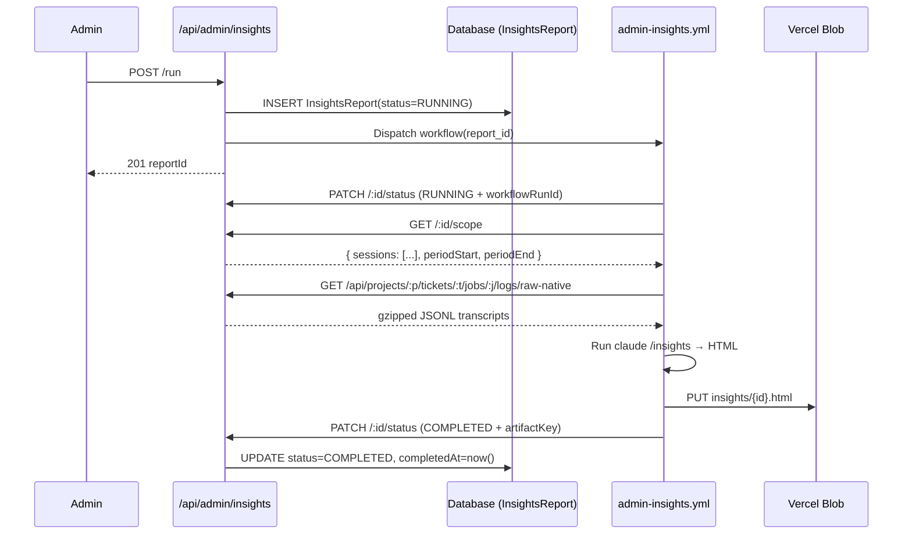

# Admin Endpoints

Application-level endpoints for the `/admin` area. All endpoints under `/api/admin/*` enforce admin access; the workflow callback endpoints under the same tree authenticate via `WORKFLOW_API_TOKEN` instead.

## Admin Access Model

**Allowlist**: Admin status is determined by email address against the comma-separated `ADMIN_USER_EMAILS` environment variable. There is no DB-backed admin role.

**Helpers** (`lib/auth/admin.ts`):

| Helper | Purpose |
|--------|---------|
| `getAdminAllowlist()` | Parses `ADMIN_USER_EMAILS` into a deduplicated, lower-cased list |
| `isAdminEmail(email)` | Returns `true` when the email matches the allowlist |
| `getCurrentAdminOrNull(request?)` | Resolves the current user and returns it only if admin; otherwise `null` |
| `requireAdmin(request?)` | Throws `AdminAccessDeniedError` when the caller is not an admin |

**Stealth 404**: Both unauthenticated requests and signed-in non-admin requests receive `404 Not Found` with body `{ "error": "Not found" }`. The response is identical for "no such page" and "you are not an admin" so the area's existence is never disclosed.

The same stealth-404 rule applies to the `/admin` page tree — `app/admin/layout.tsx` calls `getCurrentAdminOrNull()` and invokes `notFound()` when access is denied.

---

## Insights Endpoints

### GET /api/admin/insights

Returns the report list, the latest successful report, the active (RUNNING) report if any, and the current scope preview used to enable/disable the trigger button.

**Authentication**: Admin session (stealth 404 otherwise)

**Response** (200 OK, `Cache-Control: no-store`):
```json
{
  "reports": [
    {
      "id": 12,
      "status": "COMPLETED",
      "periodStart": "2026-04-15T00:00:00.000Z",
      "periodEnd": "2026-05-10T12:34:56.000Z",
      "sessionCount": 18,
      "ticketCount": 5,
      "errorMessage": null,
      "startedAt": "2026-05-10T12:34:56.000Z",
      "completedAt": "2026-05-10T12:41:02.000Z"
    }
  ],
  "latest": { "id": 12, "status": "COMPLETED", "...": "..." },
  "active": null,
  "scope": {
    "previousRunAt": "2026-05-10T12:34:56.000Z",
    "newTicketCount": 3,
    "hasNewTickets": true
  }
}
```

**Notes**:
- `reports` returns up to 50 rows ordered by `startedAt` desc.
- `latest` is the most recent `COMPLETED` report or `null`.
- `active` is the most recent `RUNNING` report or `null`.
- `scope.previousRunAt` is the previous successful run's `periodEnd` — null on a first run.
- `scope.newTicketCount` counts `TicketOutcome` rows shipped strictly after `previousRunAt`.

**Error Responses**:

| Status | Body | Condition |
|--------|------|-----------|
| `404` | `{ "error": "Not found" }` | Caller is not an admin |
| `500` | `{ "error": "Internal server error" }` | Unhandled error |

---

### GET /api/admin/insights/:id

Fetches a single report along with its inline HTML body (only when the report is `COMPLETED` and a Blob artifact exists).

**Authentication**: Admin session (stealth 404 otherwise)

**Path params**: `id` (integer ≥ 1, required)

**Response** (200 OK, `Cache-Control: no-store`):
```json
{
  "report": {
    "id": 12,
    "status": "COMPLETED",
    "periodStart": "2026-04-15T00:00:00.000Z",
    "periodEnd": "2026-05-10T12:34:56.000Z",
    "sessionCount": 18,
    "ticketCount": 5,
    "errorMessage": null,
    "startedAt": "2026-05-10T12:34:56.000Z",
    "completedAt": "2026-05-10T12:41:02.000Z",
    "html": "<!doctype html>…"
  }
}
```

**Notes**:
- `html` is loaded from Vercel Blob via `fetchInsightsReportArtifact(report.artifactKey)` and is `null` for non-COMPLETED reports or when no artifact key is recorded.
- The route never exposes the Blob URL or token; all reads stream through the API and the frontend renders the HTML inside a sandboxed iframe.

**Error Responses**:

| Status | Body | Condition |
|--------|------|-----------|
| `400` | `{ "error": "Invalid id" }` | Path param is not a positive integer |
| `404` | `{ "error": "Not found" }` | Caller is not an admin |
| `404` | `{ "error": "Report not found" }` | Report row does not exist |
| `502` | `{ "error": "Report artifact unavailable", "code": "BLOB_UNREACHABLE" }` | Blob fetch failed |
| `500` | `{ "error": "Internal server error" }` | Unhandled error |

---

### POST /api/admin/insights/run

Creates a new InsightsReport row in `RUNNING` and dispatches the `admin-insights.yml` workflow.

**Authentication**: Admin session (stealth 404 otherwise)

**Request body**: empty.

**Response** (201 Created):
```json
{
  "reportId": 13,
  "status": "RUNNING",
  "sessionCount": 12,
  "ticketCount": 3,
  "periodStart": "2026-05-10T12:41:02.000Z",
  "periodEnd": "2026-05-12T08:00:00.000Z"
}
```

**Pre-flight checks** (in order):
1. Stealth-404 if the caller is not an admin.
2. `409 Conflict` with `code: "ANALYSIS_IN_PROGRESS"` if another report is currently `RUNNING`.
3. `422 Unprocessable Entity` with `code: "NO_NEW_TICKETS"` when `previewInsightsScope().hasNewTickets` is false. Body includes `previousRunAt` (or null) and a friendly message: `"No new shipped tickets since last run on {iso}"` or `"No shipped tickets are available to analyze yet"`.

**Dispatch failure**: If `dispatchAdminInsightsWorkflow()` throws, the just-created report row is updated to `FAILED` with the error message recorded, and the API returns `500 Internal server error`.

**Error Responses**:

| Status | Body | Condition |
|--------|------|-----------|
| `404` | `{ "error": "Not found" }` | Caller is not an admin |
| `409` | `{ "error": "An insights analysis is already running", "code": "ANALYSIS_IN_PROGRESS", "activeReportId": 12 }` | Another report is RUNNING |
| `422` | `{ "error": "...", "code": "NO_NEW_TICKETS", "previousRunAt": "..." }` | No new shipped tickets in scope |
| `500` | `{ "error": "Internal server error" }` | Dispatch failure or unhandled error |

---

### GET /api/admin/insights/:id/scope

Workflow-only endpoint. Returns the freshly resolved scope (period bounds + per-session metadata) for the workflow to download the right raw artifacts.

**Authentication**: `Authorization: Bearer <WORKFLOW_API_TOKEN>` via `validateWorkflowAuth(request)`.

**Path params**: `id` (integer ≥ 1, required)

**Response** (200 OK, `Cache-Control: no-store`):
```json
{
  "reportId": 13,
  "periodStart": "2026-05-10T12:41:02.000Z",
  "periodEnd": "2026-05-12T08:00:00.000Z",
  "ticketIds": [421, 425, 432],
  "sessions": [
    {
      "jobId": 8801,
      "projectId": 3,
      "ticketId": 421,
      "rawArtifactKey": "raw-logs/3/421/8801.jsonl.gz"
    }
  ]
}
```

**Notes**:
- Scope is rebuilt at request time (not read from the DB row) so the workflow always receives the freshest set of CLAUDE jobs whose raw native artifact was captured.
- `sessions` is filtered to `ticket.agent = CLAUDE` AND `JobLog.captureStatus = CAPTURED` AND `JobLog.rawArtifactKey IS NOT NULL`.

**Error Responses**:

| Status | Body | Condition |
|--------|------|-----------|
| `400` | `{ "error": "Invalid id" }` | Path param is not a positive integer |
| `401` | `{ "error": "Unauthorized" }` | Workflow auth failed |
| `404` | `{ "error": "Report not found" }` | Report row does not exist |

---

### PATCH /api/admin/insights/:id/status

Workflow-only endpoint. The `admin-insights.yml` workflow uses this to update the report's lifecycle state and record the final artifact metadata.

**Authentication**: `Authorization: Bearer <WORKFLOW_API_TOKEN>` via `validateWorkflowAuth(request)`.

**Path params**: `id` (integer ≥ 1, required)

**Request body** (Zod-validated):
```json
{
  "status": "COMPLETED",
  "workflowRunId": "12345678901",
  "artifactKey": "insights/13.html",
  "artifactSize": 184230,
  "errorMessage": null
}
```

| Field | Type | Required | Notes |
|-------|------|----------|-------|
| `status` | `"RUNNING" \| "COMPLETED" \| "FAILED"` | Yes | Terminal states write `completedAt = now()` |
| `workflowRunId` | string of digits or positive integer | No | Stored as BigInt |
| `artifactKey` | string ≤ 300 chars | No | Vercel Blob key for the HTML artifact |
| `artifactSize` | non-negative integer | No | Byte size |
| `errorMessage` | string ≤ 2000 chars | No | Recorded for FAILED runs |

**Response** (200 OK, `Cache-Control: no-store`):
```json
{
  "id": 13,
  "status": "COMPLETED",
  "artifactKey": "insights/13.html",
  "artifactSize": 184230,
  "errorMessage": null,
  "completedAt": "2026-05-12T08:06:14.000Z"
}
```

**Error Responses**:

| Status | Body | Condition |
|--------|------|-----------|
| `400` | `{ "error": "Invalid id" }` | Path param is not a positive integer |
| `400` | `{ "error": "Invalid JSON" }` | Body could not be parsed |
| `400` | `{ "error": "Validation failed", "code": "VALIDATION_ERROR", "issues": [...] }` | Schema validation failed |
| `401` | `{ "error": "Unauthorized" }` | Workflow auth failed |
| `404` | `{ "error": "Report not found" }` | Report row does not exist |

---

## Workflow Sequence


