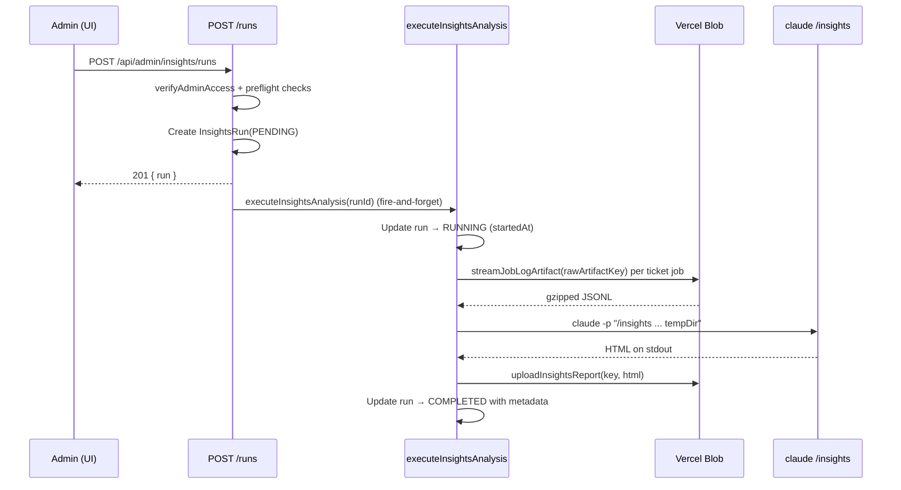

# Admin Endpoints

Endpoints under `/api/admin/*` power the `/admin` area. They are gated by `verifyAdminAccess(request)` which checks NextAuth session identity (or Bearer PAT) against the `ADMIN_EMAILS` allowlist.

**Access model**: All admin endpoints return `404 Not Found` to non-admins and unauthenticated callers — there is no `403`, and the response body is identical to a missing resource. This prevents discovery of the admin area.

## Admin Insights Endpoints

The Insights endpoints orchestrate Claude Code `/insights` analysis runs over captured Claude Code session JSONL artifacts.

### POST /api/admin/insights/runs

Trigger a new insights analysis run.

**Authentication**: Session cookie OR Bearer PAT, validated against `ADMIN_EMAILS`

**Request body**: None — the server determines the analysis window automatically.

**Behavior**:
1. `verifyAdminAccess(request)`; on failure → 404
2. Verify Vercel Blob is configured (`isConfigured()`); on failure → 503 with `BLOB_NOT_CONFIGURED`
3. Look up an existing `PENDING`/`RUNNING` row with `timeoutAt > now()`; if found → 409 with `RUN_IN_PROGRESS`
4. Resolve the analysis window: from the last `COMPLETED` run's `periodEnd` (or epoch for the first ever run)
5. Count shipped tickets with effective agent `CLAUDE` (`buildEffectiveAgentWhere('CLAUDE')`) updated since that date; if zero → 409 with `NO_NEW_TICKETS` and the cutoff date
6. Create `InsightsRun { status: PENDING, triggeredBy, timeoutAt: now() + 30 minutes }`
7. Kick off `executeInsightsAnalysis(runId)` as fire-and-forget background work; errors are caught and logged but do not block the response
8. Return `201 Created` with the created run

**Response** (201 Created):
```json
{
  "run": {
    "id": 1,
    "status": "PENDING",
    "triggeredBy": "user-id-123",
    "periodStart": null,
    "periodEnd": null,
    "sessionCount": null,
    "ticketCount": null,
    "reportKey": null,
    "reportSize": null,
    "errorMessage": null,
    "timeoutAt": "2026-05-11T13:30:00.000Z",
    "startedAt": null,
    "completedAt": null,
    "createdAt": "2026-05-11T13:00:00.000Z",
    "updatedAt": "2026-05-11T13:00:00.000Z"
  }
}
```

**Errors**:
- `404 Not Found`: caller not admin (`{ "error": "Not found" }`)
- `409 Conflict`: active run in progress (`RUN_IN_PROGRESS`)
- `409 Conflict`: no new shipped tickets (`NO_NEW_TICKETS`, includes `lastRunDate`)
- `503 Service Unavailable`: blob not configured (`BLOB_NOT_CONFIGURED`)

---

### GET /api/admin/insights/runs

List insights runs, newest first, with cursor pagination.

**Authentication**: Session cookie OR Bearer PAT, validated against `ADMIN_EMAILS`

**Query params**:
| Param | Type | Default | Description |
|-------|------|---------|-------------|
| `limit` | int 1–100 | 20 | Maximum runs to return |
| `cursor` | int (positive) | — | Returns runs with `id < cursor` |
| `status` | enum | — | Filter to `PENDING`, `RUNNING`, `COMPLETED`, or `FAILED` |

**Response** (200 OK):
```json
{
  "runs": [
    {
      "id": 5,
      "status": "COMPLETED",
      "triggeredBy": "user-id-123",
      "periodStart": "2026-04-01T00:00:00.000Z",
      "periodEnd": "2026-05-11T13:00:00.000Z",
      "sessionCount": 42,
      "ticketCount": 15,
      "reportKey": "insights-reports/5.html",
      "reportSize": 125000,
      "errorMessage": null,
      "timeoutAt": "2026-05-11T13:30:00.000Z",
      "startedAt": "2026-05-11T13:00:05.000Z",
      "completedAt": "2026-05-11T13:02:30.000Z",
      "createdAt": "2026-05-11T13:00:00.000Z",
      "updatedAt": "2026-05-11T13:02:30.000Z"
    }
  ],
  "nextCursor": 4,
  "hasMore": true
}
```

`nextCursor` is the `id` of the last returned run; pass it as `cursor` for the next page. `nextCursor` is `null` when `hasMore` is false.

**Errors**:
- `400 Bad Request`: query parameters fail validation (`VALIDATION_ERROR`)
- `404 Not Found`: caller not admin

---

### GET /api/admin/insights/runs/[runId]

Fetch a single run by ID.

**Authentication**: Session cookie OR Bearer PAT, validated against `ADMIN_EMAILS`

**Response** (200 OK):
```json
{ "run": { "id": 5, "status": "COMPLETED", "...": "..." } }
```

**Errors**:
- `400 Bad Request`: `runId` not a positive integer
- `404 Not Found`: caller not admin, or run does not exist

---

### PATCH /api/admin/insights/runs/[runId]/status

Update the status of an in-flight run. Used by the background analysis worker, but also callable by an admin session (used for tests and recovery).

**Authentication**: One of:
- `Authorization: Bearer <WORKFLOW_API_TOKEN>` (preferred for workflow callers)
- Admin session / PAT (when no workflow token is supplied, falls back to `verifyAdminAccess`)

**Request body** (discriminated by `status`):

Transition to `RUNNING`:
```json
{ "status": "RUNNING" }
```

Transition to `COMPLETED`:
```json
{
  "status": "COMPLETED",
  "periodStart": "2026-04-01T00:00:00.000Z",
  "periodEnd": "2026-05-11T13:00:00.000Z",
  "sessionCount": 42,
  "ticketCount": 15,
  "reportKey": "insights-reports/5.html",
  "reportSize": 125000
}
```

Transition to `FAILED`:
```json
{ "status": "FAILED", "errorMessage": "Claude Code /insights produced empty output" }
```

**Validation** (Zod discriminated union):
- `COMPLETED` requires all six metadata fields above; `sessionCount`, `ticketCount`, `reportSize` are non-negative integers
- `FAILED` requires non-empty `errorMessage` (max 2000 chars)

**Valid transitions**:

| Current | Allowed Next |
|---------|--------------|
| `PENDING` | `RUNNING`, `FAILED` |
| `RUNNING` | `COMPLETED`, `FAILED` |
| `COMPLETED` / `FAILED` | None (terminal) |

**Side effects**:
- `RUNNING`: sets `startedAt = now()`
- `COMPLETED`: sets `completedAt = now()` plus all metadata fields
- `FAILED`: sets `completedAt = now()` and `errorMessage`

**Response** (200 OK): Updated run.

**Errors**:
- `400 Bad Request`: invalid run ID, payload fails Zod validation, or transition not allowed (`INVALID_TRANSITION`)
- `404 Not Found`: caller not admin, or run does not exist

---

### GET /api/admin/insights/runs/[runId]/report

Stream the HTML report artifact for a completed run.

**Authentication**: Session cookie OR Bearer PAT, validated against `ADMIN_EMAILS`

**Behavior**:
1. `verifyAdminAccess(request)`; on failure → 404
2. Look up the run and read its `reportKey`; if missing or null → 404
3. Stream the artifact via `streamInsightsReport(reportKey)`; if blob missing → 404
4. Return the HTML body with long-lived caching (reports are immutable once written)

**Response** (200 OK):
```
Content-Type: text/html; charset=utf-8
Content-Length: <bytes>
Cache-Control: private, max-age=3600
```
Body: HTML streamed from Vercel Blob.

**Errors**:
- `404 Not Found`: caller not admin, run not found, `reportKey` null, or blob object missing

The report is rendered inside a sandboxed iframe on the Insights page (no `allow-scripts`, no `allow-same-origin`) to prevent any markup in the generated HTML from interacting with the parent document.

---

### GET /api/admin/insights/latest

Convenience endpoint returning the latest completed run alongside any in-flight run. Powers the page load on `/admin/insights`.

**Authentication**: Session cookie OR Bearer PAT, validated against `ADMIN_EMAILS`

**Response** (200 OK):
```json
{
  "run": {
    "id": 5,
    "status": "COMPLETED",
    "periodStart": "2026-04-01T00:00:00.000Z",
    "periodEnd": "2026-05-11T13:00:00.000Z",
    "sessionCount": 42,
    "ticketCount": 15,
    "reportKey": "insights-reports/5.html",
    "reportSize": 125000,
    "reportUrl": "/api/admin/insights/runs/5/report",
    "completedAt": "2026-05-11T13:02:30.000Z",
    "createdAt": "2026-05-11T13:00:00.000Z"
  },
  "activeRun": null
}
```

When an analysis is in progress, `activeRun` contains a slimmed-down view of the running record:
```json
{
  "activeRun": {
    "id": 6,
    "status": "RUNNING",
    "startedAt": "2026-05-11T14:00:05.000Z",
    "createdAt": "2026-05-11T14:00:00.000Z"
  }
}
```

If no completed run exists yet, `run` is `null`. `reportUrl` is omitted when `reportKey` is null.

**Errors**:
- `404 Not Found`: caller not admin

## Insights Analysis Flow



On any failure, the background worker transitions the run to `FAILED` with `errorMessage` (truncated to 2000 chars) and cleans up its temp directory in `finally`.
