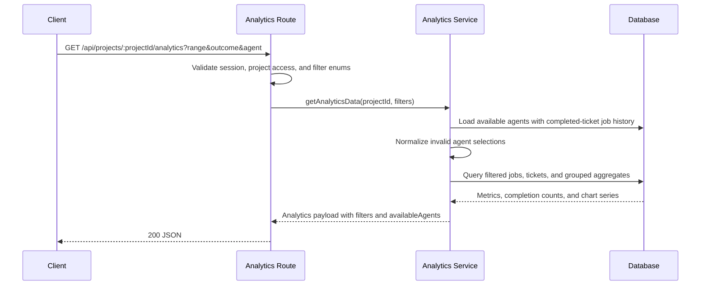

# Analytics & Activity Endpoints

## Analytics Endpoints

### GET /api/projects/:projectId/analytics

Fetch aggregated analytics data for project visualization.

**Authentication**: Required (session)
**Authorization**: Must be project owner or member

**Path Parameters**:
- `projectId` (number, required): Project ID

**Query Parameters**:
- `range` (string, optional): Time range for analytics (7d|30d|90d|all, default: 30d)
- `outcome` (string, optional): Terminal ticket outcome scope (shipped|closed|all-completed, default: shipped)
- `agent` (string, optional): Effective agent scope (all|CLAUDE|CODEX|MISTRAL, default: all)

**Behavior**:
- The endpoint returns one coherent analytics payload for the active `range`, `outcome`, and `agent` filters.
- Job-backed metrics use jobs whose tickets currently match the selected outcome set and effective agent.
- Effective agent resolution uses `ticket.agent` when present and falls back to `project.defaultAgent`.
- Ticket completion metrics stay visible even when no filtered jobs contain telemetry data.
- If a requested agent is not available in the current project, the analytics service falls back to `all`.

**Sequence**:


**Response** (200 OK):
```json
{
  "overview": {
    "totalCost": 45.67,
    "costTrend": 12.5,
    "successRate": 94.2,
    "avgDuration": 125000,
    "ticketsShipped": {
      "count": 8,
      "label": "Last 30 days"
    },
    "ticketsClosed": {
      "count": 3,
      "label": "Last 30 days"
    }
  },
  "costOverTime": [
    { "date": "2025-11-20", "cost": 5.23 },
    { "date": "2025-11-21", "cost": 8.45 }
  ],
  "costByStage": [
    { "stage": "BUILD", "cost": 28.45, "percentage": 62.3 },
    { "stage": "SPECIFY", "cost": 10.22, "percentage": 22.4 },
    { "stage": "PLAN", "cost": 4.50, "percentage": 9.8 },
    { "stage": "VERIFY", "cost": 2.50, "percentage": 5.5 }
  ],
  "tokenUsage": {
    "inputTokens": 1250000,
    "outputTokens": 450000,
    "cacheTokens": 380000
  },
  "cacheEfficiency": {
    "totalTokens": 2080000,
    "cacheTokens": 380000,
    "savingsPercentage": 18.3,
    "estimatedSavingsUsd": 3.42
  },
  "topTools": [
    { "tool": "Edit", "count": 245 },
    { "tool": "Read", "count": 189 },
    { "tool": "Bash", "count": 156 }
  ],
  "workflowDistribution": [
    { "type": "FULL", "count": 12, "percentage": 60.0 },
    { "type": "QUICK", "count": 6, "percentage": 30.0 },
  ],
  "velocity": [
    { "week": "2025-W46", "ticketsShipped": 3 },
    { "week": "2025-W47", "ticketsShipped": 5 },
    { "week": "2025-W48", "ticketsShipped": 2 }
  ],
  "filters": {
    "range": "30d",
    "outcome": "shipped",
    "agent": "all"
  },
  "availableAgents": [
    { "value": "all", "label": "All agents", "jobCount": 45, "isDefault": true },
    { "value": "CLAUDE", "label": "Claude", "jobCount": 30, "isDefault": false },
    { "value": "CODEX", "label": "Codex", "jobCount": 15, "isDefault": false }
  ],
  "qualityScore": {
    "averageScore": 78,
    "scoreOverTime": [
      { "date": "2025-11-20", "score": 72 },
      { "date": "2025-11-27", "score": 84 }
    ],
    "dimensionAverages": [
      { "dimension": "bugDetection", "label": "Bug Detection", "weight": 0.30, "averageScore": 82 },
      { "dimension": "compliance", "label": "Compliance", "weight": 0.30, "averageScore": 79 },
      { "dimension": "productContractSync", "label": "Product Contract Sync", "weight": 0.20, "averageScore": 88 },
      { "dimension": "edgeCasesFailureModes", "label": "Edge Cases & Failure Modes", "weight": 0.15, "averageScore": 71 },
      { "dimension": "historicalContext", "label": "Historical Context", "weight": 0.05, "averageScore": 75 }
    ],
    "hasData": true
  },
  "generatedAt": "2025-11-28T10:30:00Z",
  "jobCount": 45,
  "hasData": true
}
```

**Fields**:
- `overview`: Summary metrics for the selected time period
  - `totalCost`: Total cost in USD
  - `costTrend`: Percentage change compared to previous equivalent period
  - `successRate`: Percentage of COMPLETED jobs (excludes PENDING/RUNNING)
  - `avgDuration`: Average job duration in milliseconds
  - `ticketsShipped`: Shipped ticket count and label for the active range and agent filter
  - `ticketsClosed`: Closed ticket count and label for the active range and agent filter
- `costOverTime`: Daily or weekly cost data points
  - `date`: ISO date (YYYY-MM-DD) or week (YYYY-Www)
  - `cost`: Cost in USD for period
- `costByStage`: Cost breakdown by workflow stage
  - `stage`: SPECIFY, PLAN, BUILD, or VERIFY
  - `cost`: Total cost for stage
  - `percentage`: Percentage of total cost
- `tokenUsage`: Token consumption breakdown
  - `inputTokens`: Total input tokens
  - `outputTokens`: Total output tokens
  - `cacheTokens`: Total cache tokens (read + creation)
- `cacheEfficiency`: Cache performance metrics
  - `totalTokens`: All tokens processed
  - `cacheTokens`: Tokens served from cache
  - `savingsPercentage`: Cache hit rate
  - `estimatedSavingsUsd`: Estimated savings from cache
- `topTools`: Most frequently used AI tools (max 10)
  - `tool`: Tool name (Edit, Read, Bash, Write, Glob, etc.)
  - `count`: Usage frequency
- `workflowDistribution`: Workflow type breakdown
  - `type`: FULL or QUICK
  - `count`: Number of tickets using this type
  - `percentage`: Percentage of total tickets
- `velocity`: Weekly shipping velocity
  - `week`: ISO week identifier (YYYY-Www)
  - `ticketsShipped`: Tickets shipped that week
- `filters`: Applied filter set returned by the server
- `availableAgents`: Agent filter options derived from completed tickets with recorded job history in the project
- `qualityScore`: Code quality analytics (Team plan only; null for non-Team users)
  - `averageScore`: Average final quality score across all FULL workflow COMPLETED verify jobs in range
  - `scoreOverTime`: Weekly average quality scores (same granularity as `costOverTime`)
    - `date`: ISO date (YYYY-MM-DD) or week (YYYY-Www)
    - `score`: Average quality score for that period
  - `dimensionAverages`: Per-dimension average scores across all scored verify jobs
    - `dimension`: Internal dimension key (bugDetection, compliance, codeComments, historicalContext, specSync)
    - `label`: Human-readable dimension name
    - `weight`: Dimension weight in final score computation
    - `averageScore`: Average dimension score across all scored jobs in range
  - `hasData`: False if no COMPLETED verify jobs with quality scores exist in range
- `generatedAt`: Timestamp when analytics were generated
- `jobCount`: Total filtered jobs in range, including completed and failed jobs
- `hasData`: False if the filtered selection contains no completed jobs with telemetry data

**Data Aggregation**:
- Includes `COMPLETED` and `FAILED` jobs for success-rate and job-count calculations
- Includes only `COMPLETED` jobs for cost, token, cache, tool, and stage breakdown calculations
- Stage derived from job command (specify→SPECIFY, plan→PLAN, implement→BUILD, verify→VERIFY)
- Cost trend compares the current filtered period to the previous equivalent period
- Granularity auto-adjusts: daily for <30 days, weekly for ≥30 days
- Outcome filtering uses the ticket's current terminal stage: `SHIP`, `CLOSED`, or both
- Completion cards and workflow distribution use terminal ticket timestamps for the selected range
  - `SHIP` uses `ticket.updatedAt`
  - `CLOSED` uses `ticket.closedAt`
- Velocity groups filtered shipped and/or closed tickets into ISO weeks based on their terminal event date
- Top tools limited to 10 entries

**Empty State**:
- Returns zeroed or empty chart sections when the filtered selection has no completed telemetry-backed jobs
- Still returns shipped and closed completion metrics for the active range and agent filter
- `hasData` indicates whether job-backed analytics sections should render data or empty states

**Errors**:
- `400`: Invalid analytics filters
- `401`: Not authenticated
- `403`: User is neither project owner nor member
- `404`: Project not found
- `500`: Database error or aggregation failure

**Performance**: Optimized with database aggregation, <3s for projects with up to 1,000 jobs


## Activity Endpoints

### GET /api/projects/:projectId/activity

Fetch unified activity feed for a project.

**Authentication**: Required (session)
**Authorization**: Must be project owner or member

**Path Parameters**:
- `projectId` (number, required): Project ID

**Query Parameters**:
- `limit` (number, optional): Maximum events to return (default: 50, max: 100)
- `cursor` (string, optional): Cursor for pagination (from previous response)

**Response** (200 OK):
```json
{
  "events": [
    {
      "type": "job_completed",
      "timestamp": "2025-01-15T10:10:00.000Z",
      "data": { ... }
    }
  ],
  "pagination": {
    "hasMore": true,
    "nextCursor": "abc123",
    "totalCount": 150,
    "cursorExpired": false
  },
  "metadata": {
    "projectId": 1,
    "rangeStart": "2024-12-16T10:10:00.000Z",
    "rangeEnd": "2025-01-15T10:10:00.000Z",
    "fetchedAt": "2025-01-15T10:10:00.000Z"
  }
}
```

**Event Types**: `ticket_created`, `job_started`, `job_completed`, `job_failed`, `stage_changed`, `comment_posted`, `pr_created`, `preview_deployed`

**Errors**:
- `400`: Invalid project ID or query parameters
- `401`: Not authenticated
- `403`: User is neither project owner nor member

### GET /api/activity/heatmap

Return a full activity-heatmap dataset (daily cells, header summary, filter options, bucket thresholds) for the signed-in user's accessible projects. Consumed by the `/projects` server page for SSR initial data and by client-side TanStack Query polling.

**Authentication**: Required (session or Bearer PAT via `requireAuth(request)`)
**Authorization**: User-scoped — no project ID in the URL. The dataset is automatically restricted to projects the caller owns or is a member of. No 403 is ever returned from this endpoint.

**Query Parameters**:
- `period` (string, optional): `last12months` or a four-digit year `YYYY` (default: `last12months`). Invalid or out-of-range values (e.g., year outside `[accountCreationYear, currentYear]`, non-numeric strings) are silently coerced to the default rather than rejected with a 400.
- `agent` (string, optional): `all` | `CLAUDE` | `CODEX` | `MISTRAL` | `GEMINI` (default: `all`). Unknown values are coerced to `all`.

Query parameters are validated with Zod via `safeParse`; validation failure does not return 400 — the failing value is coerced to the default so shared URLs remain usable.

**Example**:
```
GET /api/activity/heatmap?period=2025&agent=CLAUDE
```

**Response** (200 OK):
```json
{
  "period": {
    "kind": "year",
    "startDate": "2025-01-01",
    "endDate": "2025-12-31",
    "year": 2025
  },
  "filters": {
    "period": { "kind": "year", "year": 2025 },
    "agent": "CLAUDE"
  },
  "cells": [
    {
      "date": "2025-01-01",
      "jobCount": 4,
      "shipJobCount": 1,
      "shippedTicketCount": 1,
      "totalCostUsd": 1.23,
      "bucket": 2
    }
  ],
  "summary": {
    "totalJobs": 812,
    "distinctShippedTickets": 27,
    "periodLabel": "in 2025"
  },
  "thresholds": {
    "p25": 1,
    "p50": 3,
    "p75": 7,
    "maxJobCount": 42
  },
  "availableAgents": [
    { "value": "all", "label": "All agents", "jobCount": 812, "isDefault": true },
    { "value": "CLAUDE", "label": "Claude", "jobCount": 720, "isDefault": false },
    { "value": "CODEX", "label": "Codex", "jobCount": 92, "isDefault": false }
  ],
  "availableYears": [2026, 2025, 2024],
  "generatedAt": "2026-04-19T10:30:00.000Z"
}
```

**Fields**:
- `period`: Resolved window after coercion. `kind`: `rolling12m` or `year`. `startDate` and `endDate` are UTC calendar dates, inclusive. `year` is present only when `kind === "year"`.
- `filters`: Applied filter set echoed back to the client (source of truth for client cache key).
- `cells`: One entry per UTC calendar day between `period.startDate` and `period.endDate` inclusive, sorted ascending. `cells.length === daysBetween(startDate, endDate) + 1` with no gaps or duplicates.
  - `jobCount`: Jobs whose `completedAt` falls on that day (any terminal status), post agent filter.
  - `shipJobCount`: Jobs with `command === 'ship'` AND `status === 'COMPLETED'` on that day. `shipJobCount <= jobCount`.
  - `shippedTicketCount`: Distinct tickets currently in `stage = 'SHIP'` whose `updatedAt` falls on that day (after agent filter). Not derived from `shipJobCount` — a ticket that reached `SHIP` without a `ship` COMPLETED job (e.g., manual transition) still contributes here, and a ticket with a `ship` COMPLETED job that later rolled back does not.
  - `totalCostUsd`: Sum of `costUsd` for contributing jobs, rounded to 2 decimals. `null` when any contributing job has a null cost (never `0` as a substitute).
  - `bucket`: Intensity level 0–4. `bucket === 0` if and only if `jobCount === 0`. Non-zero cells always get at least bucket 1.
- `summary`:
  - `totalJobs`: Equals `sum(cells[*].jobCount)`.
  - `distinctShippedTickets`: Count of tickets currently in `stage = 'SHIP'` whose `updatedAt` falls in the period (after agent filter). `CLOSED` tickets are excluded — only tickets actively in the shipped state count. Equals `sum(cells[*].shippedTicketCount)` since each ticket has a single `updatedAt`.
  - `periodLabel`: Human-readable label used in the header line (e.g., `"in the last year"`, `"in 2025"`).
- `thresholds`: Job-count quantiles over the non-zero days in the period, used to assign each cell's bucket. When all cells have `jobCount === 0`, every threshold is `0`. When all non-zero days share the same count, `p25 === p50 === p75 === that count` and every non-zero cell falls into bucket 1.
- `availableAgents`: Agent filter options derived from the distinct agents across the user's accessible jobs, combining explicit `ticket.agent` with the effective agent inherited from `project.defaultAgent`. Always includes `{ value: "all", label: "All agents", jobCount: totalJobs, isDefault: true }` as the first entry. Only agents with `jobCount > 0` appear beyond "all".
- `availableYears`: `[accountCreationYear..currentYear]` in descending order. Empty `[]` when the user's account is younger than a full calendar year AND was created in the current year.
- `generatedAt`: ISO timestamp of server-side generation.

**Bucket assignment**:
```
jobCount === 0          → bucket 0
jobCount <= p25         → bucket 1
jobCount <= p50         → bucket 2
jobCount <= p75         → bucket 3
jobCount  > p75         → bucket 4
```

**Effective-agent resolution** (when `agent !== "all"`):
- A job contributes to the filtered dataset when its ticket's `agent` equals the filter value OR when the ticket's `agent` is null AND the ticket's project has `defaultAgent` equal to the filter value.
- Same rule applies to shipped-ticket counting in both `summary.distinctShippedTickets` and `cells[*].shippedTicketCount`.

**Data derivation**:
- Read-only over existing `Job`, `Ticket`, `Project`, `ProjectMember`, and `User` tables. No dedicated table or migration — all values are computed on demand.
- Accessible project set: `Project.userId = currentUserId OR ProjectMember.userId = currentUserId`.
- Job cells are keyed by `DATE(Job.completedAt AT TIME ZONE 'UTC')`.
- Shipped-ticket cells are keyed by `DATE(Ticket.updatedAt AT TIME ZONE 'UTC')` for tickets in `stage = 'SHIP'`.
- One request issues two Prisma batches: first `[accessible projects, user createdAt]`, then `[filtered jobs, shipped tickets (id + updatedAt for stage = 'SHIP' within the period), agent options for the period]`.

**Caching**:
- No HTTP caching headers; responses are user-specific and change as jobs complete.
- Client uses TanStack Query with `staleTime: 10_000` and `refetchInterval: 15_000`, matching analytics and usage polling cadence.

**Initial-data path**:
- `app/projects/page.tsx` (Server Component) calls `getHeatmapData(userId, filters)` directly — not via HTTP — and passes the result as `initialData` to the client `<ActivityHeatmap>` component. If the server call throws, the page still renders the project cards and the heatmap region shows a non-blocking error card.

**Errors**:
- `401`: Not authenticated → `{ "error": "Unauthorized" }`
- `500`: Database error or aggregation failure → `{ "error": "Internal server error" }`

**Performance Budget**:
- Target p95 < 300 ms for 10 projects × 2000 jobs/year.
- Payload ~30 KB ungzipped for a 365-day response (~400 cells × ~75 bytes).

