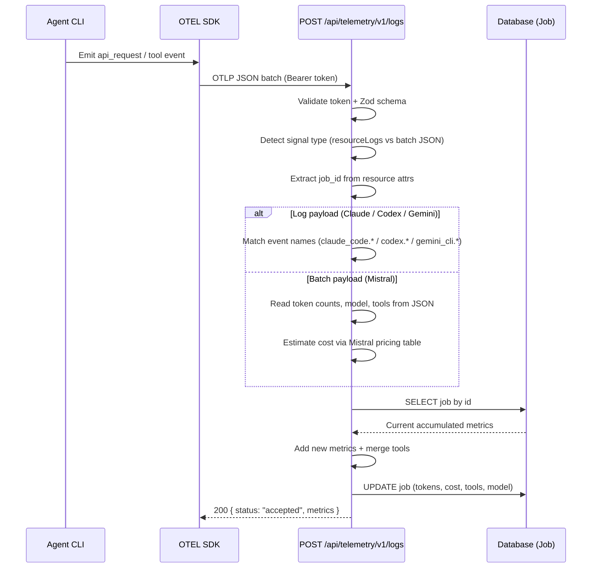
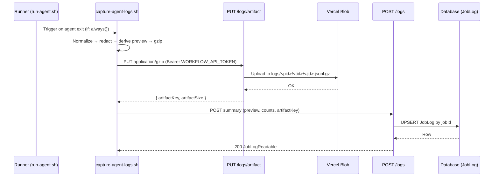

# Job & Telemetry Endpoints

## Job Status Endpoints

### GET /api/projects/:projectId/jobs/status

Fetch active (PENDING/RUNNING) job statuses for a project (polling endpoint).

Only returns jobs with `status` of `PENDING` or `RUNNING`. Terminal jobs (COMPLETED, FAILED, CANCELLED) are excluded to minimize payload size. The frontend detects job completion when a previously-polled job disappears from the response.

**Authentication**: Required (session) or Bearer PAT
**Authorization**: Must be project owner or member

**Auth Guard Behavior**:
- Browser callers can authenticate with a session
- Programmatic callers can authenticate with a PAT
- In explicit test runs, seeded test users can be resolved through the guarded override headers
- In non-test contexts, `x-test-user-id` never bypasses authentication

**Path Parameters**:
- `projectId` (number, required): Project ID

**Response** (200 OK):
```json
{
  "jobs": [
    {
      "id": 123,
      "ticketId": 42,
      "status": "RUNNING",
      "command": "implement",
      "updatedAt": "2025-01-15T10:30:00.000Z"
    }
  ]
}
```

Returns an empty `jobs` array when no active jobs exist.

**Errors**:
- `401`: Not authenticated
- `403`: User is neither project owner nor member
- `404`: Project not found

**Performance**: <100ms p95 (indexed query on projectId + status filter)

### POST /api/projects/:projectId/jobs

Create a new job for a ticket (workflow-only endpoint).

**Authentication**: Bearer token (WORKFLOW_API_TOKEN)
**Authorization**: Workflow token validation (no user session check)

**Path Parameters**:
- `projectId` (number, required): Project ID

**Request Body**:
```json
{
  "ticketId": 42,
  "command": "iterate",
  "branch": "AIB-42-fix-validation"
}
```

**Validation**:
- `ticketId`: Required, positive integer, must belong to projectId
- `command`: Required, string (1-50 chars), e.g., "iterate", "comment-verify"
- `branch`: Optional, string (uses ticket branch if not provided)

**Response** (201 Created):
```json
{
  "id": 125,
  "ticketId": 42,
  "projectId": 3,
  "command": "iterate",
  "status": "PENDING",
  "branch": "AIB-42-fix-validation",
  "startedAt": "2025-01-15T10:40:00.000Z"
}
```

**Errors**:
- `400`: Validation failed or ticket doesn't belong to project
- `401`: Invalid or missing workflow token
- `404`: Ticket not found

**Use Cases**:
- AI-BOARD Assistant creates iterate jobs during VERIFY stage
- Workflow orchestration for multi-stage operations
- Internal job creation by GitHub Actions workflows

### POST /api/jobs/:id/cancel

Cancel a running or pending job, terminating the associated GitHub Actions workflow run.

**Authentication**: Required (session)
**Authorization**: Must be project owner or member (resolved via job → ticket → project)

**Path Parameters**:
- `id` (number, required): Job ID

**Request Body**: None

**Response** (200 OK — cancelled successfully):
```json
{
  "id": 123,
  "status": "CANCELLED",
  "completedAt": "2026-04-03T14:32:15.123Z"
}
```

**Response** (200 OK — job already terminal, no-op):
```json
{
  "id": 123,
  "status": "COMPLETED",
  "completedAt": "2026-04-03T14:30:00.000Z",
  "alreadyTerminal": true
}
```

**Errors**:
- `403`: User is neither project owner nor member
- `404`: Job not found
- `502`: GitHub Actions API call failed (job status unchanged)

**Behavior**:
- PENDING job (no `workflowRunId`): marks job CANCELLED directly without calling GitHub API
- RUNNING job (has `workflowRunId`): calls GitHub Actions cancel API, then marks job CANCELLED
- Already-terminal job: returns 200 with `alreadyTerminal: true` and current status (idempotent)
- GitHub API failure: returns 502, job status is not modified

### PATCH /api/jobs/:id/status

Update job status (workflow-only endpoint).

**Authentication**: Bearer token (WORKFLOW_API_TOKEN)
**Authorization**: Workflow token validation (no project membership check)

**Path Parameters**:
- `id` (number, required): Job ID

**Request Body**:
```json
{
  "status": "RUNNING",
  "workflowRunId": 12345678901,
  "qualityScore": 83,
  "qualityScoreDetails": "{\"dimensions\":{\"bugDetection\":{\"score\":90,\"weight\":0.30},\"compliance\":{\"score\":80,\"weight\":0.40},\"codeComments\":{\"score\":70,\"weight\":0.20},\"historicalContext\":{\"score\":85,\"weight\":0.10},\"specSync\":{\"score\":95,\"weight\":0.00}},\"finalScore\":83}"
}
```

**Validation**:
- `status`: Required, enum (RUNNING|COMPLETED|FAILED|CANCELLED)
- `workflowRunId`: Optional BigInt, positive integer; only accepted when `status = "RUNNING"`; written once (first-write-wins — ignored if `workflowRunId` already populated)
- `qualityScore`: Optional, integer 0-100 inclusive; only accepted when `status = "COMPLETED"` for verify jobs; ignored otherwise
- `qualityScoreDetails`: Optional, JSON string with dimension sub-scores; stored alongside `qualityScore`
- State machine transitions enforced

**Response** (200 OK):
```json
{
  "id": 123,
  "status": "COMPLETED",
  "completedAt": "2025-01-15T10:35:00.000Z"
}
```

**Errors**:
- `400`: Invalid status or invalid state transition
- `401`: Invalid or missing workflow token
- `404`: Job not found
- `409`: Job is already CANCELLED — workflow should abort

**State Machine**:
```
Valid transitions:
- PENDING → RUNNING
- RUNNING → COMPLETED | FAILED | CANCELLED
- Terminal states → same state (idempotent)

Invalid transitions return 400 error
```

**Workflow self-abort on cancel**: When a workflow sends a RUNNING status update for a job that has already been marked CANCELLED (e.g., user cancelled a PENDING job before it started), the endpoint returns 409. Workflows must check the response status and abort if they receive 409.

**Auto-transition hook** (terminal statuses only): After the job row is persisted and the push notification is dispatched, the endpoint invokes a fire-and-log side effect that drives ticket auto-mode:
- Loads `job.command` and the parent ticket's `stage`, `workflowType`, `autoMode`, `projectId`
- Short-circuits on `comment-*` commands (they never drive stage chaining)
- On `FAILED` or `CANCELLED` + `autoMode=true`: sets `Ticket.autoMode=false` and returns
- On `COMPLETED` + `autoMode=true` + `workflowType='FULL'` + stage ∈ {SPECIFY, PLAN}: computes `nextStage` and calls the shared `executeTicketTransition(projectId, ticketId, nextStage)` — the same function used by `POST /tickets/:id/transition`, inheriting its authorization parity, optimistic concurrency, orphaned-job cleanup, and GitHub dispatch
- If the auto-dispatch returns a non-OK result, sets `Ticket.autoMode=false` and logs with the `[AutoMode]` prefix
- Any hook error is caught and logged; it never fails the outer 200 response (the job row is already persisted)

## Telemetry Endpoints

### POST /api/telemetry/v1/logs

Agent telemetry endpoint supporting OTLP HTTP/JSON (Claude Code, Codex, Gemini CLI) and batch JSON (Mistral vibe CLI).

**Authentication**: Bearer token (WORKFLOW_API_TOKEN) via `OTEL_EXPORTER_OTLP_HEADERS`
**Authorization**: Workflow token validation

**Supported Agents**: Claude Code (`claude_code.*` log events), Codex (`codex.*` log events), Gemini CLI (`gemini_cli.*` log events), and batch JSON payloads from Mistral vibe CLI. The endpoint detects the payload format: `resourceLogs` routes to OTLP log processing, a top-level `jobId` routes to batch processing.

**Request Body** (OTLP JSON format — Claude Code example):
```json
{
  "resourceLogs": [{
    "resource": {
      "attributes": [
        { "key": "job_id", "value": { "stringValue": "123" } },
        { "key": "service.name", "value": { "stringValue": "claude-code" } }
      ]
    },
    "scopeLogs": [{
      "logRecords": [{
        "body": { "stringValue": "claude_code.api_request" },
        "attributes": [
          { "key": "input_tokens", "value": { "stringValue": "1000" } },
          { "key": "output_tokens", "value": { "stringValue": "500" } },
          { "key": "cost_usd", "value": { "stringValue": "0.05" } },
          { "key": "model", "value": { "stringValue": "claude-sonnet-4-5-20250929" } }
        ]
      }]
    }]
  }]
}
```

**Request Body** (OTLP JSON format — Codex example):
```json
{
  "resourceLogs": [{
    "resource": {
      "attributes": [
        { "key": "job_id", "value": { "stringValue": "123" } },
        { "key": "service.name", "value": { "stringValue": "codex" } }
      ]
    },
    "scopeLogs": [{
      "logRecords": [{
        "body": { "stringValue": "codex.api_request" },
        "attributes": [
          { "key": "input_tokens", "value": { "stringValue": "800" } },
          { "key": "output_tokens", "value": { "stringValue": "400" } },
          { "key": "cost_usd", "value": { "stringValue": "0.03" } },
          { "key": "model", "value": { "stringValue": "codex-mini-latest" } }
        ]
      }]
    }]
  }]
}
```

**Request Body** (Batch JSON — Mistral example):
```json
{
  "jobId": 456,
  "agent": "MISTRAL",
  "inputTokens": 5000,
  "outputTokens": 2000,
  "cacheReadTokens": 300,
  "model": "devstral-medium-latest",
  "toolsUsed": ["bash", "write_file", "read_file"]
}
```

**Batch fields**:
- `jobId` (number, optional): Job to attribute metrics to. If missing, telemetry is accepted but not stored.
- `inputTokens` (number, optional): Total prompt tokens consumed in session.
- `outputTokens` (number, optional): Total completion tokens generated in session.
- `cacheReadTokens` (number, optional): Total cached input tokens.
- `cacheCreationTokens` (number, optional): Total cache creation tokens.
- `agent` (string, optional): Batch emitter identity. Batch ingestion currently accepts `MISTRAL` only.
- `model` (string, optional): Model used (e.g., `devstral-medium-latest`).
- `toolsUsed` (string[], optional): Unique tool names used during session.
- `costStatus` (string, optional): `ESTIMATED` or `UNAVAILABLE` for providers that cannot always resolve pricing.

Cost is estimated server-side from provider pricing lookups when available. When pricing metadata is unavailable, the batch may preserve usage metrics while reporting `costStatus: "UNAVAILABLE"`.

**Supported Event Names** (log-based — Claude Code, Codex, and Gemini):

| Event Name | Agent | Processing |
|------------|-------|------------|
| `claude_code.api_request` | Claude | Token/cost/duration/model metrics |
| `claude_code.tool_result` | Claude | Tool usage tracking |
| `claude_code.tool_decision` | Claude | Tool usage tracking |
| `codex.api_request` | Codex | Token/cost/duration/model metrics |
| `codex.tool.call` | Codex | Tool usage tracking |
| `codex.sse_event` with `event.kind=response.completed` | Codex | Token/model metrics plus cost estimation |
| `gemini_cli.api_response` | Gemini | Cumulative token/model/duration metrics plus cost estimation when supported |
| `gemini_cli.tool_call` | Gemini | Tool usage tracking |
| `gemini_cli.tool_result` | Gemini | Tool usage tracking |
| `gemini_cli.tool_decision` | Gemini | Tool usage tracking |
| All others | Any | Silently skipped |

**Workflow Configuration** (Claude Code):
```yaml
env:
  CLAUDE_CODE_ENABLE_TELEMETRY: "1"
  OTEL_LOGS_EXPORTER: "otlp"
  OTEL_EXPORTER_OTLP_PROTOCOL: "http/json"
  OTEL_EXPORTER_OTLP_ENDPOINT: ${{ vars.APP_URL }}/api/telemetry
  OTEL_EXPORTER_OTLP_HEADERS: "Authorization=Bearer ${{ secrets.WORKFLOW_API_TOKEN }}"
  OTEL_RESOURCE_ATTRIBUTES: "job_id=${{ inputs.job_id }}"
  # Batch log exports — every 60s instead of defaults (Claude Code: 5s, Codex/Rust: 1s)
  OTEL_LOGS_EXPORT_INTERVAL: "60000"
  OTEL_BLRP_SCHEDULE_DELAY: "60000"
```

**Workflow Configuration** (Codex):
```yaml
env:
  OTEL_LOGS_EXPORTER: "otlp"
  OTEL_EXPORTER_OTLP_PROTOCOL: "http/json"
  OTEL_EXPORTER_OTLP_ENDPOINT: ${{ vars.APP_URL }}/api/telemetry
  OTEL_EXPORTER_OTLP_HEADERS: "Authorization=Bearer ${{ secrets.WORKFLOW_API_TOKEN }}"
  OTEL_RESOURCE_ATTRIBUTES: "job_id=${{ inputs.job_id }}"
  # Batch log exports — Codex Rust SDK reads OTEL_BLRP_SCHEDULE_DELAY (default 1s)
  OTEL_BLRP_SCHEDULE_DELAY: "60000"
```

**Workflow Configuration** (Mistral vibe CLI):
```yaml
env:
  VIBE_TELEMETRY: "false"  # Disable Mistral datalake telemetry
  # Batch telemetry is collected post-execution by collect_mistral_telemetry()
  # in run-agent.sh — no OTEL env vars needed for vibe.
```

**Workflow Configuration** (Gemini CLI):
```yaml
env:
  GEMINI_API_KEY: ${{ secrets.GEMINI_API_KEY }}
  OTEL_LOGS_EXPORTER: "otlp"
  OTEL_EXPORTER_OTLP_PROTOCOL: "http/json"
  OTEL_EXPORTER_OTLP_ENDPOINT: ${{ vars.APP_URL }}/api/telemetry
  OTEL_EXPORTER_OTLP_HEADERS: "Authorization=Bearer ${{ secrets.WORKFLOW_API_TOKEN }}"
  OTEL_RESOURCE_ATTRIBUTES: "job_id=${{ inputs.job_id }}"
  OTEL_BLRP_SCHEDULE_DELAY: "60000"
```

**Processing**:
- Detects payload type: `resourceLogs` → log-based path (Claude/Codex/Gemini); top-level `jobId` → batch path (Mistral-only)
- Extracts `job_id` from resource attributes (OTLP) or top-level `jobId` (batch) for job association
- **Log path**: aggregates metrics from Claude delta events, Codex completion events, and Gemini cumulative `gemini_cli.*` events; collects tool names from tool events
- **Batch path**: reads token counts, model, agent, and tools directly from the JSON payload for Mistral only; Gemini batch payloads are rejected
- Updates corresponding Job record with aggregated metrics
- Missing or null metric attributes default to zero (no errors)

**Context Metrics Computation** (per-turn analysis):
- On each `claude_code.api_request` event: extracts `input_tokens` and updates `peakContextTokens` (via `Math.max`), accumulates into `contextTokensSum` (running sum), and increments `turnCount`
- On each `codex.sse_event` with `response.completed`: uses `totalInputTokens` (before subtracting cached) for the same peak/sum/count tracking
- On `updateJobMetrics()`: merges context metrics across batches — peak via `Math.max` with existing, average recomputed from `(existingAvg × existingTurnCount + newSum) / totalTurnCount`, turn count via addition
- Context fields are only written when `turnCount > 0` in the batch — agents without per-turn events (Gemini, Mistral) leave all three fields null
- Partial data preserved for failed jobs — metrics computed from whatever spans were received before failure

**Response** (200 OK):
```json
{
  "status": "accepted",
  "jobId": 123,
  "metrics": {
    "inputTokens": 15000,
    "outputTokens": 3500,
    "costUsd": 0.125
  }
}
```

**Errors**:
- `400`: Invalid OTLP format, invalid batch payload, or rejected Gemini batch payload
- `401`: Invalid or missing workflow token
- `404`: Job not found (if job_id provided)

**Notes**:
- Telemetry is sent automatically by the agent CLI during execution
- Multiple batches may be received for a single job (metrics are aggregated across all batches)
- If no job_id in attributes, telemetry is accepted but not stored
- Agent type (Claude vs Codex vs Mistral) is not stored on the telemetry payload — it is determined via the Job's parent Ticket `agent` field
- Mixed-agent event names in a single payload are supported; all recognized events accumulate to the same Job
- Payloads without a `job_id` resource attribute are accepted but not stored (logged as unassociated for debugging)



## Job Log Endpoints

Job logs capture the agent's normalized execution transcript for a terminated job. Writes are performed by the GitHub Actions runner (workflow token auth); reads are session-authenticated and gated by `verifyTicketAccess`. The full transcript lives in Vercel Blob; only the inline preview and metadata live in Postgres (`JobLog` model).

### POST /api/jobs/:id/logs

Upsert the log summary for a terminated job.

**Authentication**: Bearer token (WORKFLOW_API_TOKEN)
**Authorization**: Workflow token validation

**Path Parameters**:
- `id` (number, required): Job ID

**Request Body**:
```json
{
  "captureStatus": "CAPTURED",
  "preview": "Build failed: Prisma migration 20260422 not applied to target DB",
  "schemaVersion": 1,
  "eventCount": 127,
  "errorCount": 3,
  "artifactKey": "logs/7/41/4321.jsonl.gz",
  "artifactSize": 48210
}
```

**Validation**:
- `captureStatus`: Required, enum (`CAPTURED` | `UNAVAILABLE`); `PRUNED` is server-only
- `preview`: Required, 1-280 chars; re-run through server-side redactor before persistence
- `schemaVersion`: Required, currently `1`
- `eventCount`: Required, integer ≥ 0
- `errorCount`: Required, integer ≥ 0 and ≤ `eventCount`
- `artifactKey`: Required iff `captureStatus === CAPTURED`; forbidden otherwise
- `artifactSize`: Required iff `captureStatus === CAPTURED`; forbidden otherwise

**Response** (200 OK — idempotent upsert):
```json
{
  "captureStatus": "CAPTURED",
  "preview": "Build failed: Prisma migration 20260422 not applied to target DB",
  "schemaVersion": 1,
  "eventCount": 127,
  "errorCount": 3,
  "artifactSize": 48210,
  "capturedAt": "2026-04-22T21:44:10.000Z",
  "rawUrl": "/api/projects/7/tickets/41/jobs/4321/logs/raw"
}
```

**Errors**:
- `400`: Validation failed (Zod)
- `401`: Invalid or missing workflow token
- `404`: Job not found
- `422`: Job is still PENDING or RUNNING

**Behavior**:
- Upsert keyed on `jobId` — a second submission replaces the first (bounded-retry safety)
- `Cache-Control: no-store`
- Telemetry submission via OTLP remains independent; a capture failure never prevents `PATCH /api/jobs/:id/status` from landing

### PUT /api/jobs/:id/logs/artifact

Stream the gzipped JSONL transcript to Vercel Blob via the authenticated proxy.

**Authentication**: Bearer token (WORKFLOW_API_TOKEN)
**Authorization**: Workflow token validation

**Path Parameters**:
- `id` (number, required): Job ID

**Request**:
- `Content-Type: application/gzip` (any other value → 415)
- Body: raw gzipped JSONL stream, max 25 MB (413 on overflow)

**Server behavior**:
- Derives `artifactKey = logs/<projectId>/<ticketId>/<jobId>.jsonl.gz` deterministically
- Uploads through `app/lib/blob/client.ts` — the runner never holds the Blob token

**Response** (201 Created):
```json
{
  "artifactKey": "logs/7/41/4321.jsonl.gz",
  "artifactSize": 48210
}
```

**Errors**:
- `401`: Invalid or missing workflow token
- `413`: Artifact exceeds 25 MB gzipped
- `415`: Content-Type is not `application/gzip`
- `502`: Upstream Blob write failure (`code: BLOB_UPLOAD_FAILED`)

### DELETE /api/jobs/:id/logs/artifact

Delete an orphaned Blob artifact for a job (called by the capture script when the `POST /api/jobs/:id/logs` summary fails permanently, leaving the artifact without a `JobLog` row to reference it).

**Authentication**: Bearer token (WORKFLOW_API_TOKEN)
**Authorization**: Workflow token validation

**Path Parameters**:
- `id` (number, required): Job ID

**Response** (200 OK):
```json
{ "deleted": true }
```
`deleted` is `false` when no matching Blob object exists.

**Errors**:
- `401`: Invalid or missing workflow token
- `404`: Job not found
- `502`: Upstream Blob delete failure (`code: BLOB_DELETE_FAILED`)

### GET /api/projects/:projectId/tickets/:ticketId/jobs/:jobId/logs

Fetch the log summary for rendering the inline preview and deciding whether the full viewer should be enabled.

**Authentication**: Required (session)
**Authorization**: `verifyTicketAccess` — owner OR project member

**Path Parameters**:
- `projectId` (number, required)
- `ticketId` (number, required)
- `jobId` (number, required)

**Response** (200 OK):
```json
{
  "captureStatus": "CAPTURED",
  "preview": "Build failed: Prisma migration 20260422 not applied to target DB",
  "schemaVersion": 1,
  "eventCount": 127,
  "errorCount": 3,
  "artifactSize": 48210,
  "capturedAt": "2026-04-22T21:44:10.000Z",
  "rawUrl": "/api/projects/7/tickets/41/jobs/4321/logs/raw"
}
```

`rawUrl` is `null` when `captureStatus !== CAPTURED`; clients render a disabled "View full logs" affordance in that case.

**Errors**:
- `401`: Not authenticated
- `403`: User is neither project owner nor member
- `404`: Job or its log record does not exist

**Headers**:
- `Cache-Control: no-store`

### GET /api/projects/:projectId/tickets/:ticketId/jobs/:jobId/logs/raw

Stream the raw normalized transcript artifact. Session-authenticated; Blob pathnames never leak to the client.

**Authentication**: Required (session)
**Authorization**: `verifyTicketAccess`

**Query Parameters**:
- `format=jsonl` (optional): When set, server adds `Content-Disposition: attachment; filename="<ticketKey>-<jobId>.jsonl.gz"` for the "Download raw" button

**Response** (200 OK):
- `Content-Type: application/gzip`
- `Content-Encoding: gzip` (preserved so browsers decompress transparently for in-app rendering)
- Body: the gzipped JSONL stream read from Vercel Blob

**Errors**:
- `401`: Not authenticated
- `403`: Not owner/member
- `404`: No captured artifact (status is `UNAVAILABLE` or `PRUNED`)
- `502`: Blob backend unreachable — client keeps the inline preview visible and surfaces a readable error

### POST /api/maintenance/prune-logs

Retention prune of `JobLog` rows and their Blob artifacts. Invoked daily by `.github/workflows/nightly-log-prune.yml`.

**Authentication**: Bearer token (WORKFLOW_API_TOKEN)
**Authorization**: Workflow token validation

**Behavior**:
- Scans `JobLog` where `createdAt < now() - LOG_RETENTION_DAYS` (default 30) and `captureStatus != 'PRUNED'`
- Batched at 500 rows per iteration, capped at 50 000 rows per cycle to stay inside serverless time budgets
- Per row: delete Blob object first (404 treated as success), then delete Postgres row; transient Blob failures skip the row and increment `skippedCount`
- Idempotent — a re-run over the same window finds no matches once the prior cycle completed

**Response** (200 OK):
```json
{
  "prunedCount": 128,
  "skippedCount": 2,
  "durationMs": 1843
}
```

**Errors**:
- `401`: Invalid or missing workflow token
- `500`: Internal error

### Extended: GET /api/projects/:projectId/tickets/:ticketId/jobs

The ticket jobs listing includes a `log` object and context metrics on each row so the timeline can render the preview and context-health indicator without additional fetches:

```json
{
  "jobs": [
    {
      "id": 4321,
      "status": "FAILED",
      "command": "implement",
      "peakContextTokens": 82000,
      "avgContextTokens": 41000,
      "turnCount": 12,
      "log": {
        "captureStatus": "CAPTURED",
        "preview": "Build failed: Prisma migration 20260422 not applied to target DB"
      }
    }
  ]
}
```

`log` is `null` when no log record exists yet (e.g., a still-RUNNING job or capture in flight). `peakContextTokens`, `avgContextTokens`, and `turnCount` are `null` for jobs from agents without per-turn telemetry or historical pre-feature jobs.



