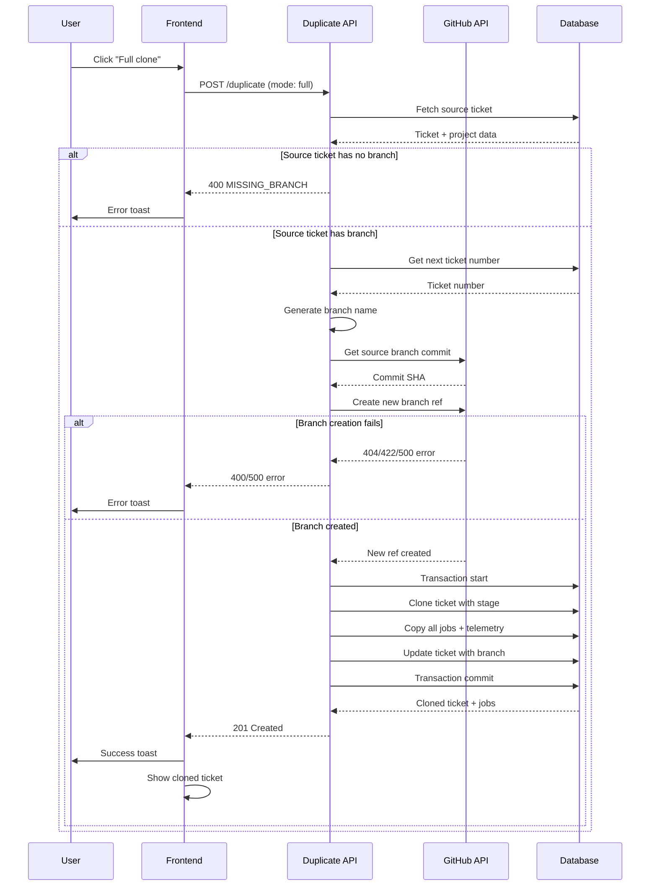
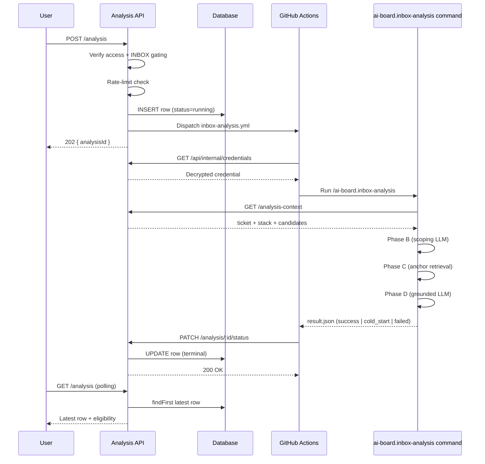

# Ticket Endpoints

## Ticket Endpoints

### GET /api/projects/:projectId/tickets

Fetch tickets for a project, grouped by stage. SHIP stage is paginated (default 50 tickets). When `stage` or `workflowType` query params are provided, returns a flat filtered array instead.

**Authentication**: Required (session or workflow Bearer token)
**Authorization**: Must be project owner or member (workflow token bypasses)

**Path Parameters**:
- `projectId` (number, required): Project ID

**Query Parameters**:
- `stage` (string, optional): Filter by stage — `INBOX|SPECIFY|PLAN|BUILD|VERIFY|SHIP|CLOSED`
- `workflowType` (string, optional): Filter by workflow type — `FULL|QUICK|CLEAN`
- `limit` (number, optional): Maximum number of tickets to return (min: 1). Only applies when at least one filter is provided. Results are sorted by `updatedAt` desc.
- `offset` (number, optional): Skip N tickets (min: 0). Used for SHIP "Load More" pagination. When `stage=SHIP` and `offset` is provided, returns the next page of SHIP tickets.
- `updatedSince` (string, optional): ISO 8601 datetime. Only return tickets updated after this timestamp.

**Response — no filters** (200 OK): Stage-grouped object with SHIP pagination metadata

All non-SHIP stages return all tickets. SHIP stage returns only the first 50 tickets (sorted by `updatedAt` desc). `_shipTotal` indicates the total number of SHIP tickets for "Load More" pagination.

```json
{
  "INBOX": [...],
  "SPECIFY": [...],
  "PLAN": [...],
  "BUILD": [...],
  "VERIFY": [...],
  "SHIP": [
    {
      "id": 42,
      "ticketNumber": 5,
      "ticketKey": "ABC-5",
      "title": "Add login feature",
      "description": "Implement user authentication",
      "stage": "SHIP",
      "projectId": 1,
      "branch": "042-add-login-feature",
      "workflowType": "FULL",
      "clarificationPolicy": null,
      "attachments": [],
      "version": 3,
      "closedAt": null,
      "createdAt": "2025-01-10T14:00:00.000Z",
      "updatedAt": "2025-01-15T10:30:00.000Z"
    }
  ],
  "_shipTotal": 248
}
```

**Response — SHIP Load More** (`?stage=SHIP&offset=50&limit=50`) (200 OK):
```json
{
  "tickets": [
    {
      "id": 38,
      "ticketKey": "ABC-3",
      "title": "Older shipped ticket",
      "stage": "SHIP",
      ...
    }
  ]
}
```

**Response — with other filters** (200 OK): Flat array of matching tickets
```json
[
  {
    "id": 42,
    "ticketKey": "ABC-5",
    "title": "Add login feature",
    "stage": "SHIP",
    "workflowType": "FULL",
    ...
  }
]
```

**Sorting Behavior**:
- **INBOX**: Tickets sorted by `ticketNumber` ascending (oldest first, newest last)
- **All Other Stages**: Tickets sorted by `updatedAt` descending (most recently updated first)
- Sorting applied per-stage after grouping

**Filtering**:
- By default, excludes CLOSED tickets (they don't appear on board)
- CLOSED tickets only accessible via search or direct URL

**Errors**:
- `401`: Not authenticated
- `403`: User is neither project owner nor member
- `404`: Project not found

### POST /api/projects/:projectId/tickets

Create a new ticket.

**Authentication**: Required (session)
**Authorization**: Must be project owner or member

**Path Parameters**:
- `projectId` (number, required): Project ID

**Request Body**:
```json
{
  "title": "Fix login bug",
  "description": "Login button doesn't work on mobile devices"
}
```

**Validation**:
- `title`: Required, 1-100 characters, alphanumeric + basic punctuation
- `description`: Required, 1-10000 characters, all UTF-8 characters allowed

**Response** (201 Created):
```json
{
  "id": 43,
  "ticketNumber": 6,
  "ticketKey": "ABC-6",
  "title": "Fix login bug",
  "description": "Login button doesn't work on mobile devices",
  "stage": "INBOX",
  "projectId": 1,
  "branch": null,
  "workflowType": "FULL",
  "clarificationPolicy": null,
  "attachments": [],
  "version": 1,
  "createdAt": "2025-01-20T09:00:00.000Z",
  "updatedAt": "2025-01-20T09:00:00.000Z"
}
```

**Errors**:
- `400`: Invalid request body (Zod validation errors)
- `401`: Not authenticated
- `403`: User is neither project owner nor member
- `404`: Project not found
- `500`: Database error

### GET /browse/:key

Fetch ticket by human-readable key (primary user-facing endpoint).

**Authentication**: Required (session)
**Authorization**: Must be project owner or member (resolved via ticket key)

**Path Parameters**:
- `key` (string, required): Ticket key in format "{PROJECT_KEY}-{TICKET_NUMBER}" (e.g., "ABC-123")

**Response** (200 OK):
```json
{
  "id": 42,
  "ticketNumber": 5,
  "ticketKey": "ABC-5",
  "title": "Add login feature",
  "description": "Implement user authentication",
  "stage": "SPECIFY",
  "projectId": 1,
  "branch": "042-add-login-feature",
  "workflowType": "FULL",
  "clarificationPolicy": null,
  "attachments": [],
  "version": 3,
  "project": {
    "id": 1,
    "name": "AI Board Development",
    "key": "ABC",
    "clarificationPolicy": "AUTO"
  },
  "createdAt": "2025-01-10T14:00:00.000Z",
  "updatedAt": "2025-01-15T10:30:00.000Z"
}
```

**Errors**:
- `401`: Not authenticated
- `403`: User is neither project owner nor member
- `404`: Ticket not found

**Notes**:
- This is the primary user-facing endpoint for ticket access
- URLs like `/browse/ABC-123` are shareable and stable
- Used for bookmarks, external links, and ticket references

### GET /api/projects/:projectId/tickets/:id

Fetch single ticket with nested project data.

**Authentication**: Required (session)
**Authorization**: Must be project owner or member

**Path Parameters**:
- `projectId` (number, required): Project ID
- `id` (number or string, required): Ticket ID (numeric) or Ticket Key (e.g., "ABC-123")

**Note**: This endpoint supports both internal numeric IDs (for backward compatibility) and human-readable ticket keys. The ticket key lookup enables fetching tickets not present in the kanban board (e.g., closed tickets accessed via search or direct URL). New code should use `/browse/:key` for user-facing navigation.

**Response** (200 OK):
```json
{
  "id": 42,
  "ticketNumber": 5,
  "ticketKey": "ABC-5",
  "title": "Add login feature",
  "description": "Implement user authentication",
  "stage": "SPECIFY",
  "projectId": 1,
  "branch": "042-add-login-feature",
  "workflowType": "FULL",
  "clarificationPolicy": null,
  "attachments": [
    {
      "type": "uploaded",
      "url": "https://res.cloudinary.com/.../screenshot.png",
      "filename": "screenshot.png",
      "mimeType": "image/png",
      "sizeBytes": 204800,
      "uploadedAt": "2025-01-15T10:00:00.000Z",
      "cloudinaryPublicId": "ai-board/tickets/42/screenshot"
    }
  ],
  "version": 3,
  "project": {
    "id": 1,
    "name": "AI Board Development",
    "key": "ABC",
    "clarificationPolicy": "AUTO"
  },
  "createdAt": "2025-01-10T14:00:00.000Z",
  "updatedAt": "2025-01-15T10:30:00.000Z"
}
```

**Errors**:
- `401`: Not authenticated
- `403`: User is neither project owner nor member
- `404`: Ticket or project not found

### PATCH /api/projects/:projectId/tickets/:id

Update ticket fields with optimistic concurrency control.

**Authentication**: Required (session)
**Authorization**: Must be project owner or member

**Path Parameters**:
- `projectId` (number, required): Project ID
- `id` (number, required): Ticket ID

**Request Body**:
```json
{
  "title": "Updated title",
  "description": "Updated description",
  "clarificationPolicy": "CONSERVATIVE",
  "version": 3
}
```

**Validation**:
- `title`: Optional, 1-100 characters, alphanumeric + basic punctuation
- `description`: Optional, 1-10000 characters (editable only in INBOX stage)
- `clarificationPolicy`: Optional, enum or null (editable only in INBOX stage)
- `version`: Required for concurrency control

**Response** (200 OK):
```json
{
  "id": 42,
  "ticketNumber": 5,
  "ticketKey": "ABC-5",
  "title": "Updated title",
  "description": "Updated description",
  "clarificationPolicy": "CONSERVATIVE",
  "version": 4,
  ...
}
```

**Errors**:
- `400`: Invalid request body, validation failure, or stage restriction violation
- `401`: Not authenticated
- `403`: User is neither project owner nor member
- `404`: Ticket or project not found
- `409`: Version conflict (concurrent update detected)

### POST /api/projects/:projectId/tickets/bulk/delete

Hard-delete 1–50 INBOX tickets in a single transaction.

**Authentication**: Required (session) OR Bearer PAT
**Authorization**: `verifyProjectAccess` — owner or member

**Path Parameters**:
- `projectId` (number, required): Project ID

**Request Body**:
```json
{
  "ticketIds": [42, 43, 44],
  "expectedVersions": { "42": 3, "43": 1, "44": 2 }
}
```

**Validation** (Zod `bulkDeleteSchema`):
- `ticketIds`: 1..50 unique positive integers
- `expectedVersions`: object keyed by stringified ticket id; must contain an entry for every id in `ticketIds`

**Response** (200 OK):
```json
{
  "success": true,
  "deleted": {
    "count": 3,
    "ticketKeys": ["ABC-42", "ABC-43", "ABC-44"]
  },
  "notifiedCreatorIds": ["usr_xyz"]
}
```

**Errors**:

| Status | `code` | When |
|---|---|---|
| 400 | `BULK_LIMIT_EXCEEDED` | More than 50 `ticketIds` submitted |
| 400 | `VALIDATION_ERROR` | Zod failure (duplicates, missing expectedVersions key) |
| 401 | `AUTH_ERROR` | Unauthenticated |
| 403 | `FORBIDDEN_PROJECT` | Actor lacks project access |
| 403 | `FORBIDDEN_CROSS_PROJECT` | One or more `ticketIds` resolved to a different project |
| 409 | `BULK_CONFLICT_STAGE_DRIFT` | `details: { conflictingIds: number[] }` — id missing or not INBOX |
| 409 | `BULK_CONFLICT_VERSION` | `details: { conflictingIds: number[], currentVersions: Record<number, number> }` |
| 500 | `DATABASE_ERROR` | Transaction failure (rolled back) |

**Behavior**:
- Single `prisma.$transaction` reloads tickets `WHERE id IN (...) AND projectId = ? AND stage = 'INBOX'`, validates count + versions, then hard-deletes
- Skips GitHub cleanup — INBOX tickets never have a `branch`
- Cascades: `Comment`, `Job`, `TicketAnalysis`, `TicketOutcome` are cascade-deleted; `Notification.ticketId` switches to NULL (preserving `ticketKeySnapshot` for the recipient's feed)
- Emits a `TICKET_DELETED` notification (with `ticketKeySnapshot`) to each non-actor creator inside the same transaction

### POST /api/projects/:projectId/tickets/bulk/merge

Squash 2–50 INBOX tickets into a single surviving base ticket.

**Authentication**: Required (session) OR Bearer PAT
**Authorization**: `verifyProjectAccess` — owner or member

**Path Parameters**:
- `projectId` (number, required): Project ID

**Request Body**:
```json
{
  "baseTicketId": 42,
  "sourceTicketIds": [43, 44],
  "title": "Add export-to-CSV button",
  "description": "Combined description body...",
  "expectedVersions": { "42": 3, "43": 1, "44": 2 }
}
```

**Validation** (Zod `bulkMergeSchema`):
- `baseTicketId`: positive integer; MUST be smaller than every id in `sourceTicketIds` (FR-016) and MUST NOT appear in `sourceTicketIds`
- `sourceTicketIds`: 1..49 unique positive integers
- `title`: shared `titleSchema` (1..100 chars, project punctuation rules)
- `description`: shared `descriptionSchema` (1..10000 chars)
- `expectedVersions`: object with an entry for the base id AND every source id

**Response** (200 OK):
```json
{
  "success": true,
  "base": {
    "id": 42,
    "ticketKey": "ABC-42",
    "title": "Add export-to-CSV button",
    "description": "Combined description body...",
    "version": 4,
    "attachmentCount": 5,
    "updatedAt": "2026-05-22T10:30:00.000Z"
  },
  "deleted": {
    "count": 2,
    "ticketKeys": ["ABC-43", "ABC-44"]
  },
  "notifiedCreatorIds": ["usr_xyz"]
}
```

**Errors**:

| Status | `code` | When |
|---|---|---|
| 400 | `BULK_LIMIT_EXCEEDED` | More than 49 `sourceTicketIds` submitted (cap is 50 total including base) |
| 400 | `VALIDATION_ERROR` | Zod failure (base-not-smallest, duplicates, missing expectedVersions key) |
| 400 | `BULK_MERGE_REQUIRES_TWO` | Reached only if Zod bypass — `sourceTicketIds` empty |
| 401 | `AUTH_ERROR` | Unauthenticated |
| 403 | `FORBIDDEN_PROJECT` | Actor lacks project access |
| 403 | `FORBIDDEN_CROSS_PROJECT` | Base or any source not in this project |
| 409 | `BULK_CONFLICT_STAGE_DRIFT` | Base or any source missing or not INBOX (`details.conflictingIds`) |
| 409 | `BULK_CONFLICT_VERSION` | Version mismatch on base or any source |
| 500 | `DATABASE_ERROR` | Unexpected DB failure |

**Behavior**:
- Single transaction: validates preconditions, increments `version` on the base, overwrites the base's `title` and `description`, concatenates attachments as `[...base.attachments, ...sortedSources.flatMap(s => s.attachments)]` (no deduplication), creates `TICKET_MERGED` notifications for the non-actor base creator and every non-actor source creator with `mergedIntoTicketId` pointing at the base, then hard-deletes every source ticket
- Notifications are inserted BEFORE source deletes; the `Notification.ticketId → SetNull` FK preserves the row after the source ticket is removed, so the recipient still sees `ticketKeySnapshot` for the deleted ticket plus a working link to the surviving base
- Preserved on the base: `id`, `ticketKey`, `ticketNumber`, `agent`, all five model overrides, `autoMode`, `clarificationPolicy`, `workflowType`, `stage`, `branch`, `previewUrl`, `creatorId`

### POST /api/projects/:projectId/tickets/bulk/agent

Update only the `agent` field on 1–50 INBOX tickets in one atomic write.

**Authentication**: Required (session) OR Bearer PAT
**Authorization**: `verifyProjectAccess` — owner or member

**Request Body**:
```json
{
  "ticketIds": [42, 43, 44],
  "agent": "CODEX"
}
```

**Validation** (Zod `bulkAgentSchema`):
- `ticketIds`: 1..50 unique positive integers
- `agent`: one of `Agent` enum values (`CLAUDE | CODEX | MISTRAL | GEMINI`) or `null` to clear

**Response** (200 OK):
```json
{
  "success": true,
  "updated": {
    "count": 3,
    "ticketIds": [42, 43, 44],
    "agent": "CODEX"
  }
}
```

**Errors**:

| Status | `code` | When |
|---|---|---|
| 400 | `BULK_LIMIT_EXCEEDED` | More than 50 `ticketIds` submitted |
| 400 | `VALIDATION_ERROR` | Zod failure (invalid agent enum, duplicates) |
| 401 | `AUTH_ERROR` | Unauthenticated |
| 403 | `FORBIDDEN_PROJECT` | Actor lacks project access |
| 403 | `FORBIDDEN_CROSS_PROJECT` | Id resolves to a different project |
| 409 | `BULK_CONFLICT_STAGE_DRIFT` | `details.conflictingIds` |
| 500 | `DATABASE_ERROR` | Unexpected DB failure |

**Behavior**:
- Single transaction: reloads tickets `WHERE id IN (...) AND projectId = ? AND stage = 'INBOX'`, validates count, then `updateMany` to set `agent` and bump `version`
- No notifications emitted; no other fields modified
- No `expectedVersions` requirement — the INBOX stage filter is sufficient guard

### POST /api/projects/:projectId/tickets/bulk/model

Write a single Claude model value to all five per-stage overrides on 1–50 INBOX tickets.

**Authentication**: Required (session) OR Bearer PAT
**Authorization**: `verifyProjectAccess` — owner or member

**Request Body**:
```json
{
  "ticketIds": [42, 43, 44],
  "model": "claude-sonnet-4-6"
}
```

**Validation** (Zod `bulkModelSchema`):
- `ticketIds`: 1..50 unique positive integers
- `model`: 1..50-char string (matches `Ticket.specifyModel @db.VarChar(50)`) or `null` to clear all five fields

**Response** (200 OK):
```json
{
  "success": true,
  "updated": {
    "count": 3,
    "ticketIds": [42, 43, 44],
    "model": "claude-sonnet-4-6",
    "appliedFields": ["specifyModel", "planModel", "implementModel", "quickImplModel", "verifyModel"]
  }
}
```

**Errors**: Same shape as bulk agent. Specific to model: `400 VALIDATION_ERROR` on length > 50.

**Behavior**:
- Writes the single `model` value to all five per-command override fields (`specifyModel`, `planModel`, `implementModel`, `quickImplModel`, `verifyModel`) on every targeted ticket; `appliedFields` echoes the list for client logging and tests
- No notifications emitted; no other fields modified

### POST /api/projects/:projectId/tickets/:id/duplicate

Create a duplicate of an existing ticket using simple copy or full clone mode.

**Full Clone Workflow Sequence**:



**Authentication**: Required (session)
**Authorization**: Must be project owner or member

**Path Parameters**:
- `projectId` (number, required): Project ID
- `id` (number, required): Source ticket ID to duplicate

**Request Body**:
```json
{
  "mode": "simple" | "full"
}
```

**Validation**:
- `mode` (optional): Duplication mode (default: "simple")
  - "simple": Create copy in INBOX with no jobs or branch
  - "full": Preserve stage, copy all jobs with telemetry, create new branch

**Response - Simple Copy** (201 Created):
```json
{
  "id": 107,
  "ticketNumber": 107,
  "ticketKey": "AIB-107",
  "title": "Copy of Add login button",
  "description": "User story: As a user, I want to log in...",
  "stage": "INBOX",
  "version": 1,
  "projectId": 3,
  "branch": null,
  "previewUrl": null,
  "autoMode": false,
  "workflowType": "FULL",
  "attachments": [
    {
      "type": "uploaded",
      "url": "https://res.cloudinary.com/xxx/image/upload/v1/ai-board/tickets/42/mockup.png",
      "filename": "mockup.png",
      "mimeType": "image/png",
      "sizeBytes": 245760,
      "uploadedAt": "2025-01-15T10:30:00.000Z",
      "cloudinaryPublicId": "ai-board/tickets/42/mockup"
    }
  ],
  "clarificationPolicy": "PRAGMATIC",
  "createdAt": "2025-01-20T14:22:00.000Z",
  "updatedAt": "2025-01-20T14:22:00.000Z"
}
```

**Response - Full Clone** (201 Created):
```json
{
  "id": 219,
  "ticketNumber": 219,
  "ticketKey": "AIB-219",
  "title": "Clone of Add login button",
  "description": "User story: As a user, I want to log in...",
  "stage": "PLAN",
  "version": 1,
  "projectId": 3,
  "branch": "219-add-login-button",
  "previewUrl": null,
  "autoMode": false,
  "workflowType": "FULL",
  "attachments": [
    {
      "type": "uploaded",
      "url": "https://res.cloudinary.com/xxx/image/upload/v1/ai-board/tickets/42/mockup.png",
      "filename": "mockup.png",
      "mimeType": "image/png",
      "sizeBytes": 245760,
      "uploadedAt": "2025-01-15T10:30:00.000Z",
      "cloudinaryPublicId": "ai-board/tickets/42/mockup"
    }
  ],
  "clarificationPolicy": "PRAGMATIC",
  "createdAt": "2025-01-20T14:22:00.000Z",
  "updatedAt": "2025-01-20T14:22:00.000Z",
  "jobs": [
    {
      "id": 456,
      "command": "specify",
      "status": "COMPLETED",
      "branch": "219-add-login-button",
      "commitSha": "abc123...",
      "startedAt": "2025-01-20T14:00:00.000Z",
      "completedAt": "2025-01-20T14:05:00.000Z",
      "inputTokens": 5000,
      "outputTokens": 1500,
      "cacheReadTokens": 2000,
      "cacheCreationTokens": 500,
      "costUsd": 0.025,
      "durationMs": 300000,
      "model": "claude-sonnet-4-5-20250929",
      "toolsUsed": ["Read", "Edit", "Write"]
    },
    {
      "id": 457,
      "command": "plan",
      "status": "COMPLETED",
      "branch": "219-add-login-button",
      "commitSha": "def456...",
      "startedAt": "2025-01-20T14:10:00.000Z",
      "completedAt": "2025-01-20T14:18:00.000Z",
      "inputTokens": 8000,
      "outputTokens": 2500,
      "cacheReadTokens": 3000,
      "cacheCreationTokens": 1000,
      "costUsd": 0.045,
      "durationMs": 480000,
      "model": "claude-sonnet-4-5-20250929",
      "toolsUsed": ["Read", "Glob", "Write"]
    }
  ]
}
```

**Simple Copy Behavior** (mode: "simple"):
- **New Ticket Created**: Always in INBOX stage with new ticket number and key
- **Title**: Prefixed with "Copy of " (truncated to 100 chars if needed)
- **Description**: Exact copy from source ticket
- **Clarification Policy**: Copied from source (or null if source uses project default)
- **Attachments**: All image attachments copied by reference (same URLs)
  - Uploaded images (Cloudinary) safely reference same URL
  - External URLs copied as-is
  - No image re-uploading or duplication
- **Branch**: Always null (new tickets have no branch)
- **Preview URL**: Always null (new tickets have no preview)
- **Workflow Type**: Always FULL (standard workflow path)
- **Version**: Always 1 (new ticket version)
- **Jobs**: None (clean slate)

**Full Clone Behavior** (mode: "full"):
- **New Ticket Created**: In same stage as source ticket with new ticket number and key
- **Title**: Prefixed with "Clone of " (truncated to 100 chars if needed)
- **Description**: Exact copy from source ticket
- **Stage**: Preserved from source ticket (SPECIFY, PLAN, BUILD, or VERIFY)
- **Clarification Policy**: Copied from source
- **Attachments**: Copied by reference (same as simple copy)
- **Branch**: New Git branch created from source branch
  - Format: `{TICKET_NUMBER}-{slug}` (e.g., "219-add-login-button")
  - Slug: First 3 words of title, lowercase, hyphenated
  - Points to same commit as source branch
- **Jobs**: All jobs copied with complete telemetry data:
  - Command, status, branch, commit SHA
  - Timestamps (startedAt, completedAt)
  - Token metrics (input, output, cache read, cache creation)
  - Cost and performance (costUsd, durationMs)
  - Model identifier and tools used
  - Jobs reference new ticket ID
- **Workflow Type**: Copied from source
- **Version**: Always 1 (new ticket version)

**Branch Creation**:
- Creates new Git branch via GitHub API
- Uses `git.createRef()` to create `refs/heads/{newBranchName}`
- New branch points to same commit SHA as source branch
- Preserves complete Git history for comparison

**Title Truncation**:
- If "Copy of [original title]" or "Clone of [original title]" exceeds 100 characters:
  - Original title is truncated first
  - Prefix ("Copy of " or "Clone of ") is preserved
  - Final title stays within 100 character limit

**Full Clone Eligibility**:
- Source ticket must have a branch (tickets in SPECIFY, PLAN, BUILD, VERIFY stages)
- Source branch must exist on GitHub
- Returns 400 error if ticket has no branch

**Errors**:
- `400`: Invalid mode parameter, projectId, ticketId format, or full clone precondition failure
  - Invalid mode: `{ "error": "Invalid mode parameter. Must be 'simple' or 'full'", "code": "VALIDATION_ERROR" }`
  - Missing branch: `{ "error": "Source ticket has no branch. Full clone requires a branch.", "code": "MISSING_BRANCH" }`
  - Branch not found: `{ "error": "Source branch '{branch}' not found on GitHub", "code": "BRANCH_NOT_FOUND" }`
- `401`: Not authenticated
- `403`: User is neither project owner nor member
- `404`: Project or source ticket not found
- `500`: Database error, GitHub API error, or branch creation failure
  - Branch exists: `{ "error": "Branch '{newBranchName}' already exists", "code": "BRANCH_CREATION_FAILED" }`
  - GitHub error: `{ "error": "Failed to create branch on GitHub", "code": "BRANCH_CREATION_FAILED" }`

**Performance**:
- Simple copy: <3 seconds from API call to new ticket visible in UI
- Full clone: <5 seconds (includes GitHub API branch creation + database transaction)

### GET /api/projects/:projectId/tickets/:id/branch

Fetch ticket branch name.

**Authentication**: None (unauthenticated endpoint)

**Path Parameters**:
- `projectId` (number, required): Project ID
- `id` (number or string, required): Ticket ID or Ticket Key

**Response** (200 OK):
```json
{
  "id": 42,
  "branch": "042-add-login-feature",
  "updatedAt": "2025-01-15T10:35:00.000Z"
}
```

**Errors**:
- `400`: Invalid project ID or ticket ID
- `404`: Project or ticket not found

### PATCH /api/projects/:projectId/tickets/:id/branch

Update ticket branch name (workflow-only endpoint).

**Authentication**: Bearer token (WORKFLOW_API_TOKEN)
**Authorization**: Workflow token validation (no project membership check)

**Path Parameters**:
- `projectId` (number, required): Project ID
- `id` (number, required): Ticket ID

**Request Body**:
```json
{
  "branch": "042-add-login-feature"
}
```

**Validation**:
- `branch`: Required, max 200 characters or null

**Response** (200 OK):
```json
{
  "id": 42,
  "branch": "042-add-login-feature",
  "updatedAt": "2025-01-15T10:35:00.000Z"
}
```

**Errors**:
- `400`: Invalid branch name (exceeds 200 characters)
- `401`: Invalid or missing workflow token
- `404`: Ticket or project not found

**Note**: This endpoint does NOT use optimistic concurrency control (no version checking).

### POST /api/projects/:projectId/tickets/:id/deploy

Trigger manual Vercel preview deployment (user-initiated).

**Authentication**: Required (session)
**Authorization**: Must be project owner or member

**Path Parameters**:
- `projectId` (number, required): Project ID
- `id` (number, required): Ticket ID

**Request Body**: Empty

**Response** (201 Created):
```json
{
  "success": true,
  "jobId": 125,
  "message": "Deploy preview workflow dispatched"
}
```

**Eligibility Requirements**:
- Ticket must be in VERIFY stage
- Ticket must have a branch
- Latest job must have COMPLETED status

**Workflow Behavior**:
- Creates new Job record with command="deploy-preview", status=PENDING
- Clears any existing preview URL in project (single-preview enforcement)
- Dispatches GitHub Actions workflow (deploy-preview.yml)
- Workflow deploys branch to Vercel and updates ticket with preview URL

**Errors**:
- `400`: Ticket not eligible for deployment (wrong stage, no branch, job not completed)
- `401`: Not authenticated
- `403`: User is neither project owner nor member
- `404`: Ticket or project not found
- `500`: Workflow dispatch error

### PATCH /api/projects/:projectId/tickets/:id/preview-url

Update ticket preview URL (workflow-only endpoint).

**Authentication**: Bearer token (WORKFLOW_API_TOKEN)
**Authorization**: Workflow token validation (no project membership check)

**Path Parameters**:
- `projectId` (number, required): Project ID
- `id` (number, required): Ticket ID

**Request Body**:
```json
{
  "previewUrl": "https://ai-board-080-1490-deploy-preview.vercel.app"
}
```

**Validation**:
- `previewUrl`: Required, max 500 characters, HTTPS-only, Vercel domain pattern
- Pattern: `^https:\/\/[a-z0-9-]+\.vercel\.app$`

**Response** (200 OK):
```json
{
  "id": 42,
  "previewUrl": "https://ai-board-080-1490-deploy-preview.vercel.app",
  "updatedAt": "2025-01-15T10:40:00.000Z"
}
```

**Errors**:
- `400`: Invalid preview URL (non-HTTPS, invalid domain, exceeds 500 characters)
- `401`: Invalid or missing workflow token
- `404`: Ticket or project not found

**Note**: This endpoint does NOT use optimistic concurrency control (no version checking).

### PATCH /api/projects/:projectId/tickets/:id/model-config

Set or clear per-stage model overrides on a ticket, for either the Claude or the Codex column set. A single request targets one agent's columns at a time.

**Authentication**: Required (session)
**Authorization**: Must be project owner or member (`verifyTicketAccess`)

**Path Parameters**:
- `projectId` (number, required): Project ID
- `id` (number, required): Ticket ID

**Request Body** — one of three shapes:

Set Claude overrides:
```json
{
  "specifyModel": "claude-opus-4-7",
  "verifyModel": "claude-haiku-4-5-20251001"
}
```

Set Codex overrides:
```json
{
  "codexSpecifyModel": "gpt-5.5",
  "codexImplementModel": "gpt-5.4-mini"
}
```

Clear all overrides (agent-agnostic — nulls every column in both sets):
```json
{
  "resetAll": true
}
```

**Validation**:
- Each Claude field is optional, nullable — accepted values are the whitelisted Claude model IDs or `null` to clear that stage
- Each Codex field is optional, nullable — accepted values are the whitelisted Codex model IDs (`gpt-5.5`, `gpt-5.4`, `gpt-5.4-mini`, `gpt-5.3-codex`, `gpt-5.2`) or `null` to clear that stage
- A single payload cannot mix Claude and Codex field names — returns `400` with `MIXED_AGENT_PAYLOAD`
- `resetAll: true` sets all 10 stage fields (both Claude and Codex) to `null` in a single atomic operation; cannot be combined with individual field values
- Empty body returns `400`
- Unknown model ID returns `400` with `INVALID_MODEL_ID` error code

**Response** (200 OK):
```json
{
  "specifyModel": "claude-opus-4-7",
  "planModel": null,
  "implementModel": null,
  "quickImplModel": null,
  "verifyModel": "claude-haiku-4-5-20251001",
  "codexSpecifyModel": null,
  "codexPlanModel": null,
  "codexImplementModel": null,
  "codexQuickImplModel": null,
  "codexVerifyModel": null,
  "hasAnyOverride": true,
  "overriddenStages": ["SPECIFY", "VERIFY"]
}
```

All 10 fields are always returned; `null` means "inherit from project default" at dispatch time. `hasAnyOverride` is `true` when at least one column across both sets is non-null. `overriddenStages` lists the human-readable stage labels (SPECIFY, PLAN, IMPLEMENT, QUICK-IMPL, VERIFY) of every populated column from either set, each label appearing at most once.

**Errors**:
- `400`: Empty body, `INVALID_MODEL_ID`, `MIXED_AGENT_PAYLOAD`, or `resetAll` combined with field values
- `401`: Not authenticated
- `404`: Ticket or project not found, or no access

### GET /api/projects/:projectId/tickets/search

Search tickets within a project by key, title, or description.

**Authentication**: Required (session) OR Bearer token (workflow)
**Authorization**: Must be project owner or member (session), OR valid workflow token

**Path Parameters**:
- `projectId` (number, required): Project ID

**Query Parameters**:
- `q` (string, required): Search query (minimum 2 characters)
- `limit` (number, optional): Maximum results to return (default: 20, max: 50)

**Response** (200 OK):
```json
{
  "results": [
    {
      "id": 42,
      "ticketKey": "ABC-42",
      "title": "Add user authentication",
      "stage": "BUILD"
    },
    {
      "id": 38,
      "ticketKey": "ABC-38",
      "title": "Fix authentication bug",
      "stage": "VERIFY"
    }
  ],
  "totalCount": 2
}
```

**Search Behavior**:
- Searches across ticketKey, title, and description fields
- Case-insensitive matching (uses Prisma `mode: 'insensitive'`)
- Results ordered by relevance:
  1. Exact ticket key matches (score: 4)
  2. Partial ticket key matches (score: 3)
  3. Title contains query (score: 2)
  4. Description contains query (score: 1)
- Within same relevance score, ordered by most recently updated
- Limited to specified limit (default 20, max 50)

**Fields**:
- `id`: Ticket ID (for opening modal via URL parameter)
- `ticketKey`: Human-readable key (e.g., "ABC-42")
- `title`: Ticket title
- `stage`: Current workflow stage
- `totalCount`: Number of results returned (capped at limit)

**Errors**:
- `400`: Query too short (less than 2 characters) or invalid limit
  ```json
  {
    "error": "Query must be at least 2 characters"
  }
  ```
- `401`: Not authenticated
- `403`: User is neither project owner nor member
- `404`: Project not found
- `500`: Database error

**Performance**: <500ms for typical queries, indexed on projectId

### DELETE /api/projects/:projectId/tickets/:id

Delete ticket with GitHub cleanup (permanent deletion).

**Authentication**: Required (session)
**Authorization**: Must be project owner or member

**Path Parameters**:
- `projectId` (number, required): Project ID
- `id` (number, required): Ticket ID

**Request Body**: Empty

**Response** (204 No Content)

**Deletion Behavior**:
- **Transactional**: All GitHub artifacts must be deleted successfully before database deletion
- **GitHub Cleanup** (in order):
  1. Close all pull requests where head branch matches ticket branch
  2. Delete Git branch from repository
- **Database Cleanup** (cascade):
  1. Delete all associated jobs
  2. Delete all associated comments
  3. Delete ticket record
- **Failure Handling**: If any GitHub operation fails, ticket remains unchanged in database
- **Idempotent Branch Deletion**: If branch already deleted (404 or 422 "reference does not exist"), operation continues successfully

**Validation**:
- Ticket cannot be in SHIP stage (400 error)
- Ticket cannot have PENDING or RUNNING jobs (400 error)

**Errors**:
- `400`: Invalid deletion (SHIP stage or active job)
- `401`: Not authenticated
- `403`: User is neither project owner nor member
- `404`: Ticket or project not found
- `500`: GitHub API error or database error

**GitHub API Errors**:
- 404 errors (branch/PR not found) are ignored (idempotent operation)
- 422 errors with "reference does not exist" message are ignored (branch already deleted)
- Other GitHub API errors abort the deletion and preserve ticket

**Notes**:
- Pull requests are identified by matching head branch name
- All PRs with matching head branch are closed (handles multiple PRs scenario)
- Workflow artifacts (spec.md, plan.md, tasks.md) are deleted when branch is deleted
- Preview deployments become orphaned (Vercel cleanup is manual)
- TanStack Query optimistic update removes ticket immediately from UI

### POST /api/projects/:projectId/tickets/:id/close

Close ticket from VERIFY stage (transition to CLOSED).

**Authentication**: Required (session)
**Authorization**: Must be project owner or member

**Path Parameters**:
- `projectId` (number, required): Project ID
- `id` (number, required): Ticket ID

**Request Body**: Empty

**Response** (200 OK):
```json
{
  "id": 42,
  "stage": "CLOSED",
  "closedAt": "2025-01-15T10:45:00.000Z",
  "updatedAt": "2025-01-15T10:45:00.000Z"
}
```

**Close Behavior**:
1. Validates ticket is in VERIFY stage
2. Validates no PENDING or RUNNING jobs exist
3. Closes all open GitHub PRs for ticket branch with comment: "Closed by ai-board - ticket moved to CLOSED state"
5. Updates ticket stage to CLOSED and sets closedAt timestamp
6. Preserves Git branch (not deleted)

**GitHub PR Close**:
- Finds all open PRs where head branch matches ticket branch
- Closes each PR with explanatory comment
- Idempotent: succeeds if PRs already closed or no PRs exist
- GitHub API failures logged but don't block close operation

**Errors**:
- `400`: Invalid close (ticket not in VERIFY or has active jobs)
  ```json
  {
    "error": "Cannot close ticket",
    "code": "INVALID_CLOSE",
    "details": {
      "stage": "BUILD",
      "message": "Ticket must be in VERIFY stage"
    }
  }
  ```
- `401`: Not authenticated
- `403`: User is neither project owner nor member
- `404`: Ticket or project not found
- `500`: Database error

**Notes**:
- CLOSED tickets removed from board display
- CLOSED tickets remain searchable
- CLOSED is terminal state (no further transitions)
- Branch preserved for audit trail

### PATCH /api/projects/:projectId/tickets/:id/auto-mode

Toggle the `autoMode` flag on a ticket. When enabling on a ticket with no running workflow job, the server also dispatches the next stage transition in the same request.

**Authentication**: Required (session)
**Authorization**: Must be project owner or member (same authorization as `/transition`)

**Path Parameters**:
- `projectId` (number, required): Project ID
- `id` (number | string, required): Ticket ID (numeric) or ticket key (e.g., `"AIB-123"`)

**Request Body**:
```json
{ "enabled": true }
```

**Validation** (Zod): `z.object({ enabled: z.boolean() })`

**Response** (200 OK — enabled with immediate dispatch):
```json
{
  "autoMode": true,
  "ticketId": 42,
  "stage": "SPECIFY",
  "jobId": 1234
}
```

**Response** (200 OK — enabled without dispatch, job already running):
```json
{
  "autoMode": true,
  "ticketId": 42,
  "stage": "SPECIFY"
}
```

`jobId` is present only when an immediate dispatch occurred. It is absent when a workflow job was already running on the ticket at the time of enable.

**Response** (200 OK — disabled):
```json
{ "autoMode": false, "ticketId": 42, "stage": "SPECIFY" }
```

Any running job is untouched.

**Side effects**:

| Case | Effects |
|------|---------|
| Enable, no running job | `autoMode=true` persisted; new PENDING Job created; GitHub workflow dispatched; on dispatch failure `autoMode` is reverted to `false` and the upstream error is propagated |
| Enable, running job present (PENDING or RUNNING, non `comment-*`) | `autoMode=true` persisted; no Job touched; the chain starts on the running job's successful completion |
| Disable | `autoMode=false` persisted; no Job touched |

**Idempotency**:
- Enabling a ticket already `autoMode=true` returns 200 with the current state and no `jobId` (no re-dispatch)
- Disabling a ticket already `autoMode=false` returns 200 with the current state (no-op)

**Errors**:
- `400`: Zod validation failure, or attempt to enable on an ineligible ticket (QUICK workflow, or stage ∈ {BUILD, VERIFY, SHIP, CLOSED})
  ```json
  {
    "error": "Auto-mode is only available on FULL-workflow tickets in INBOX, SPECIFY, or PLAN.",
    "code": "AUTO_MODE_INELIGIBLE"
  }
  ```
- `401`: Not authenticated
- `404`: Project not found, user is neither owner nor member, or ticket not found
- `409`: Underlying optimistic-concurrency check failed during immediate dispatch
- `500`: `{ "error": "Auto-mode dispatch failed; auto-mode reverted to off.", "code": "AUTO_MODE_DISPATCH_FAILED" }` — enable succeeded but the follow-up dispatch failed and could not be rolled back cleanly

### POST /api/projects/:projectId/tickets/:id/transition

Transition ticket to target stage with workflow dispatch.

**Authentication**: Required (session)
**Authorization**: Must be project owner or member

**Path Parameters**:
- `projectId` (number, required): Project ID
- `id` (number, required): Ticket ID

**Request Body**:
```json
{
  "targetStage": "SPECIFY"
}
```

**Validation**:
- `targetStage`: Required, enum (SPECIFY|PLAN|BUILD|VERIFY|SHIP)

**Response** (200 OK):
```json
{
  "success": true,
  "jobId": 123,
  "message": "Workflow dispatched successfully"
}
```

**Transition Logic**:
- **INBOX → SPECIFY**: Creates job, dispatches workflow (specify command)
- **INBOX → BUILD**: Quick-impl mode, creates job, dispatches quick-impl workflow, sets workflowType=QUICK
- **SPECIFY → PLAN**: Validates specify job completed, creates job, dispatches workflow (plan command)
- **PLAN → BUILD**: Validates plan job completed, creates job, dispatches workflow (implement command)
- **BUILD → VERIFY**: Creates job, dispatches verify workflow with workflowType (FULL runs tests, QUICK skips to PR)
- **BUILD → INBOX**: Rollback if job failed/cancelled, resets workflowType to FULL
- **VERIFY → PLAN**: Rollback for FULL workflows only:
  1. Validates latest job is COMPLETED, FAILED, or CANCELLED
  2. Clears previewUrl on ticket
  3. Deletes most recent job record (ordered by startedAt desc)
  4. Updates ticket stage to PLAN and sets `autoMode=false` atomically (prevents PLAN → BUILD → VERIFY loop)
  5. Dispatches rollback-reset workflow (git reset to pre-BUILD state, preserves spec files)
  6. Creates rollback-reset job to track the git reset operation
- **VERIFY → SHIP**: Manual transition (no workflow)

**Errors**:
- `400`: Invalid transition (non-sequential, job not completed, rollback not allowed)
- `401`: Not authenticated
- `403`: User is neither project owner nor member
- `404`: Ticket or project not found
- `500`: Workflow dispatch error or database error

**Error Response** (Job Not Completed):
```json
{
  "error": "Cannot transition",
  "message": "Cannot transition: workflow is still running",
  "code": "JOB_NOT_COMPLETED",
  "details": {
    "currentStage": "SPECIFY",
    "targetStage": "PLAN",
    "jobStatus": "RUNNING",
    "jobCommand": "specify"
  }
}
```

**Error Response** (500 — Unexpected server error):
```json
{
  "error": "Internal server error"
}
```


### GET /api/projects/:projectId/tickets/:id/outcome

Fetch the immutable delivery outcome record for a shipped ticket.

**Authentication**: Required (session)
**Authorization**: `verifyTicketAccess` — caller must be owner or member of the parent project

**Path Parameters**:
- `projectId` (number, required): Project ID
- `id` (number, required): Ticket ID (numeric `Ticket.id`, not `ticketKey`)

**Response** (200 OK):
```json
{
  "id": 42,
  "ticketId": 1234,
  "projectId": 7,
  "workflowType": "FULL",
  "shippedAt": "2026-04-25T14:30:21.000Z",
  "capturedAt": "2026-04-25T14:31:02.000Z",
  "ruleSetVersion": 1,

  "totalCostUsd": 1.7234,
  "totalDurationMs": 482000,
  "totalInputTokens": 51234,
  "totalOutputTokens": 8421,
  "totalThinkingTokens": 1200,
  "totalCacheReadTokens": 91234,
  "totalCacheCreationTokens": 12345,
  "toolsUsed": ["Edit", "Read", "Bash", "Grep"],

  "pipelineJobCount": 4,
  "frictionJobCount": 0,
  "totalJobCount": 4,
  "jobCountByPrefix": { "specify": 1, "plan": 1, "implement": 1, "verify": 1 },

  "qualityScore": 88,

  "filesTouched": ["app/api/foo.ts", "lib/billing/charge.ts", "tests/integration/foo.test.ts"],
  "linesAdded": 142,
  "linesRemoved": 38,
  "testCodeRatio": 0.41,

  "domains": ["app", "lib", "tests"],
  "domainFileCounts": { "app": 1, "lib": 1, "tests": 1 },

  "touchedDbSchema": false,
  "touchedTests": true,
  "touchedCi": false,

  "frictionFree": true,

  "partial": false,
  "partialReason": null
}
```

**Errors**:
- `401`: `{ "error": "Unauthorized", "code": "UNAUTHENTICATED" }`
- `403`: `{ "error": "Forbidden", "code": "ACCESS_DENIED" }`
- `404`: `{ "error": "Outcome not found for ticket", "code": "OUTCOME_NOT_FOUND" }` — ticket exists but has no outcome (still being captured, never reached SHIP, or capture failed terminally)

**Notes**:
- Read-only — no `PUT`, `PATCH`, or `DELETE` is exposed; outcome immutability is enforced at the HTTP layer in addition to the unique constraint on `TicketOutcome.ticketId`
- Capture is asynchronous after the SHIP transition; consumers may receive `OUTCOME_NOT_FOUND` for a ticket that just transitioned and should retry within a few minutes

## Ticket Analysis Endpoints

### GET /api/projects/:projectId/tickets/:id/analysis

Returns the latest persisted analysis for the ticket plus pre-click eligibility metadata so the panel can render in a single round-trip.

**Authentication**: Required (session or Bearer PAT)
**Authorization**: `verifyTicketAccess` — caller must be owner or member of the parent project

**Path Parameters**:
- `projectId` (number, required): Project ID
- `id` (number, required): Ticket ID

**Response** (200 OK):
```json
{
  "latest": {
    "id": 142,
    "ticketId": 5031,
    "projectId": 7,
    "userId": "usr_abc",
    "status": "success",
    "ruleSetVersion": 1,
    "agent": "CLAUDE",
    "modelId": "claude-sonnet-4-6",
    "startedAt": "2026-04-27T11:32:08.231Z",
    "endedAt": "2026-04-27T11:32:23.119Z",
    "titleSnapshot": "Add export-to-CSV button",
    "descriptionSnapshot": "...",
    "stackSnapshot": {
      "language": "typescript",
      "framework": "nextjs",
      "services": [{ "type": "postgres", "version": "14" }],
      "testingFramework": "vitest",
      "e2e": true,
      "e2eFramework": "playwright",
      "agent": { "cli": "claude-code", "model": "claude-opus-4-7" }
    },
    "telemetry": {
      "costUsd": 0.046,
      "durationMs": 14888,
      "inputTokens": 12044,
      "outputTokens": 1812,
      "thinkingTokens": 0,
      "cacheReadTokens": 9802
    },
    "coldStartReason": null,
    "errorReason": null,
    "errorMessage": null,
    "output": {
      "frictionRisk": "medium",
      "qualityGateRange": { "lower": 72, "upper": 85 },
      "recommendation": {
        "choice": "FULL",
        "confidence": "high",
        "justification": "..."
      },
      "costRange": {
        "baselineLowerUsd": 0.50,
        "baselineUpperUsd": 1.20,
        "marginalFrictionLowerUsd": 0.10,
        "marginalFrictionUpperUsd": 0.40
      },
      "scopeWarnings": [
        { "category": "missing_acceptance_criteria", "message": "..." }
      ],
      "anchors": [
        {
          "ticketId": 5012,
          "ticketKey": "AIB-712",
          "frictionFree": true,
          "qualityScore": 88,
          "overlapStrength": 2,
          "tombstoned": false
        }
      ]
    },
    "stale": false
  },
  "eligibility": {
    "triggerable": true,
    "estimatedCostUsd": { "lower": 0.021, "upper": 0.042 },
    "rateLimit": {
      "limitPerHour": 10,
      "remaining": 7,
      "nextResetAt": "2026-04-27T12:11:08.231Z"
    }
  }
}
```

**Response Notes**:
- `latest` is `null` when no analysis has ever run for the ticket
- `stale` is server-computed: `true` when current `title + description` differs (whitespace-tolerant) from the snapshot
- Anchors pointing to tickets the requesting user can no longer access are stripped server-side before serialisation
- Anchors whose source ticket has been hard-deleted are returned with `tombstoned: true` so the panel can render the degraded state
- `output` is `null` when status is `running` or `failed`; conforms to the cold-start shape (`{ scopeWarnings: [] }`) when status is `cold_start`
- `Cache-Control: no-store` is set on every response

**Errors**:
- `401`: Not authenticated (`UNAUTHENTICATED`)
- `403`: User is neither project owner nor member (`ACCESS_DENIED`)
- `404`: Ticket not found (`TICKET_NOT_FOUND`)

### POST /api/projects/:projectId/tickets/:id/analysis

Creates a new `running` analysis row, dispatches the workflow, and returns 202 with the row identifier for the client to start polling. Always creates a new row — never overwrites or upserts.

**Authentication**: Required (session or Bearer PAT)
**Authorization**: `verifyTicketAccess` — caller must be owner or member of the parent project

**Path Parameters**:
- `projectId` (number, required): Project ID
- `id` (number, required): Ticket ID

**Request Body**: Empty `{}` — all inputs are derived server-side from the ticket and project state. Client-supplied snapshots, model IDs, and anchor lists are ignored.

**Server-side flow**:
1. Verify project + ticket access; reject with 401/403/404 on failure
2. Reject with 422 `STAGE_NOT_INBOX` when `ticket.stage !== 'INBOX'`
3. Rate-limit check: count successful + cold-start runs by the user in the last rolling hour. If `>= 10`, reject with 429
4. Resolve project config and extract the bounded stack snapshot
5. Compute the candidate anchor set (up to 50 ticketIds) from the project's outcome dataset
6. Resolve the project owner's `ANTHROPIC` credential. If missing, reject with 412 — no row is created in this case
7. INSERT a new `TicketAnalysis` row with `status='running'`, frozen input snapshots, stack snapshot, candidate anchor IDs, `agent='CLAUDE'`, `modelId='claude-sonnet-4-6'`, and rule-set version. The analysis agent and model are forced to Claude/Sonnet 4.6 regardless of the project's `defaultAgent` — same pattern as code review (a different agent reviewing the implementation)
8. Dispatch the `inbox-analysis.yml` workflow with the forced agent and model. On dispatch failure, transition the row to `failed` with `errorReason='dispatch_failed'` and return 500

**Response** (202 Accepted):
```json
{
  "analysis": {
    "id": 143,
    "status": "running",
    "startedAt": "2026-04-27T11:34:01.000Z"
  }
}
```

**Errors**:

| HTTP | Code | When |
|------|------|------|
| `400` | `VALIDATION_ERROR` | Malformed projectId / ticketId in path |
| `401` | `UNAUTHENTICATED` | No valid session or token |
| `403` | `ACCESS_DENIED` | User is neither project owner nor member |
| `404` | `TICKET_NOT_FOUND` | Ticket missing |
| `412` | `CREDENTIAL_MISSING` | Owner has no `ANTHROPIC` `UserCredential` |
| `422` | `STAGE_NOT_INBOX` | Ticket stage is not INBOX |
| `429` | `RATE_LIMIT_EXCEEDED` | 10 successful runs in last hour; body includes `nextResetAt` |
| `500` | `INTERNAL_ERROR` | Dispatch failure (row marked `failed` first) |

**Rate-limit response body**:
```json
{
  "error": "Hourly analysis budget exhausted. Capacity returns at 12:11 UTC.",
  "code": "RATE_LIMIT_EXCEEDED",
  "nextResetAt": "2026-04-27T12:11:08.231Z"
}
```

**Concurrency**: Two POSTs from two tabs both succeed; each creates its own `running` row. Both count against the user's budget on success.

### PATCH /api/projects/:projectId/tickets/:id/analysis/:analysisId/status

Workflow-only endpoint that transitions a `running` row to a terminal status with the LLM result and telemetry.

**Authentication**: Bearer token (`WORKFLOW_API_TOKEN`)
**Authorization**: Workflow token validation only — session auth rejected

**Path Parameters**:
- `projectId` (number, required): Project ID
- `id` (number, required): Ticket ID
- `analysisId` (number, required): TicketAnalysis row ID

**Request Body** (discriminated union by `status`):

Success:
```json
{
  "status": "success",
  "output": { "...": "AnalysisOutputSchema" },
  "telemetry": {
    "costUsd": 0.046,
    "durationMs": 14888,
    "inputTokens": 12044,
    "outputTokens": 1812,
    "thinkingTokens": 0,
    "cacheReadTokens": 9802
  }
}
```

Cold start:
```json
{
  "status": "cold_start",
  "coldStartReason": "insufficient_comparable_history",
  "output": { "scopeWarnings": [] },
  "telemetry": { "costUsd": 0.011, "durationMs": 2400 }
}
```

Failure:
```json
{
  "status": "failed",
  "errorReason": "scoping_pass_failed",
  "errorMessage": "..."
}
```

**Validation**:
- `status` discriminator selects which sibling fields are required
- On `success`, `output.anchors[*].ticketId` must be a subset of the row's `anchorIdsAttempted` (custom refinement)
- `output.scopeWarnings.length <= 5`, `output.anchors.length <= 5`
- Range refinements: `qualityGateRange.lower <= upper`; both cost ranges have `lower <= upper`
- Recommendation justification: 1–1000 chars
- `errorReason` must be one of: `scoping_pass_failed`, `grounded_pass_failed`, `dispatch_failed`, `timeout`, `invalid_model_output`, `credential_missing`, `other`
- `coldStartReason` must be `insufficient_comparable_history`

**Allowed transitions**:
```
running → success
running → cold_start
running → failed
* → terminal (PATCH on terminal row): idempotent 200, no DB write
```

**Server-side flow**:
1. Validate workflow token
2. Parse body against discriminated union schema
3. Look up row by `(projectId, ticketId, analysisId)`; 404 if missing
4. If row already in a terminal state, return 200 with current row state (idempotent — supports workflow retries)
5. Update row with `WHERE id = ? AND status = 'running'`. If affected count is 0 (race), return 200 idempotent
6. Set `endedAt = now()` and persist telemetry on success/cold_start
7. Failed rows do not record cost or telemetry — `costUsd` stays `NULL`, which is the signal the rate-limit query relies on

**Response** (200 OK): Returns the updated row with all fields in the same shape as `GET /analysis`'s `latest` object.

**Errors**:

| HTTP | Code | When |
|------|------|------|
| `400` | `VALIDATION_ERROR` | Body fails Zod or anchor IDs not in `anchorIdsAttempted` |
| `401` | `UNAUTHORIZED` | Invalid `WORKFLOW_API_TOKEN` |
| `404` | `ANALYSIS_NOT_FOUND` | Row missing |

### GET /api/projects/:projectId/tickets/:id/analysis/eligibility

Lightweight endpoint returning only the eligibility block (button label + rate-limit budget) for ticket-card or list-view tooltip use cases.

**Authentication**: Required (session or Bearer PAT)
**Authorization**: `verifyTicketAccess`

**Response** (200 OK):
```json
{
  "triggerable": true,
  "estimatedCostUsd": { "lower": 0.04, "upper": 0.08 },
  "rateLimit": {
    "limitPerHour": 10,
    "remaining": 7,
    "nextResetAt": null
  }
}
```

**Notes**:
- `triggerable` reflects `ticket.stage === 'INBOX'`
- `estimatedCostUsd` derives from the static per-analysis cost reference table keyed on the project's resolved agent
- `nextResetAt` is `null` when the user has remaining budget; populated with the exact reset timestamp when budget is exhausted

### GET /api/internal/analysis-context

Workflow-only endpoint that bundles the row's input snapshot, stack snapshot, and the candidate-anchor projection into a single payload for the agent skill running the 2-stage pipeline. This is the only new internal endpoint introduced for analysis.

**Authentication**: Bearer token (`WORKFLOW_API_TOKEN`)
**Authorization**: Workflow token validation only

**Query Parameters**:
- `analysisId` (number, required): TicketAnalysis row ID

**Response** (200 OK):
```json
{
  "ticket": {
    "id": 5031,
    "title": "Add export-to-CSV button",
    "description": "..."
  },
  "stack": {
    "language": "typescript",
    "framework": "nextjs",
    "services": [{ "type": "postgres", "version": "14" }],
    "testingFramework": "vitest",
    "e2e": true,
    "e2eFramework": "playwright",
    "agent": { "cli": "claude-code", "model": "claude-opus-4-7" }
  },
  "candidates": [
    {
      "outcomeId": 412,
      "ticketId": 5012,
      "ticketKey": "AIB-712",
      "domains": ["app", "lib", "tests"],
      "frictionFree": true,
      "qualityScore": 88,
      "touchedDbSchema": false,
      "touchedTests": true,
      "touchedCi": false,
      "shippedAt": "2026-04-20T..."
    }
  ],
  "ruleSetVersion": 1
}
```

**Notes**:
- `ticket.title` and `ticket.description` are read from the row's frozen snapshots, never the current ticket values — input is immutable for the duration of a run
- `candidates` are the `TicketOutcome` rows projected from the row's `anchorIdsAttempted` (up to 50)
- The endpoint never accepts session auth

**Errors**:
- `401`: Invalid token
- `404`: Row not found
- `410`: Row is no longer `running` (workflow ran twice; second invocation aborts cleanly)
- `500`: `{ "error": "Failed to load analysis context" }` — database read failure while fetching the row or candidate outcomes

### Inbox Analysis Workflow Sequence



## Ticket Lookup Endpoints

### GET /api/ticket/:key

Fetch ticket by key without requiring project ID.

**Authentication**: Required (session)
**Authorization**: Must be owner or member of the ticket's project

**Path Parameters**:
- `key` (string, required): Ticket key in format `{PROJECT_KEY}-{NUMBER}` (e.g., "ABC-123")

**Response** (200 OK):
```json
{
  "id": 42,
  "ticketKey": "ABC-5",
  "title": "Add login feature",
  "stage": "SPECIFY",
  "projectId": 1,
  "project": {
    "id": 1,
    "name": "AI Board Development",
    "clarificationPolicy": "AUTO",
    "githubOwner": "bfernandez31",
    "githubRepo": "ai-board"
  }
}
```

**Errors**:
- `400`: Invalid ticket key format
- `401`: Not authenticated
- `403`: User is neither project owner nor member
- `404`: Ticket not found

### GET /api/tickets/:id/ai-board-availability

Check if AI-BOARD can be mentioned for a given ticket.

**Authentication**: Not required (public endpoint)

**Path Parameters**:
- `id` (number, required): Ticket ID

**Response** (200 OK):
```json
{
  "available": true,
  "reason": null
}
```

**Response (unavailable)**:
```json
{
  "available": false,
  "reason": "Job is currently running"
}
```

**Errors**:
- `400`: Invalid ticket ID
- `500`: Internal server error

### PATCH /api/tickets/:id/verify-quality-score

Idempotent backfill of the quality score on the ticket's latest verify job. Invoked by `ai-board-assist.yml` after a manual `/review`, so a rerun can persist the score that the original VERIFY workflow lost (typically a token-limit truncation before the `QUALITY_SCORE_JSON` marker).

**Authentication**: Bearer token (WORKFLOW_API_TOKEN)
**Authorization**: Workflow token validation (no project membership check)

**Path Parameters**:
- `id` (number, required): Ticket ID

**Request Body**:
```json
{
  "qualityScore": 83,
  "qualityScoreDetails": "{\"version\":1,\"qualityScore\":83,\"threshold\":\"Good\",\"dimensions\":[...]}"
}
```

**Validation**:
- `qualityScore`: Required, integer 0-100 inclusive
- `qualityScoreDetails`: Optional, JSON string containing dimension sub-scores

**Behavior**:
- Looks up the latest `command='verify'` Job for the ticket, ordered by `startedAt` desc
- Conditional write: updates `qualityScore` and `qualityScoreDetails` only when the target job currently has `qualityScore = null`
- Race-safe — the underlying update is gated on `qualityScore IS NULL` inside the same SQL statement, so concurrent callers cannot overwrite an existing score
- Does not touch the verify job's `status` and does not re-trigger the auto-transition hook attached to `PATCH /api/jobs/:id/status`

**Response** (200 OK — applied):
```json
{
  "applied": true,
  "jobId": 123,
  "qualityScore": 83
}
```

**Response** (200 OK — no-op when a score is already persisted):
```json
{
  "applied": false,
  "reason": "already_set",
  "jobId": 123,
  "qualityScore": 91
}
```

**Errors**:
- `400`: Invalid ticket ID or invalid request body
- `401`: Invalid or missing workflow token
- `404`: No verify job exists for the ticket (`{ "applied": false, "reason": "no_verify_job" }`)

### GET /api/projects/:projectId/tickets/verify

Fetch all VERIFY-stage tickets for a project (workflow-only endpoint).

**Authentication**: Bearer token (WORKFLOW_API_TOKEN)
**Authorization**: Workflow token validation

**Path Parameters**:
- `projectId` (number, required): Project ID

**Response** (200 OK):
```json
{
  "tickets": [
    {
      "id": 42,
      "title": "Add login feature",
      "branch": "042-add-login-feature",
      "stage": "VERIFY",
      "updatedAt": "2025-01-15T10:35:00.000Z"
    }
  ]
}
```

**Usage**: Used by `auto-ship.yml` workflow to find VERIFY tickets eligible for auto-ship after production deployment.

**Errors**:
- `400`: Invalid project ID
- `401`: Invalid or missing workflow token
- `404`: Project not found

---

