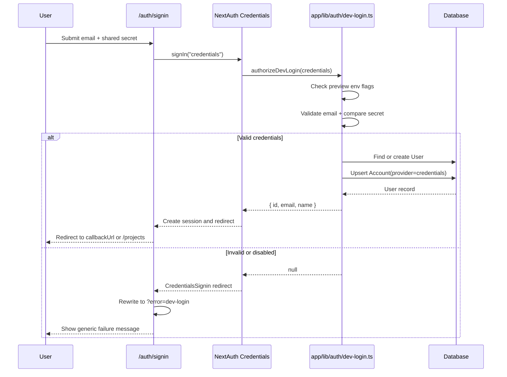

# Authentication Implementation

NextAuth.js configuration, preview-only credentials sign-in, session handling, Personal Access Token (PAT) authentication, and test-only request overrides.

## NextAuth.js Configuration

**Primary files**:
- `lib/auth.ts`
- `app/api/auth/[...nextauth]/route.ts`
- `proxy.ts`

The application uses NextAuth v5-style exports from `NextAuth(...)`:

```typescript
export const { handlers, auth, signIn, signOut } = NextAuth({
  providers: [
    GitHub({ /* OAuth config */ }),
    Credentials({ /* preview login config */ }),
  ],
  callbacks: {
    async signIn({ user, account, profile }) { /* provider-specific handling */ },
    async jwt({ token, user }) {
      if (user?.id) token.id = user.id
      return token
    },
    async session({ session, token, user }) {
      if (session.user) {
        session.user.id = (user?.id || token?.id || token?.userId) as string
      }
      return session
    },
  },
  pages: {
    signIn: "/auth/signin",
    error: "/auth/error",
  },
  session: {
    strategy: process.env.NODE_ENV === "test" ? "database" : "jwt",
    maxAge: 30 * 24 * 60 * 60,
  },
})
```

### Active Providers

- **GitHub OAuth**: standard production sign-in path
- **Credentials / Preview Login**: available only when preview dev-login gating passes

GitHub sign-in persists or updates the user through `app/lib/auth/user-service.ts`. Credentials sign-in delegates to `app/lib/auth/dev-login.ts`.

## Preview Dev Login

**Primary files**:
- `app/lib/auth/dev-login.ts`
- `app/auth/signin/page.tsx`
- `app/api/auth/[...nextauth]/route.ts`

Preview deployments can expose a credentials-based sign-in form for internal testing. The form accepts:

- `email`
- `secret`

### Availability Rules

Preview login is enabled only when all of the following are true:

- `VERCEL_ENV === "preview"`
- `DEV_LOGIN_ENABLED === "true"`
- `DEV_LOGIN_SECRET` is set and non-empty

If any condition fails, the sign-in page shows only the standard GitHub button and direct credentials callbacks are rejected.

### Credentials Validation and Provisioning

`authorizeDevLogin()` performs the full credentials flow:

1. Checks environment gating
2. Validates and normalizes the submitted email with Zod
3. Compares the submitted secret to `DEV_LOGIN_SECRET` with `timingSafeEqual`
4. Reuses an existing `User` by email or creates one
5. Upserts an `Account` row with `provider: "credentials"`
6. Returns a normal auth user payload for session creation

Successful preview logins behave like normal signed-in sessions. Authorization rules for projects, tickets, jobs, and comments do not change.

### Failure Handling

Failed credentials sign-ins do not create a session and do not disclose whether the failure came from:

- an invalid email
- a wrong secret
- a disabled preview-login environment

The auth callback route rewrites NextAuth's default credentials error redirect to:

```text
/auth/signin?error=dev-login
```

The sign-in page and `/auth/error` map that error to a generic user-facing message:

```text
Sign-in failed. Check your email and shared secret.
```

### Preview Login Sequence



## Sign-In Page

**File**: `app/auth/signin/page.tsx`

The sign-in page is a Server Component that renders:

- the preview-login form when preview login is enabled
- the GitHub sign-in button in all environments
- disabled GitLab and Bitbucket placeholders
- Terms of Service and Privacy Policy consent links

The page preserves `callbackUrl` across both GitHub and preview-login submissions. Successful sign-in defaults to `/projects`.

## Auth Callback Route Behavior

**File**: `app/api/auth/[...nextauth]/route.ts`

The route re-exports `handlers.GET` and wraps `handlers.POST` only for the credentials callback path. When NextAuth returns a redirect containing `error=CredentialsSignin`, the route replaces the destination with the preview-login-specific failure URL so the UI can show the correct generic message.

## Protected Route Enforcement

**File**: `proxy.ts`

Route protection is handled by `auth(...)` in `proxy.ts`, not by the older `next-auth/middleware` export pattern.

### Public Routes

The proxy allows these through without a session redirect:

- `/`
- `/auth/*`
- `/api/auth/*`
- `/api/health`
- `/api/push/*`
- `/api/telemetry/*`
- selected workflow and ticket API routes matched by explicit regex patterns

### Protected Routes

For non-public routes:

- requests with a valid session continue
- requests without a session redirect to `/auth/signin`
- the original path is preserved in `callbackUrl`

### Pre-Auth Bypasses

Before the auth proxy runs:

- `Authorization: Bearer pat_...` requests continue so route handlers can validate PATs
- requests with `x-test-user-id` continue so tests can impersonate seeded users in route code

The proxy bypass does not itself authenticate the caller. Route handlers still need to resolve identity through `requireAuth()` or equivalent helpers.

## Session Management

### Runtime Session Strategy

- **Application runtime**: JWT sessions
- **Test runtime (`NODE_ENV === "test"`)**: database sessions via Prisma adapter

JWT and session callbacks copy the canonical database user ID onto `session.user.id` so authorization helpers can treat GitHub and credentials sign-ins the same way.

### Server-Side Session Access

```typescript
import { auth } from "@/lib/auth"

export async function getCurrentUser() {
  const session = await auth()
  if (!session?.user?.id) {
    throw new Error("Unauthorized")
  }
  return session.user
}
```

## PAT Authentication

**Primary files**:
- `lib/db/users.ts`
- `lib/tokens/validate.ts`
- `lib/db/auth-helpers.ts`

Some request-aware API routes support either:

- session authentication
- Bearer PAT authentication

`getCurrentUserOrToken(request)` checks for a bearer token first. When a valid PAT is present, the token owner becomes the authenticated user. Otherwise the helper falls back to session auth.

```typescript
export async function requireAuth(request?: NextRequest): Promise<string> {
  if (request) {
    const user = await getCurrentUserOrToken(request)
    return user.id
  }

  const user = await getCurrentUser()
  return user.id
}
```

### PAT Security

- Tokens are hashed before storage
- Validation is rate-limited by client IP
- Revoked tokens stop working immediately
- Token contents are never returned after creation

## Authorization Helpers

**File**: `lib/db/auth-helpers.ts`

Shared authorization helpers enforce the standard access rules:

- `verifyProjectAccess(projectId, request?)`: owner or member
- `verifyTicketAccess(ticketId, request?)`: access inherited from parent project
- `verifyProjectOwnership(projectId, request?)`: owner only

These helpers accept an optional `NextRequest` so routes that support PATs can resolve identity from either session or token.

## Test Authentication

**Primary files**:
- `tests/helpers/db-setup.ts`
- `tests/fixtures/vitest/api-client.ts`
- `lib/db/users.ts`
- `proxy.ts`

Automated tests use seeded users such as `test@e2e.local`. Test requests can impersonate a seeded user by sending:

```text
x-test-user-id: <user-id>
```

`getCurrentUser()` checks that header before calling `auth()`. If the header matches a real user, that user is treated as the current user for the request.

This is a test-support mechanism for local and CI automation, not a user-facing login flow.

## Environment Variables

### Required for Standard Auth

```env
NEXTAUTH_SECRET=<random-secret>
NEXTAUTH_URL=<base-url>
GITHUB_ID=<github-oauth-client-id>
GITHUB_SECRET=<github-oauth-client-secret>
```

### Required for Preview Login

```env
VERCEL_ENV=preview
DEV_LOGIN_ENABLED=true
DEV_LOGIN_SECRET=<shared-preview-secret>
```

If preview-login variables are absent or the environment is not a Vercel preview deployment, credentials sign-in remains hidden and unusable.

## Security Notes

- Preview login is excluded from production by environment gating
- Secret comparison uses `timingSafeEqual`
- Failed credentials attempts return a generic error
- Authorization stays server-side after sign-in
- PAT validation and browser-session validation are separate code paths
