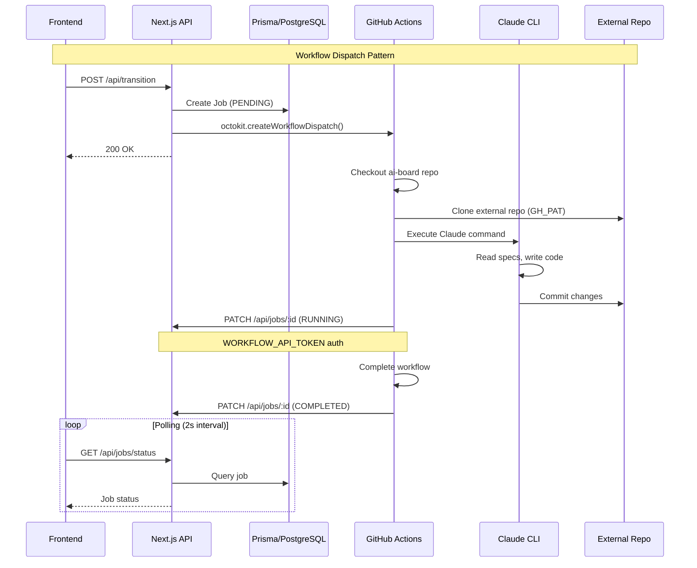
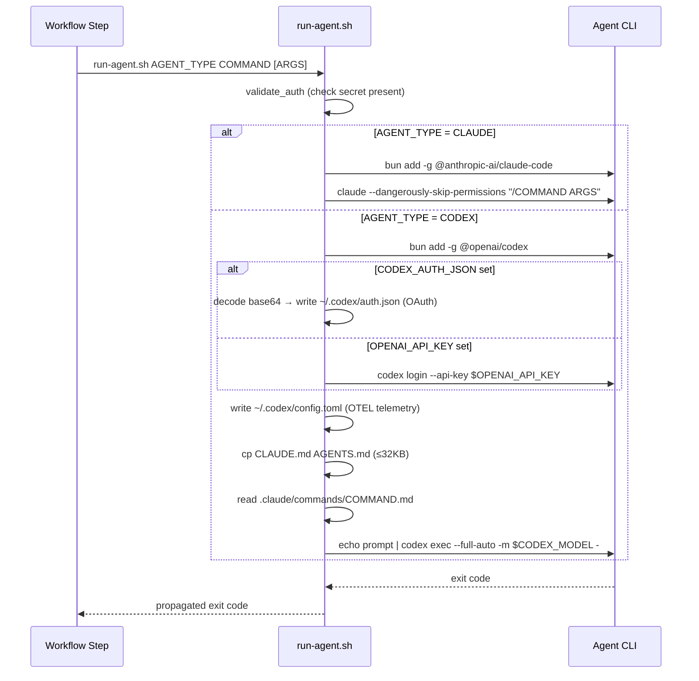
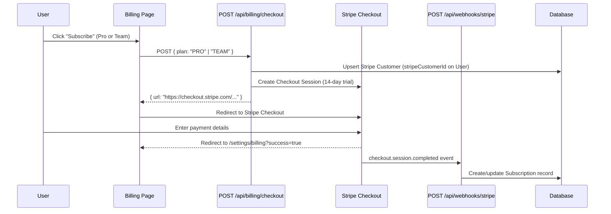
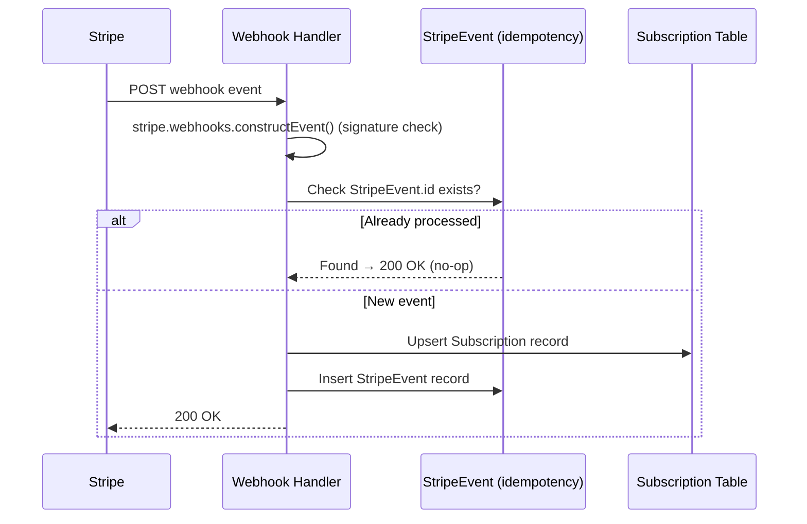
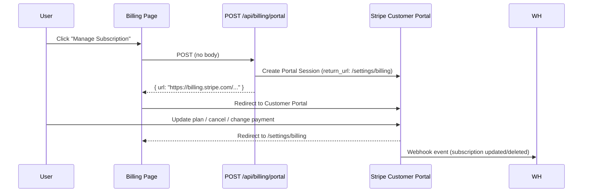

# External Integrations

GitHub Actions, Cloudinary CDN, and Vercel deployment integrations.

## GitHub Actions Integration



### Octokit Client

**Package**: `@octokit/rest` ^22.0.0

**Setup** (`app/lib/workflows/dispatch.ts`):

```typescript
import { Octokit } from '@octokit/rest';

const octokit = new Octokit({
  auth: process.env.GITHUB_TOKEN,
});

export async function dispatchWorkflow(params: {
  owner: string;
  repo: string;
  workflowFile: string;
  inputs: Record<string, string>;
}) {
  try {
    await octokit.rest.actions.createWorkflowDispatch({
      owner: params.owner,
      repo: params.repo,
      workflow_id: params.workflowFile,
      ref: 'main',
      inputs: params.inputs,
    });

    console.log(`Workflow dispatched: ${params.workflowFile}`);
    return { success: true };
  } catch (error) {
    console.error('Workflow dispatch failed:', error);
    throw error;
  }
}
```

### Workflow Files

**Main Workflow** (`.github/workflows/speckit.yml`):
- **Trigger**: `workflow_dispatch` (manual dispatch only)
- **Inputs**:
  - `ticket_id`, `ticketTitle`, `ticketDescription`, `branch`, `command`, `job_id`, `project_id`
  - `githubOwner`, `githubRepo` (required) - Target repository for checkout
  - `agent` (discrete input) - Resolved agent value for PLAN/BUILD commands
  - `specifyPayload` - JSON payload for SPECIFY command (includes `agent` field)
- **Repository Checkout**: Checks out external project repository using `repository: ${{ inputs.githubOwner }}/${{ inputs.githubRepo }}`
- **Environment**: ubuntu-latest, Node.js 22.20.0, Python 3.11, PostgreSQL 14
- **Commands**: specify, plan, task, implement, clarify
- **Services**: PostgreSQL for implement command
- **Dependencies**: Playwright with browser binaries (cached)
- **Timeout**: 120 minutes maximum
- **Note**: At the 10-input GitHub Actions limit. Agent is embedded in `specifyPayload` JSON for the SPECIFY command and passed as a discrete `agent` input for PLAN/BUILD commands.

**Quick-Impl Workflow** (`.github/workflows/quick-impl.yml`):
- **Trigger**: `workflow_dispatch`
- **Inputs**:
  - `ticket_id`, `quickImplPayload`, `attachments`, `job_id`, `project_id`
  - `githubRepository` (required) - Target repository in format owner/repo
- **Repository Checkout**: Checks out external project repository
- **Environment**: Same as speckit.yml (ubuntu-latest, Node.js, Python, PostgreSQL 14, Playwright)
- **Command**: Executes `/ai-board.quick-impl` with JSON payload
- **Timeout**: 120 minutes maximum (matches full spec-kit workflow)
- **Differences**: Skips full spec generation, creates minimal spec.md
- **Same**: Test execution, branch management, job status updates
- **Note**: Agent is embedded in `quickImplPayload` JSON (e.g., `{ ticketKey, title, description, agent }`).

**Verify Workflow** (`.github/workflows/verify.yml`):
- **Trigger**: `workflow_dispatch`
- **Inputs**:
  - `ticket_id`, `job_id`, `project_id`, `branch`, `workflowType`, `agent`
  - `githubOwner`, `githubRepo` (required) - Target repository for checkout
- **Repository Checkout**: Checks out external project repository at specified branch
- **Actions**: Runs tests and creates pull request
- **Test Execution**: Conditional based on workflowType (FULL or QUICK)
- **Agent Forwarding**: Forwards `agent` input to iterate.yml when dispatching iterate workflow

**AI-BOARD Assist** (`.github/workflows/ai-board-assist.yml`):
- **Trigger**: `workflow_dispatch`
- **Inputs**:
  - `ticket_id`, `stage`, `comment_content`, `job_id`, `project_id`, `agent`
  - `githubRepository` (required) - Target repository in format owner/repo
- **Repository Checkout**: Checks out external project repository
- **Telemetry Pre-Fetch**: Executes `fetch-telemetry.sh` for `/compare` commands
- **Command**: Claude updates spec/plan based on comment request
- **Response**: Posts summary comment via API
- **Note**: At exactly the 10-input GitHub Actions limit. Forwards `agent` when dispatching iterate.yml for minor VERIFY fixes.

**Deploy Preview** (`.github/workflows/deploy-preview.yml`):
- **Trigger**: `workflow_dispatch`
- **Inputs**:
  - `ticket_id`, `project_id`, `branch`, `job_id`
  - `githubOwner`, `githubRepo` (required) - Target repository for checkout
- **Repository Checkout**: Checks out external project repository at specified branch
- **Action**: Deploy feature branch to Vercel preview environment
- **Output**: Preview URL stored in ticket.previewUrl field
- **Method**: Vercel CLI deployment with project/org scoping

**Cleanup Workflow** (`.github/workflows/cleanup.yml`):
- **Trigger**: `workflow_dispatch`
- **Inputs**:
  - `ticket_id`, `project_id`, `job_id`, `agent`
  - `githubRepository` (required) - Target repository in format owner/repo
- **Repository Checkout**: Checks out external project repository at main branch with full history (`fetch-depth: 0`)
- **Environment**: ubuntu-latest, Node.js 22.20.0, Python 3.11, Bun 1.3.1, PostgreSQL 14
- **Services**: PostgreSQL for test execution
- **Dependencies**: Playwright with chromium browser
- **Command**: Executes `/cleanup` Claude command
- **Actions**: Diff-based technical debt analysis, creates cleanup branch, transitions to VERIFY
- **Timeout**: 45 minutes maximum

**Iterate Workflow** (`.github/workflows/iterate.yml`):
- **Trigger**: `workflow_dispatch`
- **Inputs**:
  - `ticket_id`, `job_id`, `project_id`, `branch`, `issues_to_fix`, `agent`
  - `githubRepository` (required) - Target repository in format owner/repo
- **Repository Checkout**: Checks out external project repository at specified branch
- **Dispatch Source**: Triggered by ai-board-assist.yml for minor VERIFY fixes (<30% divergence)
- **Command**: Executes targeted code fixes and syncs documentation
- **Actions**: Fix issues, update branch specs, synchronize global docs, commit and push

**Auto-Ship** (`.github/workflows/auto-ship.yml`):
- **Trigger**: `deployment_status` event
- **Conditions**: Vercel production deployment success
- **Action**: Transitions VERIFY → SHIP for tickets with merged branches
- **Method**: Git ancestry check (`git merge-base --is-ancestor`)

### Agent Resolution

Before dispatching any workflow, the system resolves the effective agent using a priority chain:

```typescript
// lib/workflows/transition.ts
export function resolveEffectiveAgent(ticket: TicketWithProject): Agent {
  return ticket.agent ?? ticket.project.defaultAgent ?? Agent.CLAUDE;
}
```

**Resolution Priority**:
1. `ticket.agent` — Per-ticket override (optional, `Agent?`)
2. `ticket.project.defaultAgent` — Project-level default (required, `@default(CLAUDE)`)
3. `Agent.CLAUDE` — Defensive system-wide fallback

**Dispatch Strategy**:

| Workflow | Agent Transport |
|----------|----------------|
| `speckit.yml` (SPECIFY) | Embedded in `specifyPayload` JSON: `{ ticketKey, title, description, clarificationPolicy, agent }` |
| `speckit.yml` (PLAN/BUILD) | Discrete `agent` input |
| `quick-impl.yml` | Embedded in `quickImplPayload` JSON: `{ ticketKey, title, description, agent }` |
| `verify.yml` | Discrete `agent` input |
| `cleanup.yml` | Discrete `agent` input |
| `ai-board-assist.yml` | Discrete `agent` input |
| `iterate.yml` | Discrete `agent` input |

The mixed strategy (embed in JSON payloads vs. discrete input) respects the GitHub Actions 10-input limit — `speckit.yml` remains at 10 inputs and `ai-board-assist.yml` is at exactly 10 inputs.

### Claude Commands

**Implementation Command** (`commands/ai-board.implement.md`):
- **Purpose**: Execute all tasks in tasks.md and generate implementation summary
- **Input**: Tasks from tasks.md, plan from plan.md, spec from spec.md
- **Steps**:
  1. Prerequisites check (validate FEATURE_DIR and required files)
  2. Checklist validation (optional, blocks if incomplete)
  3. Load implementation context (tasks, plan, data model, contracts)
  4. Setup verification (create/verify ignore files)
  5. Parse task structure (phases, dependencies, execution order)
  6. Execute implementation (phase-by-phase, respecting dependencies)
  7. Progress tracking (mark completed tasks with [X])
  8. Completion validation (verify all tasks completed)
  9. Summary generation (Step 10)
- **Output**: Implemented code, marked tasks, summary.md file

**Summary Generation (Step 10)**:
- Reads summary template from `.claude-plugin/templates/summary-template.md` (via ai-board checkout)
- Generates content following template structure exactly
- Extracts feature name from spec.md header (first `#` line)
- Gets current git branch (`git branch --show-current`)
- Uses current date in YYYY-MM-DD format
- Enforces character limits:
  - Changes Summary: max 500 chars
  - Key Decisions: max 500 chars
  - Files Modified: max 500 chars
  - Manual Requirements: max 300 chars
  - Total: max 2300 chars
- Writes to `FEATURE_DIR/summary.md`
- Handles partial failures: includes progress and failure point

**Summary Template** (`.claude-plugin/templates/summary-template.md`):

```markdown
# Implementation Summary: [FEATURE_NAME]

**Branch**: `[BRANCH]` | **Date**: [DATE]
**Spec**: [link to spec.md]

## Changes Summary

[Brief description of what was implemented - max 500 chars]

## Key Decisions

[Important technical decisions made during implementation - max 500 chars]

## Files Modified

[List of key files created/modified - max 500 chars]

## ⚠️ Manual Requirements

[Any steps requiring human action, or "None" if fully automated - max 300 chars]
```

**Template Pattern**:
- Follows existing template conventions (spec-template.md, plan-template.md)
- Located in `.claude-plugin/templates/` directory (ai-board plugin)
- Placeholder format: `[PLACEHOLDER_NAME]`
- Section headers with Markdown H2 (`##`)
- Warning emoji (`⚠️`) for manual requirements section

**Quick-Impl Command** (`commands/ai-board.quick-impl.md`):
- **Purpose**: Fast-track implementation bypassing formal spec/plan/tasks generation
- **Input**: JSON payload with ticketKey, title, description (from quickImplPayload workflow input)
- **Process**:
  1. Create feature branch via `create-new-feature.sh --mode=quick-impl`
  2. Generate minimal spec.md with title and description only
  3. Load project context from CLAUDE.md
  4. Implement changes directly based on ticket description
  5. Follow TDD approach (write tests first if behavior changes)
  6. Run validation (tests, type-check, linter)
- **Flexibility**: No artificial complexity limits or validation gates
- **Output**: Implemented code, minimal spec.md, all validation passed
- **Use Cases**: Bug fixes, UI tweaks, simple refactoring, documentation updates
- **Timeout**: 120 minutes (same as full workflow)

**Code Simplifier Command** (`commands/ai-board.code-simplifier.md`):
- **Purpose**: Simplify and refine code for clarity, consistency, and maintainability
- **Trigger**: Verify workflow (Phase 4.5, after test fixes)
- **Scope**: Recently modified code (git diff main...HEAD)
- **Actions**:
  - Preserve functionality - only improve code structure
  - Apply project coding standards from CLAUDE.md
  - Reduce unnecessary complexity and nesting
  - Eliminate redundant code and abstractions
  - Avoid nested ternary operators
- **Output**: Refined code committed to feature branch

**Code Review Command** (`commands/ai-board.code-review.md`):
- **Purpose**: Automated code review for pull requests
- **Trigger**: Verify workflow (Phase 7, after PR creation)
- **Input**: PR number
- **Review Checks**:
  - CLAUDE.md compliance
  - Constitution compliance (`.ai-board/memory/constitution.md`)
  - Obvious bugs in changed code
  - Historical git context issues
  - Code comment guidance adherence
- **Confidence Scoring**: Issues scored 0-100, only 80+ reported
- **Output**: Review findings posted as PR comment via `gh` CLI

### Authentication

**GitHub Token** (Automatic):
- Provided by GitHub Actions (`GITHUB_TOKEN` secret)
- Permissions: Read repository, create workflow dispatches
- Scope: Current repository only (ai-board)
- Used for dispatching workflows in ai-board repository

**GitHub Personal Access Token** (Custom):
- Stored as `GH_PAT` repository secret
- **Purpose**: Access external project repositories from workflows
- **Required Scope**: `repo` (full control of private repositories)
- **Usage**: Checkout external repositories in workflow steps
- **Security**: Centralized in ai-board, shared across all external projects

**Workflow API Token** (Custom):
- Stored as `WORKFLOW_API_TOKEN` repository secret
- Used for API authentication from workflows back to ai-board API
- Bearer token format: `Authorization: Bearer <token>`
- Validated via constant-time comparison

### API Communication Pattern

**Dispatch from API** → **Execute in Workflow** → **Status Update to API**

```typescript
// 1. API dispatches workflow
await octokit.rest.actions.createWorkflowDispatch({ ... });

// 2. Workflow executes command
// (in GitHub Actions runner)

// 3. Workflow updates job status
await fetch(`${APP_URL}/api/jobs/${job_id}/status`, {
  method: 'PATCH',
  headers: {
    'Authorization': `Bearer ${WORKFLOW_API_TOKEN}`,
    'Content-Type': 'application/json',
  },
  body: JSON.stringify({ status: 'COMPLETED' }),
});
```

### Environment Variables

**GitHub Secrets**:
- `ANTHROPIC_API_KEY`: Claude API key
- `WORKFLOW_API_TOKEN`: Workflow authentication token
- `GH_PAT`: GitHub Personal Access Token with `repo` scope (for external repository access)
- `VERCEL_TOKEN`: Vercel API token (for deploy-preview workflow)
- `VERCEL_ORG_ID`: Vercel organization/team ID
- `VERCEL_PROJECT_ID`: Vercel project ID
- `GITHUB_TOKEN`: Automatic (provided by GitHub, ai-board repository only)

**Repository Variables**:
- `APP_URL`: Application URL for API calls (e.g., `https://ai-board.vercel.app`)

### Agent Runner Script

**Script**: `.github/scripts/run-agent.sh`

**Purpose**: Unified entry point for all AI CLI invocations across GitHub workflows. Abstracts CLI installation, authentication, telemetry configuration, and command invocation for Claude Code and Codex CLI.

**Interface**:
```bash
.github/scripts/run-agent.sh <AGENT_TYPE> <COMMAND> [ARGS...]

# Examples
.github/scripts/run-agent.sh CLAUDE ai-board.specify "$PAYLOAD"
.github/scripts/run-agent.sh CODEX  ai-board.implement "$TICKET_KEY $TITLE"
```

**Agent Execution Flow**:



**Agent-Specific Behavior**:

| Concern | CLAUDE | CODEX |
|---------|--------|-------|
| Package | `@anthropic-ai/claude-code` | `@openai/codex` |
| Auth secret | `CLAUDE_CODE_OAUTH_TOKEN` | `OPENAI_API_KEY` or `CODEX_AUTH_JSON` (base64) |
| Command invocation | `claude --dangerously-skip-permissions "/COMMAND ARGS"` | Prompt injection via stdin from `.claude/commands/COMMAND.md` |
| Telemetry | Env vars (passed through from workflow) | `~/.codex/config.toml` with `[otel]` section |
| Project context | `CLAUDE.md` (native) | `AGENTS.md` (generated from `CLAUDE.md`, ≤32KB) |
| Model selection | `ANTHROPIC_MODEL` (workflow env) | `CODEX_MODEL` env var (default: `gpt-5-codex`), `CODEX_REASONING` env var (default: `high`) |

**AGENTS.md Generation** (Codex only):
- Copies `CLAUDE.md` to `AGENTS.md` in the working directory
- Enforces 32KB limit (Codex documented maximum)
- If over limit: truncates at byte boundary and appends `<!-- TRUNCATED -->` notice
- Ephemeral: not committed; regenerated on each workflow run
- Skipped if `CLAUDE.md` does not exist

**Codex Telemetry Mapping**:

| Workflow env var | `~/.codex/config.toml` field |
|-----------------|------------------------------|
| `OTEL_EXPORTER_OTLP_ENDPOINT` | `[otel.exporter.otlp-http] endpoint` (must include full path `/v1/logs` — Rust OTLP client does not auto-append) |
| `OTEL_EXPORTER_OTLP_HEADERS` (Authorization value) | `[otel.exporter.otlp-http] headers.Authorization` |

**Codex OTLP Config Notes**:
- Traces and metrics are disabled: `trace_exporter = "none"` in config (only logs are exported)
- Codex sends `body: null` in log records (not `body.stringValue` like standard OTLP)
- Event name is found in `attributes[event.name]` instead of the log body
- Token data comes from `codex.sse_event` logs where `event.kind = response.completed`, with attributes: `input_token_count`, `output_token_count`, `cached_token_count`
- Codex does not report `cost_usd`; the telemetry endpoint estimates cost from OpenAI API pricing based on token counts and the resolved model name

**Error Handling**:
- Missing auth secret → exits before any CLI installation with descriptive message
- CLI binary not found after install → fails with clear install error
- Command `.md` file not found (Codex) → exits with file path shown
- Unsupported agent type → exits listing supported values: `CLAUDE`, `CODEX`
- Exit code from underlying CLI is always propagated to calling workflow step

**Environment Variables**:
- `CLAUDE_CODE_OAUTH_TOKEN`: Required when `AGENT_TYPE=CLAUDE`
- `OPENAI_API_KEY`: Required when `AGENT_TYPE=CODEX` (API key auth mode)
- `CODEX_AUTH_JSON`: Alternative to `OPENAI_API_KEY` for Codex (base64-encoded OAuth `auth.json` from `codex login`; decoded and written to `~/.codex/auth.json`)
- `CODEX_MODEL`: Optional Codex model override (default: `gpt-5-codex`)
- `CODEX_REASONING`: Optional Codex reasoning effort override (default: `high`)
- `OTEL_EXPORTER_OTLP_ENDPOINT`: Optional; enables Codex telemetry when set
- `OTEL_EXPORTER_OTLP_HEADERS`: Optional; passed to Codex telemetry config

**Usage in Workflows**:

All 6 workflows (`speckit.yml`, `quick-impl.yml`, `verify.yml`, `cleanup.yml`, `ai-board-assist.yml`, `iterate.yml`) invoke commands through this script, replacing previous hardcoded `bun add -g @anthropic-ai/claude-code` and direct `claude` invocations:

```yaml
- name: Run agent command
  env:
    CLAUDE_CODE_OAUTH_TOKEN: ${{ secrets.CLAUDE_CODE_OAUTH_TOKEN }}
    OPENAI_API_KEY: ${{ secrets.OPENAI_API_KEY }}
  run: |
    .github/scripts/run-agent.sh "${{ inputs.agent }}" ai-board.specify "$PAYLOAD"
```

### Telemetry Context Script

**Script**: `.github/scripts/fetch-telemetry.sh`

**Purpose**: Pre-fetch job telemetry for tickets referenced in `/compare` commands.

**Execution Context**:
- Called by `ai-board-assist.yml` workflow before Claude execution
- Conditional: Only runs when comment contains `/compare`
- Runs after repository checkout, before Claude CLI execution

**Process**:
1. Parses ticket references from comment using regex: `#[A-Z0-9]{3,6}-[0-9]+`
2. Resolves each ticket key to ticket ID via search API
3. Fetches jobs for each ticket via jobs API (requires workflow token)
4. Aggregates telemetry from COMPLETED jobs:
   - Sums token counts (input, output, cache read, cache creation)
   - Sums cost (USD) and duration (milliseconds)
   - Extracts first model name from completed jobs
   - Collects unique tool names across all jobs
   - Counts completed jobs per ticket
5. Writes aggregated data to `.telemetry-context.json` in ticket's spec directory

**Output File Structure**:
```json
{
  "generatedAt": "2026-01-03T10:30:00Z",
  "tickets": {
    "AIB-127": {
      "ticketKey": "AIB-127",
      "inputTokens": 15000,
      "outputTokens": 5000,
      "cacheReadTokens": 3000,
      "cacheCreationTokens": 1000,
      "costUsd": 0.125,
      "durationMs": 180000,
      "model": "claude-sonnet-4-5-20250929",
      "toolsUsed": ["Edit", "Read", "Bash"],
      "jobCount": 4,
      "hasData": true
    },
    "AIB-128": {
      "ticketKey": "AIB-128",
      "inputTokens": 0,
      "outputTokens": 0,
      "cacheReadTokens": 0,
      "cacheCreationTokens": 0,
      "costUsd": 0,
      "durationMs": 0,
      "model": null,
      "toolsUsed": [],
      "jobCount": 0,
      "hasData": false
    }
  }
}
```

**Error Handling**:
- API failures: Uses empty telemetry (zeros, hasData: false)
- Missing tickets: Uses empty telemetry
- No completed jobs: Sets jobCount: 0, hasData: false
- Script continues on individual ticket failures (non-blocking)

**Environment Requirements**:
- `APP_URL`: Base URL for API endpoints
- `WORKFLOW_API_TOKEN`: Bearer token for authentication
- `PROJECT_ID`: Current project ID
- `BRANCH`: Current ticket branch (for output file path)

**Usage in Claude**:
```bash
# Claude reads context file during /compare execution
cat specs/$BRANCH/.telemetry-context.json
```

**File Lifecycle**:
- Generated: Before each `/compare` execution
- Location: `specs/{branch}/.telemetry-context.json`
- Ignored: `.gitignore` entry prevents commit
- Temporary: Regenerated on every comparison request

### Multi-Repository Workflow Architecture

**Centralized Workflow Management**:
- All GitHub Actions workflows stored in ai-board repository (`.github/workflows/`)
- Workflows dispatch from ai-board but execute against external project repositories
- External projects do not need workflow configuration (workflows-as-a-service)

**External Repository Checkout Pattern**:

```yaml
- name: Checkout repository
  uses: actions/checkout@v4
  with:
    # Checkout external project repository
    repository: ${{ inputs.githubOwner }}/${{ inputs.githubRepo }}
    ref: ${{ inputs.branch }}
    token: ${{ secrets.GH_PAT }}
    fetch-depth: 0
```

**Workflow Dispatch Pattern**:

```typescript
// API dispatches workflow with project repository information
await octokit.actions.createWorkflowDispatch({
  owner: 'ai-board-org',  // ai-board repository
  repo: 'ai-board',
  workflow_id: 'speckit.yml',
  ref: 'main',
  inputs: {
    ticket_id: '123',
    command: 'specify',
    githubOwner: 'bfernandez31',      // External project owner
    githubRepo: 'my-external-project', // External project repo
    // ... other inputs
  },
});
```

**External Project Requirements**:
- **No ai-board files required in external projects**
- Workflows use double checkout pattern (ai-board + target)
- ai-board commands symlinked to target during workflow execution
- Test configuration (if using verify workflow)
- Standard project structure compatible with ai-board commands

**Benefits**:
- Single source of truth for workflow definitions
- Easy updates and maintenance (change once, applies to all projects)
- No workflow configuration burden on external projects
- Consistent automation behavior across all managed projects

### Branch Deletion

**Function**: `deleteBranchAndPRs` (`lib/github/delete-branch-and-prs.ts`)

**Purpose**: Delete Git branches and close associated pull requests during ticket deletion.

**Sequence**:
1. Find all open PRs with matching head branch
2. Close all matching PRs (required before branch deletion)
3. Delete the Git branch

**Idempotent Operations**:
- 404 errors (branch already deleted) are acceptable
- 422 errors with "reference does not exist" message are acceptable (branch already deleted)
- Returns success even if branch was already deleted

**Usage**:
```typescript
import { Octokit } from '@octokit/rest';
import { deleteBranchAndPRs } from '@/lib/github/delete-branch-and-prs';

const octokit = new Octokit({ auth: process.env.GITHUB_TOKEN });

const result = await deleteBranchAndPRs(
  octokit,
  'bfernandez31',
  'ai-board',
  '084-drag-and-drop'
);

console.log(`Closed ${result.prsClosed} PRs, deleted branch: ${result.branchDeleted}`);
```

**Return Type**:
```typescript
interface GitHubCleanupResult {
  prsClosed: number;        // Number of PRs closed
  branchDeleted: boolean;   // False if branch was already deleted
}
```

**Error Handling**:
- 403 errors: Permission denied (check token scope includes 'repo' access)
- 422 errors (non-reference-not-found): Protected branch (remove protection in GitHub settings)
- 429 errors: Rate limit exceeded (includes reset timestamp)
- Other errors: Re-thrown with descriptive message

### Error Handling

```typescript
try {
  await dispatchWorkflow({ ... });
} catch (error: any) {
  if (error.status === 401) {
    throw new Error('GitHub authentication failed');
  } else if (error.status === 403) {
    throw new Error('Rate limit exceeded or insufficient permissions');
  } else if (error.status === 404) {
    throw new Error('Workflow file not found');
  } else {
    throw new Error(`Workflow dispatch failed: ${error.message}`);
  }
}
```

## Stripe Billing Integration

### Overview

**Package**: `stripe` (official Node.js SDK, server-side only)

**Architecture**: Uses Stripe-hosted Checkout and Customer Portal to minimize PCI scope. No payment data ever touches the application server.

**Setup** (`lib/billing/stripe.ts`):

```typescript
import Stripe from 'stripe';

export const stripe = new Stripe(process.env.STRIPE_SECRET_KEY!, {
  apiVersion: '2024-06-20',
});
```

### Checkout Flow



### Webhook Handler

**Endpoint**: `POST /api/webhooks/stripe`

**Auth**: Stripe signature verification via `stripe.webhooks.constructEvent()` using `STRIPE_WEBHOOK_SECRET`.

**Idempotency**: Each event is checked against the `StripeEvent` table before processing. Duplicate events are silently ignored.

**Handled Events**:

| Event | Action |
|-------|--------|
| `checkout.session.completed` | Create or update Subscription record |
| `invoice.payment_succeeded` | Extend billing period; set status ACTIVE |
| `invoice.payment_failed` | Set status PAST_DUE; set `gracePeriodEndsAt` = now + 7 days |
| `customer.subscription.updated` | Sync plan, status, and period dates |
| `customer.subscription.deleted` | Set status CANCELED; user reverts to FREE limits |



### Customer Portal Flow



### Plan Configuration (`lib/billing/plans.ts`)

```typescript
export const PLANS: Record<SubscriptionPlan, PlanConfig> = {
  FREE:  { priceMonthly: 0,    stripePriceId: null,                         trial: { enabled: false, days: 0  } },
  PRO:   { priceMonthly: 1500, stripePriceId: process.env.STRIPE_PRO_PRICE_ID,  trial: { enabled: true,  days: 14 } },
  TEAM:  { priceMonthly: 3000, stripePriceId: process.env.STRIPE_TEAM_PRICE_ID, trial: { enabled: true,  days: 14 } },
};
```

Prices are stored in cents (USD). `null` `stripePriceId` means the plan has no Stripe billing.

### Feature Gating (`lib/billing/subscription.ts`)

```typescript
// Determine which plan limits apply given current status
export function getEffectivePlan(
  plan: SubscriptionPlan,
  status: string,
  gracePeriodEndsAt: Date | null
): SubscriptionPlan {
  if (status === 'CANCELED') return 'FREE';
  if (status === 'PAST_DUE' && gracePeriodEndsAt && new Date() > gracePeriodEndsAt) return 'FREE';
  return plan;
}
```

Gating is applied in:
- `POST /api/projects` — checks `maxProjects` limit
- `POST /api/tickets` — checks `maxTicketsPerMonth` limit (calendar month)
- `POST /api/projects/:projectId/members` — checks `membersEnabled`

### Environment Variables

```env
STRIPE_SECRET_KEY=sk_live_...          # Stripe secret key (server-side only)
STRIPE_WEBHOOK_SECRET=whsec_...        # Webhook signing secret
STRIPE_PRO_PRICE_ID=price_...          # Stripe Price ID for Pro plan
STRIPE_TEAM_PRICE_ID=price_...         # Stripe Price ID for Team plan
NEXT_PUBLIC_APP_URL=https://...        # Used for Checkout success/cancel redirect URLs
```

### Account Deletion

When a user is deleted (`lib/db/users.ts`), any active Stripe subscription is cancelled via `stripe.subscriptions.cancel(stripeSubscriptionId)` before the database record is removed.

## Cloudinary CDN Integration

### SDK Setup

**Package**: `cloudinary` (Node.js SDK v2)

**Configuration** (`app/lib/cloudinary.ts`):

```typescript
import { v2 as cloudinary } from 'cloudinary';

cloudinary.config({
  cloud_name: process.env.CLOUDINARY_CLOUD_NAME,
  api_key: process.env.CLOUDINARY_API_KEY,
  api_secret: process.env.CLOUDINARY_API_SECRET,
});

export { cloudinary };
```

### Upload Image

```typescript
import { cloudinary } from '@/app/lib/cloudinary';

export async function uploadImage(
  buffer: Buffer,
  ticketId: number,
  filename: string
): Promise<UploadResult> {
  return new Promise((resolve, reject) => {
    const uploadStream = cloudinary.uploader.upload_stream(
      {
        folder: `ai-board/tickets/${ticketId}`,
        public_id: filename,
        resource_type: 'image',
        overwrite: false,
      },
      (error, result) => {
        if (error) reject(error);
        else resolve(result!);
      }
    );

    uploadStream.end(buffer);
  });
}
```

### Delete Image

```typescript
export async function deleteImage(publicId: string): Promise<void> {
  try {
    await cloudinary.uploader.destroy(publicId, {
      resource_type: 'image',
    });

    console.log(`Deleted image: ${publicId}`);
  } catch (error) {
    console.error('Failed to delete image:', error);
    // Don't throw - continue with database operation
  }
}
```

### Folder Structure

```
ai-board/
└── tickets/
    ├── 1/
    │   ├── screenshot-1.png
    │   └── diagram-2.png
    ├── 2/
    │   └── mockup-3.png
    └── 42/
        └── bug-screenshot-4.png
```

### API Route Pattern

```typescript
export async function POST(request: NextRequest) {
  const formData = await request.formData();
  const file = formData.get('file') as File;

  // Validate file
  if (!file) {
    return NextResponse.json({ error: 'No file provided' }, { status: 400 });
  }

  if (file.size > 10 * 1024 * 1024) {
    return NextResponse.json({ error: 'File too large' }, { status: 413 });
  }

  // Convert to buffer
  const bytes = await file.arrayBuffer();
  const buffer = Buffer.from(bytes);

  // Upload to Cloudinary
  const result = await uploadImage(buffer, ticketId, file.name);

  // Store metadata in database
  const attachment: TicketAttachment = {
    type: 'uploaded',
    url: result.secure_url,
    filename: file.name,
    mimeType: file.type,
    sizeBytes: file.size,
    uploadedAt: new Date().toISOString(),
    cloudinaryPublicId: result.public_id,
  };

  // Update ticket attachments
  await prisma.ticket.update({
    where: { id: ticketId },
    data: {
      attachments: {
        push: attachment,
      },
    },
  });

  return NextResponse.json({ attachment });
}
```

### Environment Variables

```env
CLOUDINARY_CLOUD_NAME=your-cloud-name
CLOUDINARY_API_KEY=123456789012345
CLOUDINARY_API_SECRET=abc123def456
```

### Free Tier Limits

- **Storage**: 25GB
- **Bandwidth**: 25GB/month
- **Transformations**: 25,000/month
- **Requests**: Unlimited

### Error Handling

```typescript
try {
  const result = await uploadImage(buffer, ticketId, filename);
} catch (error: any) {
  if (error.http_code === 420) {
    throw new Error('Rate limit exceeded');
  } else if (error.http_code === 500) {
    throw new Error('Cloudinary service error');
  } else {
    throw new Error(`Upload failed: ${error.message}`);
  }
}
```

## Vercel Deployment Integration

### Platform Features

**Serverless Functions**:
- API routes run as serverless functions
- 10-second execution limit (hobby plan)
- 50MB payload limit
- No persistent connections (hence polling vs WebSockets)

**Edge Network**:
- Global CDN for static assets
- Automatic HTTPS
- Brotli compression
- Image optimization

**Environment Variables**:
- Set via Vercel dashboard
- Different values for preview vs production
- Encrypted at rest

### Auto-Ship Workflow

**Trigger**: `deployment_status` event from Vercel

```yaml
name: Auto-Ship on Production Deployment

on:
  deployment_status:

jobs:
  auto-ship:
    if: |
      github.event.deployment_status.state == 'success' &&
      github.event.deployment.environment == 'Production' &&
      github.event.sender.login == 'vercel[bot]'
    runs-on: ubuntu-latest
    timeout-minutes: 5

    steps:
      - name: Checkout
        uses: actions/checkout@v4
        with:
          fetch-depth: 0

      - name: Auto-ship tickets
        env:
          DEPLOYMENT_SHA: ${{ github.event.deployment.sha }}
          APP_URL: ${{ vars.APP_URL }}
          WORKFLOW_API_TOKEN: ${{ secrets.WORKFLOW_API_TOKEN }}
        run: |
          .claude-plugin/scripts/bash/auto-ship-tickets.sh \
            "${DEPLOYMENT_SHA}" \
            "${APP_URL}" \
            "${WORKFLOW_API_TOKEN}"
```

**Script Logic** (`.claude-plugin/scripts/bash/auto-ship-tickets.sh`):

1. Fetch all VERIFY stage tickets via API
2. For each ticket with branch:
   - Fetch branch from remote
   - Check if branch merged: `git merge-base --is-ancestor <branch> <deployment-sha>`
   - If merged: Transition VERIFY → SHIP via API
   - Post deployment notification comment
3. Generate summary report

### Environment Configuration

**Production**:
```env
DATABASE_URL=<postgresql-connection-string>
NEXTAUTH_URL=https://ai-board.vercel.app
NEXTAUTH_SECRET=<production-secret>
# ... other secrets
```

**Preview**:
```env
DATABASE_URL=<preview-database-connection-string>
NEXTAUTH_URL=https://ai-board-<branch>.vercel.app
NEXTAUTH_SECRET=<preview-secret>
```

### Build Configuration

**vercel.json**:

```json
{
  "buildCommand": "next build",
  "devCommand": "next dev",
  "installCommand": "npm install",
  "framework": "nextjs",
  "regions": ["iad1"],
  "env": {
    "DATABASE_URL": "@database_url",
    "NEXTAUTH_SECRET": "@nextauth_secret"
  }
}
```

### Performance Monitoring

- **Build Time**: <5 minutes
- **Cold Start**: <200ms (API routes)
- **Response Time**: <100ms (p95)
- **Cache Hit Rate**: >80% (static assets)

## Error Handling Patterns

### Retry with Exponential Backoff

```typescript
async function retryWithBackoff<T>(
  fn: () => Promise<T>,
  maxRetries = 3
): Promise<T> {
  for (let attempt = 0; attempt < maxRetries; attempt++) {
    try {
      return await fn();
    } catch (error) {
      if (attempt === maxRetries - 1) throw error;

      const delay = Math.min(1000 * 2 ** attempt, 30000);
      await new Promise(resolve => setTimeout(resolve, delay));
    }
  }

  throw new Error('Max retries exceeded');
}

// Usage
const result = await retryWithBackoff(() =>
  octokit.rest.actions.createWorkflowDispatch({ ... })
);
```

### Graceful Degradation

```typescript
try {
  await deleteImage(publicId);
} catch (error) {
  // Log but don't throw - continue with database operation
  console.error('Cloudinary deletion failed:', error);
  // Image becomes orphaned but database stays consistent
}
```

### Circuit Breaker (Future Enhancement)

```typescript
class CircuitBreaker {
  private failures = 0;
  private lastFailureTime?: number;

  async execute<T>(fn: () => Promise<T>): Promise<T> {
    if (this.isOpen()) {
      throw new Error('Circuit breaker open');
    }

    try {
      const result = await fn();
      this.onSuccess();
      return result;
    } catch (error) {
      this.onFailure();
      throw error;
    }
  }

  private isOpen(): boolean {
    if (this.failures >= 5) {
      const timeSinceFailure = Date.now() - (this.lastFailureTime || 0);
      return timeSinceFailure < 60000;  // 1 minute cooldown
    }
    return false;
  }

  private onSuccess() {
    this.failures = 0;
  }

  private onFailure() {
    this.failures++;
    this.lastFailureTime = Date.now();
  }
}
```
