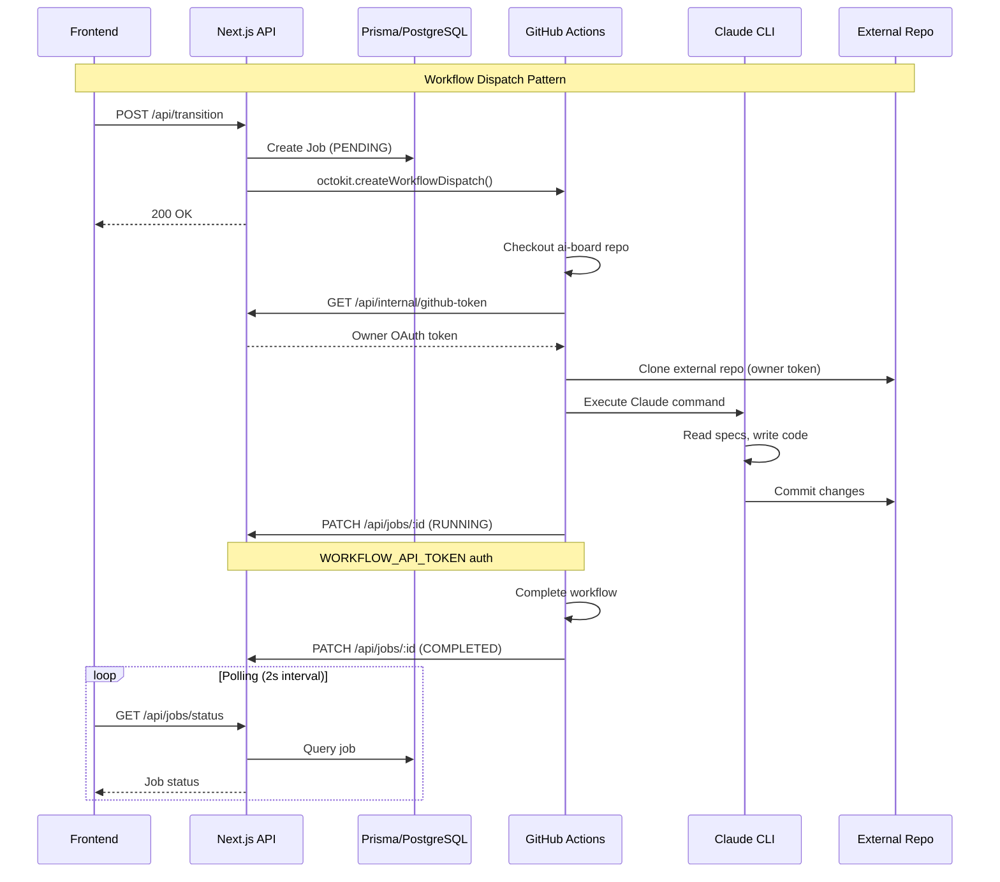
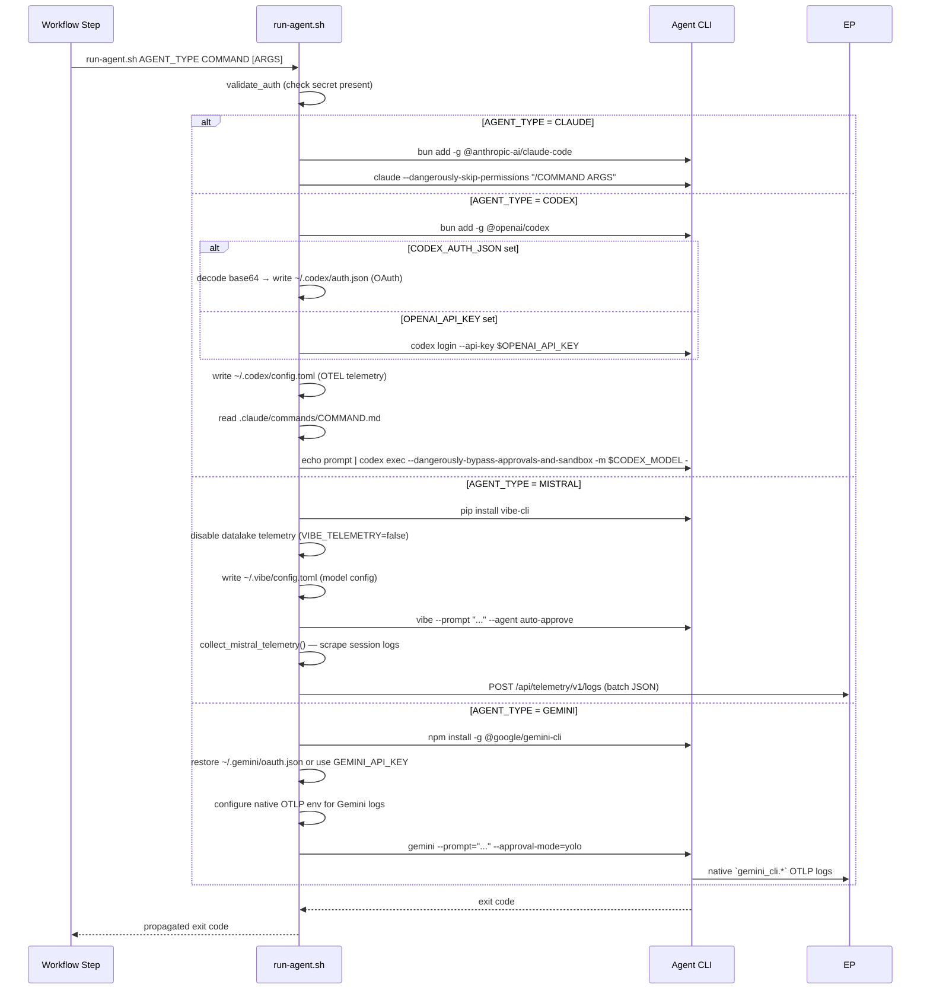

# GitHub Actions Integration




### Octokit Client

**Package**: `@octokit/rest` ^22.0.0

**Setup** (`app/lib/workflows/dispatch.ts` and related modules):

> **Note**: Workflow dispatch logic is split across multiple files rather than centralized in a single dispatch module:
> - `lib/workflows/transition.ts` — stage transition dispatches
> - `lib/health/scan-dispatch.ts` — health scan dispatches
> - `app/lib/workflows/dispatch-deploy-preview.ts` — deploy preview dispatches
> - `app/lib/workflows/dispatch-rollback-reset.ts` — rollback-reset dispatches
> - `app/lib/workflows/dispatch-ai-board.ts` — AI-board assist dispatches
> - `app/api/projects/[projectId]/clean/route.ts` — cleanup dispatches

```typescript
import { Octokit } from '@octokit/rest';

const octokit = new Octokit({
  auth: process.env.GITHUB_TOKEN,
});

export async function dispatchWorkflow(params: {
  owner: string;
  repo: string;
  workflowFile: string;
  inputs: Record<string, string>;
}) {
  try {
    await octokit.rest.actions.createWorkflowDispatch({
      owner: params.owner,
      repo: params.repo,
      workflow_id: params.workflowFile,
      ref: 'main',
      inputs: params.inputs,
    });

    console.log(`Workflow dispatched: ${params.workflowFile}`);
    return { success: true };
  } catch (error) {
    console.error('Workflow dispatch failed:', error);
    throw error;
  }
}
```

### Workflow Files

**Main Workflow** (`.github/workflows/speckit.yml`):
- **Trigger**: `workflow_dispatch` (manual dispatch only)
- **Inputs**:
  - `ticket_id`, `ticketTitle`, `ticketDescription`, `branch`, `command`, `job_id`, `project_id`
  - `githubOwner`, `githubRepo` (required) - Target repository for checkout
  - `agent` (discrete input) - Resolved agent value for PLAN/BUILD commands
  - `specifyPayload` - JSON payload for SPECIFY command (includes `agent` field)
- **Repository Checkout**: Checks out external project repository. For the `specify` command, queries `gh api repos/<owner>/<repo>` to detect the repository's default branch and checks out that branch. For other commands, uses `inputs.branch`.
- **Environment**: ubuntu-latest, Node.js 22.20.0, Python 3.11, PostgreSQL 14
- **Commands**: specify, plan, task, implement, clarify
- **Services**: PostgreSQL for implement command
- **Dependencies**: Playwright with browser binaries (cached)
- **Timeout**: 120 minutes maximum
- **Note**: At the 10-input GitHub Actions limit. Agent is embedded in `specifyPayload` JSON for the SPECIFY command and passed as a discrete `agent` input for PLAN/BUILD commands.

**Quick-Impl Workflow** (`.github/workflows/quick-impl.yml`):
- **Trigger**: `workflow_dispatch`
- **Inputs**:
  - `ticket_id`, `quickImplPayload`, `attachments`, `job_id`, `project_id`
  - `githubRepository` (required) - Target repository in format owner/repo
- **Repository Checkout**: Queries `gh api repos/<owner>/<repo>` to detect the repository's default branch, then checks out that branch with full history (`fetch-depth: 0`)
- **Environment**: Same as speckit.yml (ubuntu-latest, Node.js, Python, PostgreSQL 14, Playwright)
- **Command**: Executes `/ai-board.quick-impl` with JSON payload
- **Timeout**: 120 minutes maximum (matches full spec-kit workflow)
- **Differences**: Skips full spec generation, creates minimal spec.md
- **Same**: Test execution, branch management, job status updates
- **Note**: Agent is embedded in `quickImplPayload` JSON (e.g., `{ ticketKey, title, description, agent }`).

**Verify Workflow** (`.github/workflows/verify.yml`):
- **Trigger**: `workflow_dispatch`
- **Inputs**:
  - `ticket_id`, `job_id`, `project_id`, `branch`, `workflowType`, `agent`
  - `githubOwner`, `githubRepo` (required) - Target repository for checkout
- **Repository Checkout**: Checks out external project repository at specified branch
- **Actions**: Runs tests and creates pull request
- **Test Execution**: Conditional based on workflowType (FULL or QUICK)
- **Agent Forwarding**: Forwards `agent` input to iterate.yml when dispatching iterate workflow

**AI-BOARD Assist** (`.github/workflows/ai-board-assist.yml`):
- **Trigger**: `workflow_dispatch`
- **Inputs**:
  - `ticket_id`, `stage`, `comment_content`, `job_id`, `project_id`, `agent`
  - `githubRepository` (required) - Target repository in format owner/repo
- **Repository Checkout**: Checks out external project repository
- **Telemetry Pre-Fetch**: Executes `fetch-telemetry.sh` for `/compare` commands
- **Command**: Claude updates spec/plan based on comment request
- **Comparison Persistence**: After `/compare` completes, checks for `comparison-data.json` in `specs/$BRANCH/comparisons/`. If found, POSTs the JSON payload to `POST /api/projects/:projectId/tickets/:ticketId/comparisons` using the workflow token. Logs success or failure but does not fail the workflow if persistence fails (markdown is the primary artifact). Deletes the JSON file before committing to keep it ephemeral.
- **Response**: Posts summary comment via API
- **Note**: At exactly the 10-input GitHub Actions limit. Forwards `agent` when dispatching iterate.yml for minor VERIFY fixes.

**Deploy Preview** (`.github/workflows/deploy-preview.yml`):
- **Trigger**: `workflow_dispatch`
- **Inputs**:
  - `ticket_id`, `project_id`, `branch`, `job_id`
  - `githubOwner`, `githubRepo` (required) - Target repository for checkout
- **Repository Checkout**: Checks out external project repository at specified branch
- **Action**: Deploy feature branch to Vercel preview environment
- **Output**: Preview URL stored in ticket.previewUrl field
- **Method**: Vercel CLI deployment with project/org scoping

**Cleanup Workflow** (`.github/workflows/cleanup.yml`):
- **Trigger**: `workflow_dispatch`
- **Inputs**:
  - `ticket_id`, `project_id`, `job_id`, `agent`
  - `githubRepository` (required) - Target repository in format owner/repo
- **Repository Checkout**: Checks out external project repository at main branch with full history (`fetch-depth: 0`)
- **Environment**: ubuntu-latest, Node.js 22.20.0, Python 3.11, Bun 1.3.1, PostgreSQL 14
- **Services**: PostgreSQL for test execution
- **Dependencies**: Playwright with chromium browser
- **Command**: Executes `/cleanup` Claude command
- **Actions**: Diff-based technical debt analysis, creates cleanup branch, transitions to VERIFY
- **Timeout**: 45 minutes maximum

**Iterate Workflow** (`.github/workflows/iterate.yml`):
- **Trigger**: `workflow_dispatch`
- **Inputs**:
  - `ticket_id`, `job_id`, `project_id`, `branch`, `issues_to_fix`, `agent`
  - `githubRepository` (required) - Target repository in format owner/repo
- **Repository Checkout**: Checks out external project repository at specified branch
- **Dispatch Source**: Triggered by ai-board-assist.yml for minor VERIFY fixes (<30% divergence)
- **Command**: Executes targeted code fixes and syncs documentation
- **Actions**: Fix issues, update branch specs, synchronize global docs, commit and push

**Health Scan Workflow** (`.github/workflows/health-scan.yml`):
- **Trigger**: `workflow_dispatch`
- **Inputs**:
  - `scan_id`, `project_id`, `scan_type` (SECURITY|COMPLIANCE|TESTS|SPEC_SYNC)
  - `base_commit` (nullable SHA), `head_commit` (SHA)
  - `githubRepository` (required) - Target repository in format owner/repo
- **Repository Checkout**: Checks out external project repository with full history (`fetch-depth: 0`) to support incremental scanning commit ranges
- **Environment**: ubuntu-latest
- **Timeout**: 60 minutes maximum
- **Authentication**: `WORKFLOW_API_TOKEN` Bearer token for all status callbacks
- **Command Mapping**: Maps `scan_type` to Claude Code CLI command via static lookup (`lib/health/scan-commands.ts`) — no dynamic command construction
- **Steps**:
  1. Checkout target repository
  2. `PATCH /api/projects/{project_id}/health/scans/{scan_id}/status` → RUNNING
  3. Execute scan command with `base_commit`/`head_commit` for incremental support
  4. Read `/tmp/health-scan-result.json` written by the skill (score, issuesFound, issuesFixed, report)
  5. Create remediation tickets via `POST /api/projects/{projectId}/tickets` (grouped by scan type)
  6. `PATCH` scan status → COMPLETED with score, report, and telemetry
  7. **Catch-all FAILED step** (`if: always()`): runs whenever COMPLETED was skipped — covers explicit failures, workflow timeouts, and unexpected crashes
- **Side effects**: COMPLETED callback triggers `HealthScore` upsert and `globalScore` recalculation via existing status endpoint
- **Telemetry**: Records `durationMs`, `tokensUsed`, `costUsd` on every completion or failure
- **Stale scan cleanup**: The health GET endpoint auto-fails scans stuck in PENDING/RUNNING for >65 minutes (workflow timeout + 5 min buffer) to prevent indefinitely stuck UI states

**Auto-Ship** (`.github/workflows/auto-ship.yml`):
- **Trigger**: `deployment_status` event
- **Conditions**: Vercel production deployment success
- **Action**: Transitions VERIFY → SHIP for tickets with merged branches
- **Method**: Git ancestry check (`git merge-base --is-ancestor`)

**Onboard Workflow** (`.github/workflows/onboard.yml`):
- **Trigger**: `workflow_dispatch`
- **Inputs**: `project_id`, `job_id`, `githubRepository` (owner/repo), `agent`
- **Steps**: Report RUNNING → clone target repo → fetch AI credential → detect runtime stack → generate `.ai-board/config.yml` and `CLAUDE.md` → commit → report COMPLETED/FAILED
- **Side effect**: On COMPLETED, `syncProjectConfig()` runs (sets `configSyncedAt`)
- **Timeout**: 30 minutes

**Retro-Spec Workflow** (`.github/workflows/retro-spec.yml`):
- **Trigger**: `workflow_dispatch`
- **Inputs**: `project_id`, `job_id`, `githubRepository` (owner/repo), `agent`, `depth` (QUICK/STANDARD/COMPREHENSIVE), `docUrl` (optional), `context` (optional)
- **Steps**: Report RUNNING → fetch AI credential → clone target repo → fetch external docs with redirect following (if `docUrl`) → run `ai-board.retro-spec` agent command → commit `specs/specifications/` to target repository → report COMPLETED/FAILED
- **Output**: `specs/specifications/` directory committed to the target repository with spec depth matching the selected level
- **Security**: `docUrl` is validated at two layers: (1) the API enforces HTTPS-only via Zod (`.startsWith('https://')`); (2) the workflow validates the HTTPS scheme, strips userinfo components, handles IPv6 bracket notation, and resolves the hostname, blocking private/link-local IP ranges (RFC 1918: `10.x`, `172.16–31.x`, `192.168.x`; link-local: `169.254.x`; loopback: `127.x`; IPv6: `::1`, `fe80:`, full `fc00::/7` ULA range) before the `curl` call to prevent SSRF. Redirects are blocked (`--max-redirs 0`) to prevent redirect-based SSRF bypasses. The input is also passed via an `env:` block (`DOC_URL`) rather than direct interpolation, preventing shell metacharacter injection.
- **Error behavior**: Reports FAILED with error message; partial results not committed; unresolvable `docUrl` hostname logs a warning and continues without fetching docs
- **Timeout**: 60 minutes

### Dynamic Service Inputs

Before dispatching any workflow, the system maps the project's stored config to GitHub Actions service container inputs via `getProjectServiceInputs(project)` in `lib/workflows/service-inputs.ts`.

**Mapping**:
- Each entry in `config.services[]` maps to a `needs_{type}: "true"` / `{type}_version: "{version}"` pair
- When `database` is specified on a service, it is passed as `{type}_db: "{database}"` (used by workflow service containers for `POSTGRES_DB`, `MYSQL_DATABASE`, etc.)
- When `config` is null, backward-compatible defaults are used: `needs_postgres: "true"`, `postgres_version: "16"`
- When `config` is present but `services` is empty, no service inputs are added

**Examples**:

| Config `services` | Dispatch inputs |
|-------------------|-----------------|
| `[{ type: "postgres", version: "14", database: "myapp_test" }]` | `needs_postgres=true`, `postgres_version=14`, `postgres_db=myapp_test` |
| `[{ type: "postgres", version: "16" }, { type: "redis", version: "7" }]` | `needs_postgres=true`, `postgres_version=16`, `needs_redis=true`, `redis_version=7` |
| `[]` (empty) | *(no service inputs)* |
| null (no config) | `needs_postgres=true`, `postgres_version=16` |

> **Note**: `package_manager` is NOT a dispatch input. `setup-environment.sh` reads `runtime.manager` directly from the cloned repo's `.ai-board/config.yml` at workflow runtime. ORM setup (Prisma generate/migrate) is also centralized in `setup-environment.sh` — not hardcoded per-workflow.

**Staleness & Auto-Refresh**:
- All dispatch paths check `project.configSyncedAt` before dispatching
- If null or older than 1 hour, the config is re-fetched from GitHub inline via `lib/config-sync.ts`
- If the refresh fails (GitHub API error, invalid YAML), dispatch is blocked and an error is returned
- If the config is fresh (within 1 hour), it is used without re-fetching

**Affected Dispatch Paths**:
- `lib/workflows/transition.ts` — stage transition dispatches
- `lib/health/scan-dispatch.ts` — health scan dispatches
- `app/lib/workflows/dispatch-ai-board.ts` — AI-board assist dispatches

### Agent Resolution

Before dispatching any workflow, the system resolves the effective agent using a priority chain:

```typescript
// lib/workflows/transition.ts
export function resolveEffectiveAgent(ticket: TicketWithProject): Agent {
  return ticket.agent ?? ticket.project.defaultAgent ?? Agent.CLAUDE;
}
```

**Resolution Priority**:
1. `ticket.agent` — Per-ticket override (optional, `Agent?`)
2. `ticket.project.defaultAgent` — Project-level default (required, `@default(CLAUDE)`)
3. `Agent.CLAUDE` — Defensive system-wide fallback

**Dispatch Strategy**:

| Workflow | Agent Transport |
|----------|----------------|
| `speckit.yml` (SPECIFY) | Embedded in `specifyPayload` JSON: `{ ticketKey, title, description, clarificationPolicy, agent }` |
| `speckit.yml` (PLAN/BUILD) | Discrete `agent` input |
| `quick-impl.yml` | Embedded in `quickImplPayload` JSON: `{ ticketKey, title, description, agent }` |
| `verify.yml` | Discrete `agent` input |
| `cleanup.yml` | Discrete `agent` input |
| `ai-board-assist.yml` | Discrete `agent` input |
| `iterate.yml` | Discrete `agent` input |

The mixed strategy (embed in JSON payloads vs. discrete input) respects the GitHub Actions 10-input limit — `speckit.yml` remains at 10 inputs and `ai-board-assist.yml` is at exactly 10 inputs.

### Credential Resolution

After resolving the effective agent, each dispatch path resolves the correct owner credential using a centralized agent-to-provider mapping:

```typescript
// lib/ai-credentials/types.ts
export const AGENT_PROVIDER_MAP: Record<Agent, CredentialProvider> = {
  CLAUDE:   'ANTHROPIC',
  CODEX:    'OPENAI',
  MISTRAL:  'MISTRAL',
};
```

`getOwnerCredential(projectId, provider)` looks up the project owner's `UserCredential` for the specified provider and returns the decrypted env var name and value. The workflow payload includes the resolved env var (`ANTHROPIC_API_KEY`, `CLAUDE_CODE_OAUTH_TOKEN`, `OPENAI_API_KEY`, or `MISTRAL_API_KEY`).

**Dispatch path behavior**:

| Path | Credential Source |
|------|-----------------|
| `lib/workflows/transition.ts` | `AGENT_PROVIDER_MAP[resolveEffectiveAgent(ticket)]` |
| `app/lib/workflows/dispatch-rollback-reset.ts` | `AGENT_PROVIDER_MAP[resolveEffectiveAgent(ticket)]` |
| `app/lib/workflows/dispatch-ai-board.ts` | Always `ANTHROPIC` (ai-board-assist always runs Claude Code) |
| `lib/health/scan-dispatch.ts` | Always `ANTHROPIC` (health scans always run Claude) |

**Dispatch blocking**: If the project owner has no credential for the required provider, or the credential's `readinessStatus` is not `READY`, the dispatch is blocked with a provider-specific error: `"No <Provider> credential configured. Please add your <Provider> key in Settings → AI Credentials."`

### Claude Commands

**Implementation Command** (`commands/ai-board.implement.md`):
- **Purpose**: Execute all tasks in tasks.md and generate implementation summary
- **Input**: Tasks from tasks.md, plan from plan.md, spec from spec.md
- **Steps**:
  1. Prerequisites check (validate FEATURE_DIR and required files)
  2. Checklist validation (optional, blocks if incomplete)
  3. Load implementation context (tasks, plan, data model, contracts)
  4. Setup verification (create/verify ignore files)
  5. Parse task structure (phases, dependencies, execution order)
  6. Execute implementation (phase-by-phase, respecting dependencies)
  7. Progress tracking (mark completed tasks with [X])
  8. Completion validation (verify all tasks completed)
  9. Summary generation (Step 10)
- **Output**: Implemented code, marked tasks, summary.md file

**Summary Generation (Step 10)**:
- Reads summary template from `.claude-plugin/templates/summary-template.md` (via ai-board checkout)
- Generates content following template structure exactly
- Extracts feature name from spec.md header (first `#` line)
- Gets current git branch (`git branch --show-current`)
- Uses current date in YYYY-MM-DD format
- Enforces character limits:
  - Changes Summary: max 500 chars
  - Key Decisions: max 500 chars
  - Files Modified: max 500 chars
  - Manual Requirements: max 300 chars
  - Total: max 2300 chars
- Writes to `FEATURE_DIR/summary.md`
- Handles partial failures: includes progress and failure point

**Summary Template** (`.claude-plugin/templates/summary-template.md`):

```markdown
# Implementation Summary: [FEATURE_NAME]

**Branch**: `[BRANCH]` | **Date**: [DATE]
**Spec**: [link to spec.md]

## Changes Summary

[Brief description of what was implemented - max 500 chars]

## Key Decisions

[Important technical decisions made during implementation - max 500 chars]

## Files Modified

[List of key files created/modified - max 500 chars]

## ⚠️ Manual Requirements

[Any steps requiring human action, or "None" if fully automated - max 300 chars]
```

**Template Pattern**:
- Follows existing template conventions (spec-template.md, plan-template.md)
- Located in `.claude-plugin/templates/` directory (ai-board plugin)
- Placeholder format: `[PLACEHOLDER_NAME]`
- Section headers with Markdown H2 (`##`)
- Warning emoji (`⚠️`) for manual requirements section

**Quick-Impl Command** (`commands/ai-board.quick-impl.md`):
- **Purpose**: Fast-track implementation bypassing formal spec/plan/tasks generation
- **Input**: JSON payload with ticketKey, title, description (from quickImplPayload workflow input)
- **Process**:
  1. Create feature branch via `create-new-feature.sh --mode=quick-impl`
  2. Generate minimal spec.md with title and description only
  3. Load project context from CLAUDE.md
  4. Implement changes directly based on ticket description
  5. Follow TDD approach (write tests first if behavior changes)
  6. Run validation (tests, type-check, linter)
- **Flexibility**: No artificial complexity limits or validation gates
- **Output**: Implemented code, minimal spec.md, all validation passed
- **Use Cases**: Bug fixes, UI tweaks, simple refactoring, documentation updates
- **Timeout**: 120 minutes (same as full workflow)

**Code Simplifier Command** (`commands/ai-board.code-simplifier.md`):
- **Purpose**: Simplify and refine code for clarity, consistency, and maintainability
- **Trigger**: Verify workflow (Phase 4.5, after test fixes)
- **Scope**: Recently modified code (git diff main...HEAD)
- **Actions**:
  - Preserve functionality - only improve code structure
  - Apply project coding standards from CLAUDE.md
  - Reduce unnecessary complexity and nesting
  - Eliminate redundant code and abstractions
  - Avoid nested ternary operators
- **Output**: Refined code committed to feature branch

**Code Review Command** (`commands/ai-board.code-review.md`):
- **Purpose**: Automated code review for pull requests
- **Trigger**: Verify workflow (Phase 7, after PR creation)
- **Input**: PR number
- **Review Checks**:
  - CLAUDE.md compliance
  - Constitution compliance (`.ai-board/memory/constitution.md`)
  - Obvious bugs in changed code
  - Historical git context issues
  - Code comment guidance adherence
- **Confidence Scoring**: Issues scored 0-100, only 80+ reported
- **Output**: Review findings posted as PR comment via `gh` CLI

### Authentication

**GitHub Token** (Automatic):
- Provided by GitHub Actions (`GITHUB_TOKEN` secret)
- Permissions: Read repository, create workflow dispatches
- Scope: Current repository only (ai-board)
- Used for dispatching workflows in ai-board repository

**Owner GitHub OAuth Token** (Per-user):
- Stored in `Account.access_token` via NextAuth GitHub OAuth
- **Purpose**: Clone/push to repositories owned by the project owner
- **Required Scope**: `repo` (enforced during project import via `requireRepoScope`)
- **Fetched at runtime**: Workflows call `GET /api/internal/github-token?projectId=X` to retrieve the owner's token
- **Security**: Token is stored as a GitHub Actions step output (NOT `GITHUB_ENV`), so it is never exposed to LLM/agent steps. Credentials are stripped from git remote URLs after clone and only re-injected momentarily for push.

**GitHub Personal Access Token** (Fallback):
- Stored as `GH_PAT` repository secret
- **Purpose**: Fallback for repository access when owner OAuth token is unavailable
- **Required Scope**: `repo` (full control of private repositories)
- **Usage**: Used only when the owner's GitHub token cannot be fetched

**Workflow API Token** (Custom):
- Stored as `WORKFLOW_API_TOKEN` repository secret
- Used for API authentication from workflows back to ai-board API
- Bearer token format: `Authorization: Bearer <token>`
- Validated via constant-time comparison

### API Communication Pattern

**Dispatch from API** → **Execute in Workflow** → **Status Update to API**

```typescript
// 1. API dispatches workflow
await octokit.rest.actions.createWorkflowDispatch({ ... });

// 2. Workflow executes command
// (in GitHub Actions runner)

// 3. Workflow updates job status
await fetch(`${APP_URL}/api/jobs/${job_id}/status`, {
  method: 'PATCH',
  headers: {
    'Authorization': `Bearer ${WORKFLOW_API_TOKEN}`,
    'Content-Type': 'application/json',
  },
  body: JSON.stringify({ status: 'COMPLETED' }),
});
```

### Environment Variables

**GitHub Secrets**:
- `ANTHROPIC_API_KEY`: Claude API key
- `WORKFLOW_API_TOKEN`: Workflow authentication token
- `GH_PAT`: GitHub Personal Access Token with `repo` scope (fallback for external repository access when owner OAuth token is unavailable)
- `VERCEL_TOKEN`: Vercel API token (for deploy-preview workflow)
- `VERCEL_ORG_ID`: Vercel organization/team ID
- `VERCEL_PROJECT_ID`: Vercel project ID
- `GITHUB_TOKEN`: Automatic (provided by GitHub, ai-board repository only)

**Repository Variables**:
- `APP_URL`: Application URL for API calls (e.g., `https://ai-board.vercel.app`)

### Agent Runner Script

**Script**: `.github/scripts/run-agent.sh`

**Purpose**: Unified entry point for all AI CLI invocations across GitHub workflows. Abstracts CLI installation, authentication, telemetry configuration, and command invocation for Claude Code, Codex CLI, Mistral vibe CLI, and Gemini CLI.

**Interface**:
```bash
.github/scripts/run-agent.sh <AGENT_TYPE> <COMMAND> [ARGS...]
.github/scripts/run-agent.sh <AGENT_TYPE> <COMMAND> --input-file <path> [--extra-file <path> ...] [--note <text> ...]

# Examples
.github/scripts/run-agent.sh CLAUDE ai-board.specify "$PAYLOAD"
.github/scripts/run-agent.sh CODEX  ai-board.specify --input-file .ai-board/agent-inputs/specify_payload.json --extra-file ticket-assets/123/mockup.png
.github/scripts/run-agent.sh GEMINI ai-board.quick-impl --input-file .ai-board/agent-inputs/quick_impl_payload.json --note "never prompt me"
```

**Agent Execution Flow**:



**Agent-Specific Behavior**:

| Concern | CLAUDE | CODEX | MISTRAL | GEMINI |
|---------|--------|-------|---------|--------|
| Package | `@anthropic-ai/claude-code` | `@openai/codex` | `vibe-cli` (Python pip) | `@google/gemini-cli` |
| Auth secret | `CLAUDE_CODE_OAUTH_TOKEN` | `OPENAI_API_KEY` or `CODEX_AUTH_JSON` | `MISTRAL_API_KEY` | `GEMINI_API_KEY` or `GEMINI_OAUTH_JSON` |
| Command invocation | `claude --dangerously-skip-permissions "/COMMAND ARGS"` | Prompt from command markdown plus structured invocation context | `vibe --prompt "..." --agent auto-approve` | `gemini --prompt="..." --approval-mode=yolo` |
| Telemetry | Env vars (passed through from workflow) | `~/.codex/config.toml` with `[otel]` section | Post-execution batch JSON via `collect_mistral_telemetry()`; datalake disabled | Native OTLP logs configured via standard `OTEL_*` env vars |
| Project context | `CLAUDE.md` (native) | `AGENTS.md` at project root, read automatically by Codex | `AGENTS.md` at project root, read via native filesystem walk | `AGENTS.md` at project root, read via native filesystem walk |
| Model selection | `ANTHROPIC_MODEL` (workflow env) | `CODEX_MODEL` / `CODEX_REASONING` env vars | Determined by vibe CLI defaults | Determined by Gemini CLI defaults or credential/runtime |

**Repository Instructions** (non-Claude agents):
- Target repositories are expected to provide `AGENTS.md` at the project root
- `run-agent.sh` does not generate, copy, truncate, or inject repository instruction files for Codex, Mistral, or Gemini
- In ai-board-managed repositories, `AGENTS.md` may be a symlink to `CLAUDE.md`

**Codex Telemetry Mapping**:

| Workflow env var | `~/.codex/config.toml` field |
|-----------------|------------------------------|
| `OTEL_EXPORTER_OTLP_ENDPOINT` | `[otel.exporter.otlp-http] endpoint` (must include full path `/v1/logs` — Rust OTLP client does not auto-append) |
| `OTEL_EXPORTER_OTLP_HEADERS` (Authorization value) | `[otel.exporter.otlp-http] headers.Authorization` |

**Codex OTLP Config Notes**:
- Traces and metrics are disabled: `trace_exporter = "none"` in config (only logs are exported)
- Codex sends `body: null` in log records (not `body.stringValue` like standard OTLP)
- Event name is found in `attributes[event.name]` instead of the log body
- Token data comes from `codex.sse_event` logs where `event.kind = response.completed`, with attributes: `input_token_count`, `output_token_count`, `cached_token_count`
- Codex does not report `cost_usd`; the telemetry endpoint estimates cost from OpenAI API pricing based on token counts and the resolved model name
- Codex does not report `duration_ms`; duration is backfilled from the job wall clock (`completedAt - startedAt`) when the job reaches a terminal state and `durationMs` is still 0

**Argument Transport**:
- Claude keeps the legacy slash-command path and receives the raw argument string exactly as passed by the workflow
- Non-Claude agents support a structured invocation envelope:
  - `--input-file <path>` for large primary payloads (for example `specify` / `quick-impl` JSON)
  - `--extra-file <path>` for attached workspace files such as prepared images
  - `--note <text>` for runtime execution guidance
- When structured flags are not used, non-Claude agents still receive the legacy positional args as exact token arrays in the generated prompt

**Error Handling**:
- Missing auth secret → exits before any CLI installation with descriptive message
- CLI binary not found after install → fails with clear install error
- Command `.md` file not found → exits with file path shown
- Unsupported agent type → exits listing supported values: `CLAUDE`, `CODEX`, `MISTRAL`, `GEMINI`
- Exit code from underlying CLI is always propagated to calling workflow step

**Environment Variables**:
- `CLAUDE_CODE_OAUTH_TOKEN`: Required when `AGENT_TYPE=CLAUDE`
- `OPENAI_API_KEY`: Required when `AGENT_TYPE=CODEX` (API key auth mode)
- `CODEX_AUTH_JSON`: Alternative to `OPENAI_API_KEY` for Codex (base64-encoded OAuth `auth.json` from `codex login`; decoded and written to `~/.codex/auth.json`)
- `CODEX_MODEL`: Optional Codex model override (default: `gpt-5.4`)
- `CODEX_REASONING`: Optional Codex reasoning effort override (default: `high`)
- `MISTRAL_API_KEY`: Required when `AGENT_TYPE=MISTRAL`
- `GEMINI_API_KEY`: Required when `AGENT_TYPE=GEMINI` in API-key mode
- `GEMINI_OAUTH_JSON`: Alternative to `GEMINI_API_KEY` for Gemini cached OAuth auth
- `OTEL_EXPORTER_OTLP_ENDPOINT`: Optional; enables Codex and Gemini native telemetry when set; used by Mistral `collect_mistral_telemetry()` for batch POST target
- `OTEL_EXPORTER_OTLP_HEADERS`: Optional; passed to Codex telemetry config, Gemini native OTLP export, and Mistral batch POST auth
- `OTEL_RESOURCE_ATTRIBUTES`: Optional; when present, `run-agent.sh` passes `job_id=<id>` so Gemini OTLP events can be correlated to the active workflow job

**Usage in Workflows**:

All 6 workflows (`speckit.yml`, `quick-impl.yml`, `verify.yml`, `cleanup.yml`, `ai-board-assist.yml`, `iterate.yml`) invoke commands through this script, replacing previous hardcoded `bun add -g @anthropic-ai/claude-code` and direct `claude` invocations:

```yaml
- name: Run agent command
  env:
    CLAUDE_CODE_OAUTH_TOKEN: ${{ secrets.CLAUDE_CODE_OAUTH_TOKEN }}
    OPENAI_API_KEY: ${{ secrets.OPENAI_API_KEY }}
    MISTRAL_API_KEY: ${{ secrets.MISTRAL_API_KEY }}
  run: |
    .github/scripts/run-agent.sh "${{ inputs.agent }}" ai-board.specify "$PAYLOAD"
```

### Setup Environment Script

**Script**: `.github/scripts/setup-environment.sh`

**Purpose**: Centralized environment setup for all ai-board workflows. Reads `.ai-board/config.yml` from the target repository and handles runtime installation, dependency install, agent CLI install, env var export, and plugin symlinks — replacing previously duplicated setup blocks across workflow files.

**Interface**:
```bash
ai-board/.github/scripts/setup-environment.sh <target-directory> [--phase lightweight|full]
```

**Configuration File** (`.ai-board/config.yml` in target repo):
```yaml
version: 1

project:
  name: "My Project"
  language: typescript
  framework: nextjs

runtime:
  manager: bun          # bun | npm | yarn | pnpm | pip | poetry | cargo | maven | gradle | zig
  manager_version: "1.3.1"
  node: "22"

commands:
  install: bun install --frozen-lockfile

env:
  DATABASE_URL: postgresql://...
  NODE_ENV: test

agent:
  cli: claude-code      # claude-code | codex
  model: claude-opus-4-7
```

**Phase `lightweight`** (specify, plan, clarify, iterate, assist):
1. Bootstraps `yq` v4 if not already present on the runner
2. Validates `.ai-board/config.yml` — fails with specific error for missing required fields (`runtime.manager`, `commands.install`, `agent.cli`)
3. Installs the specified runtime at the configured version (see Supported Runtimes table below)
4. Creates the `.claude/commands` symlink in the target directory pointing to the ai-board plugin commands directory
5. Validates runtime on PATH and symlinks readable

**Phase `full`** (implement, quick-impl, verify, health-scan TESTS) — all of lightweight, plus:
6. Installs the agent CLI specified by `agent.cli` (`claude-code` or `codex`)
7. Exports env vars from the config `env` section (workflow secrets take precedence)
8. Detects Prisma — sets `HAS_PRISMA=true` in `GITHUB_ENV`
9. Detects Playwright — sets `HAS_PLAYWRIGHT=true` in `GITHUB_ENV`
10. Validates agent CLI on PATH

Note: Dependency installation is NOT done by setup-environment.sh — workflows handle it explicitly via `run-command.sh target install` for visibility in CI logs.

**Environment Variable Precedence**:
Workflow-level secrets always override config-defined values via the pattern `export KEY="${KEY:-config_value}"`. Config env vars serve as defaults only; secrets are never overridden.

**Supported Runtimes**:
| `runtime.manager` | Install method |
|-------------------|---------------|
| `bun` | Direct binary install at configured version |
| `npm` | Node.js assumed pre-installed; npm used directly |
| `yarn` | Activated via corepack |
| `pnpm` | Activated via corepack |
| `pip` | Python assumed pre-installed; pip used directly |
| `poetry` | Installed via `pip install --user poetry` |
| `cargo` | Rust assumed pre-installed; cargo used directly |
| `maven` | Java assumed pre-installed; mvn used directly |
| `gradle` | Java + Gradle assumed pre-installed; gradle used directly |
| `zig` | Tarball downloaded from ziglang.org (honors `manager_version`, falls back to latest stable) |

Unsupported managers cause an immediate fail with a clear error listing supported values.

**Error Handling**:
- Missing target directory → exits before any setup
- Missing or malformed `.ai-board/config.yml` → exits with actionable message
- Missing required config fields → exits listing each missing field
- Unsupported runtime or package manager → exits immediately
- Any install step failure → exits with non-zero code

**Usage in Workflows**:
All 6 core workflows (`speckit.yml`, `quick-impl.yml`, `verify.yml`, `ai-board-assist.yml`, `iterate.yml`, `health-scan.yml`) invoke this script after checking out target repositories:
```yaml
# Lightweight — for commands that only read/analyze (specify, plan, clarify)
- name: Setup Environment (lightweight)
  run: ai-board/.github/scripts/setup-environment.sh target --phase lightweight

# Full — for commands that execute code (implement, build, verify, tests)
- name: Setup Environment (full)
  run: ai-board/.github/scripts/setup-environment.sh target --phase full

# Post-install — config-driven ORM/database setup (after dependency install)
- name: Post-Install Setup (ORM)
  run: ai-board/.github/scripts/setup-environment.sh target --phase post-install
```

**Phase `post-install`**: Executes `run-command.sh target db_setup` — config-driven ORM setup. Projects declare their own db_setup command (e.g., `bunx prisma generate`, `mvn flyway:migrate`, `poetry run alembic upgrade head`). Falls back to Prisma defaults for backward compatibility.

### Telemetry Context Script

**Script**: `.github/scripts/fetch-telemetry.sh`

**Purpose**: Pre-fetch job telemetry for tickets referenced in `/compare` commands.

**Execution Context**:
- Called by `ai-board-assist.yml` workflow before Claude execution
- Conditional: Only runs when comment contains `/compare`
- Runs after repository checkout, before Claude CLI execution

**Process**:
1. Parses ticket references from comment using regex: `#[A-Z0-9]{3,6}-[0-9]+`
2. Resolves each ticket key to ticket ID via search API
3. Fetches jobs for each ticket via jobs API (requires workflow token)
4. Aggregates telemetry from COMPLETED jobs:
   - Sums token counts (input, output, cache read, cache creation)
   - Sums cost (USD) and duration (milliseconds)
   - Extracts first model name from completed jobs
   - Collects unique tool names across all jobs
   - Counts completed jobs per ticket
5. Writes aggregated data to `.telemetry-context.json` in ticket's spec directory

**Output File Structure**:
```json
{
  "generatedAt": "2026-01-03T10:30:00Z",
  "tickets": {
    "AIB-127": {
      "ticketKey": "AIB-127",
      "inputTokens": 15000,
      "outputTokens": 5000,
      "cacheReadTokens": 3000,
      "cacheCreationTokens": 1000,
      "costUsd": 0.125,
      "durationMs": 180000,
      "model": "claude-sonnet-4-5-20250929",
      "toolsUsed": ["Edit", "Read", "Bash"],
      "jobCount": 4,
      "hasData": true
    },
    "AIB-128": {
      "ticketKey": "AIB-128",
      "inputTokens": 0,
      "outputTokens": 0,
      "cacheReadTokens": 0,
      "cacheCreationTokens": 0,
      "costUsd": 0,
      "durationMs": 0,
      "model": null,
      "toolsUsed": [],
      "jobCount": 0,
      "hasData": false
    }
  }
}
```

**Error Handling**:
- API failures: Uses empty telemetry (zeros, hasData: false)
- Missing tickets: Uses empty telemetry
- No completed jobs: Sets jobCount: 0, hasData: false
- Script continues on individual ticket failures (non-blocking)

**Environment Requirements**:
- `APP_URL`: Base URL for API endpoints
- `WORKFLOW_API_TOKEN`: Bearer token for authentication
- `PROJECT_ID`: Current project ID
- `BRANCH`: Current ticket branch (for output file path)

**Usage in Claude**:
```bash
# Claude reads context file during /compare execution
cat specs/$BRANCH/.telemetry-context.json
```

**File Lifecycle**:
- Generated: Before each `/compare` execution
- Location: `specs/{branch}/.telemetry-context.json`
- Ignored: `.gitignore` entry prevents commit
- Temporary: Regenerated on every comparison request

### Plugin/CLI Version Capture Script

**Script**: `.github/scripts/capture-versions.sh`

**Purpose**: Record the AI-Board plugin release identifier and the agent CLI's self-reported version on the active `Job` so the ticket detail panel can correlate observed behavior with the stack that produced it.

**Execution Context**:
- Invoked from `speckit.yml`, `quick-impl.yml`, `verify.yml`, `ai-board-assist.yml`, and `iterate.yml` as the "Capture Plugin/CLI Versions" step
- Runs immediately after the sparse checkout that brings down `.claude-plugin/`, before the agent's productive work begins
- The step is gated on `if: ${{ inputs.job_id }}` — capture is skipped on dry runs that have no Job to write against
- Always exits 0; capture failure can never fail the job (guard contract for FR-004 of AIB-775)

**Required Environment**:
- `JOB_ID` — numeric Job ID; the only path parameter for the POST
- `APP_URL` — base URL for `POST /api/jobs/:id/versions`
- `WORKFLOW_API_TOKEN` — Bearer token authenticating the POST
- `AGENT_TYPE` — one of `CLAUDE`, `CODEX`, `GEMINI`, `MISTRAL`; selects which CLI to probe

**Process**:
1. **Plugin probe**: read `.version` from the first matching `.claude-plugin/plugin.json` (under `ai-board/` or the working tree root). When the file is missing or `jq` returns empty, fall back to `sha:<short>` using `git -C <dir> rev-parse --short HEAD`. The result is clipped to 100 characters.
2. **CLI probe**: install the agent CLI on demand if absent (`npm install -g @anthropic-ai/claude-code` for CLAUDE, `bun add -g @openai/codex` for CODEX, `npm install -g @google/gemini-cli` for GEMINI, `curl … mistral.ai/vibe/install.sh | bash` for MISTRAL — each bounded at 60 s), then run `<cli> --version` with a 5 s timeout. The first non-empty line is trimmed and clipped to 100 characters. Stored verbatim — no parsing.
3. **POST**: assemble the JSON body with only the fields that probed non-empty. If both probes failed, the script logs a warning and exits without sending. Otherwise it POSTs to `/api/jobs/:JOB_ID/versions` with bounded retry (3 attempts, 1/2/4 s exponential backoff). HTTP 200 is success; 400/401/404 short-circuit the loop (no retry); other transient errors fall through to the next delay.

**Error Handling**:
- Missing required env var → log to stderr and exit 0
- Unknown `AGENT_TYPE` → CLI probe is skipped with a structured warning; the plugin probe still runs
- CLI install or `--version` failure → CLI value stays empty; the POST proceeds with whatever was captured (possibly plugin only)
- Empty payload (both probes failed) → no POST; warning line written to stderr identifying the job
- Retry exhaustion → final HTTP code logged; exit 0

**Idempotency**: The endpoint enforces first-write-wins on each column independently, so re-running the script on the same `JOB_ID` cannot overwrite an already-captured value. This makes the bounded retry loop safe and aligns with the immutability contract on `Job.pluginVersion` / `Job.agentCliVersion`.

### Multi-Repository Workflow Architecture

**Centralized Workflow Management**:
- All GitHub Actions workflows stored in ai-board repository (`.github/workflows/`)
- Workflows dispatch from ai-board but execute against external project repositories
- External projects do not need workflow configuration (workflows-as-a-service)

**External Repository Checkout Pattern**:

```yaml
- name: Checkout repository
  uses: actions/checkout@v4
  with:
    # Checkout external project repository
    repository: ${{ inputs.githubOwner }}/${{ inputs.githubRepo }}
    ref: ${{ inputs.branch }}
    token: ${{ secrets.GH_PAT }}
    fetch-depth: 0
```

**Workflow Dispatch Pattern**:

```typescript
// API dispatches workflow with project repository information
await octokit.actions.createWorkflowDispatch({
  owner: 'ai-board-org',  // ai-board repository
  repo: 'ai-board',
  workflow_id: 'speckit.yml',
  ref: 'main',
  inputs: {
    ticket_id: '123',
    command: 'specify',
    githubOwner: 'bfernandez31',      // External project owner
    githubRepo: 'my-external-project', // External project repo
    // ... other inputs
  },
});
```

**External Project Requirements**:
- **No ai-board files required in external projects**
- Workflows use double checkout pattern (ai-board + target)
- ai-board commands symlinked to target during workflow execution
- Test configuration (if using verify workflow)
- Standard project structure compatible with ai-board commands

**Benefits**:
- Single source of truth for workflow definitions
- Easy updates and maintenance (change once, applies to all projects)
- No workflow configuration burden on external projects
- Consistent automation behavior across all managed projects

### Branch Deletion

**Function**: `deleteBranchAndPRs` (`lib/github/delete-branch-and-prs.ts`)

**Purpose**: Delete Git branches and close associated pull requests during ticket deletion.

**Sequence**:
1. Find all open PRs with matching head branch
2. Close all matching PRs (required before branch deletion)
3. Delete the Git branch

**Idempotent Operations**:
- 404 errors (branch already deleted) are acceptable
- 422 errors with "reference does not exist" message are acceptable (branch already deleted)
- Returns success even if branch was already deleted

**Usage**:
```typescript
import { Octokit } from '@octokit/rest';
import { deleteBranchAndPRs } from '@/lib/github/delete-branch-and-prs';

const octokit = new Octokit({ auth: process.env.GITHUB_TOKEN });

const result = await deleteBranchAndPRs(
  octokit,
  'bfernandez31',
  'ai-board',
  '084-drag-and-drop'
);

console.log(`Closed ${result.prsClosed} PRs, deleted branch: ${result.branchDeleted}`);
```

**Return Type**:
```typescript
interface GitHubCleanupResult {
  prsClosed: number;        // Number of PRs closed
  branchDeleted: boolean;   // False if branch was already deleted
}
```

**Error Handling**:
- 403 errors: Permission denied (check token scope includes 'repo' access)
- 422 errors (non-reference-not-found): Protected branch (remove protection in GitHub settings)
- 429 errors: Rate limit exceeded (includes reset timestamp)
- Other errors: Re-thrown with descriptive message

### Error Handling

```typescript
try {
  await dispatchWorkflow({ ... });
} catch (error: any) {
  if (error.status === 401) {
    throw new Error('GitHub authentication failed');
  } else if (error.status === 403) {
    throw new Error('Rate limit exceeded or insufficient permissions');
  } else if (error.status === 404) {
    throw new Error('Workflow file not found');
  } else {
    throw new Error(`Workflow dispatch failed: ${error.message}`);
  }
}
```

