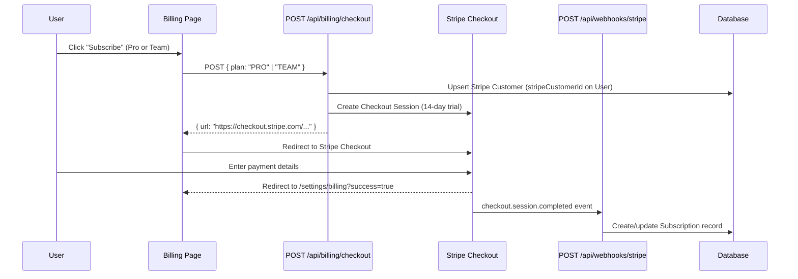
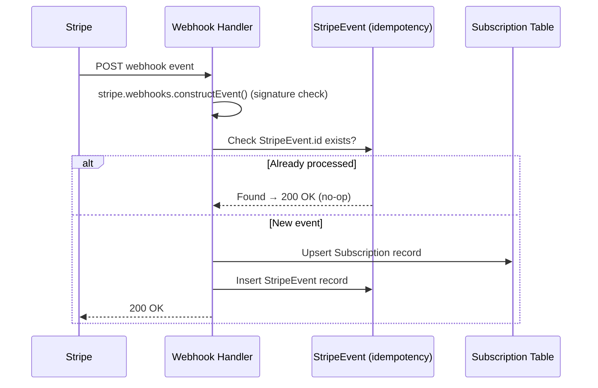
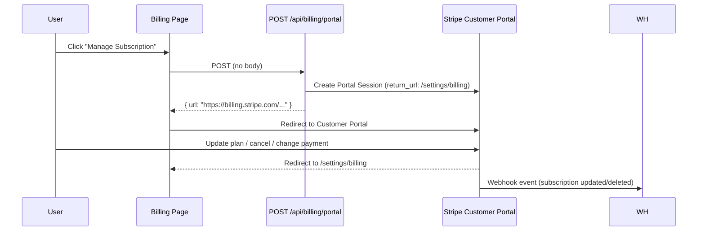

# Stripe Billing Integration


### Overview

**Package**: `stripe` (official Node.js SDK, server-side only)

**Architecture**: Uses Stripe-hosted Checkout and Customer Portal to minimize PCI scope. No payment data ever touches the application server.

**Setup** (`lib/billing/stripe.ts`):

```typescript
import Stripe from 'stripe';

export const stripe = new Stripe(process.env.STRIPE_SECRET_KEY!, {
  apiVersion: '2024-06-20',
});
```

### Checkout Flow



### Webhook Handler

**Endpoint**: `POST /api/webhooks/stripe`

**Auth**: Stripe signature verification via `stripe.webhooks.constructEvent()` using `STRIPE_WEBHOOK_SECRET`. The webhook route is excluded from auth middleware in `proxy.ts` (via the matcher pattern) since Stripe cannot present a session cookie.

**Idempotency**: Each event is checked against the `StripeEvent` table before processing. Duplicate events are silently ignored.

**Handled Events**:

| Event | Action |
|-------|--------|
| `checkout.session.completed` | Create or update Subscription record |
| `invoice.payment_succeeded` | Extend billing period; set status ACTIVE |
| `invoice.payment_failed` | Set status PAST_DUE; set `gracePeriodEndsAt` = now + 7 days |
| `customer.subscription.updated` | Sync plan, status, and period dates |
| `customer.subscription.deleted` | Set status CANCELED; user reverts to FREE limits |



### Customer Portal Flow



### Plan Configuration (`lib/billing/plans.ts`)

```typescript
export const PLANS: Record<SubscriptionPlan, PlanConfig> = {
  FREE:  { priceMonthly: 0,    stripePriceId: null,                         trial: { enabled: false, days: 0  } },
  PRO:   { priceMonthly: 1500, stripePriceId: process.env.STRIPE_PRO_PRICE_ID,  trial: { enabled: true,  days: 14 } },
  TEAM:  { priceMonthly: 3000, stripePriceId: process.env.STRIPE_TEAM_PRICE_ID, trial: { enabled: true,  days: 14 } },
};
```

Prices are stored in cents (USD). `null` `stripePriceId` means the plan has no Stripe billing.

### Feature Gating (`lib/billing/subscription.ts`)

```typescript
// Determine which plan limits apply given current status
export function getEffectivePlan(
  plan: SubscriptionPlan,
  status: string,
  gracePeriodEndsAt: Date | null
): SubscriptionPlan {
  if (status === 'CANCELED') return 'FREE';
  if (status === 'PAST_DUE' && gracePeriodEndsAt && new Date() > gracePeriodEndsAt) return 'FREE';
  return plan;
}
```

Gating is applied in:
- `POST /api/projects` — checks `maxProjects` limit
- `POST /api/tickets` — checks `maxTicketsPerMonth` limit (calendar month)
- `POST /api/projects/:projectId/members` — checks `membersEnabled`

### Environment Variables

```env
STRIPE_SECRET_KEY=sk_live_...          # Stripe secret key (server-side only)
STRIPE_WEBHOOK_SECRET=whsec_...        # Webhook signing secret
STRIPE_PRO_PRICE_ID=price_...          # Stripe Price ID for Pro plan
STRIPE_TEAM_PRICE_ID=price_...         # Stripe Price ID for Team plan
NEXT_PUBLIC_APP_URL=https://...        # Used for Checkout success/cancel redirect URLs
```

### Account Deletion

When a user is deleted (`lib/db/users.ts`), any active Stripe subscription is cancelled via `stripe.subscriptions.cancel(stripeSubscriptionId)` before the database record is removed.

