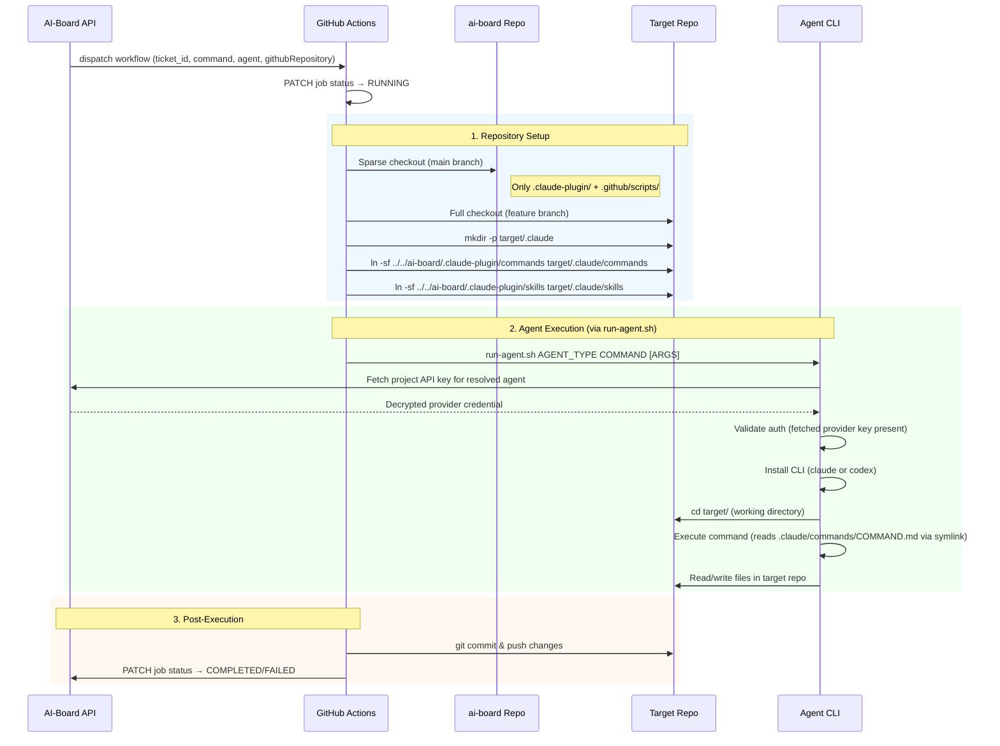

# Plugin Architecture

AI-Board plugin system: commands, scripts, templates, and skills distributed as a Claude Code plugin for both CI/CD workflows and local development.

## Plugin Overview

AI-Board is both a web application AND a development toolchain. The `.claude-plugin/` directory contains the complete toolchain that powers the automated development workflow. It can be:

1. **Used in CI/CD**: GitHub Actions workflows load the plugin via sparse checkout and symlink it into target projects
2. **Used locally**: Developers install the plugin via Claude Code's plugin system for local command access
3. **Self-hosted**: AI-Board uses its own plugin to manage itself (symlinks in `.claude/`)

## Plugin Structure

```
.claude-plugin/
├── plugin.json                          # Plugin metadata (name, version, description)
├── commands/                            # 17 slash commands (ai-board.*.md)
│   ├── ai-board.specify.md              # Generate feature specification
│   ├── ai-board.clarify.md              # Ask clarification questions on spec
│   ├── ai-board.plan.md                 # Generate implementation plan
│   ├── ai-board.tasks.md                # Generate tasks from plan
│   ├── ai-board.checklist.md            # Generate pre-implementation checklist
│   ├── ai-board.implement.md            # Execute tasks and generate summary
│   ├── ai-board.quick-impl.md           # Fast-track implementation (no spec/plan)
│   ├── ai-board.verify.md               # Run tests and validate implementation
│   ├── ai-board.iterate.md              # Fix issues during VERIFY stage
│   ├── ai-board.cleanup.md              # Technical debt cleanup
│   ├── ai-board.code-simplifier.md      # Simplify recently modified code
│   ├── ai-board.code-review.md          # Automated PR code review
│   ├── ai-board.sync-specifications.md  # Sync branch specs → global docs
│   ├── ai-board.assist.md               # AI assistant for @ai-board mentions
│   ├── ai-board.compare.md              # Compare tickets (telemetry/specs)
│   ├── ai-board.analyze.md              # Cross-artifact consistency analysis
│   └── ai-board.constitution.md         # Create/update project constitution
├── templates/                           # Document templates used by commands
│   ├── spec-template.md                 # Specification template
│   ├── plan-template.md                 # Implementation plan template
│   ├── tasks-template.md                # Tasks list template
│   ├── checklist-template.md            # Pre-implementation checklist template
│   ├── summary-template.md              # Implementation summary template (2300 chars max)
│   └── agent-file-template.md           # AGENTS.md template for Codex
├── scripts/                             # Shell scripts and utilities
│   ├── bash/
│   │   ├── common.sh                    # Shared functions (logging, API calls)
│   │   ├── create-new-feature.sh        # Create feature branch + spec directory
│   │   ├── setup-plan.sh               # Setup plan directory structure
│   │   ├── check-prerequisites.sh       # Validate environment before execution
│   │   ├── prepare-images.sh            # Process ticket image attachments
│   │   ├── detect-incomplete-implementation.sh  # Check for incomplete tasks
│   │   ├── transition-to-verify.sh      # Transition ticket to VERIFY stage
│   │   ├── create-pr-and-transition.sh  # Create PR + transition to VERIFY
│   │   ├── create-pr-only.sh            # Create PR without transition
│   │   ├── update-agent-context.sh      # Update agent context files
│   │   └── auto-ship-tickets.sh         # Auto-ship on production deploy
│   └── generate-test-report.js          # Generate test execution report
└── skills/                              # Claude Code skills
    └── testing/
        ├── SKILL.md                     # Testing skill entry point
        └── patterns/
            ├── unit.md                  # Unit test patterns
            ├── component.md             # Component test patterns
            ├── frontend-integration.md  # Frontend integration patterns
            ├── backend-integration.md   # Backend integration patterns
            └── e2e.md                   # E2E test patterns
```

## Command Catalog

### Command-to-Stage Mapping

Each command is designed to run at a specific workflow stage. Commands are invoked either by GitHub Actions workflows or locally via Claude Code.

| Command | Workflow Stage | Workflow File | Description |
|---------|---------------|---------------|-------------|
| `ai-board.specify` | SPECIFY | `speckit.yml` | Generate feature specification from ticket |
| `ai-board.clarify` | SPECIFY | `speckit.yml` | Ask up to 5 clarification questions on spec |
| `ai-board.plan` | PLAN | `speckit.yml` | Generate implementation plan from spec |
| `ai-board.tasks` | PLAN | `speckit.yml` | Generate dependency-ordered task list |
| `ai-board.checklist` | PLAN (optional) | `speckit.yml` | Generate pre-implementation checklist |
| `ai-board.implement` | BUILD | `speckit.yml` | Execute all tasks, generate summary |
| `ai-board.quick-impl` | BUILD | `quick-impl.yml` | Fast-track implementation (no spec/plan) |
| `ai-board.cleanup` | BUILD | `cleanup.yml` | Diff-based technical debt cleanup |
| `ai-board.verify` | VERIFY | `verify.yml` | Run tests and validate implementation |
| `ai-board.code-simplifier` | VERIFY | `verify.yml` | Simplify recently modified code |
| `ai-board.code-review` | VERIFY | `verify.yml` | Automated PR code review |
| `ai-board.sync-specifications` | VERIFY | `verify.yml` | Sync branch specs to global docs |
| `ai-board.iterate` | VERIFY | `iterate.yml` | Fix minor issues during review |
| `ai-board.assist` | Any (SPECIFY/PLAN/BUILD/VERIFY) | `ai-board-assist.yml` | AI assistance via @ai-board mentions |
| `ai-board.compare` | Any | `ai-board-assist.yml` | Compare tickets (telemetry + specs) |
| `ai-board.analyze` | Local only | — | Cross-artifact consistency analysis |
| `ai-board.constitution` | Local only | — | Create/update project constitution |

### Workflow Type → Command Sequence

**FULL workflow** (INBOX → SPECIFY → PLAN → BUILD → VERIFY → SHIP):
```
specify → [clarify] → plan → tasks → [checklist] → implement
    → verify → code-simplifier → sync-specifications → code-review
```

**QUICK workflow** (INBOX → BUILD → VERIFY → SHIP):
```
quick-impl → verify → code-simplifier → sync-specifications → code-review
```

**CLEAN workflow** (triggered → BUILD → VERIFY → SHIP):
```
cleanup → verify → code-simplifier → sync-specifications → code-review
```

### Local-Only Commands

Some commands are designed for local interactive use and are not triggered by workflows:

- **`ai-board.analyze`**: Run after task generation to check consistency between spec.md, plan.md, and tasks.md
- **`ai-board.constitution`**: Create or update the project constitution (`.ai-board/memory/constitution.md`)
- **`ai-board.compare`**: Can also be used locally to compare ticket implementations

## Plugin Installation

### Local Development (Claude Code Plugin)

Install the ai-board plugin for local command access:

```bash
/plugin install ai-board@github:bfernandez31/ai-board
```

This makes all `/ai-board.*` commands available in Claude Code sessions. Commands read from the installed plugin's `commands/` directory.

### Self-Management (ai-board repo)

AI-Board manages itself using symlinks to the plugin directory:

```
.claude/
├── commands → ../.claude-plugin/commands    # Symlink
└── skills   → ../.claude-plugin/skills      # Symlink (testing/)
```

This allows running `/ai-board.specify`, `/ai-board.implement`, etc. directly in the ai-board repository.

### External Projects (CI/CD Only — No Local Setup Yet)

Currently, external projects get commands only through CI/CD workflows. The plugin is loaded via sparse checkout and symlinked during workflow execution (see [Workflow Loading Mechanism](#workflow-loading-mechanism)).

**Future**: Project creation/import will include automatic plugin installation in external projects, enabling local command usage.

## Workflow Loading Mechanism

### Double Checkout Pattern

All workflows use a **sparse double checkout** to load ai-board commands into the target project context:

```
GitHub Actions Runner
├── ai-board/                          # Sparse checkout (main branch, always stable)
│   ├── .claude-plugin/                # Commands, templates, scripts, skills
│   └── .github/scripts/              # Workflow support scripts
└── target/                           # Full checkout (target project, feature branch)
    └── .claude/
        ├── commands → ../../ai-board/.claude-plugin/commands   # Symlink
        └── skills   → ../../ai-board/.claude-plugin/skills     # Symlink
```

### Step-by-Step Execution Flow



### Why Commands Come From Main Branch

The sparse checkout always uses ai-board's `main` branch, even when ai-board is working on itself. This ensures:

- **Stable toolchain**: Commands are always tested and merged before use
- **Consistent behavior**: All projects use the same command version
- **Safe self-management**: AI-Board can modify its own commands without breaking running workflows

### Script Invocation in Workflows

Workflow scripts are accessed via relative path from the target directory:

```yaml
# From target/ working directory, scripts are at ../ai-board/.claude-plugin/scripts/
- run: ../ai-board/.claude-plugin/scripts/bash/transition-to-verify.sh "$TICKET_ID" "$JOB_ID"

# Or from workflow root:
- run: .claude-plugin/scripts/bash/auto-ship-tickets.sh "$SHA" "$URL" "$TOKEN"
```

## Multi-Agent Support

### Agent Resolution

Before any workflow dispatch, the system resolves which agent (CLI) to use:

```
ticket.agent → project.defaultAgent → CLAUDE (fallback)
```

See [Agent Resolution](integrations.md#agent-resolution) for details.

### Agent-Specific Command Execution

The `run-agent.sh` script abstracts CLI differences:

| Aspect | Claude Code | Codex CLI |
|--------|------------|-----------|
| **Command invocation** | `claude --dangerously-skip-permissions "/COMMAND ARGS"` | Reads `.claude/commands/COMMAND.md`, pipes content via stdin to `codex exec` |
| **Project context** | Reads `CLAUDE.md` natively | Generates `AGENTS.md` from `CLAUDE.md` (max 32KB) |
| **Model** | `ANTHROPIC_MODEL` env var | `CODEX_MODEL` env var (default: `gpt-5-codex`) |
| **Reasoning** | N/A (built-in) | `CODEX_REASONING` env var (default: `high`) |
| **Credential source** | Project Anthropic API key fetched from ai-board API | Project OpenAI API key fetched from ai-board API |

### Command Compatibility

All 17 commands are designed to work with both agents. Key differences:

- **Claude**: Commands are invoked as native slash commands (`/ai-board.implement`)
- **Codex**: Command `.md` file content is read and injected as a prompt via stdin, with arguments appended

Both agents work in the same `target/` directory with the same symlinked commands, templates, and scripts.

### Telemetry Differences

Claude and Codex agents emit different telemetry data:

- **Claude**: Reports token usage (input/output), tool calls, and cache statistics natively via structured output
- **Codex**: Does not emit per-request token breakdowns; telemetry is limited to command exit codes and elapsed time. Token usage must be tracked externally via OpenAI API usage endpoints if needed

The job runner normalizes both into a common `agentMetrics` shape, falling back to `null` for fields the agent does not provide.

## Templates

Templates provide standardized document structures used by commands during artifact generation.

| Template | Used By | Purpose |
|----------|---------|---------|
| `spec-template.md` | `ai-board.specify` | Feature specification structure |
| `plan-template.md` | `ai-board.plan` | Implementation plan structure |
| `tasks-template.md` | `ai-board.tasks` | Task list with dependency ordering |
| `checklist-template.md` | `ai-board.checklist` | Pre-implementation verification checklist |
| `summary-template.md` | `ai-board.implement` | Post-implementation summary (2300 chars max) |
| `agent-file-template.md` | `run-agent.sh` (Codex) | AGENTS.md generation template |

Templates use `[PLACEHOLDER_NAME]` format for values filled by the command at runtime.

## Scripts

### Bash Scripts (`scripts/bash/`)

Support scripts called by workflows and commands. All scripts source `common.sh` for shared logging and API helper functions.

| Script | Called By | Purpose |
|--------|-----------|---------|
| `common.sh` | All scripts | Shared functions (logging, API calls, error handling) |
| `create-new-feature.sh` | `speckit.yml`, `quick-impl.yml` | Create branch + `specs/{branch}/` directory |
| `setup-plan.sh` | `speckit.yml` | Setup plan directory with template files |
| `check-prerequisites.sh` | Commands | Validate environment, required files, env vars |
| `prepare-images.sh` | `speckit.yml`, `quick-impl.yml` | Download and process ticket image attachments |
| `detect-incomplete-implementation.sh` | `speckit.yml` | Check for incomplete tasks after implement |
| `transition-to-verify.sh` | `speckit.yml`, `quick-impl.yml`, `cleanup.yml` | Transition ticket to VERIFY via API |
| `create-pr-and-transition.sh` | `verify.yml` | Create GitHub PR + transition ticket |
| `create-pr-only.sh` | `verify.yml` | Create GitHub PR without transition |
| `update-agent-context.sh` | Workflows | Update agent context files during execution |
| `auto-ship-tickets.sh` | `auto-ship.yml` | Auto-ship merged tickets on production deploy |

### Test Scripts

| Script | Location | Purpose |
|--------|----------|---------|
| `run-all-tests.sh` | `scripts/` (project root) | Run complete test suite (unit + integration + e2e) |
| `run-integration-tests.sh` | `scripts/` (project root) | Run integration tests with server management |
| `generate-test-report.js` | `.claude-plugin/scripts/` | Parse test results and generate formatted report |

**Note**: `run-all-tests.sh` and `run-integration-tests.sh` are project-level scripts (referenced by `package.json`), not plugin scripts. They live at `scripts/` in the project root because they are specific to each project's test infrastructure (dev server, ports, test runners). The `generate-test-report.js` script remains in the plugin because it is used by workflows across all projects.

## Skills

The plugin includes one skill: **testing**.

The testing skill (`skills/testing/SKILL.md`) provides test writing patterns for the project's Testing Trophy strategy. It includes specialized patterns for:

- **Unit tests**: Pure function testing, mocking patterns
- **Component tests**: React component testing with RTL
- **Frontend integration**: API mocking, user flow testing
- **Backend integration**: Database testing, API contract testing
- **E2E tests**: Playwright browser automation patterns

Invoked automatically when commands need to write tests, or manually via the `/ai-board:testing` skill.

## External Project Requirements

For an external project to work with ai-board workflows:

**Required**:
- A GitHub repository accessible via `GH_PAT`
- Standard project structure (package.json, source code)

**Optional but recommended**:
- `CLAUDE.md` at project root (project context for the AI agent)
- `.ai-board/memory/constitution.md` (project standards and conventions)
- Test infrastructure (for VERIFY stage)

**Not required**:
- No workflow files in the external project
- No `.claude/` directory (created by workflow via symlink)
- No ai-board dependencies or configuration
