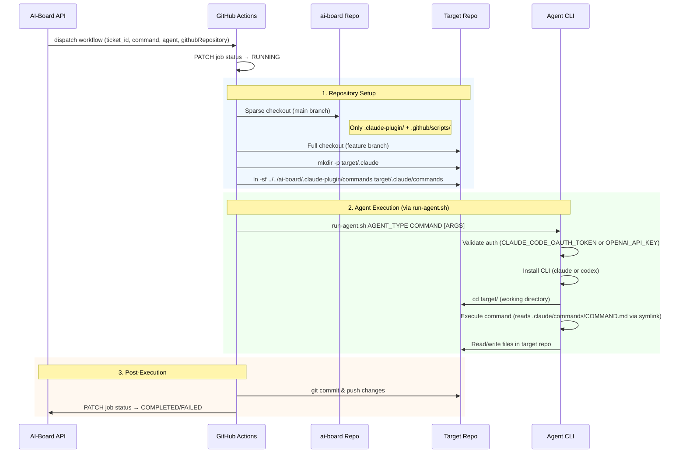

# Plugin Architecture

AI-Board plugin system: commands, scripts, and templates distributed as a Claude Code plugin for both CI/CD workflows and local development.

## Plugin Overview

AI-Board is both a web application AND a development toolchain. The `.claude-plugin/` directory contains the complete toolchain that powers the automated development workflow. It can be:

1. **Used in CI/CD**: GitHub Actions workflows load the plugin via sparse checkout and symlink it into target projects
2. **Used locally**: Developers install the plugin via Claude Code's plugin system for local command access
3. **Self-hosted**: AI-Board uses its own plugin to manage itself (symlinks in `.claude/`)

## Plugin Structure

```
.claude-plugin/
├── plugin.json                          # Plugin metadata (name, version, description)
├── commands/                            # 23 slash commands (ai-board.*.md)
│   ├── ai-board.specify.md              # Generate feature specification
│   ├── ai-board.clarify.md              # Ask clarification questions on spec
│   ├── ai-board.plan.md                 # Generate implementation plan
│   ├── ai-board.tasks.md                # Generate tasks from plan
│   ├── ai-board.checklist.md            # Generate pre-implementation checklist
│   ├── ai-board.implement.md            # Execute tasks and generate summary
│   ├── ai-board.quick-impl.md           # Fast-track implementation (no spec/plan)
│   ├── ai-board.verify.md               # Run tests and validate implementation
│   ├── ai-board.iterate.md              # Fix issues during VERIFY stage
│   ├── ai-board.cleanup.md              # Technical debt cleanup
│   ├── ai-board.code-simplifier.md      # Simplify recently modified code
│   ├── ai-board.code-review.md          # Automated PR code review
│   ├── ai-board.sync-specifications.md  # Sync branch specs → global docs
│   ├── ai-board.assist.md               # AI assistant for @ai-board mentions
│   ├── ai-board.compare.md              # Compare tickets (telemetry/specs)
│   ├── ai-board.fix.md                  # Fix PR review findings (all sources)
│   ├── ai-board.analyze.md              # Cross-artifact consistency analysis
│   ├── ai-board.constitution.md         # Create/update project constitution
│   ├── ai-board.health-security.md      # Health scan: OWASP/security analysis
│   ├── ai-board.health-compliance.md    # Health scan: constitution compliance analysis
│   ├── ai-board.health-tests.md         # Health scan: test execution + auto-fix
│   ├── ai-board.health-spec-sync.md     # Health scan: spec/code drift detection
│   ├── ai-board.health-review-quality.md # Health scan: PR review quality analysis
│   └── ai-board.onboard.md              # Project onboarding: generate CLAUDE.md, constitution.md, AGENTS.md
├── templates/                           # Document templates used by commands
│   ├── spec-template.md                 # Specification template
│   ├── plan-template.md                 # Implementation plan template
│   ├── tasks-template.md                # Tasks list template
│   ├── checklist-template.md            # Pre-implementation checklist template
│   ├── summary-template.md              # Implementation summary template (2300 chars max)
│   └── agent-file-template.md           # Agent instruction file template
├── scripts/                             # Shell scripts and utilities
│   ├── bash/
│   │   ├── common.sh                    # Shared functions (logging, API calls)
│   │   ├── create-new-feature.sh        # Create feature branch + spec directory
│   │   ├── setup-plan.sh               # Setup plan directory structure
│   │   ├── check-prerequisites.sh       # Validate environment before execution
│   │   ├── prepare-images.sh            # Process ticket image attachments
│   │   ├── detect-incomplete-implementation.sh  # Check for incomplete tasks
│   │   ├── transition-to-verify.sh      # Transition ticket to VERIFY stage
│   │   ├── create-pr-and-transition.sh  # Create PR + transition to VERIFY
│   │   ├── create-pr-only.sh            # Create PR without transition
│   │   ├── update-agent-context.sh      # Update agent context files
│   │   ├── auto-ship-tickets.sh         # Auto-ship on production deploy
│   │   ├── run-health-tests.sh          # Generic test orchestrator for health scans
│   │   └── run-tests-with-reports.sh    # Config-driven test runner with framework parsers
│   └── generate-test-report.js          # Generate test execution report
```

## Command Catalog

### Command-to-Stage Mapping

Each command is designed to run at a specific workflow stage. Commands are invoked either by GitHub Actions workflows or locally via Claude Code. In CI, the `run-agent.sh` wrapper adapts the same command markdown to Claude, Codex, Mistral, and Gemini runtimes.

| Command | Workflow Stage | Workflow File | Description |
|---------|---------------|---------------|-------------|
| `ai-board.specify` | SPECIFY | `speckit.yml` | Generate feature specification from ticket |
| `ai-board.clarify` | SPECIFY | `speckit.yml` | Ask up to 5 clarification questions on spec |
| `ai-board.plan` | PLAN | `speckit.yml` | Generate implementation plan from spec |
| `ai-board.tasks` | PLAN | `speckit.yml` | Generate dependency-ordered task list |
| `ai-board.checklist` | PLAN (optional) | `speckit.yml` | Generate pre-implementation checklist |
| `ai-board.implement` | BUILD | `speckit.yml` | Execute all tasks, generate summary |
| `ai-board.quick-impl` | BUILD | `quick-impl.yml` | Fast-track implementation (no spec/plan) |
| `ai-board.cleanup` | BUILD | `cleanup.yml` | Diff-based technical debt cleanup |
| `ai-board.verify` | VERIFY | `verify.yml` | Run tests and validate implementation |
| `ai-board.code-simplifier` | VERIFY | `verify.yml` | Simplify recently modified code |
| `ai-board.code-review` | VERIFY | `verify.yml` | Automated PR code review |
| `ai-board.sync-specifications` | VERIFY | `verify.yml` | Sync branch specs to global docs |
| `ai-board.iterate` | VERIFY | `iterate.yml` | Fix minor issues during review |
| `ai-board.assist` | Any (SPECIFY/PLAN/BUILD/VERIFY) | `ai-board-assist.yml` | AI assistance via @ai-board mentions |
| `ai-board.compare` | Any | `ai-board-assist.yml` | Compare tickets (telemetry + specs) |
| `ai-board.fix` | VERIFY | `ai-board-assist.yml` | Fix PR review findings from all sources (ai-board, Codex, Copilot) via `/fix` command |
| `ai-board.inbox-analysis` | INBOX | `inbox-analysis.yml` | Two-stage friction-risk analysis on an INBOX ticket (always Claude/Sonnet 4.6) |
| `ai-board.analyze` | Local only | — | Cross-artifact consistency analysis |
| `ai-board.constitution` | Local only | — | Create/update project constitution |
| `ai-board.health-security` | Health scan | `health-scan.yml` | OWASP Top 10 security analysis; outputs `SecurityReport` JSON |
| `ai-board.health-compliance` | Health scan | `health-scan.yml` | Constitution principle compliance analysis; outputs `ComplianceReport` JSON |
| `ai-board.health-tests` | Health scan | `health-scan.yml` | Full test-suite execution with auto-fix workflow; outputs `TestsReport` JSON |
| `ai-board.health-spec-sync` | Health scan | `health-scan.yml` | Bidirectional spec/code drift detection; outputs `SpecSyncReport` JSON |
| `ai-board.onboard` | Project setup | `onboard.yml` | Generate project-specific CLAUDE.md, constitution.md, and AGENTS.md from codebase analysis |

### Workflow Type → Command Sequence

**FULL workflow** (INBOX → SPECIFY → PLAN → BUILD → VERIFY → SHIP):
```
specify → [clarify] → plan → tasks → [checklist] → implement
    → verify → code-simplifier → sync-specifications → code-review
```

**QUICK workflow** (INBOX → BUILD → VERIFY → SHIP):
```
quick-impl → verify → code-simplifier → sync-specifications → code-review
```

**CLEAN workflow** (triggered → BUILD → VERIFY → SHIP):
```
cleanup → verify → code-simplifier → sync-specifications → code-review
```

### Local-Only Commands

Some commands are designed for local interactive use and are not triggered by workflows:

- **`ai-board.analyze`**: Run after task generation to check consistency between spec.md, plan.md, and tasks.md
- **`ai-board.constitution`**: Create or update the project constitution (`.ai-board/memory/constitution.md`)
- **`ai-board.compare`**: Can also be used locally to compare ticket implementations

## Plugin Installation

### Local Development (Claude Code Plugin)

Install the ai-board plugin for local command access:

```bash
/plugin install ai-board@github:bfernandez31/ai-board
```

This makes all `/ai-board.*` commands available in Claude Code sessions. Commands read from the installed plugin's `commands/` directory.

### Self-Management (ai-board repo)

AI-Board manages itself using a symlink to the plugin directory:

```
.claude/
└── commands → ../.claude-plugin/commands    # Symlink
```

This allows running `/ai-board.specify`, `/ai-board.implement`, etc. directly in the ai-board repository.

### External Projects (CI/CD Only — No Local Setup Yet)

Currently, external projects get commands only through CI/CD workflows. The plugin is loaded via sparse checkout and symlinked during workflow execution (see [Workflow Loading Mechanism](#workflow-loading-mechanism)).

**Future**: Project creation/import will include automatic plugin installation in external projects, enabling local command usage.

## Workflow Loading Mechanism

### Double Checkout Pattern

All workflows use a **sparse double checkout** to load ai-board commands into the target project context:

```
GitHub Actions Runner
├── ai-board/                          # Sparse checkout (main branch, always stable)
│   ├── .claude-plugin/                # Commands, templates, scripts
│   └── .github/scripts/              # Workflow support scripts
└── target/                           # Full checkout (target project, feature branch)
    └── .claude/
        └── commands → ../../ai-board/.claude-plugin/commands   # Symlink
```

### Step-by-Step Execution Flow


```mermaid
sequenceDiagram
    participant API as AI-Board API
    participant GH as GitHub Actions
    participant AIB as ai-board Repo
    participant TGT as Target Repo
    participant CLI as Agent CLI

    API->>GH: dispatch workflow (ticket_id, command, agent, githubRepository)
    GH->>GH: PATCH job status → RUNNING

    rect rgb(240, 248, 255)
        Note over GH,TGT: 1. Repository Setup
        GH->>AIB: Sparse checkout (main branch)
        Note right of AIB: Only .claude-plugin/ + .github/scripts/
        GH->>TGT: Full checkout (feature branch)
        GH->>TGT: mkdir -p target/.claude
        GH->>TGT: ln -sf ../../ai-board/.claude-plugin/commands target/.claude/commands
    end

    rect rgb(240, 255, 240)
        Note over GH,CLI: 2. Agent Execution (via run-agent.sh)
        GH->>CLI: run-agent.sh AGENT_TYPE COMMAND [ARGS]
        CLI->>CLI: Validate auth (CLAUDE_CODE_OAUTH_TOKEN or OPENAI_API_KEY)
        CLI->>CLI: Install CLI (claude or codex)
        CLI->>TGT: cd target/ (working directory)
        CLI->>CLI: Execute command (reads .claude/commands/COMMAND.md via symlink)
        CLI->>TGT: Read/write files in target repo
    end

    rect rgb(255, 248, 240)
        Note over GH,API: 3. Post-Execution
        GH->>TGT: git commit & push changes
        GH->>API: PATCH job status → COMPLETED/FAILED
    end
```

### Why Commands Come From Main Branch

The sparse checkout always uses ai-board's `main` branch, even when ai-board is working on itself. This ensures:

- **Stable toolchain**: Commands are always tested and merged before use
- **Consistent behavior**: All projects use the same command version
- **Safe self-management**: AI-Board can modify its own commands without breaking running workflows

### Script Invocation in Workflows

Workflow scripts are accessed via relative path from the target directory:

```yaml
# From target/ working directory, scripts are at ../ai-board/.claude-plugin/scripts/
- run: ../ai-board/.claude-plugin/scripts/bash/transition-to-verify.sh "$TICKET_ID" "$JOB_ID"

# Or from workflow root:
- run: .claude-plugin/scripts/bash/auto-ship-tickets.sh "$SHA" "$URL" "$TOKEN"
```

## Multi-Agent Support

### Agent Resolution

Before any workflow dispatch, the system resolves which agent (CLI) to use:

```
ticket.agent → project.defaultAgent → CLAUDE (fallback)
```

See [Agent Resolution](integrations/github.md#agent-resolution) for details.

### Agent-Specific Command Execution

The `run-agent.sh` script abstracts CLI differences:

| Aspect | Claude Code | Codex CLI | Mistral vibe CLI | Gemini CLI |
|--------|-------------|-----------|------------------|------------|
| **Command invocation** | `claude --dangerously-skip-permissions "/COMMAND ARGS"` | Reads command markdown, injects structured invocation context, executes via `codex exec` | Reads command markdown, injects structured invocation context, executes via `vibe --prompt ... --agent auto-approve` | Reads command markdown, injects structured invocation context, executes via `gemini --prompt=... --approval-mode=yolo` |
| **Project context** | Reads `CLAUDE.md` natively | Reads `AGENTS.md` at project root via auto-discovery | Reads `AGENTS.md` at project root | Reads `AGENTS.md` at project root |
| **Model** | `ANTHROPIC_MODEL` env var (default: `claude-opus-4-7`) | `CODEX_MODEL` env var (default: `gpt-5.4`) | CLI default / configured by vibe | CLI default / configured by Gemini runtime |
| **Per-stage selection** | Resolved from ticket/project per-stage config and routed to `ANTHROPIC_MODEL` when `inputs.agent == 'CLAUDE'` | Resolved from ticket/project per-stage config and routed to `CODEX_MODEL` when `inputs.agent == 'CODEX'` | N/A | N/A |
| **Reasoning** | N/A (built-in) | `CODEX_REASONING` env var (default: `high`) | N/A | N/A |
| **Auth** | `CLAUDE_CODE_OAUTH_TOKEN` | `OPENAI_API_KEY` or `CODEX_AUTH_JSON` | `MISTRAL_API_KEY` | `GEMINI_API_KEY` or `GEMINI_OAUTH_JSON` |

### Command Compatibility

Core ticket workflow commands (`specify`, `plan`, `tasks`, `implement`, `quick-impl`, `verify`, `iterate`, `code-simplifier`, `sync-specifications`) are designed to run through the shared runner across supported agents.

Key differences:

- **Claude**: Commands are invoked as native slash commands (`/ai-board.implement`)
- **Non-Claude agents**: Command markdown is adapted into a prompt with structured invocation context. Large payloads can be passed via workspace files (`--input-file`, `--extra-file`) rather than raw inline argument concatenation.

Some commands remain agent-specific or workflow-restricted. For example, `code-review` is Claude-only, and setup / retro-spec / health-scan flows may explicitly reject unsupported agents.

### Telemetry Differences

Agents emit different telemetry shapes:

- **Claude / Codex**: OTLP log events
- **Mistral**: normalized batch JSON after command execution
- **Gemini**: native `gemini_cli.*` OTLP log events during command execution

The job runner normalizes these into a common `agentMetrics` shape, falling back to `null` or unavailable-cost status for fields a provider does not expose directly.

## Templates

Templates provide standardized document structures used by commands during artifact generation.

| Template | Used By | Purpose |
|----------|---------|---------|
| `spec-template.md` | `ai-board.specify` | Feature specification structure |
| `plan-template.md` | `ai-board.plan` | Implementation plan structure |
| `tasks-template.md` | `ai-board.tasks` | Task list with dependency ordering |
| `checklist-template.md` | `ai-board.checklist` | Pre-implementation verification checklist |
| `summary-template.md` | `ai-board.implement` | Post-implementation summary (2300 chars max) |
| `agent-file-template.md` | `update-agent-context.sh` | Template for agent instruction files created or updated from plan data |

Templates use `[PLACEHOLDER_NAME]` format for values filled by the command at runtime.

## Scripts

### Workflow Support Scripts (`.github/scripts/`)

Low-level scripts invoked directly by GitHub Actions workflow YAML. Not part of the plugin — loaded via sparse checkout of the ai-board repo.

| Script | Called By | Purpose |
|--------|-----------|---------|
| `run-command.sh` | All workflows | Config-driven command executor: reads `.ai-board/config.yml` and runs the command mapped to a given key. Exits 0 silently when config is absent or the key is not defined, enabling backward compatibility for non-onboarded repos. |
| `setup-environment.sh` | All workflows | Centralized environment setup with `--phase` parameter: `lightweight` installs only symlinks and runtime tools (for specify/plan); `full` also installs project dependencies, Prisma, and Playwright (for implement/build/verify). Defaults to `full` when `--phase` is omitted. |
| `run-agent.sh` | All workflows | Agent CLI abstraction: invokes Claude Code or Codex depending on the `agent` input. |
| `setup-test-env.sh` | All workflows (implement/verify) | Config-driven test environment setup: runs `commands.env_setup` from `.ai-board/config.yml` if defined, falls back to `.env.test` template injection, skips gracefully for external projects without either. |
| `fetch-telemetry.sh` | Various | Collect and report workflow telemetry to the API. |
| `fetch-repo-token.sh` | Various | Fetch the project owner's GitHub OAuth token via `GET /api/internal/github-token`; falls back to `GH_PAT` secret if the owner token is unavailable. Outputs the token to stdout and masks it in GitHub Actions logs. |

### Bash Scripts (`scripts/bash/`)

Support scripts called by workflows and commands. All scripts source `common.sh` for shared logging and API helper functions.

| Script | Called By | Purpose |
|--------|-----------|---------|
| `common.sh` | All scripts | Shared functions (logging, API calls, error handling) |
| `create-new-feature.sh` | `speckit.yml`, `quick-impl.yml` | Create branch + `specs/{branch}/` directory |
| `setup-plan.sh` | `speckit.yml` | Setup plan directory with template files |
| `check-prerequisites.sh` | Commands | Validate environment, required files, env vars |
| `prepare-images.sh` | `speckit.yml`, `quick-impl.yml` | Download and process ticket image attachments |
| `detect-incomplete-implementation.sh` | `speckit.yml` | Check for incomplete tasks after implement |
| `transition-to-verify.sh` | `speckit.yml`, `quick-impl.yml`, `cleanup.yml` | Transition ticket to VERIFY via API |
| `create-pr-and-transition.sh` | `verify.yml` | Create GitHub PR + transition ticket |
| `create-pr-only.sh` | `verify.yml` | Create GitHub PR without transition |
| `update-agent-context.sh` | Workflows | Update agent context files during execution |
| `auto-ship-tickets.sh` | `auto-ship.yml` | Auto-ship merged tickets on production deploy |
| `run-health-tests.sh` | `health-scan.yml` | Generic test orchestrator for health scans: reads `config.yml` for test commands and framework, calls `run-tests-with-reports.sh`, manages the fix loop (max 3 iterations with LLM agent + degradation guard), writes `/tmp/health-scan-result.json`; returns SKIPPED when no test command is configured |
| `run-tests-with-reports.sh` | `run-health-tests.sh` | Config-driven test runner: reads `testing.framework` and `commands.test*` from `config.yml`, runs commands with framework-specific JSON reporter flags, parses results using framework-appropriate parsers (vitest, jest, pytest, cargo-test, go-test, rspec, phpunit, exit-code fallback), writes `/tmp/test-report-summary.json`; always exits 0 |

### Test Scripts

| Script | Location | Purpose |
|--------|----------|---------|
| `run-all-tests.sh` | `scripts/` (project root) | Run complete test suite (unit + integration + e2e) |
| `run-integration-tests.sh` | `scripts/` (project root) | Run integration tests with server management |
| `generate-test-report.js` | `.claude-plugin/scripts/` | Parse test results and generate formatted report |

**Note**: `run-all-tests.sh` and `run-integration-tests.sh` are project-level scripts (referenced by `package.json`), not plugin scripts. They live at `scripts/` in the project root because they are specific to each project's test infrastructure (dev server, ports, test runners). The `generate-test-report.js` script remains in the plugin because it is used by workflows across all projects.

## External Project Requirements

For an external project to work with ai-board workflows:

**Required**:
- A GitHub repository accessible via `GH_PAT`
- Standard project structure (package.json, source code)
- `.ai-board/config.yml` — declarative config file declaring the project's language, runtime, package manager, install command, optional tooling commands, services, and agent preferences (see [Config Schema](#config-schema))

**Optional but recommended**:
- `CLAUDE.md` at project root (project context for the AI agent)
- `.ai-board/memory/constitution.md` (project standards and conventions)
- Test infrastructure (for VERIFY stage)

**Not required**:
- No workflow files in the external project
- No `.claude/` directory (created by workflow via symlink)
- No ai-board package dependencies

## Config Schema

External projects declare their environment via `.ai-board/config.yml` (schema version 1). The file is validated by `lib/validations/config.ts` and loaded by `lib/config-loader.ts` at workflow startup.

### Required Fields

| Field | Type | Description |
|-------|------|-------------|
| `version` | `1` (literal) | Schema version — must be `1` |
| `project.name` | string | Project name |
| `project.language` | enum \| null | `typescript` \| `javascript` \| `python` \| `go` \| `rust` \| `java` \| `kotlin` \| `ruby` \| `php` \| `null` |
| `runtime.manager` | enum | `bun` \| `npm` \| `yarn` \| `pnpm` \| `pip` \| `poetry` \| `cargo` \| `maven` \| `gradle` \| `bundler` \| `composer` \| `zig` |
| `commands.install` | string | Install command (e.g., `bun install`) |

### Optional Fields

| Field | Type | Default | Description |
|-------|------|---------|-------------|
| `project.framework` | enum | `none` | `nextjs` \| `express` \| `fastapi` \| `django` \| `gin` \| `none` |
| `runtime.manager_version` | string | — | Package manager / toolchain version pin. Auto-detected from `packageManager` in `package.json` (Node managers, integrity hash stripped) or `.minimum_zig_version` in `build.zig.zon` (Zig). Honored by `setup-environment.sh` when installing the runtime; falls back to latest stable when omitted. |
| `runtime.node` | string | — | Node.js version. Auto-detected from `.nvmrc`, `.node-version`, or `package.json#engines.node`. |
| `runtime.python` | string | — | Python version. Auto-detected from `.python-version`. |
| `runtime.java` | string | — | Java version. Auto-detected from `.java-version` or the `java=` entry in `.sdkmanrc`. |
| `runtime.go` | string | — | Go version. Auto-detected from the `go` directive in `go.mod`. |
| `runtime.rust` | string | — | Rust toolchain channel. Auto-detected from `rust-toolchain.toml`. |
| `runtime.system_packages` | string[] | — | OS-level apt packages installed by `setup-environment.sh` during phase `full`, before the package manager. Use for projects that link against native libraries (X11, OpenGL, SDL, libssl, etc.). Each entry must be a valid Debian package name matching `/^[a-z0-9][a-z0-9+.\-]*$/` — leading `-`, slashes, spaces, and quoting characters are rejected at validation time to prevent apt-option injection when entries reach `apt-get install`. Requires a Debian/Ubuntu runner; fails clearly if `apt-get` is unavailable. |
| `commands.build` | string | — | Build command (skipped if absent) |
| `commands.lint` | string | — | Lint command (auto-detected by `detect-stack.sh`; skipped if absent) |
| `commands.type_check` | string | — | Type-check command (auto-detected; skipped if absent) |
| `commands.test` | string | — | Primary test command (auto-detected; used when granular commands are not set) |
| `commands.test_unit` | string | — | Unit test command (skipped if absent) |
| `commands.test_integration` | string | — | Integration test command (skipped if absent) |
| `commands.test_e2e` | string | — | E2E test command (skipped if absent) |
| `commands.dev_server` | string | — | Dev server startup command for integration/E2E tests (e.g., `TEST_MODE=true bun run dev`) |
| `testing.framework` | string | — | Test framework identifier (auto-detected): `vitest` \| `jest` \| `pytest` \| `cargo-test` \| `go-test` \| `rspec` \| `phpunit` |
| `testing.e2e` | boolean | `false` | Whether an E2E testing framework (Playwright, Cypress, Selenium) is detected |
| `testing.e2e_framework` | string | — | E2E framework identifier: `playwright` \| `cypress` \| `selenium` |
| `services` | array | `[]` | Sidecar services (postgres, redis, mysql, mongo) |
| `env` | object | `{}` | Flat key-value map of CI environment variables |
| `agent.cli` | enum | `claude-code` | `claude-code` \| `codex` |
| `agent.model` | string | — | Model name override (free-form) |

### Minimal Example

```yaml
version: 1

project:
  name: my-app
  language: typescript

runtime:
  manager: bun

commands:
  install: bun install
  lint: bun run lint
  type_check: bun run type-check
  test_unit: bun run test:unit
```

### Validation Behavior

- Missing required fields produce structured errors with field path and guidance on how to fix them.
- All errors are collected in a single pass (not fail-on-first).
- Unknown fields at the top level or within known sections produce warnings (not errors), supporting forward compatibility.
- A missing `.ai-board/config.yml` file fails immediately with: "Missing .ai-board/config.yml — this file is required for ai-board to operate on your project." (API-side validation only.)
- At runtime, `run-command.sh` exits 0 silently when `.ai-board/config.yml` is absent, enabling backward compatibility for repos that have not yet created a config file. `setup-environment.sh` is only called for onboarded projects and still requires the config.
