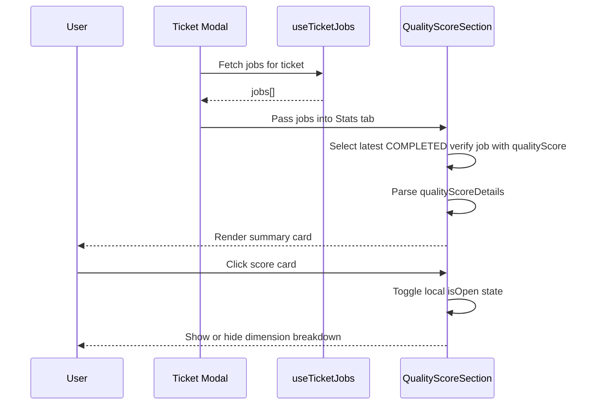

# State Management Implementation

Complete guide to TanStack Query usage, optimistic updates, and client-side state patterns.

## TanStack Query v5.90.5

### Core Configuration

**Query Client Setup** (`app/providers.tsx`):

```typescript
import { QueryClient, QueryClientProvider } from '@tanstack/react-query';

const queryClient = new QueryClient({
  defaultOptions: {
    queries: {
      staleTime: 1000 * 60 * 5,        // 5 minutes
      gcTime: 1000 * 60 * 10,           // 10 minutes (formerly cacheTime)
      refetchOnWindowFocus: true,       // Refetch when tab gains focus
      refetchOnReconnect: true,         // Refetch on network reconnection
      retry: 3,                         // Retry failed requests 3 times
      retryDelay: (attemptIndex) =>
        Math.min(1000 * 2 ** attemptIndex, 30000),  // Exponential backoff
    },
    mutations: {
      retry: 1,                         // Retry mutations once
    },
  },
});

export function Providers({ children }: { children: React.ReactNode }) {
  return (
    <QueryClientProvider client={queryClient}>
      {children}
    </QueryClientProvider>
  );
}
```

### Query Key Factory

**Hierarchical Keys** (`app/lib/query-keys.ts`):

```typescript
export const queryKeys = {
  all: ['projects'] as const,

  projects: {
    all: () => [...queryKeys.all] as const,
    detail: (projectId: number) => [...queryKeys.all, projectId] as const,

    tickets: (projectId: number) => [...queryKeys.projects.detail(projectId), 'tickets'] as const,
    ticket: (projectId: number, ticketId: number) =>
      [...queryKeys.projects.tickets(projectId), ticketId] as const,

    comments: (projectId: number, ticketId: number) =>
      [...queryKeys.projects.ticket(projectId, ticketId), 'comments'] as const,

    jobs: (projectId: number) => [...queryKeys.projects.detail(projectId), 'jobs'] as const,
    ticketJobs: (projectId: number, ticketId: number) =>
      [...queryKeys.projects.detail(projectId), 'tickets', ticketId, 'jobs'] as const,
  },
};
```

**Benefits**:
- Hierarchical invalidation (invalidate all tickets: `queryKeys.projects.tickets(1)`)
- Type-safe keys
- Consistent across codebase
- Easy cache debugging

## Query Hooks

### Tickets Query

**Hook** (`app/lib/hooks/queries/useTickets.ts`):

```typescript
import { useQuery } from '@tanstack/react-query';
import { queryKeys } from '@/app/lib/query-keys';

export function useTickets(projectId: number) {
  return useQuery({
    queryKey: queryKeys.projects.tickets(projectId),
    queryFn: async () => {
      const response = await fetch(`/api/projects/${projectId}/tickets`);

      if (!response.ok) {
        throw new Error('Failed to fetch tickets');
      }

      return response.json();
    },
    staleTime: 1000 * 60,  // 1 minute
  });
}
```

**Usage**:

```typescript
function BoardComponent({ projectId }: { projectId: number }) {
  const { data, isLoading, error } = useTickets(projectId);

  if (isLoading) return <LoadingSpinner />;
  if (error) return <ErrorMessage error={error} />;

  return <Board tickets={data.tickets} />;
}
```

### Comments Query with Polling

**Hook** (`app/lib/hooks/queries/useComments.ts`):

```typescript
export function useComments(projectId: number, ticketId: number, options?: {
  enabled?: boolean;
  pollingInterval?: number;
}) {
  return useQuery({
    queryKey: queryKeys.projects.comments(projectId, ticketId),
    queryFn: async () => {
      const response = await fetch(
        `/api/projects/${projectId}/tickets/${ticketId}/comments`
      );

      if (!response.ok) throw new Error('Failed to fetch comments');

      return response.json();
    },
    enabled: options?.enabled ?? true,
    refetchInterval: options?.pollingInterval ?? 10000,  // 10 seconds
    staleTime: 0,  // Always consider stale for real-time updates
  });
}
```

**Features**:
- **Polling**: Automatic refetch every 10 seconds
- **Conditional**: Can disable via `enabled` option
- **Real-time**: Stale time 0 for immediate updates

### Job Polling Hook

**Hook** (`app/lib/hooks/useJobPolling.ts`):

```typescript
export function useJobPolling(projectId: number) {
  const [terminalJobIds, setTerminalJobIds] = useState<Set<number>>(new Set());

  const { data, isError } = useQuery({
    queryKey: queryKeys.projects.jobs(projectId),
    queryFn: async () => {
      const response = await fetch(`/api/projects/${projectId}/jobs/status`);

      if (!response.ok) throw new Error('Failed to fetch job status');

      return response.json();
    },
    refetchInterval: (query) => {
      const jobs = query.state.data?.jobs || [];

      // Stop polling when all jobs terminal
      const allTerminal = jobs.every((job: Job) =>
        ['COMPLETED', 'FAILED', 'CANCELLED'].includes(job.status)
      );

      return allTerminal ? false : 2000;  // 2 seconds or stop
    },
    staleTime: 0,
  });

  // Track terminal jobs
  useEffect(() => {
    if (data?.jobs) {
      const newTerminalIds = new Set(terminalJobIds);

      data.jobs.forEach((job: Job) => {
        if (['COMPLETED', 'FAILED', 'CANCELLED'].includes(job.status)) {
          newTerminalIds.add(job.id);
        }
      });

      setTerminalJobIds(newTerminalIds);
    }
  }, [data]);

  return {
    jobs: data?.jobs || [],
    isPolling: !isError && data?.jobs.some((job: Job) =>
      !['COMPLETED', 'FAILED', 'CANCELLED'].includes(job.status)
    ),
    error: isError,
  };
}
```

**Features**:
- **Auto-Stop**: Polling stops when all jobs terminal
- **Auto-Resume**: Polling resumes when new jobs created
- **Terminal Tracking**: Client tracks which jobs completed
- **2-Second Interval**: Real-time feel
- **Cache Invalidation**: Automatically invalidates tickets and ticketJobs caches when job reaches terminal state

### Ticket Search Query Hook

**Hook** (`app/lib/hooks/queries/useTicketSearch.ts`):

```typescript
import { useQuery } from '@tanstack/react-query';
import { queryKeys } from '@/app/lib/query-keys';
import type { SearchResponse } from '@/app/lib/types/search';

export function useTicketSearch(
  projectId: number,
  query: string,
  options?: {
    enabled?: boolean;
    limit?: number;
  }
) {
  const enabled = options?.enabled ?? query.length >= 2;
  const limit = options?.limit ?? 10;

  return useQuery<SearchResponse>({
    queryKey: [...queryKeys.projects.tickets(projectId), 'search', query, limit],
    queryFn: async () => {
      const params = new URLSearchParams({
        q: query,
        limit: String(limit),
      });

      const response = await fetch(
        `/api/projects/${projectId}/tickets/search?${params}`
      );

      if (!response.ok) {
        throw new Error('Failed to search tickets');
      }

      return response.json();
    },
    enabled,
    staleTime: 1000 * 60,  // 1 minute
  });
}
```

**Features**:
- **Conditional Activation**: Only runs when query is 2+ characters
- **Configurable Limit**: Defaults to 10 results
- **Cache Integration**: Uses hierarchical query keys
- **Type-Safe Response**: Returns `SearchResponse` with `results` and `totalCount`

**Usage in Autocomplete**:
```typescript
function TicketAutocomplete({ projectId, query }: Props) {
  const { data } = useTicketSearch(projectId, query);

  return (
    <DropdownMenu>
      {data?.results.map((ticket) => (
        <DropdownMenuItem key={ticket.id}>
          {ticket.ticketKey} - {ticket.title}
        </DropdownMenuItem>
      ))}
    </DropdownMenu>
  );
}
```

**Search Endpoint**: `/api/projects/:projectId/tickets/search`
- Searches ticket keys, titles, and descriptions
- Includes both active tickets (INBOX through SHIP) and CLOSED tickets
- Supports fuzzy matching
- Scoped to project (authorization enforced)
- Returns stage field for each ticket to identify CLOSED tickets

### Ticket by Key Query Hook

**Hook** (`app/lib/hooks/queries/useTickets.ts`):

```typescript
export function useTicketByKey(projectId: number, ticketKey: string | null) {
  return useQuery({
    queryKey: [...queryKeys.projects.tickets(projectId), 'by-key', ticketKey],
    queryFn: async () => {
      if (!ticketKey) return null;

      const response = await fetch(
        `/api/projects/${projectId}/tickets/${ticketKey}`
      );

      if (!response.ok) {
        throw new Error('Failed to fetch ticket');
      }

      return response.json();
    },
    enabled: !!ticketKey,
    staleTime: 1000 * 60,  // 1 minute
  });
}
```

**Features**:
- **Ticket Key Lookup**: Fetches ticket by human-readable key (e.g., "ABC-123")
- **Conditional Activation**: Only runs when ticketKey is provided
- **Cache Integration**: Uses hierarchical query keys for proper cache management
- **Null Handling**: Returns null when no ticketKey provided
- **API Endpoint Reuse**: Uses existing `/api/projects/:projectId/tickets/:id` endpoint with ticket key support

**Use Cases**:
- Opening closed tickets from search results (not in kanban state)
- Direct URL navigation with ticket key parameter (`?ticket=ABC-123&modal=open`)
- Fallback fetch when ticket not found in cached board tickets
- Supporting deep links to tickets that may have been closed

**Integration with Board Modal**:
```typescript
function BoardWithModal({ projectId }: Props) {
  const searchParams = useSearchParams();
  const ticketKey = searchParams.get('ticket');

  const { data: allTickets } = useTickets(projectId);

  // Try to find ticket in board cache first
  const ticketFromCache = allTickets?.find(t => t.ticketKey === ticketKey);

  // Fallback to backend fetch if not in cache (closed tickets, direct URLs)
  const { data: fetchedTicket, isLoading } = useTicketByKey(
    projectId,
    ticketFromCache ? null : ticketKey
  );

  const selectedTicket = ticketFromCache || fetchedTicket;

  return (
    <>
      <Board tickets={allTickets} />
      {selectedTicket && (
        <TicketDetailModal ticket={selectedTicket} loading={isLoading} />
      )}
    </>
  );
}
```

**Performance**:
- **Cache-First**: Checks board cache before making API call
- **Conditional Fetch**: Only fetches from backend when ticket not in cache
- **1-Minute Stale Time**: Balances freshness with network efficiency
- **Automatic Refetch**: Refetches on window focus and reconnect for up-to-date data

### Ticket Jobs Query Hook

**Hook** (`app/lib/hooks/queries/useTicketJobs.ts`):

```typescript
import { useQuery } from '@tanstack/react-query';
import { queryKeys } from '@/app/lib/query-keys';

export function useTicketJobs(projectId: number, ticketId: number) {
  return useQuery({
    queryKey: queryKeys.projects.ticketJobs(projectId, ticketId),
    queryFn: async () => {
      const response = await fetch(
        `/api/projects/${projectId}/tickets/${ticketId}/jobs`
      );

      if (!response.ok) {
        throw new Error('Failed to fetch ticket jobs');
      }

      return response.json();
    },
    staleTime: 1000 * 60,  // 1 minute
  });
}
```

**Features**:
- **Ticket-Scoped Jobs**: Fetches jobs only for specific ticket with full telemetry data
- **Cache Integration**: Uses hierarchical query keys for automatic invalidation
- **Real-Time Updates**: Invalidated automatically by job polling when jobs reach terminal states
- **Modal Reactivity**: Powers ticket detail modal with up-to-date job data including branch, telemetry, and status

**Usage in Ticket Modal**:
```typescript
function TicketDetailModal({ ticketId, projectId }: Props) {
  const { data: ticketJobs } = useTicketJobs(projectId, ticketId);

  return (
    <Modal>
      <TicketDetails ticket={ticket} fullJobs={ticketJobs?.jobs} />
      <TicketStats jobs={ticketJobs?.jobs} />
    </Modal>
  );
}
```

**Quality Score Disclosure Behavior**:
- `QualityScoreSection` derives its display from the same `jobs` array returned by `useTicketJobs`
- The component performs a single pass across jobs to select the latest `verify` job whose status is `COMPLETED` and whose `qualityScore` is not null
- Disclosure open/closed state is local UI state in the client component and does not affect query cache or server data
- Dimension rows are hidden on first render and mount only after the user expands the section
- If parsed `qualityScoreDetails` contains no dimensions, the trigger is disabled and the section stays in summary-only mode



### Constitution Hooks

**Constitution Content Hook** (`lib/hooks/use-constitution.ts`):

```typescript
import { useQuery, useMutation, useQueryClient } from '@tanstack/react-query';

export function useConstitution(projectId: number) {
  return useQuery({
    queryKey: ['projects', projectId, 'constitution'],
    queryFn: async () => {
      const response = await fetch(`/api/projects/${projectId}/constitution`);
      if (!response.ok) throw new Error('Failed to fetch constitution');
      return response.json();
    },
    staleTime: 1000 * 60 * 5, // 5 minutes
  });
}

export function useUpdateConstitution(projectId: number) {
  const queryClient = useQueryClient();

  return useMutation({
    mutationFn: async (content: string) => {
      const response = await fetch(`/api/projects/${projectId}/constitution`, {
        method: 'PUT',
        headers: { 'Content-Type': 'application/json' },
        body: JSON.stringify({ content }),
      });
      if (!response.ok) throw new Error('Failed to update constitution');
      return response.json();
    },
    onSuccess: () => {
      queryClient.invalidateQueries({
        queryKey: ['projects', projectId, 'constitution'],
      });
      queryClient.invalidateQueries({
        queryKey: ['projects', projectId, 'constitution', 'history'],
      });
    },
  });
}
```

**Constitution History Hook** (`lib/hooks/use-constitution-history.ts`):

```typescript
import { useQuery } from '@tanstack/react-query';

export function useConstitutionHistory(projectId: number) {
  return useQuery({
    queryKey: ['projects', projectId, 'constitution', 'history'],
    queryFn: async () => {
      const response = await fetch(
        `/api/projects/${projectId}/constitution/history`
      );
      if (!response.ok) throw new Error('Failed to fetch history');
      return response.json();
    },
    staleTime: 1000 * 60 * 5, // 5 minutes
  });
}

export function useConstitutionDiff(projectId: number, sha: string | null) {
  return useQuery({
    queryKey: ['projects', projectId, 'constitution', 'diff', sha],
    queryFn: async () => {
      if (!sha) return null;
      const response = await fetch(
        `/api/projects/${projectId}/constitution/diff?sha=${sha}`
      );
      if (!response.ok) throw new Error('Failed to fetch diff');
      return response.json();
    },
    enabled: !!sha,
    staleTime: 1000 * 60 * 10, // 10 minutes (historical data)
  });
}
```

**Features**:
- **Constitution Content**: Fetches and updates constitution markdown
- **Optimistic Updates**: UI updates immediately on save
- **Cache Invalidation**: Invalidates both content and history on update
- **Test Mode Support**: Handles mock responses in test environment
- **Conditional Diff**: Only fetches diff when SHA is provided

### Ticket Stats Hook

**Hook** (`lib/hooks/use-ticket-stats.ts`):

```typescript
import { useMemo } from 'react';
import type { TicketJobWithTelemetry } from '@/lib/types/job-types';

export interface TicketStats {
  totalCost: number;
  totalDuration: number;
  totalTokens: number;
  cacheEfficiency: number;
  inputTokens: number;
  outputTokens: number;
  cacheReadTokens: number;
  cacheCreationTokens: number;
  jobs: TicketJobWithTelemetry[];
  toolsUsage: Array<{ tool: string; count: number }>;
  hasData: boolean;
}

export function useTicketStats(jobs: TicketJobWithTelemetry[]): TicketStats {
  return useMemo(() => {
    // Sort jobs chronologically (oldest first)
    const sortedJobs = [...jobs].sort((a, b) => {
      const dateA = new Date(a.startedAt).getTime();
      const dateB = new Date(b.startedAt).getTime();
      return dateA - dateB;
    });

    // Aggregate totals (null treated as 0)
    const totalCost = jobs.reduce((sum, job) => sum + (job.costUsd ?? 0), 0);
    const totalDuration = jobs.reduce((sum, job) => sum + (job.durationMs ?? 0), 0);
    const inputTokens = jobs.reduce((sum, job) => sum + (job.inputTokens ?? 0), 0);
    const outputTokens = jobs.reduce((sum, job) => sum + (job.outputTokens ?? 0), 0);
    const cacheReadTokens = jobs.reduce((sum, job) => sum + (job.cacheReadTokens ?? 0), 0);
    const cacheCreationTokens = jobs.reduce((sum, job) => sum + (job.cacheCreationTokens ?? 0), 0);

    const totalTokens = inputTokens + outputTokens;
    const cacheEfficiency = (inputTokens + cacheReadTokens) === 0
      ? 0
      : (cacheReadTokens / (inputTokens + cacheReadTokens)) * 100;

    // Aggregate tools usage
    const toolCounts = new Map<string, number>();
    jobs.forEach(job => {
      if (job.toolsUsed && Array.isArray(job.toolsUsed)) {
        job.toolsUsed.forEach(tool => {
          toolCounts.set(tool, (toolCounts.get(tool) || 0) + 1);
        });
      }
    });

    const toolsUsage = Array.from(toolCounts.entries())
      .map(([tool, count]) => ({ tool, count }))
      .sort((a, b) => b.count - a.count);

    const hasData = jobs.some(job =>
      job.costUsd != null || job.inputTokens != null || job.durationMs != null
    );

    return {
      totalCost,
      totalDuration,
      totalTokens,
      cacheEfficiency,
      inputTokens,
      outputTokens,
      cacheReadTokens,
      cacheCreationTokens,
      jobs: sortedJobs,
      toolsUsage,
      hasData,
    };
  }, [jobs]);
}
```

**Features**:
- **Memoization**: Computation only runs when jobs array changes
- **Null Safety**: Treats null telemetry values as 0 for aggregation
- **Chronological Sorting**: Jobs sorted by startedAt (oldest first)
- **Tools Aggregation**: Counts all tool usage across jobs, sorted by frequency
- **Cache Efficiency**: Standard formula with division-by-zero protection
- **Data Detection**: `hasData` flag indicates if any job has meaningful telemetry

**Usage in Stats Tab** (`components/ticket/ticket-stats.tsx`):

```typescript
import { useTicketStats } from '@/lib/hooks/use-ticket-stats';
import type { Job } from '@prisma/client';
import type { TicketJob } from '@/components/board/ticket-detail-modal';

function TicketStats({ jobs, polledJobs }: {
  jobs: Job[];
  polledJobs: TicketJob[];
}) {
  // Merge full job data with polled status updates
  const mergedJobs = useMemo(() => {
    return jobs.map(job => {
      const polledJob = polledJobs.find(p => p.id === job.id);
      return {
        ...job,
        status: polledJob?.status ?? job.status,
      };
    });
  }, [jobs, polledJobs]);

  const stats = useTicketStats(mergedJobs);

  return (
    <div>
      <StatsSummaryCards stats={stats} />
      <JobsTimeline jobs={stats.jobs} />
      <ToolsUsageSection toolsUsage={stats.toolsUsage} />
    </div>
  );
}
```

**Real-Time Updates**:
- Stats recalculate automatically when jobs array changes
- Polled job status updates merge with full job data
- Existing 2-second job polling provides real-time status updates
- No additional API calls required
- The quality score disclosure re-evaluates the latest scored verify job whenever refreshed job data changes

## Mutation Hooks

### Create Ticket Mutation

**Hook** (`app/lib/hooks/mutations/useCreateTicket.ts`):

```typescript
import { useMutation, useQueryClient } from '@tanstack/react-query';
import { queryKeys } from '@/app/lib/query-keys';

export function useCreateTicket(projectId: number) {
  const queryClient = useQueryClient();

  return useMutation({
    mutationFn: async (input: CreateTicketInput) => {
      const response = await fetch(`/api/projects/${projectId}/tickets`, {
        method: 'POST',
        headers: { 'Content-Type': 'application/json' },
        body: JSON.stringify(input),
      });

      if (!response.ok) {
        const error = await response.json();
        throw new Error(error.message || 'Failed to create ticket');
      }

      return response.json();
    },

    onSuccess: (newTicket) => {
      // Invalidate tickets query to refetch
      queryClient.invalidateQueries({
        queryKey: queryKeys.projects.tickets(projectId),
      });

      // Optionally add to cache directly
      queryClient.setQueryData(
        queryKeys.projects.tickets(projectId),
        (old: any) => ({
          ...old,
          tickets: [newTicket, ...old.tickets],
        })
      );
    },

    onError: (error) => {
      console.error('Failed to create ticket:', error);
      // Error handled by UI via mutation.error
    },
  });
}
```

**Usage**:

```typescript
function CreateTicketForm({ projectId }: { projectId: number }) {
  const mutation = useCreateTicket(projectId);

  const handleSubmit = (e: FormEvent) => {
    e.preventDefault();

    mutation.mutate(
      { title: titleValue, description: descValue },
      {
        onSuccess: () => {
          toast.success('Ticket created');
          closeModal();
        },
        onError: (error) => {
          toast.error(error.message);
        },
      }
    );
  };

  return (
    <form onSubmit={handleSubmit}>
      {/* Form fields */}
      <Button disabled={mutation.isPending}>
        {mutation.isPending ? 'Creating...' : 'Create'}
      </Button>
    </form>
  );
}
```

### Update Ticket with Optimistic Updates

**Hook** (`app/lib/hooks/mutations/useUpdateTicket.ts`):

```typescript
export function useUpdateTicket(projectId: number, ticketId: number) {
  const queryClient = useQueryClient();

  return useMutation({
    mutationFn: async (input: UpdateTicketInput) => {
      const response = await fetch(
        `/api/projects/${projectId}/tickets/${ticketId}`,
        {
          method: 'PATCH',
          headers: { 'Content-Type': 'application/json' },
          body: JSON.stringify(input),
        }
      );

      if (!response.ok) {
        const error = await response.json();

        if (response.status === 409) {
          throw new Error('VERSION_CONFLICT');
        }

        throw new Error(error.message || 'Failed to update ticket');
      }

      return response.json();
    },

    onMutate: async (input) => {
      // Cancel outgoing refetches
      await queryClient.cancelQueries({
        queryKey: queryKeys.projects.ticket(projectId, ticketId),
      });

      // Snapshot previous value
      const previousTicket = queryClient.getQueryData(
        queryKeys.projects.ticket(projectId, ticketId)
      );

      // Optimistically update
      queryClient.setQueryData(
        queryKeys.projects.ticket(projectId, ticketId),
        (old: any) => ({
          ...old,
          ...input,
          updatedAt: new Date().toISOString(),
        })
      );

      return { previousTicket };
    },

    onError: (error, variables, context) => {
      // Rollback on error
      if (context?.previousTicket) {
        queryClient.setQueryData(
          queryKeys.projects.ticket(projectId, ticketId),
          context.previousTicket
        );
      }

      if (error.message === 'VERSION_CONFLICT') {
        toast.error('Ticket was updated by someone else. Please refresh.');
        queryClient.invalidateQueries({
          queryKey: queryKeys.projects.ticket(projectId, ticketId),
        });
      }
    },

    onSuccess: (updatedTicket) => {
      // Merge server response (includes new version)
      queryClient.setQueryData(
        queryKeys.projects.ticket(projectId, ticketId),
        updatedTicket
      );

      // Also update tickets list
      queryClient.setQueryData(
        queryKeys.projects.tickets(projectId),
        (old: any) => ({
          ...old,
          tickets: old.tickets.map((t: Ticket) =>
            t.id === ticketId ? updatedTicket : t
          ),
        })
      );
    },
  });
}
```

**Optimistic Update Flow**:
1. **onMutate**: Update cache immediately, return snapshot
2. **API Call**: Send request to server
3. **onError**: Rollback using snapshot if failure
4. **onSuccess**: Merge server response (with new version)

### Transition Ticket Mutation

**Hook** (`app/lib/hooks/mutations/useTransitionTicket.ts`):

```typescript
export function useTransitionTicket(projectId: number, ticketId: number) {
  const queryClient = useQueryClient();

  return useMutation({
    mutationFn: async (input: { targetStage: Stage }) => {
      const response = await fetch(
        `/api/projects/${projectId}/tickets/${ticketId}/transition`,
        {
          method: 'POST',
          headers: { 'Content-Type': 'application/json' },
          body: JSON.stringify(input),
        }
      );

      if (!response.ok) {
        const error = await response.json();
        throw new Error(error.message || 'Failed to transition ticket');
      }

      return response.json();
    },

    onMutate: async (input) => {
      // Cancel queries
      await queryClient.cancelQueries({
        queryKey: queryKeys.projects.tickets(projectId),
      });

      const previousTickets = queryClient.getQueryData(
        queryKeys.projects.tickets(projectId)
      );

      // Optimistic update: move ticket to target stage
      queryClient.setQueryData(
        queryKeys.projects.tickets(projectId),
        (old: any) => ({
          ...old,
          tickets: old.tickets.map((t: Ticket) =>
            t.id === ticketId
              ? { ...t, stage: input.targetStage, updatedAt: new Date().toISOString() }
              : t
          ),
        })
      );

      return { previousTickets };
    },

    onError: (error, variables, context) => {
      // Rollback
      if (context?.previousTickets) {
        queryClient.setQueryData(
          queryKeys.projects.tickets(projectId),
          context.previousTickets
        );
      }

      toast.error(error.message);
    },

    onSuccess: (data) => {
      // Invalidate to refetch (includes new Job)
      queryClient.invalidateQueries({
        queryKey: queryKeys.projects.tickets(projectId),
      });

      queryClient.invalidateQueries({
        queryKey: queryKeys.projects.jobs(projectId),
      });

      toast.success('Workflow started');
    },
  });
}
```

**Features**:
- Optimistic stage update
- Rollback on error
- Invalidate jobs query (new job created)
- Toast notifications

### Duplicate Ticket Mutation

**Implementation** (`components/board/ticket-detail-modal.tsx`):

```typescript
const handleDuplicate = async () => {
  if (!localTicket) return;

  setIsDuplicating(true);

  const queryKey = queryKeys.projects.tickets(projectId);
  const previousData = queryClient.getQueryData<TicketWithVersion[]>(queryKey) || [];

  // Optimistic update: Create temporary ticket for immediate UI feedback
  const tempId = Date.now();
  const now = new Date().toISOString();
  const optimisticTicket: TicketWithVersion = {
    id: tempId,
    ticketNumber: tempId,
    ticketKey: `TEMP-${tempId}`,
    title: `Copy of ${localTicket.title}`.slice(0, 100),
    description: localTicket.description || '',
    stage: Stage.INBOX,
    projectId,
    version: 1,
    createdAt: now,
    updatedAt: now,
    branch: null,
    autoMode: false,
    workflowType: localTicket.workflowType || 'FULL',
    clarificationPolicy: localTicket.clarificationPolicy || null,
    attachments: (localTicket.attachments || []) as unknown as TicketWithVersion['attachments'],
  };

  // Add to cache optimistically
  queryClient.setQueryData<TicketWithVersion[]>(queryKey, (old) => [
    ...(old || []),
    optimisticTicket,
  ]);

  try {
    const response = await fetch(
      `/api/projects/${projectId}/tickets/${localTicket.id}/duplicate`,
      {
        method: 'POST',
        headers: { 'Content-Type': 'application/json' },
      }
    );

    if (!response.ok) {
      const error = await response.json();
      throw new Error(error.error || 'Failed to duplicate ticket');
    }

    const newTicket = await response.json();

    // Invalidate to replace temp with real data
    await queryClient.invalidateQueries({ queryKey });

    toast({
      title: 'Ticket duplicated',
      description: `Created ${newTicket.ticketKey}`,
    });

    // Close modal after successful duplication
    onOpenChange(false);
  } catch (error) {
    // Rollback optimistic update on error
    queryClient.setQueryData(queryKey, previousData);

    toast({
      variant: 'destructive',
      title: 'Error',
      description: error instanceof Error ? error.message : 'Failed to duplicate ticket',
    });
  } finally {
    setIsDuplicating(false);
  }
};
```

**Features**:
- **Optimistic Update**: Creates temporary ticket with placeholder data immediately
- **Immediate Feedback**: User sees new ticket in INBOX without waiting for API response
- **Rollback on Error**: Restores previous tickets list if API call fails
- **Cache Replacement**: Invalidates cache after success to replace temporary ticket with real server data
- **0ms Perceived Latency**: Ticket appears instantly in UI

**Optimistic Update Flow**:
1. **onMutate**: Create temporary ticket with placeholder ID/key, add to cache
2. **API Call**: Send POST request to `/api/projects/:projectId/tickets/:id/duplicate`
3. **onError**: Rollback by restoring previous cache data snapshot
4. **onSuccess**: Invalidate cache to trigger refetch, replacing temporary with real ticket

**Critical Implementation Details**:
- Uses timestamp-based temporary ID (`Date.now()`) to avoid conflicts
- Temporary ticket key format: `TEMP-{timestamp}` (replaced on success)
- Attaches full optimistic ticket object to match TicketWithVersion type
- Preserves all ticket fields (description, attachments, clarification policy)
- Closes modal only after successful duplication (stays open on error for retry)

### Delete Ticket Mutation

**Hook** (`app/lib/hooks/mutations/useDeleteTicket.ts`):

```typescript
export function useDeleteTicket(projectId: number) {
  const queryClient = useQueryClient();

  return useMutation<DeleteTicketResponse, Error, number, { previousTickets: Ticket[] }>({
    mutationFn: async (ticketId: number) => {
      const response = await fetch(`/api/projects/${projectId}/tickets/${ticketId}`, {
        method: 'DELETE',
        headers: {
          'Content-Type': 'application/json',
        },
        credentials: 'include',
      });

      if (!response.ok) {
        const errorData = await response.json();
        throw new Error(errorData.error || 'Failed to delete ticket');
      }

      return response.json();
    },

    onMutate: async (ticketId: number) => {
      // Cancel outgoing refetches to prevent race conditions
      await queryClient.cancelQueries({ queryKey: queryKeys.projects.tickets(projectId) });

      // Snapshot previous state for rollback
      const previousTickets = queryClient.getQueryData<Ticket[]>(
        queryKeys.projects.tickets(projectId)
      );

      // Optimistically remove ticket from cache
      queryClient.setQueryData<Ticket[]>(
        queryKeys.projects.tickets(projectId),
        (old) => {
          if (!old) return [];
          return old.filter((t) => t.id !== ticketId);
        }
      );

      // Return snapshot for rollback context
      // Ensure we always return a valid context, even if previousTickets is undefined
      return { previousTickets: previousTickets ?? [] };
    },

    onError: (_error, _ticketId, context) => {
      // Restore snapshot from onMutate context
      if (context) {
        queryClient.setQueryData(queryKeys.projects.tickets(projectId), context.previousTickets);
      }
    },

    onSettled: () => {
      // Always refetch after mutation (success or error) to ensure consistency
      queryClient.invalidateQueries({ queryKey: queryKeys.projects.tickets(projectId) });
    },

    retry: false,  // Don't retry GitHub API failures automatically
  });
}
```

**Features**:
- **Optimistic removal**: Ticket disappears immediately from UI
- **Rollback on error**: Ticket reappears if deletion fails
- **Query invalidation**: Refetches tickets after success to ensure consistency
- **No automatic retry**: User must manually retry after failures (GitHub API rate limits, permissions)
- **Consecutive deletion support**: Properly handles undefined cache data when multiple tickets are deleted in sequence

**Critical Implementation Details**:
- The context type guarantees `previousTickets` is always an array, never `undefined`
- The `onMutate` callback handles undefined cache data by returning an empty array
- This prevents errors when deleting multiple tickets consecutively after cache invalidation
- The `onError` callback safely restores the snapshot without additional null checks

## Cache Invalidation Patterns

### Hierarchical Invalidation

```typescript
// Invalidate all tickets
queryClient.invalidateQueries({
  queryKey: queryKeys.projects.tickets(projectId),
});

// Invalidate single ticket (and its children)
queryClient.invalidateQueries({
  queryKey: queryKeys.projects.ticket(projectId, ticketId),
});

// Invalidate comments for specific ticket
queryClient.invalidateQueries({
  queryKey: queryKeys.projects.comments(projectId, ticketId),
});
```

### Selective Invalidation

```typescript
// Invalidate only tickets in INBOX stage
queryClient.invalidateQueries({
  queryKey: queryKeys.projects.tickets(projectId),
  predicate: (query) => {
    const data = query.state.data as any;
    return data?.tickets?.some((t: Ticket) => t.stage === 'INBOX');
  },
});
```

### Manual Cache Updates

```typescript
// Add comment to cache without refetch
queryClient.setQueryData(
  queryKeys.projects.comments(projectId, ticketId),
  (old: any) => ({
    ...old,
    comments: [newComment, ...old.comments],
  })
);
```

## Real-Time Updates

### Polling Strategy

**Comments Polling**:
- **Interval**: 10 seconds
- **Trigger**: When Comments tab opened
- **Stop**: When modal closed
- **Deduplication**: Filter optimistically added comments

**Job Status Polling**:
- **Interval**: 2 seconds
- **Trigger**: When board visible
- **Stop**: When all jobs terminal
- **Resume**: When new job created

### Workflow-Triggered Cache Invalidation

**Pattern**: When workflows complete and transition tickets to new stages, the board and modal automatically update via cache invalidation.

**Implementation** (`useJobPolling` hook):

```typescript
useEffect(() => {
  if (data?.jobs) {
    data.jobs.forEach((job: Job) => {
      const isTerminal = ['COMPLETED', 'FAILED', 'CANCELLED'].includes(job.status);
      const wasNotTerminalBefore = !terminalJobIds.has(job.id);

      if (isTerminal && wasNotTerminalBefore) {
        // Invalidate tickets cache when job transitions to terminal state
        queryClient.invalidateQueries({
          queryKey: queryKeys.projects.tickets(projectId),
        });

        // Invalidate ticket-specific jobs cache for modal updates
        queryClient.invalidateQueries({
          queryKey: queryKeys.projects.ticketJobs(projectId, job.ticketId),
        });

        // Track that we've processed this job's terminal state
        setTerminalJobIds((prev) => new Set(prev).add(job.id));
      }
    });
  }
}, [data?.jobs, terminalJobIds, projectId, queryClient]);
```

**Flow**:
1. **Job Polling**: Client polls `/api/projects/:projectId/jobs/status` every 2 seconds
2. **Terminal Detection**: Hook detects when job transitions to COMPLETED/FAILED/CANCELLED
3. **Cache Invalidation**: Automatically invalidates both:
   - `queryKeys.projects.tickets(projectId)` - Board ticket list
   - `queryKeys.projects.ticketJobs(projectId, ticketId)` - Ticket modal jobs
4. **Board Refetch**: TanStack Query refetches tickets from `/api/projects/:projectId/tickets`
5. **Modal Refetch**: TanStack Query refetches ticket jobs from `/api/projects/:projectId/tickets/:id/jobs`
6. **UI Update**: Board and modal re-render with updated data (branch, buttons, telemetry)
7. **Deduplication**: Terminal job IDs tracked to prevent duplicate invalidations

**Benefits**:
- **Automatic**: No manual refresh required
- **Efficient**: Only invalidates when workflows complete (not during PENDING/RUNNING)
- **Consistent**: Uses existing TanStack Query infrastructure
- **Race-Safe**: TanStack Query deduplicates concurrent refetch requests
- **Eventual Consistency**: Server state is source of truth

**Edge Cases**:
- **Offline Recovery**: Board refetches when network reconnects (built-in TanStack Query feature)
- **Concurrent Workflows**: Multiple jobs finishing simultaneously → single API call via deduplication
- **Polling Stopped**: If all jobs terminal before invalidation, next job creation resumes polling
- **Manual Transitions**: Optimistic updates for drag-and-drop continue to work independently

### Implementation Pattern

```typescript
const { data } = useQuery({
  queryKey: ['comments', ticketId],
  queryFn: fetchComments,
  refetchInterval: isModalOpen ? 10000 : false,  // Conditional polling
  staleTime: 0,
});
```

### CLOSED Ticket Cache Management

**Problem**: When tickets transition to CLOSED stage, they must remain in the cache for search modal access but hidden from board columns.

**Solution** (`components/board/board.tsx`):

```typescript
// When ticket transitions to CLOSED, update in cache instead of removing
queryClient.setQueryData<Ticket[]>(
  queryKeys.projects.tickets(projectId),
  (old) => {
    if (!old) return [];
    return old.map((t) =>
      t.id === ticketId ? { ...t, stage: Stage.CLOSED } : t
    );
  }
);

// Board columns filter out CLOSED tickets for display
const ticketsByStage = useMemo(() => {
  return {
    INBOX: allTickets.filter((t) => t.stage === 'INBOX'),
    SPECIFY: allTickets.filter((t) => t.stage === 'SPECIFY'),
    PLAN: allTickets.filter((t) => t.stage === 'PLAN'),
    BUILD: allTickets.filter((t) => t.stage === 'BUILD'),
    VERIFY: allTickets.filter((t) => t.stage === 'VERIFY'),
    SHIP: allTickets.filter((t) => t.stage === 'SHIP'),
    // CLOSED tickets excluded from board display
  };
}, [allTickets]);
```

**Key Points**:
- **Cache Retention**: CLOSED tickets remain in TanStack Query cache with `stage: CLOSED`
- **Board Filtering**: Board columns filter tickets by stage, excluding CLOSED
- **Search Access**: Search queries return CLOSED tickets from cache for modal navigation
- **No Removal**: Never remove CLOSED tickets from cache (use `.map()` not `.filter()`)
- **Consistent State**: Single source of truth (cache) for all ticket states

**Flow**:
1. User closes ticket (VERIFY → CLOSED transition)
2. Optimistic update: Cache entry updated with `stage: CLOSED`
3. Board re-renders: Ticket disappears from columns (filtered out)
4. Cache retains: CLOSED ticket stays in `allTickets` array
5. Search works: User can find CLOSED ticket via search
6. Modal opens: CLOSED ticket data available from cache

**Benefits**:
- **Search Functionality**: Users can find and view closed tickets
- **Performance**: No additional API calls needed for closed ticket modal
- **Consistency**: Cache remains synchronized with server state
- **Simplicity**: Single cache management pattern for all stages

## Error Handling

### Global Error Handler

```typescript
const queryClient = new QueryClient({
  defaultOptions: {
    queries: {
      onError: (error) => {
        console.error('Query error:', error);
        // Optionally show global error toast
      },
    },
    mutations: {
      onError: (error) => {
        console.error('Mutation error:', error);
      },
    },
  },
});
```

### Per-Query Error Handling

```typescript
const { error, isError } = useQuery({
  queryKey: ['tickets'],
  queryFn: fetchTickets,
});

if (isError) {
  return <ErrorBoundary error={error} />;
}
```

### Mutation Error Recovery

```typescript
mutation.mutate(input, {
  onError: (error) => {
    if (error.message === 'VERSION_CONFLICT') {
      // Refetch and retry
      queryClient.invalidateQueries({ queryKey: ['ticket', id] });
      toast.error('Please retry after refresh');
    } else {
      toast.error(error.message);
    }
  },
});
```

## Performance Optimization

### Request Deduplication

TanStack Query automatically deduplicates simultaneous identical queries:

```typescript
// Both components render simultaneously
function ComponentA() {
  const { data } = useTickets(1);  // Triggers API call
}

function ComponentB() {
  const { data } = useTickets(1);  // Uses same request
}

// Result: Only 1 API call made
```

### Prefetching

```typescript
// Prefetch before navigation
const queryClient = useQueryClient();

const handleTicketClick = (ticketId: number) => {
  queryClient.prefetchQuery({
    queryKey: queryKeys.projects.ticket(projectId, ticketId),
    queryFn: () => fetchTicket(projectId, ticketId),
  });

  // Navigate after prefetch starts
  router.push(`/projects/${projectId}/tickets/${ticketId}`);
};
```

### Optimistic Updates

Reduce perceived latency with optimistic updates:

1. Update cache immediately (onMutate)
2. Show changes to user
3. API call in background
4. Rollback if error, merge if success

**Performance Gain**: Feels instant (0ms perceived latency)

## Testing Patterns

### Test Query Client

```typescript
import { QueryClient, QueryClientProvider } from '@tanstack/react-query';

export function createTestQueryClient() {
  return new QueryClient({
    defaultOptions: {
      queries: {
        retry: false,  // Disable retries in tests
        gcTime: Infinity,
      },
      mutations: {
        retry: false,
      },
    },
  });
}

export function wrapper({ children }: { children: React.ReactNode }) {
  const testQueryClient = createTestQueryClient();

  return (
    <QueryClientProvider client={testQueryClient}>
      {children}
    </QueryClientProvider>
  );
}
```

### Testing Queries

```typescript
import { renderHook, waitFor } from '@testing-library/react';
import { useTickets } from './useTickets';
import { wrapper } from './test-utils';

test('fetches tickets', async () => {
  const { result } = renderHook(() => useTickets(1), { wrapper });

  await waitFor(() => expect(result.current.isSuccess).toBe(true));

  expect(result.current.data.tickets).toHaveLength(2);
});
```

### Testing Mutations

```typescript
test('creates ticket with optimistic update', async () => {
  const { result } = renderHook(() => useCreateTicket(1), { wrapper });

  act(() => {
    result.current.mutate({ title: 'Test', description: 'Desc' });
  });

  await waitFor(() => expect(result.current.isSuccess).toBe(true));

  expect(result.current.data.title).toBe('Test');
});
```

### Project Comparisons Hooks

Four hooks in `hooks/use-project-comparisons.ts` manage data for the Comparisons hub page. They use a dedicated `projectComparisonKeys` factory separate from the global `queryKeys` object.

**Query key factory**:
```typescript
export const projectComparisonKeys = {
  all: ['comparisons', 'project'] as const,
  list: (projectId, limit, offset) => ['comparisons', 'project', projectId, limit, offset],
  detail: (projectId, comparisonId) => ['comparisons', 'project', projectId, 'detail', comparisonId],
  verifyTickets: (projectId) => ['tickets', 'verify', projectId],
};
```

**`useProjectComparisons(projectId, limit?, offset?)`** — Fetches the paginated project-level comparison list (`GET /api/projects/:projectId/comparisons`). Stale time: 30s.

**`useProjectComparisonDetail(projectId, comparisonId)`** — Fetches full enriched comparison detail (`GET /api/projects/:projectId/comparisons/:comparisonId`). Disabled when `comparisonId` is null. Stale time: 5min, gc time: 30min.

**`useVerifyStageTickets(projectId, enabled?)`** — Fetches tickets in VERIFY stage (`GET /api/projects/:projectId/tickets/verify`). Stale time: 30s.

**`useLaunchComparison(projectId)`** — Mutation that POSTs to `/api/projects/:projectId/comparisons/launch` with `{ ticketIds: number[] }`. On success, invalidates all `projectComparisonKeys.all` queries to refresh the list.

## Best Practices

### Query Keys
- ✅ Use factory pattern (`queryKeys` object)
- ✅ Hierarchical structure for easy invalidation
- ✅ Never hardcode keys
- ❌ Don't use dynamic keys without factory

### Optimistic Updates
- ✅ Always return snapshot in `onMutate`
- ✅ Always rollback in `onError`
- ✅ Merge server response in `onSuccess`
- ❌ Don't skip version field

### Error Handling
- ✅ Handle errors in UI
- ✅ Show user-friendly messages
- ✅ Provide retry mechanisms
- ❌ Don't silently swallow errors

### Performance
- ✅ Use appropriate `staleTime` (default: 0)
- ✅ Enable request deduplication (automatic)
- ✅ Prefetch on hover/click
- ❌ Don't poll unnecessarily
