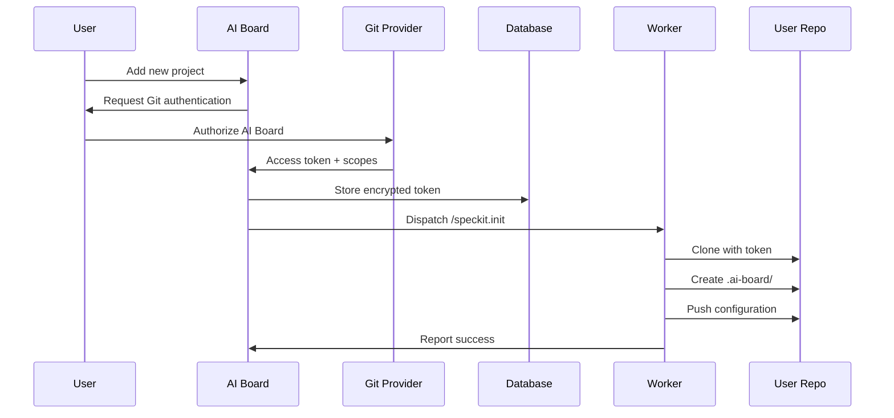

# AI Board SaaS Platform - Multi-Project & Security Architecture

## Vision Understanding

AI Board will be a **SaaS platform** where:
- Users add their own Git repositories (GitHub, GitLab, Bitbucket)
- AI Board workers execute commands on user repositories
- Each project gets initialized with AI Board configuration
- Workflows run in isolated environments per project

## Architecture Overview

```
User's Repository              AI Board SaaS Platform
┌──────────────┐              ┌────────────────────────┐
│ my-app/      │              │ Web UI (Vercel)        │
│ ├─.ai-board/ │<─────────────│ - Project management   │
│ │ ├─config.yml              │ - Ticket boards        │
│ │ ├─commands/               │ - User authentication  │
│ │ └─scripts/                └───────┬────────────────┘
│ └─src/       │                      │
└──────────────┘                      ▼
                              ┌────────────────────────┐
                              │ Job Queue (Redis)      │
                              │ - Per-project isolation│
                              │ - Priority management  │
                              └───────┬────────────────┘
                                      ▼
                              ┌────────────────────────┐
                              │ Worker Pool            │
                              │ - Clones user repos    │
                              │ - Executes Claude      │
                              │ - Pushes changes       │
                              └────────────────────────┘
```

## Phase 1: Project Initialization System

### 1.1 `/speckit.init` Command

Creates AI Board configuration in user's repository:

```bash
# When user adds new project to AI Board
/speckit.init --project-type=nextjs --language=typescript

# Generates in user's repo:
.ai-board/
├── config.yml           # Project-specific build/test commands
├── commands/            # Claude slash commands
│   ├── specify.md
│   ├── plan.md
│   └── implement.md
├── scripts/            # Project-specific scripts
│   ├── build.sh
│   ├── test.sh
│   └── deploy.sh
└── memory/             # Project context for Claude
    ├── architecture.md
    ├── conventions.md
    └── stack.md
```

### 1.2 Configuration Template System

**For JavaScript/TypeScript projects:**
```yaml
# .ai-board/config.yml
version: "1.0"
project:
  type: "nextjs"
  language: "typescript"

commands:
  install: "npm ci"
  build: "npm run build"
  test: "npm test"
  lint: "npm run lint"

ci:
  provider: "github-actions"  # or "gitlab-ci", "bitbucket-pipelines"
  branch_pattern: "{ticket_num}-{description}"
```

**For Python projects:**
```yaml
version: "1.0"
project:
  type: "django"
  language: "python"

commands:
  install: "pip install -r requirements.txt"
  build: "python manage.py collectstatic"
  test: "pytest"
  lint: "flake8"
```

## Phase 2: Security & Isolation Architecture

### 2.1 Git Provider Authentication

Each project stores encrypted credentials:

```typescript
model Project {
  id                Int      @id
  name              String
  gitProvider       String   // github, gitlab, bitbucket
  gitUrl           String   // https://github.com/user/repo

  // Encrypted credentials
  gitCredentials   Json     // Encrypted: { type: "token", value: "..." }

  // Security
  workerId         String?  // Assigned worker for isolation
  sandboxId        String?  // Container/namespace isolation
}

model GitCredential {
  id           String   @id
  projectId    Int      @unique
  provider     String   // github, gitlab, bitbucket
  tokenType    String   // pat, oauth, app
  encryptedToken String // AES-256 encrypted
  scopes       Json     // ["repo", "write"]
  expiresAt    DateTime?

  project      Project  @relation(...)
}
```

### 2.2 Worker Isolation Strategy

**Per-Project Isolation:**
```typescript
// Worker execution with project isolation
class IsolatedWorker {
  async executeJob(job: Job) {
    // 1. Create isolated workspace
    const workspace = `/workspaces/project-${job.projectId}`;

    // 2. Clone with project-specific credentials
    const creds = await decrypt(project.gitCredentials);
    await git.clone(project.gitUrl, workspace, { auth: creds });

    // 3. Load project-specific AI Board config
    const config = await loadConfig(`${workspace}/.ai-board/config.yml`);

    // 4. Execute in isolated environment
    const env = {
      PROJECT_ID: job.projectId,
      WORKSPACE: workspace,
      // No cross-project access possible
    };

    // 5. Run Claude with project context
    await claude.execute(job.command, {
      workspace,
      config,
      memory: `${workspace}/.ai-board/memory`
    });
  }
}
```

### 2.3 Authentication Flow



## Phase 3: Multi-Git Provider Support

### 3.1 Provider Abstraction Layer

```typescript
interface GitProvider {
  clone(url: string, token: string): Promise<void>;
  createBranch(name: string): Promise<void>;
  commit(message: string): Promise<void>;
  push(): Promise<void>;
  createPullRequest(title: string, body: string): Promise<string>;
}

class GitHubProvider implements GitProvider {
  // GitHub-specific implementation
}

class GitLabProvider implements GitProvider {
  // GitLab-specific implementation
}

class BitbucketProvider implements GitProvider {
  // Bitbucket-specific implementation
}

// Factory pattern for provider selection
function getGitProvider(project: Project): GitProvider {
  switch(project.gitProvider) {
    case 'github': return new GitHubProvider();
    case 'gitlab': return new GitLabProvider();
    case 'bitbucket': return new BitbucketProvider();
  }
}
```

### 3.2 Unified Workflow Execution

```yaml
# AI Board internal workflow (not in user's repo)
name: AI Board Worker Execution
jobs:
  execute:
    steps:
      - name: Get project config
        run: |
          PROJECT=$(api.getProject($PROJECT_ID))
          PROVIDER=$(echo $PROJECT | jq -r '.gitProvider')

      - name: Clone user repository
        run: |
          git-helper clone \
            --provider=$PROVIDER \
            --url=$PROJECT_URL \
            --token=$ENCRYPTED_TOKEN

      - name: Execute Claude command
        run: |
          claude-code /$COMMAND \
            --config=.ai-board/config.yml \
            --memory=.ai-board/memory/

      - name: Push changes
        run: |
          git-helper push \
            --provider=$PROVIDER \
            --branch=$TICKET_BRANCH
```

## Phase 4: Implementation Roadmap

### Week 1-2: Project Initialization
- Build `/speckit.init` command
- Create template system for different stacks
- Generate .ai-board/ structure
- Test with JavaScript, Python, Go projects

### Week 3-4: Security Implementation
- Implement credential encryption
- Build workspace isolation
- Create per-project sandboxing
- Add audit logging

### Week 5-6: Git Provider Abstraction
- Build provider interfaces
- Implement GitHub provider
- Implement GitLab provider
- Implement Bitbucket provider

### Week 7-8: Worker System (as per architecture-target-v2.md)
- Set up Redis queue with BullMQ
- Deploy workers on Railway
- Implement workspace caching (24h TTL)
- Add monitoring and observability

## Benefits of This Architecture

1. **True SaaS Model**: Users just connect repos, AI Board handles everything
2. **Security by Design**: Complete project isolation, encrypted credentials
3. **Platform Agnostic**: Works with ANY Git provider
4. **Language Agnostic**: Supports ANY programming language via config
5. **Fast Iteration**: Workspace caching for 85% faster subsequent runs
6. **Scalable**: Add workers as needed, Redis queue handles load

## Example User Journey

1. User signs up for AI Board
2. Clicks "Add Project" → enters GitHub repo URL
3. Authorizes AI Board GitHub App
4. AI Board runs `/speckit.init` → creates .ai-board/ in their repo
5. User creates ticket in AI Board UI
6. Drags to SPECIFY → Worker clones repo, runs Claude
7. Changes pushed to user's GitHub as feature branch
8. All isolated from other users' projects

## Critical Security Issues to Address

### Current Vulnerabilities

1. **Cross-Project GitHub Token Risk** ⚠️ **CRITICAL**:
   - Single `GITHUB_TOKEN` in environment used for ALL projects
   - Users could point projects to repos they don't own
   - Risk: Malicious code execution in other people's repositories

2. **Workflow Token Shared Across Projects** ⚠️ **HIGH**:
   - Single `WORKFLOW_API_TOKEN` used by all workflows
   - No project-specific validation when workflows call back
   - Workflow from Project A could potentially update tickets in Project B

3. **No Repository Ownership Verification** ⚠️ **CRITICAL**:
   - System doesn't verify users actually own the GitHub repos
   - Anyone can create a project with any `githubOwner/githubRepo`
   - Could trigger workflows in repositories they don't control

### Security Solutions

1. **Per-Project Authentication**:
   - Each project gets its own encrypted Git credentials
   - Tokens scoped to specific repositories only
   - Regular token rotation and expiry

2. **Workspace Isolation**:
   - Each project runs in isolated container/namespace
   - No shared filesystem between projects
   - Separate environment variables per project

3. **Repository Verification**:
   - Verify user has admin/write access before project creation
   - Periodic re-verification of access
   - Audit log of all operations

## Configuration-Based Workflow System

### Core Concept

Keep AI Board workflows generic, use project-specific configuration to handle different tech stacks.

### `.ai-board/config.yml` Structure

```yaml
version: "1.0"
project:
  name: "My Project"
  type: "nextjs"  # or "django", "fastapi", "rails", "spring", etc.

runtime:
  language: "node"
  version: "22.20.0"
  package_manager: "npm"  # or "yarn", "pnpm", "bun"

commands:
  install: "npm ci"
  build: "npm run build"
  test:
    unit: "npm run test:unit"
    e2e: "npx playwright test"
  lint: "npm run lint"
  format: "npm run format"

database:
  type: "postgresql"
  migration: "npx prisma migrate deploy"
  seed: "npx prisma db seed"

deploy:
  provider: "vercel"  # or "aws", "gcp", "docker", "custom"
  command: "vercel deploy --prod"
  preview: "vercel deploy"
```

### AI-Powered Configuration Generation

The `/speckit.init` command will use AI to:

1. **Analyze Repository Structure**:
   - Detect package.json, requirements.txt, go.mod, etc.
   - Identify framework files (next.config.js, django settings.py, etc.)
   - Scan for test configurations

2. **Generate Optimal Configuration**:
   - Select appropriate commands for the detected stack
   - Configure test runners and build tools
   - Set up deployment commands

3. **Create Project Memory**:
   - Document architecture patterns
   - Capture coding conventions
   - Store technology decisions

### Example: Multi-Language Support

**Node.js/Next.js Project**:
```yaml
commands:
  install: "npm ci"
  build: "next build"
  test: "vitest"
```

**Python/Django Project**:
```yaml
commands:
  install: "pip install -r requirements.txt"
  build: "python manage.py collectstatic"
  test: "pytest"
```

**Go/Gin Project**:
```yaml
commands:
  install: "go mod download"
  build: "go build -o app"
  test: "go test ./..."
```

**Ruby/Rails Project**:
```yaml
commands:
  install: "bundle install"
  build: "rails assets:precompile"
  test: "rspec"
```

## Worker System Architecture (from architecture-target-v2.md)

### Key Components

1. **Redis Queue (BullMQ)**:
   - Job persistence and retry logic
   - Priority queues per project
   - Concurrency control

2. **Worker Pool**:
   - Horizontal scaling (add workers as needed)
   - Workspace caching (24h TTL)
   - 85% faster for cached workspaces

3. **Workspace Management**:
   - Cache location: `/workspaces/project-{id}`
   - Auto-cleanup after 24h
   - Git pull for updates on cached workspaces

### Performance Targets

| Operation | Fresh Clone | Cached Workspace |
|-----------|-------------|------------------|
| specify   | 15-20s      | 3-5s            |
| plan      | 15-20s      | 3-5s            |
| implement | 20-30s      | 5-10s           |
| ai-assist | 15-20s      | 2-3s            |

### Cost Analysis

**Small Scale (10-20 tickets/day)**:
- Vercel: $0-20/month
- PostgreSQL: $0 (free tier)
- Redis: $0-10/month
- Workers: $5-10/month
- Total: $15-30/month

**Medium Scale (50-100 tickets/day)**:
- Vercel: $20/month
- PostgreSQL: $19/month
- Redis: $10/month
- Workers: $20-30/month
- Total: $99-129/month

## Next Steps

1. **Immediate Priority**: Fix security vulnerabilities
   - Implement per-project authentication
   - Add repository verification
   - Create workspace isolation

2. **Week 1-2**: Build `/speckit.init` system
   - AI-powered project analysis
   - Configuration generation
   - Memory initialization

3. **Week 3-4**: Implement worker system
   - Redis queue setup
   - Worker pool deployment
   - Workspace caching

4. **Week 5-6**: Multi-provider support
   - GitHub integration
   - GitLab integration
   - Bitbucket integration

5. **Week 7-8**: Testing & Polish
   - Security audit
   - Performance optimization
   - Documentation